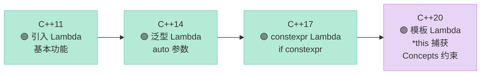

## 前言：Lambda 的进化之路

C++11 引入了 Lambda，让我们可以**就地定义匿名函数**。但用过的人都知道，老版 Lambda 有很多局限：

- **不能模板化**：同一个 Lambda 无法同时处理 `int` 和 `double`
- **捕获方式有限**：`[=]` 捕获值，`[&]` 捕获引用，但无法捕获 `*this`
- **不能在 Lambda 内部声明模板参数**

**C++20 给 Lambda 带来了革命性的升级**，本文逐一解析。

---

## 一、模板 Lambda：泛型的威力

### 1.1 旧版 Lambda 的困境

```cpp
// C++11/14/17：Lambda 不能有模板参数
auto square = [](auto x) { return x * x; };

square(3);    // ✅ int
square(3.14); // ✅ double
// 但如果我想限制 x 必须是整数？做不到！
```

### 1.2 C++20 模板 Lambda

```cpp
#include <iostream>
#include <vector>
#include <algorithm>

int main() {
    // 模板 Lambda：尖括号中声明类型参数
    auto make_pair = []<typename T, typename U>(T a, U b) {
        return std::pair{a, b};
    };
    
    auto p = make_pair(1, 3.14);
    std::cout << p.first << ", " << p.second << "\n";
    
    // initializer_list lambda
    auto vec = []<typename T>(std::initializer_list<T> init) {
        return std::vector<T>(init);
    };
    
    auto v = vec({1, 2, 3, 4, 5});
    for (auto n : v) std::cout << n << " ";
    std::cout << "\n";
}
```

**输出**：
```text
1, 3.14
1 2 3 4 5 
```

### 1.3 模板 Lambda 的语法细节

```cpp
// ✅ C++20 语法
auto f = []<typename T>(T x) { };

// ❌ C++14/17 语法（不支持）
auto f = []<typename T>(T x) { };

// ⚠️ 如果省略 template<>，则整个 lambda 是"泛型 lambda"
// 但泛型 lambda 不能显式约束类型
auto f2 = [](auto x) { };  // C++14 就支持
```

---

## 二、this 捕获的进化

### 2.1 旧版 Lambda 的 this 捕获问题

```cpp
class Widget {
    int data = 42;
    
    void process() {
        // C++14：[=] 捕获 this 指针
        // 问题：如果 Widget 被析构，Lambda 还在执行，会出问题
        auto f = [=]() {
            std::cout << data << "\n";  // 实际上是通过 this->data 访问
        };
        f();
    }
};
```

### 2.2 C++20 的 [*this] 捕获

```cpp
#include <iostream>

class Widget {
public:
    int data = 42;
    
    void process() {
        // [=, *this]：值捕获整个对象
        auto f = [=, *this]() {
            std::cout << data << "\n";  // copy of data
        };
        f();
    }
    
    void process_ref() {
        // [this]：捕获指针（危险）
        // 如果 Widget 被析构，Lambda 还在执行 -> 未定义行为
        auto f = [this]() {
            // std::cout << data << "\n";  // 危险！
        };
    }
};

int main() {
    Widget w;
    w.process();  // 42
}
```

### 2.3 捕获方式对比表

| 捕获方式 | C++ 版本 | 行为 | 安全性 |
|---------|---------|------|--------|
| `[=]` | C++11 | 值捕获 this 指针 | ⚠️ 指针语义 |
| `[&]` | C++11 | 引用捕获 this 指针 | ⚠️ 引用语义 |
| `[=, *this]` | C++20 | 值捕获整个对象副本 | ✅ 安全 |
| `[&, *this]` | C++20 | 值捕获 *this，其他引用 | ✅ 安全 |

---

## 三、constexpr Lambda 进化

### 3.1 C++17 的 constexpr Lambda

C++17 让 Lambda 可以是 `constexpr`，但能力有限：

```cpp
// C++17
constexpr auto add = [](auto a, auto b) { return a + b; };
static_assert(add(1, 2) == 3);  // ✅
```

### 3.2 C++20 的改进

C++20 进一步增强了 constexpr Lambda：

```cpp
#include <iostream>

int main() {
    // C++20：Lambda 本身可以隐式 constexpr
    constexpr auto add = [](auto a, auto b) { return a + b; };
    static_assert(add(1, 2) == 3);  // ✅
    
    // C++20：Lambda 可以在 constexpr 上下文中使用成员函数
    constexpr auto vec_size = [](auto&& v) {
        return v.size();  // C++20 前 constexpr lambda 不能调用成员
    };
    
    // 注意：这需要在常量表达式中调用
    (void)vec_size;  // 抑制未使用警告
}
```

---

## 四、泛型 Lambda + Concepts

### 4.1 用 Concepts 约束模板 Lambda

C++20 允许在模板 Lambda 中使用 Concepts：

```cpp
#include <iostream>
#include <concepts>

int main() {
    // 约束 T 必须是整数类型
    auto print_integral = []<std::integral T>(T n) {
        std::cout << n << " (integral)\n";
    };
    
    print_integral(42);  // ✅
    // print_integral(3.14);  // ❌ 编译错误：double 不满足 integral
}
```

### 4.2 组合 Concepts

```cpp
#include <iostream>
#include <concepts>

int main() {
    // 组合约束：既要能加，也要能比较
    auto process_num = []<typename T>(
        std::integral<T> || std::floating_point<T>
    )(T a, T b) {
        std::cout << "sum: " << a + b << "\n";
    };
    
    process_num(1, 2);       // ✅
    process_num(1.5, 2.5);   // ✅
    // process_num("a", "b"); // ❌
}
```

---

## 五、嵌套 Lambda

### 5.1 模板 Lambda 嵌套

```cpp
#include <iostream>

int main() {
    // 外层模板 Lambda
    auto make_calculator = []<typename T>(T x) {
        // 内层普通 Lambda
        return [x](auto op, auto y) {
            if constexpr (op == '+') return x + y;
            else if constexpr (op == '-') return x - y;
            else return T{};
        };
    };
    
    auto calc = make_calculator(10);
    std::cout << calc('+', 5) << "\n";   // 15
    std::cout << calc('-', 3) << "\n";   // 7
}
```

### 5.2 高阶函数模式

```cpp
#include <iostream>
#include <vector>
#include <algorithm>

int main() {
    // 返回函数的 Lambda
    auto make_filter = []<typename T>(T threshold) {
        return [threshold](T x) { return x > threshold; };
    };
    
    std::vector<int> nums{1, 5, 3, 8, 2, 9};
    auto it = std::ranges::find_if(nums, make_filter(4));
    
    if (it != nums.end()) {
        std::cout << "Found: " << *it << "\n";  // 5
    }
}
```

---

## 六、完整编译示例

```cpp
#include <iostream>
#include <vector>
#include <ranges>
#include <algorithm>
#include <concepts>

int main() {
    // 模板 Lambda (C++20)
    auto make_pair = []<typename T, typename U>(T a, U b) {
        return std::pair{a, b};
    };
    auto p = make_pair(1, 3.14);
    std::cout << p.first << ", " << p.second << "\n";
    
    // initializer_list lambda
    auto vec = []<typename T>(std::initializer_list<T> init) {
        return std::vector<T>(init);
    };
    auto v = vec({1, 2, 3, 4, 5});
    
    // [=, *this] 捕获
    class Widget {
    public:
        int data = 42;
        void process() {
            auto f = [=, *this]() {
                std::cout << data << "\n";  // copy of *this
            };
            f();
        }
    };
    
    Widget w;
    w.process();
    
    // constexpr lambda
    constexpr auto add = [](auto a, auto b) { return a + b; };
    static_assert(add(1, 2) == 3);
    
    // 泛型lambda with concept
    auto print_integral = []<std::integral T>(T n) {
        std::cout << n << " (integral)\n";
    };
    print_integral(42);
}
```

**运行结果**：
```text
1, 3.14
42
42 (integral)
```

---

## 七、Lambda 演进时间线



---

## 八、常见错误与避坑

### 8.1 模板 Lambda 不能有默认参数

```cpp
// ❌ 错误
auto f = []<typename T = int>(T x = 0) { };  // C++20 不支持！

// ✅ 正确：默认值在调用时指定
auto f = []<typename T>(T x = T{}) { };
```

### 8.2 [*this] vs [=] 的生命周期

```cpp
class Connection {
    std::string name = "conn";
public:
    void onDisconnect() {
        // ❌ 危险：[this] 捕获了指针
        auto callback = [this]() {
            // 如果 this 已经被析构，这里是未定义行为！
            // std::cout << name << "\n";
        };
    }
    
    void safeOnDisconnect() {
        // ✅ 安全：[*this] 捕获了对象的副本
        auto callback = [=, *this]() {
            // name 是副本，永远有效
            std::cout << name << "\n";
        };
    }
};
```

### 8.3 mutable Lambda 与模板

```cpp
int main() {
    int x = 0;
    
    // mutable 不影响模板参数推断
    auto increment = [x]<typename T>(T y) mutable {
        x = 10;  // 修改捕获的副本
        return x + y;
    };
    
    std::cout << increment(5) << "\n";  // 15
}
```

---

## 九、性能 considerations

Lambda 的性能**零成本抽象**——在编译期会被内联，没有额外运行时开销。

```cpp
#include <iostream>
#include <chrono>

int main() {
    auto start = std::chrono::high_resolution_clock::now();
    
    // 多次调用 Lambda
    auto add = [](int a, int b) { return a + b; };
    for (int i = 0; i < 1'000'000; ++i) {
        volatile auto result = add(i, i + 1);
    }
    
    auto end = std::chrono::high_resolution_clock::now();
    auto duration = std::chrono::duration_cast<std::chrono::microseconds>(end - start);
    
    std::cout << "Time: " << duration.count() << " us\n";
}
```

**结论**：Lambda 在性能上等价于手写的普通函数。

---

## 十、总结

| 特性 | C++ 版本 | 说明 |
|------|---------|------|
| `[]<typename T>(T x) {}` | C++20 | 模板 Lambda |
| `[=, *this]` | C++20 | 值捕获整个对象 |
| `[&, *this]` | C++20 | 混合捕获，*this 值捕获 |
| `constexpr` Lambda | C++17+ | 常量表达式 Lambda |
| `[]<Concept T>(T x) {}` | C++20 | 带约束的模板 Lambda |
| `auto f = [](auto... args) {}` | C++17+ | 变参模板 Lambda |

> **记住**：C++20 的 Lambda 已经成为了一个**真正的泛型函数对象**，拥有了与普通函数几乎等价的能力，同时保持了匿名函数的简洁性。学会用模板 Lambda，你会写出更简洁、更安全的泛型代码。
---

## 📚 C++20 新特性 系列导航

> 本文是《C++20 新特性》系列第 **4/7** 篇。

| 方向 | 章节 |
|:--|:--|
| ◀ 上一篇 | [（三）Spaceship Operator](/2026/04/23/2026-04-24-cpp20-spaceship-operator/) |
| 下一篇 ▶ | [（五）consteval 与 constinit](/2026/04/23/2026-04-24-cpp20-consteval-constinit/) |

<details>
<summary>📖 全部 7 篇目录（点击展开）</summary>

1. [（一）Concepts](/2026/04/23/2026-04-24-cpp20-concepts/)
2. [（二）requires 表达式](/2026/04/23/2026-04-24-cpp20-requires/)
3. [（三）Spaceship Operator](/2026/04/23/2026-04-24-cpp20-spaceship-operator/)
4. [（四）Lambda 加强](/2026/04/23/2026-04-24-cpp20-lambda/) **← 当前**
5. [（五）consteval 与 constinit](/2026/04/23/2026-04-24-cpp20-consteval-constinit/)
6. [（六）Coroutine 协程](/2026/04/23/2026-04-24-cpp20-coroutine/)
7. [（七）Ranges 库](/2026/04/23/2026-04-24-cpp20-ranges/)

</details>

本章讲 C++20 的 lambda 增强（template lambda、capture `*this`、pack 展开），对比维度：本特性 vs C++14/17 lambda vs 其他语言 lambda。

## 对比分析

### 一、本特性 vs 旧写法

| 维度 | C++20 写法 | C++14/17 写法 | 影响 |
|------|------------|----------------|------|
| 模板 lambda | `[]<class T>(T x){...}` | `[](auto x){...}`（无法再用 T 显式） | 类型可在 lambda 内再用 |
| 捕获 `*this` | `[=, *this]{...}` | `[=]{...}` 捕获 this 指针 | 按值捕获对象副本 |
| constexpr lambda | 默认 constexpr（C++17 起，C++20 放宽） | C++17 起部分场景 | 编译期调用更自然 |
| pack 展开 | `[](auto... args){ (std::cout << ... << args); }` | C++17 fold 已可用 | 与 fold 配合更强 |

### 二、对比其他语言

| 语言 | lambda 模板 | 捕获语义 | 备注 |
|------|--------------|----------|------|
| C++20 | ✅ template lambda | 灵活（值 / 引用 / `*this`） | 最复杂 |
| C++14 | ❌ 仅 auto | 灵活 | |
| Java | ❌ 无类型参数 | effectively final | 较受限 |
| Python | ❌ | 引用闭包 | 简单但有坑 |
| Rust | ✅ 闭包 trait | move / borrow | 显式所有权 |

### 三、优缺点

优点：
- 让 lambda 真正"像模板函数"
- 与 fold / if constexpr 配合写元编程更直接

缺点：
- 写法变多，旧代码阅读门槛上升

### 四、何时选

- 写工具函数 / 容器算法：默认 lambda + auto
- 需要类型再加工：用 template lambda
