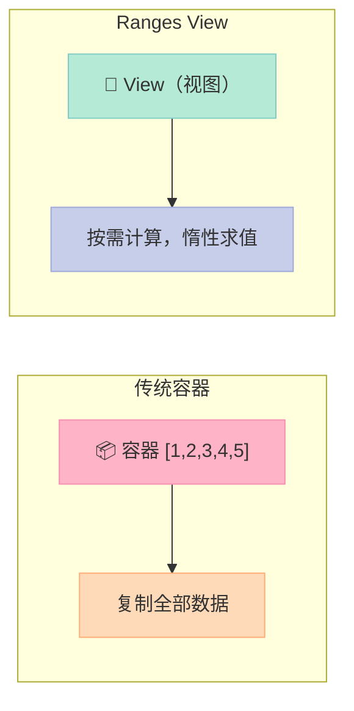
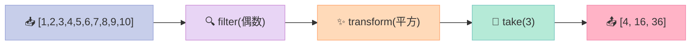

> **STL 算法 + Ranges 视图 = 代码即管道，数据流即表达式。**

## 前言

你写过这样的代码吗？

```cpp
std::vector<int> nums = {1,2,3,4,5,6,7,8,9,10};
std::vector<int> result;
std::copy_if(nums.begin(), nums.end(), std::back_inserter(result),
    [](int n){ return n % 2 == 0; });
std::transform(result.begin(), result.end(), result.begin(),
    [](int n){ return n * n; });
result.resize(3);
```

五层嵌套，变量传来传去，调试的时候根本不知道数据流向了哪里。

**C++20 Ranges 库**用管道操作符（`|`）重新定义了算法组合方式，让代码变成**数据流的声明式描述**。

## 一、Ranges 核心概念

### 1.1 View：惰性求值的序列

Ranges 的核心是 **View**——一种**惰性求值**（Lazy Evaluation）的序列：

- 不像容器一次性分配所有内存
- 按需计算，只有迭代时才产生元素
- 可以无限（Infinite），如 `iota`



### 1.2 管道操作符：`|`

Ranges 最大的创新是**管道操作符** `|`，将多个操作串联成链：

```cpp
// 原：嵌套调用
auto result = take(transform(filter(nums, pred), func), n);

// 新：管道风格
auto result = nums | filter(pred) | transform(func) | take(n);
```

**读法**：数据从左向右"流"过每个变换，像 shell 的管道。

## 二、常用视图操作

```cpp
#include <iostream>
#include <vector>
#include <ranges>
#include <algorithm>

namespace rv = std::views;

int main() {
    std::vector<int> nums = {1,2,3,4,5,6,7,8,9,10};
    
    // Ranges: 惰性求值，管道组合
    auto result = nums 
        | rv::filter([](int n) { return n % 2 == 0; })
        | rv::transform([](int n) { return n * n; })
        | rv::take(3);
    
    for (int n : result) {
        std::cout << n << " ";  // 4 16 36
    }
    std::cout << "\n";
    
    // views::iota: 无限序列
    auto squares = rv::iota(1)
        | rv::transform([](int n) { return n * n; })
        | rv::take(5);
    
    for (int s : squares) std::cout << s << " ";  // 1 4 9 16 25
    std::cout << "\n";
    
    // reverse, drop, take
    for (int n : nums | rv::reverse | rv::drop(3) | rv::take(4)) {
        std::cout << n << " ";  // 10 9 8 7
    }
    std::cout << "\n";
    
    // all + common
    auto v = nums | rv::common;
    std::sort(v.begin(), v.end());
}
```

### 2.1 filter：过滤

```cpp
auto evens = nums | rv::filter([](int n){ return n % 2 == 0; });
```

### 2.2 transform：转换

```cpp
auto squared = nums | rv::transform([](int n){ return n * n; });
```

### 2.3 take / drop：截取

```cpp
auto first5 = nums | rv::take(5);   // 前5个
auto rest = nums | rv::drop(3);     // 跳过前3个
```

### 2.4 reverse：反转

```cpp
auto reversed = nums | rv::reverse;
```

### 2.5 iota：无限序列

```cpp
// 生成无限序列：1, 2, 3, 4, 5, ...
auto naturals = rv::iota(1);
// 配合 take 限制数量
auto first100 = rv::iota(1) | rv::take(100);
```

### 2.6 all + common：兼容旧代码

```cpp
// std::views::all 将容器转为 view
auto v = nums | rv::common;  // 转为可与旧算法交互的视图
std::sort(v.begin(), v.end());
```

## 三、视图组合示意



## 四、Ranges vs 传统 STL

| 维度 | 传统 STL | Ranges |
|------|----------|--------|
| **组合方式** | 嵌套函数调用 | 管道操作符 `|` |
| **求值时机** | 即时（容器） | 惰性（视图） |
| **代码风格** | 命令式 | 声明式 |
| **可读性** | 一般 | ✅ 优秀 |
| **性能** | 即时分配 | ✅ 按需计算 |
| **适用场景** | 简单操作 | 复杂数据流 |

## 五、实际应用场景

### 5.1 数据清洗管道

```cpp
auto clean_data = raw_data 
    | rv::filter([](auto& r){ return r.valid; })
    | rv::transform([](auto& r){ return r.value; })
    | rv::drop(100)
    | rv::take(50);
```

### 5.2 无限序列处理

```cpp
// 生成斐波那契数列
auto fib = rv::iota(0) | rv::transform([](int n){
    // 复杂逻辑
});
```

### 5.3 字符串处理

```cpp
using namespace std::ranges::views;
auto words = text 
    | split(' ') 
    | transform(to_lower);
```

## 六、注意事项

1. **Views 不存储数据**：迭代器失效后 view 不可用
2. **不是所有操作都返回 view**：`to_vector` 等终端操作会实例化容器
3. **编译时间**：复杂管道会增加编译时间，但运行时性能通常更好

## 结论与建议

> **Ranges 让数据流变成了代码的第一公民**，`|` 操作符将算法串联成可读性极高的管道。

**什么时候用 Ranges**：
- 数据处理链超过 2 个步骤
- 需要惰性求值避免不必要计算
- 无限序列操作

**什么时候用传统 STL**：
- 简单的一次性操作
- 需要存储结果供后续使用
- 编译时间敏感的场景

**下一步**：学习 `std::ranges::to`（C++23 将容器转换写为 `vec | to<std::vector>`），以及 Ranges 与协程的结合使用。

> **记住**：Ranges 不是替代 STL 算法，而是**增强**。你的 `std::sort`、`std::accumulate` 依然有效，只是数据流的**上游**可以使用 Ranges 优雅地组合。