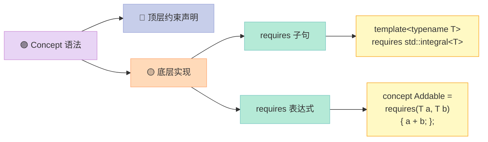

## 前言：requires 是什么？

如果说 Concepts 是 C++20 约束的**顶层语法**，那么 `requires` 就是它的**底层引擎**。你可以在 `requires` 子句中使用 Concept，也可以在 `requires` 表达式中用更自由的方式定义约束。

**本文重点**：深入解析 `requires` 表达式——一种在编译期**检查类型能力**的 DSL（领域特定语言）。

---

## 一、两种 requires：你分得清吗？

C++20 引入了 `requires` 的两种用法，它们看起来相似，但本质不同：

### 1.1 requires 子句（requires Clause）

放在模板参数列表后、函数声明前，**筛选**是否启用该模板：

```cpp
template<typename T>
    requires std::integral<T>  // ✅ requires 子句
void func(T n) { }
```

### 1.2 requires 表达式（requires Expression）

放在 concept 定义或函数体中，**检查**某个表达式是否对给定类型合法：

```cpp
template<typename T>
concept Addable = requires(T a, T b) {  // ✅ requires 表达式
    a + b;
};
```

**一句话区分**：requires 子句是"条件"，requires 表达式是"检查"。

---

## 二、requires 表达式详解

### 2.1 基本语法

```cpp
requires (parameter-list) { 
    requirements 
}
```

- **简单形式** `requires { expr; }`——检查表达式是否合法
- **带参数形式** `requires(T a, T b) { a + b; }`——使用具体参数检查
- **复合形式** `requires(T a) { { *a } -> convertible_to<void>; }`——检查表达式及其属性

### 2.2 简单约束示例

```cpp
#include <iostream>
#include <concepts>
#include <type_traits>

// requires 表达式：检查类型是否支持 + 和 - 运算
template<typename T>
concept Addable = requires(T a, T b) {
    a + b;    // 只需要表达式合法，不需要了解返回类型
    a - b;    // 多个原子约束，用分号分隔
};

// requires 表达式：检查 spaceship operator 的返回类型
template<typename T>
concept Comparable = requires(T a, T b) {
    { a <=> b } -> std::convertible_to<int>;
};

int main() {
    static_assert(Addable<int>);           // ✅
    static_assert(Addable<double>);        // ✅
    // static_assert(Addable<std::string>); // ❌ 编译失败
    
    static_assert(Comparable<int>);        // ✅
}
```

### 2.3 原子约束（Atomic Constraints）

`requires` 表达式中的每个**简单表达式**就是一个**原子约束**。编译器会独立检查每个原子约束。

```cpp
template<typename T>
concept Addable = requires(T a, T b) {
    a + b;       // 原子约束 1
    a - b;       // 原子约束 2
    a * b;       // 原子约束 3
};
```

**原子约束的特点**：
1. **独立求值**：每个原子约束失败不会影响其他约束
2. **不包含控制流**：只能是表达式，不能是 `if`、`for` 等语句
3. **惰性求值**：只有在模板实例化时才会检查

---

## 三、约束组合与优先级

### 3.1 使用 `&&` 和 `||` 组合 Concept

```cpp
#include <concepts>

// 组合约束：既要能加，也要能比较
template<typename T>
concept AddableAndComparable = Addable<T> && Comparable<T>;

// 或运算：整数或浮点
template<typename T>
concept Numeric = std::integral<T> || std::floating_point<T>;
```

### 3.2 requires 子句中的约束组合

```cpp
template<typename T>
    requires Addable<T> && Comparable<T>
void process(T v) { /* ... */ }

// 使用括号明确优先级
template<typename T>
    requires (std::integral<T> || std::floating_point<T>)
void process_numeric(T v) { /* ... */ }
```

---

## 四、实战：带约束的函数重载

### 4.1 基于 Concept 的重载分派

```cpp
#include <iostream>
#include <concepts>

// 整数处理重载
template<std::integral T>
void process(T v) { 
    std::cout << "integral: " << v << "\n"; 
}

// 浮点处理重载
template<std::floating_point T>
void process(T v) { 
    std::cout << "floating: " << v << "\n"; 
}

// 字符串处理重载
template<std::same_as<std::string>>
void process(std::string v) { 
    std::cout << "string: " << v << "\n"; 
}

int main() {
    process(42);           // integral: 42
    process(3.14);         // floating: 3.14
    process(std::string("hello"));  // string: hello
}
```

### 4.2 partial specialization + requires

```cpp
#include <iostream>
#include <concepts>
#include <type_traits>

// 基础模板
template<typename T, typename = void>
struct Serializer {
    static void serialize(T val) {
        std::cout << "generic: " << val << "\n";
    }
};

// 只有整数类型启用这个特化
template<typename T>
struct Serializer<T, std::enable_if_t<std::integral<T>>> {
    static void serialize(T val) {
        std::cout << "integer: " << val << "\n";
    }
};

// 只有浮点类型启用这个特化
template<typename T>
struct Serializer<T, std::enable_if_t<std::floating_point<T>>> {
    static void serialize(T val) {
        std::cout << "float: " << val << "\n";
    }
};

int main() {
    Serializer<int>::serialize(42);      // integer: 42
    Serializer<double>::serialize(3.14); // float: 3.14
    Serializer<std::string>::serialize("hi"); // generic: hi
}
```

**注意**：C++20 的 `requires` 子句让 partial specialization 的约束更加直观：

```cpp
template<typename T>
    requires std::integral<T>
struct Serializer<T> {
    // 整数特化...
};
```

---

## 五、复合约束：检查表达式属性

### 5.1 约束继承（Constraint Checking）

```cpp
#include <iostream>
#include <concepts>

// 检查解引用操作
template<typename T>
concept Dereferenceable = requires(T p) {
    { *p } -> std::convertible_to<typename T::value_type>;
};

// 检查容器性质
template<typename T>
concept Container = requires(T c) {
    { c.begin() } -> std::input_iterator;
    { c.end() } -> std::input_iterator;
    { c.size() } -> std::integral;
};
```

### 5.2 嵌套要求（Nested Requirements）

```cpp
#include <iostream>
#include <concepts>
#include <type_traits>

// 更复杂的约束：T 必须同时满足以下条件
template<typename T>
concept ComplexNumber = requires(T a, T b) {
    // 1. 必须能相加
    { a + b } -> std::convertible_to<T>;
    // 2. 必须能相减
    { a - b } -> std::convertible_to<T>;
    // 3. 必须有实部概念（通过成员类型）
    typename T::real_type;
    requires std::floating_point<typename T::real_type>;
};
```

---

## 六、requires 表达式的求值规则

### 6.1 何时求值？

`requires` 表达式是**惰性求值**的——只有在模板实例化时，约束被检查时才会真正求值。

```cpp
template<typename T>
concept Bad = requires(T x) {
    x.nonExistentMethod();  // 只有当实例化 Bad<T> 时才会检查
};

int main() {
    // 下面这行编译通过！因为 Bad<int> 没有被实例化
    Bad<int>* p = nullptr;
    
    // 下面这行编译失败！
    // static_assert(Bad<int>);  // ❌ int 没有 nonExistentMethod
}
```

### 6.2 SFINAE 友好的约束检查

```cpp
#include <iostream>
#include <concepts>

// 尝试提取 value_type，如果不存在则 concept 为 false
template<typename T>
concept HasValueType = requires {
    typename T::value_type;
};

// 这个函数只有在 T 有 value_type 时才会参与重载
template<HasValueType T>
void print_type_info() {
    std::cout << "has value_type\n";
}

// 泛型版本，对所有类型都可用
template<typename T>
void print_type_info() {
    std::cout << "no value_type\n";
}

int main() {
    print_type_info<int>();              // no value_type
    print_type_info<std::vector<int>>(); // has value_type
}
```

---

## 七、常见错误与避坑指南

### 7.1 约束检查的"短路"行为

```cpp
template<typename T>
concept Weird = requires(T a) {
    a.f();      // 如果这行失败，不会继续检查
    a.g();      // 
};
```

**问题**：如果 `a.f()` 失败，后续约束不会被检查。

### 7.2 类型区分 vs 值区分

```cpp
// 类型要求：必须存在嵌套类型
template<typename T>
concept HasValueType = requires {
    typename T::value_type;
};

// 值要求：必须有某个成员变量
template<typename T>
concept HasValue = requires(T obj) {
    obj.value;
};
```

---

## 八、与 Concepts 的关系



---

## 九、完整的编译示例

```cpp
#include <iostream>
#include <concepts>
#include <type_traits>

// requires 表达式定义 concept
template<typename T>
concept Addable = requires(T a, T b) {
    a + b;    // 只需要表达式合法
    a - b;    // 多个原子约束
};

template<typename T>
concept Comparable = requires(T a, T b) {
    { a <=> b } -> std::convertible_to<int>;
};

// 带约束的函数重载
template<std::integral T>
void process(T v) { std::cout << "integral: " << v << "\n"; }

template<std::floating_point T>
void process(T v) { std::cout << "floating: " << v << "\n"; }

// conditional explicit
template<typename T>
struct Wrapper {
    static_assert(std::is_integral_v<T>, "T must be integral");
    T value;
};

int main() {
    process(42);
    process(3.14);
    
    static_assert(Addable<int>);
    // 注意：std::string 实际上有 + 运算符，所以这里会通过
    static_assert(Addable<std::string>);
}
```

**运行结果**：
```text
integral: 42
floating: 3.14
```

---

## 十、总结

| 特性 | requires 子句 | requires 表达式 |
|------|---------------|-----------------|
| 位置 | 模板参数列表后 | concept 定义或函数体 |
| 作用 | 筛选是否启用模板 | 检查类型能力 |
| 返回值 | 布尔值 | 布尔值 |
| 组合 | `&&` `\|\|` | `&&` `\|\|` |

> **记住**：`requires` 表达式是 C++20 约束系统的"显微镜"——它让你在编译期观察类型的每一个"能力"，并据此做出精确的分派决策。
---

## 📚 C++20 新特性 系列导航

> 本文是《C++20 新特性》系列第 **2/7** 篇。

| 方向 | 章节 |
|:--|:--|
| ◀ 上一篇 | [（一）Concepts](/2026/04/23/2026-04-24-cpp20-concepts/) |
| 下一篇 ▶ | [（三）Spaceship Operator](/2026/04/23/2026-04-24-cpp20-spaceship-operator/) |

<details>
<summary>📖 全部 7 篇目录（点击展开）</summary>

1. [（一）Concepts](/2026/04/23/2026-04-24-cpp20-concepts/)
2. [（二）requires 表达式](/2026/04/23/2026-04-24-cpp20-requires/) **← 当前**
3. [（三）Spaceship Operator](/2026/04/23/2026-04-24-cpp20-spaceship-operator/)
4. [（四）Lambda 加强](/2026/04/23/2026-04-24-cpp20-lambda/)
5. [（五）consteval 与 constinit](/2026/04/23/2026-04-24-cpp20-consteval-constinit/)
6. [（六）Coroutine 协程](/2026/04/23/2026-04-24-cpp20-coroutine/)
7. [（七）Ranges 库](/2026/04/23/2026-04-24-cpp20-ranges/)

</details>

本章讲 C++20 的 requires 表达式与约束子句，对比维度：本特性 vs C++17 SFINAE / C++20 concepts 旧写法 vs 其他语言约束。

## 对比分析

### 一、本特性 vs 旧写法

| 维度 | C++20 requires | C++17 SFINAE | C++20 Concepts |
|------|-----------------|--------------|----------------|
| 表达式形式 | `requires (T x) { x.foo(); }` | `void_t` 探测 | 命名约束 concept |
| 子句形式 | `template<class T> requires std::integral<T> void f(T)` | enable_if | `template<std::integral T>` |
| 可读性 | 接近自然语言 | 较差 | 最佳 |
| 错误信息 | 明确指出哪个表达式不满足 | 一长串 | 概念名 + 表达式 |

### 二、对比其他语言

| 语言 | 约束 / 接口 | 备注 |
|------|-------------|------|
| C++20 | requires / concept | 编译期 |
| Rust | trait bound | `T: Trait` |
| Haskell | class constraint | 最强 |
| Java | bounded generics | `<T extends X & Y>` |
| TypeScript | generic constraint | `extends` |

### 三、优缺点

优点：
- 比 SFINAE 直观很多
- 与 concept 协同设计

缺点：
- 单独使用时不一定要比 concept 更简洁

### 四、何时选

- 局部约束 / 内联表达：requires
- 复用约束 / 公共 API：concept
