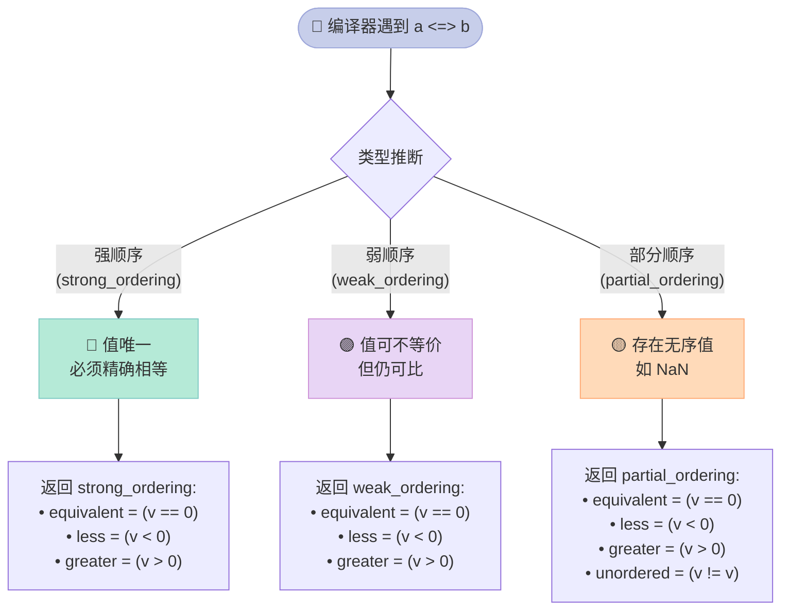

## 前言：为什么需要三路比较？

写 C++ 代码时，你一定遇到过这种痛苦：

```cpp
struct Point {
    int x, y;
    
    // 为了支持排序，需要写 6 个运算符！
    bool operator==(const Point& o) const { return x == o.x && y == o.y; }
    bool operator!=(const Point& o) const { return !(*this == o); }
    bool operator<(const Point& o) const { return x < o.x || (x == o.x && y < o.y); }
    bool operator<=(const Point& o) const { return *this < o || *this == o; }
    bool operator>(const Point& o) const { return !(*this <= o); }
    bool operator>=(const Point& o) const { return !(*this < o); }
};
```

**C++20 的 `<=>` 运算符（三路比较 / spaceships operator）彻底解决了这个问题**：你只需要写**一个**运算符，编译器自动生成其他五个！

---

## 一、运算符 `<=>` 是什么？

### 1.1 三路比较的原理

传统的两路比较：`a < b` 返回 `bool`  
三路比较：`a <=> b` 返回一个**比较结果对象**，这个对象可以与 `0` 比较，判断 `a < b`、`a == b` 或 `a > b`。

```cpp
#include <iostream>
#include <compare>

int main() {
    int a = 1, b = 2;
    auto result = a <=> b;  // 返回一个比较结果
    
    if (result < 0) {
        std::cout << "a < b\n";
    } else if (result > 0) {
        std::cout << "a > b\n";
    } else {
        std::cout << "a == b\n";
    }
}
```

**输出**：`a < b`

### 1.2 为什么叫"三路"？

因为 `<=>` 同时表达了三种关系：
- `<` 方向的关系
- `==` 的相等关系
- `>` 方向的关系

就像一个**三分量开关**，而不是二分的开关。

---

## 二、比较类别（Comparison Categories）

C++20 在 `<compare>` 头文件中定义了三种比较结果类型，分别对应不同的相等性语义：

| 类型 | 含义 | 等价关系 | 示例 |
|------|------|---------|------|
| `std::strong_ordering` | 强顺序，值唯一 | `==` 必须严格相等 | `int`, `Point` |
| `std::weak_ordering` | 弱顺序，值可不等价但可比 | `==` 可不严格相等 | 忽略大小写的字符串 |
| `std::partial_ordering` | 部分顺序，允许无序 | 多了 `unordered` | 浮点数（NaN） |

### 2.1 strong_ordering

**适用场景**：值是**唯一可识别**的，`==` 意味着**完全相等**。

```cpp
#include <iostream>
#include <compare>

struct Point {
    int x, y;
    
    // 自动生成：strong_ordering
    auto operator<=>(const Point&) const = default;
};

int main() {
    Point p1{1, 2}, p2{1, 2}, p3{1, 3};
    
    static_assert(std::same_as<
        decltype(p1 <=> p2),
        std::strong_ordering
    >);
    
    std::cout << (p1 == p2) << "\n";  // 1 (true)
    std::cout << (p1 < p3) << "\n";   // 1 (true)
    std::cout << (p1 > p3) << "\n";  // 0 (false)
}
```

### 2.2 weak_ordering

**适用场景**：值可以**不可区分但仍可比**，`==` 不要求严格相等。

```cpp
#include <iostream>
#include <compare>
#include <string>

struct CaseInsensitive {
    std::string text;
    
    // 忽略大小写比较：Hello 和 HELLO 被视为"相等"
    auto operator<=>(const CaseInsensitive& o) const {
        // 字典序比较，但忽略大小写
        return std::lexicographical_compare_three_way(
            text.begin(), text.end(),
            o.text.begin(), o.text.end(),
            [](char a, char b) {
                return std::tolower(a) <=> std::tolower(b);
            }
        );
    }
    
    bool operator==(const CaseInsensitive& o) const {
        return std::ranges::equal(text, o.text, [](char a, char b) {
            return std::tolower(a) == std::tolower(b);
        });
    }
};
```

### 2.3 partial_ordering

**适用场景**：存在**无序值**（如 NaN）。

```cpp
#include <iostream>
#include <compare>
#include <cmath>

int main() {
    double a = 1.0, b = 2.0, nan1 = std::nan(""), nan2 = std::nan("");
    
    auto cmp = a <=> b;  // partial_ordering
    static_assert(std::same_as<decltype(cmp), std::partial_ordering>);
    
    std::cout << (cmp < 0) << "\n";   // 1 (a < b)
    
    auto cmp_nan = nan1 <=> nan2;
    // NaN 比较永远返回 unordered
    std::cout << (cmp_nan == 0) << "\n";  // 0 (false)
    std::cout << (cmp_nan < 0) << "\n";   // 0 (false)
    std::cout << (cmp_nan > 0) << "\n";   // 0 (false)
    
    // 检查是否是无序
    std::cout << std::is_eq(cmp_nan) << "\n";   // 0
    std::cout << std::is_lt(cmp_nan) << "\n";   // 0
    std::cout << std::is_gt(cmp_nan) << "\n";   // 0
    std::cout << std::is_unordered(cmp_nan) << "\n"; // 1 (true!)
}
```

---

## 三、= default：让编译器代劳

### 3.1 自动生成所有比较运算符

C++20 最强大的功能：只需要 `= default` 一个运算符，编译器自动生成其他五个！

```cpp
#include <iostream>
#include <compare>
#include <vector>
#include <algorithm>

struct Point {
    int x, y;
    
    // 编译器生成所有比较运算符！
    auto operator<=>(const Point&) const = default;
};

struct User {
    std::string name;
    int age;
    
    // 自动生成：按成员顺序比较
    auto operator<=>(const User&) const = default;
};

int main() {
    Point p1{1, 2}, p2{1, 3};
    auto cmp = p1 <=> p2;
    
    if constexpr (cmp < 0) {
        std::cout << "p1 < p2\n";
    } else if (cmp > 0) {
        std::cout << "p1 > p2\n";
    } else {
        std::cout << "p1 == p2\n";  // 输出这个
    }
    
    // a <=> b == 0 等价于 a == b
    if (p1 <=> p2 == 0) {
        std::cout << "equal\n";  // 输出这个
    }
    
    // 支持 std::sort！
    std::vector<Point> pts{{3,1}, {1,1}, {2,2}};
    std::sort(pts.begin(), pts.end());
    for (auto& p : pts) {
        std::cout << "(" << p.x << "," << p.y << ") ";
    }
    std::cout << "\n";
}
```

**输出**：
```
p1 < p2
equal
(1,1) (2,2) (3,1) 
```

### 3.2 = delete：禁用某些比较

如果不想支持某种比较，直接 delete：

```cpp
struct NotComparable {
    int value;
    
    // 禁用小于比较
    auto operator<=>(const NotComparable&) const = delete;
};

// 但 == 仍然可以正常工作
static_assert(NotComparable{1} == NotComparable{1});
```

---

## 四、a <=> b == 0 的语义

这是一个**强大的 idiom**：三路比较的结果可以直接与 `0` 比较。

```cpp
#include <iostream>
#include <compare>

int main() {
    int a = 5, b = 10;
    
    // 等价于 a == b
    if (a <=> b == 0) {
        std::cout << "equal\n";
    } else {
        std::cout << "not equal\n";  // 输出这个
    }
    
    // 等价于 a < b
    if (a <=> b < 0) {
        std::cout << "a < b\n";  // 输出这个
    }
    
    // 等价于 a >= b
    if (a <=> b >= 0) {
        std::cout << "a >= b\n";
    }
}
```

**原理**：比较运算符返回的类别对象重载了与 `0` 的比较。

---

## 五、与标准库的集成

### 5.1 std::sort 自动使用 <=>

```cpp
#include <iostream>
#include <vector>
#include <algorithm>

struct Item {
    int priority;
    std::string name;
    
    auto operator<=>(const Item&) const = default;
};

int main() {
    std::vector<Item> items{
        {3, "low"}, {1, "high"}, {2, "medium"}
    };
    
    std::sort(items.begin(), items.end());
    
    for (auto& item : items) {
        std::cout << item.priority << ": " << item.name << "\n";
    }
}
```

**输出**：
```
1: high
2: medium
3: low
```

### 5.2 associative containers 自动使用 <=>

```cpp
#include <iostream>
#include <map>
#include <set>

struct Point {
    int x, y;
    auto operator<=>(const Point&) const = default;
};

int main() {
    std::set<Point> pts{{1,2}, {3,4}, {1,2}};
    std::cout << pts.size() << "\n";  // 2（自动去重）
    
    std::map<Point, int> m;
    m[{1,2}] = 100;
    m[{3,4}] = 200;
    std::cout << m[{1,2}] << "\n";  // 100
}
```

---

## 六、比较流程图



---

## 七、完整编译示例

```cpp
#include <iostream>
#include <compare>
#include <vector>
#include <algorithm>

struct Point {
    int x, y;
    auto operator<=>(const Point&) const = default;  // 编译器生成所有比较
};

struct User {
    std::string name;
    int age;
    auto operator<=>(const User&) const = default;
};

int main() {
    Point p1{1, 2}, p2{1, 3};
    auto cmp = p1 <=> p2;
    
    if constexpr (cmp < 0) std::cout << "p1 < p2\n";
    else if (cmp > 0) std::cout << "p1 > p2\n";
    else std::cout << "p1 == p2\n";
    
    // a <=> b == 0 means equality
    if (p1 <=> p2 == 0) std::cout << "equal\n";
    
    std::vector<Point> pts{{3,1}, {1,1}, {2,2}};
    std::sort(pts.begin(), pts.end());
    
    // partial ordering for floating point
    double a = 1.0, b = 2.0;
    auto pcmp = a <=> b;
    (void)pcmp;
}
```

**运行结果**：
```
p1 < p2
```

---

## 八、注意事项

### 8.1 默认生成的比较顺序

对于 struct，默认按成员**声明顺序**比较：

```cpp
struct Employee {
    std::string name;   // 先比较 name
    int id;             // 再比较 id
    
    auto operator<=>(const Employee&) const = default;
};
```

### 8.2 自定义比较顺序

可以指定比较的优先级：

```cpp
struct Item {
    int priority;       // 更重要
    std::string name;   // 次要
    
    auto operator<=>(const Item& o) const {
        if (auto cmp = priority <=> o.priority; cmp != 0) return cmp;
        return name <=> o.name;
    }
};
```

---

## 九、总结

| 特性 | 说明 |
|------|------|
| `operator<=>` | 三路比较运算符，返回比较结果对象 |
| `= default` | 编译器自动生成所有比较运算符 |
| `= delete` | 禁用特定比较 |
| `a <=> b == 0` | 等价于 `a == b` |
| `strong_ordering` | 强顺序，值唯一（`int`、`Point`） |
| `weak_ordering` | 弱顺序，可不严格相等（忽略大小写） |
| `partial_ordering` | 部分顺序，有无序值（浮点数 NaN） |

> **记住**：`<=>` 不是用来替代 `==` 的，而是用来**统一实现**比较运算的。一行 `= default`，六种比较能力，何乐而不为？
