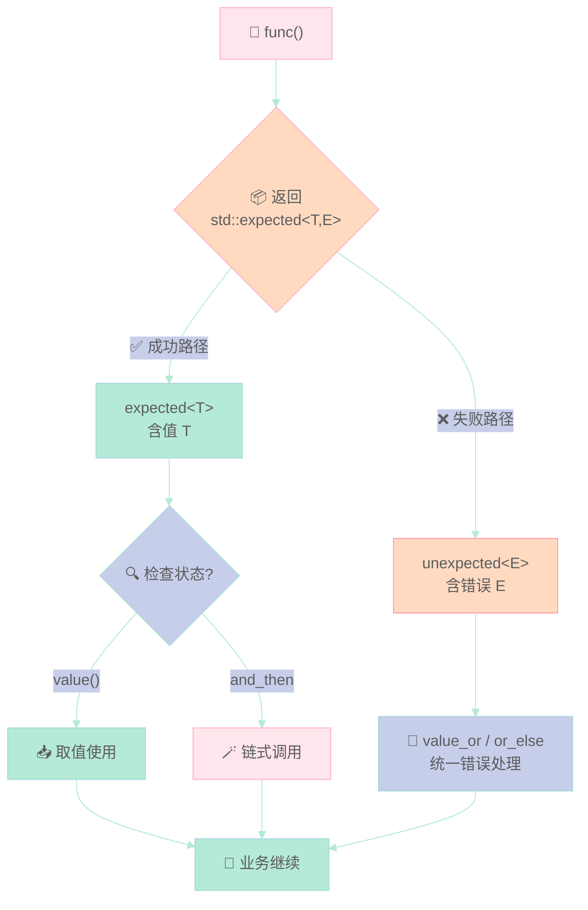

> 传统的 `std::optional` 只能告诉你"没有值"，但无法告诉你"为什么没有值"。C++23 引入的 `std::expected<T, E>`，终于让错误处理既能表达"出了什么问题"，又无需承担异常的性能开销。

---

## 一、为什么需要 std::expected？

C++ 的错误处理有三种主流方式：

| 方式 | 优点 | 缺点 |
|------|------|------|
| **异常（Exception）** | 表达力强，可层层传播 | 运行时开销大，嵌入式/性能关键路径慎用 |
| **错误码（error_code/errno）** | 零开销，适合性能敏感场景 | 调用链一长就变成"俄罗斯套娃"，极易遗漏检查 |
| **std::optional** | 语义清晰，`has_value()` 判断 | **只能表示"无值"，无法携带错误原因** |

**核心痛点**：当你用 `std::optional<int>` 表示"解析整数失败"时，你只知道失败了，但不知道是"格式错误"还是"数值溢出"。`std::expected` 解决了这个问题——它同时携带「成功的结果」或「失败的错误信息」。

---

## 二、std::expected<T, E> 语义解析

```cpp
std::expected<int, std::string> result = parse_int("123");  // 成功
std::expected<int, std::string> result = parse_int("abc");  // 失败，携带错误原因
```

- `T` —— 成功时的值类型
- `E` —— 失败时的错误类型，通常是 `std::string`、`std::error_code` 或自定义枚举

### 常用成员函数

```cpp
std::expected<int, std::string> safe_divide(int a, int b) {
    if (b == 0) return std::unexpected("division by zero");  // 返回错误
    return a / b;  // 返回值
}
```

| 方法 | 作用 | 示例 |
|------|------|------|
| `.has_value()` | 是否包含有效值 | `if (r.has_value())` |
| `.value()` | 获取值，失败则抛异常 | `r.value()` |
| `.value_or(def)` | 获取值或默认值 | `r.value_or(0)` |
| `.error()` | 获取错误信息 | `r.error()` |
| `.operator bool()` | 简写 has_value() | `if (r)` |

---

## 三、C++23 Monad 操作：链式调用

这是 `std::expected` 相比 `std::optional` 最大的升级——支持**链式操作**，无需手动解包。

```cpp
// C++23 monadic functions
.and_then(f)   // 值为真时执行 f，返回新的 expected
.transform(f)  // 值为真时对值做变换
.or_else(f)    // 错误时执行 f 进行恢复
```

```cpp
#include <iostream>
#include <expected>
#include <string>
#include <charconv>

std::expected<int, std::string> safe_divide(int a, int b) {
    if (b == 0) return std::unexpected("division by zero");
    return a / b;
}

std::expected<int, std::string> parse_int(std::string_view sv) {
    int value{};
    auto [ptr, ec] = std::from_chars(sv.data(), sv.data() + sv.size(), value);
    if (ec == std::errc{}) return value;
    return std::unexpected("parse error");
}

int main() {
    auto r1 = safe_divide(10, 2);
    if (r1.has_value()) std::cout << "10/2 = " << *r1 << "\n";
    
    auto r2 = safe_divide(10, 0);
    if (!r2) std::cout << "error: " << r2.error() << "\n";
    
    std::cout << r2.value_or(0) << "\n";
    
    auto r3 = parse_int("42");
    if (r3) std::cout << "parsed: " << *r3 << "\n";
    
    // monadic chain (C++23)
    auto result = parse_int("123").transform([](int n) { return n * 2; });
    if (result) std::cout << "doubled: " << *result << "\n";
}
```

**输出：**
```text
10/2 = 5
error: division by zero
0
parsed: 42
doubled: 246
```

---

## 四、实际应用场景

### 场景 1：配置解析器

```cpp
std::expected<Config, std::string> parse_config(const std::string& path) {
    auto content = read_file(path);
    if (!content) return std::unexpected("cannot read file");
    
    auto json = parse_json(*content);
    if (!json) return std::unexpected("invalid JSON: " + json.error());
    
    return Config::from_json(*json);
}
```

### 场景 2：网络请求

```cpp
std::expected<Response, NetworkError> fetch_url(const std::string& url) {
    auto conn = connect(url);
    if (!conn) return std::unexpected(conn.error());
    
    auto data = conn->read();
    if (!data) return std::unexpected("timeout");
    
    return parse_response(*data);
}
```

### 场景 3：链式验证

```cpp
auto result = parse_int(user_input)
    .and_then([](int n) {
        return (n >= 0 && n <= 100) 
            ? std::expected<int, std::string>(n)
            : std::unexpected("out of range");
    })
    .transform([](int n) { return n * 10; });
```

---

## 五、三种错误处理方式对比

| 维度 | Exception | std::optional | **std::expected** |
|------|------------|---------------|-------------------|
| 错误原因 | ✅ 可携带 | ❌ 不能携带 | ✅ 可携带 |
| 性能开销 | ⚠️ 有开销 | ✅ 零开销 | ✅ 零开销 |
| 链式调用 | ❌ 需 try/catch | ⚠️ 有限支持 | ✅ 完全支持 |
| 嵌入式友好 | ❌ 否 | ✅ 是 | ✅ 是 |
| 调用链可读性 | ✅ 好 | ⚠️ 需手动检查 | ✅ 好 |
| 编译器优化 | ⚠️ 可能被抑制 | ✅ 完全优化 | ✅ 完全优化 |

---

## 六、何时选用 std::expected？

**优先使用 `std::expected` 的场景：**
- 性能关键路径（游戏引擎、嵌入式、实时系统）
- 错误原因需要传递给上层调用者
- 需要链式处理多个可能失败的步骤
- 不希望引入异常处理的运行时开销

**仍考虑异常的场景：**
- 极端不可恢复的错误（内存分配失败、栈溢出）
- 需要跨越大量调用栈传播
- 团队已经深度依赖异常机制

---

> **总结**：`std::expected` 是 C++ 错误处理的"最优解"——它兼具错误码的零开销和异常的表达力，同时支持优雅的链式调用。如果你还在用 `std::optional` + 错误码组合，或者过度使用异常，建议逐步迁移到 `std::expected`。
---

## 📚 C++23 新特性 系列导航

> 本文是《C++23 新特性》系列第 **1/4** 篇。

| 方向 | 章节 |
|:--|:--|
| 下一篇 ▶ | [（二）if consteval 与 Deducing this](/2026/04/23/2026-04-24-cpp23-consteval-deducing-this/) |

<details>
<summary>📖 全部 4 篇目录（点击展开）</summary>

1. [（一）std::expected](/2026/04/23/2026-04-24-cpp23-expected/) **← 当前**
2. [（二）if consteval 与 Deducing this](/2026/04/23/2026-04-24-cpp23-consteval-deducing-this/)
3. [（三）std::print / to_underlying](/2026/04/23/2026-04-24-cpp23-utilities/)
4. [（四）Ranges 增强](/2026/04/23/2026-04-24-cpp23-ranges-enhancement/)

</details>

## 语法/控制流可视化

下面是一张马卡龙色 Mermaid 图，帮你从图形角度把握本章涉及的语法与控制流。



本章讲 C++23 的 std::expected<T, E>，对比维度：本特性 vs C++17 optional / exception 旧写法 vs 其他语言 Result / Either。

## 对比分析

### 一、本特性 vs 旧写法

| 维度 | C++23 expected | C++17 optional | C++ 异常 |
|------|-----------------|----------------|----------|
| 表达"出错 + 原因" | ✅ `expected<T, E>` | ❌ 只能表达"无值" | ✅ 但开销不可控 |
| 是否抛异常 | 否 | 否 | 是 |
| 错误传递 | 显式类型 `E` | 无 | 任意类型 |
| 与 std::visit 配合 | ✅ | ✅ | ❌ |
| 性能 | 可零开销 | 可零开销 | 通常有栈展开开销 |

### 二、对比其他语言

| 语言 | 错误返回类型 | 异常 | 备注 |
|------|--------------|------|------|
| C++23 | `std::expected<T,E>` | 仍保留 | 与 Rust Result 类似 |
| Rust | `Result<T, E>` | `panic!` | 语言级强制 |
| Go | `value, err := f()` | panic | 多返回值 |
| Java | Optional<T> / 自定义 | checked / unchecked | 双轨 |
| Python | Union[T, E] | raise | 动态类型 |
| Haskell | Either e a | 异常机制弱 | 类型系统强制 |

### 三、优缺点

优点：
- 在类型系统层面表达错误
- 与 variant / visit 一脉相承

缺点：
- 仍未形成"标准错误类型"（各家项目自定义 E）
- 异常与 expected 双轨制导致 API 风格分裂

### 四、何时选

- 错误恢复路径重要：expected
- 不可恢复错误：异常
- 老代码：先 optional 替代 null sentinel
