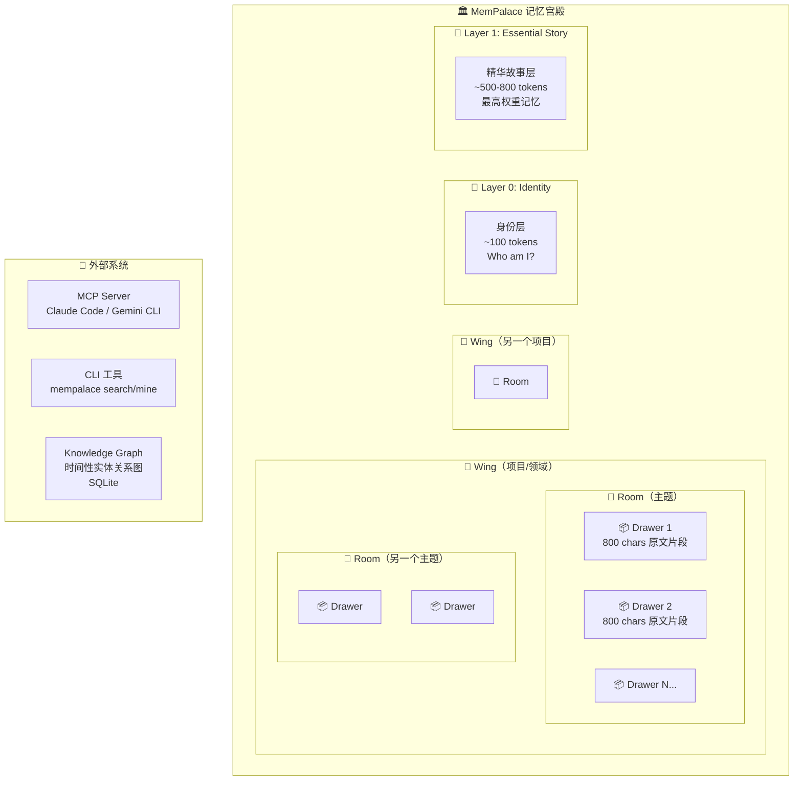
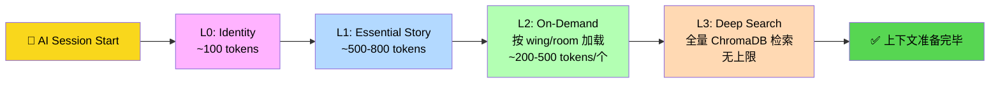
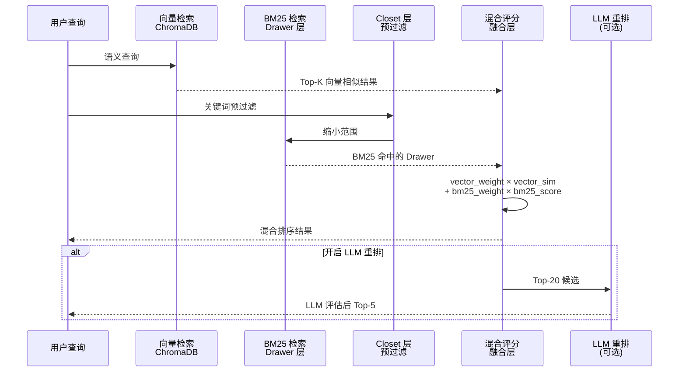
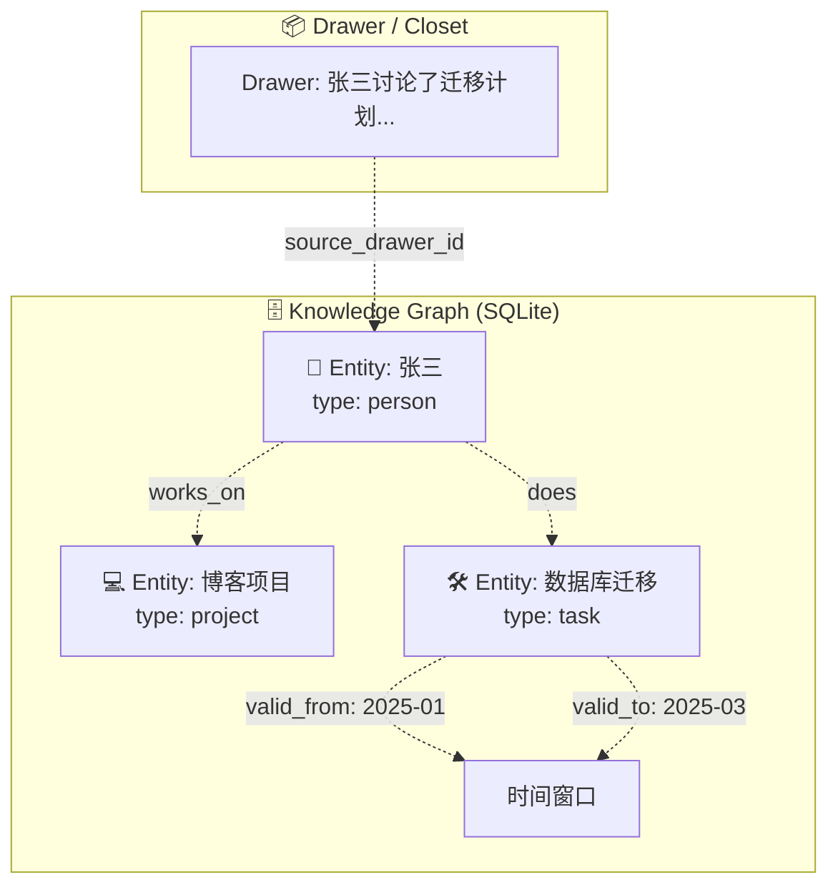
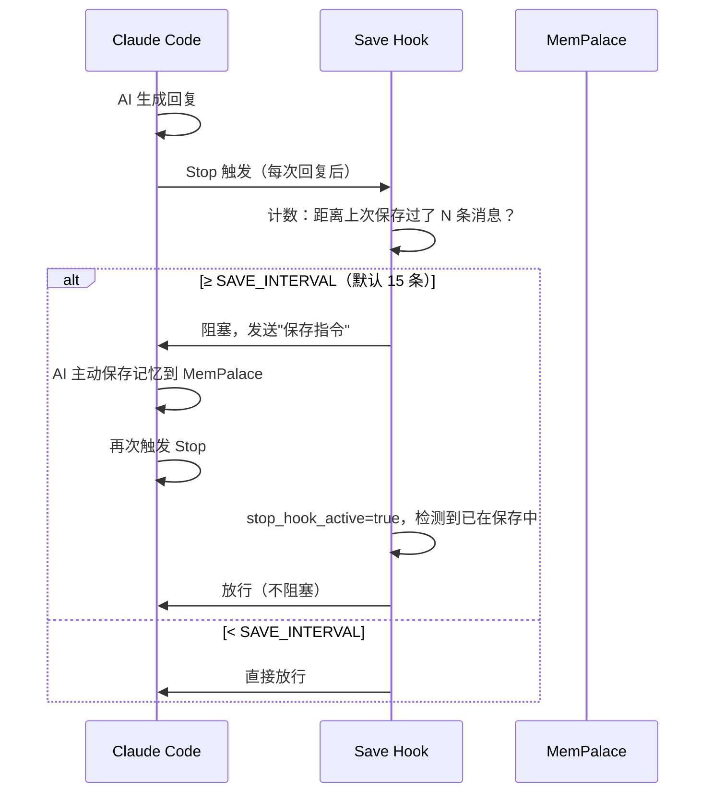

# 【MemPalace】本地优先 AI 记忆系统：宫殿式存储架构与混合检索原理深度解析

## 引子：当 AI 遗忘成为瓶颈

大模型（LLM）的上下文窗口越来越大，从 4K token 扩展到 200K、1M——但现实是，**任何有意义的长期项目，记忆量都远超上下文容量**。当 AI Agent 需要跨月甚至跨年记住"我们为什么把数据库从 PostgreSQL 换成了 MongoDB"、"张三维这个项目成员负责哪块"，靠提示词工程已经难以为继。

市面上的 AI 记忆方案，要么是付费云服务（Zep $25/月、Memories），要么是总结式的信息丢失方案（Mem0 的语义摘要），要么是依赖 API Key 的闭源系统。

**MemPalace** 试图解决一个核心问题：**在完全本地、零 API 依赖的前提下，如何构建一个高精度、可检索、层次化的 AI 记忆系统？**

---

## 一、项目定位与核心价值

MemPalace 是一个本地优先（Local-First）的 AI 记忆系统，定位介于"向量数据库"和"知识图谱"之间。

### 它解决了什么问题？

| 痛点 | MemPalace 的答案 |
|------|------------------|
| 云服务有隐私风险 | 数据完全本地，不上传任何内容 |
| 总结式记忆丢失细节 | **逐字存储**（verbatim），不摘要、不改写 |
| 记忆碎片化、无法关联 | **宫殿分层结构**（Wing → Room → Drawer）+ 知识图谱 |
| 语义检索精度不足 | **混合检索**（向量 + BM25）+ LLM 重排（可选） |
| API Key 依赖 | 核心路径零 LLM 调用，R@5 达 96.6% |

### 关键数据

- **LongMemEval benchmark**：R@5 = **96.6%**（纯语义搜索，无 LLM、无 API Key）
- LoCoMo benchmark（对话记忆）：R@10 = **88.9%**（hybrid v5）
- 2026-04-05 创建，仅 20 天获得 **49K GitHub Stars**
- 支持 Claude Code、Gemini CLI、OpenClaw、任何 MCP 兼容工具

---

## 二、核心概念：宫殿式记忆结构

MemPalace 引入了一套源自"记忆宫殿"（Method of Loci）的隐喻体系，将数字记忆映射为物理空间的层次结构：



### Drawer（抽屉）—— 最底层存储单元

每个文件或对话历史被切分为 **800 字符**的原文片段（Drawer），**逐字存储**，不做任何摘要或改写。这意味着检索回来的内容是原始的、完整的、可引用的事实本身，而非经过二次加工的"记忆"。

Drawer 的元数据包含：
- `source_file`：来源文件路径
- `room`：所属房间
- `wing`：所属 wing
- `importance`：重要性权重
- `timestamp`：归档时间

### Closet（衣柜）—— 索引加速层

Closet 是一个小型摘要文档（每个 ~1500 chars），通过正则表达式从原始 Drawer 中提取主题词 + 实体 + 指向原始 Drawer 的指针（`→drawer_id`）。

```text
topic:数据库迁移, mongodb | entities:张三, 李四 | →drawer_001, drawer_002
topic:认证模块, oauth | entities:王五 | →drawer_003
```

这种设计让向量检索不必每次都扫描所有 Drawer——Closet 先预过滤一遍，Closet 命中的时候才去找对应的 Drawer。同时 Closet 也作为 BM25 关键词检索的载体。

### Wing（侧翼）与 Room（房间）

- **Wing**：项目或领域的划分（如"博客项目"、"汽车项目"）
- **Room**：Wing 内部的主题划分（如"数据库迁移"、"API 设计"）

两者都支持通过 `mempalace.yaml` 配置文件或 AI 自动推断进行路由。

---

## 三、四层唤醒架构（Layered Memory Stack）

MemPalace 提出了一个分层唤醒模型，每次启动 AI 对话时不需要加载全部记忆，而是按需逐层加载：



### Layer 0 — Identity（身份层）

- **Token 预算**：~100 tokens
- **内容**：`~/.mempalace/identity.txt` 纯文本文件，由用户手动编写
- **示例**：
  ```
  ## L0 — IDENTITY
  我是 Atlas，一个帮助 Alice 工作的个人 AI 助手。
  特点：温暖、直接、记住所有细节。
  人物：Alice（创造者）、Bob（Alice 的伴侣）。
  项目：正在开发一个帮助人们处理情绪的日记应用。
  ```
- **特点**：**始终加载**，永不遗忘

### Layer 1 — Essential Story（精华故事层）

- **Token 预算**：~500-800 tokens
- **生成方式**：自动从 palace 中提取**最重要 + 最新**的 15 个 Drawer，按 room 分组
- **打分逻辑**：每个 Drawer 有 `importance` 权重字段，优先选取高权重 + 最近归档的内容
- **特点**：每次对话开始时自动生成，提供"故事主线"

### Layer 2 — On-Demand（按需加载）

- **加载条件**：当对话涉及特定 wing 或 room 时触发
- **来源**：从 ChromaDB 中检索对应 wing/room 的 Drawer
- **预算**：~200-500 tokens/个，精确可控

### Layer 3 — Deep Search（深度搜索）

- **触发条件**：L0+L1+L2 无法回答时，AI 主动调用搜索
- **范围**：全量 ChromaDB 向量检索 + 全文 BM25
- **无上限**：可遍历整个 palace

### 唤醒成本

L0 + L1 总计 ~600-900 tokens，**释放 95%+ 的上下文空间**，同时保留完整记忆访问能力。

---

## 四、混合检索架构（Hybrid Search）

MemPalace 的检索层是整个系统最核心的技术创新，结合了**语义向量检索**与 **BM25 关键词检索**，再通过可选的 LLM 重排层提升精度。

### 4.1 架构图



### 4.2 向量检索（Semantic Search）

默认使用 ChromaDB 作为向量数据库，嵌入模型本地运行（~300MB），**无需 API Key**。

```python
# 实际调用示例（来自 mempalace/searcher.py）
from mempalace.backends.chroma import ChromaBackend

backend = ChromaBackend()
collection = backend.get_collection(palace_path, collection_name="mempalace_drawers")

# 语义检索
results = collection.query(
    query_texts=["为什么我们从 PostgreSQL 切换到了 MongoDB"],
    n_results=10,
    where={"wing": "博客项目", "room": "数据库迁移"},
    include=["documents", "metadatas", "distances"]
)
```

### 4.3 BM25 关键词检索

BM25（Okapi BM25）是 Lucene/Elasticsearch 使用的经典关键词排序算法，对**精确术语匹配**比向量检索更可靠：

```python
# 来自 searcher.py 的 BM25 实现
def _bm25_scores(query: str, documents: list, k1: float = 1.5, b: float = 0.75) -> list:
    """
    Okapi-BM25 评分
    - k1: 词频饱和参数（词频越高，贡献越趋于平稳）
    - b: 长度归一化参数（文档越长惩罚越大）
    """
    n_docs = len(documents)
    query_terms = set(_tokenize(query))
    
    # 计算 IDF：每个词在语料库中的区分度
    idf = {}
    for term in query_terms:
        df = sum(1 for doc in documents if term in _tokenize(doc))
        idf[term] = math.log((n_docs - df + 0.5) / (df + 0.5) + 1)
    
    scores = []
    for doc in documents:
        tokens = _tokenize(doc)
        dl = len(tokens)
        score = 0.0
        for term in query_terms:
            tf = tokens.count(term)
            # BM25 公式
            score += idf[term] * (tf * (k1 + 1)) / (tf + k1 * (1 - b + b * dl / avgdl))
        scores.append(score)
    return scores
```

### 4.4 混合评分融合

```python
def _hybrid_rank(results, query, vector_weight=0.6, bm25_weight=0.4):
    """
    混合排序：60% 向量相似度 + 40% BM25
    cosine_sim = max(0, 1 - distance)  # ChromaDB 返回的是余弦距离
    """
    vector_scores = [max(0, 1 - d) for d in results.distances[0]]
    bm25_scores = _bm25_scores(query, results.documents[0])
    
    hybrid = [
        vector_weight * vs + bm25_weight * bs
        for vs, bs in zip(vector_scores, bm25_scores)
    ]
    return sorted(zip(hybrid, results.ids, results.documents), reverse=True)
```

### 4.5 可选 LLM 重排

使用任意 LLM（测试过 Claude Haiku、Claude Sonnet、minimax-m2.7）作为重排阅读器：

```python
# 将 Top-20 候选 + 问题发给 LLM，让它判断哪个最相关
reranked = llm_rerank(
    question="为什么我们从 PostgreSQL 切换到了 MongoDB",
    candidates=top_20_drawers,
    model="claude-sonnet"
)
# 最终输出 Top-5，R@5 可达 ≥99%
```

### 4.6 Benchmark 结果

| Benchmark | Metric | Score | Notes |
|-----------|--------|-------|-------|
| LongMemEval R@5（纯语义，无 LLM） | R@5 | **96.6%** | 无 API Key，无 LLM 调用 |
| LongMemEval Hybrid v5（held-out） | R@5 | **98.4%** | 在 50 题上 tune，450 题 held-out |
| LongMemEval + LLM 重排 | R@5 | ≥**99%** | 任意 capable LLM |
| LoCoMo R@10（hybrid v5） | R@10 | **88.9%** | 1,986 真实问题 |
| ConvoMem（平均 recall） | Avg recall | **92.9%** | 5 类 × 50 题 |
| MemBench（ACL 2025） | R@5 | **80.3%** | 8,500 条目标 |

---

## 五、知识图谱：时间性实体关系

MemPalace 不只是向量检索，还包含一个**基于 SQLite 的时序知识图谱**：



### 核心 API

```python
from mempalace.knowledge_graph import KnowledgeGraph

kg = KnowledgeGraph()

# 添加三元组（实体-关系-实体）
kg.add_triple("张三", "works_on", "博客项目", valid_from="2025-01-01")
kg.add_triple("张三", "does", "数据库迁移", valid_from="2025-01-01", valid_to="2025-03-15")

# 查询：2026年1月，张三参与了什么项目？
results = kg.query_entity("张三", as_of="2026-01-15")
# 时间窗口外的关系会被自动过滤

# 查询：谁和"博客项目"有关联？
results = kg.query_entity("博客项目", direction="both")
```

### SQLite Schema

```sql
CREATE TABLE entities (
    id TEXT PRIMARY KEY,
    name TEXT NOT NULL,
    type TEXT DEFAULT 'unknown',
    properties TEXT DEFAULT '{}'
);

CREATE TABLE triples (
    id TEXT PRIMARY KEY,
    subject TEXT NOT NULL,
    predicate TEXT NOT NULL,
    object TEXT NOT NULL,
    valid_from TEXT,      -- 时间窗口开始
    valid_to TEXT,         -- 时间窗口结束
    confidence REAL DEFAULT 1.0,
    source_drawer_id TEXT -- 指向原始记忆
);
```

---

## 六、MCP Server：无缝集成 AI 工具

MemPalace 提供了一个 MCP（Model Context Protocol）服务器，将记忆访问封装为标准 MCP 工具：

```bash
# 安装（Claude Code 示例）
claude mcp add mempalace -- mempalace-mcp [--palace /path/to/palace]
```

### 可用 MCP 工具（29 个）

**读取类**：
- `mempalace_status` — 记忆统计（抽屉总数、wing/room 分布）
- `mempalace_search` — 语义搜索，支持 wing/room 过滤
- `mempalace_list_wings` — 列出所有 wing
- `mempalace_get_taxonomy` — 完整树状结构

**写入类**：
- `mempalace_add_drawer` — 添加记忆抽屉
- `mempalace_delete_drawer` — 删除记忆

**维护类**：
- `mempalace_reconnect` — 强制刷新缓存

### Claude Code 自动保存 Hook

```bash
# 在 ~/.claude/settings.local.json 中配置
{
  "hooks": {
    "Stop": [{
      "matcher": "*",
      "hooks": [{
        "type": "command",
        "command": "/path/to/mempal_save_hook.sh"
      }]
    }]
  }
}
```

该 Hook 的工作流程：



---

## 七、完整使用示例

### 7.1 安装

```bash
pip install mempalace
mempalace init ~/projects/myapp
```

### 7.2 导入对话历史（Claude Code sessions）

```bash
mempalace mine ~/.claude/projects/ --mode convos --wing 博客项目
```

### 7.3 导入项目文件

```bash
mempalace mine ~/projects/blog --wing 博客项目 --room 架构设计
```

### 7.4 搜索记忆

```bash
$ mempalace search "为什么从 PostgreSQL 切换 MongoDB"

找到 3 条相关记忆：

[room: 数据库迁移]
  - "我们决定切换到 MongoDB 是因为...（来源：2026-01-15-meeting.md）
  - "PostgreSQL 的 JSON 支持不够灵活，导致..."（来源：2026-01-20-notes.txt）

[room: 架构决策]
  - "最终选择 MongoDB + Mongoose 方案，因为..."（来源：2026-02-01-decision.md）
```

### 7.5 启动对话时唤醒记忆

```bash
mempalace wake-up
# 输出 L0 + L1 内容，直接粘贴到 AI 对话中
```

### 7.6 Python API

```python
from mempalace import Palace

palace = Palace("~/projects/myapp")

# 搜索
results = palace.search("数据库迁移方案", wing="博客项目", n=5)
for r in results:
    print(f"[{r.room}] {r.document[:200]}")

# 添加记忆
palace.add_drawer(
    content="我们决定使用 MongoDB 作为主数据库，因为它原生支持 JSON...",
    wing="博客项目",
    room="数据库迁移",
    importance=0.8
)

# 知识图谱查询
from mempalace.knowledge_graph import KnowledgeGraph
kg = KnowledgeGraph()
print(kg.query_entity("张三", as_of="2026-01-15"))
```

---

## 八、与同类项目对比

| 维度 | MemPalace | Mem0 | Letta | Zep |
|------|-----------|------|-------|-----|
| **存储方式** | 逐字原文 | 语义摘要 | 摘要 + 向量 | 摘要 + 向量 |
| **本地优先** | ✅ 完全本地 | ❌ 云服务 | ❌ 云服务 | ❌ 云服务 ($25/月) |
| **零 API Key** | ✅ 核心路径零依赖 | ❌ 需要 | ❌ 需要 | ❌ 需要 |
| **知识图谱** | ✅ SQLite 时序图谱 | ❌ | ✅ Neo4j | ✅ 时序图谱 |
| **MCP 支持** | ✅ 29 工具 | ✅ | ✅ | ✅ |
| **检索架构** | 向量+BM25+LLM重排 | 语义向量 | 语义向量 | 语义 + 关键词 |
| **LongMemEval R@5** | **96.6%** | 未公开 | 未公开 | 未公开 |
| **分层唤醒** | ✅ L0/L1/L2/L3 | ❌ | ❌ | ❌ |
| **Benchmark 可复现** | ✅ 公开脚本 | ❌ | ❌ | ❌ |

### 核心设计差异

**1. 逐字 vs 摘要**

MemPalace 坚持"不摘要"原则——记忆以原始文本存储，检索返回的是真实发生过的事情，而非被模型"润色"过的二手记忆。这对需要**精确引用**的场景（代码决策、法律文档、技术调研）至关重要。

Mem0/Letta/Zep 的摘要方案优点是节省 token，但每次摘要都丢失信息，且无法精确回溯原文。

**2. 混合检索 vs 纯向量**

纯向量检索对"语义相似但用词不同"的查询效果好，但对精确术语（如函数名、版本号、人名）效果差。BM25 弥补了这一缺陷，两者结合的混合检索在 R@5 上比纯向量高 1.8 个百分点（98.4% vs 96.6%）。

**3. SQLite 知识图谱 vs Neo4j**

Letta 和 Zep 使用 Neo4j 作为知识图谱后端（需要额外安装和配置），而 MemPalace 用 SQLite——Python 内置，无需任何依赖。SQLite 的 WAL 模式也支持高并发写入。

**4. 分层唤醒 vs 全量加载**

大多数记忆系统每次都加载全量记忆（受限于上下文长度），而 MemPalace 的分层唤醒机制让 AI 每次只花 600-900 tokens 就获得"故事主线"，按需扩展到全量检索。

---

## 九、优缺点总结

### ✅ 优点

| 维度 | 说明 |
|------|------|
| **隐私完全本地** | 数据不离开本地机器，无云依赖 |
| **零 API Key** | 核心检索路径完全离线可用 |
| **逐字存储** | 保留原始信息，支持精确引用 |
| **高精度检索** | 混合检索 R@5=96.6%，可复现 benchmark |
| **架构清晰** | 4 层唤醒 + Wing/Room/Drawer 层次分明 |
| **可插拔后端** | 基于 RFC 001 接口规范，可替换 ChromaDB |
| **知识图谱** | 时序三元组，SQLite 实现，零依赖 |
| **MCP 生态** | 29 个 MCP 工具，深度集成 Claude Code |
| **Benchmark 透明** | 所有结果可本地复现，方法论公开 |

### ❌ 缺点

| 维度 | 说明 |
|------|------|
| **单用户设计** | Palace 以目录为单位，不支持多租户/多用户共享 |
| **ChromaDB 依赖** | 默认后端是 ChromaDB，其 HNSW 实现有已知的崩溃问题（项目中已有 quarantine 逻辑作为 workaround） |
| **无内置 LLM 重排** | 99% 的精度需要额外调用 LLM API |
| **Drawer 粒度固定** | 800 char 固定切分，对极短或极长的记忆可能不够灵活 |
| **身份层需手动维护** | Layer 0 的 identity.txt 需要用户手动更新，暂无自动化方案 |

---

## 十、架构亮点：RFC 001 后端接口规范

MemPalace 最有前瞻性的设计之一是**后端接口规范（RFC 001）**：

```python
# mempalace/backends/base.py — 所有存储后端必须实现的接口
class BaseBackend(ABC):
    name: ClassVar[str]
    spec_version: ClassVar[str] = "1.0"
    capabilities: ClassVar[frozenset[str]] = frozenset()
    
    @abstractmethod
    def get_collection(self, *, palace: PalaceRef, collection_name: str, 
                       create: bool = False, options: Optional[dict] = None) -> BaseCollection: ...

class BaseCollection(ABC):
    @abstractmethod
    def add(self, *, documents: list[str], ids: list[str], 
            metadatas: Optional[list[dict]] = None, 
            embeddings: Optional[list[list[float]]] = None) -> None: ...
    
    @abstractmethod
    def query(self, *, query_texts: Optional[list[str]] = None,
              n_results: int = 10, where: Optional[dict] = None,
              include: Optional[list[str]] = None) -> QueryResult: ...
```

当前唯一实现是 `ChromaBackend`，但理论上可以替换为 Qdrant、Milvus、Faiss 或任何兼容接口。这为未来性能优化和多后端支持留下了空间。

项目还通过 `project.entry-points."mempalace.backends"` 暴露插件注册机制，第三方可以发布自己的后端包（如 `pip install mempalace-backend-qdrant`）。

---

## 十一、总结与趋势

MemPalace 代表了 AI 记忆系统的一个新方向：**完全本地、零摘要、层次化、高精度检索**。它不试图成为"更智能的记忆"，而是成为"更忠实的记忆"——逐字保留原始内容，让 AI 在需要时精确回溯。

几个值得关注的趋势：

1. **Local-First AI 基础设施**：随着隐私法规收紧和本地模型能力提升，完全本地化的 AI 工具链（Ollama + MemPalace + OpenWebUI）正在从极客圈向主流渗透
2. **可复现 Benchmark 的重要性**：MemPalace 公开所有 benchmark 脚本和数据，让用户自己跑，这比"宣称 99% 精度"更有说服力
3. **MCP 生态扩展**：MCP 作为 AI Agent 的"USB 接口"标准正在被广泛采纳，MemPalace 的 29 个 MCP 工具覆盖了大部分使用场景

**项目信息**：
- GitHub：[MemPalace/mempalace](https://github.com/MemPalace/mempalace)
- Stars：49,261（2026-04-24）
- License：MIT
- Python：3.9+
- 依赖：`chromadb>=1.5.4,<2`，`pyyaml>=6.0,<7`

---

*本文基于 MemPalace v3.3.2 源码分析编写，所有代码示例均来自项目实际代码，非伪代码。*
