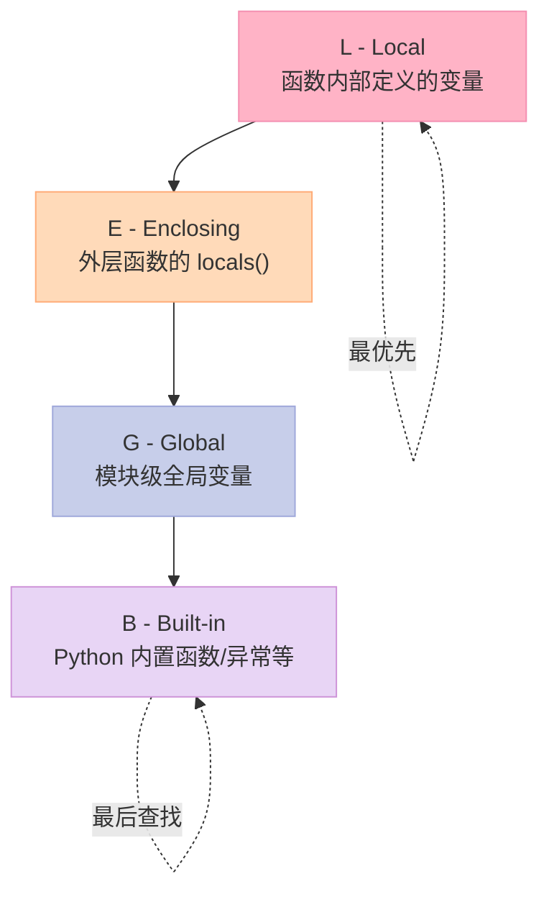
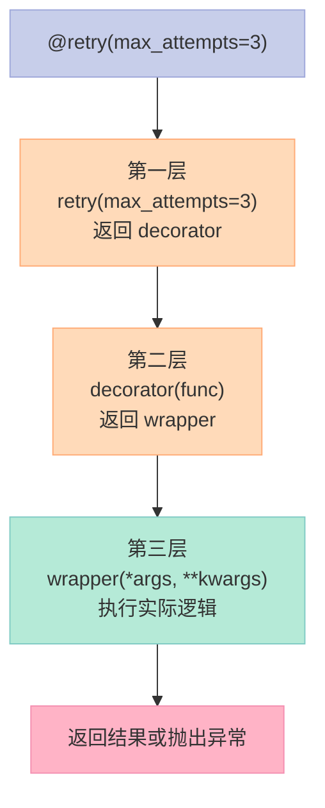
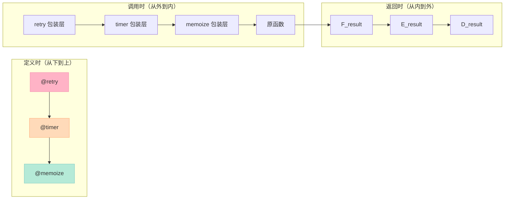

> 装饰器是 Python 最强大的语法糖之一，也是 AI 工程化离不开的利器。从 `@retry` 重试机制到 `@timer` 性能监控，从 Agent 链路追踪到 LLM 调用缓存——装饰器让这些横切关注点（Cross-Cutting Concerns）的实现变得优雅而简洁。

---

## 一、闭包：函数记住外部变量的魔法

### 1.1 什么是自由变量？

当我们在一个函数内部引用外部作用域的变量时，这个变量对函数来说就是**自由变量（Free Variable）**。

```python
def make_adder(n):          # n 是外部传入的参数
    def adder(x):
        return x + n        # n 是自由变量，被 adder 引用
    return adder            # 返回内部函数对象

add5 = make_adder(5)
print(add5(10))             # 15：5 被"记住"了
```

`add5` 不仅仅是一个函数，它**携带了创建时捕获的上下文**。

### 1.2 闭包细胞（Closure Cell）

Python 通过**闭包细胞（Closure Cell）** 实现这一机制：

```python
print(add5.__closure__)     # Cell object containing 5
print(add5.__code__.co_freevars)  # ('n',) — 自由变量名
```

闭包细胞是 Python 为每个被捕获的外部变量创建的不可变容器。即使外部函数已经返回，内部函数依然能访问这些变量。

### 1.3 LEGB 规则：Python 变量查找顺序

Python 的名字查找遵循 **LEGB** 规则：



**代码示例**：

```python
x = "global"                # G - 全局变量

def outer():
    x = "enclosing"         # E - 外层函数的变量
    
    def inner():
        x = "local"         # L - 局部变量
        print(x)           # 打印 "local"
    
    inner()
    print(x)               # 打印 "enclosing"

print(x)                    # 打印 "global"
```

### 1.4 闭包的实际用途：记忆化

闭包可以创建**记忆化（Memoization）** 缓存：

```python
def memoize():
    cache = {}              # 闭包变量，持久化存储
    
    def wrapper(n):
        if n not in cache:
            cache[n] = n ** 2  # 模拟耗时计算
        return cache[n]
    return wrapper

fast = memoize()
print(fast(5))              # 25，首次计算
print(fast(5))              # 25，命中缓存，无打印
```

---

## 二、装饰器：修改函数行为的利器

### 2.1 装饰器的本质： Higher-Order Function

**装饰器（Decorator）** 本质上是一个接收函数并返回新函数的高阶函数（Higher-Order Function）：

```python
# 不使用装饰器语法
def timer(func):
    def wrapper(*args, **kwargs):
        start = time.perf_counter()
        result = func(*args, **kwargs)
        print(f"{func.__name__}: {time.perf_counter()-start:.4f}s")
        return result
    return wrapper

def slow_api_call(prompt: str) -> str:
    time.sleep(0.1)
    return f"Response to: {prompt}"

# 手动装饰
slow_api_call = timer(slow_api_call)
```

### 2.2 @ 语法糖展开

`@decorator` 只是上述手动包装的**语法简化**：

```python
# 这两段代码完全等价：

# 方式1：手动包装
def slow_api_call(prompt: str) -> str:
    time.sleep(0.1)
    return f"Response to: {prompt}"
slow_api_call = timer(slow_api_call)

# 方式2：@语法糖
@timer
def slow_api_call(prompt: str) -> str:
    time.sleep(0.1)
    return f"Response to: {prompt}"
```

### 2.3 functools.wraps：保留原函数元信息

装饰器替换函数时，会丢失原函数的 `__name__`、`__doc__` 等元信息。`functools.wraps` 帮你解决这个问题：

```python
import functools
import time
from typing import Callable, TypeVar, ParamSpec

P = ParamSpec('P')
R = TypeVar('R')

def timer(func: Callable[P, R]) -> Callable[P, R]:
    @functools.wraps(func)    # 拷贝原函数的元信息
    def wrapper(*args: P.args, **kwargs: P.kwargs) -> R:
        start = time.perf_counter()
        result = func(*args, **kwargs)
        print(f"{func.__name__}: {time.perf_counter()-start:.4f}s")
        return result
    return wrapper

@timer
def slow_api_call(prompt: str) -> str:
    """模拟 AI API 调用"""
    time.sleep(0.1)
    return f"Response to: {prompt}"

print(slow_api_call.__name__)  # slow_api_call，而非 wrapper
print(slow_api_call.__doc__)   # 模拟 AI API 调用
```

---

## 三、带参数的装饰器：三层嵌套函数

如果装饰器需要**接收参数**（如 `@retry(max_attempts=3)`），需要再包裹一层：

```python
def retry(max_attempts: int = 3):
    """第一层：接收装饰器参数"""
    def decorator(func: Callable[P, R]) -> Callable[P, R]:
        """第二层：接收被装饰的函数"""
        @functools.wraps(func)
        def wrapper(*args: P.args, **kwargs: P.kwargs) -> R:
            """第三层：执行实际的包装逻辑"""
            last_exc = None
            for attempt in range(max_attempts):
                try:
                    return func(*args, **kwargs)
                except Exception as e:
                    last_exc = e
                    if attempt < max_attempts - 1:
                        time.sleep(0.1 * (attempt + 1))
            raise last_exc
        return wrapper
    return decorator

@retry(max_attempts=3)
def unreliable_api():
    """模拟不稳定的 AI API"""
    import random
    if random.random() < 0.7:
        raise ConnectionError("Network error")
    return "Success"
```

### 三层嵌套的执行顺序



---

## 四、类装饰器：使用 `__call__` 封装状态

装饰器不一定是函数，**任何可调用对象**都可以作为装饰器，包括**类**：

```python
class CallTracker:
    def __init__(self, func: Callable[P, R]):
        functools.update_wrapper(self, func)  # 类似于 functools.wraps
        self.func = func
        self.count = 0
    
    def __call__(self, *args: P.args, **kwargs: P.kwargs) -> R:
        self.count += 1
        print(f"Called {self.func.__name__} #{self.count}")
        return self.func(*args, **kwargs)

@CallTracker
def generate(prompt: str) -> str:
    """模拟 LLM 生成"""
    return f"Generated: {prompt}"

generate("Hello")    # Called generate #1
generate("World")    # Called generate #2
```

类装饰器可以维护**状态**（如调用次数），这是函数装饰器难以优雅实现的场景。

---

## 五、装饰器链：多个装饰器的执行顺序

多个装饰器可以叠加，形成**装饰器链**：

```python
@memoize        # 先应用 memoize
@timer          # 后应用 timer
@retry(max_attempts=3)  # 最后应用 retry
def complex_ai_task(prompt: str) -> str:
    ...
```

### 执行顺序详解



**核心原则**：
- **定义顺序**：装饰器从上到下应用
- **调用顺序**：从外向内执行
- **返回顺序**：从内向外传递结果

---

## 六、AI 实战：构建 Agent 链路追踪器

在 AI Agent 开发中，**链路追踪（Tracing）** 是调试和监控的核心：

```python
class AgentTracer:
    def __init__(self):
        self.steps = []
    
    def trace(self, func: Callable[P, R]) -> Callable[P, R]:
        @functools.wraps(func)
        def wrapper(*args: P.args, **kwargs: P.kwargs) -> R:
            step = {"name": func.__name__, "args": args, "status": "running"}
            self.steps.append(step)
            try:
                result = func(*args, **kwargs)
                step["status"] = "success"
                return result
            except Exception as e:
                step["status"] = "error"
                step["error"] = str(e)
                raise
        return wrapper
    
    def report(self):
        for s in self.steps:
            icon = "✅" if s["status"] == "success" else "❌"
            print(f"{icon} {s['name']}: {s['status']}")

# 使用示例
tracer = AgentTracer()

@tracer.trace
def think(reasoning: str) -> str:
    """Agent 思考步骤"""
    return f"Thinking: {reasoning}"

@tracer.trace
def act(action: str) -> str:
    """Agent 行动步骤"""
    return f"Acting: {action}"

if __name__ == "__main__":
    think("Should I call the API?")
    act("Calling LLM")
    tracer.report()
```

**输出**：
```
✅ think: success
✅ act: success
```

---

## 七、对比总结：装饰器 vs 高阶函数 vs Monkey Patching

| 维度 | 装饰器 | 高阶函数 | Monkey Patching |
|------|--------|----------|-----------------|
| **定义时** | `@decorator` 语法糖 | 显式传递函数 | 修改已存在函数 |
| **侵入性** | 低（可选叠加） | 中（调用方需传递） | 高（全局影响） |
| **可组合性** | ✅ 链式叠加 | ✅ 组合使用 | ❌ 难以叠加 |
| **元信息保留** | `@wraps` 保留 | ❌ 丢失 | ❌ 丢失 |
| **状态维护** | 类装饰器可实现 | ❌ 通常无状态 | ❌ 需手动维护 |
| **典型用途** | 横切关注点 | 数据转换 | 库扩展/测试 Mock |

---

## 八、常见 AI 场景装饰器一览

| 装饰器 | 用途 | 实现要点 |
|--------|------|----------|
| `@timer` | 性能监控 | 记录执行时间 |
| `@retry` | 容错重试 | 捕获异常 + 循环 |
| `@cache` | 结果缓存 | 字典记忆化 |
| `@trace` | 链路追踪 | 记录步骤状态 |
| `@rate_limit` | 限流控制 | 时间窗口计数 |
| `@validate` | 输入验证 | 参数类型检查 |

---

## 九、完整可运行代码

```python
import functools
import time
from typing import Callable, TypeVar, ParamSpec

P = ParamSpec('P')
R = TypeVar('R')

# === 闭包 ===
def make_adder(n):
    def adder(x):
        return x + n  # n is free variable, captured by closure
    return adder

add5 = make_adder(5)
print(add5(10))  # 15
print(add5.__closure__)  # Cell object containing 5

# === 装饰器 ===
def timer(func: Callable[P, R]) -> Callable[P, R]:
    @functools.wraps(func)
    def wrapper(*args: P.args, **kwargs: P.kwargs) -> R:
        start = time.perf_counter()
        result = func(*args, **kwargs)
        print(f"{func.__name__}: {time.perf_counter()-start:.4f}s")
        return result
    return wrapper

@timer
def slow_api_call(prompt: str) -> str:
    time.sleep(0.1)
    return f"Response to: {prompt}"

# === 带参数装饰器 ===
def retry(max_attempts: int = 3):
    def decorator(func: Callable[P, R]) -> Callable[P, R]:
        @functools.wraps(func)
        def wrapper(*args: P.args, **kwargs: P.kwargs) -> R:
            last_exc = None
            for attempt in range(max_attempts):
                try:
                    return func(*args, **kwargs)
                except Exception as e:
                    last_exc = e
                    if attempt < max_attempts - 1:
                        time.sleep(0.1 * (attempt + 1))
            raise last_exc
        return wrapper
    return decorator

@retry(max_attempts=3)
def unreliable_api():
    import random
    if random.random() < 0.7:
        raise ConnectionError("Network error")
    return "Success"

# === 类装饰器 ===
class CallTracker:
    def __init__(self, func: Callable[P, R]):
        functools.update_wrapper(self, func)
        self.func = func
        self.count = 0
    def __call__(self, *args: P.args, **kwargs: P.kwargs) -> R:
        self.count += 1
        print(f"Called {self.func.__name__} #{self.count}")
        return self.func(*args, **kwargs)

@CallTracker
def generate(prompt: str) -> str:
    return f"Generated: {prompt}"

# === Agent tracer ===
class AgentTracer:
    def __init__(self):
        self.steps = []
    def trace(self, func: Callable[P, R]) -> Callable[P, R]:
        @functools.wraps(func)
        def wrapper(*args: P.args, **kwargs: P.kwargs) -> R:
            step = {"name": func.__name__, "args": args, "status": "running"}
            self.steps.append(step)
            try:
                result = func(*args, **kwargs)
                step["status"] = "success"
                return result
            except Exception as e:
                step["status"] = "error"
                step["error"] = str(e)
                raise
        return wrapper
    def report(self):
        for s in self.steps:
            icon = "✅" if s["status"] == "success" else "❌"
            print(f"{icon} {s['name']}: {s['status']}")

tracer = AgentTracer()

@tracer.trace
def think(reasoning: str) -> str:
    return f"Thinking: {reasoning}"

@tracer.trace
def act(action: str) -> str:
    return f"Acting: {action}"

if __name__ == "__main__":
    think("Should I call the API?")
    act("Calling LLM")
    tracer.report()
```

---

> **核心要点**：闭包是装饰器的基础，装饰器是闭包最优雅的应用场景之一。在 AI 开发中善用装饰器，可以让日志、监控、重试、缓存等横切关注点与业务逻辑分离，写出更干净、更可维护的代码。

---

*原创于 2026-04-25 | 所属系列：【Python AI教程】*
