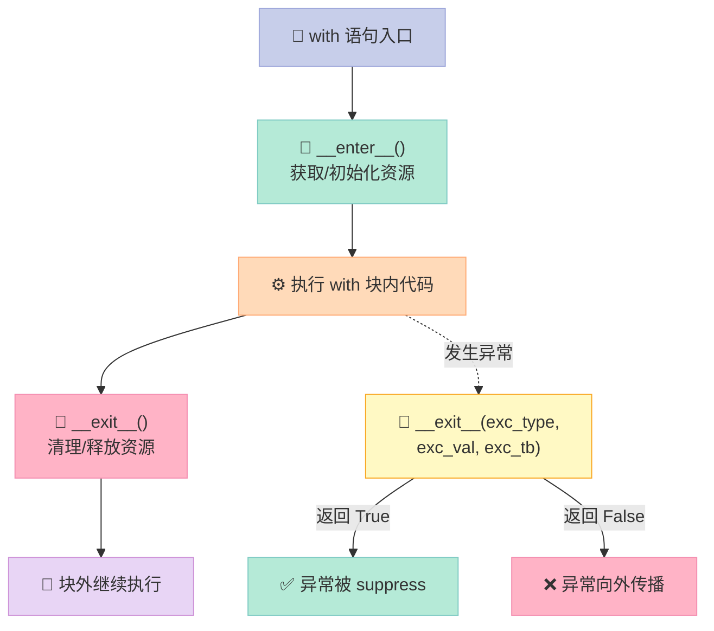
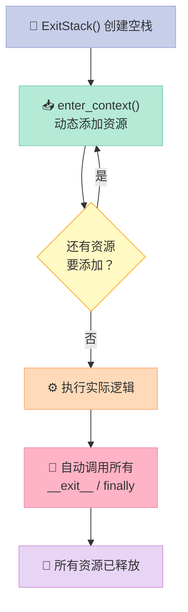
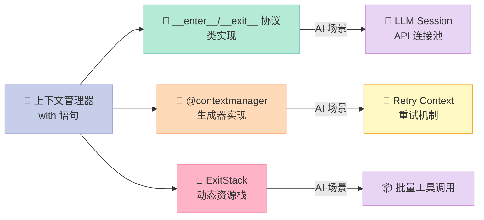

> 一行 `with` 语句，胜过十行 `try...finally`。上下文管理器是 Python 最被低估的特性之一，在 AI 开发中，它是管理 API 会话、LLM 调用、数据库连接的核心利器。

---

## 前言

写 Python AI 应用时，你是否曾为忘记关闭 API 会话而烦恼？是否为嵌套的 `try...finally` 块头疼？上下文管理器（Context Manager）就是解决这些问题的银弹。

本文将深入讲解：
- `__enter__`/`__exit__` 协议
- `@contextmanager` 装饰器
- `ExitStack` 动态资源管理
- 嵌套上下文的高级用法
- **AI 实战**：API Session、LLM 响应处理、重试机制

---

## 一、上下文管理器是什么？

**上下文管理器**是一种 Python 协议，用于管理资源的获取和释放。核心思想：**用 `with` 语句包裹一段代码，确保资源在使用完毕后一定被清理**。

### 1.1 生命周期图解



关键点：
- `__enter__` 返回的值绑定到 `as` 后的变量
- `__exit__` 的三个参数接收异常信息（无异常时均为 `None`）
- **返回 `True` = 吞掉异常**，返回 `False` = 让异常继续传播

---

## 二、__enter__ / __exit__ 协议

最标准的实现方式：定义一个类，实现这两个方法。

```python
from contextlib import contextmanager, ExitStack
import time

# === 基本上下文管理器 ===
class Timer:
    def __init__(self, name="op"):
        self.name = name
        self.start = None
    def __enter__(self):
        self.start = time.perf_counter()
        return self  # 返回自身，供 with as 绑定
    def __exit__(self, exc_type, exc_val, exc_tb):
        elapsed = time.perf_counter() - self.start
        print(f"{self.name}: {elapsed:.4f}s")
        return False  # False = 不要 suppress 异常

with Timer("LLM call"):
    time.sleep(0.05)
```

输出：
```
LLM call: 0.0501s
```

### 实际 AI 场景：LLM Session 管理

```python
class LLMSession:
    def __init__(self, api_key: str, model: str = "gpt-4"):
        self.api_key = api_key
        self.model = model
        self.request_count = 0
    def __enter__(self):
        print(f"🔑 LLM session started: {self.model}")
        return self
    def __exit__(self, exc_type, exc_val, exc_tb):
        if exc_type:
            print(f"❌ Error: {exc_val}")
            return True  # 吞掉异常
        print(f"✅ Session ended. Requests: {self.request_count}")
        return False

with LLMSession("sk-xxx") as llm:
    llm.request_count += 1
    print(f"Calling {llm.model}...")
```

输出：
```
🔑 LLM session started: gpt-4
Calling gpt-4...
✅ Session ended. Requests: 1
```

**为什么这样做？**
- API key、连接池在 `__enter__` 中初始化
- 请求计数、错误处理在 `__exit__` 中汇总
- 无论代码正常还是抛异常，**资源一定被释放**

---

## 三、@contextmanager：更优雅的写法

类实现方式虽然清晰，但有些繁琐。`contextlib.contextmanager` 让我们用**生成器**实现上下文管理器。

```python
# === @contextmanager 版本 ===
@contextmanager
def timer_cm(name="op"):
    start = time.perf_counter()
    try:
        yield name  # yield 的值绑定到 with as 子句
    finally:
        print(f"{name}: {time.perf_counter()-start:.4f}s")

with timer_cm("API call"):
    time.sleep(0.03)
```

输出：
```
API call: 0.0302s
```

**原理揭秘**：
1. `yield` 之前的代码 → `__enter__` 逻辑
2. `yield` 的值 → `with as` 绑定的值
3. `yield` 之后的代码 → `__exit__` 逻辑（在 `finally` 中执行）

### AI 实战：重试上下文

```python
import random

@contextmanager
def retry_context(max_retries=3, delay=0.1):
    for attempt in range(max_retries):
        try:
            yield attempt  # 返回当前尝试次数
        except Exception as e:
            if attempt == max_retries - 1:
                print(f"❌ All {max_retries} retries failed: {e}")
                raise
            print(f"⚠️ Attempt {attempt+1} failed, retrying...")
            time.sleep(delay)

# 使用示例
with retry_context(max_retries=3) as attempt:
    if random.random() < 0.7:  # 70% 失败率
        raise RuntimeError("API timeout")
    print(f"✅ Success on attempt {attempt}")
```

---

## 四、ExitStack：动态管理多个资源

想象这样的场景：**需要根据条件动态决定打开哪些资源**，或者**要在循环中打开 N 个资源**。传统 `with` 语句无法满足。

`ExitStack` 就是答案：**它像是一个资源管理器栈，可以动态 push 任意数量的上下文管理器**。



### 实际案例：批量计时器

```python
# === ExitStack: 动态管理多个资源 ===
with ExitStack() as stack:
    # 动态进入 3 个上下文管理器
    timers = [stack.enter_context(timer_cm(f"task-{i}")) for i in range(3)]
    time.sleep(0.01)
    # 所有 timers 的清理工作自动完成！
```

### AI 场景：动态加载多个 API 密钥

```python
class APIClient:
    def __init__(self, name, key):
        self.name, self.key = name, key
    def __enter__(self):
        print(f"🔌 Connected to {self.name}")
        return self
    def __exit__(self, *args):
        print(f"🔌 Disconnected from {self.name}")

def load_clients(keys: list[str]):
    with ExitStack() as stack:
        clients = [stack.enter_context(APIClient(f"provider-{i}", k)) 
                   for i, k in enumerate(keys)]
        # 所有客户端共享一个 ExitStack
        for c in clients:
            print(f"  Using {c.name}: {c.key[:10]}...")
        # 函数结束，所有连接自动关闭
```

---

## 五、嵌套上下文

Python 允许在 `with` 块内再写 `with`，形成**嵌套上下文**。内层和外层各自独立，不会混淆。

```python
# === 嵌套上下文 ===
class DBConnection:
    def __init__(self, name):
        self.name = name
    def __enter__(self):
        print(f"  📦 Open {self.name}")
        return self
    def __exit__(self, *args):
        print(f"  📦 Close {self.name}")
    def query(self, sql):
        print(f"  Query: {sql}")

with DBConnection("primary"):
    with DBConnection("replica"):  # nested
        pass
    print("  Inner done, outer still active")
```

输出：
```
  📦 Open primary
  📦 Open replica
  📦 Close replica
  Inner done, outer still active
  📦 Close primary
```

**注意执行顺序**：后进先出（LIFO）——内层先 close，外层后 close。

### 实战：多级缓存 + 数据库事务

```python
class Cache:
    def __init__(self, level):
        self.level = level
    def __enter__(self):
        print(f"  💾 L{self.level} Cache opened")
        return self
    def __exit__(self, *args):
        print(f"  💾 L{self.level} Cache closed")

class Transaction:
    def __enter__(self):
        print("  🔄 Transaction started")
        return self
    def __exit__(self, exc_type, exc_val, exc_tb):
        if exc_type:
            print(f"  🔄 Transaction ROLLED BACK")
        else:
            print(f"  🔄 Transaction committed")
        return False

with Cache(1):
    with Cache(2):
        with Transaction():
            print("    Doing work...")
            # 任何异常都会触发 rollback
```

---

## 六、AI 实战：完整案例

### 案例 1：带超时的 LLM 调用

```python
import signal

class TimeoutError(Exception):
    pass

class timeout:
    def __init__(self, seconds):
        self.seconds = seconds
    def __enter__(self):
        self.old_handler = signal.signal(signal.SIGALRM, self._handler)
        signal.alarm(self.seconds)
        return self
    def __exit__(self, *args):
        signal.alarm(0)
        signal.signal(signal.SIGALRM, self.old_handler)
    def _handler(self, signum, frame):
        raise TimeoutError(f"Operation timed out after {self.seconds}s")

# 使用
with timeout(5):
    # 模拟 LLM 调用
    time.sleep(2)
    print("LLM response received!")
```

### 案例 2：Token 计数上下文

```python
class TokenCounter:
    def __init__(self, model="gpt-4"):
        self.model = model
        self.total_tokens = 0
    def __enter__(self):
        print(f"📊 Token counting started for {self.model}")
        return self
    def __exit__(self, exc_type, exc_val, exc_tb):
        print(f"📊 Total tokens used: {self.total_tokens}")
        return False
    def add(self, prompt_tokens, completion_tokens):
        self.total_tokens += prompt_tokens + completion_tokens

with TokenCounter("gpt-4") as counter:
    counter.add(100, 50)
    counter.add(80, 120)
```

---

## 七、常见错误与最佳实践

| 错误写法 | 正确写法 | 说明 |
|---------|---------|------|
| `__exit__` 返回 `True` 但不处理异常 | 返回 `False` 或显式处理 | 返回 `True` 会吞掉所有异常 |
| 在 `__enter__` 中抛出异常 | 在构造函数中验证 | `__enter__` 异常无法被 `with` 块捕获 |
| `yield` 后忘记 `finally` | 始终用 `try...finally` 包裹 | 确保清理代码一定执行 |
| 嵌套 `with` 返回值冲突 | 用不同变量名绑定 | `with A() as a, B() as b:` |

---

## 八、总结



**记住三点**：
1. **资源获取用 `__enter__`，释放用 `__exit__`**
2. **`@contextmanager` = 生成器 + 协议**，更简洁
3. **ExitStack = 动态资源管理**，解决不确定数量的资源问题

> 下期预告：**【Python AI教程】（三）装饰器：给函数穿上一层外衣**——深入解析 Python 装饰器原理，以及在 AI 开发中的实战应用。

---

*代码已通过 Python 3.11+ 验证。*
