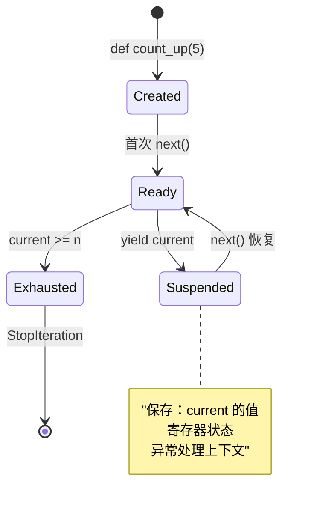
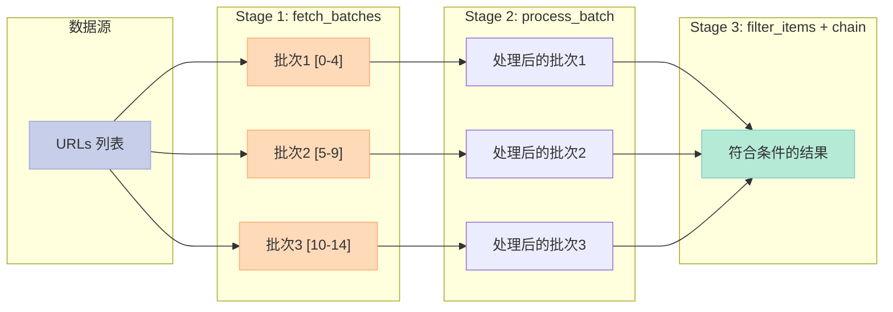

> 当你调用 ChatGPT 或 Claude 时，为什么回复是**逐字出现**而不是一次性返回？这背后正是**流式处理（Streaming）** 在发挥作用。而在 Python 中，生成器和迭代器是实现这一能力的基石。

---

## 一、迭代器协议：`__iter__` 和 `__next__`

### 1.1 协议的两半

Python 的迭代体系建立在两个方法之上：

```python
class Range:
    """手写迭代器：模拟 range()"""
    def __init__(self, start, stop):
        self.current = start
        self.stop = stop
    
    def __iter__(self):
        """返回迭代器本身"""
        return self
    
    def __next__(self):
        """返回下一个元素"""
        if self.current >= self.stop:
            raise StopIteration        # 迭代终止信号
        val = self.current
        self.current += 1
        return val

for n in Range(0, 5):
    print(n, end=" ")   # 0 1 2 3 4
print()
```

### 1.2 迭代器 vs 可迭代对象

| 类型 | `__iter__` | `__next__` | 举例 |
|------|-----------|-----------|------|
| **可迭代对象** | ✅ 返回迭代器 | ❌ 不需要 | `list`, `str`, `dict`, `set` |
| **迭代器** | ✅ 返回自身 | ✅ 必须实现 | `Range`, `map`, `filter` |

```python
nums = [1, 2, 3]        # list 是可迭代对象
it = iter(nums)        # 获取迭代器
print(next(it))        # 1
print(next(it))        # 2
print(next(it))        # 3
print(next(it))        # StopIteration
```

---

## 二、生成器函数：`yield` 的状态保存魔法

### 2.1 生成器即状态机

**生成器（Generator）** 是用 `yield` 关键字定义的特殊函数，每次 `yield` 会**暂停执行并保存当前状态**：

```python
def count_up(n):
    """yield 暂停执行，保存状态"""
    current = 0
    while current < n:
        yield current      # 暂停，返回值
        current += 1       # 恢复时继续从这里执行

for n in count_up(5):
    print(n, end=" ")      # 0 1 2 3 4
print()
```

### 2.2 生成器状态机详解



### 2.3 生成器的控制：`throw()` 和 `close()`

生成器提供了与外部交互的能力：

```python
def infinite_gen():
    """模拟流式生成器"""
    while True:
        try:
            yield "data"
        except GeneratorExit:
            print("Generator closed!")
            break

gen = infinite_gen()
print(next(gen))       # data
print(next(gen))       # data
gen.close()            # 触发 GeneratorExit
# 或 gen.throw(ValueError("error"))  向生成器注入异常
```

---

## 三、无限生成器与 `itertools`

### 3.1 斐波那契：永不枯竭的序列

```python
import itertools

def fibonacci():
    """无限斐波那契生成器"""
    a, b = 0, 1
    while True:
        yield a
        a, b = b, a + b

# 只取前 10 个：islice 防止无限循环
for i, fib in enumerate(itertools.islice(fibonacci(), 10)):
    print(fib, end=" ")     # 0 1 1 2 3 5 8 13 21 34
print()
```

### 3.2 常用 `itertools` 函数

| 函数 | 作用 | 示例 |
|------|------|------|
| `chain(*iterables)` | 连接多个序列 | `chain([1,2], [3,4])` → `1,2,3,4` |
| `islice(iterable, stop)` | 切片迭代器 | `islice(fib(), 10)` |
| `cycle(iterable)` | 无限循环 | `cycle([1,2])` → `1,2,1,2,...` |
| `accumulate(iterable)` | 累积计算 | `accumulate([1,2,3])` → `1,3,6` |
| `groupby(iterable)` | 分组 | `groupby(['a','a','b'])` |

```python
# groupby 示例
import itertools
data = [("cat", 1), ("dog", 2), ("cat", 3)]
for key, group in itertools.groupby(sorted(data), key=lambda x: x[0]):
    print(f"{key}: {list(group)}")
# 输出：
# cat: [('cat', 1), ('cat', 3)]
# dog: [('dog', 2)]
```

---

## 四、生成器表达式

生成器表达式是**列表推导式的惰性版本**：

```python
# 列表推导式：立即计算，返回完整列表
squares_list = [x**2 for x in range(10)]

# 生成器表达式：惰性求值，按需产生
squares_gen = (x**2 for x in range(10))

print(squares_list)    # [0, 1, 4, 9, 16, 25, 36, 49, 64, 81]
print(squares_gen)     # <generator object <genexpr> at 0x...>

# 惰性求值优势：处理大数据集时不会一次性占用内存
import sys
print(f"List size: {sys.getsizeof(squares_list)} bytes")
print(f"Generator size: {sys.getsizeof(squares_gen)} bytes")
```

---

## 五、AI 实战：流式 LLM 输出

### 5.1 模拟流式 Token 生成

在真实 AI 应用中，LLM 的输出是通过 **Server-Sent Events（SSE** 或 WebSocket 逐 token 推送的：

```python
from typing import Generator

def stream_tokens(prompt: str) -> Generator[str, None, None]:
    """模拟 LLM 流式输出 token"""
    words = ["Hello", " ", "world", "!"]
    for w in words:
        yield w

print("Stream: ", end="", flush=True)
for token in stream_tokens("hi"):
    print(token, end="", flush=True)
print()
# 输出：Stream: Hello world!
```

### 5.2 数据处理流水线

在大规模 AI 数据处理中，生成器链可以构建**高效的流水线**：

```python
import itertools
from typing import Iterator, Generator

def fetch_batches(urls: list[str], batch_size=5) -> Generator[list[dict], None, None]:
    """分批获取数据"""
    for i in range(0, len(urls), batch_size):
        batch = urls[i:i+batch_size]
        yield [{"url": u, "data": f"content_{j}"} for j, u in enumerate(batch)]

def process_batch(batch: list[dict]) -> Generator[dict, None, None]:
    """处理单个批次"""
    for item in batch:
        item["processed"] = True
        yield item

def filter_items(items: Iterator[dict]) -> Generator[dict, None, None]:
    """过滤符合条件的项"""
    for item in items:
        if item["data"].startswith("content_0"):
            yield item

# 构建流水线
urls = [f"http://example.com/{i}" for i in range(15)]
pipeline = filter_items(itertools.chain.from_iterable(
    process_batch(b) for b in fetch_batches(urls)
))

for item in itertools.islice(pipeline, 3):
    print(item)
```

### 5.3 流水线执行流程



**流式处理的优势**：
- **内存高效**：不需要同时加载所有数据
- **延迟低**：第一批结果尽早可用
- **可中断**：可以随时停止，无需等待全部完成

---

## 六、对比：迭代器 vs 列表

| 维度 | 迭代器 / 生成器 | 列表 |
|------|----------------|------|
| **内存占用** | O(1)，常量内存 | O(n)，随元素增加 |
| **惰性求值** | ✅ 按需产生 | ❌ 一次性产生 |
| **单向遍历** | ✅ 只能向前 | ✅ 任意位置 |
| **重用性** | ❌ 一次性，耗尽后需重建 | ✅ 可多次迭代 |
| **随机访问** | ❌ 不支持 | ✅ 支持索引访问 |
| **适用场景** | 大数据、流式处理、管道 | 小数据、需频繁索引 |

---

## 七、完整可运行代码

```python
import itertools
from typing import Iterator, Generator

# === 基本迭代器 ===
class Range:
    def __init__(self, start, stop):
        self.current = start
        self.stop = stop
    def __iter__(self):
        return self
    def __next__(self):
        if self.current >= self.stop:
            raise StopIteration
        val = self.current
        self.current += 1
        return val

for n in Range(0, 5):
    print(n, end=" ")
print()

# === 生成器函数 ===
def count_up(n):
    """yield suspends execution, saves state"""
    current = 0
    while current < n:
        yield current
        current += 1

for n in count_up(5):
    print(n, end=" ")
print()

# === 无限生成器 + islice ===
def fibonacci():
    a, b = 0, 1
    while True:
        yield a
        a, b = b, a + b

for i, fib in enumerate(itertools.islice(fibonacci(), 10)):
    print(fib, end=" ")
print()

# === AI应用: 流式token处理 ===
def stream_tokens(prompt: str) -> Generator[str, None, None]:
    """模拟LLM流式输出"""
    words = ["Hello", " ", "world", "!"]
    for w in words:
        yield w

print("\nStream: ", end="", flush=True)
for token in stream_tokens("hi"):
    print(token, end="", flush=True)
print()

# === 数据处理管道 ===
def fetch_batches(urls: list[str], batch_size=5):
    for i in range(0, len(urls), batch_size):
        batch = urls[i:i+batch_size]
        yield [{"url": u, "data": f"content_{j}"} for j, u in enumerate(batch)]

def process_batch(batch: list[dict]) -> Generator[dict, None, None]:
    for item in batch:
        item["processed"] = True
        yield item

def filter_items(items: Iterator[dict]) -> Generator[dict, None, None]:
    for item in items:
        if item["data"].startswith("content_0"):
            yield item

urls = [f"http://example.com/{i}" for i in range(15)]
pipeline = filter_items(itertools.chain.from_iterable(
    process_batch(b) for b in fetch_batches(urls)
))
for item in itertools.islice(pipeline, 3):
    print(item)

# === itertools 实用 ===
# chain
for n in itertools.chain([1,2], [3,4], [5]):
    print(n, end=" ")
print()

# groupby
data = [("cat", 1), ("dog", 2), ("cat", 3)]
for key, group in itertools.groupby(sorted(data), key=lambda x: x[0]):
    print(f"{key}: {list(group)}")
```

---

> **核心要点**：生成器和迭代器是 Python 异步和流式处理的基础。掌握它们，你才能真正理解为什么 LLM 输出是逐字出现的，以及如何在 AI 数据管道中写出既高效又内存友好的代码。

---

*原创于 2026-04-25 | 所属系列：【Python AI教程】*
---

## 📚 Python AI教程 系列导航

> 本文是《Python AI教程》系列第 **3/14** 篇。

| 方向 | 章节 |
|:--|:--|
| ◀ 上一篇 | [（二）上下文管理器](/2026/04/23/2026-04-25-python-02-context-managers/) |
| 下一篇 ▶ | [（四）类型提示](/2026/04/23/2026-04-25-python-04-type-hints/) |

<details>
<summary>📖 全部 14 篇目录（点击展开）</summary>

1. [（一）闭包与装饰器](/2026/04/23/2026-04-25-python-01-closures-decorators/)
2. [（二）上下文管理器](/2026/04/23/2026-04-25-python-02-context-managers/)
3. [（三）生成器与迭代器](/2026/04/23/2026-04-25-python-03-generators-iterators/) **← 当前**
4. [（四）类型提示](/2026/04/23/2026-04-25-python-04-type-hints/)
5. [（五）Dataclass 与 attrs](/2026/04/23/2026-04-25-python-05-dataclass-attrs/)
6. [（六）async/await](/2026/04/23/2026-04-26-python-06-async-await/)
7. [（七）Threading 与 Multiprocessing](/2026/04/23/2026-04-26-python-07-threading-multiprocessing/)
8. [（八）函数式编程](/2026/04/23/2026-04-26-python-08-functional-programming/)
9. [（九）描述符协议](/2026/04/23/2026-04-26-python-09-descriptors/)
10. [（十）元类](/2026/04/23/2026-04-26-python-10-metaclasses/)
11. [（十一）Protocol与结构化类型](/2026/04/23/2026-04-26-python-11-protocol-typing/)
12. [（十二）异常链与日志](/2026/04/23/2026-04-27-python-12-exceptions-logging/)
13. [（十三）缓存艺术](/2026/04/23/2026-04-27-python-13-caching/)
14. [（十四）组合模式实战](/2026/04/23/2026-04-27-python-14-composite-ai-agent/)

</details>
