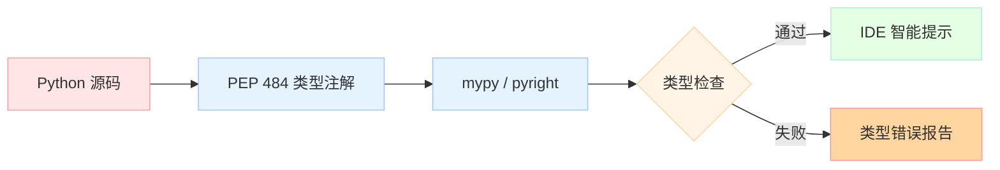

# 【Python AI教程】（四）类型提示：让AI代码更安全

> Python 一直被称为"动态类型语言"，但随着 AI 应用的复杂度爆炸式增长，类型提示已经从"可选"变成了"必须"。本文将系统讲解类型提示的所有核心技能，让你的 AI 代码更安全、更易维护。

## 为什么 AI 代码特别需要类型提示？

AI 应用有几个独特特点，让类型变得尤为重要：

1. **多源数据**：API 响应、文件、数据库、LLM 输出——来源多，格式杂
2. **嵌套结构**：Agent 消息、Tool Schema、State 往往是多层嵌套的字典/对象
3. **团队协作**：AI 应用通常涉及多个模型/Agent/工具，接口协议必须清晰
4. **重构频繁**：Prompt 变了、数据结构变了——类型检查能第一时间发现问题

## 基础类型提示

```python
# 基本语法
def greet(name: str, age: int = 0) -> str:
    return f"Hello {name}, age {age}"

# 容器类型
from typing import List, Dict, Set, Tuple

def process_data(
    users: List[Dict[str, str]],
    scores: Set[int],
    metadata: Tuple[str, int, bool]
) -> Dict[str, any]:
    pass
```

> **注意**：Python 3.9+ 可以直接用 `list[str]`、`dict[str, int]` 等内置类型，无需 `typing` 模块。

## Optional 与 Union：处理"可能没有"的值

这是 AI 代码中使用频率最高的类型提示。

```python
from typing import Optional, Union

# Optional[T] = Union[T, None]
def find_user(user_id: int) -> Optional[dict]:
    """找不到返回 None"""
    if user_id > 0:
        return {"id": user_id, "name": "Alice"}
    return None

# Union：多种可能
def process_value(val: Union[str, int, float]) -> str:
    """三种输入都是合法的"""
    return str(val)

# Python 3.10+ 简化语法
def process_value_v310(val: str | int | float) -> str:
    return str(val)
```

### AI 应用场景

```python
@dataclass
class LLMResponse:
    content: Optional[str] = None      # 可能没有回复
    error: Optional[str] = None         # 可能没有错误
    tokens_used: Optional[int] = None   # 可能不知道 token 数
    model: str = "gpt-4"                # 有默认值，可选

    def __post_init__(self):
        # 防御性编程
        if self.content is None and self.error is None:
            raise ValueError("Response must have either content or error")
```

## Literal：枚举值与字符串字面量

当一个参数只能取特定的值时，`Literal` 是最佳选择：

```python
from typing import Literal

# 限制为特定字符串
def http_method(method: Literal["GET", "POST", "PUT", "DELETE"]) -> None:
    print(f"HTTP {method}")

http_method("GET")    # ✅ OK
http_method("PATCH")  # ❌ 类型检查器报错

# AI 应用：定义 Agent 状态
AgentStatus = Literal["idle", "thinking", "acting", "waiting", "done"]

class Agent:
    def set_status(self, status: AgentStatus) -> None:
        self.status = status

# AI 应用：定义消息角色
MessageRole = Literal["user", "assistant", "system", "tool", "developer"]
```

## Callable：函数作为参数和返回值

AI 代码中大量使用"函数作为参数"——这就是 `Callable` 的用武之地：

```python
from typing import Callable

# Callable[[输入类型...], 返回类型]
def apply_transform(
    data: list[int],
    transform: Callable[[int], int]   # 接受一个 int，返回一个 int
) -> list[int]:
    return [transform(x) for x in data]

# 使用
result = apply_transform([1, 2, 3], lambda x: x * 2)
print(result)  # [2, 4, 6]

# 更复杂：多参数函数
def apply_two(
    fn: Callable[[int, int], int],
    a: int, b: int
) -> int:
    return fn(a, b)

print(apply_two(lambda x, y: x + y, 3, 4))  # 7
```

### AI 应用：策略模式

```python
from dataclasses import dataclass
from typing import Callable

LLMFactory = Callable[[str], str]  # 输入 prompt，输出响应

@dataclass
class Agent:
    name: str
    model: str
    llm_call: LLMFactory

    def think(self, prompt: str) -> str:
        return self.llm_call(prompt)

# 不同的 LLM 实现
def openai_call(prompt: str) -> str:
    return f"[OpenAI] {prompt}"

def anthropic_call(prompt: str) -> str:
    return f"[Claude] {prompt}"

# 注入不同策略
agent1 = Agent(name="GPT-Agent", model="gpt-4", llm_call=openai_call)
agent2 = Agent(name="Claude-Agent", model="claude-3", llm_call=anthropic_call)

print(agent1.think("Explain AI"))
print(agent2.think("Explain AI"))
```

## TypeVar 与泛型：让类型更通用

```python
from typing import TypeVar, Generic

T = TypeVar("T")
K = TypeVar("K")
V = TypeVar("V")

def first(seq: list[T]) -> T:
    """取列表第一个元素，类型保持一致"""
    return seq[0]

def first_of_two(a: T, b: T) -> T:
    """两个同类型参数，返回同类型"""
    return a if True else b

# 使用
print(first([1, 2, 3]))       # int
print(first(["a", "b"]))      # str
print(first_of_two(1, 2))     # int
print(first_of_two("a", "b")) # str
```

### 泛型字典

```python
from typing import TypeVar, Generic

K = TypeVar("K")
V = TypeVar("V")

class Cache(Generic[K, V]):
    def __init__(self):
        self._store: dict[K, V] = {}
    
    def get(self, key: K) -> V | None:
        return self._store.get(key)
    
    def set(self, key: K, value: V) -> None:
        self._store[key] = value

# 使用
string_cache: Cache[str, str] = Cache()
string_cache.set("gpt-4", "Response from gpt-4")
print(string_cache.get("gpt-4"))
```

## Protocol：结构化子类型（最强大的技能）

这是 Python 3.8+ 引入的最强大特性——**只要你有某个方法，就是某种类型**：

```python
from typing import Protocol, runtime_checkable

@runtime_checkable
class LLMClient(Protocol):
    """只要你有 complete 方法，你就是 LLMClient"""
    def complete(self, prompt: str) -> str: ...

class RealOpenAI:
    def complete(self, prompt: str) -> str:
        return f"OpenAI: {prompt}"

class FakeLLM:
    """Mock 实现"""
    def complete(self, prompt: str) -> str:
        return f"Fake: {prompt}"

class NotAnLLM:
    """没有 complete 方法"""
    def query(self, prompt: str) -> str:
        return "I'm not an LLM"

# 都可以作为 LLM 使用（静态检查通过）
real = RealOpenAI()
fake = FakeLLM()
not_llm = NotAnLLM()

print(f"RealOpenAI is LLM: {isinstance(real, LLMClient)}")  # True
print(f"FakeLLM is LLM: {isinstance(fake, LLMClient)}")      # True
print(f"NotAnLLM is LLM: {isinstance(not_llm, LLMClient)}") # False
```

### Protocol vs ABC

| 特性 | Protocol | ABC |
|------|----------|-----|
| 继承方式 | 无需继承，结构匹配即可 | 需要显式继承 |
| 运行时检查 | `@runtime_checkable` 支持 `isinstance` | 始终支持 |
| 多继承冲突 | 无 | 可能有菱形继承问题 |
| **适用场景** | **插件系统、接口定义（AI Agent 场景）** | 强制实现某些方法 |

### AI 应用：统一 Agent 接口

```python
from typing import Protocol, runtime_checkable, Any

@runtime_checkable
class Tool(Protocol):
    """所有工具的统一接口"""
    @property
    def name(self) -> str: ...
    def execute(self, args: dict[str, Any]) -> str: ...

@runtime_checkable
class Memory(Protocol):
    """所有记忆系统的统一接口"""
    def add(self, text: str) -> None: ...
    def search(self, query: str) -> list[str]: ...

class CalculatorTool:
    name = "calculator"
    def execute(self, args: dict) -> str:
        return str(eval(args["expr"], {"__builtins__": {}}))

class VectorStore:
    def add(self, text: str) -> None:
        print(f"Stored: {text[:20]}...")
    def search(self, query: str) -> list[str]:
        return [f"Result for {query}"]

# 两种不同实现，可以互换使用
def run_with_tools(tools: list[Tool]) -> None:
    for tool in tools:
        print(f"Running: {tool.name}")

calc = CalculatorTool()
store = VectorStore()
run_with_tools([calc])  # ✅ Works, VectorStore doesn't need to be in the list
```

## typing vs Pydantic vs Dataclass

| 特性 | typing | Pydantic | @dataclass |
|------|--------|----------|------------|
| 运行时验证 | ❌ | ✅✅ 自动 | ⚠️ 需 `__post_init__` |
| JSON Schema 生成 | ❌ | ✅✅ | ❌ |
| 默认值 | ❌ | ✅ | ✅ |
| 嵌套模型 | ❌ | ✅ | ⚠️ 需配合 |
| 序列化 | ❌ | ✅✅ | ⚠️ 需配合 |
| **最佳场景** | **类型标注（不验证）** | **API 请求/响应** | **内部数据结构** |

> AI 应用推荐：**typing 做标注 + Pydantic 做 API 接口 + @dataclass 做内部状态**

## AI 应用实战：完整的消息与工具 Schema

```python
from dataclasses import dataclass, field
from typing import Optional, Literal, Any
from typing import Protocol

# === Pydantic 不方便做内部状态，dataclass 更轻量 ===

@dataclass
class Message:
    role: Literal["user", "assistant", "system", "tool", "developer"]
    content: str
    name: Optional[str] = None           # tool 消息需要 name
    tool_call_id: Optional[str] = None   # assistant 消息中的工具调用 ID

@dataclass
class ToolCall:
    id: str
    name: str
    args: dict[str, Any]

@dataclass
class ToolResult:
    tool_call_id: str
    content: str          # 成功时为结果文本
    is_error: bool = False

@dataclass
class AgentState:
    messages: list[Message] = field(default_factory=list)
    tool_calls: list[ToolCall] = field(default_factory=list)
    tool_results: list[ToolResult] = field(default_factory=list)
    current_step: int = 0

    def add_message(self, role: Literal["user", "assistant", "system", "tool"], content: str, **kwargs) -> None:
        self.messages.append(Message(role=role, content=content, **kwargs))
    
    def add_tool_result(self, tool_call_id: str, content: str, is_error: bool = False) -> None:
        self.tool_results.append(ToolResult(tool_call_id=tool_call_id, content=content, is_error=is_error))

# === Protocol 定义工具接口 ===
class Tool(Protocol):
    @property
    def name(self) -> str: ...
    @property
    def description(self) -> str: ...
    def execute(self, args: dict[str, Any]) -> str: ...
    def validate_args(self, args: dict[str, Any]) -> bool: ...

# === 验证函数 ===
def validate_agent_state(state: AgentState) -> bool:
    """运行时验证状态一致性"""
    # 检查 tool_call 和 tool_result 是否匹配
    result_ids = {r.tool_call_id for r in state.tool_results}
    call_ids = {c.id for c in state.tool_calls}
    return result_ids.issubset(call_ids)

# === 使用示例 ===
state = AgentState()
state.add_message("user", "What's 2+2?")
state.add_message("assistant", "Let me calculate...", tool_call_id="call_1")
state.add_tool_result("call_1", "4")

print(f"State valid: {validate_agent_state(state)}")
print(f"Messages: {len(state.messages)}")
```

## 类型提示检查工具

光写类型还不够，需要工具来检查：

```bash
# 安装
pip install mypy pyright

# 运行检查（mypy 更严格，推荐）
mypy your_agent_code.py --strict

# 或使用 pyright（更快，VSCode Pylance 就是用它）
pyright your_agent_code.py
```

## 总结

| 技能 | 何时用 | AI 应用场景 |
|------|--------|------------|
| `Optional[T]` | 值可能不存在 | LLM 响应、文件读取 |
| `Union[T, U]` | 多种可能类型 | 工具参数、API 响应 |
| `Literal["a", "b"]` | 固定枚举值 | 消息角色、Agent 状态 |
| `Callable[[T], U]` | 函数作为参数/返回值 | LLM 工厂、转换函数 |
| `TypeVar` | 通用类型 | Cache、Container |
| `Protocol` | 统一接口（最常用） | Tool、Memory、Agent 接口 |
| `@dataclass` | 内部数据结构 | Message、AgentState |

> **下一章**：【Python AI教程】（六）async/await：异步编程入门到精通——让你的 AI 应用并发处理多个 API 调用，不再排队等待。
---


## 📚 Python AI教程 系列导航

> 本文是《Python AI教程》系列第 **4/14** 篇。

| 方向 | 章节 |
|:--|:--|
| ◀ 上一篇 | [（三）生成器与迭代器](/2026/04/23/2026-04-25-python-03-generators-iterators/) |
| 下一篇 ▶ | [（五）Dataclass 与 attrs](/2026/04/23/2026-04-25-python-05-dataclass-attrs/) |

<details>
<summary>📖 全部 14 篇目录（点击展开）</summary>

1. [（一）闭包与装饰器](/2026/04/23/2026-04-25-python-01-closures-decorators/)
2. [（二）上下文管理器](/2026/04/23/2026-04-25-python-02-context-managers/)
3. [（三）生成器与迭代器](/2026/04/23/2026-04-25-python-03-generators-iterators/)
4. [（四）类型提示](/2026/04/23/2026-04-25-python-04-type-hints/) **← 当前**
5. [（五）Dataclass 与 attrs](/2026/04/23/2026-04-25-python-05-dataclass-attrs/)
6. [（六）async/await](/2026/04/23/2026-04-26-python-06-async-await/)
7. [（七）Threading 与 Multiprocessing](/2026/04/23/2026-04-26-python-07-threading-multiprocessing/)
8. [（八）函数式编程](/2026/04/23/2026-04-26-python-08-functional-programming/)
9. [（九）描述符协议](/2026/04/23/2026-04-26-python-09-descriptors/)
10. [（十）元类](/2026/04/23/2026-04-26-python-10-metaclasses/)
11. [（十一）Protocol与结构化类型](/2026/04/23/2026-04-26-python-11-protocol-typing/)
12. [（十二）异常链与日志](/2026/04/23/2026-04-27-python-12-exceptions-logging/)
13. [（十三）缓存艺术](/2026/04/23/2026-04-27-python-13-caching/)
14. [（十四）组合模式实战](/2026/04/23/2026-04-27-python-14-composite-ai-agent/)

</details>

## 对比分析

本章核心是 Python 的类型提示（`typing` 模块 / PEP 484+）。

### 维度一：类型提示 vs 旧写法（注释 + docstring）

| 方案 | 工具支持 | 运行时影响 | 文档能力 |
|------|----------|------------|----------|
| **类型提示（PEP 484+）** | mypy / pyright / IDE 自动补全 | 运行时默认不强制（Pydantic/Beartype 除外） | 类型即文档 |
| **docstring + Sphinx** | 仅文档生成 | 无 | 自由但易过时 |
| **手写注释** | 无工具 | 无 | 不可机器解析 |
| **`# type: x` 注释** | mypy 旧式支持 | 无 | 易读性差 |

### 维度二：与其他语言的静态类型

| 语言 | 类型系统 | 与 Python 类型提示对比 |
|------|----------|--------------------------|
| **Java** | 强类型、编译期检查、泛型擦除 | 类型即强制约束；缺点是不支持结构化子类型 |
| **C++** | 模板 + Concepts（C++20） | 编译期模板元编程、零运行时开销；学习曲线陡 |
| **Go** | 静态类型 + `interface{}` + generics（1.18+） | 显式声明、语法简单；缺点是泛型能力有限 |
| **Rust** | 静态类型 + Trait + 泛型 | 表达力最强（生命周期、Trait bound）；缺点是编译慢 |
| **TypeScript** | 结构化类型（与 Python Protocol 思路一致） | 最像 Python 的静态类型；可在 JS 引擎直接擦除运行 |
| **C#** | 强类型 + `var` + generics | 与 Java 类似，但 nullable reference types（C# 8+）处理"可空"更优雅 |

### 维度三：`typing` vs 数据类库

| 方案 | 主要用途 | 校验 | 序列化 | 适用场景 |
|------|----------|------|--------|----------|
| **typing** | 类型注解 | ❌（仅类型检查） | ❌ | 函数签名、IDE 提示 |
| **dataclass** | 简化类定义 | ❌ | ❌ | DTO、配置对象 |
| **attrs** | 同 dataclass，功能更多 | ✅（可选 validators） | ❌ | 复杂数据类 |
| **Pydantic** | 数据验证 + 序列化 | ✅ 强大 | ✅ JSON / dict | API 边界、配置加载 |
| **TypedDict** | 字典的键值类型 | ❌ | ❌ | JSON 风格数据结构 |

### 优缺点小结

- **Python typing**：渐进式、可选、零运行时开销；缺点是类型擦除后运行时无法校验
- **Java / C#**：强制类型、编译期保证；缺点是改类型要改大量代码
- **TypeScript**：结构化子类型最成熟；缺点是大型项目编译慢
- **Rust**：类型即正确性证明；缺点是开发速度最慢

### 何时选

- 选 **typing**：库作者公开 API、IDE 提示、文档
- 选 **dataclass**：纯数据容器，不需要运行时校验
- 选 **Pydantic**：API 边界、外部输入（HTTP body / 配置文件）
- 选 **TypedDict**：动态字典、JSON 风格结构
- 选 **Protocol**：需要"鸭子类型"的形式化（见第 11 章）
- 运行时校验需求强：再叠一层 **Beartype** 或 **Pydantic**
