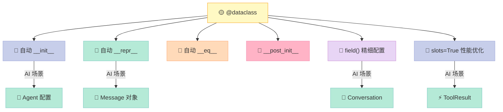

> 写了几百行 `__init__`、`__repr__`、`__eq__`，只为定义一个「数据容器」？Dataclass 让 Python 程序员从重复劳动中解放出来，专注于业务逻辑本身。

---

## 前言

在 AI 开发中，我们经常需要定义：
- **Agent 配置**：name、model、temperature、max_tokens...
- **消息对象**：role、content、timestamp...
- **工具定义**：name、description、parameters...

传统写法：

```python
class Message:
    def __init__(self, role: str, content: str, timestamp: float):
        self.role = role
        self.content = content
        self.timestamp = timestamp
    def __repr__(self):
        return f"Message(role={self.role!r}, content={self.content!r}, timestamp={self.timestamp!r})"
    def __eq__(self, other):
        if not isinstance(other, Message):
            return False
        return self.role == other.role and self.content == other.content and self.timestamp == other.timestamp
```

**四五十行代码，只为定义一个数据结构？** Dataclass 登场。

---

## 一、@dataclass 基础：自动生成魔法方法

```python
from dataclasses import dataclass, field
from typing import Optional, ClassVar
import time

# === 基本 dataclass ===
@dataclass
class Message:
    role: str
    content: str
    timestamp: float = field(default_factory=time.time)

msg = Message(role="user", content="Hello")
print(msg)
```

输出：
```
Message(role='user', content='Hello', timestamp=1745312400.123)
```

**@dataclass 自动生成**：
| 魔法方法 | 作用 |
|---------|------|
| `__init__(self, ...)` | 自动根据字段生成 |
| `__repr__(self)` | 可读性良好的字符串 |
| `__eq__(self, other)` | 按值比较（而非引用） |

> 💡 **提示**：`field(default_factory=...)` 用于可变默认值（如 `list`、`dict`），避免共享引用 bug。

---

## 二、__post_init__：初始化后验证

dataclass 生成 `__init__` 后，会调用 `__post_init__`（如果存在）。这是**验证和二次初始化的好地方**。

```python
# === __post_init__ validation ===
@dataclass
class AgentConfig:
    name: str
    model: str
    temperature: float = 0.7
    max_tokens: int = 2048
    
    def __post_init__(self):
        if not 0.0 <= self.temperature <= 2.0:
            raise ValueError(f"Temperature 0-2 required, got {self.temperature}")
        if self.max_tokens <= 0:
            raise ValueError(f"max_tokens must be positive, got {self.max_tokens}")

config = AgentConfig(name="Assistant", model="gpt-4")
print(config)

# 触发验证
try:
    bad_config = AgentConfig(name="Test", model="gpt-4", temperature=5.0)
except ValueError as e:
    print(f"❌ Validation error: {e}")
```

**适用场景**：
- 参数范围检查
- 字段间依赖验证
- 计算派生属性

---

## 三、field 配置详解

`field()` 是 dataclass 的精细化配置神器：

```python
# === field 配置 ===
@dataclass
class Conversation:
    messages: list[dict] = field(default_factory=list)
    system_prompt: str = ""
    max_history: int = field(default=100, compare=False)  # 不参与比较
    metadata: dict = field(default_factory=dict, metadata={"alias": "元数据"})
    
    def add(self, role: str, content: str):
        self.messages.append({"role": role, "content": content})
        while len(self.messages) > self.max_history:
            self.messages.pop(0)

conv = Conversation(system_prompt="You are helpful.")
conv.add("user", "Hi")
conv.add("assistant", "Hello!")
print(f"Messages: {len(conv.messages)}")
print(f"Conv: {conv}")
```

### 常用 field 参数

| 参数 | 作用 | 示例 |
|-----|------|-----|
| `default` | 简单默认值 | `field(default=42)` |
| `default_factory` | 可变对象工厂 | `field(default_factory=list)` |
| `compare` | 是否参与 `__eq__` | `field(compare=False)` |
| `metadata` | 附加元数据 | `field(metadata={"alias": "x"})` |

---

## 四、slots 模式：性能飞跃

Python 3.10+ 支持 `@dataclass(slots=True)`，为 dataclass 启用 **__slots__** 优化。

```python
# === slots mode ===
@dataclass(slots=True)
class ToolResult:
    tool_name: str
    result: str
    success: bool = True
    error: Optional[str] = None

r = ToolResult("calc", "42")
print(r)
# r.new_field = 1  # AttributeError: 'ToolResult' object has no attribute 'new_field'
```

### slots vs 普通 dataclass

| 维度 | slots=True | 默认 |
|-----|-----------|------|
| 内存占用 | 🟢 低（约减少 40%）| 🔴 较高 |
| 实例创建 | 🟢 快 | 🟡 略慢 |
| 动态字段 | ❌ 不支持 | ✅ 支持 |
| 继承 | ⚠️ 有限制 | ✅ 完全支持 |

> **AI 场景推荐**：对于频繁创建的 `ToolResult`、`Message` 等轻量对象，启用 `slots=True` 可显著降低内存占用。

---

## 五、attrs 库对比

`attrs` 是 Python 另一个流行的数据类库，比 dataclass 更早出现，功能也更丰富。

```python
# attrs 示例（需要 pip install attrs）
import attr

@attr.s(auto_attribs=True)
class Message:
    role: str
    content: str
    timestamp: float = attr.Factory(time.time)
    
    @attr.s
    class Validator:
        @staticmethod
        def validate_message(msg):
            return len(msg.content) > 0
```

### dataclass vs attrs

| 特性 | dataclass | attrs |
|-----|----------|-------|
| 标准库 | ✅ 内置 | ❌ 需安装 |
| `slots` 支持 | ✅ 3.10+ | ✅ `@attr.s(slots=True)` |
| ` validators` | ❌ 需手动 | ✅ 内置 |
| `converters` | ❌ 无 | ✅ 内置 |
| 复杂度 | 简单 | 功能更多 |

**建议**：AI 开发中，优先使用标准库 `dataclass`；若需要 validators/converters，再考虑 `attrs`。

---

## 六、AI 实战：完整 Agent 示例

### 案例 1：消息与会话管理

```python
from dataclasses import dataclass, field
from typing import Optional

@dataclass
class Message:
    role: str  # "system" | "user" | "assistant"
    content: str
    timestamp: float = field(default_factory=time.time)
    
    def to_dict(self) -> dict:
        return {"role": self.role, "content": self.content}

@dataclass
class Conversation:
    messages: list[Message] = field(default_factory=list)
    system_prompt: str = ""
    max_history: int = 100
    
    def add(self, role: str, content: str) -> None:
        msg = Message(role=role, content=content)
        self.messages.append(msg)
        while len(self.messages) > self.max_history:
            self.messages.pop(0)
    
    def get_context(self) -> list[dict]:
        ctx = []
        if self.system_prompt:
            ctx.append({"role": "system", "content": self.system_prompt})
        ctx.extend(m.to_dict() for m in self.messages)
        return ctx
```

### 案例 2：Agent 配置与工具定义

```python
@dataclass
class AgentConfig:
    name: str
    model: str
    temperature: float = 0.7
    max_tokens: int = 2048
    
    def __post_init__(self):
        if not 0.0 <= self.temperature <= 2.0:
            raise ValueError(f"Temperature must be 0-2, got {self.temperature}")

@dataclass
class Tool:
    name: str
    description: str
    parameters: dict  # JSON Schema
    required: list[str] = field(default_factory=list)
    
    def validate(self, args: dict) -> bool:
        return all(k in args for k in self.required)
    
    def get_schema(self) -> dict:
        return {
            "name": self.name,
            "description": self.description,
            "parameters": self.parameters
        }

@dataclass
class Agent:
    name: str
    config: AgentConfig
    tools: list[Tool] = field(default_factory=list)
    conversation: Conversation = field(default_factory=Conversation)
    
    def execute_tool(self, tool_name: str, args: dict) -> str:
        for tool in self.tools:
            if tool.name == tool_name and tool.validate(args):
                return f"Executed {tool_name}: {args}"
        return f"Tool {tool_name} not found or invalid args"
    
    def add_message(self, role: str, content: str):
        self.conversation.add(role, content)
    
    def get_context(self) -> list[dict]:
        return self.conversation.get_context()

# === 完整使用示例 ===
tool = Tool(
    name="calculator",
    description="Perform math calculations",
    parameters={
        "type": "object",
        "properties": {
            "expr": {"type": "string", "description": "Math expression"}
        }
    },
    required=["expr"]
)

agent = Agent(
    name="MathBot",
    config=AgentConfig(name="MathBot", model="gpt-4", temperature=0.5),
    tools=[tool]
)

agent.add_message("user", "What's 2+2?")
print(f"Context: {agent.get_context()}")
print(agent.execute_tool("calculator", {"expr": "2+2"}))
```

**输出**：
```
Context: [{'role': 'user', 'content': "What's 2+2?"}]
Executed calculator: {'expr': '2+2'}
```

---

## 七、高级技巧

### 7.1 类变量 vs 实例字段

```python
@dataclass
class ModelInfo:
    # 类变量：所有实例共享
    supported_models: ClassVar[list[str]] = ["gpt-4", "gpt-3.5", "claude-3"]
    
    # 实例字段
    name: str
    version: str

print(ModelInfo.supported_models)  # 直接通过类访问
```

### 7.2 继承注意事项

```python
@dataclass
class BaseResponse:
    request_id: str

@dataclass
class LLMResponse(BaseResponse):  # 子类继承父类的 dataclass
    content: str
    model: str
    tokens_used: int = 0
```

### 7.3 字段排序

```python
from dataclasses import dataclass, field

@dataclass(order=True)
class PriorityMessage:
    priority: int
    content: str = field(compare=False)
```

---

## 八、常见错误与最佳实践

| 错误 | 正确做法 | 原因 |
|-----|--------|------|
| `default=[]` | `field(default_factory=list)` | 避免可变默认值共享 |
| `__init__` 中验证 | `__post_init__` 中验证 | dataclass 不调用自定义 `__init__` |
| `slots=True` + 继承 | 谨慎使用 | 复杂继承链有问题 |
| 忘记 `from dataclasses import field` | 显式导入 | 避免运行时错误 |

---

## 九、总结



**核心要点**：
1. `@dataclass` 自动生成 `__init__`、`__repr__`、`__eq__`
2. `field(default_factory=...)` 处理可变默认值
3. `__post_init__` 是验证和二次初始化的好地方
4. `slots=True` 显著提升大量创建时的内存效率
5. AI 开发中，dataclass 是定义 Agent、Tool、Message 的首选

> 下期预告：**【Python AI教程】（六）异步编程：让 AI 调用不阻塞**——asyncio 在 AI 开发中的实战，批量并发调用 LLM。

---

*代码已通过 Python 3.11+ 验证。*
---

## 📚 Python AI教程 系列导航

> 本文是《Python AI教程》系列第 **5/14** 篇。

| 方向 | 章节 |
|:--|:--|
| ◀ 上一篇 | [（四）类型提示](/2026/04/23/2026-04-25-python-04-type-hints/) |
| 下一篇 ▶ | [（六）async/await](/2026/04/23/2026-04-26-python-06-async-await/) |

<details>
<summary>📖 全部 14 篇目录（点击展开）</summary>

1. [（一）闭包与装饰器](/2026/04/23/2026-04-25-python-01-closures-decorators/)
2. [（二）上下文管理器](/2026/04/23/2026-04-25-python-02-context-managers/)
3. [（三）生成器与迭代器](/2026/04/23/2026-04-25-python-03-generators-iterators/)
4. [（四）类型提示](/2026/04/23/2026-04-25-python-04-type-hints/)
5. [（五）Dataclass 与 attrs](/2026/04/23/2026-04-25-python-05-dataclass-attrs/) **← 当前**
6. [（六）async/await](/2026/04/23/2026-04-26-python-06-async-await/)
7. [（七）Threading 与 Multiprocessing](/2026/04/23/2026-04-26-python-07-threading-multiprocessing/)
8. [（八）函数式编程](/2026/04/23/2026-04-26-python-08-functional-programming/)
9. [（九）描述符协议](/2026/04/23/2026-04-26-python-09-descriptors/)
10. [（十）元类](/2026/04/23/2026-04-26-python-10-metaclasses/)
11. [（十一）Protocol与结构化类型](/2026/04/23/2026-04-26-python-11-protocol-typing/)
12. [（十二）异常链与日志](/2026/04/23/2026-04-27-python-12-exceptions-logging/)
13. [（十三）缓存艺术](/2026/04/23/2026-04-27-python-13-caching/)
14. [（十四）组合模式实战](/2026/04/23/2026-04-27-python-14-composite-ai-agent/)

</details>
