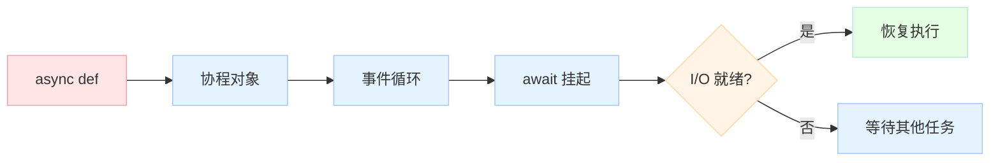

# 【Python AI教程】（六）async/await：异步编程入门到精通

> 如果你在做 AI 应用时需要同时调用多个 LLM API、或者处理大量文件读写，异步编程是必须掌握的技能。它能让你的程序"同时做很多事情"，而不是"一件事做完再做下一件"。

## 同步 vs 异步：排队买咖啡的例子

**同步方式**（普通奶茶店）：
- 你点单 → 等待做 → 拿到 → 下一个人点单
- 10个人排队，每人等2分钟 → **总共20分钟**

**异步方式**（现代咖啡店）：
- 你点单拿到号 → 去做别的事 → 叫号你去拿
- 10个人同时点单 → **总共2分钟**

Python 的 `async/await` 就是让你写"异步代码"像写"同步代码"一样简单。

## 事件循环：异步的心脏

```python
import asyncio

# asyncio.run() 是入口：创建事件循环，运行协程，关闭
async def main():
    print("Hello")
    await asyncio.sleep(1)  # 非阻塞等待
    print("World")

asyncio.run(main())
```

### 事件循环原理


## 基本协程：async def + await

```python
import asyncio

async def say_after(delay: float, msg: str):
    """协程：可以被 await 的函数"""
    await asyncio.sleep(delay)  # 非阻塞！期间可以做其他事
    print(msg)

async def main():
    print(f"Started: {asyncio.get_event_loop().time():.2f}")
    
    # 方式1：顺序执行（不推荐，没利用异步）
    await say_after(0.5, "hello")
    await say_after(0.5, "world")
    
    print(f"Finished: {asyncio.get_event_loop().time():.2f}")

asyncio.run(main())
```

## 并发执行：create_task

这是异步编程的核心——同时启动多个任务：

```python
import asyncio
import time

async def fetch_data(name: str, delay: float) -> str:
    await asyncio.sleep(delay)
    return f"{name}: done in {delay:.1f}s"

async def main():
    start = time.perf_counter()
    
    # 同时创建 3 个任务（不等待！）
    task1 = asyncio.create_task(fetch_data("API-1", 0.5))
    task2 = asyncio.create_task(fetch_data("API-2", 0.3))
    task3 = asyncio.create_task(fetch_data("API-3", 0.4))
    
    # 等待所有任务完成
    results = await asyncio.gather(task1, task2, task3)
    
    elapsed = time.perf_counter() - start
    print(f"Total time: {elapsed:.2f}s")  # ~0.5s（最长的那个），而不是 1.2s
    for r in results:
        print(f"  {r}")

asyncio.run(main())
# 输出：
# Total time: 0.50s
#   API-1: done in 0.5s
#   API-2: done in 0.3s
#   API-3: done in 0.4s
```

## gather：并发等待多个协程

```python
async def call_llm(prompt: str, model: str = "gpt-4") -> str:
    """模拟 LLM API 调用"""
    await asyncio.sleep(0.2)  # 模拟网络延迟
    return f"[{model}] Response to: {prompt}"

async def batch_chat():
    """并发调用多个 LLM"""
    prompts = [
        "What is AI?",
        "What is ML?",
        "What is DL?",
        "What is NLP?",
        "What is CV?"
    ]
    
    # 一次发起 5 个请求
    tasks = [call_llm(p, f"model-{i}") for i, p in enumerate(prompts)]
    responses = await asyncio.gather(*tasks)
    
    for resp in responses:
        print(resp)

asyncio.run(batch_chat())
# 5 个请求并发，总耗时 ~0.2s（最长的那个）
# 如果顺序执行，需要 5 * 0.2 = 1.0s
```

### gather 的返回值顺序

```python
async def numbered(n: int) -> int:
    await asyncio.sleep(n * 0.1)
    return n

async def demo():
    # gather 按顺序返回结果，不管实际完成顺序
    results = await asyncio.gather(
        numbered(3),  # 0.3s
        numbered(1),  # 0.1s
        numbered(2),  # 0.2s
    )
    print(results)  # [3, 1, 2] - 总是按参数顺序！

asyncio.run(demo())
```

## wait：更灵活的任务控制

```python
async def risky_task(n: int) -> str:
    import random
    await asyncio.sleep(0.1)
    if random.random() < 0.3:
        raise ValueError(f"Task {n} failed!")
    return f"Task {n} success"

async def main_wait():
    tasks = [asyncio.create_task(risky_task(i)) for i in range(10)]
    
    # 方式1：等第一批完成
    done, pending = await asyncio.wait(tasks, return_when=asyncio.FIRST_COMPLETED)
    print(f"First completed: {[d.result() for d in done]}")
    
    # 取消剩余任务
    for t in pending:
        t.cancel()
    
    # 方式2：等 N 个完成
    tasks = [asyncio.create_task(risky_task(i)) for i in range(10)]
    done, pending = await asyncio.wait(tasks, return_when=asyncio.N_COMPLETED(5))
    print(f"5 completed: {len(done)} tasks done")

asyncio.run(main_wait())
```

## 限流：Semaphore（信号量）

AI API 通常有 Rate Limit，需要控制并发数：

```python
async def call_llm_limited(
    sem: asyncio.Semaphore,
    prompt: str,
    model: str
) -> str:
    """带限流的 LLM 调用"""
    async with sem:  # 获取令牌，最多同时 N 个
        print(f"[{model}] Starting: {prompt[:20]}...")
        await asyncio.sleep(0.2)  # 模拟 API 调用
        return f"[{model}] Response"

async def main_limited():
    sem = asyncio.Semaphore(3)  # 最多同时 3 个请求
    
    prompts = [f"Prompt {i}" for i in range(10)]
    
    tasks = [
        call_llm_limited(sem, p, f"model-{i%3}")
        for i, p in enumerate(prompts)
    ]
    
    results = await asyncio.gather(*tasks)
    print(f"\nCompleted {len(results)} requests")

asyncio.run(main_limited())
# 10 个请求，最多同时 3 个
# 总耗时：ceil(10/3) * 0.2 ≈ 0.8s
# 如果不加限流，可能触发 API rate limit
```

## Queue：生产者-消费者模式

```python
import asyncio
from dataclasses import dataclass

@dataclass
class LLMJob:
    prompt: str
    priority: int

async def llm_worker(
    name: str,
    queue: asyncio.Queue[LLMJob]
):
    """消费者：不断从队列取任务处理"""
    while True:
        job = await queue.get()
        print(f"[{name}] Processing: {job.prompt}")
        await asyncio.sleep(0.1)  # 模拟 LLM 调用
        queue.task_done()

async def main_queue():
    queue: asyncio.Queue[LLMJob] = asyncio.Queue()
    
    # 创建 3 个 worker
    workers = [
        asyncio.create_task(llm_worker(f"worker-{i}", queue))
        for i in range(3)
    ]
    
    # 生产者：放入 10 个任务
    for i in range(10):
        await queue.put(LLMJob(prompt=f"Task {i}", priority=i))
    
    # 等待所有任务完成
    await queue.join()
    
    # 取消 worker
    for w in workers:
        w.cancel()

asyncio.run(main_queue())
```

## asyncio.StreamReader：流式读取

AI 应用中 LLM 的流式输出（Streaming）非常常见：

```python
import asyncio

async def stream_tokens() -> list[str]:
    """模拟 LLM 流式 token 输出"""
    tokens = []
    words = ["Here", " is ", "your ", "streaming ", "response", "."]
    for word in words:
        await asyncio.sleep(0.05)
        tokens.append(word)
    return tokens

async def consume_stream():
    """消费流式数据（边收边处理）"""
    collected = []
    async for token in stream_tokens():
        collected.append(token)
        print(token, end="", flush=True)  # flush=True 立即显示
    print()
    return "".join(collected)

asyncio.run(consume_stream())
# 输出：Here is your streaming response. （实时显示）
```

## AI 应用实战：完整的并发 LLM 调用系统

```python
import asyncio
import time
from dataclasses import dataclass
from typing import Optional

@dataclass
class LLMResponse:
    prompt: str
    content: Optional[str]
    error: Optional[str]
    latency: float

async def call_llm(
    session: asyncio.Semaphore,
    prompt: str,
    model: str = "gpt-4"
) -> LLMResponse:
    """带限流和错误处理的 LLM 调用"""
    start = time.perf_counter()
    async with session:
        try:
            # 模拟 API 调用
            await asyncio.sleep(0.1)
            
            # 模拟偶尔失败
            if "fail" in prompt.lower():
                raise ConnectionError(f"API error for {model}")
            
            return LLMResponse(
                prompt=prompt,
                content=f"[{model}]: Response to {prompt}",
                error=None,
                latency=time.perf_counter() - start
            )
        except Exception as e:
            return LLMResponse(
                prompt=prompt,
                content=None,
                error=str(e),
                latency=time.perf_counter() - start
            )

async def batch_llm_calls(
    prompts: list[str],
    max_concurrent: int = 5
) -> list[LLMResponse]:
    """批量并发 LLM 调用"""
    sem = asyncio.Semaphore(max_concurrent)
    
    tasks = [
        call_llm(sem, p, f"model-{i%3}")
        for i, p in enumerate(prompts)
    ]
    
    return await asyncio.gather(*tasks)

async def main():
    prompts = [f"Prompt {i}" for i in range(20)]
    
    start = time.perf_counter()
    responses = await batch_llm_calls(prompts, max_concurrent=10)
    total_time = time.perf_counter() - start
    
    success = sum(1 for r in responses if r.content)
    print(f"Completed: {len(responses)} requests in {total_time:.2f}s")
    print(f"Success: {success}/{len(responses)}")
    print(f"Avg latency: {sum(r.latency for r in responses)/len(responses):.3f}s")
    
    # 显示失败的
    failures = [r for r in responses if r.error]
    if failures:
        print(f"Failures: {[r.error for r in failures]}")

asyncio.run(main())
```

## 异步 vs 线程 vs 多进程：如何选择？

| 场景 | 推荐方案 | 原因 |
|------|---------|------|
| **LLM API 调用**（IO 密集 + 网络等待） | ✅ `asyncio` + `httpx` | 轻量、并发度高、无 GIL 问题 |
| **文件/数据库读写**（IO 密集） | ✅ `asyncio` + `aiofiles/aiohttp` | 同上 |
| **CPU 密集**（数据处理、计算） | ⚠️ `ProcessPoolExecutor` | 绕过 GIL |
| **混合任务**（API 调用 + 数据处理） | ✅ `asyncio` + `ProcessPoolExecutor` | 各司其职 |
| **简单并发爬虫** | ✅ `ThreadPoolExecutor` | 比 asyncio 简单 |
| **已有多线程库**（requests、psycopg2） | ⚠️ `ThreadPoolExecutor` | 避免改造 |

## 常见陷阱

```python
# ❌ 错误：忘记 await
async def bad():
    result = call_llm("prompt")  # 返回的是协程对象，不是结果！
    print(result)  # <coroutine object...>

# ✅ 正确：必须 await
async def good():
    result = await call_llm("prompt")
    print(result)

# ❌ 错误：在同步函数中调用异步函数
def bad_sync():
    asyncio.run(call_llm("prompt"))  # 可以，但不应该嵌套

# ✅ 正确：async 一路 async
async def good_async():
    await call_llm("prompt")
```

## 总结

| 概念 | 作用 |
|------|------|
| `async def` | 定义协程函数 |
| `await` | 等待协程完成（不阻塞事件循环） |
| `asyncio.create_task()` | 创建并发任务 |
| `asyncio.gather()` | 并发等待多个协程 |
| `asyncio.wait()` | 等待任务完成子集 |
| `asyncio.Semaphore` | 限流 |
| `asyncio.Queue` | 生产者-消费者 |
| `asyncio.StreamReader` | 流式数据 |

> **下一章**：【Python AI教程】（七）Threading 与 Multiprocessing：并发三剑客——深入理解 GIL，学习何时该用线程、何时该用进程。
---


## 📚 Python AI教程 系列导航

> 本文是《Python AI教程》系列第 **6/14** 篇。

| 方向 | 章节 |
|:--|:--|
| ◀ 上一篇 | [（五）Dataclass 与 attrs](/2026/04/23/2026-04-25-python-05-dataclass-attrs/) |
| 下一篇 ▶ | [（七）Threading 与 Multiprocessing](/2026/04/23/2026-04-26-python-07-threading-multiprocessing/) |

<details>
<summary>📖 全部 14 篇目录（点击展开）</summary>

1. [（一）闭包与装饰器](/2026/04/23/2026-04-25-python-01-closures-decorators/)
2. [（二）上下文管理器](/2026/04/23/2026-04-25-python-02-context-managers/)
3. [（三）生成器与迭代器](/2026/04/23/2026-04-25-python-03-generators-iterators/)
4. [（四）类型提示](/2026/04/23/2026-04-25-python-04-type-hints/)
5. [（五）Dataclass 与 attrs](/2026/04/23/2026-04-25-python-05-dataclass-attrs/)
6. [（六）async/await](/2026/04/23/2026-04-26-python-06-async-await/) **← 当前**
7. [（七）Threading 与 Multiprocessing](/2026/04/23/2026-04-26-python-07-threading-multiprocessing/)
8. [（八）函数式编程](/2026/04/23/2026-04-26-python-08-functional-programming/)
9. [（九）描述符协议](/2026/04/23/2026-04-26-python-09-descriptors/)
10. [（十）元类](/2026/04/23/2026-04-26-python-10-metaclasses/)
11. [（十一）Protocol与结构化类型](/2026/04/23/2026-04-26-python-11-protocol-typing/)
12. [（十二）异常链与日志](/2026/04/23/2026-04-27-python-12-exceptions-logging/)
13. [（十三）缓存艺术](/2026/04/23/2026-04-27-python-13-caching/)
14. [（十四）组合模式实战](/2026/04/23/2026-04-27-python-14-composite-ai-agent/)

</details>

## 对比分析

本章核心是 Python 的 `async/await` 协程（PEP 492 / 525 / 654）。

### 维度一：async/await vs 旧写法

| 方案 | 写法 | 性能 | 可读性 | 生态 |
|------|------|------|--------|------|
| **async/await（PEP 492）** | 关键字 | 高 | 高 | 标准库 + 第三方齐全 |
| **生成器协程（`@asyncio.coroutine`，3.4）** | `yield from` | 中 | 中 | 已被 `async/await` 替代 |
| **gevent（猴子补丁）** | 同步写法 | 高 | 高 | 单线程、隐式切换 |
| **twisted（回调）** | 回调链 | 中 | 低（callback hell） | 老牌框架 |
| **线程池** | `concurrent.futures.ThreadPoolExecutor` | 中 | 中 | 简单并发 |

### 维度二：与其他语言的异步模型

| 语言 | 异步模型 | 与 Python `async/await` 对比 |
|------|----------|------------------------------|
| **JavaScript** | `Promise` + `async/await` | 几乎完全相同的语法；区别在事件循环由 V8 提供，Python 需 `asyncio.run` |
| **TypeScript** | 同 JS，但带类型 | `Promise<T>` 对应 `Awaitable[T]`；类型推导略胜 Python |
| **Go** | goroutine + channel | CSP 模型，结构化并发（`errgroup` / `context`）；语法比 async/await 更"过程式" |
| **Rust** | `async/await` + `tokio/async-std` | 几乎同样的关键字；Future 是惰性的，需要显式 `.await` |
| **Java** | `CompletableFuture` / `Reactor` / `Loom`（虚拟线程） | Project Loom 之前生态割裂；Loom 之后与 async/await 殊途同归 |
| **C#** | `async/await`（最早实现者） | C# 2012 年就引入；语法几乎相同；`Task<T>` 类型系统集成更好 |
| **Kotlin** | `suspend` + 协程 | 结构化并发、取消传播（`Job`）；语法比 Python 更丰富 |
| **Swift** | `async/await`（5.5+） | 后入场者；`Task` + 结构化并发，API 较新 |

### 维度三：asyncio vs 多线程 vs 多进程

| 维度 | asyncio | threading | multiprocessing |
|------|---------|-----------|-----------------|
| 并发模型 | 协作式（单线程） | 抢占式 | 多进程 |
| 适合 | 高 I/O、低 CPU | I/O 阻塞可接受 GIL | CPU 密集 |
| 内存 | 极低（每 task ~几 KB） | 较高（每线程 ~8 MB 栈） | 高（每进程独立） |
| 切换开销 | 极低 | 中（系统调用） | 高（IPC） |
| 适合场景 | LLM 流式、HTTP、WebSocket | 阻塞 I/O 库无法改写 | 数据预处理、模型推理 |

### 优缺点小结

- **Python asyncio**：库生态丰富（aiohttp / asyncpg / httpx）；缺点是"一旦 await 必须一路 await"
- **JavaScript async/await**：V8 内置、语言级一等公民；缺点是单线程下 CPU 密集任务仍卡 UI
- **Go goroutine**：开箱即用几万并发、结构化并发；缺点是没有 async/await 关键字
- **Rust async/await**：零成本抽象、Tokio 生态强；缺点是生命周期标注、Pin/Box 复杂
- **C# async/await**：类型系统集成最好（`ValueTask<T>`）；缺点是历史包袱（同步方法混用）

### 何时选

- 选 **asyncio**：高并发 I/O（Web 服务、爬虫、LLM 流式 API）
- 选 **线程池**：库是阻塞 I/O、无法改成 async
- 选 **多进程**：CPU 密集（数据预处理、模型推理）
- 选 **gevent**：老项目不想大改、能接受 monkey patch
- 不推荐 **裸 twisted 回调**：已被 async/await 取代
