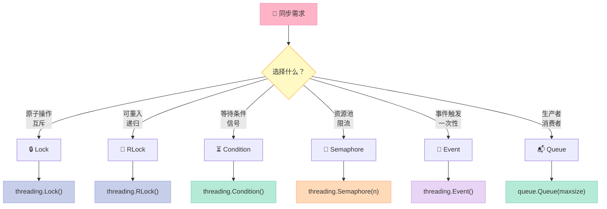
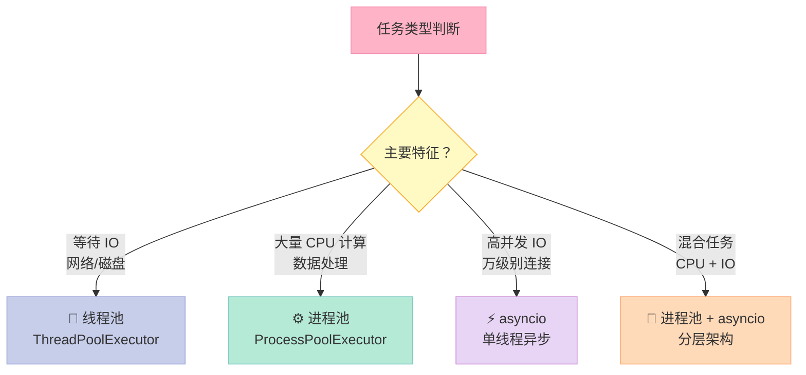

> **反常识结论**：多线程在 Python 中并不一定能加速你的代码——即使你有 16 核 CPU，一个 CPU 密集型的 Python 程序也可能只跑出单核的速度。这不是你的问题，是 Python 设计的「原罪」。本文彻底拆解 GIL 原理、线程 vs 进程的抉择，以及 AI 工程中的并发实战套路。

---

## 一、GIL：Python 并发的阿喀琉斯之踵

### 1.1 GIL 是什么？

**GIL（Global Interpreter Lock，全局解释器锁）** 是 CPython 实现中的一个mutex。它确保**同一时刻只有一个线程持有 GIL**，执行 Python 字节码。

```python
import dis

def count_loop():
    x = 0
    for i in range(1000):
        x += i
    return x

# 查看字节码：每一条指令都在 GIL 保护下执行
dis.dis(count_loop)
```

### 1.2 为什么要设计 GIL？

Python 的内存管理不是线程安全的。CPython 使用**引用计数（Reference Counting）** 管理对象生命周期：

```python
import sys

a = []              # refcount = 1
b = a               # refcount = 2
del a               # refcount = 1
del b               # refcount = 0 -> 触发 GC
```

引用计数的增减必须原子化，否则两个线程同时操作会引发**内存泄漏或悬空指针**。GIL 就是这个问题的「简单粗暴」解法——用一个全局锁序列化所有字节码执行。

### 1.3 GIL 何时释放？

**GIL 会在阻塞型 IO 操作时主动释放**，允许其他线程继续执行：

```mermaid
timeline
    title GIL 释放时机
    
    section CPU 密集型
        : 计算 1000000 次加法
        : GIL 一直被 Thread-1 持有
        : 其他线程完全等待
    
    section IO 密集型
        : Thread-1 执行 socket.recv()
        : GIL 释放
        : Thread-2 开始执行
        : 数据到达，Thread-1 重新竞争 GIL
```

| 操作类型 | 是否释放 GIL | 多线程加速 |
|---------|-------------|-----------|
| CPU 计算（`sum()`/`for`循环） | ❌ 否 | ❌ 无法加速 |
| 文件读写（`open().read()`） | ✅ 是 | ✅ 可以加速 |
| 网络请求（`requests.get()`） | ✅ 是 | ✅ 可以加速 |
| `time.sleep()` | ✅ 是 | ✅ 可以加速 |
| `threading.Lock` 等待 | ✅ 是 | ⚠️ 需设计合理 |

### 1.4 GIL 的实际影响

```python
import threading
import time

# CPU 密集型：4 线程 vs 单线程，几乎没差别
def cpu_task():
    return sum(i * i for i in range(1_000_000))

start = time.perf_counter()
threads = [threading.Thread(target=cpu_task) for _ in range(4)]
for t in threads: t.start()
for t in threads: t.join()
print(f"4 threads CPU: {time.perf_counter() - start:.2f}s")  # ~2.5s (无加速)

# IO 密集型：4 线程显著加速
def io_task():
    time.sleep(0.1)  # 模拟网络延迟
    return "done"

start = time.perf_counter()
threads = [threading.Thread(target=io_task) for _ in range(4)]
for t in threads: t.start()
for t in threads: t.join()
print(f"4 threads IO: {time.perf_counter() - start:.2f}s")  # ~0.1s (4x 加速)
```

---

## 二、threading 模块：底层同步原语

### 2.1 核心同步原语一览



### 2.2 Lock：保护临界区

```python
import threading

counter = 0
lock = threading.Lock()

def increment():
    global counter
    for _ in range(100_000):
        with lock:  # 自动获取/释放锁
            counter += 1

threads = [threading.Thread(target=increment) for _ in range(4)]
for t in threads: t.start()
for t in threads: t.join()
print(f"Counter: {counter}")  # 400000（正确）
# 不加锁结果会小于 400000（race condition）
```

### 2.3 RLock：可重入锁

`Lock` 在同一线程内不可重复获取，会死锁。`RLock` 允许同一线程多次获取：

```python
lock = threading.Lock()
# lock.acquire()
# lock.acquire()  # Deadlock！

rlock = threading.RLock()
rlock.acquire()
rlock.acquire()  # OK，同一线程可多次获取
rlock.release()
rlock.release()
```

### 2.4 Condition：条件变量

用于复杂的线程间协调——生产者/消费者场景：

```python
import threading
from queue import Queue

class AsyncLLMCaller:
    def __init__(self, max_workers=5):
        self.queue = Queue()
        self.results = {}
        self.condition = threading.Condition()
        self.workers = [
            threading.Thread(target=self._worker, daemon=True)
            for _ in range(max_workers)
        ]
        for w in self.workers: w.start()
    
    def _worker(self):
        while True:
            task_id, prompt = self.queue.get()
            result = f"Response to: {prompt}"  # 模拟 LLM 调用
            with self.condition:
                self.results[task_id] = result
                self.condition.notify()
            self.queue.task_done()
    
    def call(self, prompt: str, timeout=30):
        task_id = id(prompt)
        self.queue.put((task_id, prompt))
        with self.condition:
            self.condition.wait_for(lambda: task_id in self.results, timeout=timeout)
        return self.results.get(task_id, "Timeout")

# 使用示例
caller = AsyncLLMCaller(max_workers=3)
result = caller.call("What is AI?", timeout=10)
print(result)
```

### 2.5 Semaphore：信号量

控制同时访问资源的线程数量（如控制数据库连接数）：

```python
import threading
import time

# 限制同时只能有 3 个线程访问 API
semaphore = threading.Semaphore(3)

def call_api(i):
    with semaphore:
        print(f"Thread {i} acquired semaphore")
        time.sleep(1)  # 模拟 API 调用
        print(f"Thread {i} released semaphore")

threads = [threading.Thread(target=call_api, args=(i,)) for i in range(10)]
for t in threads: t.start()
for t in threads: t.join()
# 10 个任务，每批 3 个，每批耗时 1s，总共 ~4s
```

### 2.6 Event：事件触发

用于一次性信号传递（如优雅关闭线程池）：

```python
shutdown_event = threading.Event()

def long_running_task():
    while not shutdown_event.is_set():
        # 做点工作
        print("Working...")
        time.sleep(0.5)
    print("Shutdown gracefully")

# 主线程控制关闭
threading.Thread(target=long_running_task, daemon=True).start()
time.sleep(2)
shutdown_event.set()  # 触发关闭
```

---

## 三、concurrent.futures：高层次并发抽象

### 3.1 ThreadPoolExecutor：IO 密集型的多线程

```python
import concurrent.futures
import time

def fetch_data(url: str) -> dict:
    """模拟网络请求"""
    time.sleep(0.1)  # 模拟网络延迟
    return {"url": url, "data": f"content_of_{url}"}

urls = [f"http://api{i}.com" for i in range(20)]

# 使用 5 个工作线程的线程池
with concurrent.futures.ThreadPoolExecutor(max_workers=5) as executor:
    # submit + as_completed：按完成顺序获取结果
    futures = {executor.submit(fetch_data, url): url for url in urls}
    
    for future in concurrent.futures.as_completed(futures):
        result = future.result()
        print(f"Got: {result['url']}")

# 耗时：20 * 0.1s / 5 = 0.4s（vs 2.0s 顺序执行）
```

### 3.2 ProcessPoolExecutor：CPU 密集型的多进程

绕过 GIL，利用多核 CPU：

```python
import concurrent.futures

def cpu_bound_task(n: int) -> int:
    """CPU 密集型：计算平方和"""
    return sum(i * i for i in range(n))

# 使用 4 个进程
with concurrent.futures.ProcessPoolExecutor(max_workers=4) as executor:
    futures = [
        executor.submit(cpu_bound_task, 1_000_000)
        for _ in range(8)
    ]
    results = [f.result() for f in concurrent.futures.as_completed(futures)]
    print(f"Got {len(results)} CPU results")
    print(f"Sum of squares: {sum(results)}")
```

### 3.3 executor.map：简洁的任务提交

```python
with concurrent.futures.ThreadPoolExecutor(max_workers=5) as executor:
    # map 保持原始顺序，结果按提交顺序返回
    results = executor.map(fetch_data, urls)
    
for result in results:
    print(result)
```

---

## 四、决策表：何时用线程、进程、还是 asyncio？



| 场景 | 推荐方案 | 原因 | 加速比 |
|------|---------|------|--------|
| LLM API 调用（IO 阻塞） | `asyncio + httpx/aiohttp` | 高并发、低内存 | 10-100x |
| 多线程爬虫 | `ThreadPoolExecutor` | IO 密集、GIL 释放 | 5-20x |
| 大量数据预处理（CPU） | `ProcessPoolExecutor` | 绕过 GIL、多核利用 | Nx（N=核数） |
| 混合任务（LLM + 预处理） | `ProcessPoolExecutor + asyncio` | 分层解耦 | 取决于瓶颈 |
| 简单并发任务 | `ThreadPoolExecutor` | 简单直观 | - |

### 4.1 asyncio vs threading：不是替代，是互补

```python
import asyncio
import httpx

# asyncio：单线程内并发处理成千上万个 IO 操作
async def fetch_all(urls: list[str]):
    async with httpx.AsyncClient() as client:
        tasks = [client.get(url) for url in urls]
        responses = await asyncio.gather(*tasks)
    return responses

# threading：多线程处理 IO 操作
import concurrent.futures

def fetch_sync(url: str):
    import requests
    return requests.get(url).text

with concurrent.futures.ThreadPoolExecutor(max_workers=100) as executor:
    results = list(executor.map(fetch_sync, urls))
```

**asyncio 优势**：单线程内可处理万级别并发连接，内存开销极低。
**threading 优势**：代码简单，适合中等并发（<100），可混合 CPU/IO 任务。

---

## 五、AI 工程实战：多线程下载 + 多进程预处理

### 5.1 场景：批量下载 LLM 微调数据

```python
import concurrent.futures
import time
from dataclasses import dataclass

@dataclass
class DatasetItem:
    url: str
    content: str = ""

def download_item(item: DatasetItem) -> DatasetItem:
    """模拟下载（IO 密集）"""
    time.sleep(0.1)  # 网络请求
    item.content = f"content_from_{item.url}"
    return item

def batch_download(items: list[DatasetItem], max_workers=10) -> list[DatasetItem]:
    with concurrent.futures.ThreadPoolExecutor(max_workers=max_workers) as executor:
        return list(executor.map(download_item, items))

# 1000 条数据，10 线程 → 100s vs 顺序 100s（vs 顺序需 100s）
items = [DatasetItem(url=f"http://data{i}.json") for i in range(1000)]
start = time.perf_counter()
results = batch_download(items, max_workers=10)
elapsed = time.perf_counter() - start
print(f"Downloaded {len(results)} items in {elapsed:.2f}s")
```

### 5.2 场景：多进程预处理海量文本

```python
import concurrent.futures
import time
from typing import Callable

def preprocess_text(text: str) -> dict:
    """CPU 密集型：分词、清洗、统计"""
    words = text.lower().split()
    return {
        "word_count": len(words),
        "unique_words": len(set(words)),
        "avg_word_len": sum(len(w) for w in words) / max(len(words), 1),
    }

def parallel_preprocess(texts: list[str], max_workers=4) -> list[dict]:
    with concurrent.futures.ProcessPoolExecutor(max_workers=max_workers) as executor:
        return list(executor.map(preprocess_text, texts))

# 10000 条文本，4 进程 → ~25s vs 顺序 ~100s
texts = [f"sample text number {i} with some words" for i in range(10000)]
start = time.perf_counter()
results = parallel_preprocess(texts, max_workers=4)
elapsed = time.perf_counter() - start
print(f"Preprocessed {len(results)} texts in {elapsed:.2f}s")
```

### 5.3 完整 pipeline：下载 → 清洗 → 特征提取

```python
import concurrent.futures
import time
from typing import TypedDict

class ProcessedItem(TypedDict):
    url: str
    content: str
    features: dict

def download(url: str) -> tuple[str, str]:
    time.sleep(0.1)  # 模拟网络
    return url, f"content_of_{url}"

def preprocess(item: tuple[str, str]) -> ProcessedItem:
    url, content = item
    words = content.lower().split()
    return ProcessedItem(
        url=url,
        content=content,
        features={"word_count": len(words), "has_content": bool(content)}
    )

# 完整 pipeline：线程下载 + 进程预处理
def full_pipeline(urls: list[str]) -> list[ProcessedItem]:
    # Step 1: 多线程下载（IO）
    with concurrent.futures.ThreadPoolExecutor(max_workers=20) as executor:
        downloaded = list(executor.map(download, urls))
    
    # Step 2: 多进程预处理（CPU）
    with concurrent.futures.ProcessPoolExecutor(max_workers=4) as executor:
        return list(executor.map(preprocess, downloaded))

urls = [f"http://data{i}.json" for i in range(100)]
start = time.perf_counter()
results = full_pipeline(urls)
print(f"Pipeline: {len(results)} items in {time.perf_counter() - start:.2f}s")
```

---

## 六、避坑指南

### ❌ 常见误区

| 误区 | 真相 |
|------|------|
| 「多线程总能加速 Python」 | 只有 IO 密集型任务能加速，CPU 密集型反而更慢 |
| 「加个 thread 就完事了」 | 同步原语用错会导致死锁、性能反而下降 |
| 「进程比线程好，能用就用进程」 | 进程创建/通信开销远大于线程，小任务不划算 |
| 「Lock 能不用就不用」 | 不必要的共享状态才是万恶之源，尽量用 queue 通信 |

### ✅ 最佳实践

1. **优先用 `concurrent.futures`**，而不是裸 `threading`/`multiprocessing`
2. **IO 密集用线程，CPU 密集用进程**，混合任务分层解耦
3. **避免共享状态**，用 `Queue` / `Pipe` 进行线程/进程间通信
4. **设置合理的 `max_workers`**：CPU 密集 = CPU 核数；IO 密集 = 2 * CPU 核数 + 磁盘数

---

## 延伸阅读

- [Python 官方文档：threading](https://docs.python.org/3/library/threading.html)
- [Python 官方文档：concurrent.futures](https://docs.python.org/3/library/concurrent.futures.html)
- [Python GIL 深度解析：Dabeaz 的 GIL可视化](http://dabeaz.com/python/UnderstandingGIL.pdf)

---

> **下期预告**：函数式编程三剑客——`map/reduce/filter` + `functools` + `itertools`，教你用声明式思维处理 AI 数据清洗与批量转换 pipeline。
---
## 📚 Python AI教程 系列导航

> 本文是《Python AI教程》系列第 **7/14** 篇。

| 方向 | 章节 |
|:--|:--|
| ◀ 上一篇 | [（六）async/await](/2026/04/23/2026-04-26-python-06-async-await/) |
| 下一篇 ▶ | [（八）函数式编程](/2026/04/23/2026-04-26-python-08-functional-programming/) |

<details>
<summary>📖 全部 14 篇目录（点击展开）</summary>

1. [（一）闭包与装饰器](/2026/04/23/2026-04-25-python-01-closures-decorators/)
2. [（二）上下文管理器](/2026/04/23/2026-04-25-python-02-context-managers/)
3. [（三）生成器与迭代器](/2026/04/23/2026-04-25-python-03-generators-iterators/)
4. [（四）类型提示](/2026/04/23/2026-04-25-python-04-type-hints/)
5. [（五）Dataclass 与 attrs](/2026/04/23/2026-04-25-python-05-dataclass-attrs/)
6. [（六）async/await](/2026/04/23/2026-04-26-python-06-async-await/)
7. [（七）Threading 与 Multiprocessing](/2026/04/23/2026-04-26-python-07-threading-multiprocessing/) **← 当前**
8. [（八）函数式编程](/2026/04/23/2026-04-26-python-08-functional-programming/)
9. [（九）描述符协议](/2026/04/23/2026-04-26-python-09-descriptors/)
10. [（十）元类](/2026/04/23/2026-04-26-python-10-metaclasses/)
11. [（十一）Protocol与结构化类型](/2026/04/23/2026-04-26-python-11-protocol-typing/)
12. [（十二）异常链与日志](/2026/04/23/2026-04-27-python-12-exceptions-logging/)
13. [（十三）缓存艺术](/2026/04/23/2026-04-27-python-13-caching/)
14. [（十四）组合模式实战](/2026/04/23/2026-04-27-python-14-composite-ai-agent/)

</details>

## 对比分析

本章核心是 Python 的 `threading` / `multiprocessing` / `concurrent.futures`。

### 维度一：threading / multiprocessing vs 旧写法

| 方案 | 写法 | 抽象层次 | 推荐指数 |
|------|------|----------|----------|
| **concurrent.futures（PEP 3148）** | `ThreadPoolExecutor` / `ProcessPoolExecutor` | 高（future + map） | ⭐⭐⭐ 首选 |
| **threading.Thread** | 直接 `t = Thread(target=f)` | 中 | ⭐⭐ |
| **multiprocessing.Process** | 直接 `p = Process(target=f)` | 中 | ⭐⭐ |
| **asyncio** | 关键字 + event loop | 高 | ⭐⭐⭐ 适合 I/O |
| **os.fork / subprocess** | 底层系统调用 | 低 | ⭐ 特殊场景 |

### 维度二：GIL 下的并发策略

| 场景 | 推荐方案 | 原因 |
|------|----------|------|
| 网络 I/O（HTTP、DB） | `asyncio` 或 `ThreadPoolExecutor` | GIL 会释放 |
| 文件 I/O | `ThreadPoolExecutor` | GIL 释放 |
| CPU 密集（numpy / pandas） | `ProcessPoolExecutor` | 需绕开 GIL；库本身已释放 GIL |
| CPU 密集（纯 Python） | `multiprocessing` / C 扩展 | 纯 Python 不释放 GIL |
| GPU 推理（PyTorch） | 单进程异步 + CUDA streams | GIL 几乎无影响，瓶颈在 GPU |

### 维度三：与其他语言的并发模型

| 语言 | 并发原语 | 与 Python 对比 |
|------|----------|----------------|
| **Java** | `Thread` + `ExecutorService` + `ForkJoinPool` | 线程是真并行（无 GIL）；`CompletableFuture` 类似 `Future` |
| **C++** | `std::thread` / `std::async` | 真并行；需手动管理线程生命周期 |
| **Go** | goroutine + channel | 开箱即用几万并发、调度器更智能；语法上"自动并行" |
| **Rust** | `std::thread` + `tokio::spawn` | 零成本抽象；`Send/Sync` 标记保证线程安全 |
| **C#** | `Task` + `ThreadPool` + TPL Dataflow | 与 `concurrent.futures` 思路最像 |
| **Erlang/Elixir** | 进程 + 消息传递 | 百万级进程；面向"全分布式"场景 |

### 优缺点小结

- **Python threading**：API 简单；缺点是 GIL 限制 + 锁地狱
- **Python multiprocessing**：真并行；缺点是 IPC 开销、不能共享复杂对象
- **concurrent.futures**：高层抽象、跨线程/进程统一 API；缺点是不支持取消
- **Go goroutine**：最易用、调度器最强；缺点是没有"线程 vs 协程" 选择
- **Rust std::thread + Send/Sync**：编译期保证线程安全；缺点是生命周期标注

### 何时选

- 选 **ThreadPoolExecutor**：阻塞 I/O 库（`requests` / 同步 ORM）
- 选 **ProcessPoolExecutor**：CPU 密集任务
- 选 **asyncio**：能改写为 async 的 I/O 库
- 选 **multiprocessing.Manager / Queue**：需要跨进程共享数据
- 选 **subprocess**：启动独立可执行程序
- 不推荐 **裸线程 + 全局锁**：尽量用高层抽象（Queue / Lock 上下文管理器）
