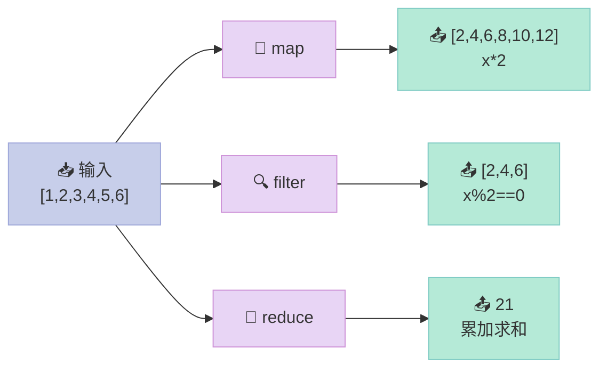
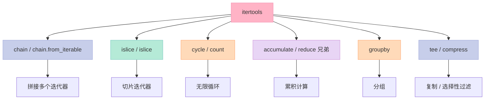

> **反常识结论**：`for` 循环不一定是处理数据的最佳方式——当你用 `map`/`filter`/`reduce` 重写逻辑时，代码不仅更简洁，还更容易并行化。本文从 AI 工程视角，系统讲解函数式编程在数据清洗、批量转换、pipeline 构建中的实战应用。

---

## 一、函数式基础：lambda 与高阶函数

### 1.1 lambda：匿名函数的本质

`lambda` 是匿名函数，本质上是一个表达式，返回一个函数对象：

```python
# 普通函数
def add(a, b):
    return a + b

# 等价的 lambda
add = lambda a, b: a + b

print(add(3, 5))  # 8
print((lambda x: x ** 2)(5))  # 25
```

**lambda 限制**：只能写单个表达式，不能包含语句（`if`/`for`/`while` 但可以有三元表达式）。

### 1.2 高阶函数：函数的函数

接受函数作为参数或返回函数的函数：

```python
from typing import Callable

def apply_twice(f: Callable, x: int) -> int:
    """对 x 两次应用函数 f"""
    return f(f(x))

print(apply_twice(lambda x: x + 1, 0))  # 2
print(apply_twice(lambda x: x * 2, 3)) # 12
```

### 1.3 map / filter / reduce：三剑客



```python
nums = [1, 2, 3, 4, 5, 6]

# map: 转换每个元素
doubled = list(map(lambda x: x * 2, nums))
print(f"Doubled: {doubled}")  # [2, 4, 6, 8, 10, 12]

# filter: 筛选满足条件的元素
evens = list(filter(lambda x: x % 2 == 0, nums))
print(f"Evens: {evens}")  # [2, 4, 6]

# reduce: 累积计算（需要 import functools）
import functools
product = functools.reduce(lambda acc, x: acc * x, nums, 1)
print(f"Sum: {sum(nums)}, Product: {product}")  # Sum: 21, Product: 720
```

### 1.4 组合使用：函数式思维

```python
# 计算偶数平方和：for 循环版本
nums = range(1, 11)
total = 0
for x in nums:
    if x % 2 == 0:
        total += x * x

# 函数式版本：可读性更强，每一步职责单一
total = sum(
    map(lambda x: x * x,
        filter(lambda x: x % 2 == 0, nums))
)
print(f"Sum of squares of evens: {total}")  # 220
```

---

## 二、functools：函数式工具箱

### 2.1 partial：冻结部分参数

创建一个新函数，固定某些参数：

```python
import functools

# 基础函数
basic_add = lambda a, b: a + b

# 固定第一个参数为 10
add_ten = functools.partial(basic_add, 10)
print(add_ten(5))   # 15
print(add_ten(20))  # 30

# 实际应用：创建特定配置的数据转换函数
def transform(text: str, prefix: str, suffix: str) -> str:
    return f"{prefix}{text}{suffix}"

uppercase_transform = functools.partial(transform, prefix=">>> ", suffix=" <<<")
print(uppercase_transform("hello"))  # ">>> hello <<<"
```

### 2.2 lru_cache：自动缓存 expensive 函数

`@lru_cache` 是 AI 工程中的神器——避免重复计算和 API 调用：

```python
import functools

@functools.lru_cache(maxsize=128)
def expensive_llm_call(prompt: str) -> str:
    """模拟昂贵的 LLM API 调用"""
    print(f"[CACHE MISS] Calling LLM for: {prompt[:30]}...")
    return f"Response to: {prompt}"

# 第一次调用（缓存未命中）
r1 = expensive_llm_call("What is machine learning?")
print(r1)

# 第二次相同调用（命中缓存）
r2 = expensive_llm_call("What is machine learning?")
print(r2)

# 查看缓存统计
print(f"Cache info: {expensive_llm_call.cache_info()}")
# CacheInfo(hits=1, misses=1, maxsize=128, currsize=1)
```

### 2.3 cache：无限缓存的 lru_cache

Python 3.9+ 提供 `@cache`，等价于 `maxsize=None` 的 `@lru_cache`：

```python
import functools

@functools.cache
def factorial(n: int) -> int:
    """递归计算阶乘，自动缓存中间结果"""
    return n * factorial(n - 1) if n else 1

print(factorial(100))  # 非常快
print(factorial(50))   # 命中缓存
```

### 2.4 singledispatch：函数重载

根据第一个参数类型选择不同实现：

```python
import functools
from typing import Any

@functools.singledispatch
def serialize(obj: Any) -> str:
    """默认实现"""
    return str(obj)

@serialize.register
def _(obj: dict) -> str:
    """字典序列化"""
    return f"JSON: {obj}"

@serialize.register(list)
def _(obj: list) -> str:
    """列表序列化"""
    return f"LIST: [{', '.join(map(str, obj))}]"

print(serialize(123))           # 123
print(serialize({"a": 1}))       # JSON: {'a': 1}
print(serialize([1, 2, 3]))      # LIST: 1, 2, 3
```

---

## 三、itertools：无限迭代器的艺术

### 3.1 核心函数一览



### 3.2 chain / chain.from_iterable：拼接迭代器

```python
import itertools

# chain: 按顺序拼接多个可迭代对象
combined = list(itertools.chain([1, 2], ['a', 'b'], [True, False]))
print(combined)  # [1, 2, 'a', 'b', True, False]

# chain.from_iterable: 展平嵌套结构
nested = [[1, 2], [3, 4], [5, 6]]
flattened = list(itertools.chain.from_iterable(nested))
print(flattened)  # [1, 2, 3, 4, 5, 6]
```

### 3.3 islice：惰性切片

```python
import itertools

# 类似列表切片，但惰性（不预加载全部数据）
nums = range(100)

# 取前 10 个
first_10 = list(itertools.islice(nums, 10))
print(first_10)  # [0, 1, 2, 3, 4, 5, 6, 7, 8, 9]

# 从第 5 个开始，取 10 个
slice_5_15 = list(itertools.islice(nums, 5, 15))
print(slice_5_15)  # [5, 6, 7, 8, 9, 10, 11, 12, 13, 14]

# 每隔 3 个取一个
step_3 = list(itertools.islice(nums, 0, 30, 3))
print(step_3)  # [0, 3, 6, 9, 12, 15, 18, 21, 24, 27]
```

### 3.4 cycle / count：无限迭代器

```python
import itertools

# cycle: 无限循环
colors = itertools.cycle(['🔴', '🟢', '🔵'])
for i in range(6):
    print(next(colors), end=" ")
print()
# 输出: 🔴 🟢 🔵 🔴 🟢 🔵

# count: 无限递增计数器
counter = itertools.count(start=1, step=2)  # 1, 3, 5, 7, ...
for i in itertools.islice(counter, 5):
    print(i, end=" ")
print()
# 输出: 1 3 5 7 9

# 实用技巧：cycle + islice 实现"轮询调度"
models = ['gpt-4', 'claude-3', 'gemini-pro']
def round_robin(items, n):
    """返回前 n 个元素的轮询序列"""
    return list(itertools.islice(itertools.cycle(items), n))

print(round_robin(models, 7))
# ['gpt-4', 'claude-3', 'gemini-pro', 'gpt-4', 'claude-3', 'gemini-pro', 'gpt-4']
```

### 3.5 accumulate：累积计算

类似 `reduce`，但返回每一步的中间结果：

```python
import itertools

nums = [1, 2, 3, 4, 5]

# 累积求和
cumsum = list(itertools.accumulate(nums))
print(cumsum)  # [1, 3, 6, 10, 15]

# 累积最大值
cummax = list(itertools.accumulate(nums, max))
print(cummax)  # [1, 2, 3, 4, 5]

# 字符串累积
import functools
words = ['Hello', ' ', 'World', '!']
concatenated = functools.reduce(lambda a, b: a + b, words)
print(concatenated)  # "Hello World!"

# 使用 accumulate 实现同样效果
result = list(itertools.accumulate(words, lambda a, b: a + b))
print(result[-1])    # "Hello World!"
```

### 3.6 groupby：分组

```python
import itertools

data = [("cat", 1), ("dog", 2), ("cat", 3), ("bird", 4), ("dog", 5)]

# 注意：必须先排序！groupby 只聚合相邻的相同 key
for key, group in itertools.groupby(sorted(data), key=lambda x: x[0]):
    items = list(group)
    print(f"{key}: {items}")

# 输出:
# bird: [('bird', 4)]
# cat: [('cat', 1), ('cat', 3)]
# dog: [('dog', 2), ('dog', 5)]
```

### 3.7 tee：复制迭代器

```python
import itertools

original = [1, 2, 3, 4, 5]

# tee 返回 n 个独立的迭代器（共享底层数据）
it1, it2, it3 = itertools.tee(original, 3)

print(list(it1))  # [1, 2, 3, 4, 5]
print(list(it2))  # [1, 2, 3, 4, 5]
print(list(it3))  # [1, 2, 3, 4, 5]

# 警告：已读取的数据不能回退，多线程共享时要小心
```

### 3.8 compress：选择性过滤

根据布尔掩码过滤元素：

```python
import itertools

data = ['A', 'B', 'C', 'D', 'E', 'F']
mask = [True, False, True, False, True, False]

filtered = list(itertools.compress(data, mask))
print(filtered)  # ['A', 'C', 'E']

# 实用技巧：结合 itertools.count 实现复杂过滤
# 过滤所有质数位置上的元素
def is_prime(n):
    if n < 2: return False
    for i in range(2, int(n**0.5) + 1):
        if n % i == 0: return False
    return True

items = range(20)
prime_positions = [is_prime(i) for i in range(20)]
print(list(itertools.compress(items, prime_positions)))
# [2, 3, 5, 7, 11, 13, 17, 19] — 质数位置的元素
```

---

## 四、函数组合：打造数据处理 pipeline

### 4.1 compose：函数组合

数学上 `(f ∘ g)(x) = f(g(x))`，Python 实现：

```python
from typing import Callable, TypeVar

T = TypeVar("T")

def compose(*funcs: Callable) -> Callable:
    """
    函数组合: compose(f, g, h)(x) = f(g(h(x)))
    从右到左依次执行
    """
    def composed(x):
        result = x
        for f in reversed(funcs):  # 反转：先执行最右边的函数
            result = f(result)
        return result
    return composed

# 示例：文本处理 pipeline
strip = lambda s: s.strip()
lower = lambda s: s.lower()
remove_punct = lambda s: ''.join(c for c in s if c.isalnum() or c.isspace())

normalize = compose(strip, lower, remove_punct)
print(normalize("  Hello, WORLD!!!  "))  # "hello world"
```

### 4.2 管道操作符（Pipe Pattern）

虽然 Python 没有内置管道，但可以用 `reduce` 实现：

```python
from functools import reduce

def pipe(value, *funcs):
    """类似 Unix 管道的操作符"""
    return reduce(lambda v, f: f(v), funcs, value)

# 文本处理管道
result = pipe(
    "  Hello, WORLD!!!  ",
    lambda s: s.strip(),           # 去空格
    lambda s: s.lower(),           # 转小写
    lambda s: ''.join(c for c in s if c.isalnum() or c.isspace()),  # 去标点
    lambda s: s.split(),           # 分词
    lambda words: [w for w in words if len(w) > 2],  # 过滤短词
    lambda words: sorted(set(words)),  # 去重排序
)
print(result)  # ['hello', 'world']
```

---

## 五、AI 工程实战：数据清洗与批量转换

### 5.1 场景：LLM 对话数据清洗

```python
import functools
import itertools

# 原始数据：混合的用户/助手对话
messages = [
    {"role": "user", "content": "Hi"},
    {"role": "user", "content": "What is machine learning?"},
    {"role": "assistant", "content": "ML is a subset of AI"},
    {"role": "user", "content": "Tell me about neural networks"},
    {"role": "system", "content": "You are a helpful assistant"},
    {"role": "user", "content": "Thanks!"},
]

# Step 1: 只保留用户消息，过滤太短的
user_messages = filter(lambda m: m["role"] == "user" and len(m["content"]) > 2, messages)

# Step 2: 转换格式，添加元数据
transformed = map(lambda m: {
    "text": m["content"],
    "length": len(m["content"]),
    "word_count": len(m["content"].split()),
}, user_messages)

# Step 3: 只保留长度 > 5 的
filtered = filter(lambda m: m["length"] > 5, transformed)

# Step 4: 收集结果
result = list(filtered)
for item in result:
    print(item)

# 输出:
# {'text': 'What is machine learning?', 'length': 26, 'word_count': 4}
# {'text': 'Tell me about neural networks', 'length': 29, 'word_count': 5}
```

### 5.2 场景：批量转换不同格式的数据

```python
import functools
import itertools
from typing import Any

# 异构数据源：JSON、CSV 行、原始文本
data_sources = [
    {"type": "json", "content": '{"prompt": "What is AI?", "response": "AI is..."}'},
    {"type": "csv", "content": "prompt,response\nWhat is ML?,Machine Learning is..."},
    {"type": "text", "content": "Plain text conversation here"},
]

@functools.singledispatch
def parse_content(item: dict) -> dict:
    """默认解析器"""
    return {"text": item["content"], "parsed": False}

@parse_content.register
def _(item: dict) -> dict:
    if item["type"] == "json":
        import json
        parsed = json.loads(item["content"])
        return {"text": parsed.get("prompt", ""), "parsed": True, "source": "json"}
    raise NotImplementedError

# 使用 functools.partial 为每种类型创建专门的解析器
parse_json = functools.partial(parse_content.register(lambda item: {"text": item["content"], "parsed": False}), _=None)

# 用 chain 合并多个数据源的处理结果
all_texts = list(itertools.chain(
    map(lambda x: {"text": x["content"], "source": x["type"]}, data_sources)
))

print(all_texts)
```

### 5.3 场景：特征提取 pipeline

```python
import functools
import itertools

def extract_features(text: str) -> dict:
    """从文本提取多维特征"""
    words = text.lower().split()
    chars = list(text)
    
    return {
        "raw_length": len(text),
        "word_count": len(words),
        "unique_words": len(set(words)),
        "avg_word_len": sum(len(w) for w in words) / max(len(words), 1),
        "char_types": {
            "alpha": sum(c.isalpha() for c in chars),
            "digit": sum(c.isdigit() for c in chars),
            "space": sum(c.isspace() for c in chars),
        }
    }

# 批量处理
texts = [
    "Hello world, this is a test",
    "Python is awesome! 123",
    "AI and machine learning are transforming technology",
]

# 使用 map 批量提取特征
features = list(map(extract_features, texts))

# 使用 itertools.groupby 按特征分组
# 例如：按词数分组
sorted_by_words = sorted(features, key=lambda f: f["word_count"])
for length, group in itertools.groupby(sorted_by_words, key=lambda f: f["word_count"]):
    items = list(group)
    print(f"Word count {length}: {len(items)} texts")
```

### 5.4 场景：LLM 调用去重与缓存

```python
import functools
import hashlib

@functools.lru_cache(maxsize=1024)
def cached_llm_call(prompt: str) -> str:
    """带缓存的 LLM 调用，自动去重"""
    # 模拟实际 LLM API 调用
    return f"Response to: {prompt[:50]}..."

# 模拟多次相同请求（常见于 RAG 检索结果有重复）
prompts = [
    "What is AI?",
    "What is machine learning?",
    "What is AI?",  # 重复
    "What is deep learning?",
    "What is AI?",  # 再次重复
]

# 直接调用：重复请求会命中缓存
for p in prompts:
    result = cached_llm_call(p)
    print(f"Prompt: {p[:20]}... -> {result[:30]}...")

print(f"\nCache stats: {cached_llm_call.cache_info()}")
# hits=2, misses=3 — 3 次真正调用，2 次命中缓存
```

---

## 六、避坑指南

### ❌ 函数式的陷阱

| 陷阱 | 问题 | 解决方案 |
|------|------|---------|
| 链式 map/filter 过长 | 可读性差，调试困难 | 用管道函数或变量中转 |
| 滥用 lambda | 复杂逻辑不可读 | 及时提取为命名函数 |
| 忽略迭代器惰性 | 意外重复迭代 | 注意 itertools 返回的是迭代器 |
| groupby 未排序 | 分组错误 | 始终先排序再 groupby |

### ✅ 最佳实践

1. **链式操作控制在 3 层以内**，更深就用变量中转
2. **`map/filter/reduce`** 适合简单转换，复杂逻辑用普通循环
3. **善用 `functools.partial`** 创建可配置的转换函数
4. **`itertools`** 永远是惰性的——处理大数据集时不占内存

---

## 延伸阅读

- [Python functools 官方文档](https://docs.python.org/3/library/functools.html)
- [Python itertools 官方文档](https://docs.python.org/3/library/itertools.html)
- [函数式编程思维（佛里德著）](https://www.oreilly.com/library/view/functional-thinking/9781491923940/)

---

> **下期预告**：Python 面向对象进阶——元类（Metaclass）、协议（Protocol）与类型注解（Type Hint），打造 AI 框架的核心抽象层。
---

## 📚 Python AI教程 系列导航

> 本文是《Python AI教程》系列第 **8/14** 篇。

| 方向 | 章节 |
|:--|:--|
| ◀ 上一篇 | [（七）Threading 与 Multiprocessing](/2026/04/23/2026-04-26-python-07-threading-multiprocessing/) |
| 下一篇 ▶ | [（九）描述符协议](/2026/04/23/2026-04-26-python-09-descriptors/) |

<details>
<summary>📖 全部 14 篇目录（点击展开）</summary>

1. [（一）闭包与装饰器](/2026/04/23/2026-04-25-python-01-closures-decorators/)
2. [（二）上下文管理器](/2026/04/23/2026-04-25-python-02-context-managers/)
3. [（三）生成器与迭代器](/2026/04/23/2026-04-25-python-03-generators-iterators/)
4. [（四）类型提示](/2026/04/23/2026-04-25-python-04-type-hints/)
5. [（五）Dataclass 与 attrs](/2026/04/23/2026-04-25-python-05-dataclass-attrs/)
6. [（六）async/await](/2026/04/23/2026-04-26-python-06-async-await/)
7. [（七）Threading 与 Multiprocessing](/2026/04/23/2026-04-26-python-07-threading-multiprocessing/)
8. [（八）函数式编程](/2026/04/23/2026-04-26-python-08-functional-programming/) **← 当前**
9. [（九）描述符协议](/2026/04/23/2026-04-26-python-09-descriptors/)
10. [（十）元类](/2026/04/23/2026-04-26-python-10-metaclasses/)
11. [（十一）Protocol与结构化类型](/2026/04/23/2026-04-26-python-11-protocol-typing/)
12. [（十二）异常链与日志](/2026/04/23/2026-04-27-python-12-exceptions-logging/)
13. [（十三）缓存艺术](/2026/04/23/2026-04-27-python-13-caching/)
14. [（十四）组合模式实战](/2026/04/23/2026-04-27-python-14-composite-ai-agent/)

</details>
