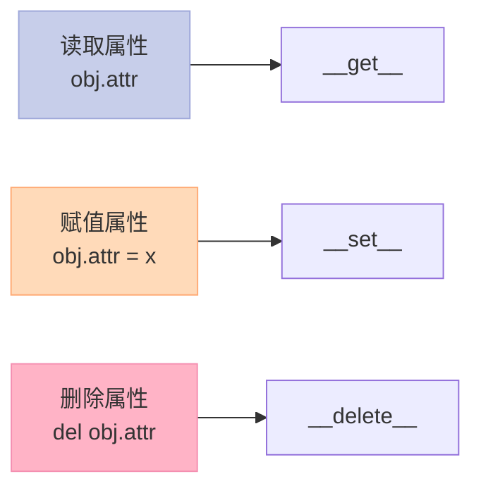
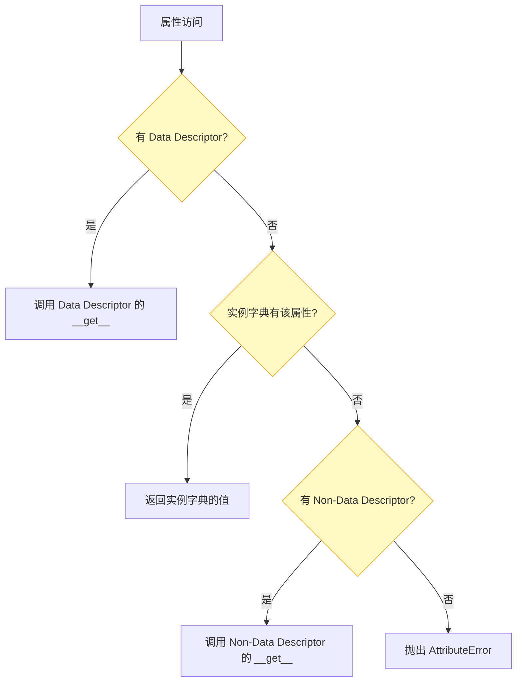

> 很多人写了几年 Python，却不知道 `property` 底层是怎么实现的。答案就三个字：**描述符协议**。

## 一、为什么需要描述符？

想象你写了一个 AI Agent 配置类：

```python
class AgentConfig:
    def __init__(self, temperature):
        self._temperature = temperature
```

然后发现 temperature 必须是 0-2.0 之间的浮点数，否则就报错。你会怎么做？

方案一：在 `__set__` 里加验证逻辑，但每次都要手动调用。

方案二：用 `@property`，但它只能针对单个类。

**方案三：用描述符**——一次定义，处处复用，自动生效。

## 二、描述符协议：三钩子掌控属性



Python 的描述符协议只有三个方法：

| 方法 | 调用时机 | 典型用途 |
|------|---------|---------|
| `__get__(self, instance, owner)` | 读取属性时 | 惰性计算、转换 |
| `__set__(self, instance, value)` | 赋值属性时 | 验证、记录日志 |
| `__delete__(self, instance)` | 删除属性时 | 清理关联资源 |

```python
# === 描述符协议 ===
class Temperature:
    """温度描述符: 自动在摄氏/华氏间转换"""
    
    def __set__(self, instance, value):
        if not isinstance(value, (int, float)):
            raise TypeError(f"Temperature must be numeric, got {type(value).__name__}")
        instance.__dict__["_celsius"] = value
    
    def __get__(self, instance, owner):
        if instance is None:
            return self  # 类访问时返回描述符本身
        return instance.__dict__.get("_celsius", 0)

class Room:
    temperature = Temperature()  # 描述符实例作为类属性
    
    def __init__(self, temp: float):
        self.temperature = temp

room = Room(25)
print(room.temperature)  # 25
room.temperature = 30
print(room.temperature)  # 30
# room.temperature = "hot"  # TypeError!
```

运行输出：
```
25
30
```

## 三、Data Descriptor vs Non-Data Descriptor：优先级之战

描述符分两种，区别在于属性查找的优先级：



| 描述符类型 | 定义方法 | 优先级 |
|-----------|---------|--------|
| **Data Descriptor** | 同时定义 `__get__` + `__set__` | 最高（甚至高于实例字典） |
| **Non-Data Descriptor** | 只定义 `__get__` | 最低（低于实例字典） |

这意味着：如果同时定义了 `__set__`，即使你在 `__init__` 里给实例属性赋值，也会优先调用描述符。

## 四、property 底层就是描述符

`@property` 装饰器背后就是一个 **Non-Data Descriptor**：

```python
# === property 底层 ===
# property 就是一个 non-data descriptor

class Property:
    """模拟内置 property 的实现"""
    def __init__(self, fget=None, fset=None, fdel=None, doc=None):
        self.fget = fget
        self.fset = fset
        self.fdel = fdel
        self.__doc__ = doc or (fget.__doc__ if fget else None)
    
    def __get__(self, obj, objtype=None):
        if obj is None:
            return self  # 类访问返回描述符
        return self.fget(obj)
    
    def __set__(self, obj, value):
        if self.fset is None:
            raise AttributeError("can't set attribute")
        self.fset(obj, value)
    
    def __call__(self, func):
        """装饰器用法：@property"""
        return Property(func, self.fset)

# 使用示例
class Person:
    @property
    def name(self):
        return self._name
    
    @name.setter
    def name(self, value):
        self._name = value
```

为什么 `property` 用 Non-Data Descriptor 而不是 Data Descriptor？因为它只需要拦截读操作，写操作通过单独的 setter 处理。

## 五、惰性计算描述符

描述符最经典的应用场景：**惰性计算**。直到第一次访问才计算，之后缓存结果。

```python
# === 惰性计算描述符 ===
class Lazy:
    """惰性计算描述符: 第一次访问时才计算"""
    def __init__(self, func):
        self.func = func
        self.attr_name = None  # 稍后通过 __set_name__ 获取
    
    def __set_name__(self, owner, name):
        """自动获取属性名（Python 3.6+）"""
        self.attr_name = name
    
    def __get__(self, instance, owner):
        if instance is None:
            return self  # 类访问返回描述符
        # 缓存未命中：执行计算并存储
        if self.attr_name not in instance.__dict__:
            value = self.func(instance)
            instance.__dict__[self.attr_name] = value
        return instance.__dict__[self.attr_name]  # 缓存命中：直接返回

class Agent:
    def __init__(self, name: str):
        self.name = name
    
    @Lazy
    def summary(self) -> str:
        """只在下一次访问时计算"""
        print(f"[Computing summary for {self.name}...]")
        return f"Agent {self.name} summary"

agent = Agent("Alice")
print("Agent created")  # 不触发计算
print(agent.summary)    # 触发计算
print(agent.summary)    # 缓存命中，不再计算
```

运行输出：
```
Agent created
[Computing summary for Alice...]
Agent Alice summary
Agent Alice summary
```

这在 AI 场景里非常有用——比如 Agent 的"思考链"可能很耗时，我们希望它只在真正需要时才计算。

## 六、AI应用：Agent 配置验证描述符

在 Agent 开发中，我们经常需要对参数进行严格的类型和范围验证：

```python
# === AI应用: Agent配置验证 ===
class Validated:
    """验证描述符: 类型和范围检查"""
    def __init__(self, expected_type, min_val=None, max_val=None):
        self.expected_type = expected_type
        self.min_val = min_val
        self.max_val = max_val
    
    def __set__(self, instance, value):
        # 类型检查
        if not isinstance(value, self.expected_type):
            raise TypeError(f"Expected {self.expected_type.__name__}, got {type(value).__name__}")
        # 范围检查
        if self.min_val is not None and value < self.min_val:
            raise ValueError(f"Value {value} below minimum {self.min_val}")
        if self.max_val is not None and value > self.max_val:
            raise ValueError(f"Value {value} above maximum {self.max_val}")
        instance.__dict__[self.name] = value
    
    def __set_name__(self, owner, name):
        self.name = name
    
    def __get__(self, instance, owner):
        return instance.__dict__.get(self.name)

class AgentConfig:
    temperature = Validated(float, min_val=0.0, max_val=2.0)
    max_tokens = Validated(int, min_val=1, max_val=128000)
    
    def __init__(self, temperature: float, max_tokens: int):
        self.temperature = temperature
        self.max_tokens = max_tokens

config = AgentConfig(temperature=0.7, max_tokens=2048)
print(f"temp={config.temperature}, tokens={config.max_tokens}")
# config.temperature = 3.0  # ValueError: Value 3.0 above maximum 2.0
```

运行输出：
```
temp=0.7, tokens=2048
```

尝试 `config.temperature = 3.0` 会抛出明确错误，而不是让程序在调用 API 时才发现参数无效。

## 七、日志描述符：追踪每一次访问

```python
class Logged:
    """日志描述符: 记录所有访问和修改"""
    def __set_name__(self, owner, name):
        self.name = name
        self.log = []  # 每个实例独立的日志
    
    def __get__(self, instance, owner):
        if instance is None:
            return self
        instance.log.append(f"READ: {self.name}")
        return instance.__dict__.get(self.name)
    
    def __set__(self, instance, value):
        instance.log.append(f"WRITE: {self.name} = {value}")
        instance.__dict__[self.name] = value
```

## 八、总结

| 描述符类型 | 定义 | 查找优先级 | 典型用途 |
|-----------|------|-----------|---------|
| Data Descriptor | `__get__` + `__set__` | 最高 | 验证、自动转换 |
| Non-Data Descriptor | 仅 `__get__` | 最低 | 惰性计算、property |

**描述符是 Python 属性机制的核心**。掌握它，你就能在类之间复用属性逻辑，实现自动验证、惰性计算、日志追踪等高级功能。这些技巧在构建 AI Agent 框架时会非常有用。

> 下一步：尝试结合元类（下一篇）和描述符，实现一个完整的 ORM 字段系统。