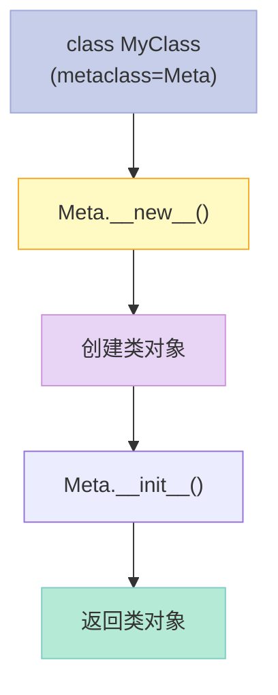
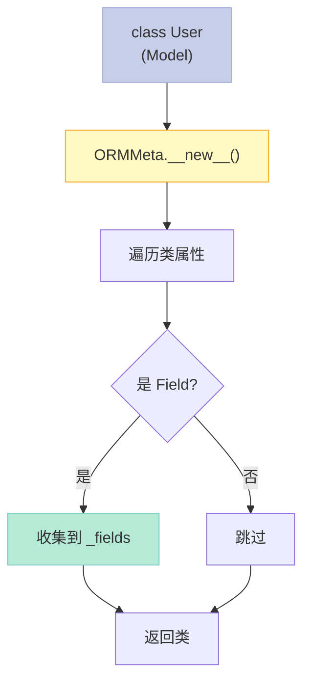

> 类也是对象。元类是制造类的类。理解这句话，就理解了元类的一半。

## 一、从 type() 说起

通常我们这样定义类：

```python
class MyClass:
    x = 42
```

但鲜为人知的是，`class` 关键字背后调用的其实是 `type()`：

```python
# === type() 创建类 ===
MyClass = type("MyClass", (object,), {
    "x": 42,
    "greet": lambda self: f"Hello, I'm {self.x}"
})
obj = MyClass()
print(obj.greet())  # Hello, I'm 42
```

`type(name, bases, dict)` 的三个参数：

| 参数 | 含义 | 示例 |
|------|------|------|
| `name` | 类名 | `"MyClass"` |
| `bases` | 父类元组 | `(object,)` |
| `dict` | 类属性字典 | `{"x": 42}` |

所以 `class MyClass:` 等价于 `MyClass = type("MyClass", (object,), {...})`。

## 二、元类：制造类的类

当 Python 执行 `class MyClass(metaclass=Meta)` 时：



```python
# === 基本元类 ===
class Meta(type):
    def __new__(mcs, name, bases, namespace, **kwargs):
        print(f"Creating class: {name}")
        cls = super().__new__(mcs, name, bases, namespace)
        return cls

class MyClass(metaclass=Meta):
    x = 10

# 输出: Creating class: MyClass
```

元类的第一个参数习惯上叫 `mcs`（metaclass），而不是 `cls`，以区分它创建的是类而不是实例。

## 三、`__new__` vs `__init__`：该用哪个？

| 方法 | 时机 | 能不能修改类结构 | 典型用途 |
|------|------|----------------|---------|
| `__new__` | 类对象创建**前** | 可以新增/删除属性 | 注册表、ORM 字段收集 |
| `__init__` | 类对象创建**后** | 只修改类属性 | 添加类方法、验证 |

**99% 的场景用 `__new__`**。因为你需要在类创建时做出干预：

```python
class Meta(type):
    def __new__(mcs, name, bases, namespace, **kwargs):
        # 在此刻可以：
        # 1. 修改 namespace（增删属性）
        # 2. 检查关键字参数（如 agent_type）
        # 3. 将类注册到全局注册表
        cls = super().__new__(mcs, name, bases, namespace)
        return cls
```

## 四、AI应用：Agent 注册表

在构建 Agent 系统时，我们希望根据类型动态获取 Agent 实现：

```python
# === AI应用: Agent 注册表 ===
class AgentRegistry(type):
    """元类: 自动注册所有 Agent 子类"""
    _registry = {}
    
    def __new__(mcs, name, bases, namespace, agent_type=None, **kwargs):
        cls = super().__new__(mcs, name, bases, namespace)
        if agent_type:  # 只有指定了 agent_type 才注册
            mcs._registry[agent_type] = cls
            print(f"Registered Agent: {agent_type} -> {name}")
        return cls
    
    @classmethod
    def get_agent(mcs, agent_type: str):
        """根据类型获取 Agent 类"""
        return mcs._registry.get(agent_type)
    
    @classmethod
    def list_agents(mcs):
        """列出所有可用的 Agent 类型"""
        return list(mcs._registry.keys())

class BaseAgent(metaclass=AgentRegistry):
    """所有 Agent 的基类"""
    pass

class ReasoningAgent(BaseAgent, agent_type="reasoning"):
    """推理型 Agent"""
    def think(self, prompt: str) -> str:
        return f"[Reasoning] {prompt}"

class CreativeAgent(BaseAgent, agent_type="creative"):
    """创造型 Agent"""
    def generate(self, prompt: str) -> str:
        return f"[Creative] {prompt}"

print(f"Available agents: {AgentRegistry.list_agents()}")
reasoning = AgentRegistry.get_agent("reasoning")()
print(reasoning.think("Solve this problem"))
```

运行输出：
```
Registered Agent: reasoning -> ReasoningAgent
Registered Agent: creative -> CreativeAgent
Available agents: ['reasoning', 'creative']
[Reasoning] Solve this problem
```

**工作原理**：当 Python 执行 `class ReasoningAgent(..., agent_type="reasoning")` 时：
1. 检测到 `agent_type` 关键字参数
2. 调用 `AgentRegistry.__new__`
3. 将类存入 `_registry`
4. 返回新类

这样我们就能在运行时通过字符串动态获取 Agent 类。

## 五、工具自动发现元类

同样的思路用于自动发现和注册工具插件：

```python
# === 工具自动发现元类 ===
class ToolRegistry(type):
    _tools = {}
    
    def __new__(mcs, name, bases, namespace, tool_name=None, **kwargs):
        cls = super().__new__(mcs, name, bases, namespace)
        if tool_name:
            cls.tool_name = tool_name
            mcs._tools[tool_name] = cls
        return cls

class BaseTool(metaclass=ToolRegistry):
    """工具基类"""
    pass

class CalculatorTool(BaseTool, tool_name="calculator"):
    def execute(self, expr: str) -> str:
        return str(eval(expr))

class SearchTool(BaseTool, tool_name="search"):
    def execute(self, query: str) -> str:
        return f"Search results for: {query}"

print(f"Tools: {list(ToolRegistry._tools.keys())}")
calc = ToolRegistry._tools["calculator"]()
print(calc.execute("2+2"))
```

运行输出：
```
Tools: ['calculator', 'search']
4
```

## 六、ORM 字段注册：经典案例

元类在 ORM 框架中的应用非常典型：



```python
class Field:
    """字段描述符基类"""
    def __init__(self, column_type):
        self.column_type = column_type
        self.name = None
    
    def __set_name__(self, owner, name):
        self.name = name

class ORMMeta(type):
    """ORM 元类: 自动收集字段并创建表结构"""
    def __new__(mcs, name, bases, namespace, **kwargs):
        cls = super().__new__(mcs, name, bases, namespace)
        # 收集所有 Field 属性
        cls._fields = {}
        for attr_name in dir(cls):
            attr = getattr(cls, attr_name)
            if isinstance(attr, Field):
                cls._fields[attr_name] = attr
        return cls

class Model(metaclass=ORMMeta):
    pass

class User(Model):
    name = Field("VARCHAR(100)")
    age = Field("INT")
    
    def __init__(self, name, age):
        self.name = name
        self.age = age

print(f"User fields: {list(User._fields.keys())}")  # ['name', 'age']
```

## 七、总结

| 场景 | 元类的作用 |
|------|-----------|
| Agent 注册表 | 自动注册所有 Agent 子类，运行时动态获取 |
| 工具发现 | 自动收集所有工具插件 |
| ORM | 自动收集字段，生成表结构 |
| 插件系统 | 动态加载和管理插件 |

**元类的核心逻辑**：`class X(metaclass=M)` → `M.__new__(M, "X", bases, ns, **kwargs)` → 返回类

> 描述符让我们控制属性访问，元类让我们控制类创建。两者结合，几乎可以实现任何自定义行为。下一篇文章我们来看 Protocol——Python 的结构化类型系统。
---

## 📚 Python AI教程 系列导航

> 本文是《Python AI教程》系列第 **10/14** 篇。

| 方向 | 章节 |
|:--|:--|
| ◀ 上一篇 | [（九）描述符协议](/2026/04/23/2026-04-26-python-09-descriptors/) |
| 下一篇 ▶ | [（十一）Protocol与结构化类型](/2026/04/23/2026-04-26-python-11-protocol-typing/) |

<details>
<summary>📖 全部 14 篇目录（点击展开）</summary>

1. [（一）闭包与装饰器](/2026/04/23/2026-04-25-python-01-closures-decorators/)
2. [（二）上下文管理器](/2026/04/23/2026-04-25-python-02-context-managers/)
3. [（三）生成器与迭代器](/2026/04/23/2026-04-25-python-03-generators-iterators/)
4. [（四）类型提示](/2026/04/23/2026-04-25-python-04-type-hints/)
5. [（五）Dataclass 与 attrs](/2026/04/23/2026-04-25-python-05-dataclass-attrs/)
6. [（六）async/await](/2026/04/23/2026-04-26-python-06-async-await/)
7. [（七）Threading 与 Multiprocessing](/2026/04/23/2026-04-26-python-07-threading-multiprocessing/)
8. [（八）函数式编程](/2026/04/23/2026-04-26-python-08-functional-programming/)
9. [（九）描述符协议](/2026/04/23/2026-04-26-python-09-descriptors/)
10. [（十）元类](/2026/04/23/2026-04-26-python-10-metaclasses/) **← 当前**
11. [（十一）Protocol与结构化类型](/2026/04/23/2026-04-26-python-11-protocol-typing/)
12. [（十二）异常链与日志](/2026/04/23/2026-04-27-python-12-exceptions-logging/)
13. [（十三）缓存艺术](/2026/04/23/2026-04-27-python-13-caching/)
14. [（十四）组合模式实战](/2026/04/23/2026-04-27-python-14-composite-ai-agent/)

</details>
