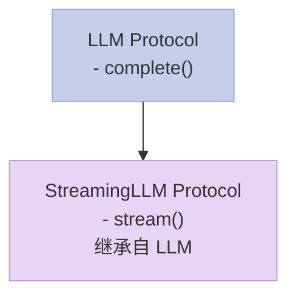

> "如果它走路像鸭子，叫声像鸭子，那它就是鸭子。"——这就是结构化子类型。Python 3.8+ 用 Protocol 把它带入了类型系统。

## 一、名义子类型 vs 结构化子类型

传统的 OOP 语言（如 Java、C++）使用**名义子类型（Nominal Subtyping）**：

```python
# Java 风格：必须显式继承
class LLM {
    String complete(String prompt);
}
class OpenAI extends LLM { }  // 显式继承
```

问题来了：历史遗留的 `class OldLLM` 没有继承 `LLM`，但它恰好有 `complete` 方法。我们能不能让它也满足 `LLM` 接口？

**结构化子类型（Structural Subtyping）** 说：可以。只要方法签名匹配就行，不需要显式继承。

## 二、Protocol：隐式满足的接口

```python
from typing import Protocol, runtime_checkable

@runtime_checkable
class LLM(Protocol):
    """只要你有 complete 方法，就是 LLM"""
    def complete(self, prompt: str) -> str: ...
    
    def stream(self, prompt: str): ...  # yield str

@runtime_checkable
class Tool(Protocol):
    """只要你有 execute 方法，就是 Tool"""
    def execute(self, args: dict) -> str: ...
    @property
    def name(self) -> str: ...
```

这样定义的 Protocol，不需要显式继承就可以满足：

```python
class OpenAI:
    def complete(self, prompt: str) -> str:
        return f"OpenAI: {prompt}"
    def stream(self, prompt: str):
        yield from [f"chunk of {prompt}"]

class Anthropic:
    def complete(self, prompt: str) -> str:
        return f"Claude: {prompt}"
    def stream(self, prompt: str):
        yield from [f"claude chunk for {prompt}"]

class Calculator:
    name = "calculator"
    def execute(self, args: dict) -> str:
        return str(eval(args["expr"]))

openai = OpenAI()
calc = Calculator()

print(f"OpenAI is LLM: {isinstance(openai, LLM)}")  # True
print(f"Calculator is LLM: {isinstance(calc, LLM)}")  # False
print(f"Calculator is Tool: {isinstance(calc, Tool)}")  # True
```

运行输出：
```
OpenAI is LLM: True
Calculator is LLM: False
Calculator is Tool: True
```

**关键**：`@runtime_checkable` 装饰器让我们可以对实现 Protocol 的对象使用 `isinstance()` 检查。

## 三、Protocol vs ABC：选哪个？

| 特性 | ABC | Protocol |
|------|-----|----------|
| 继承方式 | 必须显式继承 `class X(ABC)` | 隐式满足（duck typing） |
| 运行时检查 | 需要 `MyABC.register(X)` | 原生支持 `isinstance()` |
| 静态类型检查 | mypy 不强制要求 | 完全支持 |
| 侵入性 | 需修改原类继承关系 | 无需修改任何代码 |
| 灵活性 | 低（必须显式继承） | 高（任何类都可以满足） |

**结论**：优先使用 Protocol。只有在需要运行时注册旧类时，才考虑 ABC。

## 四、泛型 Protocol：通用约束

Protocol 支持泛型，这样我们可以定义更通用的接口：

```python
from typing import TypeVar

T = TypeVar("T")

class Transformer(Protocol[T]):
    def transform(self, input: str) -> T: ...

class ToUpper:
    def transform(self, input: str) -> str:
        return input.upper()

class ToList:
    def transform(self, input: str) -> list[str]:
        return list(input)

def apply_transform(t: Transformer, val: str):
    return t.transform(val)

print(apply_transform(ToUpper(), "hello"))  # HELLO
print(apply_transform(ToList(), "abc"))    # ['a', 'b', 'c']
```

## 五、Protocol 继承：组合接口

Protocol 可以继承其他 Protocol，形成接口层级：



```python
class BaseAI(Protocol):
    def complete(self, prompt: str) -> str: ...

class StreamingAI(BaseAI, Protocol):
    def stream(self, prompt: str): ...  # 额外要求 stream 方法
```

这样 `StreamingAI` 同时要求 `complete` 和 `stream` 两个方法。

## 六、AI应用：统一 Agent 接口

在构建 AI Agent 系统时，我们希望支持多种 LLM 实现。使用 Protocol，我们可以定义一个统一接口：

```python
from typing import Protocol, runtime_checkable, Any, Dict

@runtime_checkable
class LLMClient(Protocol):
    """LLM 客户端协议"""
    def complete(self, prompt: str, **kwargs) -> str: ...
    def stream(self, prompt: str, **kwargs): ...

@runtime_checkable
class ToolExecutor(Protocol):
    """工具执行器协议"""
    def execute(self, name: str, args: Dict[str, Any]) -> str: ...
    def list_tools(self) -> list[str]: ...

class Agent:
    """通用 Agent 类，可接受任何满足协议的对象"""
    def __init__(self, llm: LLMClient, tools: ToolExecutor):
        self.llm = llm
        self.tools = tools
    
    def run(self, prompt: str) -> str:
        response = self.llm.complete(prompt)
        # 简单的函数调用模拟
        if "calculate" in response.lower():
            return self.tools.execute("calculator", {"expr": "2+2"})
        return response

# 不同实现的类都满足协议，无需继承
class MockLLM:
    def complete(self, prompt: str, **kwargs) -> str:
        return f"Mock response to: {prompt}"
    def stream(self, prompt: str, **kwargs):
        yield "chunk1"
        yield "chunk2"

class MockTools:
    def execute(self, name: str, args: Dict[str, Any]) -> str:
        return "tool result"
    def list_tools(self) -> list[str]:
        return ["calculator"]

agent = Agent(MockLLM(), MockTools())
print(agent.run("What is 2+2?"))
```

运行输出：
```
Mock response to: What is 2+2?
```

**妙处**：无论底层是 OpenAI、Claude 还是国产模型，只要满足 `LLMClient` Protocol，就可以传入 `Agent` 使用。

## 七、实战建议

| 场景 | 推荐 |
|------|------|
| 定义新接口 | 使用 `@runtime_checkable` Protocol |
| 支持静态类型检查 | Protocol + mypy |
| 泛型约束 | `class X(Protocol[T])` |
| 需要兼容旧类 | ABC + `register()` |

**注意事项**：
- Protocol 定义要**简洁**，只包含必要方法
- 避免在 Protocol 里定义实现，只定义**签名**
- 组合多个 Protocol 比继承一个庞大的 Protocol 更好

## 八、总结

| 特性 | 说明 |
|------|------|
| `typing.Protocol` | 定义结构化子类型接口 |
| `@runtime_checkable` | 允许 `isinstance()` 检查 |
| 泛型 Protocol | 支持 `TypeVar` 约束 |
| Protocol 继承 | 可组合多个协议 |

Protocol 让"鸭子类型"在静态类型检查时代依然焕发活力。它不需要侵入性的继承，却提供了强大的类型约束能力。在 AI Agent 开发中，合理使用 Protocol 可以让我们轻松支持多种 LLM 和工具实现，同时保持静态类型检查的能力。

> 下一步：尝试用 Protocol 定义你 Agent 系统的核心接口，然后分别实现 OpenAI 版本和 Anthropic 版本，验证它们可以互换使用。
---

## 📚 Python AI教程 系列导航

> 本文是《Python AI教程》系列第 **11/14** 篇。

| 方向 | 章节 |
|:--|:--|
| ◀ 上一篇 | [（十）元类](/2026/04/23/2026-04-26-python-10-metaclasses/) |
| 下一篇 ▶ | [（十二）异常链与日志](/2026/04/23/2026-04-27-python-12-exceptions-logging/) |

<details>
<summary>📖 全部 14 篇目录（点击展开）</summary>

1. [（一）闭包与装饰器](/2026/04/23/2026-04-25-python-01-closures-decorators/)
2. [（二）上下文管理器](/2026/04/23/2026-04-25-python-02-context-managers/)
3. [（三）生成器与迭代器](/2026/04/23/2026-04-25-python-03-generators-iterators/)
4. [（四）类型提示](/2026/04/23/2026-04-25-python-04-type-hints/)
5. [（五）Dataclass 与 attrs](/2026/04/23/2026-04-25-python-05-dataclass-attrs/)
6. [（六）async/await](/2026/04/23/2026-04-26-python-06-async-await/)
7. [（七）Threading 与 Multiprocessing](/2026/04/23/2026-04-26-python-07-threading-multiprocessing/)
8. [（八）函数式编程](/2026/04/23/2026-04-26-python-08-functional-programming/)
9. [（九）描述符协议](/2026/04/23/2026-04-26-python-09-descriptors/)
10. [（十）元类](/2026/04/23/2026-04-26-python-10-metaclasses/)
11. [（十一）Protocol与结构化类型](/2026/04/23/2026-04-26-python-11-protocol-typing/) **← 当前**
12. [（十二）异常链与日志](/2026/04/23/2026-04-27-python-12-exceptions-logging/)
13. [（十三）缓存艺术](/2026/04/23/2026-04-27-python-13-caching/)
14. [（十四）组合模式实战](/2026/04/23/2026-04-27-python-14-composite-ai-agent/)

</details>
