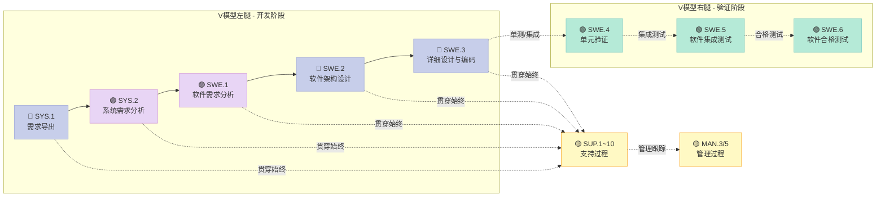
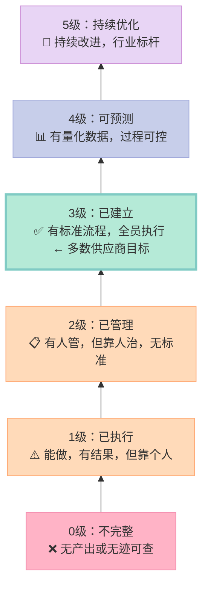
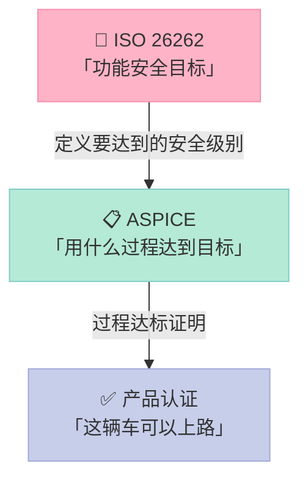
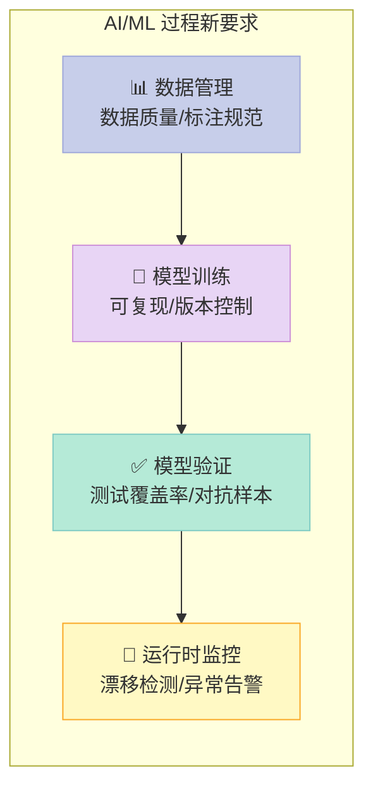
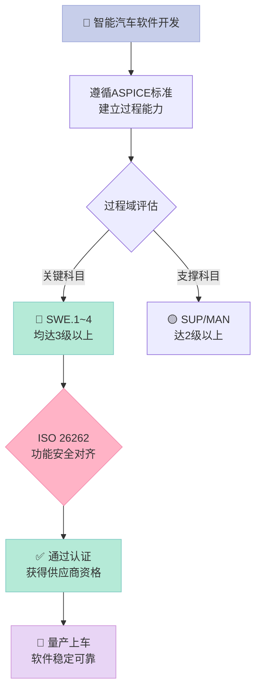

# 【科普】ASPICE：智能汽车软件质量的「高考」

> 一辆智能驾驶汽车软件超过 **1 亿行代码**，比波音 787 飞机还多 10 倍。没有标准管控，这么多代码靠什么保证质量？

答案就是 **ASPICE**——汽车软件行业的「高考」。

## ASPICE 是什么？

**ASPICE**（Automotive Software Process Improvement and Capability Determination）是欧洲汽车行业联合制定的软件过程改进标准。说人话：**它是一套教科书，告诉汽车工程师「软件开发要这么做才算合格」**。

**两个关键点**：

1. **不是可选的**——欧洲主流整车厂（宝马、奔驰、大众）要求供应商必须通过 ASPICE 认证，否则连竞标资格都没有
2. **分等级**——不是「及格/不及格」，而是 **0~5 级**，等级越高能力越强

## ASPICE 考什么？

### V 模型：汽车软件开发的「左右互搏」

汽车软件用 V 模型来组织开发过程——左边是「想清楚要做啥」，右边是「做完了验证对不对」。



> **左侧没做对，右侧怎么验证都是错的**——这就是为什么 V 模型在汽车行业如此重要。

### 过程域：27 个科目，独立考核

ASPICE 3.0 定义了 **27 个过程域**，分为三大类：

| 类别 | 包含科目 | 数量 |
|------|---------|:---:|
| **系统工程**（SYS） | 需求导出、系统需求分析、系统架构 | 4 |
| **软件工程**（SWE） | 需求→架构→详细设计→测试验证 | 6 |
| **支持过程**（SUP） | 质量保证、验证、配置管理、变更管理 | 9 |
| **管理过程**（MAN） | 项目管理、风险管理 | 3 |
| **供应商过程**（ACQ） | 供应商选择、监控、交付 | 5 |

### 能力等级：从「能做事」到「行业标杆」

这是 ASPICE 最核心的概念——**每个科目单独打分**，等级说明一切：

| 等级 | 名称 | 通俗解释 | 打个比方 |
|:---:|------|---------|---------|
| **0** | 不完整 | 根本没做，或做了没产出 | 考试交了白卷 |
| **1** | 已执行 | 有产出，但靠个人经验，无规范 | 考试靠猜 |
| **2** | 已管理 | 有产出，有人复核，但靠人治 | 老师判分，但没标准答案 |
| **3** | 已建立 | **有标准流程，全员按流程走** | 人手一本教材 |
| **4** | 可预测 | 过程被量化，有数据支撑 | 有题库，知道平均分 |
| **5** | 持续优化 | 持续改进，有创新机制 | 老师还在研究怎么出更好题目 |



> 大多数整车厂对供应商的**底线要求是等级 3**，关键科目（如 SWE.1~SWE.4）必须达到 3 级。

## 为什么 ASPICE 对智能汽车特别重要？

### 1. 代码量爆炸，失控风险极高

```
汽车软件代码量对比

┌──────────────────────────────────────────┐
│ 传统汽车 (燃油发动机):  ~1,000 万行        │
│ 智能汽车 (带智驾):     ~1亿+ 行          │
│ 波音 787 飞机:         ~1,400 万行       │
│ Windows Vista:          ~5,000 万行       │
└──────────────────────────────────────────┘

智能汽车的代码量是波音787的7倍！
没有标准管控，根本管不过来。
```

### 2. 功能安全强监管

ISO 26262（汽车功能安全标准）明确要求：安全相关的软件过程必须满足 ASPICE。

说白了：**车道保持、自动紧急制动（AEB）这些保命的功能，如果软件过程没通过 ASPICE，这辆车根本不能上路**。

### 3. 供应链责任可追溯

ASPICE 强调 **端到端可追溯**：每个需求的来源、设计决策、代码实现、测试用例，都必须有记录、能对应。

出了问题，能快速定位是哪个环节、哪个人的责任——不是甩锅，而是精准溯源。

## ASPICE vs ISO 26262：什么关系？

这是被问得最多的问题。简单说：

| 对比项 | ASPICE | ISO 26262 |
|--------|--------|-----------|
| **本质** | 过程标准——「怎么做」 | 产品安全标准——「做到什么程度才安全」 |
| **问法** | 你的开发过程规范吗？ | 你的产品够安全吗？ |
| **强制关系** | 供应链要求（商业层面） | 法规要求（法律层面） |
| **谁来要求** | 整车厂要求供应商 | 政府/认证机构要求 |

**关系图解**：



> **类比**：ISO 26262 告诉你「要考到 90 分」，ASPICE 告诉你「按这个学习方法就能考到 90 分」。

## ASPICE 4.0 的三大变化（2023年）

### 变化一：安全过程正式纳入

智驾系统普及后，安全不再是「附加项」，而是内置项。新增：
- **SPL.1/2/3**：安全生命周期（Safety Lifecycle）
- **SYS.4**：安全相关系统架构
- **SWE.7**：安全相关软件架构

### 变化二：AI/ML 首次被纳入考量

这是 4.0 最受关注的变化。传统软件测试方法对 AI 模型不完全适用：



> **挑战**：你怎么测试一个「黑盒」神经网络？业界仍在探索，目前没有标准答案。

### 变化三：敏捷方法正式被接受

3.0 主要面向 V 模型，4.0 允许在**非安全相关模块**使用敏捷开发（Scrum、迭代）。

## 企业实施 ASPICE 的常见问题

### Q1：小团队能做 ASPICE 吗？

**能。** ASPICE 考的是「过程」，不是「人数」。小团队可以：
- 减少文档数量，但**保留必要的证据**（邮件、截图、工具记录都可以）
- 用协作工具（Jira、Confluence）代替纸质记录
- **核心**：过程可追溯，证据可查

### Q2：达到等级 3 需要多长时间？

通常 **10-20 人团队，在有经验人员指导下，6-12 个月** 可以完成基础建设并通过评估。

### Q3：最大的坑是什么？

| 坑 | 说明 |
|-----|------|
| ❌ 模板工厂 | 用模板批量「生产」流程文档，审核一看就是假的 |
| ❌ 文档合规心态 | 把 ASPICE 当「文档合规」而不是「过程改进」 |
| ❌ 领导缺席 | 领导层不参与，丢给质量部门推动，根本推不动 |
| ✅ 业务驱动 | 从真实项目痛点出发，改进过程而非堆文档 |

### Q4：ASPICE 4.0 实施最难在哪？

**AI/ML 过程的评估**。传统软件可以穷举测试路径，神经网络无法穷举——「这个模型够不够安全」目前没有行业统一答案。

## 一张图总结



## 总结

> ASPICE 是汽车软件行业的「高考」——不是及格就行，而是**分等级论输赢**。等级 3 是行业底线，等级 4-5 才是竞争力。智能汽车时代，不通过 ASPICE 的软件，根本上不了路。
>
> 如果你在汽车行业工作：了解 ASPICE 不是加分项，而是必备项。
> 如果你在其他行业：ASPICE 的核心思想——**过程标准化、证据可追溯、持续改进**——同样适用。

---

**延伸阅读：**
- [intacs 官网（ASPICE 官方认证机构）](https://www.intacs.info/)
- ISO 26262-6：软件产品安全（与 ASPICE 直接对应）
- 《Automotive SPICE Process Assessment Model》官方文档（4.0）
