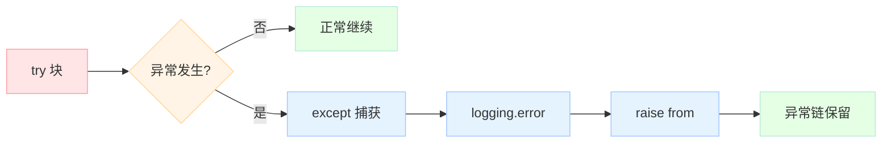

# 【Python AI教程】（十二）异常链与日志：AI健壮性保障

> 本章讲解 Python 异常链机制、自定义异常层次设计、logging 模块，以及 AI 应用中的优雅降级与错误恢复策略。

<!-- more -->

---

## 1. 异常链：`raise ... from`

### 1.1 为什么需要异常链？

在 AI 应用中，错误往往不是孤立存在的。例如：

```text
用户 prompt → LLM API 调用 → 网络错误 → 超时
```

每一层都可能抛出异常，我们需要知道**根本原因**是什么，同时保留完整的错误追踪链。

### 1.2 `raise ... from` 语法

```python
try:
    # 可能抛出异常的代码
    raise ConnectionError("连接被拒绝")
except ConnectionError as e:
    # 重新抛出一个新的异常，同时保留原始异常作为 cause
    raise LLMAPIError(f"LLM 调用失败: {e}") from e
```

- `e.__cause__`：显式指定的因果异常
- `e.__context__`：隐式捕获的上下文异常
- `e.__suppress_context__`：是否抑制上下文显示

### 1.3 AI 场景下的异常层次设计

```python
# 基础异常
class LLMAPIError(Exception):
    """LLM API 调用基础异常"""
    pass

# 具体异常类型
class RateLimitError(LLMAPIError):
    """限流异常"""
    pass

class AuthError(LLMAPIError):
    """认证异常"""
    pass

class ModelUnavailableError(LLMAPIError):
    """模型不可用"""
    pass
```

这样的设计使得我们可以**按层次捕获异常**：

```python
try:
    response = call_llm(prompt)
except RateLimitError:
    # 处理限流：等待后重试
    pass
except LLMAPIError:
    # 处理其他 API 错误
    pass
except Exception:
    # 捕获所有未知错误
    pass
```

---

## 2. 自定义异常层次设计

### 2.1 原则

1. **至少 3 层**：基础异常 → 类别异常 → 具体异常
2. **业务相关命名**：异常名称应该反映业务含义
3. **携带上下文信息**：在异常中存储有用的调试信息

### 2.2 完整示例

```python
from typing import Optional

class AIAgentError(Exception):
    """AI Agent 基础异常"""
    def __init__(self, message: str, context: Optional[dict] = None):
        super().__init__(message)
        self.context = context or {}

class LLMError(AIAgentError):
    """LLM 相关错误"""
    pass

class ToolError(AIAgentError):
    """工具执行错误"""
    pass

class RateLimitError(LLMError):
    """限流错误"""
    def __init__(self, retry_after: int = 60):
        super().__init__(f"Rate limited, retry after {retry_after}s")
        self.retry_after = retry_after

class ContextLengthError(LLMError):
    """上下文超长错误"""
    pass

# 使用示例
def call_llm(prompt: str) -> str:
    try:
        # 模拟 API 调用
        raise ConnectionError("Connection refused")
    except ConnectionError as e:
        # 转换为业务异常，保留原始异常链
        raise LLMError(f"Failed to call LLM: {e}") from e
```

---

## 3. logging 模块详解

### 3.1 核心组件

```text
Logger          ← 日志记录器（入口）
    ↓
Handler         ← 处理器（输出目标）
    ↓
Formatter       ← 格式化器（输出格式）
```

### 3.2 基础配置

```python
import logging

# 方式1：basicConfig（全局配置）
logging.basicConfig(
    level=logging.INFO,
    format='%(asctime)s [%(levelname)s] %(name)s: %(message)s',
    datefmt='%Y-%m-%d %H:%M:%S'
)

logger = logging.getLogger("Agent")
logger.info("Agent started")
```

### 3.3 多 Handler 配置

```python
# 创建 logger
logger = logging.getLogger("AIAgent")
logger.setLevel(logging.DEBUG)

# 控制台 Handler
console_handler = logging.StreamHandler()
console_handler.setLevel(logging.INFO)
console_handler.setFormatter(logging.Formatter(
    '%(asctime)s - %(name)s - %(levelname)s - %(message)s'
))

# 文件 Handler
file_handler = logging.FileHandler('agent.log')
file_handler.setLevel(logging.DEBUG)
file_handler.setFormatter(logging.Formatter(
    '%(asctime)s - %(name)s - %(levelname)s - %(funcName)s:%(lineno)d - %(message)s'
))

# 添加 Handler
logger.addHandler(console_handler)
logger.addHandler(file_handler)
```

### 3.4 Logger 层级结构

```python
# 命名空间：Agent.Child 自动继承 Agent 的配置
parent_logger = logging.getLogger("Agent")
child_logger = logging.getLogger("Agent.Child")

# propagation = True 时，子 logger 的日志会向上传播到父 logger
```

---

## 4. AI 应用：优雅降级与错误恢复

### 4.1 降级策略

当主要方案失败时，自动切换到备选方案：

```python
def call_with_fallback(prompt: str) -> str:
    """多模型降级策略"""
    models = ["gpt-4", "gpt-3.5", "claude-3-haiku"]
    errors = []

    for model in models:
        try:
            # 尝试调用模型
            return call_model(model, prompt)
        except RateLimitError as e:
            # 限流：记录并尝试下一个
            errors.append((model, f"Rate limited: {e.retry_after}s"))
            continue
        except AuthError as e:
            # 认证错误：不应尝试其他模型
            raise AIAgentError(f"Auth failed: {e}")
        except Exception as e:
            # 其他错误：记录并继续
            errors.append((model, str(e)))
            continue

    # 所有模型都失败
    return f"All models failed: {errors}"
```

### 4.2 重试机制

```python
import time
from functools import wraps

def retry(max_attempts: int = 3, delay: float = 1.0):
    """指数退避重试装饰器"""
    def decorator(func):
        @wraps(func)
        def wrapper(*args, **kwargs):
            for attempt in range(max_attempts):
                try:
                    return func(*args, **kwargs)
                except RateLimitError as e:
                    if attempt == max_attempts - 1:
                        raise
                    wait_time = delay * (2 ** attempt) + e.retry_after
                    print(f"Attempt {attempt + 1} failed, retrying in {wait_time}s...")
                    time.sleep(wait_time)
            return None
        return wrapper
    return decorator

@retry(max_attempts=3, delay=1.0)
def call_llm_with_retry(prompt: str) -> str:
    # 可能抛出 RateLimitError
    pass
```

### 4.3 完整示例

```python
import logging
import traceback
from typing import Optional

# 异常链
class LLMAPIError(Exception): pass
class RateLimitError(LLMAPIError): pass

def call_llm(prompt):
    try:
        raise ConnectionError("refused") from RateLimitError("429")
    except ConnectionError as e:
        raise LLMAPIError(f"Failed: {e}") from e

try:
    call_llm("hi")
except LLMAPIError as e:
    print(f"Error: {e}")
    print(f"Caused by: {e.__cause__}")

# logging
logging.basicConfig(level=logging.INFO, format='%(asctime)s %(message)s')
logger = logging.getLogger("Agent")

class Agent:
    def __init__(self, name):
        self.logger = logging.getLogger(f"Agent.{name}")
        self.name = name
    def execute(self, task):
        self.logger.info(f"Starting: {task}")
        return f"Done: {task}"

# 降级
def call_with_fallback(prompt):
    errors = []
    for model in ["gpt-4", "gpt-3.5"]:
        try:
            if model == "gpt-4":
                raise RateLimitError("429")
            return f"Success with {model}"
        except Exception as e:
            errors.append((model, str(e)))
    return f"All failed: {errors}"

print(call_with_fallback("hi"))
```

---

## 5. 最佳实践

### 5.1 日志规范

| 级别 | 使用场景 |
|------|----------|
| DEBUG | 调试信息，开发环境使用 |
| INFO | 正常流程信息 |
| WARNING | 警告但不影响功能 |
| ERROR | 错误，需要关注 |
| CRITICAL | 严重错误，可能导致程序崩溃 |

### 5.2 异常处理规范

1. **不要捕获所有异常**：`except Exception` 会隐藏真正的 bug
2. **记录异常时包含上下文**：`logger.error(f"Failed: {e}", exc_info=True)`
3. **异常应该是有意义的**：不要用异常做流程控制
4. **清理资源使用 finally**：

```python
try:
    response = call_llm(prompt)
finally:
    # 无论成功失败都执行清理
    cleanup()
```

---

## 6. 总结

本章我们学习了：

1. **异常链**：`raise ... from` 保留完整的错误追踪链
2. **异常层次设计**：构建业务相关的异常体系
3. **logging 模块**：Logger/Handler/Formatter 三层架构
4. **优雅降级**：多模型、多策略的容错机制

健壮性是 AI 应用的生命线。一个优秀的 AI 系统，不仅要能正常运行，更要能在各种异常情况下保持服务可用。

---

> 下节预告：【Python AI 教程】（十三）缓存艺术：lru_cache/ttl_cache/自定义 — 深入理解 Python 缓存机制，构建高效的 AI 响应缓存系统。
---


## 📚 Python AI教程 系列导航

> 本文是《Python AI教程》系列第 **12/14** 篇。

| 方向 | 章节 |
|:--|:--|
| ◀ 上一篇 | [（十一）Protocol与结构化类型](/2026/04/23/2026-04-26-python-11-protocol-typing/) |
| 下一篇 ▶ | [（十三）缓存艺术](/2026/04/23/2026-04-27-python-13-caching/) |

<details>
<summary>📖 全部 14 篇目录（点击展开）</summary>

1. [（一）闭包与装饰器](/2026/04/23/2026-04-25-python-01-closures-decorators/)
2. [（二）上下文管理器](/2026/04/23/2026-04-25-python-02-context-managers/)
3. [（三）生成器与迭代器](/2026/04/23/2026-04-25-python-03-generators-iterators/)
4. [（四）类型提示](/2026/04/23/2026-04-25-python-04-type-hints/)
5. [（五）Dataclass 与 attrs](/2026/04/23/2026-04-25-python-05-dataclass-attrs/)
6. [（六）async/await](/2026/04/23/2026-04-26-python-06-async-await/)
7. [（七）Threading 与 Multiprocessing](/2026/04/23/2026-04-26-python-07-threading-multiprocessing/)
8. [（八）函数式编程](/2026/04/23/2026-04-26-python-08-functional-programming/)
9. [（九）描述符协议](/2026/04/23/2026-04-26-python-09-descriptors/)
10. [（十）元类](/2026/04/23/2026-04-26-python-10-metaclasses/)
11. [（十一）Protocol与结构化类型](/2026/04/23/2026-04-26-python-11-protocol-typing/)
12. [（十二）异常链与日志](/2026/04/23/2026-04-27-python-12-exceptions-logging/) **← 当前**
13. [（十三）缓存艺术](/2026/04/23/2026-04-27-python-13-caching/)
14. [（十四）组合模式实战](/2026/04/23/2026-04-27-python-14-composite-ai-agent/)

</details>

## 对比分析

本章核心是 Python 的异常链（`raise ... from`）与 `logging` 模块。

### 维度一：异常链 vs 旧写法

| 方案 | 追溯原始异常 | 语法 | 推荐指数 |
|------|--------------|------|----------|
| **`raise NewError(...) from original`（PEP 3134）** | ✅ `__cause__` | 一行 | ⭐⭐⭐ 首选 |
| **`raise NewError(...)`（不带 from）** | ✅ `__context__`（隐式） | 一行 | ⭐⭐ |
| **`raise NewError(...) from None`** | ❌ 显式切断 | 一行 | 隐藏内部细节时用 |
| **手动 `traceback.print_exc()`** | ✅ 需手写 | 多行 | ⭐ |
| **`sys.exc_info()`** | ✅ 需手写 | 多行 | 库作者专用 |

### 维度二：与其他语言的异常处理

| 语言 | 异常机制 | 与 Python 对比 |
|------|----------|----------------|
| **Java** | checked exception + `try-catch-finally` + `addSuppressed` | checked 异常是 Java 特色；`addSuppressed` 类似 Python `__context__` |
| **C++** | `throw` / `catch`（无 finally，用 RAII） | 无链式追溯（C++17 `nested_exception` 才支持） |
| **Go** | `error` 值 + `panic/recover` + `errors.Wrap`（pkg/errors） | Go 1.13+ `fmt.Errorf("%w", err)` 提供链式；panic 类似未捕获异常 |
| **Rust** | `Result<T, E>` + `?` 运算符 + `Error::source()` | 编译期强制处理；`?` 自动包装，最优雅 |
| **JavaScript** | `Error.cause`（ES2022）+ `async` 错误链 | 后入场；`cause` 字段就是 Python `__cause__` |
| **C#** | `try/catch/finally` + `InnerException` | 思路与 Python `__cause__` 几乎一样 |
| **Ruby** | `rescue` + `cause` | 同 Python 哲学，但社区用法更松散 |

### 维度三：Python `logging` vs 其他日志库

| 方案 | 配置方式 | 结构化日志 | 异步 | 性能 |
|------|----------|------------|------|------|
| **标准库 `logging`** | `dictConfig` / `fileConfig` | 需 JSON Formatter | ❌ 需 `QueueHandler` | 中 |
| **loguru** | 极简 API、零配置 | ✅（`serialize=True`） | ✅ 内置 | 中 |
| **structlog** | 链式 API | ✅ 原生 | ✅ | 中 |
| **Java Logback** | XML / Groovy | ✅ MDC | ✅ AsyncAppender | 高 |
| **Go zap / zerolog** | 显式初始化 | ✅ 原生 | ✅ | 极高（零分配） |
| **Rust tracing** | span + event | ✅ 原生 | ✅ | 高 |

### 优缺点小结

- **Python `raise ... from`**：语法最简洁、IDE 支持好；缺点是仅作用于 `__cause__`，跨框架追踪仍需日志关联 ID
- **Java checked exception**：编译器强制处理；缺点是样板代码多
- **Rust `Result` + `?`**：编译期保证错误传播；缺点是必须显式处理
- **Go `fmt.Errorf("%w", err)`**：与 Python 思路最像；区别是 error 是值非异常
- **Python `logging`**：标准库、生态最广；缺点是 dictConfig 略冗长

### 何时选

- 选 **`raise ... from e`**：在 except 块中重新抛新异常，永远应该加 `from`
- 选 **`raise ... from None`**：明确不想让用户看到内部异常（如封装 SDK 隐藏实现细节）
- 选 **`logging.dictConfig`**：需要统一管理多个 logger / handler
- 选 **`loguru`**：快速开发、想少写配置
- 选 **`structlog`**：需要结构化 JSON 日志（云原生、可观测性）
- 不推荐 **`print` 调试**：无法分级、无时间戳、无目的地
