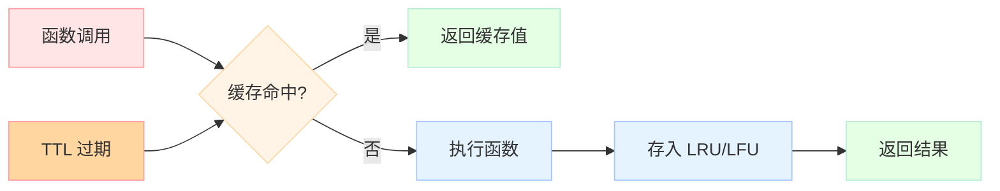

# 【Python AI教程】（十三）缓存艺术：lru_cache/ttl_cache/自定义

> 本章讲解 Python 内置缓存机制、自定义 TTL 缓存实现，以及在 AI 应用中的 LLM 响应缓存策略。

<!-- more -->

---

## 1. 缓存概述

### 1.1 为什么 AI 应用需要缓存？

AI 应用中的缓存至关重要：

- **成本优化**：减少重复的 LLM API 调用
- **降低延迟**：缓存命中时响应时间从秒级降至毫秒级
- **减轻 API 限流**：减少请求次数避免触发限流
- **提升用户体验**：重复问题秒回

### 1.2 缓存类型

| 类型 | 特点 | 适用场景 |
|------|------|----------|
| LRU | 最近最少使用，有大小限制 | 通用缓存 |
| TTL | 基于时间过期 | API 响应缓存 |
| FIFO | 先进先出 | 任务队列 |
|LFU | 最不经常使用 | 热点数据 |

---

## 2. `functools.lru_cache`

### 2.1 基础用法

```python
import functools

@functools.lru_cache(maxsize=128)
def expensive_computation(x, y):
    # 耗时计算
    return x + y

# 第一次调用 (cache miss)
result1 = expensive_computation(1, 2)

# 第二次调用 (cache hit)
result2 = expensive_computation(1, 2)
```

### 2.2 缓存信息

```python
@functools.lru_cache(maxsize=128)
def llm_call(prompt: str) -> str:
    import time
    time.sleep(0.1)  # 模拟 API 调用
    return f"Response: {prompt}"

# 查看缓存状态
print(llm_call.cache_info())
# CacheInfo(hits=0, misses=0, maxsize=128, currsize=0)

r1 = llm_call("Hello")
print(llm_call.cache_info())
# CacheInfo(hits=0, misses=1, maxsize=128, currsize=1)

r2 = llm_call("Hello")  # 命中缓存
print(llm_call.cache_info())
# CacheInfo(hits=1, misses=1, maxsize=128, currsize=1)
```

### 2.3 缓存参数

```python
@functools.lru_cache(maxsize=128, typed=True)
def func(a, b):
    pass

# maxsize: 最大缓存条目数，None 表示无限制
# typed: 不同类型参数分开缓存 (e.g., 1 vs 1.0)
```

### 2.4 缓存失效

```python
# 方法1: 直接调用 clear
@functools.lru_cache(maxsize=128)
def cached_func(x):
    return x ** 2

cached_func.clear()

# 方法2: 重新创建函数
@functools.lru_cache(maxsize=128)
def new_cached_func(x):
    return x ** 2
```

---

## 3. 自定义 TTL Cache

### 3.1 TTL 缓存原理

```text
TTL (Time To Live) = 缓存条目存活时间

存储: {key: (value, expire_time)}
检查: if now < expire_time → 返回缓存
      else → 删除条目，返回 None
```

### 3.2 TTLCache 实现

```python
from datetime import datetime, timedelta
from typing import Optional, Callable, Any
import functools
import json

class TTLCache:
    """基于时间过期的高级缓存"""
    
    def __init__(self, ttl: int = 60):
        """
        Args:
            ttl: 缓存过期时间（秒）
        """
        self._store: dict[str, tuple[Any, datetime]] = {}
        self._ttl = ttl
    
    def get(self, key: str) -> Optional[Any]:
        """获取缓存值"""
        if key in self._store:
            value, expire = self._store[key]
            if datetime.now() < expire:
                return value
            # 过期删除
            del self._store[key]
        return None
    
    def set(self, key: str, value: Any) -> None:
        """设置缓存值"""
        expire = datetime.now() + timedelta(seconds=self._ttl)
        self._store[key] = (value, expire)
    
    def delete(self, key: str) -> None:
        """删除缓存"""
        if key in self._store:
            del self._store[key]
    
    def clear(self) -> None:
        """清空所有缓存"""
        self._store.clear()
    
    def __call__(self, fn: Callable) -> Callable:
        """作为装饰器使用"""
        @functools.wraps(fn)
        def wrapper(*args, **kwargs):
            # 生成缓存 key
            key = json.dumps({
                "args": str(args),
                "kwargs": sorted(kwargs.items())
            })
            
            # 尝试获取缓存
            cached = self.get(key)
            if cached is not None:
                return f"[HIT] {cached}"
            
            # 执行函数并缓存结果
            result = fn(*args, **kwargs)
            self.set(key, result)
            return f"[MISS] {result}"
        
        return wrapper
```

### 3.3 使用示例

```python
import time

@TTLCache(ttl=5)
def kb_search(query):
    """知识库搜索（5秒过期）"""
    print(f"[QUERY] Searching for: {query}")
    return f"KB Result: {query}"

# 第一次调用 - MISS
print(kb_search("Python"))
# Output: [QUERY] Searching for: Python
#         [MISS] KB Result: Python

# 第二次调用 - HIT（5秒内）
print(kb_search("Python"))
# Output: [HIT] KB Result: Python

# 等待 6 秒后 - 缓存过期，再次 MISS
time.sleep(6)
print(kb_search("Python"))
# Output: [QUERY] Searching for: Python
#         [MISS] KB Result: Python
```

---

## 4. AI 应用场景

### 4.1 LLM 响应缓存

```python
import functools
import hashlib
import json

class LLMResponseCache:
    """LLM 响应缓存"""
    
    def __init__(self, ttl: int = 3600):
        self._cache = TTLCache(ttl=ttl)
    
    def _make_key(self, prompt: str, model: str, **kwargs) -> str:
        """生成缓存 key"""
        content = json.dumps({
            "prompt": prompt,
            "model": model,
            **kwargs
        }, sort_keys=True)
        return hashlib.sha256(content.encode()).hexdigest()
    
    def cached_call(self, prompt: str, model: str = "gpt-4", **kwargs) -> str:
        """带缓存的 LLM 调用"""
        key = self._make_key(prompt, model, **kwargs)
        
        cached = self._cache.get(key)
        if cached:
            return cached
        
        # 调用 LLM API
        result = call_openai(prompt, model, **kwargs)
        self._cache.set(key, result)
        return result
```

### 4.2 语义缓存

```python
import hashlib

class SemanticCache:
    """基于语义相似度的缓存（简化版）"""
    
    def __init__(self, similarity_threshold: float = 0.8):
        self._cache = {}
        self._threshold = similarity_threshold
    
    def _normalize(self, text: str) -> str:
        """标准化文本用于比较"""
        return " ".join(text.lower().split())
    
    def _get_key(self, text: str) -> str:
        """生成近似的缓存 key"""
        normalized = self._normalize(text)
        return hashlib.md5(normalized.encode()).hexdigest()[:16]
    
    def get(self, prompt: str) -> Optional[str]:
        """获取缓存（简化版，实际应该用 embedding 相似度）"""
        key = self._get_key(prompt)
        if key in self._cache:
            return self._cache[key]["response"]
        return None
    
    def set(self, prompt: str, response: str) -> None:
        """设置缓存"""
        key = self._get_key(prompt)
        self._cache[key] = {"prompt": prompt, "response": response}
```

### 4.3 完整示例

```python
import functools
import time
import hashlib
import json
from datetime import datetime, timedelta
from typing import Optional, Callable

# lru_cache
@functools.lru_cache(maxsize=128)
def llm_call(prompt: str, model: str = "gpt-4") -> str:
    print(f"[MISS] Calling {model}...")
    time.sleep(0.1)
    return f"Response to: {prompt}"

r1 = llm_call("What is AI?")
r2 = llm_call("What is AI?")  # hit
print(llm_call.cache_info())

# TTL cache
class TTLCache:
    def __init__(self, ttl: int = 60):
        self._store = {}
        self._ttl = ttl
    def get(self, k):
        if k in self._store:
            val, expire = self._store[k]
            if datetime.now() < expire:
                return val
            del self._store[k]
        return None
    def set(self, k, v):
        self._store[k] = (v, datetime.now() + timedelta(seconds=self._ttl))
    def __call__(self, fn: Callable):
        @functools.wraps(fn)
        def wrapper(*args, **kwargs):
            key = json.dumps({"a": str(args), "k": sorted(kwargs.items())})
            cached = self.get(key)
            if cached: return f"[HIT] {cached}"
            result = fn(*args, **kwargs)
            self.set(key, result)
            return f"[MISS] {result}"
        return wrapper

@TTLCache(ttl=5)
def kb_search(query):
    print(f"[QUERY] {query}")
    return f"KB: {query}"

print(kb_search("Python"))
print(kb_search("Python"))
time.sleep(6)
print(kb_search("Python"))
```

---

## 5. 缓存策略选择

### 5.1 选择指南

| 场景 | 推荐缓存 | 原因 |
|------|----------|------|
| 相同 prompt 重复调用 | `lru_cache` | 完全匹配，命中率高 |
| API 响应有时效性 | `TTLCache` | 避免返回过期数据 |
| 用户可能换表述问相同问题 | `SemanticCache` | 语义相似匹配 |
| 高频热点数据 | `LFU Cache` | 保留最常用项 |

### 5.2 缓存注意事项

1. **不要缓存副作用**：只缓存纯函数
2. **考虑内存限制**：设置合理的 `maxsize`
3. **TTL 设置**：根据数据时效性调整
4. **缓存键生成**：确保唯一性和稳定性

---

## 6. 总结

本章我们学习了：

1. **`functools.lru_cache`**：Python 内置的 LRU 缓存，简单高效
2. **自定义 TTLCache**：基于时间过期的缓存实现
3. **AI 响应缓存**：多层次的缓存策略（完全匹配/语义相似）

合理使用缓存可以显著提升 AI 应用的性能和用户体验，同时降低成本和 API 限流风险。

---

> 下节预告：【Python AI 教程】（十四）组合模式实战：构建模块化 AI Agent — 综合运用本系列所有知识，构建一个可扩展的模块化 AI Agent 框架。
---


## 📚 Python AI教程 系列导航

> 本文是《Python AI教程》系列第 **13/14** 篇。

| 方向 | 章节 |
|:--|:--|
| ◀ 上一篇 | [（十二）异常链与日志](/2026/04/23/2026-04-27-python-12-exceptions-logging/) |
| 下一篇 ▶ | [（十四）组合模式实战](/2026/04/23/2026-04-27-python-14-composite-ai-agent/) |

<details>
<summary>📖 全部 14 篇目录（点击展开）</summary>

1. [（一）闭包与装饰器](/2026/04/23/2026-04-25-python-01-closures-decorators/)
2. [（二）上下文管理器](/2026/04/23/2026-04-25-python-02-context-managers/)
3. [（三）生成器与迭代器](/2026/04/23/2026-04-25-python-03-generators-iterators/)
4. [（四）类型提示](/2026/04/23/2026-04-25-python-04-type-hints/)
5. [（五）Dataclass 与 attrs](/2026/04/23/2026-04-25-python-05-dataclass-attrs/)
6. [（六）async/await](/2026/04/23/2026-04-26-python-06-async-await/)
7. [（七）Threading 与 Multiprocessing](/2026/04/23/2026-04-26-python-07-threading-multiprocessing/)
8. [（八）函数式编程](/2026/04/23/2026-04-26-python-08-functional-programming/)
9. [（九）描述符协议](/2026/04/23/2026-04-26-python-09-descriptors/)
10. [（十）元类](/2026/04/23/2026-04-26-python-10-metaclasses/)
11. [（十一）Protocol与结构化类型](/2026/04/23/2026-04-26-python-11-protocol-typing/)
12. [（十二）异常链与日志](/2026/04/23/2026-04-27-python-12-exceptions-logging/)
13. [（十三）缓存艺术](/2026/04/23/2026-04-27-python-13-caching/) **← 当前**
14. [（十四）组合模式实战](/2026/04/23/2026-04-27-python-14-composite-ai-agent/)

</details>

## 对比分析

本章核心是 Python 的缓存机制（`functools.lru_cache` / `ttl_cache` / 自定义缓存）。

### 维度一：缓存方案对比

| 方案 | 淘汰策略 | TTL 支持 | 线程安全 | 持久化 | 适合 |
|------|----------|----------|----------|--------|------|
| **`@functools.lru_cache`** | LRU | ❌ | ✅ | ❌ | 进程内、可重入的纯函数 |
| **`@functools.cache`**（3.9+） | 无界 | ❌ | ✅ | ❌ | 一次性函数（如 LLM embedding） |
| **`cachetools.LRUCache`** | LRU / LFU | ✅（需包装） | 可选 | ❌ | 需要 TTL 或 maxsize |
| **`cachetools.TTLCache`** | TTL | ✅ | 可选 | ❌ | 实时数据（如 token 限流） |
| **Redis 客户端** | 自定义 | ✅ | ✅ | ✅ | 跨进程 / 跨服务 |
| **diskcache** | LRU | ✅ | ✅ | ✅ 磁盘 | 本地磁盘缓存 |
| **手写 OrderedDict** | LRU | 需自写 | 自管 | ❌ | 教学 / 特殊需求 |

### 维度二：与其他语言的缓存库

| 语言 | 缓存库 | 与 Python 对比 |
|------|--------|----------------|
| **Java** | Caffeine / Guava Cache | Caffeine 是 Java 缓存之王；API 远比 `lru_cache` 丰富（W-TinyLFU 等） |
| **C#** | `MemoryCache`（System.Runtime.Caching） | 内置、易用；企业级常用 Redis + StackExchange.Redis |
| **Go** | `go-cache` / `ristretto` | ristretto 是 DGraph 出品、极高并发性能 |
| **Rust** | `moka` / `cached` | moka 借鉴 Caffeine；类型安全 + 零成本 |
| **TypeScript / Node** | `node-cache` / `lru-cache` | npm `lru-cache` 与 Python `lru_cache` 思路一致 |
| **Scala** | Caffeine Scala 包装 | 与 Java Caffeine 共享 |

### 维度三：缓存与 AI 场景的契合

| 场景 | 推荐方案 | 原因 |
|------|----------|------|
| LLM 同一问题重复调用 | `lru_cache` / Redis | 完全相同输入可共享结果 |
| Embedding 计算 | `lru_cache` 或磁盘缓存 | 文本→向量可重入 |
| Web 搜索结果 | Redis + TTL | 跨进程、过期自动失效 |
| 数据库查询 | Redis + 失效策略 | 减轻 DB 压力 |
| Token 限流 / 速率限制 | `TTLCache` 或 Redis | 滑动窗口 |
| 实时行情 / 监控数据 | 短 TTL 缓存 | 避免雪崩 |

### 优缺点小结

- **`functools.lru_cache`**：标准库、零配置、LRU 淘汰；缺点是不支持 TTL、不能持久化
- **`cachetools.TTLCache`**：TTL 友好、社区库；缺点是需第三方依赖
- **Redis**：分布式、TTL 丰富、集群；缺点是引入网络依赖、序列化成本
- **Caffeine (Java)**：性能最强、淘汰算法最先进；缺点是 JVM 生态
- **diskcache**：单机大容量；缺点是不能跨机器

### 何时选

- 选 **`@lru_cache(maxsize=128)`**：纯函数 + 进程内 + 调用频繁
- 选 **`@lru_cache(maxsize=None)`**（3.9+ 用 `@cache`）：一次性函数、结果集有限
- 选 **`TTLCache`**：需要自动过期（实时数据、限流）
- 选 **Redis**：多实例部署、需共享缓存
- 选 **diskcache**：单机大容量（如数据集预处理结果）
- 不推荐 **裸字典缓存**：无淘汰、无过期、易内存泄漏
