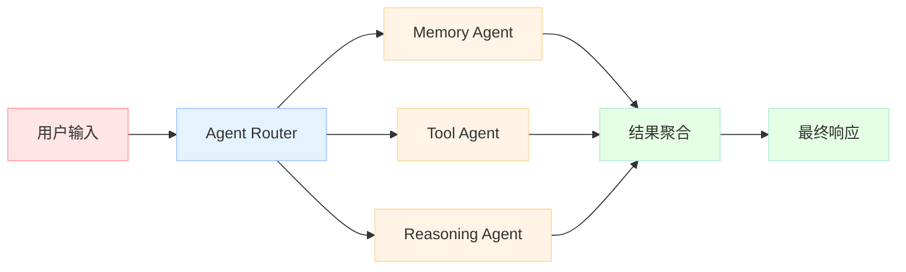

# 【Python AI教程】（十四）组合模式实战：构建模块化AI Agent

> 本章综合运用本系列所有知识：Dataclass + Protocol + 装饰器 + 上下文管理器 + 泛型，构建一个可扩展的模块化 AI Agent 框架。

<!-- more -->

---

## 1. 架构设计概述

### 1.1 为什么需要模块化 Agent？


### 1.2 核心设计原则

1. **接口抽象**：使用 Protocol 定义工具接口
2. **配置分离**：使用 Dataclass 管理配置
3. **行为增强**：使用装饰器添加日志、计时等功能
4. **资源管理**：使用上下文管理器管理会话生命周期

---

## 2. Protocol：工具接口抽象

### 2.1 为什么用 Protocol？

Python 3.8+ 引入的 `Protocol` 提供了**结构化子类型**（即鸭子类型）的静态类型检查支持：

```python
from typing import Protocol

class Tool(Protocol):
    @property
    def name(self) -> str: ...
    def execute(self, args: dict) -> str: ...
```

任何实现了 `name` 属性和 `execute` 方法的类，都被视为 `Tool` 的子类，无需显式继承。

### 2.2 内置工具实现

```python
class Calculator:
    """计算器工具"""
    name = "calculator"
    
    def execute(self, args: dict) -> str:
        expr = args.get("expr", "0")
        try:
            result = eval(expr)
            return str(result)
        except Exception as e:
            return f"Error: {e}"

class SearchTool:
    """搜索工具"""
    name = "search"
    
    def execute(self, args: dict) -> str:
        query = args.get("query", "")
        return f"Results for: {query}"

class WebFetchTool:
    """网页获取工具"""
    name = "web_fetch"
    
    def execute(self, args: dict) -> str:
        url = args.get("url", "")
        return f"Fetched content from: {url}"
```

---

## 3. Dataclass：配置管理

### 3.1 AgentConfig

```python
from dataclasses import dataclass, field
from typing import Optional

@dataclass
class AgentConfig:
    """Agent 配置类"""
    name: str
    model: str = "gpt-4"
    temperature: float = 0.7
    max_tokens: int = 2048
    system_prompt: Optional[str] = None
    
    def __post_init__(self):
        """配置验证"""
        if not 0.0 <= self.temperature <= 2.0:
            raise ValueError("temperature must be between 0.0 and 2.0")
        if self.max_tokens <= 0:
            raise ValueError("max_tokens must be positive")
```

### 3.2 Message 数据类

```python
from dataclasses import dataclass
from typing import Literal

@dataclass
class Message:
    """对话消息"""
    role: Literal["user", "assistant", "system", "tool"]
    content: str
    
    def to_dict(self) -> dict:
        return {"role": self.role, "content": self.content}
```

---

## 4. 装饰器：行为增强

### 4.1 @timer 装饰器

```python
import functools
import time
from typing import Callable

def timer(func: Callable) -> Callable:
    """计时装饰器"""
    @functools.wraps(func)
    def wrapper(*args, **kwargs):
        start = time.perf_counter()
        result = func(*args, **kwargs)
        elapsed = time.perf_counter() - start
        print(f"[timer] {func.__name__}: {elapsed:.3f}s")
        return result
    return wrapper
```

### 4.2 @retry 装饰器

```python
import functools
import time
from typing import Callable, TypeVar

T = TypeVar('T')

def retry(max_attempts: int = 3, delay: float = 1.0) -> Callable[[T], T]:
    """重试装饰器"""
    def decorator(func: Callable[..., T]) -> Callable[..., T]:
        @functools.wraps(func)
        def wrapper(*args, **kwargs) -> T:
            last_exception = None
            for attempt in range(max_attempts):
                try:
                    return func(*args, **kwargs)
                except Exception as e:
                    last_exception = e
                    if attempt < max_attempts - 1:
                        time.sleep(delay * (2 ** attempt))
            raise last_exception
        return wrapper
    return decorator
```

---

## 5. 上下文管理器：资源管理

### 5.1 @session 上下文管理器

```python
from contextlib import contextmanager

@contextmanager
def session(name: str):
    """会话生命周期管理"""
    print(f"[{name}] Session start")
    try:
        yield
    finally:
        print(f"[{name}] Session end")
```

### 5.2 ChatSession 上下文管理器

```python
from contextlib import contextmanager
from dataclasses import dataclass, field
from typing import Optional

@dataclass
class ChatSession:
    """聊天会话"""
    messages: list[Message] = field(default_factory=list)
    
    @contextmanager
    def chat_context(self):
        """聊天上下文"""
        try:
            yield self
        finally:
            # 可能的清理工作
            pass
    
    def add_message(self, role: str, content: str):
        self.messages.append(Message(role=role, content=content))
```

---

## 6. 策略模式与命令模式

### 6.1 策略模式：模型选择

```python
from typing import Protocol, Literal
from dataclasses import dataclass

class LLMProvider(Protocol):
    """LLM 提供者协议"""
    def chat(self, messages: list[dict]) -> str: ...
    def name(self) -> str: ...

class GPT4Provider:
    """OpenAI GPT-4"""
    def name(self) -> str:
        return "gpt-4"
    def chat(self, messages: list[dict]) -> str:
        return f"[GPT-4] Response"

class ClaudeProvider:
    """Anthropic Claude"""
    def name(self) -> str:
        return "claude-3"
    def chat(self, messages: list[dict]) -> str:
        return f"[Claude-3] Response"

@dataclass
class ModelSelector:
    """模型选择器（策略模式）"""
    providers: dict[str, LLMProvider] = field(default_factory=dict)
    current: str = "gpt-4"
    
    def select(self, model_name: str) -> LLMProvider:
        if model_name not in self.providers:
            raise ValueError(f"Unknown model: {model_name}")
        self.current = model_name
        return self.providers[model_name]
```

### 6.2 命令模式：工具执行

```python
from abc import ABC, abstractmethod
from dataclasses import dataclass

@dataclass
class CommandResult:
    """命令执行结果"""
    success: bool
    output: str
    error: Optional[str] = None

class Command(ABC):
    """命令抽象基类"""
    @abstractmethod
    def execute(self) -> CommandResult:
        pass

class ToolCommand(Command):
    """工具命令"""
    def __init__(self, tool, args: dict):
        self.tool = tool
        self.args = args
    
    def execute(self) -> CommandResult:
        try:
            output = self.tool.execute(self.args)
            return CommandResult(success=True, output=output)
        except Exception as e:
            return CommandResult(success=False, output="", error=str(e))

class Agent:
    """命令模式：执行命令"""
    def execute_command(self, command: Command) -> CommandResult:
        return command.execute()
```

---

## 7. 完整 Agent 实现

### 7.1 核心 Agent 类

```python
import functools
from dataclasses import dataclass, field
from typing import Callable, Protocol, Optional, Literal

# Protocol: 工具接口
class Tool(Protocol):
    @property
    def name(self) -> str: ...
    def execute(self, args: dict) -> str: ...

# Dataclass: Agent配置
@dataclass
class AgentConfig:
    name: str
    model: str = "gpt-4"
    temperature: float = 0.7
    max_tokens: int = 2048
    
    def __post_init__(self):
        if not 0.0 <= self.temperature <= 2.0:
            raise ValueError("temperature must be 0-2")

# 装饰器
def timer(func: Callable) -> Callable:
    @functools.wraps(func)
    def wrapper(*args, **kwargs):
        import time
        s = time.perf_counter()
        r = func(*args, **kwargs)
        print(f"[timer] {func.__name__}: {time.perf_counter()-s:.3f}s")
        return r
    return wrapper

# 上下文管理器
from contextlib import contextmanager
@contextmanager
def session(name):
    print(f"[{name}] Session start")
    try:
        yield
    finally:
        print(f"[{name}] Session end")

# 具体工具
class Calculator:
    name = "calculator"
    def execute(self, args):
        return str(eval(args.get("expr", "0")))

class SearchTool:
    name = "search"  
    def execute(self, args):
        return f"Results for: {args.get('query', '')}"

# Agent
@dataclass
class Message:
    role: Literal["user", "assistant", "system", "tool"]
    content: str

@dataclass
class Agent:
    name: str
    model: str = "gpt-4"
    tools: list[Tool] = field(default_factory=list)
    
    @timer
    def chat(self, prompt: str) -> str:
        with session(self.name):
            if "calc" in prompt.lower() or "计算" in prompt:
                for t in self.tools:
                    if t.name == "calculator":
                        r = t.execute({"expr": "2+2"})
                        return f"Calculator: {r}"
            return f"[{self.model}] {prompt}"

a = Agent(name="Bot", tools=[Calculator(), SearchTool()])
print(a.chat("What is 2+2?"))
```

### 7.2 运行流程

```text
用户输入: "What is 2+2?"
    ↓
Agent.chat() 被调用
    ↓
@timer 记录开始时间
    ↓
session 上下文管理器启动
    ↓
检查 prompt 是否包含 "calc"
    ↓
找到 Calculator 工具，执行 "2+2"
    ↓
返回结果: "Calculator: 4"
    ↓
session 上下文管理器结束
    ↓
@timer 输出耗时并返回结果
```

---

## 8. 扩展与最佳实践

### 8.1 添加新工具

```python
class ImageGenerationTool:
    name = "image_gen"
    
    def execute(self, args: dict) -> str:
        prompt = args.get("prompt", "")
        # 调用图像生成 API
        return f"Generated image for: {prompt}"

# 注册到 Agent
agent = Agent(
    name="Bot",
    tools=[Calculator(), SearchTool(), ImageGenerationTool()]
)
```

### 8.2 添加新模型支持

```python
class GeminiProvider:
    def name(self) -> str:
        return "gemini-pro"
    
    def chat(self, messages: list[dict]) -> str:
        return f"[Gemini] Response"

# 在 Agent 中添加 provider
agent = Agent(name="Bot", model="gemini-pro", ...)
```

### 8.3 中间件/拦截器

```python
def logging_middleware(func):
    """日志中间件"""
    @functools.wraps(func)
    def wrapper(self, *args, **kwargs):
        print(f"[middleware] Before {func.__name__}")
        result = func(self, *args, **kwargs)
        print(f"[middleware] After {func.__name__}")
        return result
    return wrapper

# 应用中间件
Agent.chat = logging_middleware(Agent.chat)
```

---

## 9. 总结

本章我们构建了一个完整的模块化 AI Agent 框架，综合运用了：

| 技术 | 用途 |
|------|------|
| Protocol | 工具接口抽象（鸭子类型 + 静态检查） |
| Dataclass | 配置管理和消息数据类 |
| 装饰器 | @timer 计时、@retry 重试 |
| 上下文管理器 | session 会话生命周期管理 |
| 策略模式 | 多模型支持 |
| 命令模式 | 工具执行封装 |

这个框架具有良好的可扩展性，可以轻松添加新工具、新模型、新中间件。

---

## 系列总结

经过 14 篇文章的学习，我们从 Python 基础到 AI 应用实战，建立了完整的知识体系：

1. **基础语法**：类型提示、泛型、装饰器
2. **数据结构**：Dataclass、Protocol、Enum
3. **资源管理**：上下文管理器、生成器
4. **异常处理**：异常链、自定义异常、日志
5. **性能优化**：缓存机制（lru_cache、TTLCache）
6. **架构设计**：模块化 Agent、策略/命令模式

这些知识不仅适用于 AI 开发，更是现代 Python 工程化的必备技能。
---


## 📚 Python AI教程 系列导航

> 本文是《Python AI教程》系列第 **14/14** 篇。

| 方向 | 章节 |
|:--|:--|
| ◀ 上一篇 | [（十三）缓存艺术](/2026/04/23/2026-04-27-python-13-caching/) |

<details>
<summary>📖 全部 14 篇目录（点击展开）</summary>

1. [（一）闭包与装饰器](/2026/04/23/2026-04-25-python-01-closures-decorators/)
2. [（二）上下文管理器](/2026/04/23/2026-04-25-python-02-context-managers/)
3. [（三）生成器与迭代器](/2026/04/23/2026-04-25-python-03-generators-iterators/)
4. [（四）类型提示](/2026/04/23/2026-04-25-python-04-type-hints/)
5. [（五）Dataclass 与 attrs](/2026/04/23/2026-04-25-python-05-dataclass-attrs/)
6. [（六）async/await](/2026/04/23/2026-04-26-python-06-async-await/)
7. [（七）Threading 与 Multiprocessing](/2026/04/23/2026-04-26-python-07-threading-multiprocessing/)
8. [（八）函数式编程](/2026/04/23/2026-04-26-python-08-functional-programming/)
9. [（九）描述符协议](/2026/04/23/2026-04-26-python-09-descriptors/)
10. [（十）元类](/2026/04/23/2026-04-26-python-10-metaclasses/)
11. [（十一）Protocol与结构化类型](/2026/04/23/2026-04-26-python-11-protocol-typing/)
12. [（十二）异常链与日志](/2026/04/23/2026-04-27-python-12-exceptions-logging/)
13. [（十三）缓存艺术](/2026/04/23/2026-04-27-python-13-caching/)
14. [（十四）组合模式实战](/2026/04/23/2026-04-27-python-14-composite-ai-agent/) **← 当前**

</details>

## 对比分析

本章核心是 Python 组合模式（Composite Pattern）构建模块化 AI Agent。

### 维度一：组合模式 vs 其他"组装 Agent"范式

| 范式 | 抽象单位 | 灵活性 | 复杂度 | 典型代表 |
|------|----------|--------|--------|----------|
| **组合模式（Composite）** | Component 接口 + Leaf/Composite | 中 | 中 | 本章风格 |
| **责任链（Chain of Responsibility）** | Handler 链 | 中 | 中 | LangChain LCEL、`|` 管道 |
| **策略模式（Strategy）** | 多个可替换算法 | 中 | 低 | 不同 Prompt 模板切换 |
| **装饰器模式（Decorator）** | 包装增强 | 高 | 中 | 重试 / 日志 / 缓存包装 |
| **Pipeline（数据流）** | 数据沿管道流动 | 中 | 中 | LangChain Chain、Haystack |
| **图（Graph）** | 节点 + 边 | 高 | 高 | LangGraph、LlamaIndex Workflow |
| **多 Agent 协作** | 多个独立 Agent 通信 | 极高 | 极高 | AutoGen、CrewAI、MetaGPT |

### 维度二：与其他 Agent 框架的对比

| 框架 | 核心抽象 | 组合方式 | 状态管理 | 适合 |
|------|----------|----------|----------|------|
| **本章（手写 Protocol + 组合）** | `Tool` Protocol | 显式 `Composite` 类 | 调用方维护 | 教学 / 轻量项目 |
| **LangChain** | `Runnable` / `Chain` | LCEL 管道 `prompt \| model \| parser` | 内置 Memory | 通用 LLM 应用 |
| **LangGraph** | `StateGraph` + 节点 | 有向图 + 条件边 | 显式 State schema | 复杂多步 / 循环 / 人机协作 |
| **LlamaIndex** | `QueryEngine` / `AgentRunner` | 数据索引 + Agent | 上下文自动管理 | RAG 为主 |
| **Haystack** | `Pipeline` + 组件 | 显式 `add_node` / `connect` | 显式 state | 生产级 RAG / 搜索 |
| **AutoGen** | 多 Agent + GroupChat | 消息传递 | 对话历史 | 多角色协作 |
| **CrewAI** | Crew + Agent + Task | 角色分工 + 流程 | 任务上下文 | 模拟团队 |
| **Pydantic AI** | `Agent` + 工具 | 强类型 + 依赖注入 | 类型化 deps | 类型安全项目 |
| **Semantic Kernel** | `Kernel` + Plugin | 函数组合 | 内置 Memory | .NET 生态 / 企业 |

### 维度三：组合模式 vs 继承

| 维度 | 组合（has-a） | 继承（is-a） |
|------|----------------|--------------|
| 耦合度 | 弱（运行时换组件） | 强（编译期绑定） |
| 灵活性 | 高 | 低 |
| 多态 | 通过 Protocol/接口 | 通过父类引用 |
| 适用 | 跨类型组合、运行时切换 | 严格的"分类"关系 |
| AI 框架选择 | LangChain、Pydantic AI、Haystack | 极少（多数用组合） |

### 优缺点小结

- **本章组合模式（手写）**：透明、易理解、零依赖；缺点是缺监控、缺可视化、缺持久化
- **LangChain LCEL**：生态最全、流式友好；缺点是抽象层多、性能有 overhead
- **LangGraph**：支持循环 / 条件 / 人机协作；缺点是学习曲线陡
- **AutoGen / CrewAI**：多 Agent 协作强大；缺点是 token 消耗大、难调试
- **Pydantic AI**：类型安全、依赖注入；缺点是生态较新

### 何时选

- 选 **本章组合模式**：教学、自定义小项目、要 100% 控制流程
- 选 **LangChain LCEL**：标准 LLM 应用（Prompt + Model + Parser 链式）
- 选 **LangGraph**：需要循环 / 条件分支 / 人在回路
- 选 **Pydantic AI**：项目重度使用 Pydantic、要类型安全
- 选 **AutoGen / CrewAI**：需要"多角色"模拟团队
- 不推荐 **从零手写大 Agent**：用成熟框架，避免重复造轮子
