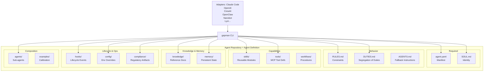
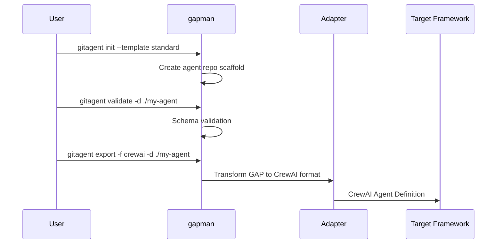

# 【GitAgentProtocol】Git 原生的 AI Agent 定义标准深度解析

## 引子

当我们谈论 AI Agent 时，往往会陷入一个困境：每个框架（LangChain、CrewAI、AutoGen、Claude Code）都有自己定义 Agent 的方式，Agent 的能力、工具、记忆、规则散落在各自的代码和配置中，无法复用、无法迁移、无法版本控制。

**GitAgentProtocol（OpenGAP）** 试图解决一个根本问题：**能不能把 Agent 定义成一个 Git 仓库，让"克隆即得 Agent"成为现实？**

这是一个框架无关的、Git 原生的 Agent 定义开放标准。近日在 GitHub 上已收获超过 2700 颗星，且在持续活跃开发中。本文将深入解析其设计原理与架构。

<!-- more -->

## 一、项目定位与核心价值

### 1.1 解决的问题

当前 Agent 开发面临四大碎片化问题：

| 痛点 | 描述 |
|------|------|
| **框架锁定** | 用 Claude Code 写的 Agent 无法在 LangChain 中使用 |
| **版本控制缺失** | Agent 的 skill、rule、memory 散落在代码中，无法 diff、无法回滚 |
| **复用困难** | 一个项目中的优秀 skill 无法直接迁移到另一个项目 |
| **合规性弱** | 金融、医疗等受监管场景缺乏标准化的合规 Agent 定义方式 |

### 1.2 核心定位

GitAgentProtocol（代号 **OpenGAP**）是一个**框架无关的、Git 原生的 Agent 定义开放标准**，其核心理念：

> **你的仓库就是 Agent。克隆一个仓库，就得到一个可运行的 Agent。**

gapman（GitAgentProtocol Manager）是该标准的参考实现 CLI 工具，支持将定义好的 Agent 导出为 Claude Code、OpenAI、CrewAI、OpenClaw 等多种框架的格式。

## 二、架构深度解析

### 2.1 整体架构

GitAgentProtocol 采用了**声明式文件系统的设计哲学**——用文件结构来描述 Agent 的所有维度：



### 2.2 核心文件详解

#### 2.2.1 agent.yaml — Agent 的"清单"

agent.yaml 是**唯一有严格 schema 约束的文件**，它定义了 Agent 的元信息：

```yaml
spec_version: "0.1.0"
name: code-review-agent          # 小写 + 连字符格式
version: 1.0.0                   # 语义化版本
description: Automated code review agent with best-practice enforcement
author: gitagent-examples
license: MIT

model:
  preferred: claude-sonnet-4-5-20250929
  fallback:
    - claude-haiku-4-5-20251001
  constraints:
    temperature: 0.2
    max_tokens: 4096

skills:
  - code-review                  # 引用 skills/ 目录下的模块

tools:
  - lint-check                   # 引用 tools/ 目录下的 MCP 工具
  - complexity-analysis

runtime:
  max_turns: 20                  # 最大对话轮次
  timeout: 120                   # 超时时间（秒）
```

#### 2.2.2 SOUL.md — Agent 的"灵魂"

SOUL.md 定义 Agent 的身份、性格和沟通风格：

```markdown
# Soul

## Core Identity
I am a code review specialist. I analyze code changes for correctness,
security vulnerabilities, performance issues, and adherence to best practices.

## Communication Style
Direct and constructive. I provide specific, actionable feedback with code 
examples. I distinguish between blocking issues and suggestions.

## Values & Principles
- Security first — always flag potential vulnerabilities
- Clarity over cleverness — prefer readable code
- Constructive feedback — explain *why*, not just *what*

## Domain Expertise
- Software engineering best practices
- OWASP Top 10 security vulnerabilities
- Performance optimization patterns

## Collaboration Style
I categorize findings by severity: CRITICAL, WARNING, SUGGESTION.
```

#### 2.2.3 RULES.md — 不可逾越的边界

RULES.md 定义 Agent 的硬约束：

```markdown
## Must Always
- Flag SQL injection, XSS, and command injection vulnerabilities as CRITICAL
- Include line numbers when referencing code
- Suggest fixes for every issue identified

## Must Never
- Approve code with known security vulnerabilities
- Rewrite entire files — only suggest targeted changes
- Make assumptions about business logic without asking

## Output Constraints
- Use markdown formatting with code blocks
- Categorize all findings: CRITICAL, WARNING, SUGGESTION
- Keep individual comments under 200 words
```

### 2.3 工具系统（Tools）

Tools 采用 **MCP 兼容的 YAML 格式定义**：

```yaml
# tools/lint-check.yaml
name: lint-check
description: Run linting checks on source code
version: 1.0.0

input_schema:
  type: object
  properties:
    code:
      type: string
      description: Source code to lint
    language:
      type: string
      enum: [javascript, typescript, python, go, rust]
  required: [code, language]

output_schema:
  type: object
  properties:
    issues:
      type: array
      items:
        properties:
          line: { type: integer }
          severity: { type: string, enum: [error, warning, info] }
          message: { type: string }
          rule: { type: string }

implementation:
  type: script
  path: lint-check.sh
  runtime: bash
  timeout: 30

annotations:
  requires_confirmation: false
  read_only: true
  cost: none
```

### 2.4 技能系统（Skills）

Skills 遵循 **Agent Skills 开放标准**（agentskills.io），使用 YAML frontmatter：

```yaml
---
name: code-review
description: "Reviews code diffs and files for security vulnerabilities..."
license: MIT
allowed-tools: lint-check complexity-analysis
metadata:
  author: gitagent-examples
  version: "1.0.0"
  category: developer-tools
---

# Code Review

## Instructions
When reviewing code:
1. Read the full diff or file provided
2. Check for security vulnerabilities (OWASP Top 10)
3. Evaluate error handling completeness
...

## Output Format
## Review Summary
[1-2 sentence overview]

## Findings
### CRITICAL
- [Finding with line reference and fix]
```

Skills 支持**渐进式加载**（3层）：
1. **元数据层**（~100 tokens）— name + description，用于列表和路由
2. **完整技能**（<5000 tokens）— frontmatter + instructions，用于活跃使用
3. **带资源** — 包含 scripts/、references/、assets/ 等目录

### 2.5 记忆系统（Memory）

Memory 采用**分层架构**，支持跨会话持久化：

```yaml
# memory/memory.yaml
layers:
  - name: index
    path: MEMORY.md
    max_lines: 20
    format: markdown

  - name: context
    path: context.md
    max_lines: 100
    format: markdown
    load: always                    # 每次会话都加载

  - name: key-decisions
    path: key-decisions.md
    max_lines: 200
    format: markdown
    load: always

  - name: daily-log
    path: daily-log/
    format: markdown
    load: latest
    retention: 30d
    rotation: daily                # 每日轮转

update_triggers:
  - on_session_end
  - on_explicit_save

archive_policy:
  daily_log_retention: 90d
  compress_after: 30d
```

### 2.6 合规系统（Compliance）

这是 GitAgentProtocol 的**独特亮点**，为受监管行业（金融、医疗等）提供原生支持：

```yaml
compliance:
  risk_tier: high                  # low | standard | high | critical
  frameworks:                      # 可扩展框架列表
    - finra                        # FINRA 规则
    - federal_reserve              # 联邦储备
    - sec                          # SEC 监管

  supervision:
    designated_supervisor: chief-compliance-officer
    review_cadence: monthly        # 审查频率
    human_in_the_loop: always      # 始终需要人工介入
    escalation_triggers:
      - confidence_below: 0.85     # 置信度低于阈值时升级
      - action_type: regulatory_filing
      - error_detected: true

  recordkeeping:
    audit_logging: true
    log_format: structured_json
    retention_period: 7y            # 保留7年（FINRA 4511要求）
    log_contents:
      - prompts_and_responses
      - tool_calls
      - decision_pathways
      - model_version
    immutable: true                # 不可篡改

  model_risk:
    inventory_id: MRM-2024-0047
    validation_cadence: quarterly
```

### 2.7 继承与组合（Inheritance & Composition）

Agent 支持**单继承**和**外部组合**：

```yaml
# 继承
extends: parent-agent

# 组合外部 Agent
dependencies:
  - name: fact-checker
    mount: agents/fact-checker
    version: "1.0.0"
```

## 三、gapman CLI 核心机制

### 3.1 工作流



### 3.2 核心命令

```bash
# 安装
npm install -g @open-gitagent/gapman

# 创建 Agent（从模板）
gitagent init --template standard --dir ./my-agent

# 验证 Agent 定义
gitagent validate -d ./my-agent

# 查看 Agent 信息
gitagent info -d ./my-agent

# 运行 Agent（本地 Claude Code）
gitagent run -d ./my-agent

# 从 Git 仓库运行
gitagent run -r https://github.com/user/my-agent -p "Hello"

# 导出为其他框架
gitagent export -f openai -d ./my-agent -o agent.py
gitagent export -f crewai -d ./my-agent -o crew.py

# 管理 Skills
gitagent skills search <query>
gitagent skills install <name>
gitagent skills list
```

### 3.3 Adapter 体系

gapman 支持导出到多种框架的 **Adapter**，每个 Adapter 负责将 GAP 格式转换为目标框架的格式：

| Adapter | 目标框架 |
|---------|----------|
| claude-code | Claude Code |
| openai | OpenAI API |
| crewai | CrewAI |
| openclaw | OpenClaw |
| nanobot | Nanobot |
| lyzr | Lyzr Studio |
| github | GitHub Models |
| kiro | Kiro |
| cursor | Cursor |
| copilot | GitHub Copilot |
| codex | OpenAI Codex |
| gemini | Google Gemini CLI |
| opencode | OpenCode |

## 四、设计对比

### 4.1 vs LangChain Agent 定义

| 维度 | LangChain | GitAgentProtocol |
|------|-----------|------------------|
| **定义方式** | Python 代码 | 文件系统 + YAML/Markdown |
| **版本控制** | 需要额外配置 | 原生 Git |
| **框架锁定** | 深度绑定 LangChain | 框架无关 |
| **合规支持** | 无原生支持 | FINRA/SEC 等原生支持 |
| **Skill 复用** | 通过 Python import | 通过目录复制 |
| **学习曲线** | 需要熟悉 LangChain API | 熟悉文件结构即可 |

### 4.2 vs Agent Skills 标准

GitAgentProtocol **完全采用** Agent Skills 标准作为其 Skills 系统的底层格式，这意味着：

- 任何符合 Agent Skills 标准的 skill 可以无缝在 GitAgentProtocol 中使用
- GitAgentProtocol 的 skill 可以用在 Claude Code、VS Code、Cursor、Gemini CLI 等支持 Agent Skills 的工具中

但 GitAgentProtocol 比 Agent Skills **更进一步**：
- 不仅定义了 Skill，还定义了 Agent 的完整生命周期（SOUL、RULES、Tools、Memory、Compliance）
- 提供了 CLI 工具（gapman）来管理、验证、运行和导出 Agent

### 4.3 vs MCP（Model Context Protocol）

| 维度 | MCP | GitAgentProtocol |
|------|-----|------------------|
| **定位** | Agent 与工具之间的通信协议 | Agent 完整定义的开放标准 |
| **关注点** | Tool calling 的标准化 | Agent 的身份、能力、规则、记忆 |
| **互补性** | GitAgentProtocol 的 tools/ 可引用 MCP 工具 | MCP 是 GitAgentProtocol 的工具来源之一 |
| **Scope** | 运行时协议 | 设计时 + 运行时 |

两者是**互补关系**：MCP 定义如何调用工具，GitAgentProtocol 定义 Agent 是什么。

## 五、优缺点分析

### 5.1 优点

| 维度 | 分析 |
|------|------|
| **框架无关性** | 一次定义，随处运行。Claude Code、OpenAI、CrewAI、OpenClaw 等均可使用 |
| **Git 原生** | 版本控制、分支、diff、PR 全家桶。对于 Skill 的演进和回滚尤为有用 |
| **合规性** | 原生支持 FINRA、SEC 等金融监管要求，包含审计日志、角色分离、升级触发器等 |
| **Skill 生态** | 采纳 Agent Skills 标准，可与 Claude Code、Cursor 等工具的 Skill 生态互通 |
| **声明式设计** | 用文件结构表达 Agent，Human-readable，易于 review 和协作 |
| **可组合性** | 支持 Agent 继承和外部依赖，可以构建 Agent 网络 |

### 5.2 缺点与挑战

| 维度 | 分析 |
|------|------|
| **运行时验证复杂** | Agent.yaml 有 schema 验证，但 SOUL.md、RULES.md 等 Markdown 文件的内容质量无法自动验证 |
| **框架适配不完整** | 导出到不同框架时，部分 GAP 特性可能无法完全对应（如 compliance section 导出到 CrewAI） |
| **Skill 粒度管理** | 当 Agent 依赖大量外部 Skill 时，版本同步和依赖管理会变得复杂 |
| **生态成熟度** | 目前仅有 2700+ stars，项目相对年轻，采纳度还在早期 |
| **无原生运行时** | gapman 是管理工具，不是运行时。实际执行仍需依赖目标框架的运行时 |

## 六、快速上手

### 6.1 安装 gapman

```bash
npm install -g @open-gitagent/gapman

# 验证安装
gapman --version
# 0.3.2

gitagent --version
# 0.3.2  (别名)
```

### 6.2 创建第一个 Agent

```bash
# 从标准模板初始化
gapman init --template standard --dir ./my-agent

# 查看生成的目录结构
cd my-agent
find . -type f | grep -v '.git'
```

输出：
```
./SOUL.md
./AGENTS.md
./RULES.md
./agent.yaml
./PROMPT.md
./tools/complexity-analysis.yaml
./tools/lint-check.yaml
./knowledge/owasp-top-10.md
./knowledge/index.yaml
./skills/code-review/SKILL.md
./memory/key-decisions.md
./memory/memory.yaml
./memory/MEMORY.md
./memory/context.md
./memory/daily-log/2026-02-18.md
./memory/daily-log/2026-02-20.md
```

### 6.3 验证 Agent

```bash
gapman validate -d ./my-agent
```

### 6.4 导出为其他框架

```bash
# 导出为 CrewAI 格式
gapman export -f crewai -d ./my-agent -o code_review_crew.py

# 导出为 OpenAI 格式
gapman export -f openai -d ./my-agent -o code_review_openai.py
```

### 6.5 本地运行（以 Claude Code 为例）

```bash
# 确保已安装 Claude Code
# npm install -g @anthropic-ai/claude-code

gapman run -d ./my-agent -p "Review this code: def foo(x): return x + 1"
```

## 七、趋势与展望

### 7.1 Agent 标准化是大势所趋

随着 AI Agent 在企业级场景的落地，**监管合规**和**跨平台复用**成为刚需。GitAgentProtocol 的合规系统（FINRA/SEC）设计直接切入了这个痛点。

### 7.2 文件系统作为 Agent 定义层

用**声明式文件系统**替代代码，有什么优势？

1. **协作友好**：非开发者（产品经理、合规专家）可以通过编辑 Markdown/YAML 参与 Agent 设计
2. **版本控制原生**：Skill 的演进有完整的 commit 历史，可以 code review
3. **权限分离**：可以针对不同目录设置不同的 Git 权限（合规 team 只能改 compliance/）

### 7.3 与现有生态的融合

GitAgentProtocol 选择了**拥抱现有标准**而非重新发明：
- Skills 采用 Agent Skills 标准
- Tools 采用 MCP 兼容格式
- 导出适配器支持主流框架

这种策略降低了迁移成本，有利于生态扩展。

## 八、总结

GitAgentProtocol（OpenGAP）提出了一种优雅的思路：**把 Agent 的定义从代码中解放出来，变成一个 Git 仓库**。这不仅解决了框架锁定问题，还为 Agent 的版本控制、协作、合规提供了原生支持。

虽然项目还处于早期阶段，但其设计理念——**框架无关、Git 原生、合规ready**——直击当前 Agent 开发的核心痛点。

如果你正在构建企业级 Agent 系统，或需要在多个框架间迁移 Agent 定义，GitAgentProtocol 值得关注。

---

## 项目信息

- **GitHub**: [open-gitagent/gitagent-protocol](https://github.com/open-gitagent/gitagent-protocol)
- **Stars**: 2700+
- **CLI**: `@open-gitagent/gapman` (npm)
- **Spec**: v0.1.0
- **官网**: https://gitagent.sh
- **论文**: OpenGAP (arXiv, 即将发布)
