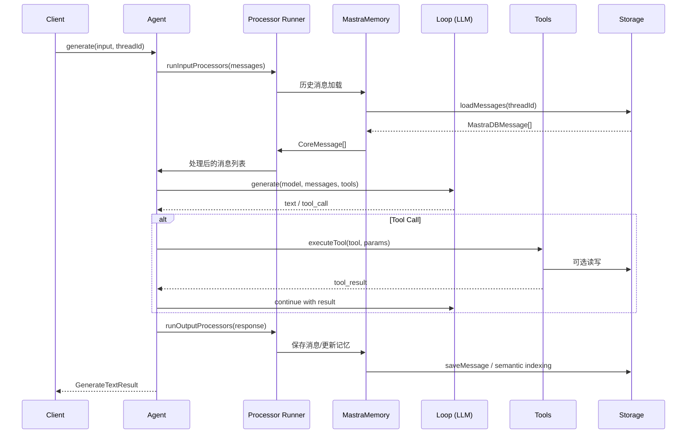
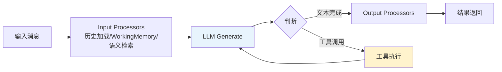
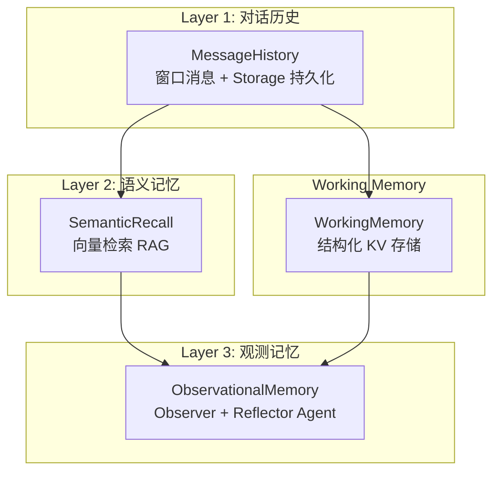
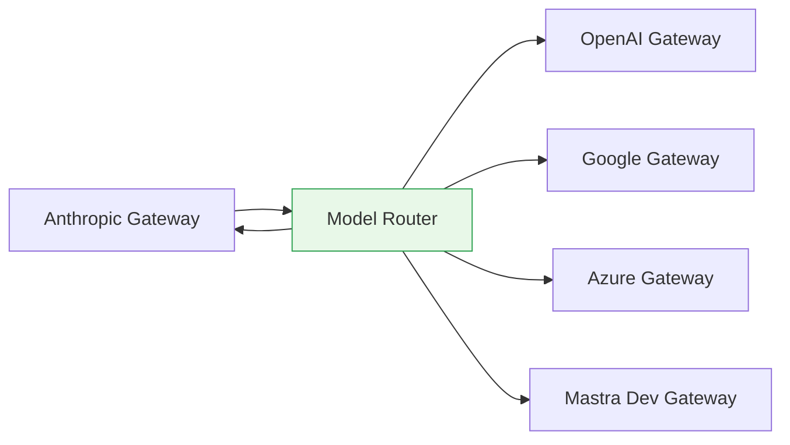

# 【Mastra】TypeScript 优先的 AI Agent 框架核心架构与设计原理深度解析

## 引子

在 AI Agent 框架层出不穷的今天，大多数框架要么面向 Python 生态，要么设计过于复杂难以上手。**Mastra** 的出现填补了一个关键空白——**为 TypeScript/JavaScript 生态打造的生产级 AI Agent 框架**。

Mastra 由 Gatsby 团队（Y Combinator W25 孵化）打造，2024 年 8 月开源，目前已有 **23k+ GitHub Stars**，最近一次提交为 2026 年 4 月 26 日，社区活跃度极高。它不是又一个 LangChain 的 TypeScript 移植版，而是一个从零设计、深度整合现代 TypeScript 工具链（Zod v4、React、Next.js、Node）的生产级框架。

本文将从**架构设计**、**核心机制**、**代码原理**三个维度，对 Mastra 进行深度解析。

## 一、项目定位：解决什么问题

Mastra 解决的核心问题是：**如何用 TypeScript 快速构建、部署和迭代可靠的 AI 应用**。

具体而言，它提供了：

- **统一的 Agent 抽象**：连接多模型、多工具、多 Memory 的智能体
- **声明式 Workflow**：精确控制复杂业务流程的执行顺序
- **生产级可观测性**：Tracing、Logging、Metrics 开箱即用
- **多存储后端**：LibSQL、PostgreSQL、MongoDB、Upstash 等
- **MCP 协议支持**：连接任何符合 MCP 协议的外部工具
- **观测记忆系统**：Observational Memory，用后台 Agent 自动压缩对话历史

## 二、整体架构

### 2.1 分层架构概览

```mermaid
graph TB
    subgraph "接入层"
        Client["Client SDK<br/>(React/Next.js/Node)"]
        Channel["Channels<br/>(Slack/Discord/Telegram)"]
        MCPClient["MCP Client"]
    end

    subgraph "Agent 执行层"
        Agent["Agent Core<br/>循环推理 + 工具调用"]
        Loop["Loop<br/>Agentic Loop 引擎"]
        Processor["Processor Runner<br/>输入/输出处理器链"]
    end

    subgraph "Memory 层"
        Memory["MastraMemory"]
        MsgHistory["MessageHistory<br/>对话历史"]
        WorkingMem["WorkingMemory<br/>结构化用户数据"]
        Semantic["SemanticRecall<br/>向量语义检索"]
        ObservMem["ObservationalMemory<br/>观察记忆"]
    end

    subgraph "Tool 层"
        Tools["Tools<br/>createTool"]
        MCP["MCP Server"]
        Workspace["Workspace Tools<br/>文件系统/LSP"]
    end

    subgraph "Workflow 层"
        Workflow["createWorkflow"]
        Step["createStep"]
        Branch["分支/并行/暂停"]
    end

    subgraph "Model 层"
        Router["Model Router<br/>40+ Provider"]
        Provider1["OpenAI"]
        Provider2["Anthropic"]
        Provider3["Gemini"]
        Provider4["..."
    end

    subgraph "存储层"
        Storage["Storage Adapter"]
        Vector["Vector Store"]
        Observability["Observability"]
    end

    Client --> Agent
    Channel --> Agent
    MCPClient --> Agent

    Agent --> Loop
    Loop --> Processor

    Processor --> Memory
    Processor --> Tools
    Processor --> Workflow

    Loop --> Router
    Router --> Provider1
    Router --> Provider2
    Router --> Provider3
    Router --> Provider4

    Memory --> Storage
    Memory --> Vector
    Tools --> Storage
    Workflow --> Storage
    Loop --> Observability

    style Agent fill:#E8F4FD,stroke:#2171B5
    style Loop fill:#E8F4FD,stroke:#2171B5
    style Memory fill:#FFF3CD,stroke:#E6550D
    style Router fill:#E8F8E8,stroke:#31A354
```

### 2.2 数据流向



## 三、核心模块深度解析

### 3.1 Agent 循环机制

Mastra 的 Agent 核心是一个**受控的生成循环**（Agentic Loop），由 `packages/core/src/loop/loop.ts` 驱动：

```typescript
// packages/core/src/loop/loop.ts (核心签名)
export function loop<Tools extends ToolSet = ToolSet, OUTPUT = undefined>({
  resumeContext,      // 恢复上下文（暂停后继续）
  models,             // 模型列表（支持回退）
  logger,
  runId,
  messageList,        // 消息列表（含历史）
  modelSettings,
  tools,              // 转换后的工具
  outputProcessors,   // 输出处理器
  requireToolApproval, // 工具审批（Human-in-the-loop）
  agentId,
  ...rest
}: LoopOptions<Tools, OUTPUT>)
```

循环的核心流程：



**关键设计点**：
- **多模型回退**：若第一个模型失败，自动尝试后续模型
- **暂停恢复**：`resumeContext` 支持 Workflow 暂停后继续执行
- **并发工具调用**：支持工具并发执行（`toolCallConcurrency`）
- **工具审批**：`requireToolApproval` 支持人工审核高风险操作

### 3.2 Processor 处理器链

Mastra 独创的 **Processor 架构**是其最大设计亮点。Processor 是**可插拔的中间处理单元**，分为输入处理器和输出处理器：

```typescript
// packages/core/src/processors/runner.ts
export class ProcessorRunner {
  async runInputProcessors(
    messages: CoreMessage[],
    options: ProcessorRunnerOptions
  ): Promise<CoreMessage[]>

  async runOutputProcessors(
    result: ModelOutput,
    options: ProcessorRunnerOptions
  ): Promise<ModelOutput>
}
```

**内置输入处理器**（按执行顺序）：

| 处理器 | 作用 |
|--------|------|
| `MessageHistory` | 从 Storage 加载历史消息 |
| `WorkingMemory` | 注入结构化用户数据（姓名/偏好/目标） |
| `SemanticRecall` | RAG 向量检索相关历史消息 |
| `ObservationalMemory` | 后台 Agent 自动压缩记忆 |
| `Skills` | 技能检索与激活 |
| `WorkspaceInstructions` | 工作空间级指令注入 |
| `TokenLimiter` | Token 数量限制与截断 |
| `PromptInjectionDetector` | 提示词注入检测 |

**内置输出处理器**：

| 处理器 | 作用 |
|--------|------|
| `MessageHistory` | 保存新消息到 Storage |
| `SemanticRecall` | 新消息写入向量索引 |
| `ObservationalMemory` | 后台 Agent 更新记忆 |
| `StructuredOutput` | JSON Schema / Zod 结构化输出验证 |
| `Moderation` | 内容安全审核 |
| `ToolCallFilter` | 过滤敏感工具调用 |

### 3.3 Memory 体系：三层记忆架构

Mastra 的 Memory 系统是其最有技术深度的部分，采用**三层记忆架构**：



#### 第一层：MessageHistory（最近消息窗口）

```typescript
// packages/core/src/processors/memory/message-history.ts
export class MessageHistory implements InputProcessor, OutputProcessor {
  processInput({ messages, ... }): CoreMessage[] {
    // 从 Storage 加载 threadId 对应的消息
    const history = await this.storage.listMessages({ threadId });
    // 与当前消息合并，返回固定窗口大小
    return [...history.slice(-this.lastMessages), ...messages];
  }
}
```

#### 第二层：SemanticRecall（RAG 语义检索）

```typescript
// packages/core/src/processors/memory/semantic-recall.ts
export class SemanticRecall implements InputProcessor, OutputProcessor {
  // 核心：向量相似度搜索
  async processInput({ messages, ... }): Promise<CoreMessage[]> {
    // 用最后一条用户消息生成查询向量
    const queryEmbedding = await this.embedder.embed({
      text: lastUserMessage.content,
      options: this.embedderOptions,
    });

    // 向量库检索 Top-K 相关消息
    const results = await this.vector.query({
      queryEmbedding,
      topK: this.topK,
      filter: { threadId },
    });

    // 周围上下文消息也一并返回
    return this.getMessageContext(results, this.messageRange);
  }
}
```

#### 第三层：Observational Memory（观测记忆）

这是 Mastra 最创新的设计——**用两个后台 Agent 自动管理记忆**：

- **Observer Agent**：观察每次 Agent 对话，生成结构化的"观察日志"
- **Reflector Agent**：定期压缩/合并观察日志，防止上下文膨胀

```typescript
// 启用方式极其简单
const agent = new Agent({
  name: 'my-agent',
  instructions: '你是一个有帮助的助手',
  model: 'openai/gpt-5-mini',
  memory: new Memory({
    options: {
      observationalMemory: true,  // 一行启用！
      // 或自定义配置
      observationalMemory: {
        model: 'deepseek/deepseek-reasoner',
        activateAfterIdle: 300,  // 5分钟空闲后触发
        shareTokenBudget: 8192,   // Token 预算
      },
    },
  }),
});
```

#### WorkingMemory（结构化用户数据）

```typescript
// packages/core/src/processors/memory/working-memory.ts
export const defaultTemplate = `
# User Information
- **First Name**: 
- **Last Name**: 
- **Location**: 
- **Occupation**: 
- **Interests**: 
- **Goals**: 
- **Events**: 
- **Facts**: 
- **Projects**: 
`;

// 工作内存作为系统消息注入
processInput({ messages, ... }) {
  const userData = await this.storage.getWorkingMemory({ threadId });
  const formatted = formatTemplate(this.template, userData);
  return [{ role: 'system', content: formatted }, ...messages];
}
```

### 3.4 Model Router：统一多模型抽象



Mastra 的 Model Router 支持 **40+ 模型提供商**，统一通过 `provider/model-id` 格式指定：

```typescript
// 模型配置
const agent = new Agent({
  model: 'openai/gpt-5.4',          // 主模型
  // 或模型回退列表
  model: [
    'openai/gpt-5.4',
    'anthropic/claude-sonnet-4',
    'google/gemini-2.5-flash',
  ],
});
```

Router 会自动处理：
- Provider 特定的 API 格式差异
- Embedding 模型路由
- 模型特定的参数映射

### 3.5 Workflow：声明式业务流程控制

Mastra 的 Workflow 使用**函数式组合**而非图形化配置，代码即架构：

```typescript
import { createWorkflow, createStep } from '@mastra/core/workflows';
import { z } from 'zod';

// 定义步骤
const fetchWeather = createStep({
  id: 'fetch-weather',
  inputSchema: z.object({ city: z.string() }),
  outputSchema: z.object({ weather: z.string() }),
  execute: async ({ inputData }) => {
    const res = await fetch(`https://wttr.in/${inputData.city}?format=3`);
    return { weather: await res.text() };
  },
});

const formatResponse = createStep({
  id: 'format-response',
  inputSchema: z.object({ weather: z.string(), city: z.string() }),
  outputSchema: z.object({ response: z.string() }),
  execute: async ({ inputData }) => ({
    response: `${inputData.city}今天天气：${inputData.weather}`,
  }),
});

// 组合工作流
export const weatherWorkflow = createWorkflow({
  id: 'weather-workflow',
  inputSchema: z.object({ city: z.string() }),
  outputSchema: z.object({ response: z.string() }),
})
  .then(fetchWeather)
  .then(formatResponse)
  .commit();

// Agent 中调用工作流
const agent = new Agent({
  instructions: '你是一个天气助手，使用 weatherWorkflow 查询天气',
  workflows: { weatherWorkflow },
});
```

**支持的控制流**：

```typescript
workflow
  .then(stepA)              // 顺序执行
  .parallel(stepB, stepC)   // 并行执行
  .branch(
    condition ? stepD       // 条件分支
    : stepE
  )
  .sleep('10s')             // 暂停
  .suspend()                // 人工审批暂停
```

### 3.6 工具系统

```typescript
import { createTool } from '@mastra/core/tools';
import { z } from 'zod';

export const weatherTool = createTool({
  id: 'weather-tool',
  description: '获取指定城市的天气信息',
  inputSchema: z.object({
    location: z.string().describe('城市名称'),
  }),
  outputSchema: z.object({
    weather: z.string(),
    temperature: z.number().optional(),
  }),
  execute: async (input, { threadId, resourceId }) => {
    const { location } = input;
    const response = await fetch(`https://wttr.in/${location}?format=3`);
    return { weather: await response.text() };
  },
});
```

工具可从 **MCP 服务器**加载，形成开放的工具生态：

```typescript
import { MCPClient } from '@mastra/mcp';

const mcp = new MCPClient({
  id: 'my-mcp',
  servers: {
    wikipedia: {
      command: 'npx',
      args: ['-y', 'wikipedia-mcp'],
    },
  },
});

const agent = new Agent({
  tools: { wikipedia: mcp.getTools() },
});
```

## 四、完整使用示例

以下是一个融合了 Memory、Tools、Workflow 的完整示例：

```typescript
// src/mastra/index.ts
import { Mastra } from '@mastra/core';
import { LibSQLStore } from '@mastra/libsql';
import { createWorkflow, createStep } from '@mastra/core/workflows';
import { z } from 'zod';
import { Agent } from '@mastra/core/agent';
import { createTool } from '@mastra/core/tools';
import { Memory } from '@mastra/memory';

// 1. 定义工具
const searchTool = createTool({
  id: 'web-search',
  description: '搜索网页',
  inputSchema: z.object({ query: z.string() }),
  outputSchema: z.object({ results: z.array(z.string()) }),
  execute: async ({ query }) => ({
    results: [`关于"${query}"的搜索结果...`],
  }),
});

// 2. 定义工作流步骤
const researchStep = createStep({
  id: 'research',
  inputSchema: z.object({ topic: z.string() }),
  outputSchema: z.object({ facts: z.array(z.string()) }),
  execute: async ({ inputData }) => ({
    facts: [`事实1: ${inputData.topic}`, `事实2: ${inputData.topic}`],
  }),
});

// 3. 创建工作流
const researchWorkflow = createWorkflow({
  id: 'research-workflow',
  inputSchema: z.object({ topic: z.string() }),
  outputSchema: z.object({ facts: z.array(z.string()) }),
})
  .then(researchStep)
  .commit();

// 4. 创建 Agent（集成 Memory + Tools + Workflows）
const researchAgent = new Agent({
  id: 'research-agent',
  name: '研究助手',
  instructions: `你是一个专业的研究助手。`,
  model: 'openai/gpt-5.4',
  tools: { webSearch: searchTool },
  workflows: { research: researchWorkflow },
  memory: new Memory({
    options: {
      lastMessages: 20,
      semanticRecall: true,  // 启用语义检索
      workingMemory: {
        template: {
          format: 'markdown',
          content: '# 用户信息\n- 兴趣：\n- 研究领域：\n',
        },
      },
      observationalMemory: true,  // 启用观测记忆
    },
  }),
});

// 5. 注册到 Mastra 实例
export const mastra = new Mastra({
  agents: { researchAgent },
  storage: new LibSQLStore({ url: 'file:./mastra.db' }),
});
```

## 五、与同类项目对比

| 维度 | **Mastra** | **LangChain (JS/TS)** | **CrewAI** | **OpenAI Swarm** |
|------|-------------|------------------------|-----------|-----------------|
| 语言生态 | TypeScript 原生 | TypeScript（移植） | Python 优先 | Python |
| 记忆系统 | 三层 Memory（历史/语义/观测） | LCEL + 外部向量库 | 基础记忆 | 无内置 |
| 工作流 | 函数式 .then()/.branch() | LCEL 可组合 | 角色+任务 | Handoff 机制 |
| 模型路由 | 内置 40+ Provider | 需分别集成 | OpenAI API | 仅 OpenAI |
| 可观测性 | Tracing/Logging/Metrics 内置 | 需自行集成 | 基础日志 | 无 |
| 暂停恢复 | 支持（suspend/resume） | 受限 | 不支持 | 不支持 |
| MCP 支持 | 一等公民 | 第三方适配器 | 无 | 无 |
| 企业功能 | Enterprise License（认证/RBAC） | 托管服务 | SaaS | API |
| 学习曲线 | 中等 | 较高 | 中等 | 低（教学用） |

**核心差异**：

1. **Processor vs LCEL**：Mastra 的 Processor 链是**统一的可插拔架构**，输入输出处理器对称设计；而 LangChain 的 LCEL 是管道式串联，不支持条件分支跳过
2. **Observational Memory**：Mastra 独创的"用 Agent 管理 Agent 记忆"方案，用后台 Observer+Reflector Agent 自动压缩历史，解决了 RAG 的手动管理痛点
3. **TypeScript-First**：Mastra 深度整合 Zod v4、Next.js、React，从第一天就为 TypeScript 生态设计；LangChain TS 是 Python 版本的移植，总有功能差距

## 六、优缺点分析

### 优点

| 维度 | 说明 |
|------|------|
| **架构简洁性** | 分层清晰（Agent→Loop→Processor→Model），每层职责单一 |
| **扩展性** | Processor 插拔机制、ToolProvider、MCP 协议使得生态扩展极其自然 |
| **类型安全** | 全面拥抱 TypeScript + Zod v4，IDE 支持完善 |
| **多工具集成** | MCP 协议支持 + 40+ 模型 Provider + 多存储后端 |
| **可观测性** | 开箱即用的 Tracing/Logging/Metrics，减少生产调试成本 |
| **Human-in-the-loop** | suspend/resume + 工具审批，真实生产环境必需 |

### 缺点

| 维度 | 说明 |
|------|------|
| **性能** | Processor 链层层过滤，对超低延迟场景有额外开销 |
| **复杂度** | Processor/Memory/Workflow 三套系统同时存在，学习成本较高 |
| **Python 生态** | 主要面向 TypeScript，Python 团队需跨语言协作 |
| **社区规模** | 23k Stars 相比 LangChain 135k 仍较小，第三方资源少 |
| **企业安全** | Enterprise License 需要商业许可，审计功能在 `ee/` 目录 |

## 七、未来趋势

Mastra 的设计思路代表了几个重要趋势：

1. **TypeScript-first AI 框架崛起**：随着 Next.js、React 生态中 AI UI 需求爆发，TypeScript 原生框架将占据更多份额
2. **Processor 架构标准化**：Mastra 的 Processor 模式（可插拔、链式、输入输出对称）可能被更多框架借鉴
3. **Observational Memory 革新**：用 LLM 管理 LLM 的记忆压缩，是解决上下文窗口限制的新范式
4. **Agent 与 Workflow 融合**：Mastra 的 Agent 可调用 Workflow、Workflow 可调用 Agent，两者边界模糊但各有分工，代表了灵活系统架构的方向

## 八、总结

Mastra 不是又一个 LangChain 的"TypeScript 替代品"，而是一个**从 TypeScript 生态出发、面向生产环境、架构设计极具创新**的 AI Agent 框架。

其最值得学习的核心设计：
- **Processor 架构**：可插拔、输入输出对称、链式组合
- **三层 Memory**：MessageHistory + SemanticRecall + ObservationalMemory，分层解决不同上下文问题
- **Observational Memory**：用后台 Agent 自动管理记忆，是 RAG 领域的创新方向
- **TypeScript 原生**：从 TypeScript 出发而非从 Python 移植，类型安全和使用体验更佳

如果你在构建 **TypeScript 生态的 AI 应用**，尤其是需要**复杂工具调用、多步骤业务流程、长期记忆管理**的生产级 Agent，Mastra 是目前最值得关注的选择。

---

**项目信息**：
- GitHub：https://github.com/mastra-ai/mastra
- Stars：23,335+
- 语言：TypeScript
- 许可证：Apache 2.0（核心）+ Enterprise License（企业功能）
- 文档：https://mastra.ai/docs
