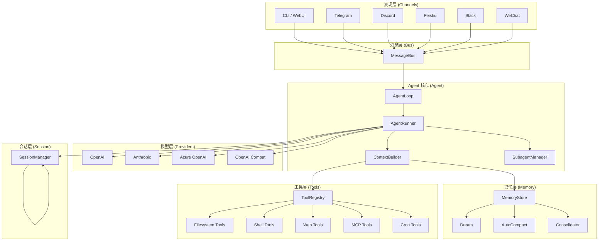
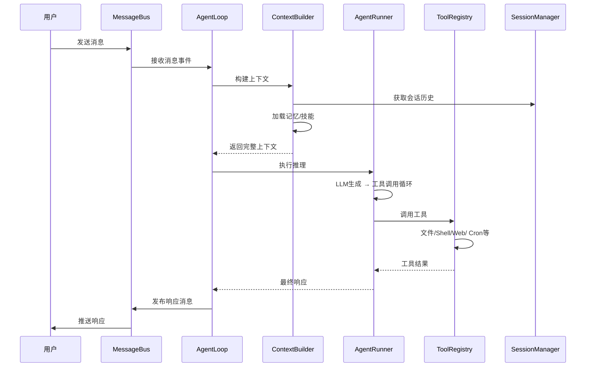
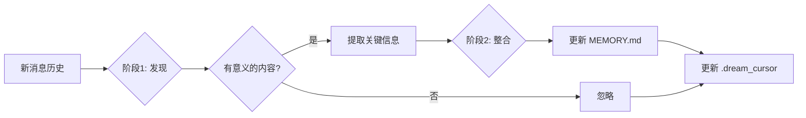
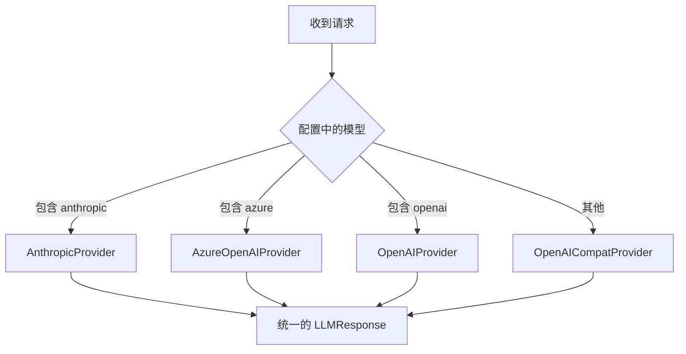

# 【nanobot】超轻量级个人 AI Agent 架构与设计原理深度解析

## 引子

在 AI Agent 领域，框架越来越"重"似乎成了一种趋势——依赖链越来越长、抽象层越来越多、内存占用越来越大。然而今天要介绍的这个项目，恰恰选择了一条截然相反的道路：**极简、极轻、极快**。

[nanobot](https://github.com/HKUDS/nanobot) 是由香港大学（HKU）开发的一个超轻量级个人 AI Agent，GitHub Stars 已超过 **41,000**，最近依然保持高度活跃（2026-04-27 仍有提交）。它受到了 [OpenClaw](https://github.com/openclaw/openclaw)、[Claude Code](https://www.anthropic.com/claude-code) 和 [Codex](https://www.openai.com/codex) 的深刻启发，定位非常清晰：**保持核心 Agent 循环小而可读，同时支持聊天频道、记忆、MCP 和实用的部署路径**。

本文将深入剖析 nanobot 的架构设计，探究它是如何在"轻量"与"功能丰富"之间取得精妙平衡的。

---

## 1. 项目定位：解决什么问题？

**问题**：现有 AI Agent 框架往往存在以下痛点：

- **过于笨重**：依赖众多（LangChain、LiteLLM 等），冷启动慢，内存占用高
- **扩展困难**：框架设计过度抽象，想要定制化反而被束缚
- **记忆系统复杂**：引入向量数据库、Embedding 服务等重依赖
- **多渠道集成难**：每个平台（Telegram、Discord、飞书等）都要单独适配

**nanobot 的价值主张**：

> Keep the core agent loop small and readable while still supporting chat channels, memory, MCP and practical deployment paths.

它追求的是**可读性第一**的代码哲学，让任何人都能理解 agent 的核心逻辑，同时不牺牲多渠道、多功能的实用性。

---

## 2. 核心架构：分层清晰



### 2.1 各层职责

| 层级 | 组件 | 职责 |
|------|------|------|
| **表现层** | Channels (Telegram/Discord/Feishu/Slack/WeChat等) | 接收用户消息，发送 Bot 响应 |
| **消息层** | MessageBus | 跨渠道统一消息分发与会话协调 |
| **Agent 核心** | AgentLoop | 主循环：消息→上下文→LLM→工具→响应 |
| **Agent 核心** | AgentRunner | 共享的 tool-use 执行循环 |
| **Agent 核心** | ContextBuilder | 组装系统提示词（身份+记忆+技能+历史） |
| **Agent 核心** | SubagentManager | 后台子 Agent 任务管理 |
| **记忆层** | MemoryStore | 纯文件 I/O 的记忆存储 |
| **记忆层** | Dream | 两阶段记忆处理（发现+整合） |
| **记忆层** | AutoCompact | 主动压缩空闲会话，降低 token 消耗 |
| **记忆层** | Consolidator | 记忆合并与摘要生成 |
| **工具层** | ToolRegistry | 动态工具注册与调用 |
| **工具层** | Filesystem/Shell/Web/Cron/MCP Tools | 具体工具实现 |
| **模型层** | Providers (OpenAI/Anthropic/Azure/OpenAI Compat) | LLM 接口统一抽象 |
| **会话层** | SessionManager | 多渠道会话状态管理 |

---

## 3. 核心机制深度解析

### 3.1 AgentLoop：主循环引擎

`AgentLoop` 是 nanobot 的心脏，它管理整个 agent 的生命周期：

```python
class AgentLoop:
    """核心循环：消息 → 上下文构建 → LLM推理 → 工具执行 → 响应"""
    
    def __init__(self, bus, provider, workspace, model, ...):
        self.bus = bus              # 消息总线
        self.provider = provider     # LLM 提供者
        self.workspace = workspace   # 工作目录
        self.model = model           # 模型名称
        # ...
```

**核心执行流程**：



**AgentLoop 的关键特性**：

1. **生命周期钩子（Hooks）**：支持在每个迭代阶段插入自定义逻辑
2. **流式响应**：支持 SSE 流式输出
3. **统一会话**：跨渠道共享同一个会话上下文
4. **Subagent 支持**：可以并行执行后台子任务

### 3.2 AgentRunner：共享的 Tool-Use 执行器

`AgentRunner` 是 nanobot 的核心创新之一——它是**所有 tool-use agent 共享的执行引擎**：

```python
@dataclass
class AgentRunSpec:
    """单次 agent 执行的配置"""
    initial_messages: list[dict]     # 初始消息列表
    tools: ToolRegistry              # 工具注册表
    model: str                        # 模型名称
    max_iterations: int               # 最大迭代次数
    max_tool_result_chars: int        # 工具结果最大字符数
    temperature: float | None = None
    max_tokens: int | None = None
    reasoning_effort: str | None = None  # 推理努力（如 "low", "medium", "high"）
    hook: AgentHook | None = None
    concurrent_tools: bool = False     # 是否并发执行工具
    fail_on_tool_error: bool = False
    # ...
```

**执行循环**：

```python
class AgentRunner:
    """共享的 tool-use agent 执行器"""
    
    async def run(self, spec: AgentRunSpec) -> AgentRunResult:
        messages = spec.initial_messages.copy()
        
        for iteration in range(spec.max_iterations):
            # 1. 调用 LLM
            response = await self._call_llm(messages, spec)
            
            # 2. 检查工具调用
            if response.should_execute_tools:
                tool_results = []
                for tool_call in response.tool_calls:
                    # 执行工具
                    tool = spec.tools.get(tool_call.name)
                    result = await tool.execute(tool_call.arguments)
                    tool_results.append(result)
                
                # 添加工具结果到消息
                messages.extend(tool_results)
            else:
                # 无工具调用，结束
                break
        
        return AgentRunResult(
            final_content=response.content,
            messages=messages,
            tools_used=[...],
            usage=response.usage,
        )
```

**关键设计**：
- **`should_execute_tools`**：只有当 `finish_reason` 为 `tool_calls` 或 `stop` 时才执行工具，防止在拒绝/错误时误触发
- **注入机制（Injection）**：支持在迭代中途注入上下文（最多 3 次注入，最多 5 个注入周期）
- **长度恢复**：当上下文超长时，自动尝试恢复策略（最多 3 次）
- **Micro-compact**：微型压缩，只保留最近 10 条消息中的合法部分

### 3.3 MemoryStore：纯文件 I/O 的记忆系统

这是 nanobot 最独特的设计——**完全不用数据库，纯文件 I/O**：

```python
class MemoryStore:
    """纯文件 I/O 的记忆存储：MEMORY.md, history.jsonl, SOUL.md, USER.md"""
    
    def __init__(self, workspace: Path, max_history_entries: int = 1000):
        self.workspace = workspace
        self.memory_dir = ensure_dir(workspace / "memory")
        self.memory_file = self.memory_dir / "MEMORY.md"      # 记忆内容
        self.history_file = self.memory_dir / "history.jsonl"  # 消息历史
        self.soul_file = workspace / "SOUL.md"                 # agent 身份
        self.user_file = workspace / "USER.md"                 # 用户信息
        self._cursor_file = self.memory_dir / ".cursor"       # 读取游标
        self._dream_cursor_file = self.memory_dir / ".dream_cursor"  # Dream 处理游标
```

**记忆文件架构**：

| 文件 | 用途 | 格式 |
|------|------|------|
| `memory/MEMORY.md` | 长期记忆内容 | Markdown |
| `memory/history.jsonl` | 消息历史 | JSONL（一行一条） |
| `SOUL.md` | Agent 身份定义 | Markdown |
| `USER.md` | 用户信息 | Markdown |
| `.cursor` | 读取位置游标 | 整数 |
| `.dream_cursor` | Dream 处理游标 | 整数 |

**设计优势**：
- **零依赖**：不需要 SQLite、PostgreSQL 或任何数据库
- **可审计**：所有记忆都是明文，可直接查看和编辑
- **Git 友好**：配合 `GitStore`，记忆变更可以直接版本控制
- **跨进程共享**：文件锁机制允许多进程安全访问

### 3.4 Dream：两阶段记忆处理

Dream 是 nanobot 的**主动记忆处理系统**，名字灵感来自人类睡眠时的记忆整理过程：

```python
class Dream:
    """两阶段记忆处理器：发现 → 整合"""
    
    async def process(self, entries: list[dict], cursor: int) -> None:
        # 第一阶段：发现 - 识别值得记忆的内容
        discoveries = await self._discover(entries)
        
        # 第二阶段：整合 - 将发现写入记忆
        await self._consolidate(discoveries)
        
        # 更新游标
        self._update_cursor(cursor)
```

**工作流程**：



**为什么叫 Dream**：
> 就像人类在睡眠时整理记忆一样，nanobot 在"安静"的时候（无活跃任务）后台处理记忆，决定什么该记住、什么该遗忘。

### 3.5 AutoCompact：主动压缩空闲会话

这是 nanobot 的**成本优化机制**，专门针对长时间空闲的会话：

```python
class AutoCompact:
    """主动压缩空闲会话，降低 token 消耗"""
    
    _RECENT_SUFFIX_MESSAGES = 8  # 保留最近 8 条消息
    
    def check_expired(self, active_session_keys: Collection[str]) -> None:
        """检查空闲会话，调度后台归档"""
        for session in self.sessions.list_sessions():
            if session.is_idle_too_long() and not session.has_inflight_tasks():
                self._schedule_archival(session)
```

**压缩策略**：
1. **TTL 检查**：超过指定分钟数的空闲会话触发压缩
2. **尾部保留**：保留最近 8 条消息（法律上完整的对话轮次）
3. **摘要生成**：使用 LLM 生成会话摘要，替换原始消息
4. **跳过活跃会话**：有进行中任务的会话不压缩

### 3.6 ToolRegistry：动态工具管理

nanobot 的工具系统采用**注册表模式**，支持动态注册：

```python
class ToolRegistry:
    """动态工具注册表"""
    
    def __init__(self):
        self._tools: dict[str, Tool] = {}
        self._cached_definitions: list[dict] | None = None
    
    def register(self, tool: Tool) -> None:
        """注册工具"""
        self._tools[tool.name] = tool
        self._cached_definitions = None  # 清空缓存
    
    def get_definitions(self) -> list[dict]:
        """获取工具定义（带缓存）"""
        if self._cached_definitions is not None:
            return self._cached_definitions
        
        definitions = [tool.to_schema() for tool in self._tools.values()]
        # 内置工具排前面，MCP 工具排后面
        builtins = sorted([d for d in definitions if not d['name'].startswith('mcp_')])
        mcp_tools = sorted([d for d in definitions if d['name'].startswith('mcp_')])
        
        self._cached_definitions = builtins + mcp_tools
        return self._cached_definitions
```

**内置工具集**：

| 类别 | 工具 | 用途 |
|------|------|------|
| **文件系统** | `read_file`, `write_file`, `edit_file`, `list_dir` | 文件操作 |
| **Shell** | `exec` | 执行 shell 命令 |
| **搜索** | `grep`, `glob` | 代码搜索 |
| **Web** | `web_search`, `web_fetch` | 网络搜索和抓取 |
| **Cron** | `cron` | 定时任务 |
| **消息** | `message` | 发送消息 |
| **Ask** | `ask_user` | 向用户提问 |
| **Spawn** | `spawn` | 启动子 Agent |
| **MCP** | `mcp_*` | MCP 协议工具 |
| **Self** | `my` | Agent 自我查询 |

### 3.7 ContextBuilder：智能上下文组装

`ContextBuilder` 负责组装发送给 LLM 的完整上下文：

```python
class ContextBuilder:
    """构建 agent 的系统提示词"""
    
    BOOTSTRAP_FILES = ["AGENTS.md", "SOUL.md", "USER.md", "TOOLS.md"]
    
    def build_system_prompt(self, skill_names: list[str] | None = None,
                           channel: str | None = None) -> str:
        parts = []
        
        # 1. 核心身份
        parts.append(self._get_identity(channel=channel))
        
        # 2. 引导文件（SOUL.md, USER.md 等）
        bootstrap = self._load_bootstrap_files()
        if bootstrap:
            parts.append(bootstrap)
        
        # 3. 记忆上下文
        memory = self.memory.get_memory_context()
        if memory:
            parts.append(f"# Memory\n\n{memory}")
        
        # 4. 活跃技能
        always_skills = self.skills.get_always_skills()
        if always_skills:
            parts.append(f"# Active Skills\n\n{self.skills.load_skills(always_skills)}")
        
        # 5. 技能摘要（排除活跃技能）
        skills_summary = self.skills.build_skills_summary(exclude=set(always_skills))
        if skills_summary:
            parts.append(render_template("agent/skills_section.md", ...))
        
        # 6. 最近历史（带截断）
        recent = self.memory.read_unprocessed_history(...)
        if recent:
            parts.append(f"# Recent History\n\n{recent}")
        
        return "\n\n---\n\n".join(parts)
```

**上下文组装顺序**（优先级从高到低）：
1. 身份定义
2. 引导文件内容
3. 长期记忆
4. 活跃技能（每次都加载）
5. 技能摘要（按需加载）
6. 最近历史（截断到 32,000 字符）

### 3.8 SkillsLoader：动态技能系统

nanobot 的技能系统受到 OpenClaw 的启发，允许为 Agent 动态加载技能：

```python
class SkillsLoader:
    """技能加载器 - 加载 SKILL.md 文件作为 agent 的能力"""
    
    def load_skills(self, names: list[str]) -> str:
        """加载指定技能的内容"""
        contents = []
        for name in names:
            skill_file = self._find_skill_file(name)
            content = skill_file.read_text()
            # 去掉 frontmatter
            content = self._strip_frontmatter(content)
            contents.append(content)
        return "\n\n---\n\n".join(contents)
```

**技能文件格式**（SKILL.md）：
```markdown
---
name: my-skill
description: 这是一个示例技能
---

# 我的技能

这个技能可以帮助 agent 执行特定任务...

## 使用方法

调用 `my_tool` 工具即可...
```

### 3.9 SubagentManager：后台子 Agent 管理

nanobot 支持**并行执行后台子任务**：

```python
@dataclass
class SubagentStatus:
    """子 Agent 运行状态"""
    task_id: str
    label: str
    task_description: str
    started_at: float
    phase: str  # initializing | awaiting_tools | tools_completed | final_response | done | error
    iteration: int
    tool_events: list
    usage: dict
    stop_reason: str | None
    error: str | None


class SubagentManager:
    """管理后台子 Agent 执行"""
    
    async def run_background(self, spec: AgentRunSpec, label: str) -> str:
        """启动后台子任务，返回 task_id"""
        task_id = str(uuid.uuid4())
        task = asyncio.create_task(self._run(spec, task_id))
        self._tasks[task_id] = SubagentStatus(task_id=task_id, label=label, ...)
        return task_id
```

**使用场景**：
- 并行搜索多个来源
- 后台执行耗时任务
- 多步骤任务分解执行

---

## 4. Channel 系统：多平台统一接入

nanobot 支持**超过 10 个即时通讯平台**：

| 平台 | 文件 | 状态 |
|------|------|------|
| Telegram | `channels/telegram.py` | ✅ 活跃 |
| Discord | `channels/discord.py` | ✅ 活跃 |
| 飞书 | `channels/feishu.py` | ✅ 活跃 |
| Slack | `channels/slack.py` | ✅ 活跃 |
| WeChat | `channels/wechat.py` | ✅ 活跃 |
| WhatsApp | `channels/whatsapp.py` | ✅ 活跃 |
| Matrix | `channels/matrix.py` | ✅ 活跃 |
| QQ | `channels/qq.py` | ✅ 活跃 |
| DingTalk | `channels/dingtalk.py` | ✅ 活跃 |
| MS Teams | `channels/msteams.py` | ✅ 活跃 |
| Email | `channels/email.py` | ✅ 活跃 |

**统一接口**：

```python
class BaseChannel(ABC):
    """所有 Channel 的基类"""
    
    @abstractmethod
    async def send_message(self, text: str, **kwargs) -> None:
        """发送消息"""
        pass
    
    @abstractmethod
    async def receive_message(self, raw_message: Any) -> InboundMessage:
        """接收并解析消息"""
        pass
```

---

## 5. Provider 系统：多模型统一抽象

nanobot 的 Provider 层统一了多个 LLM 提供者：

```python
class LLMProvider(ABC):
    """LLM 提供者抽象基类"""
    
    @abstractmethod
    async def generate(self, messages: list[dict], 
                       tools: list[dict] | None = None,
                       **kwargs) -> LLMResponse:
        """生成响应"""
        pass

# 支持的提供者
class OpenAIProvider(LLMProvider)
class AnthropicProvider(LLMProvider)
class AzureOpenAIProvider(LLMProvider)
class OpenAICompatProvider(LLMProvider)  # 支持 OpenRouter, LM Studio 等
class GitHubCopilotProvider(LLMProvider)
```

**Provider 选择逻辑**：



---

## 6. Session 管理：多渠道会话统一

```python
class Session:
    """单个会话"""
    key: str              # channel:chat_id
    messages: list[dict]  # 消息列表
    created_at: datetime
    updated_at: datetime
    metadata: dict
    last_consolidated: int  # 已压缩到的位置


class SessionManager:
    """会话管理器"""
    
    def get_or_create(self, key: str) -> Session:
        """获取或创建会话"""
    
    def list_sessions(self) -> list[dict]:
        """列出所有会话"""
    
    def consolidate(self, session_key: str) -> None:
        """将会话历史压缩到文件"""
```

---

## 7. 与同类项目对比

### 7.1 nanobot vs OpenHands

| 维度 | nanobot | OpenHands |
|------|---------|-----------|
| **定位** | 个人轻量 Agent | AI 驱动开发代理 |
| **记忆系统** | 纯文件 I/O + Dream | 复杂状态管理 |
| **工具数量** | 精简（核心约 15 个） | 丰富（沙箱环境） |
| **多渠道** | 10+ 平台内置 | 主要是 CLI |
| **代码规模** | ~50K 行 | ~100K+ 行 |
| **依赖数量** | 极少（无 LitellM） | 较多 |

### 7.2 nanobot vs smolagents

| 维度 | nanobot | smolagents |
|------|---------|-----------|
| **设计哲学** | 极简可读 | 极简但偏框架 |
| **记忆** | 文件 I/O + Dream | 需自行实现 |
| **多渠道** | 内置 10+ | 需要插件 |
| **Provider** | 原生 SDK（无 litellm） | 多种支持 |
| **架构** | MessageBus 模式 | 直接调用 |

### 7.3 核心差异总结

**nanobot 的独特优势**：

1. **移除 LitellM 中间层**：直接使用原生 `openai` + `anthropic` SDK，减少依赖和潜在 bug
2. **纯文件记忆系统**：不需要任何数据库，记忆直接可审计和版本控制
3. **Dream 两阶段记忆**：主动整理记忆，而非被动检索
4. **AutoCompact 成本优化**：自动压缩空闲会话，节省 token
5. **MessageBus 统一架构**：所有渠道通过统一消息总线接入

---

## 8. 优缺点分析

### 优点

| 维度 | 说明 |
|------|------|
| **架构简洁性** | 核心循环代码量小，逻辑清晰，容易理解和修改 |
| **依赖极简** | 移除 LitellM，直接使用原生 SDK，减少依赖链 |
| **记忆系统创新** | 纯文件 I/O + Dream 两阶段处理 + AutoCompact 主动压缩 |
| **多渠道支持** | 开箱即用支持 10+ 平台，无需额外开发 |
| **可扩展性** | ToolRegistry / SkillsLoader / Hook 系统提供良好扩展点 |
| **Git 友好** | 记忆文件可版本控制，变更可审计 |
| **部署简单** | 纯 Python，pip 安装即可，无需数据库或复杂基础设施 |

### 缺点

| 维度 | 说明 |
|------|------|
| **文件 I/O 瓶颈** | 高并发场景下，频繁的文件读写可能成为性能瓶颈 |
| **无原生向量检索** | 记忆检索依赖简单文本匹配，无语义向量搜索能力 |
| **生态较小** | 相比 LangChain 等，第三方工具和插件生态尚不成熟 |
| **学习曲线** | 虽然代码简洁，但缺乏系统性的文档和教程 |
| **多 Agent 协作** | 主要针对单 Agent 设计，多 Agent 协作能力有限 |

---

## 9. 快速上手

### 9.1 安装

```bash
pip install nanobot-ai
```

### 9.2 初始化配置

```bash
nanobot init
# 或手动创建 ~/.nanobot/config.json
```

### 9.3 配置文件示例

```json
{
  "agents": {
    "defaults": {
      "model": "claude-sonnet-4-20250514",
      "provider": "anthropic",
      "workspace": "~/.nanobot/workspace",
      "max_tool_iterations": 100,
      "context_window_tokens": 200000
    }
  },
  "channels": {
    "telegram": {
      "enabled": true,
      "bot_token": "YOUR_BOT_TOKEN"
    },
    "discord": {
      "enabled": true,
      "bot_token": "YOUR_DISCORD_TOKEN"
    }
  }
}
```

### 9.4 以编程方式使用

```python
import asyncio
from nanobot import Nanobot

async def main():
    # 从配置创建 Nanobot 实例
    bot = Nanobot.from_config(
        config_path="~/.nanobot/config.json"
    )
    
    # 运行 agent
    result = await bot.run("帮我总结一下当前目录下的文件结构")
    print(result.content)

asyncio.run(main())
```

### 9.5 自定义工具示例

```python
from nanobot.agent.tools.base import Tool
from nanobot.agent.tools.registry import ToolRegistry

class MyTool(Tool):
    name = "my_custom_tool"
    description = "执行自定义操作的工具"
    
    async def execute(self, arguments: dict) -> dict:
        action = arguments.get("action", "")
        # 执行自定义逻辑
        return {"status": "success", "result": f"执行了: {action}"}

# 注册工具
registry = ToolRegistry()
registry.register(MyTool())
```

---

## 10. 总结与趋势

nanobot 代表了一种**"做减法"**的 Agent 设计哲学。在各大框架都在追求功能丰富、依赖繁重的今天，它选择了一条**极简之路**：

- **核心循环极简**：所有 tool-use agent 共享同一个 `AgentRunner`，代码量小而精
- **依赖极简**：移除 LitellM，直接使用原生 SDK
- **记忆极简**：纯文件 I/O + 两阶段 Dream 处理 + AutoCompact 主动压缩
- **多渠道极简**：MessageBus 统一抽象，所有平台一套代码

**未来趋势**：

1. **MCP 深度集成**：作为 MCP 协议的原生客户端，接入更广阔的工具生态
2. **多模态增强**：持续完善对图像、音频等多模态内容的处理
3. **WebUI 完善**：2026-04-18 已推出初始 WebUI，后续将持续优化
4. **企业级功能**：多租户、权限控制、审计日志等企业特性

如果你正在寻找一个**轻量级、可定制、易理解**的个人 AI Agent 框架，nanobot 绝对值得一试。它的代码哲学——**"让核心循环小而可读"**——正是当前 AI Agent 领域最稀缺的东西。

---

## 参考链接

- **GitHub**: https://github.com/HKUDS/nanobot
- **文档**: https://nanobot.wiki/docs/latest/getting-started/nanobot-overview
- **PyPI**: https://pypi.org/project/nanobot-ai/

---

*本文基于 nanobot v0.1.5.post2 版本编写，代码分析基于 GitHub 最新源码。*
