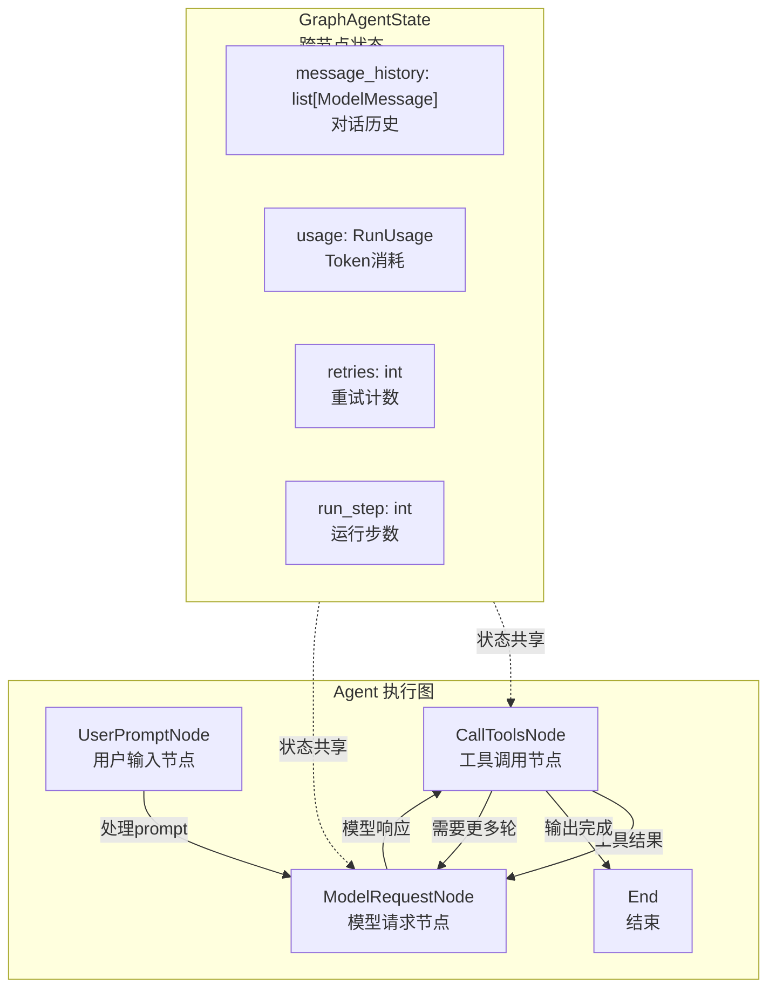

# 【Pydantic AI】类型安全的 AI Agent 框架：Pydantic 式架构设计深度解析

## 引子

FastAPI 给 Python Web 开发带来了革命性的变化——用 Pydantic 的类型校验把所有错误从运行时提前到编写时，让"写了就能跑"成为可能。

然而，当 Pydantic 团队自己在用 LLM 构建应用时，却找不到同样的感觉市面上的 Python Agent 框架，要么是松散的提示词拼接，要么是重型的供应链依赖，没有一个在 DX（开发者体验）上让他们满意。

于是，Pydantic AI 诞生了——**用 Pydantic 的理念做 AI Agent 框架**。

> GitHub: https://github.com/pydantic/pydantic-ai
> Stars: 16,600+ | Python | 2024 年 6 月开源 | 主创：Samuel Colvin（FastAPI 同款创始团队）

本文深入解析 Pydantic AI 的核心架构，带你看它如何用类型系统把 AI Agent 的开发体验提升到"写了就能跑"的级别。

---

## 一、项目定位：解决什么问题

Pydantic AI 旨在解决三个核心痛点：

| 痛点 | 传统方案的问题 | Pydantic AI 的解法 |
|------|--------------|------------------|
| **输出不可控** | Agent 返回自由文本，后续解析容易出错 | 用 Pydantic Model 定义输出结构，LLM 输出自动校验 |
| **依赖注入缺失** | 工具函数里硬编码全局状态，难以测试 | `RunContext` + `deps_type` 真正实现依赖注入 |
| **类型安全断链** | 框架内部用 `Any`，IDE 无法推断 | Agent 泛型参数 `Agent[DepsT, OutputT]`，全程类型推导 |
| **模型强耦合** | 换模型要改大量业务代码 | Provider-agnostic，支持 30+ 模型（OpenAI/Anthropic/Gemini/本地等）|

一句话：**不是又一个"能跑就行"的 Agent 框架，而是一个让 AI Agent 开发也能享受类型安全红利的框架。**

---

## 二、核心架构：Graph 驱动的状态机

Pydantic AI 的架构最独特之处在于：**Agent 的运行逻辑本质上是一个有限状态机图（Graph）**。



### 2.1 四类核心节点

**`UserPromptNode`** — 处理用户输入，构建 ModelRequest
- 合并静态指令、动态系统提示函数、对话历史
- 关键字段：`user_prompt`、`instructions_functions`、`system_prompts`

**`ModelRequestNode`** — 调用 LLM，获取模型响应
- 支持多模型 Provider 统一抽象
- 处理流式/非流式两种响应模式

**`CallToolsNode`** — 工具调度与执行
- 管理 Function Tool 和 Output Tool 两大类
- 包含重试逻辑、错误处理、超时控制

**`End`** — 结束节点，产出 `FinalResult`

### 2.2 状态共享机制

整个 Graph 共享 `GraphAgentState`，其中最重要的是 `message_history`——它贯穿所有节点，实现真正的多轮对话记忆。

```python
@dataclass(kw_only=True)
class GraphAgentState:
    """跨执行步骤的持久化状态"""
    message_history: list[ModelMessage] = field(default_factory=list)
    usage: RunUsage = field(default_factory=RunUsage)
    retries: int = 0
    run_step: int = 0
    run_id: str = field(default_factory=lambda: str(uuid7()))
```

---

## 三、类型系统：Agent 的灵魂

这是 Pydantic AI 最核心的设计理念。

### 3.1 Agent 泛型：`<DepsT, OutputDataT>`

```python
support_agent = Agent[SupportDependencies, SupportOutput](
    'openai:gpt-5.2',
    deps_type=SupportDependencies,   # 依赖类型 — 工具函数的 RunContext 参数类型
    output_type=SupportOutput,        # 输出类型 — 最终结果的 Pydantic Model
)
```

- `Agent[SupportDependencies, SupportOutput]` — IDE 能完整推断这个 Agent 需要什么依赖、返回什么结果
- 如果在工具函数里把 `RunContext[WrongType]` 写错，静态类型检查器直接报错
- 如果 `result.output` 的类型不对，同样被类型检查捕获

### 3.2 RunContext：依赖注入的载体

`RunContext` 是贯穿整个 Agent 运行的上下文对象：

```python
@dataclass
class SupportDependencies:
    customer_id: int
    db: DatabaseConn  # 任何复杂的依赖都可以注入

@support_agent.tool
async def customer_balance(ctx: RunContext[SupportDependencies]) -> str:
    # 运行时通过 ctx.deps 访问注入的依赖
    balance = await ctx.deps.db.customer_balance(id=ctx.deps.customer_id)
    return f'${balance:.2f}'
```

对比 LangChain 的 `RunnableConfig`——那是字典传参，类型全靠猜；Pydantic AI 的 `RunContext` 是强类型的。

### 3.3 Pydantic 输出校验：Agent 输出也受校验

```python
from pydantic import BaseModel, Field

class SupportOutput(BaseModel):
    support_advice: str = Field(description='返回给用户的建议')
    block_card: bool = Field(description='是否需要冻结卡片')
    risk: int = Field(description='风险等级 0-10', ge=0, le=10)
```

LLM 生成的输出如果不符合这个 Schema，Pydantic 会触发 `ValidationError`，框架自动要求模型重试——直到输出通过校验。

---

## 四、工具系统：装饰器即注册

Pydantic AI 的工具注册极其简洁，用装饰器完成所有工作：

```python
@support_agent.tool
async def customer_balance(ctx: RunContext[SupportDependencies]) -> str:
    """Returns the customer's current account balance."""
    balance = await ctx.deps.db.customer_balance(id=ctx.deps.customer_id)
    return f'${balance:.2f}'
```

**三个关键设计：**

1. **Docstring 即工具描述** — Pydantic AI 自动从函数的 docstring 提取描述传递给 LLM
2. **Pydantic 校验工具参数** — 工具的参数由 Pydantic 验证；如果 LLM 传错了参数类型，框架自动让模型重试
3. **内置工具 + 工具集** — MCP 工具、Web Search、Browse 等都通过 `AgentBuiltinTool` 或 `Toolset` 封装

---

## 五、Capabilities：可组合的能力单元

Capabilities 是 Pydantic AI 0.9+ 引入的组合模式，把工具、Hook、指令和模型设置打包成可复用单元：

```python
from pydantic_ai.capabilities import Thinking, WebSearch

agent = Agent(
    'anthropic:claude-sonnet-4-6',
    capabilities=[Thinking(), WebSearch()],
)
```

内置 Capabilities：
- `Thinking` — 让模型输出思维链
- `WebSearch` — provider 自适应的网页搜索
- `Browse` — 浏览器操作
- MCP 集成

这比 LangChain 的"各种预制 Chain"更灵活，因为底层还是 Agent/Tool/Capability 的正交组合。

---

## 六、可观测性：Otel 原生集成

```python
from pydantic_ai import Agent

agent = Agent(
    'openai:gpt-5.2',
    instrument=True,  # 一行开启 OpenTelemetry tracing
)
```

配合 Pydantic Logfire，可以实现：
- 实时 Agent 执行轨迹
- 每个 Tool 调用的耗时/输入/输出
- Token 消耗追踪
- Evals 性能监控

---

## 七、与其他框架的架构对比

| 维度 | **Pydantic AI** | **LangChain** | **CrewAI** | **AutoGen** |
|------|----------------|--------------|-----------|------------|
| **核心理念** | 类型安全 + Pydantic 校验 | 链式组合 + Prompt 模板 | Multi-Agent 团队协作 | 对话式 Agent 协作 |
| **输出校验** | ✅ Pydantic 原生 | ❌ 字符串解析 | ❌ 字符串解析 | ❌ 字符串解析 |
| **依赖注入** | ✅ RunContext 泛型 | ⚠️ Config 字典 | ❌ | ⚠️ Function-based |
| **状态管理** | Graph + message_history | Memory 接口 | Sequential/Hierarchical | Group Chat |
| **Provider 抽象** | ✅ 统一 Model 接口 | ✅ | ⚠️ | ❌ OpenAI-only |
| **工具注册** | 装饰器 | 字符串名称注册 | 装饰器 | 类继承 |
| **多 Agent** | Via A2A 协议 | LangGraph | 内置 Crew | 内置 Group Chat |
| **可观测性** | ✅ OTel 原生 | ⚠️ LangSmith | ❌ | ❌ |

### 关键差异 1：输出校验机制

LangChain 用 `PydanticOutputParser` 等后置解析；Pydantic AI 把 Pydantic 校验嵌入 Agent 循环内部——如果校验失败，模型自动重试，而不是靠后置解析兜底。

### 关键差异 2：Provider 抽象

LangChain 的 Provider 抽象层非常厚，有大量 Provider-specific 的 if/else；Pydantic AI 用 `ModelProfile` 类存储每个模型的能力标志（`supports_prompt_caching` 等），保持 Provider 层的干净分离。

### 关键差异 3：A2A + MCP 双协议

Pydantic AI 同时支持 **MCP（Model Context Protocol）** 和 **A2A（Agent-to-Agent）** 协议，这让它天然可以和其他 Agent 框架的 Agent 互操作——而不像一些封闭框架只能在自己生态内协作。

---

## 八、优缺点总结

```
┌─────────────────┬──────────────────────────────┬──────────────────────────────┐
│                 │  架构简洁性 / 扩展性 / 易用性  │       性能 / 复杂度 / 维护性     │
├─────────────────┼──────────────────────────────┼──────────────────────────────┤
│ ✅ 优势         │ • 类型系统完整，全程 IDE 支持    │ • Graph 架构状态清晰好维护       │
│                 │ • Pydantic 校验内置 Agent 循环  │ • Provider 抽象简洁，不堆 if/else │
│                 │ • 装饰器注册工具，API 极简       │ • OTel 原生，可观测性好         │
│                 │ • Capabilities 组合模式灵活     │                               │
├─────────────────┼──────────────────────────────┼──────────────────────────────┤
│ ⚠️ 注意事项      │ • 相对较新 (2024.6)，生态在成长 │ • 异步为主，同步封装是语法糖      │
│                 │ • Graph 调试需要熟悉状态机概念   │ • 高度依赖 Pydantic 版本兼容     │
│                 │ • 复杂多 Agent 场景建议用 LangGraph│                             │
└─────────────────┴──────────────────────────────┴──────────────────────────────┘
```

---

## 九、快速上手

### 安装

```bash
pip install pydantic-ai
```

### 完整示例：银行客服 Agent

```python
from dataclasses import dataclass
from pydantic import BaseModel, Field
from pydantic_ai import Agent, RunContext

# 1. 定义依赖类型（通过 deps 注入）
@dataclass
class SupportDependencies:
    customer_id: int
    db: "DatabaseConn"   # 模拟数据库连接

# 2. 定义输出结构（Pydantic Model）
class SupportOutput(BaseModel):
    support_advice: str = Field(description='返回给用户的建议')
    block_card: bool = Field(description='是否冻结卡片')
    risk: int = Field(description='风险等级 0-10', ge=0, le=10)

# 3. 创建 Agent
support_agent = Agent(
    'openai:gpt-5.2',
    deps_type=SupportDependencies,
    output_type=SupportOutput,
    instructions='你是银行客服，根据客户问题给出建议并评估风险。',
)

# 4. 注册动态系统提示（依赖注入的数据）
@support_agent.instructions
async def add_customer_name(ctx: RunContext[SupportDependencies]) -> str:
    name = await ctx.deps.db.customer_name(id=ctx.deps.customer_id)
    return f"客户名称：{name!r}"

# 5. 注册工具
@support_agent.tool
async def customer_balance(ctx: RunContext[SupportDependencies]) -> str:
    """查询客户当前账户余额"""
    balance = await ctx.deps.db.customer_balance(id=ctx.deps.customer_id)
    return f'${balance:.2f}'

# 6. 运行
deps = SupportDependencies(customer_id=123, db=DatabaseConn())
result = support_agent.run_sync('我卡丢了！', deps=deps)

# result.output 是 SupportOutput 类型，IDE 自动补全
print(result.output.support_advice)  # ✅ 类型安全
print(result.output.block_card)       # ✅ True
print(result.output.risk)             # ✅ 8
```

### 使用内置 Capabilities

```python
from pydantic_ai import Agent
from pydantic_ai.capabilities import Thinking, WebSearch

agent = Agent(
    'anthropic:claude-sonnet-4-6',
    capabilities=[Thinking(), WebSearch()],
)
result = agent.run_sync('2026年FIFA世界杯冠军是哪支球队？')
print(result.output)
```

---

## 十、趋势与展望

Pydantic AI 的设计哲学代表着 AI Agent 框架的一种重要方向：**从"Prompt Engineering"走向"Type Engineering"**。

随着 LLM 输出可靠性的提升，框架的价值正在从"帮 LLM 思考"转向"帮 LLM 可靠地行动"。在这个转变中：

1. **类型安全** 将成为框架的核心竞争力——Pydantic AI 已经领先
2. **A2A/MCP 双协议** 支持让 Agent 互操作性成为标配
3. **Durable Execution**（持久化执行）让长时运行的 Agent 可靠性达到生产级别
4. **Evals 原生集成** 让 Agent 的质量评估不再是马后炮

如果你用过 FastAPI 感受到过"类型在手，天下我有"的体验，Pydantic AI 正在 AI Agent 领域做同样的事情。

---

**项目链接**: https://github.com/pydantic/pydantic-ai
**官方文档**: https://ai.pydantic.dev/
