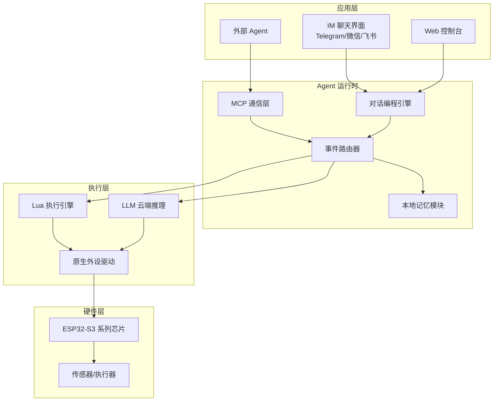
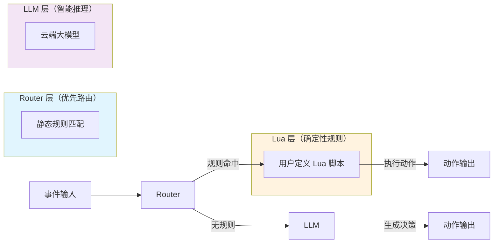
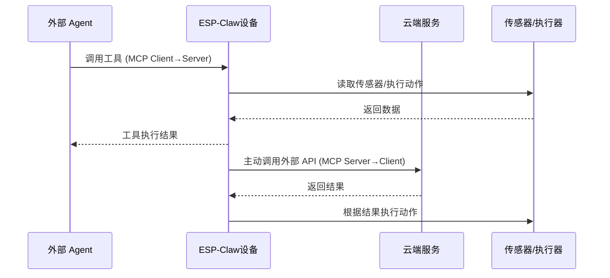
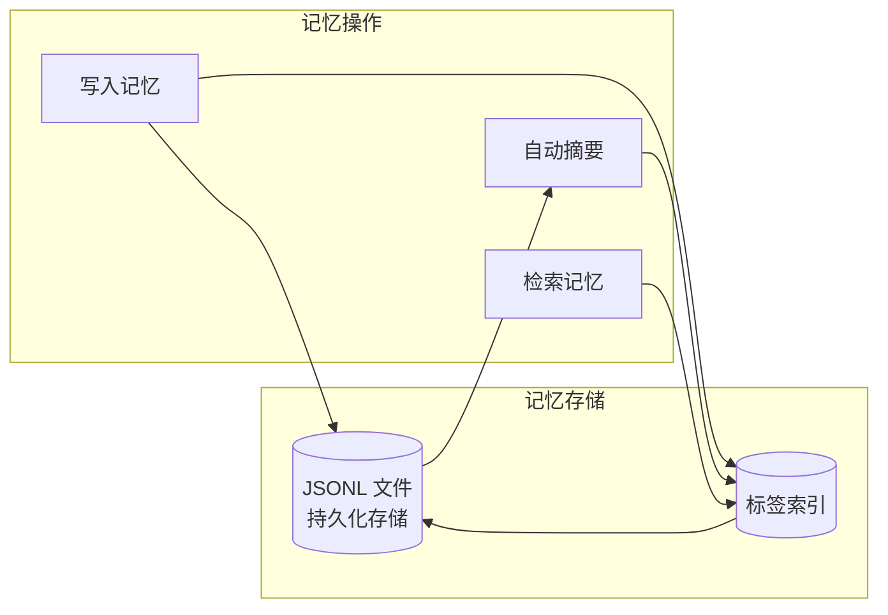
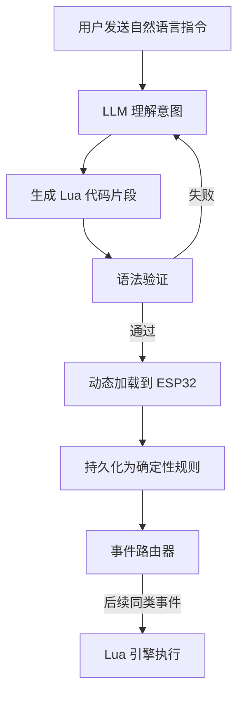
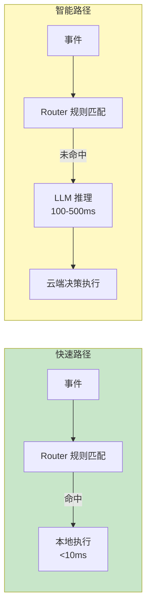

## 引子

当你花几块钱买了一块 ESP32-S3 开发板，除了点灯、跑 MQTT、接传感器，还能做什么？

乐鑫科技（Espressif）给出了一个让人眼前一亮的答案：**ESP-Claw**——一个运行在 ESP32 芯片上的「Chat Coding」AI Agent 框架，让设备不仅能联网，还能**思考、决策、执行**。

传统物联网止步于「连接」——设备能上网、能接收命令，但不会主动思考。ESP-Claw 把 Agent 运行时下沉到边缘芯片，让几美元的硬件具备了与大模型协作的能力。

## 项目简介

ESP-Claw 是乐鑫科技开源的 AI Agent 框架，专为 IoT 设备设计。它通过**对话**定义设备行为，在 ESP32 芯片上本地完成感知→推理→决策→执行的全链路。

核心特点：
- **「对话即编程」**：用 IM 聊天 + 动态 Lua 加载，普通人也能定义设备行为
- **事件驱动**：毫秒级响应，事件触发 Agent 循环
- **双向 MCP**：设备既是被外部 Agent 调用的 MCP Server，也是主动调用外部服务的 MCP Client
- **本地记忆**：结构化长期记忆，隐私留在本地

项目地址：[espressif/esp-claw](https://github.com/espressif/esp-claw)，⭐ 699

## 架构分析

### 整体架构

ESP-Claw 采用分层设计，从上到下依次为：



### 三层事件处理机制

ESP-Claw 的核心决策引擎采用 **LLM + Lua + Router** 三层架构：



| 层级 | 职责 | 适用场景 |
|------|------|----------|
| **Router** | 静态规则快速匹配 | 定时任务、简单条件触发 |
| **Lua** | 用户自定义确定性逻辑 | 复杂但可预测的业务流程 |
| **LLM** | 模糊推理、开放域决策 | 需要理解自然语言的场景 |

### 双向 MCP 架构

ESP-Claw 支持 **MCP（Model Context Protocol）** 双向通信：



这意味着 ESP-Claw 设备既可以被 Claude、OpenAI 等外部 Agent 调用，也可以主动调用外部服务。

### 本地记忆模块

ESP-Claw 的记忆系统采用 **JSONL + 标签摘要** 的轻量级方案：



关键设计：
- **隐私优先**：所有记忆存在本地，不上传云端
- **轻量索引**：基于标签的检索，无需向量数据库
- **自动摘要**：防止记忆文件无限膨胀

## 核心机制详解

### Chat Coding 工作流

用户通过 IM 聊天定义设备行为，ESP-Claw 动态加载 Lua 脚本执行：



### 事件驱动与毫秒响应

传统物联网依赖云端决策，网络延迟往往在 100ms 以上。ESP-Claw 的事件驱动架构实现了**本地毫秒级响应**：

- **事件来源**：传感器数据、定时器、外部 API 回调、IM 消息
- **响应路径**：事件 → Router 规则匹配 → 就近执行
- **降级策略**：规则未命中时才调用 LLM



## 对比分析

### ESP-Claw vs 传统物联网

| 维度 | 传统物联网（云端中心化） | ESP-Claw（边缘 AI） |
|------|-------------------------|---------------------|
| **处理逻辑** | 预设静态规则（IFTTT） | LLM 动态决策 + Lua 确定性规则 |
| **执行引擎** | 规则引擎 | LLM + Lua + Router 三层架构 |
| **控制中心** | 云端服务器 | 边缘节点（ESP 芯片） |
| **设备协议** | MQTT / Matter / 私有 SDK | MCP 统一语言 + 多协议桥接 |
| **记忆管理** | 云端数据存储 | 本地结构化记忆（JSONL + 标签） |
| **交互模式** | App / 控制面板 | IM 聊天（Telegram/微信/飞书） |
| **智能化程度** | 预设自动化 | LLM + 本地规则（持续演进） |

### ESP-Claw vs 其他边缘 Agent 框架

| 框架 | 硬件要求 | 本地推理 | MCP 支持 | 编程方式 |
|------|----------|----------|----------|----------|
| **ESP-Claw** | ESP32-S3 (~$5) | ❌ 依赖云端 LLM | ✅ 双向 | 对话 + Lua |
| **Hub180** | 树莓派/网关 | ⚠️ 部分支持 | ❌ | 配置文件 |
| **AWS IoT Greengrass** | ARM 网关 (~$50+) | ✅ 本地 Lambda | ❌ | 云端定义 |

ESP-Claw 的核心优势在于**极低的硬件成本**和**对话式编程**的易用性，但受限于 ESP32 的算力，本地推理仍需依赖云端 LLM。

## 使用指南

### 快速开始：在线烧录

ESP-Claw 支持浏览器在线烧录，无需搭建开发环境：

1. 访问 [esp-claw.com/en/flash/](https://esp-claw.com/en/flash/)
2. 选择开发板（ESP32-S3 系列支持 Breadboard、M5Stack CoreS3 等）
3. 连接设备，一键烧录最新固件
4. 配置 WiFi 和 LLM Provider（Telegram/微信/飞书）

### 本地构建

```bash
# 克隆仓库
git clone https://github.com/espressif/esp-claw.git
cd esp-claw

# 安装 ESP-IDF（乐鑫官方 SDK）
./install.sh

# 配置项目
idf.py set-target esp32s3
idf.py menuconfig

# 编译烧录
idf.py build flash monitor
```

### 第一个 Agent 程序

通过飞书向设备发送：

```
当温度大于30度时，打开风扇，并回复我"已开启风扇"
```

ESP-Claw 会：
1. 调用 LLM 理解意图
2. 生成 Lua 脚本
3. 加载到事件路由器
4. 后续温度事件自动触发执行

## 趋势与思考

### 边缘 Agent 的演进方向

ESP-Claw 代表了**边缘智能**的一个有趣方向：

1. **成本革命**：用 $5 硬件实现过去需要 $50+ 网关的能力
2. **交互革命**：从配置文件到自然语言，降低了 IoT 开发门槛
3. **隐私革命**：记忆本地化，敏感数据不经过云端

### 现存挑战

- **算力瓶颈**：ESP32 无法跑本地 LLM，仍依赖云端
- **实时性**：需要 LLM 决策的场景仍有网络延迟
- **生态成熟度**：刚开源不久，周边生态（如可视化调试工具）有待完善

### 展望

随着芯片算力提升（如 ESP32-P4 支持更多 AI 加速特性），未来 ESP-Claw 有望实现**真正的本地 LLM 推理**，届时边缘 Agent 将迎来更大爆发。

---

**相关链接**：
- 项目主页：https://esp-claw.com/
- GitHub：https://github.com/espressif/esp-claw
- 在线文档：https://esp-claw.com/en/tutorial/
