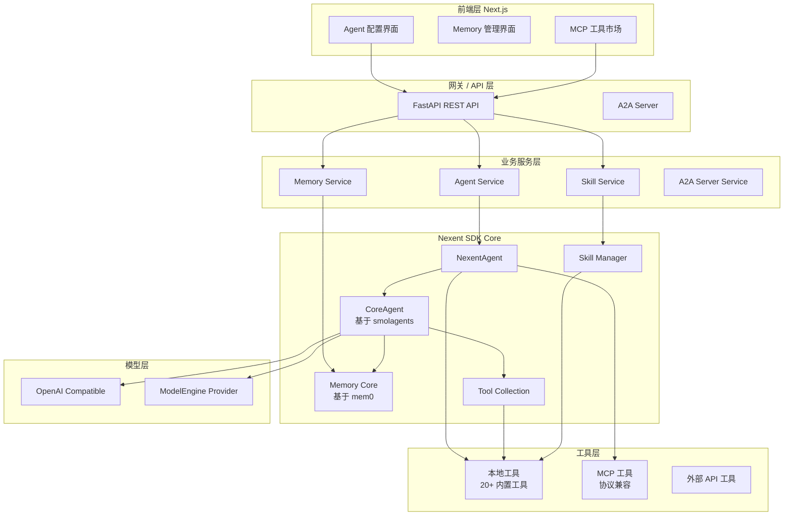
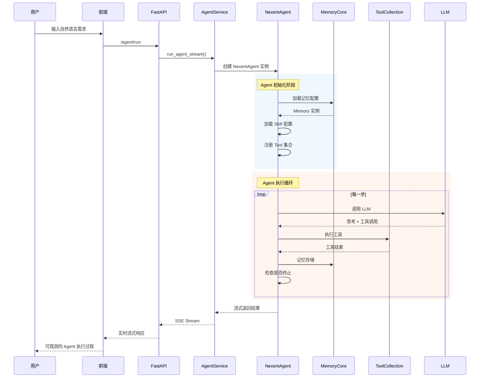
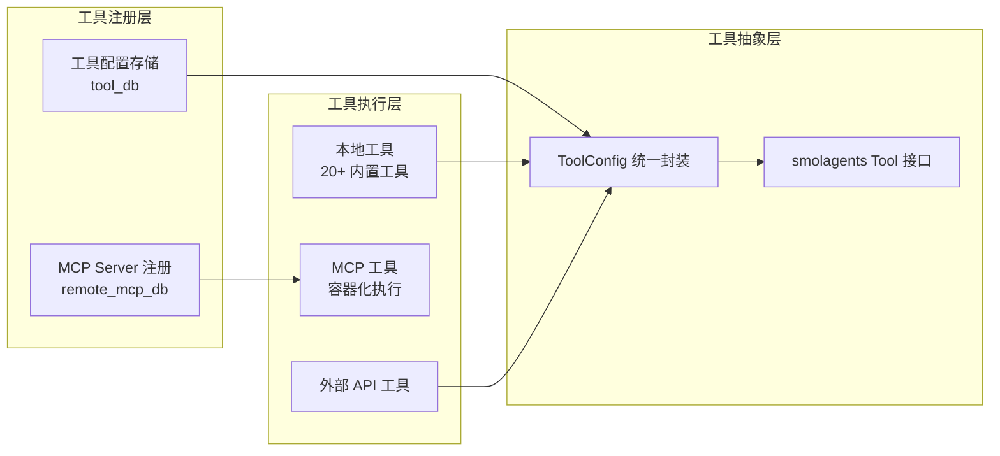

# 【Nexent】基于 Harness Engineering 的零代码 AI Agent 生成平台深度解析

## 一、引言

在 AI Agent 赛道持续火热的今天，构建一个生产级别的 Agent 应用仍然是一个复杂工程——需要选型框架、编写编排逻辑、处理记忆存储、管理工具生态、上线部署……每一个环节都可能成为开发者的拦路虎。

今天要深度分析的项目 **Nexent**，提出了一个独特的技术理念：**Harness Engineering（挽具工程学）**。它借鉴工程学中"挽具"（Harness）的思想——通过标准化的约束框架，将混乱的力量（LLM）引导为可控、可预测的动力输出，从而实现"零代码"生成生产级 AI Agent。

项目链接：[https://github.com/ModelEngine-Group/nexent](https://github.com/ModelEngine-Group/nexent)

---

## 二、项目定位与解决的问题

### 2.1 核心问题

当前 Agent 开发面临三大困境：

1. **碎片化**：工具、记忆、模型、编排各自独立，整合成本高
2. **重复造轮子**：每个团队都在做相似的基础设施工作
3. **上线困难**：从 Demo 到生产级应用，鸿沟巨大

### 2.2 Nexent 的价值主张

Nexent 的核心思路是：**用"约束"代替"编排"，用"语言"代替"代码"**。

> One prompt. Endless reach.
> 一个提示词，无限种可能。

它将整个 Agent 开发流程抽象为：
- **Prompt 生成**：自然语言 → 可执行 Agent 提示词
- **统一工具层**：MCP 协议兼容的工具生态
- **分层记忆**：Tenant/User/Agent/User-Agent 四级记忆隔离
- **A2A 协议**：多 Agent 间的标准化通信

---

## 三、整体架构

### 3.1 分层架构图



### 3.2 数据流



---

## 四、核心模块深度分析

### 4.1 Agent 执行引擎：基于 smolagents

Nexent 的 Agent 核心引擎**并非从零构建**，而是基于 HuggingFace 的 **smolagents** 进行封装。这种"站在巨人肩膀上"的策略值得学习——smolagents 本身就是一个设计精良的轻量级 Agent 框架，Nexent 在其基础上添加了企业级能力。

#### 4.1.1 代码执行机制

smolagents 的核心创新是 **`<code>` 标签机制**——LLM 输出用 `<code>...</code>` 包裹的 Python 代码，框架自动提取并执行：

```python
# Nexent SDK: sdk/nexent/core/agents/core_agent.py
def parse_code_blobs(text: str) -> str:
    """从 LLM 输出中提取可执行的代码块"""
    # 优先匹配 <code>...</code> 格式
    code_matches = []
    search_pos = 0
    while True:
        start = text.find("<code>", search_pos)
        if start == -1:
            break
        content_start = start + len("<code>")
        end = text.find("</code>", content_start)
        if end == -1:
            break
        code_matches.append(text[content_start:end])
        search_pos = end + len("</code>")

    if code_matches:
        return "\n\n".join(match.strip() for match in code_matches)

    # 降级兼容 <RUN> 标签格式
    run_matches = []
    search_pos = 0
    run_tag = "```<RUN>"
    while True:
        start = text.find(run_tag, search_pos)
        if start == -1:
            break
        content_start = start + len(run_tag)
        end = text.find("```", content_start)
        if end == -1:
            break
        run_matches.append(text[content_start:end])
        search_pos = end + len("```")

    if run_matches:
        return "\n\n".join(match.strip() for match in run_matches)

    # 最后降级到标准 python 代码块
    # ...
```

这种设计的好处是：
- **安全**：代码在沙箱中执行，不会污染主进程
- **可观测**：每一步执行都有清晰的输出
- **可控**：框架控制最大步数（`max_steps`），防止无限循环

#### 4.1.2 NexentAgent 封装

```python
# sdk/nexent/core/agents/nexent_agent.py
class NexentAgent:
    def __init__(self, observer: MessageObserver,
                 model_config_list: List[ModelConfig],
                 stop_event: Event,
                 mcp_tool_collection=None):
        self.observer = observer
        self.model_config_list = model_config_list
        self.stop_event = stop_event
        self.mcp_tool_collection = mcp_tool_collection
        self.agent = None

    def create_model(self, model_cite_name: str):
        """根据别名创建模型实例"""
        model_config = next(
            (mc for mc in self.model_config_list
             if mc is not None and mc.cite_name == model_cite_name),
            None
        )
        if model_config is None:
            raise ValueError(f"Model {model_cite_name} not found")

        model = OpenAIModel(
            observer=self.observer,
            model_id=model_config.model_name,
            api_key=model_config.api_key,
            api_base=model_config.url,
            temperature=model_config.temperature,
            top_p=model_config.top_p,
            ssl_verify=model_config.ssl_verify or True,
            model_factory=model_config.model_factory
        )
        model.stop_event = self.stop_event
        return model

    def create_local_tool(self, tool_config: ToolConfig):
        """从 ToolConfig 创建本地工具实例"""
        class_name = tool_config.class_name
        params = tool_config.params
        tool_class = globals().get(class_name)
        if tool_class is None:
            raise ValueError(f"{class_name} not found in local")
        # 实例化工具类...
```

关键设计：**工具通过字符串类名动态实例化**，这是零代码平台的核心——配置驱动，而非硬编码。

### 4.2 记忆系统：基于 mem0 的四级架构

Nexent 的记忆系统是它区别于其他 Agent 平台的重要特色。它基于 **mem0** 构建，提供**四级记忆隔离**：

```python
# sdk/nexent/memory/memory_core.py
"""
SDK-level wrapper around mem0 Memory that keeps an in-process cache.
"""
from mem0.memory.main import AsyncMemory
from .embedder_adaptor import EmbedderAdaptor

_MEMORY_CACHE: dict[str, AsyncMemory] = {}
_CACHE_LOCKS: dict[int, asyncio.Lock] = {}

async def get_memory_instance(memory_config: Dict[str, Any]) -> AsyncMemory:
    """返回（并缓存）一个 mem0 Memory 实例"""
    _validate_config(memory_config)
    cache_key = _hash_config(memory_config)

    async with _get_cache_lock():
        if cache_key in _MEMORY_CACHE:
            logger.debug("Memory cache hit.")
            return _MEMORY_CACHE[cache_key]

        memory_obj = await AsyncMemory.from_config(memory_config)
        memory_obj.embedding_model = EmbedderAdaptor(memory_config["embedder"]["config"])
        _MEMORY_CACHE[cache_key] = memory_obj
        return memory_obj
```

#### 4.2.1 四级记忆隔离

```python
# sdk/nexent/memory/memory_service.py
def _filter_by_memory_level(memory_level: str, raw_results: List[Dict]) -> List[Dict]:
    """按记忆级别过滤结果"""
    if memory_level in {"tenant", "user"}:
        # 租户级或用户级：无 agent_id
        return [r for r in raw_results if not r.get("agent_id")]
    elif memory_level in {"agent", "user_agent"}:
        # Agent 级或用户+Agent 级：有 agent_id
        return [r for r in raw_results if r.get("agent_id")]
```

| 记忆级别 | 说明 | 典型场景 |
|---------|------|---------|
| `tenant` | 租户共享知识 | 公司规章制度、产品文档 |
| `user` | 用户私有知识 | 个人笔记、偏好设置 |
| `agent` | Agent 专用知识 | Agent 的专业技能 |
| `user_agent` | 用户+Agent 组合 | 用户的 Agent 个性化配置 |

这种设计的精妙之处在于：**通过不同粒度的记忆隔离，实现"知识即服务"的多租户架构**。

#### 4.2.2 记忆的写入与检索

```python
async def add_memory(
    messages: List[Dict] | str,
    memory_level: str,
    memory_config: Dict,
    tenant_id: str,
    user_id: str,
    agent_id: Optional[str] = None,
    infer: bool = True  # 自动推断重要信息
) -> Any:
    """添加记忆"""
    mem_user_id = build_memory_identifiers(
        memory_level=memory_level,
        user_id=user_id,
        tenant_id=tenant_id
    )
    memory = await get_memory_instance(memory_config)

    if memory_level in {"tenant", "user"}:
        return await memory.add(messages, user_id=mem_user_id, infer=infer)
    elif memory_level in {"agent", "user_agent"}:
        return await memory.add(messages, agent_id=agent_id, user_id=mem_user_id, infer=infer)
```

`infer=True` 时，mem0 会自动从消息中提取关键信息并结构化存储，而不仅仅是原始文本存储。

### 4.3 工具系统：MCP 协议兼容

Nexent 的工具系统分为三层：



#### 4.3.1 内置工具集

Nexent SDK 内置了 **20+ 工具**，覆盖文件操作、搜索、邮件、多模态等场景：

```python
# sdk/nexent/core/tools/__init__.py
__all__ = [
    # 搜索类
    "ExaSearchTool",
    "KnowledgeBaseSearchTool",
    "DifySearchTool",
    "DataMateSearchTool",
    "IdataSearchTool",
    "TavilySearchTool",
    "LinkupSearchTool",
    # 文件操作类
    "CreateFileTool",
    "ReadFileTool",
    "DeleteFileTool",
    "CreateDirectoryTool",
    "DeleteDirectoryTool",
    "MoveItemTool",
    "ListDirectoryTool",
    # 通信类
    "SendEmailTool",
    "GetEmailTool",
    # 执行类
    "TerminalTool",
    # 分析类
    "AnalyzeTextFileTool",
    "AnalyzeImageTool",
    # 技能类
    "run_skill_script",
    "read_skill_md",
    "read_skill_config"
]
```

#### 4.3.2 MCP 工具集成

MCP（Model Context Protocol）是 Anthropic 提出的工具标准化协议。Nexent 的 MCP 集成架构：

```python
# backend/tool_collection/mcp/local_mcp_service.py
# MCP 容器化执行
# 每个 MCP Server 运行在独立容器中，隔离安全

# backend/services/remote_mcp_service.py
# MCP Server 注册与管理

# sdk/nexent/core/tools/ 下的工具可以调用 MCP 工具
```

Nexent 支持将 MCP 工具**无缝桥接**到 Agent 的工具集中，这意味着：
- Agent 可以使用任何符合 MCP 规范的第三方工具
- 工具替换不需要修改核心代码
- 安全隔离：MCP Server 运行在独立容器中

### 4.4 多 Agent 协作：A2A 协议

Nexent 支持通过 **A2A（Agent-to-Agent）协议**实现多 Agent 协作：

```python
# sdk/nexent/core/agents/a2a_agent_proxy.py
@dataclass
class A2AAgentInfo:
    """外部 A2A Agent 配置"""
    agent_id: str
    name: str
    url: str
    api_key: Optional[str] = None
    transport_type: str = "http-streaming"
    protocol_version: str = "1.0"
    protocol_type: str = PROTOCOL_JSONRPC  # JSONRPC | HTTP+JSON | GRPC
    timeout: float = 300.0

class ExternalA2AAgentProxy:
    """调用外部 A2A Agent 的代理类"""
    def get_skills_description(self) -> str:
        """从 Agent Card 中提取能力描述"""
        skills = []
        if self.raw_card:
            skills = self.raw_card.get("skills", [])
        capability_names = [s.get("name", "") for s in skills if s.get("name")]
        return f"External A2A agent: {self.name} [Capabilities: {', '.join(capability_names)}]"
```

A2A 协议的三种传输类型：
- **JSONRPC**：标准 JSON-RPC 2.0
- **HTTP+JSON**：RESTful JSON
- **GRPC**：高性能 gRPC（未来支持）

---

## 五、运行管理与生命周期

### 5.1 AgentRunManager：单例模式的任务管理

```python
# backend/agents/agent_run_manager.py
class AgentRunManager:
    _instance = None
    _lock = threading.Lock()

    def __new__(cls):
        if cls._instance is None:
            with cls._lock:
                if cls._instance is None:
                    cls._instance = super().__new__(cls)
        return cls._instance

    def register_agent_run(self, conversation_id: int, agent_run_info, user_id: str):
        """注册 Agent 运行实例"""
        run_key = self._get_run_key(conversation_id, user_id)
        self.agent_runs[run_key] = agent_run_info

    def stop_agent_run(self, conversation_id: int, user_id: str) -> bool:
        """停止指定 Agent 运行"""
        agent_run_info = self.get_agent_run_info(conversation_id, user_id)
        if agent_run_info is not None:
            agent_run_info.stop_event.set()
            return True
        return False
```

关键设计：**单例模式 + 线程安全**的运行管理器，确保同一 conversation_id 在同一时刻只有一个活跃 Agent 实例。

### 5.2 版本管理

Nexent 提供了完整的 Agent 版本管理：

- **草稿版本（version_no=0）**：开发中，可随时修改
- **已发布版本**：不可修改，用于生产
- **版本对比**：Compare API 可以对比两个版本的差异
- **版本回滚**：将当前版本指针指向历史版本（不创建新版本）

---

## 六、优缺点分析

### 6.1 优点

| 维度 | 说明 |
|------|------|
| **架构简洁性** | 基于 smolagents 封装，避免重复造轮子；SDK 与后端解耦，可独立使用 |
| **扩展性** | MCP 协议兼容，工具生态丰富；A2A 协议支持多 Agent 协作 |
| **易用性** | 零代码 Web UI，自然语言即可生成 Agent；Docker 一键部署 |
| **多租户** | 四级记忆隔离，Tenant/User/Agent/User-Agent 粒度分明 |
| **可观测性** | 内置 MessageObserver，每个步骤均可观测 |

### 6.2 缺点与挑战

| 维度 | 说明 |
|------|------|
| **性能** | smolagents 的代码执行机制在高并发场景下可能有瓶颈 |
| **复杂度** | 多层抽象（SDK→smolagents→mem0→向量库）导致调试困难 |
| **维护性** | 依赖外部库版本（mem0、smolagents），这些库本身迭代频繁 |
| **学习曲线** | Harness Engineering 概念较新，需要理解其设计哲学 |
| **生产验证** | Star 4,361（截至 2026-04），生产案例相对较少 |

---

## 七、横向对比

| 维度 | Nexent | LangChain | CrewAI | AutoGen |
|------|--------|-----------|--------|---------|
| **核心定位** | 零代码 Agent 生成平台 | Agent 编排框架 | 多 Agent 角色扮演 | 多 Agent 对话框架 |
| **记忆方案** | mem0（四级隔离） | 内存/向量存储 | 短时 + 自定义 | 会话历史 |
| **工具协议** | MCP 兼容 + 内置 20+ | LangChain Tools | 自定义 Tools | 自定义 Tools |
| **多 Agent** | A2A 协议 | 链式调用 | Agent 团队协作 | Agent 间对话 |
| **代码执行** | smolagents 引擎 | Python 解释器 | Python REPL | 代码执行 |
| **部署方式** | Docker Compose | 任意 | 任意 | 任意 |
| **上手门槛** | 低（零代码 UI） | 高（需要编码） | 中（YAML 配置） | 中（需要编码） |

### 设计差异重点

1. **Nexent vs LangChain**：
   - LangChain 是"框架式"，Nexent 是"平台式"
   - Nexent 通过零代码 UI 降低门槛，LangChain 需要编码
   - LangChain 的抽象更细粒度，定制能力更强

2. **Nexent vs CrewAI**：
   - CrewAI 强调"角色扮演"，Nexent 强调"任务完成"
   - CrewAI 的 Agent 协作是预设的团队结构，Nexent 是动态的 A2A 协议
   - Nexent 的四级记忆隔离比 CrewAI 的记忆方案更系统化

3. **Harness Engineering 理念**：
   - 核心思想是"约束即自由"——通过标准化约束，让 LLM 的输出更可控
   - 对比 LangChain 的"everything is configurable"，Nexent 更强调"opinionated defaults"

---

## 八、快速上手

### 8.1 Docker Compose 部署

```bash
git clone https://github.com/ModelEngine-Group/nexent.git
cd nexent/docker
cp .env.example .env  # 填写必要的配置
bash deploy.sh
```

访问 `http://localhost:3000` 即可使用 Web UI。

### 8.2 SDK 独立使用

```python
# 安装
pip install nexent

# 使用 Nexent SDK
from nexent.core.agents.nexent_agent import NexentAgent
from nexent.core.models.openai_llm import OpenAIModel
from nexent.core.utils.observer import MessageObserver, ProcessType
from nexent.memory.memory_core import get_memory_instance
from threading import Event

# 1. 创建 Observer
observer = MessageObserver()

# 2. 配置模型
model_configs = [...]
stop_event = Event()

# 3. 创建 Agent
agent_factory = NexentAgent(
    observer=observer,
    model_config_list=model_configs,
    stop_event=stop_event
)

# 4. 执行任务
model = agent_factory.create_model("gpt-4")
# ... 配置工具、记忆后开始执行
```

---

## 九、总结与趋势

### 9.1 核心价值

Nexent 的最大创新在于**将"Harness Engineering"理念落地**——不是让开发者编写编排逻辑，而是通过"提示词 + 工具配置 + 记忆配置"的组合，让 LLM 自动生成可控的 Agent 行为。

这种设计对于**企业级场景**特别有价值：
- 多租户隔离保证数据安全
- 零代码降低使用门槛
- 版本管理保证可回滚

### 9.2 未来趋势

1. **v2.0 即将发布**：从 GitHub commit 记录看，v2.0 正在开发中
2. **Harness Engineering 标准化**：如果这一理念被广泛接受，可能会形成新的 Agent 设计范式
3. **多 Agent 协作深化**：A2A 协议的完善将支持更复杂的多 Agent 工作流

### 9.3 适用场景

✅ **推荐使用**：
- 企业内部 AI Agent 平台搭建
- 需要多租户隔离的 SaaS 服务
- 非技术用户构建 AI 应用

⚠️ **谨慎考虑**：
- 需要高度定制化的复杂 Agent 逻辑
- 对性能有极端要求的场景
- 需要深度调试 Agent 行为的研发团队

---

## 参考链接

- GitHub: [https://github.com/ModelEngine-Group/nexent](https://github.com/ModelEngine-Group/nexent)
- 官网: [https://nexent.tech](https://nexent.tech)
- 文档: [https://modelengine-group.github.io/nexent](https://modelengine-group.github.io/nexent)
- Discord: [https://discord.gg/tb5H3S3wyv](https://discord.gg/tb5H3S3wyv)
