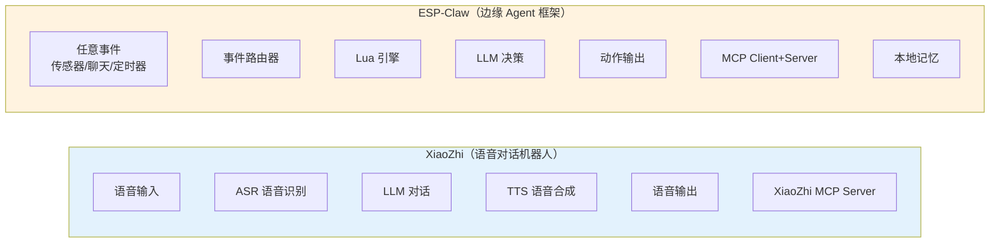
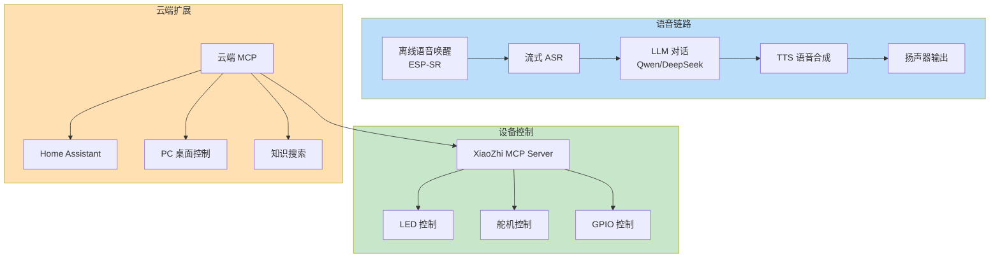
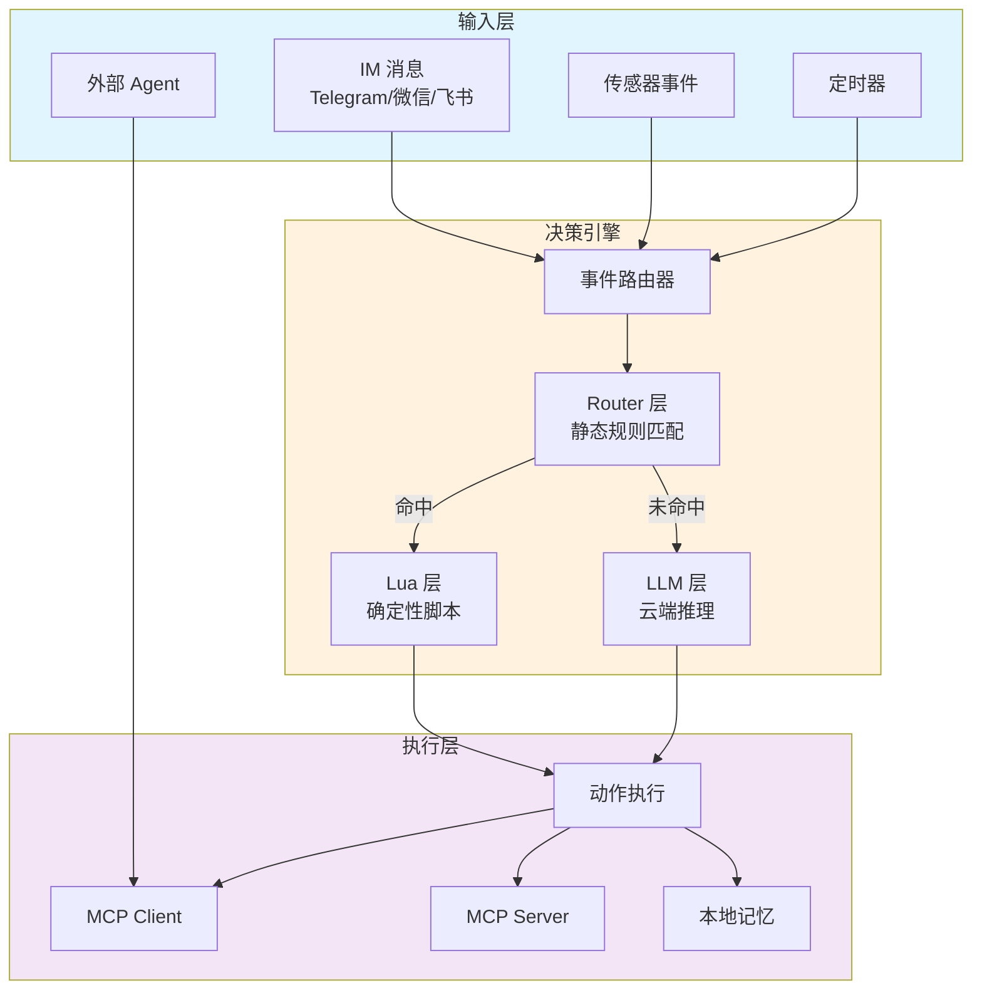
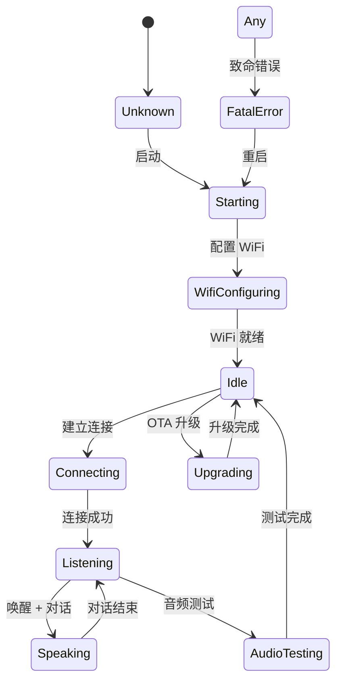
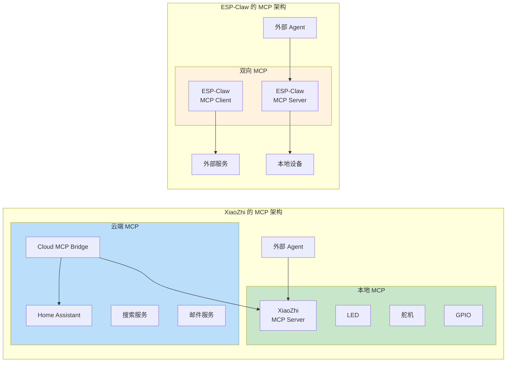
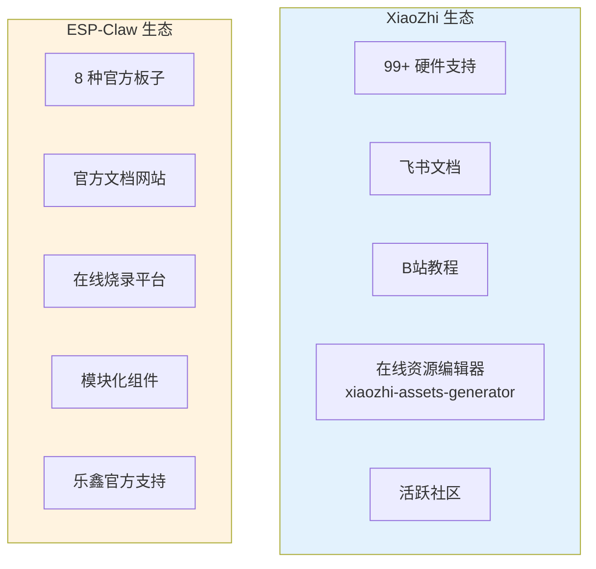

## 引子

在 ESP32 平台上跑 AI Agent，乐鑫生态里有两个明星项目常被拿来对比：

- **XiaoZhi（晓之）**：专注于**语音对话**的 MCP 聊天机器人，GitHub ⭐ 26,000+
- **ESP-Claw**：乐鑫官方的**「对话编程」AI Agent 框架**，定位更通用，⭐ 700+

这两个项目都基于 ESP32-S3/P4，都支持 MCP，都是 Agent 运行时，但设计哲学和目标场景截然不同。本文从架构、机制、扩展性等维度深度对比。

## 项目概览

| 维度 | **XiaoZhi** | **ESP-Claw** |
|------|-------------|--------------|
| **GitHub** | [78/xiaozhi-esp32](https://github.com/78/xiaozhi-esp32) | [espressif/esp-claw](https://github.com/espressif/esp-claw) |
| **Stars** | ⭐ 26,046 | ⭐ 713 |
| **Fork** | 5,669 | 149 |
| **主语言** | C++ | C |
| **License** | MIT | Apache 2.0 |
| **创建时间** | 2024-08 | 2026-04 |
| **支持芯片** | ESP32-C3/S3/P4 | ESP32-S3/P4 |
| **支持开发板** | 99+ | 8 |

> **数据截至 2026-04-29**

XiaoZhi 早在 2024 年就发布了，拥有庞大的社区基础和大量实测案例。ESP-Claw 是乐鑫官方的全新框架，2026 年 4 月刚发布，正处于快速发展期。

## 核心定位对比



| 维度 | **XiaoZhi** | **ESP-Claw** |
|------|-------------|--------------|
| **核心场景** | 语音对话、语音助手 | 对话编程、边缘自动化 |
| **输入模式** | 语音（离线唤醒 + 流式 ASR） | 文本/事件（IM 聊天、传感器） |
| **输出模式** | 语音（TTS）为主 | 动作/文本为主 |
| **决策方式** | LLM 流式对话 | LLM + Lua + Router 三层 |
| **记忆系统** | 无持久记忆 | 结构化本地记忆（JSONL+标签） |

## 架构对比

### XiaoZhi：语音优先的管道式架构



**关键设计**：
- **流式语音交互**：麦克风 → ESP-SR 离线唤醒 → 流式 ASR → LLM → TTS → 扬声器，全链路流式
- **声纹识别**：识别当前说话人（基于 3D Speaker）
- **MCP 双向通信**：XiaoZhi 作为 MCP Server 被外部调用，同时通过 Cloud MCP 桥接扩展 LLM 能力
- **多协议支持**：WebSocket 和 MQTT+UDP 两种通信协议

### ESP-Claw：事件驱动的三层决策架构



**关键设计**：
- **三层决策**：Router（快速规则）→ Lua（确定性脚本）→ LLM（智能推理），按需降级
- **对话编程**：通过 IM 聊天动态生成 Lua 脚本，普通人也能定义设备行为
- **双向 MCP**：既可被外部 Agent 调用（MCP Server），也可主动调用外部服务（MCP Client）
- **本地记忆**：JSONL + 标签摘要，隐私留本地

## 状态机对比

### XiaoZhi 设备状态机



XiaoZhi 的状态机围绕**语音对话流程**设计，状态清晰：Idle → Listening → Speaking 构成核心对话环。

### ESP-Claw 事件处理模型

ESP-Claw 没有显式的状态机概念，而是采用**事件驱动模型**：

```text
事件输入 → Router 规则匹配 → [Lua 脚本] / [LLM 推理] → 动作执行
```

| 事件类型 | 处理路径 | 响应时间 |
|----------|----------|----------|
| 定时器事件 | Router 直接路由 | < 5ms |
| 传感器阈值触发 | Lua 脚本执行 | < 10ms |
| IM 聊天消息 | LLM 理解 + Lua/Router | 100-500ms |
| 外部 Agent 调用 | MCP → Router/Lua | < 20ms |

## MCP 协议应用对比

两者都深度使用 MCP，但定位不同：



| 维度 | **XiaoZhi** | **ESP-Claw** |
|------|-------------|--------------|
| **MCP 角色** | 主要做 MCP Server | 同时做 MCP Server 和 Client |
| **设备控制** | ✅ LED/舵机/GPIO 等 | ✅ 通用设备控制 |
| **外部调用** | 通过 Cloud MCP 桥接 | 原生支持双向调用 |
| **协议选择** | MQTT+UDP / WebSocket | MCP 统一协议 |

## 开发体验对比

### XiaoZhi：开箱即用的语音助手

```bash
# 1. 克隆仓库
git clone https://github.com/78/xiaozhi-esp32.git
cd xiaozhi-esp32

# 2. 配置 ESP-IDF
idf.py set-target esp32s3
idf.py menuconfig

# 3. 配置云端 LLM（需要自己准备 API Key）
# 设置 Qwen/DeeSeek API Key

# 4. 编译烧录
idf.py build flash monitor
```

**特点**：
- 固件功能完整，配置好 API Key 就能用
- 支持 99+ 开发板，社区案例丰富
- 有配套的飞书文档和 B站教程

### ESP-Claw：对话式编程的创新体验

```bash
# 1. 克隆仓库
git clone https://github.com/espressif/esp-claw.git
cd esp-claw

# 2. 安装 ESP-IDF
./install.sh

# 3. 配置
idf.py set-target esp32s3
idf.py menuconfig

# 4. 在线烧录（浏览器一键搞定）
# 访问 https://esp-claw.com/en/flash/
```

**特点**：
- 支持浏览器在线烧录，无需搭建环境
- 通过 IM 聊天配置设备行为，无需编程
- 动态 Lua 脚本加载，灵活扩展

### 编程范式对比

| 维度 | **XiaoZhi** | **ESP-Claw** |
|------|-------------|--------------|
| **定义行为** | 配置文件 + 云端 LLM | IM 对话生成 Lua 脚本 |
| **执行模式** | 规则驱动 | Router/Lua/LLM 三层 |
| **扩展方式** | 修改源码 | 动态加载 Lua 模块 |
| **学习门槛** | 需要编译固件 | 对话即可编程 |

## 生态对比



| 生态维度 | **XiaoZhi** | **ESP-Claw** |
|----------|-------------|--------------|
| **社区规模** | 26K stars，成熟社区 | 700+ stars，刚起步 |
| **硬件支持** | 99+ 开源硬件 | 8 种官方板子 |
| **文档完善度** | 飞书 + B站视频 | 官方网站 + GitHub |
| **企业支持** | 社区维护 | 乐鑫官方维护 |
| **在线工具** | 资源编辑器 | 在线烧录平台 |

## 优缺点分析

### XiaoZhi

| 优点 | 缺点 |
|------|------|
| ⭐ 社区成熟，案例丰富 | 主要是语音场景，通用性受限 |
| 99+ 开发板支持 | 行为定义依赖配置文件 |
| 离线语音唤醒能力 | 无本地记忆系统 |
| 云端 MCP 扩展丰富 | 需要编译环境，入门门槛较高 |
| B站视频教程 |  |

### ESP-Claw

| 优点 | 缺点 |
|------|------|
| 🤖 对话编程，零基础可用 | 刚发布，生态不成熟 |
| 三层决策架构，灵活高效 | 目前只支持 8 种开发板 |
| 双向 MCP，可调用外部 Agent | 依赖云端 LLM，无本地推理 |
| 本地记忆，隐私安全 | 不支持语音交互 |
| 浏览器在线烧录 |  |
| 乐鑫官方支持 |  |

## 选型建议

| 场景 | 推荐 |
|------|------|
| **想快速做一个语音助手** | ✅ XiaoZhi，开源即用 |
| **想用自然语言控制硬件设备** | ✅ ESP-Claw，对话编程 |
| **需要离线语音唤醒** | ✅ XiaoZhi（ESP-SR） |
| **需要设备被外部 Agent 调用** | ✅ ESP-Claw（双向 MCP） |
| **需要在本地存储记忆** | ✅ ESP-Claw（JSONL+标签） |
| **使用乐鑫官方开发板（BOX/M5Stack）** | 两者都支持 |
| **使用小众/第三方开发板** | ✅ XiaoZhi（支持 99+） |
| **项目需要长期维护** | ✅ XiaoZhi（成熟稳定） |
| **想参与框架核心开发** | ✅ ESP-Claw（乐鑫官方） |

## 未来展望

两个项目都在快速迭代：

- **XiaoZhi v2** 正在开发，分区表不兼容 v1，需要手动刷固件
- **ESP-Claw** 正在从 `basic_demo` 迁移到 `edge_agent` 目录

随着 ESP32-P4 等更强芯片的普及，**本地 LLM 推理**将成为可能，两个框架都有望向端侧智能进化。

---

**相关链接**：
- XiaoZhi GitHub：https://github.com/78/xiaozhi-esp32
- ESP-Claw GitHub：https://github.com/espressif/esp-claw
- ESP-Claw 官网：https://esp-claw.com/
---

## 对比分析

XiaoZhi 与 ESP-Claw 都是基于 ESP32 的本地 AI 语音助手框架，二者定位有重叠但生态策略显著不同。

### 维度对比表

| 维度 | XiaoZhi (78/xiaozhi-esp32) | ESP-Claw (espressif/esp-claw) | OpenAI Realtime + ESP32 |
|------|---------------------------|------------------------------|--------------------------|
| 维护方 | 社区（78） | 乐鑫官方 | OpenAI |
| 硬件支持 | 99+ 第三方开发板 | 乐鑫官方开发板为主 | 通用（依赖网络） |
| 协议/接口 | MCP、WebSocket、离线唤醒 | edge_agent、ESP 工具链 | Realtime API |
| 离线能力 | 较强（关键词唤醒 + 离线命令） | 较强（设计目标） | 弱（依赖云） |
| 框架深度 | 应用层完整、UI/语音管线成熟 | 框架级，提供 Agent SDK | 纯 API 调用 |
| 适合场景 | 快速原型、第三方硬件、生态丰富 | 乐鑫客户商业化、深度定制 | 云端优先、对延迟不敏感 |

### 优缺点

XiaoZhi
- 优点：社区活跃、第三方硬件支持广；MCP/语音管线成熟；适合个人/创客。
- 缺点：维护依赖个人/小团队，长期商业化支持有限；v1/v2 分区表不兼容。

ESP-Claw
- 优点：乐鑫官方维护、与 ESP-IDF 工具链深度集成；商业项目可靠性强。
- 缺点：相对早期、文档仍在完善；第三方开发板覆盖弱于 XiaoZhi。

OpenAI Realtime
- 优点：模型能力最强；接入最简单。
- 缺点：强依赖网络与云服务；隐私/延迟不适合本地场景。

### 何时选

- 选 XiaoZhi：你用第三方开发板、看重生态丰富度与快速原型。
- 选 ESP-Claw：你是乐鑫客户、做商业化产品、需要官方长期支持。
- 选 OpenAI Realtime：网络条件好、对模型能力要求高、不在意数据出云。

### 参考资料

- XiaoZhi GitHub：https://github.com/78/xiaozhi-esp32
- ESP-Claw GitHub：https://github.com/espressif/esp-claw
- ESP-Claw 官网：https://esp-claw.com/
- ESP-IDF：https://docs.espressif.com/projects/esp-idf/