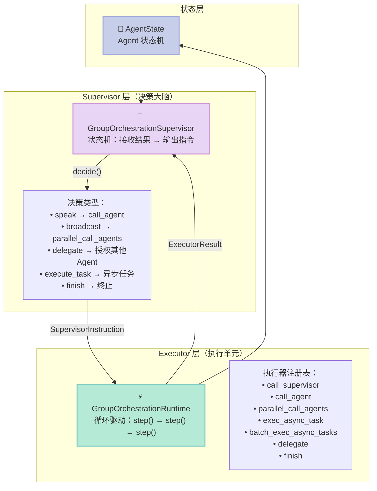
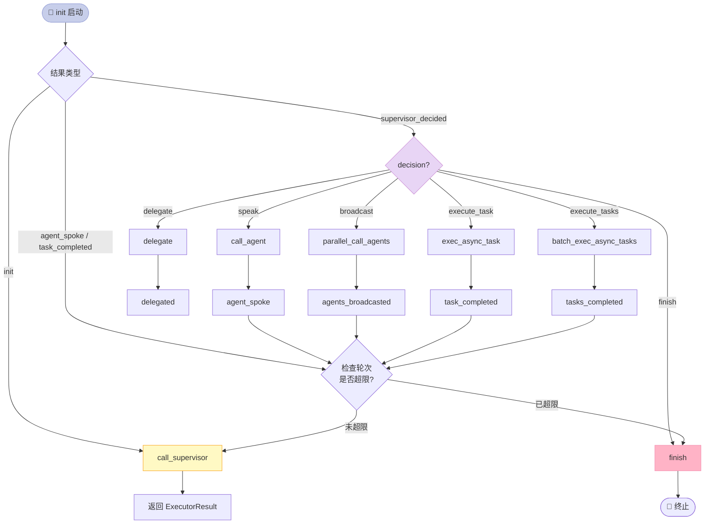
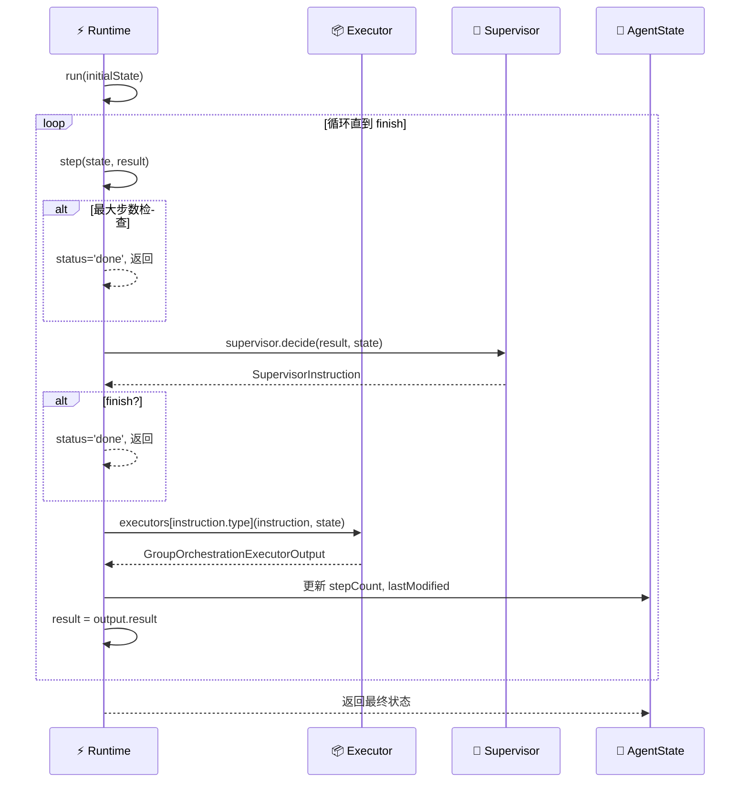
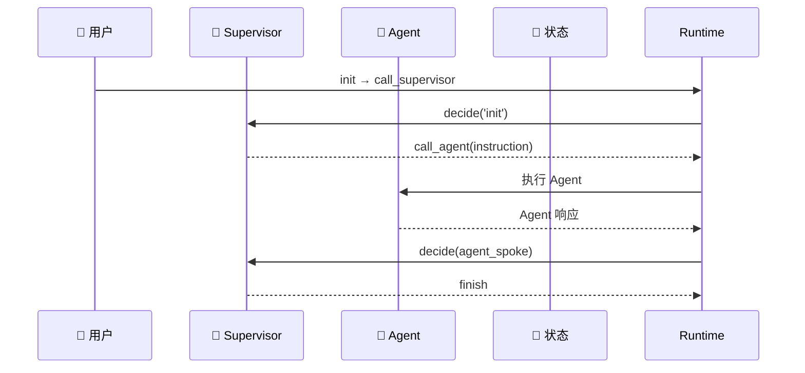
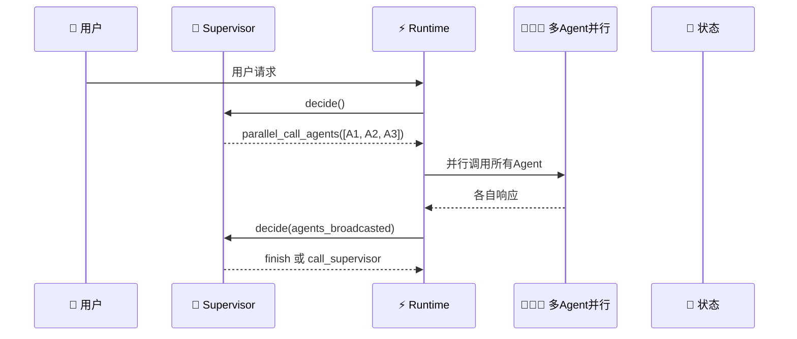
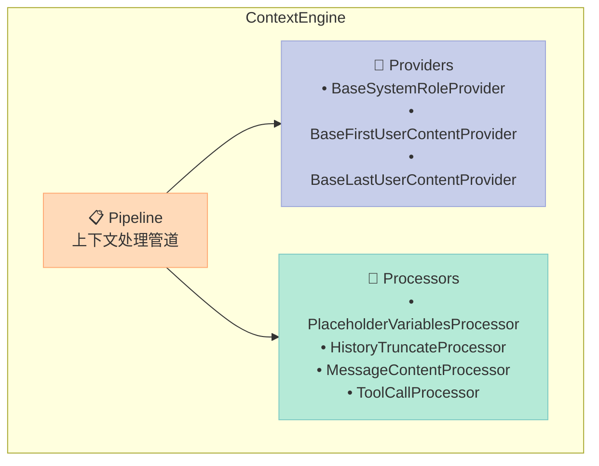
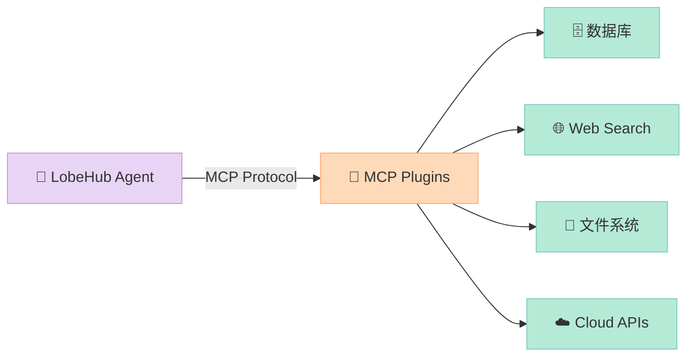

> **核心结论**：LobeHub 提出了一个极简却强大的多智能体协作模型——Supervisor-Executor 双层状态机架构。不同于 CrewAI 的顺序角色链或 AutoGen 的对话总线，LobeHub 通过「监督者决策 + 执行者行动」的循环，将多 Agent 协作收敛为一个可预测、可中断、可追踪的有状态过程。

---

## 一、引言：为什么今天的 Agent 都是「孤岛」？

当下的 AI Agent 有一个共同问题：**孤立、一次性、缺乏真正的协作**。

你让一个 Agent 写代码，它写完就结束；让另一个 Agent 做搜索，它搜完就结束。它们之间没有上下文传递，没有集体决策，更没有「像真实团队那样」围绕一个目标迭代协作。

**LobeHub 的答案是：把 Agent 作为工作的基本单位（Unit of Work），让多个 Agent 像真实同事一样协作。**

---

## 二、项目概览

| 维度 | 信息 |
|------|------|
| **项目名** | LobeHub / lobe-chat |
| **GitHub** | https://github.com/lobehub/lobehub |
| **Stars** | 75,852（截至 2026-04-30） |
| **语言** | TypeScript（Next.js 全栈） |
| **定位** | AI Agent 协作平台 + MCP Marketplace |
| **核心特性** | Multi-Agent 协作、Agent Market、MCP 插件生态 |

LobeHub 不只是一个聊天界面，它本质上是一个**多智能体协作运行时（Multi-Agent Runtime）**，加上一个配套的产品生态（Marketplace、Agent Builder 等）。

---

## 三、核心架构：Supervisor-Executor 双层状态机

这是 LobeHub 多智能体协作的**核心引擎**，位于 `packages/agent-runtime/src/groupOrchestration/`。

### 3.1 整体协作模型



### 3.2 Supervisor 决策状态机

Supervisor 是整个系统的「大脑」，它接收 Executor 的结果，根据当前状态决定下一步行动。



### 3.3 关键类型定义

Supervisor 和 Executor 之间通过强类型的指令（SupervisorInstruction）和结果（ExecutorResult）传递信息：

```typescript
// Supervisor 输出指令（SupervisorInstruction）
type SupervisorInstruction =
  | SupervisorInstructionCallSupervisor    // 调用监督者决策
  | SupervisorInstructionCallAgent         // 调用单个Agent
  | SupervisorInstructionParallelCallAgents // 并行广播给多个Agent
  | SupervisorInstructionExecAsyncTask      // 异步任务执行
  | SupervisorInstructionBatchExecAsyncTasks // 批量异步任务
  | SupervisorInstructionDelegate           // 授权委托
  | SupervisorInstructionFinish;            // 终止

// Executor 返回结果（ExecutorResult）
type ExecutorResult =
  | ExecutorResultInit                     // 初始化
  | ExecutorResultSupervisorDecided         // 监督者已决策
  | ExecutorResultAgentSpoke                // 单Agent响应完成
  | ExecutorResultAgentsBroadcasted         // 多Agent广播完成
  | ExecutorResultTaskCompleted             // 任务完成
  | ExecutorResultTasksCompleted            // 批量任务完成
  | ExecutorResultDelegated;                // 委托完成
```

### 3.4 Runtime 循环执行逻辑



---

## 四、Agent 协作场景解析

### 4.1 单 Agent 顺序对话（speak）



用户发送消息 → Supervisor 指派一个 Agent → Agent 生成回复 → Supervisor 判断是否继续 → 结束或继续下一轮。

### 4.2 多 Agent 并行协作（broadcast）



当一个问题需要多角度分析时，Supervisor 可以同时广播给多个 Agent，让它们**并行独立思考**，然后汇总结果。

### 4.3 异步任务执行（execute_task）

对于需要长时间运行的任务（如搜索、代码执行），Supervisor 可以将其委托为异步任务，不阻塞主循环。

---

## 五、Context Engine：上下文处理的艺术

除了多 Agent 协作，LobeHub 的另一个核心模块是**上下文引擎（Context Engine）**，负责管理对话上下文、占位符替换、消息裁剪等。



**核心流程：**
1. **Providers** 提供各类上下文内容（系统角色、首条用户消息、末条用户消息等）
2. **Processors** 对消息进行处理（变量替换、历史截断、内容清理、工具调用处理）
3. **Pipeline** 将两者串联，形成最终发送给 LLM 的上下文

---

## 六、MCP 插件生态

LobeHub 内置了完整的 **MCP（Model Context Protocol）** 支持，用户可以一键安装各种 MCP 插件：

- **MCP Marketplace**：https://lobehub.com/mcp
- 覆盖工具：数据库、API、文件系统、云服务等



---

## 七、与同类项目横向对比

| 维度 | **LobeHub** | **CrewAI** | **AutoGen** |
|------|------------|-----------|-------------|
| **协作模型** | Supervisor-Executor 状态机 | 顺序 Role Chain | 对话总线 + 嵌套对话 |
| **多 Agent 并行** | ✅ broadcast 原生支持 | ⚠️ 需要 Task 编排 | ✅ GroupChat |
| **异步任务** | ✅ 内置 exec_async_task | ⚠️ 需要外部编排 | ⚠️ 依赖外部 |
| **上下文管理** | Context Engine 独立模块 | 简单 History | 需要自行实现 |
| **MCP 生态** | ✅ 原生 MCP Marketplace | ❌ 无 | ❌ 无 |
| **技术栈** | TypeScript/Next.js | Python | Python |
| **定位** | 全栈 Agent 协作平台 | 多 Agent 编排框架 | 多 Agent 对话框架 |
| **扩展方式** | 插件 + Tool 注册表 | Agent Role + Tool | ConversableAgent 继承 |

### 设计差异分析

**LobeHub vs CrewAI：**

CrewAI 的协作模型是「Role Chain」—— 每个 Agent 有固定角色（Researcher、Coder、Reviewer），按顺序执行。**优点是简单，缺点是不够灵活**，无法动态决定谁来回答。

LobeHub 的 Supervisor 模式则**将决策权从 Agent 角色中分离出来**，由独立的状态机决定下一步行动。Supervisor 本身可以是一个 LLM，也可以是规则引擎，更灵活。

**LobeHub vs AutoGen：**

AutoGen 的核心是「对话」，Agent 之间通过互相发送消息来协作。这种模式**适合开放式对话场景**，但对于「多个 Agent 并行处理同一任务然后汇总」的场景，需要额外编排。

LobeHub 的 `parallel_call_agents` 和 `batch_exec_async_tasks` 原生支持这种模式，**更适合结构化团队协作**。

---

## 八、源码结构一览

```text
lobehub/
├── packages/
│   ├── agent-runtime/          # Agent 运行时核心
│   │   ├── src/
│   │   │   ├── core/           # 核心运行时（runtime.ts, InterventionChecker）
│   │   │   ├── agents/          # Agent 类型（GeneralChatAgent, GraphAgent）
│   │   │   └── groupOrchestration/  # ⭐ 多Agent协作引擎
│   │   │       ├── GroupOrchestrationRuntime.ts
│   │   │       ├── GroupOrchestrationSupervisor.ts
│   │   │       └── types.ts
│   │   └── src/types/           # 状态、事件、指令类型定义
│   ├── context-engine/          # 上下文处理引擎
│   ├── conversation-flow/       # 对话流解析（分支、消息树）
│   ├── memory-user-memory/      # 用户个人记忆
│   ├── builtin-tools/           # 内置工具集
│   ├── model-runtime/           # 模型运行时（多模型支持）
│   └── builtin-tool-*/          # 各类内置工具
│       ├── builtin-tool-agent-marketplace/
│       ├── builtin-tool-group-management/
│       ├── builtin-tool-knowledge-base/
│       └── builtin-tool-skill-store/
└── source/
    └── app/                      # Next.js 前端
```

---

## 九、优点与局限性

| 优点 | 局限性 |
|------|--------|
| **Supervisor 决策与执行分离**：架构清晰，易于理解和扩展 | **Python 生态缺失**：目前主要是 TypeScript，对于 Python 开发者不够友好 |
| **原生支持多 Agent 并行**：broadcast 和 batch_exec 机制完善 | **中文社区相对小**：文档以外语为主 |
| **MCP 生态完善**：一键安装，Marketplace 丰富 | **重量级依赖**：Next.js 全栈，部署相对复杂 |
| **白盒记忆**：用户可查看、编辑 Agent 的记忆，透明度高 | **学习曲线**：多 Agent 编排需要理解状态机概念 |
| **Context Engine 模块化**：上下文处理可插拔、可配置 | **Supervisor 本身是瓶颈**：如果 Supervisor LLM 质量差，整个系统受影响 |

---

## 十、总结与建议

**LobeHub 的核心创新：**

不是又一个「把 LangChain 包装一下」的 Agent 框架，而是真正从**多智能体协作**的角度出发，设计了一套 Supervisor-Executor 状态机模型。它让多 Agent 协作从「随机对话」变成「可预测的、有状态的过程」。

**适合场景：**
- 需要多个专业 Agent 协同工作的场景（如研究 + 写作 + 审核）
- 需要 MCP 工具生态支持的场景
- TypeScript 技术栈的团队

**不适合场景：**
- 纯 Python 技术栈（建议用 CrewAI 或 AutoGen）
- 简单单 Agent 任务（反而增加复杂度）
- 需要轻量级部署的场景

---

> 💡 **行动建议**：如果你在构建多 Agent 系统，推荐先用 LobeHub 的 `GroupOrchestrationRuntime` 理解其状态机模型——即使你用 Python 实现类似逻辑，这个模式也值得借鉴。
---

## 对比分析

LobeHub 在多 Agent 编排上以 Supervisor-Executor 状态机为核心，与 CrewAI、AutoGen 在协作机制与生态上各有侧重。

### 维度对比表

| 维度 | LobeHub | CrewAI | AutoGen |
|------|---------|--------|---------|
| 语言 | TypeScript | Python | Python |
| 编排模型 | Supervisor-Executor 状态机（GroupOrchestrationRuntime） | 角色委派（Crew + Agent + Task） | 群聊 + 用户代理 |
| MCP 支持 | 一等公民 | 通过工具 | 通过工具 |
| 工作流可视化 | 有（lobe-ui） | 中等 | 较弱 |
| 多 Agent 状态管理 | 强（显式状态机） | 中（任务流式） | 中（对话历史） |
| 适合场景 | TS 栈多 Agent、需要 MCP 工具生态 | Python 角色驱动流水线 | 灵活多 Agent 协作/研究 |

### 优缺点

LobeHub
- 优点：Supervisor-Executor 状态机使多 Agent 协作可预测；TypeScript 原生；MCP 工具生态完善；可视化好。
- 缺点：Python 生态资源少于 CrewAI/AutoGen；状态机模型需要学习成本；单 Agent 场景反而显重。

CrewAI
- 优点：角色驱动直观；Pythonic 上手快；研究/写作类流水线成熟。
- 缺点：复杂状态管理弱于 LobeHub；TS 栈支持弱。

AutoGen
- 优点：微软支持；群聊模式灵活；研究社区活跃。
- 缺点：结果可预测性弱于状态机模型；学习曲线陡。

### 何时选

- 选 LobeHub：TypeScript 团队、需要 MCP 生态、关注可预测状态机协作。
- 选 CrewAI：Python 团队、角色驱动流水线、原型优先。
- 选 AutoGen：研究/灵活协作场景、对结果可预测性不敏感。

### 参考资料

- LobeHub GitHub：https://github.com/lobehub/lobe-chat
- CrewAI 文档：https://docs.crewai.com/
- AutoGen GitHub：https://github.com/microsoft/autogen