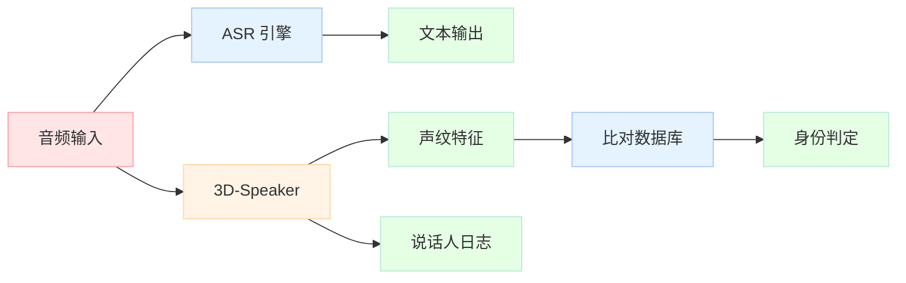

## 引子

上篇文章我们介绍了 FunASR 实时语音识别，今天来玩另一个阿里开源的好东西——**3D-Speaker**。

3D-Speaker 是阿里巴巴通义实验室开源的说话人识别与分割（Speaker Diarization）工具包，可以实现：

- 🎤 **声纹识别**：判断两段音频是不是同一个人
- 👥 **说话人分割**：分辨一段音频里有几个说话人、谁在什么时候说话
- 🌐 **语种识别**：判断音频说的是什么语言
- 🎬 **多模态识别**：结合视频画面进一步提升准确率

非常适合做**会议记录、语音助手身份验证、音频检索**等场景。

## 环境准备

### 系统依赖

```bash
# Ubuntu 22.04 为例
sudo apt update
sudo apt install -y \
  git \
  wget \
  ffmpeg \
  cmake \
  build-essential \
  libsndfile1 \
  pkg-config
```

### Python 环境（推荐 conda）

```bash
# 安装 Miniconda（如果没有）
wget https://repo.anaconda.com/miniconda/Miniconda3-latest-Linux-x86_64.sh
bash Miniconda3-latest-Linux-x86_64.sh

# 创建虚拟环境（Python 3.8 或 3.9 推荐）
conda create -n 3D-Speaker python=3.8
conda activate 3D-Speaker
```

### CUDA（可选，有 GPU 加速更快）

```bash
# 检查是否有 NVIDIA GPU
nvidia-smi

# 如果需要安装 CUDA（以 CUDA 11.8 为例）
wget https://developer.download.nvidia.com/compute/cuda/11.8.0/local_installers/cuda_11.8.0_520.61.05_linux.run
sudo sh cuda_11.8.0_520.61.05_linux.run

# 配置环境变量
echo 'export PATH=/usr/local/cuda/bin:$PATH' >> ~/.bashrc
echo 'export LD_LIBRARY_PATH=/usr/local/cuda/lib64:$LD_LIBRARY_PATH' >> ~/.bashrc
source ~/.bashrc
```

## 安装 3D-Speaker

### 方式一：源码安装（推荐开发者）

```bash
# 克隆仓库
git clone https://github.com/modelscope/3D-Speaker.git
cd 3D-Speaker

# 安装依赖
pip install -r requirements.txt

# 安装 ModelScope（下载预训练模型需要）
pip install modelscope
```

> ⚠️ 注意：`requirements.txt` 要求 `numpy<1.24`，如果你之前装过 numpy，需要先卸载重装。

```bash
pip uninstall numpy
pip install 'numpy>=1.20.0,<1.24'
```

### 方式二：仅安装 ModelScope（最简部署）

如果你只想用预训练模型做推理，不需要训练，可以只装必要的包：

```bash
conda create -n 3D-Speaker python=3.8
conda activate 3D-Speaker

pip install torch torchaudio
pip install modelscope
pip install scikit-learn==1.0.2
pip install soundfile scipy tqdm pyyaml
```

## 快速体验：使用预训练模型

3D-Speaker 在 [ModelScope](https://www.modelscope.cn/models?page=1&tasks=speaker-verification&type=audio) 上提供了大量预训练模型，可以直接下载使用。

### 方案一：Python SDK 推理（最简单）

#### 1. 说话人验证（判断两段音频是否为同一人）

```python
from modelscope.hub.snapshot_download import snapshot_download
from modelscope.pipelines import pipeline
import soundfile as sf
import numpy as np

# 下载模型（首次运行会自动下载）
model_dir = snapshot_download('iic/speech_campplus_sv_zh-cn_16k-common')

# 构建 pipeline
sv_pipeline = pipeline(
    tasks='speaker-verification',
    model=model_dir,
)

# 准备两段音频（16kHz WAV格式）
audio1 = 'audio/person1.wav'
audio2 = 'audio/person1_another.wav'

# 做说话人验证
result = sv_pipeline(audio1)
embedding1 = result['spk_embedding']

result = sv_pipeline(audio2)
embedding2 = result['spk_embedding']

# 计算余弦相似度
from sklearn.metrics.pairwise import cosine_similarity
similarity = cosine_similarity([embedding1], [embedding2])[0][0]

print(f"相似度: {similarity:.4f}")
print(f"是否为同一人: {similarity > 0.5}")  # 阈值可调整
```

#### 2. 批量说话人验证

```python
# 准备音频列表文件 wav.scp
# 格式：音频ID \t 音频路径
# person001 /path/to/audio1.wav
# person002 /path/to/audio2.wav

python speakerlab/bin/infer_sv_batch.py \
    --model_id iic/speech_campplus_sv_zh-cn_16k-common \
    --wavs /path/to/wav.scp
```

#### 3. 说话人分割（diarization）

```python
# 安装 pyannote.audio（用于 overlap 检测）
pip install pyannote.audio

# 下载 diarization 模型
model_dir = snapshot_download('iic/speech_diarization_sond-unified')

# 运行说话人分割
python speakerlab/bin/infer_diarization.py \
    --wav /path/to/meeting.wav \
    --out_dir ./diarization_output
```

带 overlap 检测（需要 HuggingFace token）：

```bash
export HF_ACCESS_TOKEN=your_huggingface_token

python speakerlab/bin/infer_diarization.py \
    --wav /path/to/meeting.wav \
    --out_dir ./output \
    --include_overlap \
    --hf_access_token $HF_ACCESS_TOKEN
```

### 方案二：直接用 Python 推理脚本

项目提供了封装好的脚本，不需要写代码：

```bash
# 单音频说话人验证
python speakerlab/bin/infer_sv.py \
    --model_id iic/speech_campplus_sv_zh-cn_16k-common

# 批量推理
python speakerlab/bin/infer_sv_batch.py \
    --model_id iic/speech_campplus_sv_zh-cn_16k-common \
    --wavs ./wav.scp
```

## 训练自己的模型

如果预训练模型不满足需求，可以在自己数据上微调。

### 准备训练数据

3D-Speaker 支持多个数据集格式，以 3D-Speaker 数据集为例：

```bash
# 下载数据集
cd egs/3dspeaker/sv-cam++/
bash run.sh --stage 0 --stop_stage 0
```

### 开始训练

```bash
cd egs/3dspeaker/sv-cam++/

# CAM++ 模型
bash run.sh

# ERes2NetV2 模型
cd ../sv-eres2netv2/
bash run.sh
```

训练会在 `exp/` 目录下生成模型checkpoint。

## ONNX 部署方案（生产环境推荐）

对于生产环境，ONNX 部署更轻量，不需要安装 PyTorch。

### 导出 ONNX 模型

```bash
# 安装 ONNX 相关包
pip install onnx onnxruntime

# 导出模型
python speakerlab/bin/export_speaker_embedding_onnx.py \
    --experiment_path /path/to/model \
    --model_id iic/speech_eres2net_sv_zh-cn_16k-common \
    --target_onnx_file ./model.onnx
```

### 编译 ONNX Runtime

```bash
# 安装编译工具
sudo apt install cmake build-essential

# 编译
cd runtime/onnxruntime/
mkdir build && cd build
cmake ..
make
```

编译完成后，`build/bin/` 下会有三个可执行文件：

| 文件 | 说明 |
|------|------|
| `extract_speaker_embedding` | 提取说话人向量 |
| `make_fbank_feature` | 提取 FBank 特征 |
| `read_and_describe_wav` | 读取并处理 WAV |

### 使用编译后的二进制文件

```bash
# 准备 wav.scp 文件
# 格式：utt_id_1 /path/to/wav_1.wav

# 提取说话人向量
./extract_speaker_embedding \
    /path/to/fbank_config.json \
    /path/to/model.onnx \
    /path/to/wav.scp \
    ./embedding.scp \
    ./embeddings/
```

## Docker 部署

3D-Speaker 没有提供官方 Docker 镜像，但可以用自定义 Dockerfile：

```dockerfile
FROM nvidia/cuda:11.8.0-cudnn8-runtime-ubuntu22.04

ENV DEBIAN_FRONTEND=noninteractive
RUN apt-get update && apt-get install -y \
    python3.8 python3-pip ffmpeg libsndfile1 git

WORKDIR /app

# 安装 PyTorch CUDA 版本
RUN pip3 install torch torchaudio --index-url https://download.pytorch.org/whl/cu118

# 复制项目
COPY . /app/3D-Speaker
WORKDIR /app/3D-Speaker
RUN pip3 install -r requirements.txt
RUN pip3 install modelscope

CMD ["bash"]
```

构建并运行：

```bash
# 构建镜像
docker build -t 3d-speaker:latest .

# 运行容器
docker run --gpus all -it \
    -v $PWD:/workspace \
    3d-speaker:latest
```

### 整体部署架构



## 完整使用示例

### 示例 1：会议录音分析

```python
from modelscope.pipelines import pipeline
from modelscope.hub.snapshot_download import snapshot_download

# 1. 下载模型
print("下载模型中...")
model_dir = snapshot_download('iic/speech_campplus_sv_zh-cn_16k-common')

# 2. 构建 pipeline
sv_pipeline = pipeline(tasks='speaker-verification', model=model_dir)

# 3. 分析会议音频
meeting_audio = 'meeting.wav'
result = sv_pipeline(meeting_audio)
print(f"说话人数量估计: {len(result)}")
```

### 示例 2：声纹注册与识别

```python
from modelscope.pipelines import pipeline
from modelscope.hub.snapshot_download import snapshot_download
import numpy as np

# 准备已知说话人的声纹库
known_speakers = {
    '张三': 'audio/zhangsan.wav',
    '李四': 'audio/lisi.wav',
    '王五': 'audio/wangwu.wav',
}

# 下载模型
model_dir = snapshot_download('iic/speech_campplus_sv_zh-cn_16k-common')
sv_pipeline = pipeline(tasks='speaker-verification', model=model_dir)

# 注册已知说话人
print("注册声纹中...")
embeddings = {}
for name, path in known_speakers.items():
    result = sv_pipeline(path)
    embeddings[name] = result['spk_embedding']
    print(f"  {name} 注册完成")

# 识别未知音频
unknown_audio = 'audio/unknown.wav'
result = sv_pipeline(unknown_audio)
unknown_embedding = result['spk_embedding']

# 相似度匹配
from sklearn.metrics.pairwise import cosine_similarity
best_match = None
best_score = -1

for name, emb in embeddings.items():
    score = cosine_similarity([unknown_embedding], [emb])[0][0]
    print(f"{name}: {score:.4f}")
    if score > best_score:
        best_score = score
        best_match = name

# 设定阈值判断
threshold = 0.5
if best_score > threshold:
    print(f"\n识别结果: {best_match} (相似度: {best_score:.4f})")
else:
    print(f"\n未识别到已知说话人 (最高相似度: {best_score:.4f})")
```

## 常见问题

**Q: 报错 `numpy.dtype` 大小不匹配？**

```bash
# 卸载重装兼容版本
pip uninstall numpy
pip install 'numpy>=1.20.0,<1.24'
```

**Q: ModelScope 下载模型很慢？**

```python
import modelscope
modelscope.set_cache_dir('/path/to/fast/disk')
# 或使用国内镜像
modelscope.use_hub('cn-hub')
```

**Q: 内存不足（CUDA OOM）？**

```python
# 减小 batch size
sv_pipeline = pipeline(
    tasks='speaker-verification',
    model=model_dir,
    kwargs={'batch_size': 1}
)
```

**Q: 如何处理非 16kHz 的音频？**

```bash
# 用 ffmpeg 转换
ffmpeg -i input.wav -ar 16000 -ac 1 output.wav
```

## 总结

3D-Speaker 提供了完整的说话人识别解决方案：

- ✅ **上手简单**：ModelScope 直接下载预训练模型，几行代码就能跑
- ✅ **性能优秀**：中文场景 EER 低至 0.52%（VoxCeleb）
- ✅ **功能全面**：验证、分割、语种识别全覆盖
- ✅ **部署灵活**：Python / ONNX / Docker 多种选择

结合 FunASR 做语音识别，可以实现完整的**语音交互分析系统**——先识别内容（ASR），再判断是谁在说话（Speaker Verification）。

## 参考资料

- GitHub: [modelscope/3D-Speaker](https://github.com/modelscope/3D-Speaker)
- ModelScope: [预训练模型集合](https://www.modelscope.cn/models?page=1&tasks=speaker-verification&type=audio)
- 数据集: [3D-Speaker-Dataset](https://3dspeaker.github.io/)
- 论文: [3D-Speaker arXiv](https://arxiv.org/pdf/2306.15354.pdf)
---

## 对比分析

3D-Speaker 是阿里达摩院开源的说话人识别工具集，与同样在 ModelScope 上的同类项目（如 Wespeaker、NeMo Speaker）以及商业云服务对比。

### 维度对比表

| 维度 | 3D-Speaker (ModelScope) | WeSpeaker | NVIDIA NeMo (Speaker) |
|------|--------------------------|-----------|------------------------|
| 任务覆盖 | 验证 + 分割 + 语种识别 + Overlap | 验证 + 分割 | 验证 + 分割 + 多任务 |
| 训练数据 | 3D-Speaker-Dataset（含中文/英文） | VoxCeleb 为主 | VoxCeleb + 内部数据 |
| 部署友好度 | 高（ModelScope pipeline + ONNX + Docker） | 中（PyTorch 原生） | 中（依赖 NeMo 框架） |
| 中文支持 | 强（EER 0.52% 中文场景） | 中 | 中 |
| 集成性 | 与 FunASR 同一生态 | 独立 | 与 NeMo 整体框架绑定 |
| 开源协议 | Apache 2.0 | Apache 2.0 | Apache 2.0 |

### 优缺点

3D-Speaker
- 优点：中文场景表现优异；功能全面（验证/分割/语种/Overlap）；部署形式多样（Python/ONNX/Docker）；与 FunASR 同生态，便于 ASR+说话人联合。
- 缺点：模型体积相对较大；英文场景略弱于 VoxCeleb 训练的专项模型；社区相比 PyTorch 原生项目稍小。

WeSpeaker
- 优点：PyTorch 原生，易于研究；VoxCeleb 上的基准表现稳定。
- 缺点：中文场景支持弱；功能相对单一（验证 + 分割）。

NeMo Speaker
- 优点：与 NVIDIA NeMo 框架集成，多任务统一；GPU 训练效率高。
- 缺点：依赖较重（NeMo 全套）；对中文/小语种覆盖有限；部署复杂度高。

### 何时选

- 选 3D-Speaker：中文/中英混合场景、想一站式搞定验证+分割+语种、计划与 FunASR 联合部署。
- 选 WeSpeaker：纯英文 VoxCeleb 基准、研究导向。
- 选 NeMo Speaker：已在使用 NeMo 训练/部署其他语音任务、需要 GPU 集群训练。

### 参考资料

- 3D-Speaker GitHub：https://github.com/modelscope/3D-Speaker
- WeSpeaker GitHub：https://github.com/wenet-e2e/wespeaker
- NVIDIA NeMo：https://github.com/NVIDIA/NeMo
- 3D-Speaker 论文：https://arxiv.org/pdf/2306.15354.pdf