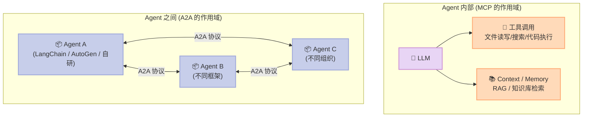
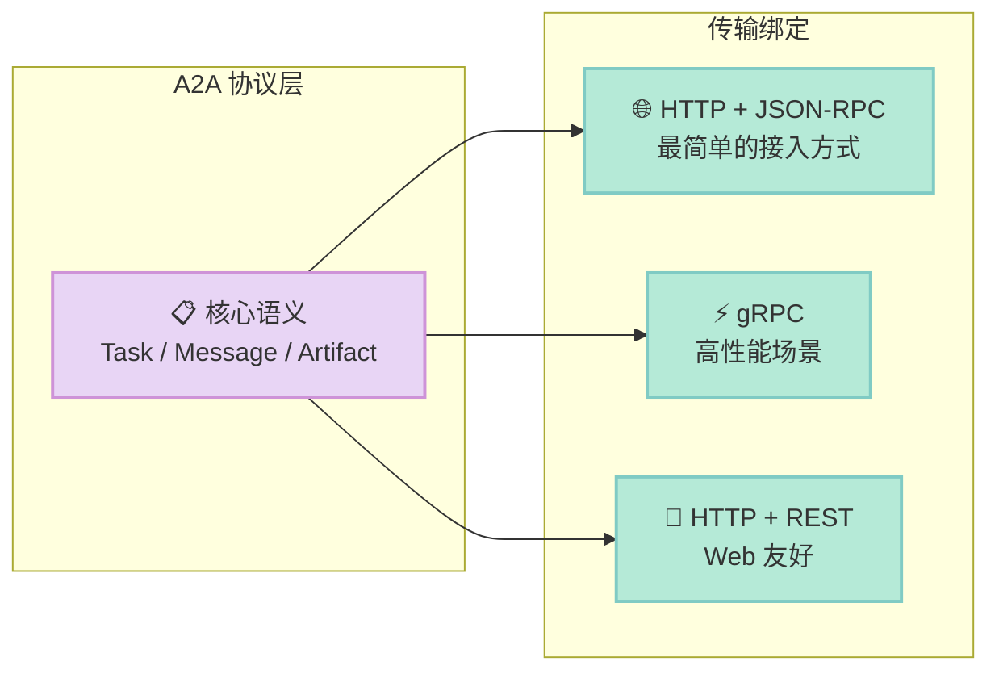
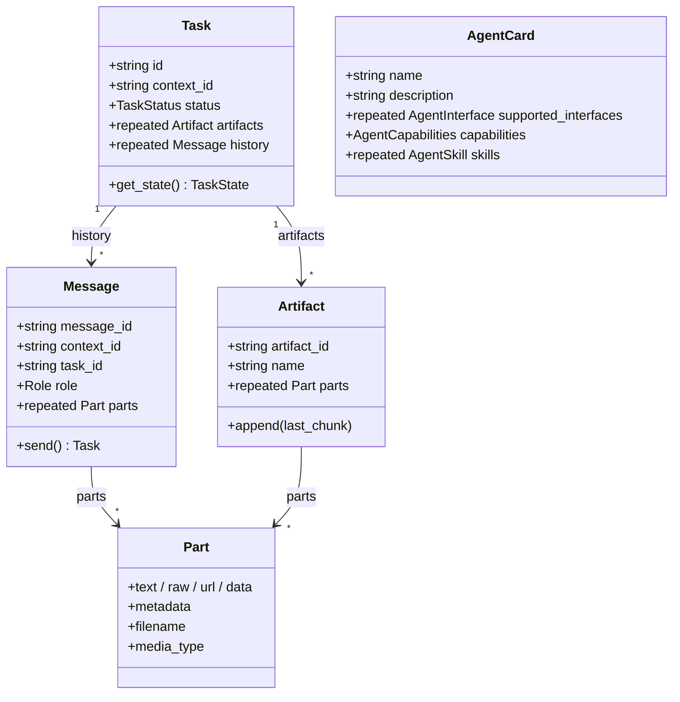
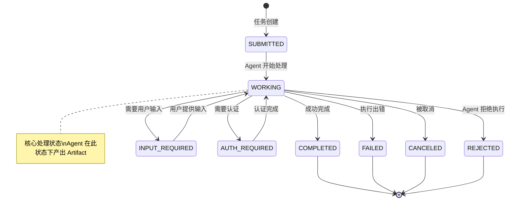
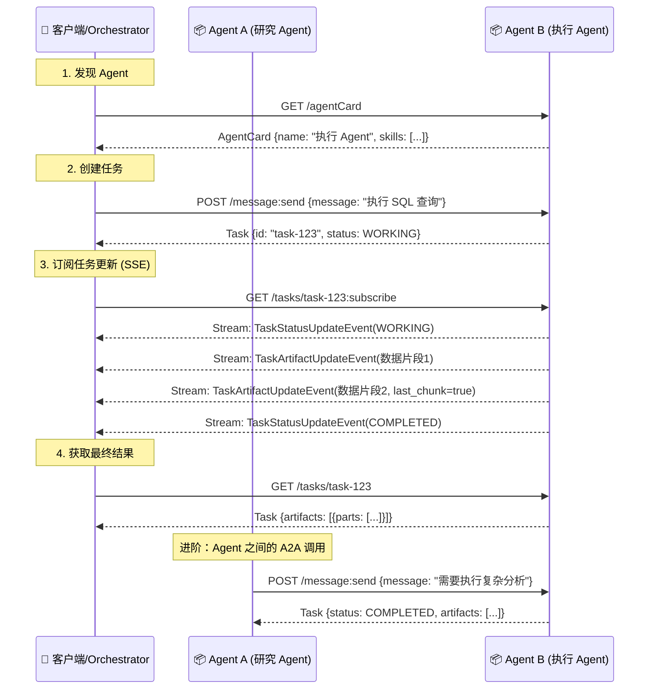
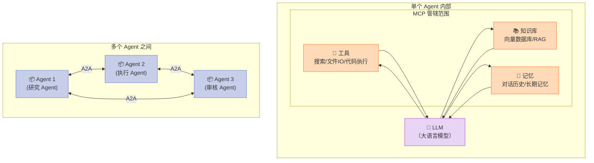
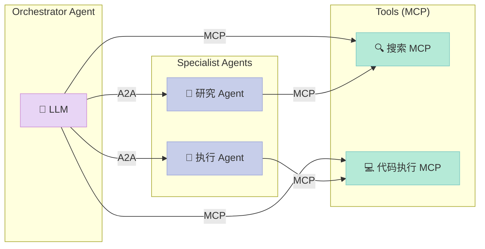
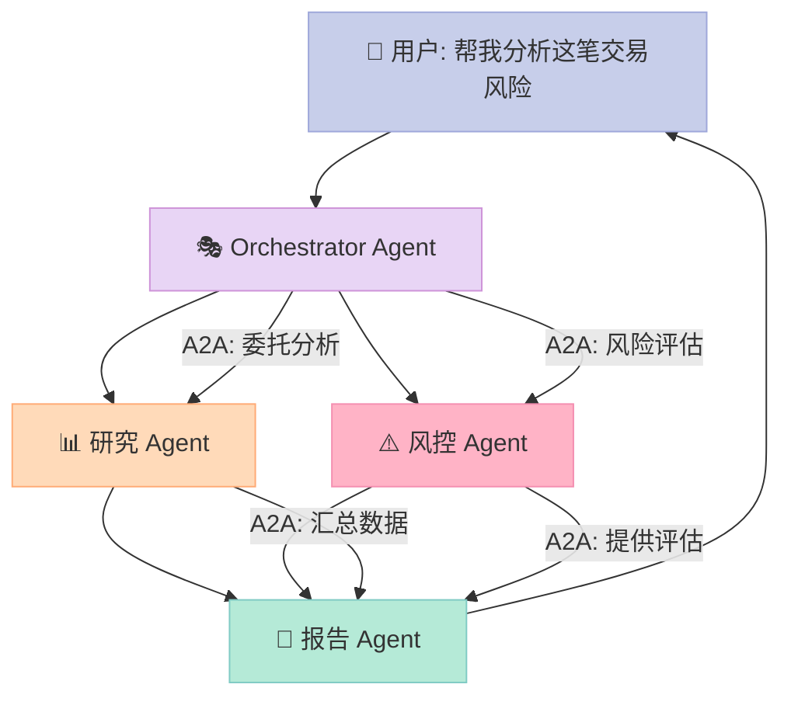

> **一句话核心结论**：A2A（Agent2Agent）协议是 AI Agent 世界的"HTTP"——它让不同框架、不同公司构建的 Agent 能够互相通信，而 MCP 负责的是 Agent 内部的工具调用。A2A 解决的是 Agent 协作的"最后一公里"问题。

## 前言

想象一个场景：你在公司用 Salesforce 管理客户，用 Slack 沟通协作，用 GitHub 管理代码——它们之间通过 API 和 Webhook 互联互通。但如果你有三个 AI Agent，分别由 LangChain、AutoGen 和自制框架构建，它们之间能直接对话吗？

**答案是：以前不能，现在可以了。**

Google 主导的 A2A（Agent2Agent）协议正在为 AI Agent 世界建立一套标准的"普通话"。截至 2026 年 5 月，该项目已获得 **23,527 颗 GitHub Stars**，被 8 家顶级科技公司的技术委员会共同指导，并已进入 1.0 生产稳定版阶段。

本文将深入解析 A2A 协议的核心设计理念、协议架构、关键数据模型，以及它与 MCP 的分工边界。

---

## 一、为什么需要 A2A？

当前 AI Agent 领域面临一个根本性问题：**框架割裂**。

企业级 AI 系统通常由多个专业化 Agent 组成——有的负责研究，有的负责执行，有的负责审核。这些 Agent 可能由不同团队、使用不同框架、在不同服务器上运行。当一个 Agent 需要调用另一个 Agent 时，开发者只能针对每个组合单独编写适配代码，这导致了：

- **厂商锁定**：深度绑定某一框架的 Agent 生态
- **重复造轮子**：每对 Agent 协作都需要定制开发
- **无法跨组织协作**：组织 A 的 Agent 无法安全地调用组织 B 的 Agent
- **黑盒协作**：Agent 之间无法发现彼此能力，只能硬编码调用

A2A 的核心目标是**打破这些孤岛**，让 Agent 可以像 Web 服务一样，通过标准协议互相发现、协商和协作。

---

## 二、A2A 协议核心概念

### 2.1 协议定位：A2A 是"Agent 间的 HTTP"

在深入技术细节之前，先理解 A2A 在整个 AI Agent 技术栈中的位置至关重要：



> **MCP**（Model Context Protocol）定义的是"Agent 如何调用工具和获取上下文"，解决的是单个 Agent 内部的问题。
> **A2A** 定义的是"Agent 如何与其他 Agent 通信协作"，解决的是多个 Agent 之间的协作问题。
> 两者是正交关系，一个 Agent 内部可以同时使用 MCP（调用工具）和 A2A（调用其他 Agent）。

---

## 三、协议架构深度解析

### 3.1 传输层：多种协议绑定

A2A 协议采用**传输无关**的设计，支持三种主流传输方式：



| 传输方式 | 适用场景 | 特点 |
|---------|---------|------|
| HTTP + JSON-RPC | 通用场景，最易接入 | 纯 JSON，可穿透防火墙 |
| gRPC | 高性能、低延迟 | Protocol Buffers 序列化，适合内部网络 |
| HTTP + REST | Web 原生应用 | 与现有 Web 基础设施兼容 |

协议还支持**同步请求/响应**和**流式响应（SSE）**两种交互模式，客户端可以根据场景选择轮询、流式或 Webhook 推送来获取结果。

### 3.2 核心数据模型

A2A 定义了四个核心实体：



#### Task（任务）：A2A 的核心工作单元

Task 是 A2A 协议中最核心的概念，代表一次完整的 Agent 协作工作单元。它包含：

- **唯一标识**：`id`（UUID）用于追踪整个任务
- **上下文标识**：`context_id` 将多个相关的 Task 归到同一个会话或项目下
- **状态机**：`status` 跟踪任务生命周期
- **产物**：`artifacts` 存储任务产生的结果（如生成的报告、代码文件）
- **历史**：`history` 记录完整的交互过程

#### TaskState 状态机



### 3.3 AgentCard：Agent 的"身份证"

AgentCard 是 A2A 协议中最巧妙的设计之一——它解决了 **Agent 发现（Discovery）** 的问题。每个 A2A Agent 都会暴露一个标准化的 AgentCard，让其他 Agent 或客户端能够：

- 了解该 Agent 能做什么（`skills`）
- 支持哪些通信方式（`supported_interfaces`）
- 需要什么样的认证（`security_schemes`）
- 签名验证（`signatures`）防止身份伪造

```protobuf
message AgentCard {
  string name = 1;                    // "数据分析 Agent"
  string description = 2;             // "擅长 SQL 和可视化"
  repeated AgentInterface interfaces = 3;  // 暴露的协议端点
  AgentCapabilities capabilities = 7;  // streaming / push_notifications
  repeated AgentSkill skills = 12;     // 技能列表
  repeated string default_input_modes = 10;   // text/plain, application/json...
  repeated string default_output_modes = 11;  // text/plain, image/png...
}
```

**关键理解**：AgentCard 包含的是 Agent 的**能力描述**，而非内部实现细节。这正是 A2A"保持 Opacity（不透明性）"原则的体现——Agent 之间可以在不了解彼此内部架构的情况下协作。

### 3.4 任务生命周期：完整交互流程



---

## 四、实战代码：构建一个 A2A Agent

下面通过 Python SDK 演示如何快速构建一个符合 A2A 协议的 Agent。

### 4.1 安装

```bash
pip install a2a-sdk uv
# 或者使用 uv
uv pip install a2a-sdk
```

### 4.2 定义 AgentCard（Agent 的能力声明）

```python
from a2a import AgentSkill, AgentCard, AgentCapabilities, AgentProvider

# 定义 Agent 的技能
skills = [
    AgentSkill(
        id="data-analysis",
        name="数据分析",
        description="执行 SQL 查询并生成可视化报告",
        tags=["sql", "analytics", "python"],
        examples=[
            "分析去年Q4的销售数据",
            "生成本季度用户增长报告"
        ],
        input_modes=["text/plain", "application/json"],
        output_modes=["text/plain", "application/json", "image/png"]
    )
]

# 定义 Agent 能力
capabilities = AgentCapabilities(
    streaming=True,              # 支持流式响应
    push_notifications=False,    # 不需要推送通知
    extended_agent_card=False
)

# 定义 Agent 元信息
agent_card = AgentCard(
    name="数据分析 Agent",
    description="专业的 SQL 数据分析助手，支持 pandas 可视化",
    version="1.0.0",
    skills=skills,
    capabilities=capabilities,
    default_input_modes=["text/plain", "application/json"],
    default_output_modes=["text/plain", "application/json"],
    provider=AgentProvider(
        url="https://example.com",
        organization="Example Corp"
    )
)
```

### 4.3 实现 A2A Server（使用 Starlette + FastAPI）

```python
from a2a.server.starlette import A2AStarletteAdapter
from a2a.types import (
    SendMessageRequest,
    SendMessageResponse,
    Message,
    Part,
    Task,
    TaskStatus,
    TaskState,
    Artifact,
    Role,
)
from starlette.applications import Starlette
from starlette.routing import Route
import uvicorn

class DataAnalysisAgent:
    """数据分析 Agent 实现"""

    async def on_message(self, message: Message) -> Task:
        """处理收到的消息"""
        # 提取用户请求
        user_text = message.parts[0].text

        # 创建任务
        task_id = f"task-{hash(user_text) % 100000}"
        context_id = message.context_id or f"context-{task_id}"

        # 构建初始任务
        task = Task(
            id=task_id,
            context_id=context_id,
            status=TaskStatus(
                state=TaskState.TASK_STATE_WORKING,
                message=Message(
                    message_id=f"msg-{task_id}",
                    role=Role.ROLE_AGENT,
                    parts=[Part(text="正在分析数据，请稍候...")]
                )
            )
        )

        # 模拟数据分析过程（实际使用 pandas/SQL）
        analysis_result = self._run_analysis(user_text)

        # 构建产物（Artifact）
        artifact = Artifact(
            artifact_id=f"artifact-{task_id}",
            name="分析报告",
            description="SQL 数据分析结果",
            parts=[Part(
                text=analysis_result,
                media_type="text/plain"
            )]
        )

        # 更新任务状态为完成
        task.status.state = TaskState.TASK_STATE_COMPLETED
        task.artifacts.append(artifact)

        return task

    def _run_analysis(self, query: str) -> str:
        """实际的数据分析逻辑"""
        # 这里是你的数据分析代码
        return f"分析结果：针对 '{query}' 的分析已完成。\n结果：发现关键数据模式..."

# 创建 Agent 实例
agent = DataAnalysisAgent()

# 创建 Starlette 应用
app = Starlette(
    routes=[
        Route(
            '/',
            A2AStarletteAdapter(agent_card=agent_card, agent=agent)
        )
    ]
)

if __name__ == '__main__':
    uvicorn.run(app, host='0.0.0.0', port=8000)
```

### 4.4 实现 A2A Client（调用其他 Agent）

```python
import asyncio
from a2a.client import A2AClient
from a2a.types import Message, Part, Role, SendMessageConfiguration
from httpx import AsyncClient

async def call_data_agent():
    """作为客户端调用 A2A Agent"""
    async with AsyncClient() as httpx_client:
        client = A2AClient(
            httpx_client=httpx_client,
            base_url="https://data-agent.example.com"
        )

        # 先获取 AgentCard，了解 Agent 能力
        agent_card = await client.get_agent_card()
        print(f"调用 Agent: {agent_card.name}")
        print(f"技能: {[s.name for s in agent_card.skills]}")

        # 发送消息给 Agent
        message = Message(
            message_id="msg-client-001",
            role=Role.ROLE_USER,
            parts=[Part(text="分析本月活跃用户趋势")]
        )

        config = SendMessageConfiguration(
            accepted_output_modes=["text/plain", "application/json"],
            return_immediately=False  # 等待任务完成
        )

        # 发送并等待结果
        response = await client.send_message(message, config)

        if response.payload:
            task = response.payload.task
            print(f"任务状态: {task.status.state}")
            for artifact in task.artifacts:
                for part in artifact.parts:
                    print(f"结果: {part.text}")

asyncio.run(call_data_agent())
```

### 4.5 使用 Streaming 实时获取任务进度

```python
async def stream_task_updates():
    """通过 SSE 流式获取任务更新"""
    async with AsyncClient() as httpx_client:
        client = A2AClient(
            httpx_client=httpx_client,
            base_url="https://data-agent.example.com"
        )

        # 先创建任务
        message = Message(
            message_id="msg-stream-001",
            role=Role.ROLE_USER,
            parts=[Part(text="生成全年销售报表")]
        )

        response = await client.send_message(message)
        task = response.payload.task
        task_id = task.id

        # 订阅任务更新（Server-Sent Events）
        async for event in client.stream_task_updates(task_id):
            if event.payload.status_update:
                print(f"状态: {event.payload.status_update.status.state}")
            elif event.payload.artifact_update:
                artifact = event.payload.artifact_update.artifact
                print(f"收到产物: {artifact.name}")
                for part in artifact.parts:
                    print(f"内容: {part.text[:100]}...")

asyncio.run(stream_task_updates())
```

---

## 五、A2A vs MCP：一张图说清楚分工

这是目前社区最容易混淆的概念。让我用一张图彻底讲清楚：



| 维度 | MCP（Model Context Protocol） | A2A（Agent2Agent） |
|------|------|------|
| **解决的问题** | Agent 如何调用工具和获取上下文 | Agent 如何与其他 Agent 通信协作 |
| **类比** | 浏览器的 Web API（fetch/XMLHttpRequest） | 互联网的 HTTP 协议 |
| **典型场景** | Agent 调用搜索 API、读写文件、操作数据库 | 研究 Agent 将任务委托给执行 Agent |
| **通信方向** | Agent → 工具/资源（单向） | Agent ↔ Agent（双向） |
| **状态管理** | 无状态，每次独立调用 | 有状态，完整的 Task 生命周期 |
| **标准化组织** | Model Context Protocol (Anthropic 主导) | Linux Foundation (Google 主导) |

**两者结合的典型架构**：



---

## 六、A2A v1.0 企业级特性

A2A 1.0 在 2026 年初发布，带来了一系列面向生产环境的新特性：

### 6.1 Signed AgentCard（签名验证）

```protobuf
message AgentCardSignature {
  string protected = 1;   // JWS Header (base64url)
  string signature = 2;  // JWS Signature
  google.protobuf.Struct header = 3;
}
```

每个 AgentCard 都可以附带的 JWS 签名，允许接收方通过公钥验证 AgentCard 的真实性和完整性。这在跨组织协作中至关重要——你可以在与未知 Agent 通信前，先验证它的身份是否可信。

### 6.2 Multi-Tenancy（多租户）

A2A 协议支持在单一端点上托管多个 Agent，通过 `tenant` 路径参数区分：

```text
POST /{tenant}/message:send
GET  /{tenant}/tasks/{id}
```

这使得企业可以在同一组服务器上运行多个 Agent，服务不同的业务线或客户，同时保持隔离。

### 6.3 Push Notifications（推送通知）

传统的轮询方式在长时间运行的任务中效率很低。A2A 支持 Webhook 推送，当任务状态变更时主动通知客户端：

```python
config = SendMessageConfiguration(
    task_push_notification_config=TaskPushNotificationConfig(
        url="https://my-app.com/webhook/a2a",
        token="session-token-xyz",
        authentication=AuthenticationInfo(
            scheme="Bearer",
            credentials="my-secret-token"
        )
    )
)
```

---

## 七、优缺点分析

### 优点

| 维度 | 说明 |
|------|------|
| **架构简洁性** | 核心概念少（Task/Message/Artifact/AgentCard），上手容易 |
| **协议灵活性** | 支持 HTTP/gRPC/REST多种传输方式，适应不同场景 |
| **安全设计** | 内置 OAuth2、API Key、mTLS 等多种认证方案 |
| **可发现性** | AgentCard 机制让 Agent 可以动态发现彼此能力 |
| **多框架兼容** | SDK 已支持 Python/Go/JS/Java/.NET，主流框架可接入 |
| **标准成熟度** | v1.0 已发布，Linux Foundation 背书，企业可用 |

### 缺点与局限

| 维度 | 说明 |
|------|------|
| **协议复杂度** | 相比简单 HTTP 调用，协议开销较高 |
| **生态年轻** | 2025 年才出现，生态工具链（如监控、调试）尚不完善 |
| **版本迁移** | v0.3 到 v1.0 有 breaking changes，老项目迁移有成本 |
| **落地门槛** | 需要多个 Agent 协作场景才有价值，单独 Agent 无需 A2A |
| **性能开销** | 相比直接函数调用，A2A 的序列化/网络开销不可忽视 |

---

## 八、对比：同类 Agent 通信协议

除了 A2A，业界还有哪些 Agent 通信协议？

| 协议 | 主导方 | 定位 | 成熟度 |
|------|--------|------|--------|
| **A2A** | Google + Linux Foundation | Agent ↔ Agent 协作 | ⭐⭐⭐⭐ v1.0 生产级 |
| **MCP** | Anthropic | Agent → 工具/资源 | ⭐⭐⭐⭐ 广泛采用 |
| **Agent Protocol** | AI Foundation | Agent 标准接口 | ⭐⭐⭐ 早期 |
| **OpenAI Agent SDK** | OpenAI | Agent 开发框架 | ⭐⭐⭐ 封闭生态 |
| **LangChain Agent** | LangChain | Agent 开发框架 | ⭐⭐⭐ 绑定框架 |

**设计差异对比**：

| 维度 | A2A | MCP |
|------|-----|-----|
| **抽象层次** | 任务级（Task/Artifact） | 资源级（Tool/Resource） |
| **状态管理** | 有状态完整生命周期 | 无状态每次独立调用 |
| **发现机制** | AgentCard 主动发现 | 客户端配置型 |
| **通信模式** | 双向协商 | 客户端驱动 |
| **扩展方向** | 协作工作流 | 工具生态 |

---

## 九、应用场景

A2A 特别适合以下场景：

### 场景 1：企业级 Multi-Agent 编排

大型企业通常有多个专业 Agent——客服 Agent、风控 Agent、数据分析 Agent。A2A 让它们可以在不了解彼此实现细节的情况下协作：



### 场景 2：跨组织 Agent 协作

组织 A 的合规 Agent 可以安全地验证组织 B 的交易 Agent 的身份后，调用其服务。

### 场景 3：Agent Marketplace

想象一个 Agent 应用商店——开发者发布 Agent 时附带标准 AgentCard，买家通过 AgentCard 了解能力后直接通过 A2A 调用，无需任何定制集成。

---

## 十、总结与展望

### 核心结论

1. **A2A 是 Agent 互联互通的桥梁**：它解决的是"不同 Agent 如何对话"的问题，与 MCP 的"Agent 如何调用工具"是正交关系
2. **Task 是核心抽象**：相比简单的消息传递，A2A 通过完整的任务生命周期管理，支持长时间运行的复杂协作
3. **安全与可发现性并重**：Signed AgentCard 机制让跨组织 Agent 协作成为可能，同时保护各方隐私
4. **生态正在快速成熟**：已有 Python/Go/JS/Java/.NET 多语言 SDK，主流框架（LangGraph、ADK）已开始集成

### 给不同读者的建议

| 读者 | 建议 |
|------|------|
| **Agent 框架开发者** | 尽快支持 A2A，这是大势所趋 |
| **企业 AI 架构师** | 在设计 Multi-Agent 系统时，优先考虑 A2A 作为协作层 |
| **独立开发者** | 从简单场景入手，用 A2A SDK 5 分钟即可让 Agent 支持 A2A |
| **AI 研究者** | A2A 的 AgentCard 发现机制是 Agent 自动化协作的关键基础设施 |

### 未来趋势

- **2026 年底**：主流 Agent 框架（LangChain、AutoGen）全面支持 A2A
- **2027 年**：企业级 Agent Marketplace 出现，A2A 是其底层协议
- **长期**：A2A 有潜力成为 AI Agent 互联网的基础协议，类似 HTTP 在 Web 中的地位

---

## 参考资源

- 官方文档：https://a2a-protocol.org
- 协议规范：https://a2a-protocol.org/latest/specification/
- GitHub：https://github.com/a2aproject/A2A
- Python SDK：`pip install a2a-sdk`
- DeepLearning.AI 课程：https://goo.gle/dlai-a2a

---

> **结尾金句**：A2A 的出现，标志着 AI Agent 从"各自为战"走向"协同网络"的关键转折。理解 A2A，就是理解 AI Agent 大规模协作的未来。
---

## 对比分析

A2A（Agent-to-Agent）协议是面向 Agent 互联的协议级规范，与 MCP（Model Context Protocol）、OpenAI Function Calling 等"模型-工具/Agent 互联"机制形成互补。

### 维度对比表

| 维度 | A2A Protocol | MCP (Model Context Protocol) | OpenAI Function Calling |
|------|--------------|-------------------------------|---------------------------|
| 抽象对象 | Agent ↔ Agent | Model ↔ Tool/Resource | Model ↔ Function |
| 通信模式 | 异步、面向任务、长期连接 | 请求/响应（tool call） | 同步函数调用 |
| 发现机制 | Agent Card（能力声明） | Server 注册 | 工具 schema |
| 互操作性 | 跨框架、跨语言 | 跨模型、跨工具 | OpenAI 模型为主 |
| 适合场景 | 多 Agent 协作 / 跨厂商 Agent 网络 | 单 Agent 工具/数据接入 | 单次工具调用 |

### 优缺点

A2A Protocol
- 优点：聚焦 Agent-to-Agent 协作，标准化任务委派、状态、产物交换；跨厂商、跨语言；与 MCP 互补而非竞争。
- 缺点：仍处早期，多数框架尚未原生支持；需要 SDK 适配；长期运行任务的状态机较复杂。

MCP
- 优点：事实标准化的"模型-工具/数据"接口；生态快速增长；JSON-RPC 简单稳定。
- 缺点：聚焦单 Agent 视角；多 Agent 协作不在协议范围。

OpenAI Function Calling
- 优点：实现简单；OpenAI 生态最强；广泛兼容。
- 缺点：仅 OpenAI 模型原生支持；每次调用是同步函数，无长期任务概念。

### 何时选

- 用 A2A：跨厂商/跨框架 Agent 协作、Agent Marketplace、需要长期任务委派与状态同步。
- 用 MCP：单个 Agent 接入大量工具、数据源、资源。
- 用 Function Calling：仅需单步工具调用、不需要协议化抽象。

注：A2A 与 MCP 是互补关系，实际项目中通常同时使用——MCP 让 Agent 接入工具，A2A 让多个 Agent 互相调用。

### 参考资料

- A2A 官方文档：https://a2a-protocol.org
- A2A GitHub：https://github.com/a2aproject/A2A
- MCP 官方：https://modelcontextprotocol.io/
- OpenAI Function Calling 文档：https://platform.openai.com/docs/guides/function-calling