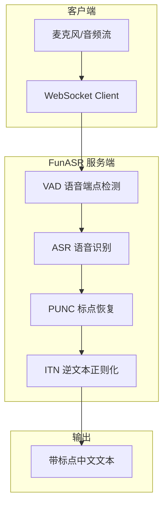

## 引子

语音识别（ASR）是 AI 应用落地最广泛的场景之一。从智能助手到会议转录，从语音输入到字幕生成，实时准确的语音识别能大幅提升效率。

今天要介绍的是 **FunASR**（Fun-ASR）——阿里巴巴通义实验室开源的语音识别大模型。它支持：

- 🇨🇳 **中文实时识别**（含 7 种方言、26 种地方口音）
- ⚡ **低延迟流式识别**（WebSocket 实时推流）
- 🐳 **Docker 一键部署**
- 🔧 **多种部署方式**（Python SDK、WebSocket 服务、C++ SDK）
- 🌐 **31 种语言支持**

如果你需要在内网环境搭建自己的语音识别服务，FunASR 是一个非常不错的选择。

## 项目简介

FunASR 是阿里巴巴通义实验室开源的端到端语音识别基础框架，核心模型基于数千万小时真实语音数据训练，在学术界和工业界都有广泛应用。

**GitHub**: [FunAudioLLM/Fun-ASR](https://github.com/FunAudioLLM/Fun-ASR)（⭐ 1,100+）

**核心模型**：

| 模型 | 参数量 | 语言 | 特点 |
|------|--------|------|------|
| Fun-ASR-Nano | 800M | 中文/英文/日语 | 支持方言、歌词识别、低延迟实时转写 |
| Fun-ASR-MLT-Nano | 800M | 31 种语言 | 多语言支持 |
| SenseVoiceSmall | 330M | 多语言 | ASR + 情感识别 + 语种检测 |

## 架构解析

FunASR 的核心架构分为以下几个模块：



**各模块职责**：

1. **VAD（Voice Activity Detection）**：检测语音活动，将连续音频流切分成段落
2. **ASR（Automatic Speech Recognition）**：核心识别模型，将音频转为文字
3. **PUNC（Punctuation）**：标点恢复，为识别结果添加标点
4. **ITN（Inverse Text Normalization）**：数字、日期等格式化输出

**2pass 模式**：FunASR 的实时识别采用 2pass 策略——流式模型提供低延迟实时结果，非流式模型在句尾提供高精度修正。

## 部署方案

FunASR 提供多种部署方式，以下两种最常用：

### 方案一：Docker 一键部署（推荐）

这是最简单的方式，一行命令启动实时语音识别服务：

```bash
# 1. 拉取 Docker 镜像
sudo docker pull \
  registry.cn-hangzhou.aliyuncs.com/funasr_repo/funasr:funasr-runtime-sdk-online-cpu-0.1.13

# 2. 创建本地模型目录
mkdir -p ./funasr-runtime-resources/models

# 3. 启动容器
sudo docker run -p 10096:10095 -it --privileged=true \
  -v $PWD/funasr-runtime-resources/models:/workspace/models \
  registry.cn-hangzhou.aliyuncs.com/funasr_repo/funasr:funasr-runtime-sdk-online-cpu-0.1.13
```

容器启动后，进入容器启动服务：

```bash
# 在容器内执行
cd /FunASR/runtime

# 启动 2pass 实时识别服务（流式+非流式纠错）
nohup bash run_server_2pass.sh \
  --download-model-dir /workspace/models \
  --vad-dir damo/speech_fsmn_vad_zh-cn-16k-common-onnx \
  --model-dir damo/speech_paraformer-large_asr_nat-zh-cn-16k-common-vocab8404-onnx \
  --online-model-dir damo/speech_paraformer-large_asr_nat-zh-cn-16k-common-vocab8404-online-onnx \
  --punc-dir damo/punc_ct-transformer_zh-cn-common-vad_realtime-vocab272727-onnx \
  --itn-dir thuduj12/fst_itn_zh \
  --certfile 0 > log.txt 2>&1 &
```

> 💡 **注意**：如果 Docker 启动失败，尝试添加 `--network host` 或检查端口占用。

### 方案二：Python WebSocket 服务（开发调试）

如果你需要修改代码或调试，Python 版本更灵活：

```bash
# 克隆仓库
git clone https://github.com/modelscope/FunASR.git
cd FunASR

# 安装依赖
pip install -U funasr modelscope

# 启动 WebSocket 服务
cd runtime/python/websocket
python funasr_wss_server.py --port 10095
```

### 离线文件转写服务

如果只需要离线批量转写（不需要实时），可以用更简单的镜像：

```bash
# 拉取离线转写镜像
sudo docker pull \
  registry.cn-hangzhou.aliyuncs.com/funasr_repo/funasr:funasr-runtime-sdk-cpu-0.4.7

# 启动
sudo docker run -p 10095:10095 -it --privileged=true \
  -v $PWD/funasr-runtime-resources/models:/workspace/models \
  registry.cn-hangzhou.aliyuncs.com/funasr_repo/funasr:funasr-runtime-sdk-cpu-0.4.7
```

## 使用方法

### 客户端测试

服务启动后，用 Python 客户端测试：

```bash
# 单次音频文件识别
python3 funasr_wss_client.py \
  --host "127.0.0.1" --port 10096 \
  --mode 2pass \
  --audio_in "./data/asr_example.wav"
```

### WebSocket 实时识别

如果需要实时麦克风输入，可以用浏览器或小程序。这里介绍 Python 客户端方式：

```python
import asyncio
import websockets
import json
import base64

async def real_time_asr():
    uri = "ws://127.0.0.1:10096"
    
    async with websockets.connect(uri) as ws:
        # 发送开始信号
        await ws.send(json.dumps({
            "mode": "2pass",
            "chunk_size": "5,10,5",
            "send_interval": 0.128,
            "audio_fs": 16000
        }))
        
        # 读取麦克风音频并发送（需要 pyaudio）
        import pyaudio
        p = pyaudio.PyAudio()
        stream = p.open(format=pyaudio.paInt16, channels=1, rate=16000, input=True)
        
        try:
            while True:
                audio_data = stream.read(1280)  # 80ms @ 16kHz
                b64_audio = base64.b64encode(audio_data).decode()
                await ws.send(json.dumps({"audio": b64_audio}))
                
                # 接收识别结果
                result = await ws.recv()
                if result:
                    data = json.loads(result)
                    if "text" in data and data["text"]:
                        print(f"识别结果: {data['text']}")
        except KeyboardInterrupt:
            pass
        finally:
            stream.stop_stream()
            stream.close()
            p.terminate()

asyncio.run(real_time_asr())
```

### Python SDK 直接调用

最简单的方式——直接用 Python SDK 离线识别：

```python
from funasr import AutoModel

# 加载模型
model = AutoModel(
    model="FunAudioLLM/Fun-ASR-Nano-2512",
    vad_model="fsmn-vad",
    vad_kwargs={"max_single_segment_time": 30000},
    device="cuda:0",
)

# 识别音频文件
wav_path = "test.wav"
res = model.generate(input=[wav_path], language="中文")
print(res[0]["text"])
```

### 命令行快速测试

FunASR 也支持命令行方式：

```bash
# 安装后直接用命令行
pip install -U funasr

# 快速识别
funasr ++model=paraformer-zh ++vad_model="fsmn-vad" ++punc_model="ct-punc" ++input=asr_example_zh.wav
```

## 常用配置参数

### 服务端参数

| 参数 | 说明 | 示例值 |
|------|------|--------|
| `--vad-dir` | VAD 模型路径 | `damo/speech_fsmn_vad_zh-cn-16k-common-onnx` |
| `--model-dir` | ASR 非流式模型 | `damo/speech_paraformer-large_asr_nat-zh-cn-16k-common-vocab8404-onnx` |
| `--online-model-dir` | ASR 流式模型 | `damo/speech_paraformer-large_asr_nat-zh-cn-16k-common-vocab8404-online-onnx` |
| `--punc-dir` | 标点恢复模型 | `damo/punc_ct-transformer_zh-cn-common-vad_realtime-vocab272727-onnx` |
| `--certfile 0` | 关闭 SSL（内网用） | - |
| `--hotword` | 热词文件路径 | `/workspace/models/hotwords.txt` |

### 热词配置

热词可以显著提升特定词汇的识别准确率：

```text
# hotwords.txt 格式（每行: 词 权重）
阿里巴巴 20
语音识别 15
FunASR 10
```

### 客户端参数

| 参数 | 说明 | 默认值 |
|------|------|--------|
| `--mode` | 识别模式 | `2pass`（实时+纠错）/ `offline`（仅离线）/ `streaming`（仅流式） |
| `--chunk_size` | 流式 chunk 大小 | `"5,10,5"` |
| `--audio_in` | 输入音频文件 | - |

## 性能对比

FunASR 在多个测试集上的表现：

| 测试场景 | Fun-ASR-Nano | Whisper-large-v3 | 提升 |
|----------|-------------|------------------|------|
| 近场中文 | 7.79% WER | 16.58% WER | +51% |
| 远场中文 | 5.79% WER | 22.21% WER | +74% |
| 复杂噪声 | 14.59% WER | 32.57% WER | +55% |
| 中文方言 | 28.18% WER | 66.14% WER | +57% |
| 中文口音 | 12.90% WER | 36.03% WER | +64% |

> WER（Word Error Rate）越低越好，FunASR 在中文场景下优势明显。

## 在 Home Assistant 中集成

如果你已经在用 [Home Assistant](http://192.168.1.5:8123) 做智能家居，可以将 FunASR 作为语音识别引擎：

```yaml
# configuration.yaml 示例
voice:
  - platform: funasr
    host: 127.0.0.1
    port: 10096
    mode: 2pass
```

配合 [esphox](https://github.com/xuqi1987/usb-camera-stream) 等项目，可以实现本地化的语音控制。

## 常见问题

**Q: Docker 启动报错 "port already in use"？**

```bash
# 查看端口占用
sudo lsof -i :10095
# 或换端口启动
sudo docker run -p 10097:10095 ...
```

**Q: 识别延迟高？**

尝试调整 chunk_size：
```bash
python3 funasr_wss_client.py --host "127.0.0.1" --port 10096 --mode 2pass --chunk_size "8,8,4"
```

**Q: 如何识别英文？**

```python
model.generate(input=[wav_path], language="en")
```

**Q: 内网部署模型下载慢？**

设置国内镜像源：
```python
import modelscope
modelscope.set_cache_dir("/path/to/cache")
```

## 趋势与思考

FunASR 代表了端到端语音识别的最新进展。相比传统 GMM-HMM 和早期深度学习方案，它的优势在于：

1. **端到端**：从声学特征直接到文字，无需复杂的人工设计
2. **大数据**：数千万小时训练数据，覆盖丰富场景
3. **低延迟**：流式识别可达 80ms 级延迟
4. **本地化**：完全私有部署，数据不出内网

未来，结合大语言模型（LLM）的语音交互将成为主流。FunASR + LLM 的组合可以实现自然对话、意图理解、多轮交互等高级功能。

## 参考资料

- GitHub: [FunAudioLLM/Fun-ASR](https://github.com/FunAudioLLM/Fun-ASR)
- ModelScope: [Fun-ASR-Nano-2512](https://modelscope.cn/models/FunAudioLLM/Fun-ASR-Nano-2512)
- HuggingFace: [Fun-ASR-Nano-2512](https://huggingface.co/FunAudioLLM/Fun-ASR-Nano-2512)
- 官方文档: [FunASR Runtime 部署指南](https://github.com/modelscope/FunASR/tree/main/runtime)
