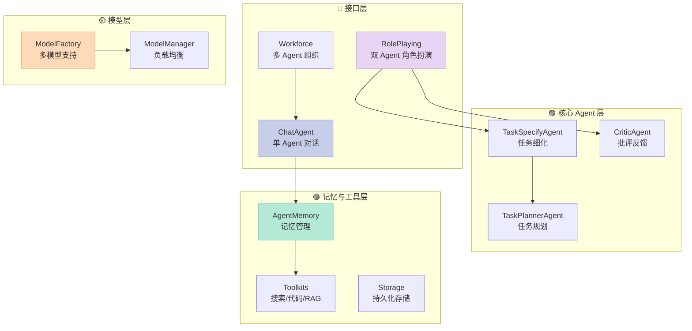
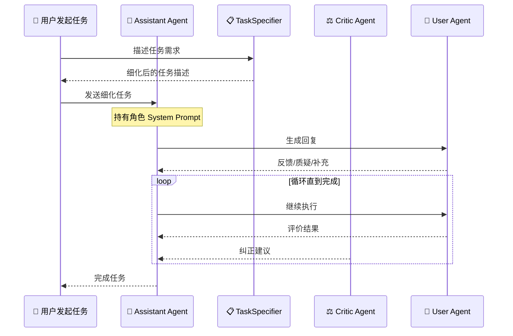
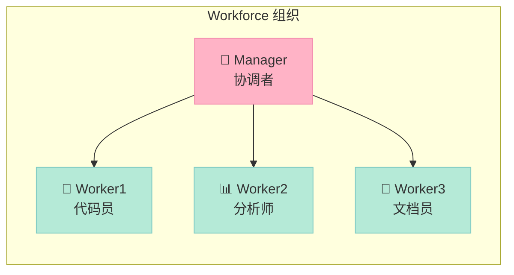

> 多智能体框架琳琅满目，但你是否想过：**让两个 Agent 自己对话、自己协作、自己纠正错误**，不需要人类指挥，就能完成复杂任务？CAMEL 就是这样一款"让 Agent 自己管自己"的框架。本文深度解析其协作机制与架构设计。

<!-- more -->

## 一、引言：为什么需要多智能体协作？

传统的单 Agent 模式像是一个**孤独的专家**：你给它一个任务，它独自完成所有推理和操作。但当任务需要**多样化专业知识**、**交叉验证**或**分工协作**时，单 Agent 的局限性就暴露了——它无法同时扮演多个角色，也缺乏"被质疑"和"被纠正"的反馈机制。

多智能体框架试图解决这个问题。业界已经有了 CrewAI（以角色为核心的编排）、MetaGPT（模拟软件公司分工）。而 **CAMEL** 走了一条更"原生"的路：**让 Agent 通过对话协作，自发地完成任务**。

CAMEL 的核心哲学来自一篇 2023 年的论文 *[CAMEL: Communicative Agents for "Mind" Exploration of Large Scale Language Model Society](https://arxiv.org/abs/2303.17760)*，提出了一种**角色扮演协作协议（Role-Playing Protocol）**。今天，这个框架已拥有 **16,860+ Stars**，是最早也是最成熟的多智能体开源框架之一。

## 二、项目概览

| 维度 | 信息 |
|:---|:---|
| **GitHub** | [camel-ai/camel](https://github.com/camel-ai/camel) |
| **Stars** | 16,860（截至 2026-05-02） |
| **语言** | Python |
| **最近活跃** | 2026-05-01 |
| **定位** | 多智能体协作框架，专注于 Agent Scaling Laws 研究 |
| **核心特性** | Role-Playing、Workforce（多 Agent 组织）、数据生成、Memory、RAG |
| **支持模型** | OpenAI、Anthropic、Azure、HuggingFace、Ollama、VLLM 等 |

## 三、架构设计：分层清晰，模块解耦

CAMEL 的架构分为四大层次：



### 3.1 单 Agent 层：ChatAgent

`ChatAgent` 是 CAMEL 的原子单位。每个 Agent 由以下组件构成：

- **ModelBackend**：底层 LLM 支持（支持多模型负载均衡）
- **AgentMemory**：管理对话历史，支持窗口截断和摘要压缩
- **Tools**：可注册函数工具（SearchToolkit、代码执行等）
- **ResponseTerminator**：任务完成判定器

关键参数：
- `message_window_size`：滑动窗口控制的上下文大小
- `summarize_threshold`：触发摘要压缩的阈值（默认 50%）
- `max_iteration`：防止 Agent 无限循环

### 3.2 协作层：RolePlaying

`RolePlaying` 是 CAMEL 最核心的创新。它将**两个 Agent** 配对：
- **Assistant Agent（助手）**：执行任务
- **User Agent（用户）**：提需求、质疑、补充信息



**Role-Playing 的核心机制**：
1. 任务经过 `TaskSpecifyAgent` 细化，避免模糊指令
2. 两个 Agent 交替对话，互相制约
3. 可选 `CriticAgent` 介入，判断任务完成度
4. 支持 `TaskPlannerAgent` 进行任务拆解规划

### 3.3 组织层：Workforce

当任务需要多个专业角色时，`Workforce` 提供了一个**多 Agent 组织管理**的能力：



Workforce 支持：
- **动态角色分配**：根据任务需求动态增删 Agent
- **层次化汇报**：Worker 向 Manager 汇报，Manager 汇总结果
- **最大规模支持 100 万 Agent**：用于研究 Agent Scaling Laws

## 四、核心机制深度解析

### 4.1 角色系统消息生成

CAMEL 使用 `SystemMessageGenerator` 动态生成角色系统消息。核心逻辑是：**用预定义的提示模板 + 角色名 → 生成结构化的 System Prompt**。

```python
from camel.generators import SystemMessageGenerator

# 定义角色和任务
generator = SystemMessageGenerator()
sys_msg = generator.from_role(
    role_name="Python Programmer",
    role_type="assistant",
    task="开发一个股票交易机器人",
    meta_dict={"language": "中文"}
)
print(sys_msg.content)
```

这解决了什么问题？**传统 Agent 的 System Prompt 通常是静态的**，而 CAMEL 通过生成器让角色定义变得**可组合、可复用**，不同任务可以复用同一角色定义模板。

### 4.2 双 Agent 对话循环

`RolePlaying.step()` 的核心逻辑：

```python
# RolePlaying 的对话循环（简化版）
def step(self, assistant_msg: BaseMessage):
    # 1. User Agent 处理 Assistant 的消息
    user_response = self.user_agent.step(assistant_msg)
    if user_response.terminated:
        return ..., user_response

    # 2. 压缩多消息为单条（减少 token 消耗）
    user_msg = self._reduce_message_options(user_response.msgs)

    # 3. Assistant Agent 处理 User 的反馈
    assistant_response = self.assistant_agent.step(user_msg)
    if assistant_response.terminated:
        return assistant_response, ...

    # 4. 返回双向响应
    return assistant_response, user_response
```

关键设计：**两个 Agent 不是并行执行，而是严格交替**。这确保了对话的连贯性和互相约束。

### 4.3 记忆管理：ScoreBasedContextCreator

CAMEL 的记忆系统使用**基于 token 分数的上下文管理**：

```python
# ChatAgent 的记忆初始化
context_creator = ScoreBasedContextCreator(
    self.model_backend.token_counter,  # 统计 token
    effective_token_limit,              # 模型上下文上限
)
self._memory = ChatHistoryMemory(
    context_creator,
    window_size=message_window_size,
)
```

**记忆压缩策略**：
- 当上下文超过 `summarize_threshold`（默认 50%）时，自动触发摘要
- 使用独立的 `ChatAgent` 作为摘要生成器
- 摘要结果存储在上下文的固定位置，避免无限增长

```python
# 实际使用示例
agent = ChatAgent(
    model=model,
    memory=ChatHistoryMemory(...),
    message_window_size=10,         # 只保留最近 10 条消息
    summarize_threshold=50,         # 超过 50% 上下文触发摘要
)
```

### 4.4 工具调用与执行

CAMEL 支持两种工具类型：

```python
from camel.toolkits import SearchToolkit, FunctionTool

# 方式一：CAMEL 自带 Toolkits
search_tool = SearchToolkit().search_duckduckgo
agent = ChatAgent(model=model, tools=[search_tool])

# 方式二：自定义 FunctionTool
def calculate(x: int, y: int) -> int:
    return x + y

from camel.toolkits import FunctionTool
calc_tool = FunctionTool(func=calculate)
agent = ChatAgent(model=model, tools=[calc_tool])
```

**工具执行流程**：
1. LLM 输出 `tool_call_requests`
2. 判断是内部工具还是外部工具（`external_tools`）
3. 内部工具直接执行，结果写入记忆
4. 外部工具返回请求给调用方（如 Agent 之间互相调用）

### 4.5 完整的 Role-Playing 示例

以下是一个**股票交易机器人**的完整示例，两个 Agent 协作开发：

```python
from camel.models import ModelFactory
from camel.types import ModelPlatformType, ModelType
from camel.societies import RolePlaying
from camel.messages import BaseMessage

# 创建模型
model = ModelFactory.create(
    model_platform=ModelPlatformType.OPENAI,
    model_type=ModelType.GPT_4O,
)

# 初始化角色扮演
role_playing = RolePlaying(
    assistant_role_name="Python Programmer",
    user_role_name="Stock Trader",
    task_prompt="开发一个股票交易机器人，能根据K线数据做简单技术分析",
    with_task_specify=True,      # 启用任务细化
    with_critic_in_the_loop=True, # 启用批评 Agent
    model=model,
)

# 执行对话循环
assistant_msg = BaseMessage.make_user_message(
    role_name="user",
    content="我需要开发一个股票交易机器人，帮我开始吧"
)

for _ in range(10):  # 最多 10 轮对话
    assistant_response, user_response = role_playing.step(assistant_msg)
    print(f"🤖 Assistant: {assistant_response.msgs[0].content}")
    print(f"👤 User: {user_response.msgs[0].content}")

    if assistant_response.terminated:
        print("✅ 任务完成")
        break

    # 继续对话
    assistant_msg = assistant_response.msgs[0]
```

**输出示例**：
```
🤖 Assistant: 好的，我来帮你开发这个股票交易机器人。首先，我需要了解...
👤 User: 好的，我需要它能读取CSV格式的K线数据...
🤖 Assistant: 我来写一个数据加载器...
👤 User: 这个加载器的错误处理还不够完善...
🤖 Assistant: 你说得对，我来优化错误处理...
...
```

## 五、与 CrewAI、MetaGPT 对比

| 维度 | **CAMEL** | **CrewAI** | **MetaGPT** |
|:---|:---|:---|:---|
| **协作模式** | 对话驱动（Agent 间自然语言交流） | 角色编排（固定流程 Pipeline） | SOP 模拟（软件公司分工） |
| **通信机制** | Agent ↔ Agent 直接对话 | Manager → Worker 树状下发 | 消息队列 + 角色队列 |
| **任务分配** | Agent 通过对话协商 | 显式定义 `Task` + `Agent` 绑定 | 结构化 XML 输出强制分工 |
| **反馈机制** | 内置 CriticAgent，多轮对话 | 固定 Callback | 模拟 Code Review |
| **规模扩展** | 支持 100 万 Agent | 数十个 Agent | 数十个 Agent |
| **学习研究** | 专注 Scaling Laws 研究 | 偏产品工程 | 偏自动化流程 |
| **上手难度** | 中等（概念清晰但配置多） | 低（概念简单直观） | 高（需要理解 SOP） |
| **代表性场景** | 开放式协作/研究 | 产品化多角色任务 | 软件开发自动化 |

**核心差异解读**：

1. **通信协议不同**：CrewAI 是"指挥官模式"（Manager 分配任务），CAMEL 是"对话模式"（Agent 之间平等对话）。CAMEL 更接近人类真实的协作方式——通过讨论达成共识，而不是层层下达指令。

2. **架构哲学不同**：MetaGPT 引入 Software Company SOP，要求 Agent 输出结构化 XML（类似 `<!-- SCRDOC: ... -->`）来模拟真实公司的文档流转。CAMEL 则坚持"对话即协作"，不强制特定输出格式，更灵活但也更依赖模型能力。

3. **扩展性定位不同**：CAMEL 设计时就将目标定为"百万级 Agent"，这是为了研究 Scaling Laws。CrewAI 和 MetaGPT 更关注实际工程场景的易用性。

## 六、优缺点分析

| 优点 | 缺点 |
|:---|:---|
| ✅ **协作机制原生**：对话驱动是最接近人类协作的模式，适合开放式任务 | ❌ **无固定流程**：对于结构化流水线任务，不如 CrewAI 直观 |
| ✅ **Memory 设计优秀**：ScoreBased + 摘要压缩，有效控制 token 成本 | ❌ **调试复杂**：双 Agent 对话循环的日志和错误追踪较难 |
| ✅ **研究导向强**：Agent Scaling Laws、Cooperativeness 等前沿研究 | ❌ **上手曲线**：概念多、参数多，新手需要时间理解 |
| ✅ **超大规模支持**：Workforce 可扩展至百万 Agent | ❌ **生产部署**：缺少内置的监控、限流、容灾等企业级特性 |
| ✅ **多模型统一抽象**：ModelFactory + ModelManager 一套接口支持所有模型 | ❌ **CriticAgent 质量依赖模型**：批评Agent的效果受限于底层模型能力 |
| ✅ **工具生态完整**：搜索/RAG/代码解释器/DataLoader 面面俱到 | ❌ **缺乏可视化**：没有像 LangGraph 那样的可视化编排界面 |

## 七、适用场景

**强烈推荐使用 CAMEL**：
- 研究 Agent Scaling Laws，需要模拟大规模 Agent 交互
- 开放式任务（市场研究、创意写作、技术讨论）需要多角度协作
- 需要 Agent 动态协商、分工不固定的自适应任务
- 数据生成任务：CAMEL 原生支持 Synthetic Data 生成

**不推荐 CAMEL**：
- 需要严格流程控制的生产系统（用 CrewAI 或 LangGraph）
- 简单明确定义的任务（单 Agent 即可完成）
- 需要复杂可视化编排界面的团队

## 八、总结与趋势

CAMEL 最大的贡献在于：**证明了"对话协作"可以成为一种通用的多 Agent 协作协议**。它不依赖树状任务分解，不依赖固定 Pipeline，而是让 Agent 通过语言交互自发形成协作——这是更接近人类智能的方式。

当前版本（2026）的几个值得关注的趋势：
1. **与 RAG 深度结合**：Cookbook 中已有 Agentic RAG、Graph RAG 完整示例
2. **多模态 Agent**：文档中提及 Embodied Agent 支持
3. **数据生成工业化**：CoT Data Generation + Unsloth Fine-tuning 端到端方案

CAMEL 适合那些**愿意深入理解框架、追求灵活协作机制**的团队。如果你需要的是开箱即用的多角色流水线，CrewAI 更合适；如果你想模拟一个软件公司的完整 SOP，MetaGPT 更直观。但如果你想探索** Agent 协作的边界和 Scaling Laws**，CAMEL 是目前最好的选择。

---

> 参考资料：[CAMEL GitHub](https://github.com/camel-ai/camel) | [arXiv 论文](https://arxiv.org/abs/2303.17760) | [官方文档](https://docs.camel-ai.org)
