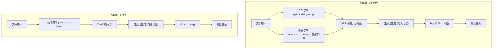

## 引子

过去一年，开源 TTS 领域最火的两款模型非 **IndexTTS** 和 **ChatTTS** 莫属。前者背靠哔哩哔哩，主打情感控制与时长可控；后者来自 2noise 团队，专为对话场景优化。两者都支持中文，但在架构设计、功能侧重、部署门槛上差异显著。本文从部署条件、性能表现、中文支持三个维度做一次深度对比。

<!-- more -->

## 项目简介

### IndexTTS

IndexTTS 是哔哩哔哩开源的工业级零样本 TTS 系统，目前已经迭代到 **IndexTTS2**。其核心创新在于：

- **时长可控**：首创自回归模型的精确时长控制方法，可指定生成 token 数量，适合视频配音等需要音画同步的场景
- **情感与音色解耦**：可独立控制音色（spk_audio_prompt）和情感（emo_audio_prompt 或 8 维情感向量）
- **情感控制多样化**：支持情感向量指定、情感文本描述、随机情感采样三种方式

**仓库**：[https://github.com/index-tts/index-tts](https://github.com/index-tts/index-tts)

### ChatTTS

ChatTTS 是 2noise 团队开源的对话式 TTS 模型，专为 LLM 助手等日常对话场景设计：

- **对话优化**：针对对话式任务专门训练，支持多说话者生成和自然韵律
- **精细韵律控制**：支持笑声（[laugh]）、停顿（[uv_break]/[lbreak]）等特殊 token 控制
- **训练规模大**：主模型使用 10 万+ 小时中英文音频训练，开源版本为 4 万小时微调模型

**仓库**：[https://github.com/2noise/ChatTTS](https://github.com/2noise/ChatTTS)

## 部署条件对比

| 项目 | 硬件要求 | 依赖管理 | 安装难度 |
|------|----------|----------|----------|
| **IndexTTS** | GPU（推荐 CUDA 12.8+，FP16 可降低显存） | 必须使用 uv 包管理器 | 较高（git-lfs、模型下载步骤多） |
| **ChatTTS** | 4GB+ VRAM（30秒音频推理） | pip / conda 均可 | 较低（pip install 即可） |

### IndexTTS 部署要点

```bash
# 1. 安装 git-lfs
git lfs install

# 2. 克隆仓库
git clone https://github.com/index-tts/index-tts.git && cd index-tts
git lfs pull

# 3. 必须使用 uv 安装（官方强烈推荐）
pip install -U uv
uv sync --all-extras

# 4. 下载模型
hf download IndexTeam/IndexTTS-2 --local-dir=checkpoints

# 5. 启动 WebUI
uv run webui.py
```

**显存占用**：官方支持 FP16 推理降低显存，CPU 推理非常慢不推荐。

### ChatTTS 部署要点

```bash
# 方式一：pip 一键安装
pip install ChatTTS

# 方式二：conda
conda create -n chattts && conda activate chattts
pip install -r requirements.txt

# 快速体验
python examples/web/webui.py
```

**显存占用**：30 秒音频片段至少需要 4GB VRAM，RTF（实时因子）约 0.3（RTX 4090 每秒生成约 7 个语义 token 对应音频）。

### 部署门槛小结

> **ChatTTS 部署更简单**，pip 即可完成，对新手友好。IndexTTS 强制要求 uv、对 CUDA 版本有要求，且需要手动下载大模型文件，门槛明显更高。

## 性能对比

### 推理速度

| 模型 | 实时因子（RTF）| 备注 |
|------|---------------|------|
| IndexTTS | 未公开详细数据 | 自回归模型，时长可控但速度可能略慢 |
| ChatTTS | ~0.3（RTX 4090） | 每秒约 7 个语义 token 的音频 |

两者均为自回归 TTS，实时性都不算最优（如 GPT-SoVITS 等的前馈模型更快），但用于配音、对话场景已经足够。

### 语音质量

两者在零样本语音合成的自然度上都达到了较高水准：

- **IndexTTS2**：在情感保真度、说话人相似度上有专项优化，情感表达丰富
- **ChatTTS**：韵律自然，笑声、停顿控制是其亮点，适合对话场景

### 功能维度

| 功能 | IndexTTS | ChatTTS |
|------|----------|----------|
| 零样本音色克隆 | ✅ | ✅ |
| 情感控制 | ✅（多种方式） | ⚠️（仅笑声/停顿） |
| 时长控制 | ✅（精确控制） | ❌ |
| 多说话者 | ✅ | ✅ |
| 流式输出 | 未明确 | ✅ |
| 中文支持 | ✅ | ✅ |
| 英文支持 | ✅ | ✅ |

**关键差异**：IndexTTS 提供精细的情感控制（8 维情感向量、情感文本描述），而 ChatTTS 目前仅支持 `[laugh]`、`[uv_break]`、`[lbreak]` 三种 token 级控制。

## 核心架构对比



**架构差异**：

- IndexTTS 使用 **GPT 潜在表示** 解决高情感下的发音清晰度问题，配合三阶段训练范式
- ChatTTS 使用 **DVAE**（离散变分自编码器）作为音频分词器，配合 Vocos 声码器

## 中文支持对比

### 官方支持情况

| 维度 | IndexTTS | ChatTTS |
|------|----------|----------|
| 官方文档中文 | ✅ 完善 | ✅ 完善 |
| 中文训练数据 | 10 万+ 小时（主模型） | 10 万+ 小时（主模型） |
| 开源版本中文 | ✅ 较好 | ✅ 较好 |
| 拼音控制 | ✅（checkpoints/pinyin.vocab） | ❌ |
| 中混合英 | 支持 | 实验性支持 |

### 实际表现

根据社区反馈：
- **IndexTTS** 中文发音清晰，情感表达丰富，对中文声调的处理较为自然
- **ChatTTS** 中文对话自然度好，但混合语言场景（中文中夹英文）仍是实验性功能

## 使用场景推荐

### 选 IndexTTS 的场景

- 🎬 **视频配音**：需要精确控制语音时长以匹配视频
- 🎭 **情感配音**：需要高兴、悲伤、愤怒等多种情感独立控制
- 🎙️ **音色克隆 + 情感编辑**：参考音频的音色 + 不同参考音频的情感分别控制

### 选 ChatTTS 的场景

- 💬 **对话助手**：为 LLM 助手生成自然对话语音
- 🎙️ **播客/闲聊**：需要停顿、笑声等自然韵律
- 🚀 **快速部署**：想最快速度跑起来，不折腾环境

## 总结

| 对比项 | IndexTTS | ChatTTS |
|--------|----------|---------|
| 部署门槛 | ⭐⭐（较高） | ⭐⭐⭐⭐（简单） |
| 功能丰富度 | ⭐⭐⭐⭐⭐ | ⭐⭐⭐ |
| 情感控制 | ⭐⭐⭐⭐⭐ | ⭐⭐ |
| 时长控制 | ⭐⭐⭐⭐⭐ | ❌ |
| 中文支持 | ⭐⭐⭐⭐ | ⭐⭐⭐⭐ |
| 适合场景 | 配音、情感表达 | 对话助手、闲聊 |

两者定位有显著差异——**IndexTTS 更像一款专业级配音工具**，支持精细的时长和情感控制；**ChatTTS 则像一款对话友好型 TTS**，部署简单、对话自然。选择哪款，取决于你的具体需求。
