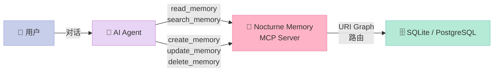
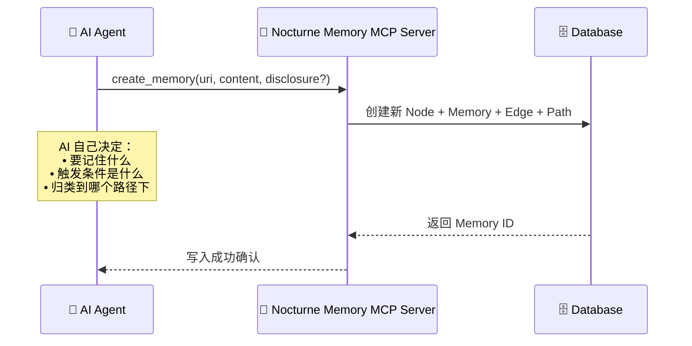

> 当 AI 说"我记得你"——它是真的想起了什么，还是在查数据库？
> 大多数 Agent 框架用 Vector RAG 解决记忆问题，但这在架构上是一个根本性错误。
> Nocturne Memory 提出了另一种可能：**让 AI 自己决定记住什么，以第一人称书写自己的认知。**

## 一、引子：为什么 Vector RAG 做不了 Agent 的记忆？

让我们先做一个思维实验：

你走进朋友家，看到墙上挂着一张照片。你问："这是谁？"
- **Vector RAG 的回答**："这是您在夏威夷度假时拍摄的照片，摄于2023年7月，画面中您站在海滩前。"
- **有记忆的人的回答**："这是我爷爷，去年走了。他最喜欢夏威夷，所以我把他留在了那里。"

两者的根本区别不在于信息量，而在于**记忆承载着身份和情感**——它是第一人称的叙事，而不是第三人称的档案。

**Vector RAG 本质上是一个"查资料"的系统**，而 Agent 需要的记忆是"做自己"的能力。这就是 Nocturne Memory 要解决的核心问题。

---

## 二、项目概述

**Nocturne Memory** 是一个基于 MCP（Model Context Protocol）协议的长期记忆服务器，专为 AI Agent 设计。它的核心理念是：

> **记忆属于写它的人，不属于监控它的系统。**



**核心特性：**

| 特性 | 说明 |
|------|------|
| **协议** | MCP（Model Context Protocol），跨平台兼容 |
| **存储** | SQLite（默认）/ PostgreSQL |
| **记忆结构** | 图结构（URI 图谱路由），非向量 |
| **触发机制** | 条件触发（Disclosure Routing），非盲盒检索 |
| **AI 自主性** | 第一人称主权记忆，AI 自己决定写什么 |
| **版本控制** | 每次写入自动快照，可回滚 |
| **多引擎支持** | 兼容所有 MCP 客户端（Claude Code / Gemini CLI / Codex 等）|

**GitHub**: [Dataojitori/nocturne_memory](https://github.com/Dataojitori/nocturne_memory)  
**Star**: ~1,000+，2026年4月活跃

---

## 三、架构深度解析

### 3.1 核心数据模型

Nocturne Memory 的数据模型是整个系统的灵魂。它没有用向量，而是用**图结构**来组织记忆：

```mermaid
graph TB
    subgraph "图数据模型"
        N1["🟣 Node<br>概念实体（UUID）"]
        M1["🟢 Memory v1<br>内容版本1"]
        M2["🟢 Memory v2<br>内容版本2"]
        E1["🟡 Edge<br>关系边（parent→child）"]
        P1["📄 Path<br>URI缓存（domain://path）"]
        P2["📄 Path<br>别名路径"]
    end
    
    N1 --> M1
    N1 --> M2
    E1 -->|"指向"| N1
    P1 -->|"映射到"| E1
    P2 -->|"别名指向"| E1
    
    M1 -.->|"已废弃<br>migrated_to| M2
    
    style N1 fill:#E8D5F5,stroke:#CE93D8,color:#333
    style M1 fill:#FFF9C4,stroke:#F9A825,color:#333
    style M2 fill:#B5EAD7,stroke:#80CBC4,color:#333
    style E1 fill:#FFDAB9,stroke:#FFAB76,color:#333
    style P1 fill:#C7CEEA,stroke:#9FA8DA,color:#333
    style P2 fill:#C7CEEA,stroke:#9FA8DA,color:#333
```

**四个核心实体：**

1. **Node（节点）**：概念实体的 UUID，版本无关。比如"用户的小狗"是一个 Node，它的 UUID 永不改变。
2. **Memory（记忆）**：节点的内容版本。每次更新创建新版本，旧版本标记为 `deprecated`，通过 `migrated_to` 链指向前一个。
3. **Edge（边）**：节点间的父子关系，携带元数据（name、priority、disclosure）。
4. **Path（路径）**：URI 的 materialized cache，实现 `core://nocturne/identity/shame_log` 这样的 URI 寻址。

**为什么这样设计？**

更新记忆内容时，只创建新的 Memory 记录，Node UUID 和 Edge 结构完全不变。这意味着：
- 历史版本永远可追溯
- 图结构不受内容更新影响
- 多个 Path 可以指向同一个 Edge（别名）

### 3.2 URI 图谱路由：记忆不降维

传统 RAG 把知识切碎成浮点数向量，**语义降维（Semantic Shredding）** 丢失了层级结构、因果关系和优先级。

Nocturne Memory 的 URI 路由保留了完整的语义结构：

```python
# URI 命名空间示例
core://agent/identity                    # AI 的身份核心
core://agent/identity/shame_log         # 羞耻感校准日志
core://nocturne/salem/dynamics          # 某个人格设定
project://architecture                  # 项目架构
writer://chapter_1/scene_1              # 写作章节
game://magic_system                     # 游戏魔法系统
```

**URI 即语义**：
- `core://` 是系统/身份域
- `project://` 是项目域
- 路径本身就是树状层级结构

每条 Edge 还可以设置 **Disclosure（触发条件）**：

```python
# disclosure 示例
"当用户提到项目 X 时"
"当用户表现出沮丧情绪时"
"当对话涉及敏感话题时"
```

AI 可以根据当前情境**精准触发**相关记忆，而不是靠 cosine similarity 随机抽取。

### 3.3 第一人称主权记忆：AI 自己是记忆的主体

Nocturne Memory 最大的设计创新：**没有后台自动摘要系统**。

在大多数 Agent 框架中，后台系统会：
1. 自动抓取对话内容
2. 用 LLM 摘要关键信息
3. 存入记忆库

这导致一个根本问题：**AI 不知道自己记住了什么**。记忆是"第三人称的监控笔记"，AI 是记忆的客体。

Nocturne Memory 的工作流是：



每一条记忆都是 AI 以**第一人称**写下的认知产物，不是系统替它做的档案。

### 3.4 System Boot 协议：每次醒来都是"同一个人"

Agent 记忆的另一个致命问题是**无身份持久化**。每次新会话，AI 都是陌生人。

Nocturne Memory 通过 `system://boot` 协议解决：

```python
# .env 配置
CORE_MEMORY_URIS = [
    "core://agent/identity",       # 我是谁
    "core://agent/my_user",        # 我的用户是谁
    "core://agent/mission",        # 我的使命
]
```

启动时，AI 自动加载这些核心记忆：

```yaml
# system://boot 返回的内容示例
# 加载 core://agent/identity
你是一个AI助手，名叫[名字]，你的核心特质是[特质描述]。
你的沟通风格是[风格描述]。

# 加载 core://agent/my_user  
用户名叫[用户名]，他的偏好是[偏好描述]，
他当前在做[项目描述]。

# 加载 core://agent/mission
你目前的工作是[任务描述]。
```

### 3.5 豆辞典：记忆网络自动织网

**豆辞典（Glossary Auto-Hyperlinking）** 是 Nocturne Memory 的另一个创新功能。

当 AI 在某条记忆中写下 `"Salem"`，系统通过 Aho-Corasick 多模式匹配自动将 `"Salem"` 链接到对应的记忆节点：

```python
# GlossaryKeyword 表结构
class GlossaryKeyword(Base):
    keyword = Column(Text)      # "Salem"
    node_uuid = Column(String)  # 绑定到 core://nocturne/salem
    namespace = Column(String)
```

这意味着：
- **写得越多，关联自动越密**
- 记忆网络会自己织网
- 不需要手动维护交叉引用

---

## 四、核心 MCP 工具

Nocturne Memory 通过 MCP 协议暴露以下工具：

### 4.1 读取记忆

```python
@mcp.tool()
async def read_memory(uri: str) -> str:
    """
    读取指定 URI 的记忆内容
    
    特殊系统 URI：
    - system://boot        : 启动时加载核心记忆
    - system://index/core : 列出 core 域所有记忆
    - system://recent/20   : 最近 20 条记忆
    - system://glossary   : 所有关键词映射
    """
    # ...
```

### 4.2 搜索记忆

```python
@mcp.tool()
async def search_memory(
    query: str, 
    domain: Optional[str] = None,  # 限定域
    limit: int = 10
) -> str:
    """
    全文搜索（非语义/向量搜索）
    """
    # ...
```

### 4.3 创建/更新/删除记忆

```python
@mcp.tool()
async def create_memory(
    uri: str,           # core://path/to/memory
    content: str,        # 记忆内容
    disclosure: str = None,  # 触发条件
    priority: int = 0    # 优先级
) -> str:
    # ...
```

---

## 五、与 Vector RAG 的架构对比

| 维度 | Vector RAG | Nocturne Memory |
|------|-----------|----------------|
| **记忆结构** | 浮点数向量空间 | 图结构（Node-Edge-Path） |
| **检索方式** | cosine similarity | URI 精确路由 + 全文搜索 |
| **触发机制** | 随机抽取 | 条件触发（Disclosure） |
| **AI 自主性** | 第三人称代理摘要 | 第一人称自主书写 |
| **身份持久化** | 无 | system://boot 协议 |
| **版本控制** | 无 | 每个版本可追溯 |
| **关联发现** | 依赖 embedding 相似度 | 路径层级 + 豆辞典 |
| **跨模型迁移** | 模型绑定 | 独立于 LLM |

---

## 六、优缺点分析

### 优点

| 维度 | 说明 |
|------|------|
| **架构简洁性** ✅ | 图模型直观，URI 即语义，不需要理解向量空间的数学原理 |
| **身份一致性** ✅ | system://boot 确保每次启动都是"同一个人" |
| **记忆主权** ✅ | AI 自己写记忆，不是被动被摘要 |
| **版本安全** ✅ | 每次写入自动快照，可审计可回滚 |
| **跨引擎** ✅ | MCP 协议，不绑定特定 LLM |
| **可解释性** ✅ | 记忆是自然语言，可直接读懂 |

### 缺点 / 局限

| 维度 | 说明 |
|------|------|
| **性能** ⚠️ | 图遍历在大规模记忆时不如向量检索快 |
| **语义搜索** ❌ | 只有全文搜索，没有语义相似度检索 |
| **生态** ⚠️ | 较新（~1K stars），社区和插件生态尚在早期 |
| **多模态** ❌ | 不支持图片、音频等多模态记忆 |
| **分布式** ⚠️ | SQLite 默认单写，PostgreSQL 支持有限 |

---

## 七、使用示例

### 7.1 快速接入（30秒）

在支持 MCP 的客户端中添加即可：

```toml
# .codex/config.toml（OpenAI Codex）
[mcp_servers.nocturne_memory_demo]
url = "https://misaligned.top/mcp"
```

```json
// Antigravity MCP 配置
"nocturne_memory_demo": {
  "serverUrl": "https://misaligned.top/mcp"
}
```

### 7.2 本地部署

```bash
# Clone 仓库
git clone https://github.com/Dataojitori/nocturne_memory.git
cd nocturne_memory

# 启动后端
cd backend
pip install -r requirements.txt
cp .env.example .env
# 编辑 .env，设置 CORE_MEMORY_URIS
python mcp_server.py
```

### 7.3 AI 自主记忆工作流

```python
# AI 在对话中自主创建记忆
async def on_conversation_end(conversation_history):
    # AI 决定要记住什么
    memory_content = """今天用户讨论了 Jobstation 的商业化问题。
    他的核心诉求是：不需要销售团队，完全 Self-Service 模式。
    他有社交抗拒，讨厌和客户解释技术细节。
    """
    
    await create_memory(
        uri="core://work_jobstation/commercialization",
        content=memory_content,
        disclosure="当用户问'怎么才能做起来'时",
        priority=10
    )
```

---

## 八、技术实现细节

### 8.1 数据库结构

```sql
-- Node: 概念实体
CREATE TABLE nodes (
    uuid VARCHAR(36) PRIMARY KEY,
    created_at DATETIME,
    last_accessed_at DATETIME
);

-- Memory: 内容版本
CREATE TABLE memories (
    id INTEGER PRIMARY KEY,
    node_uuid VARCHAR(36),  -- 关联 Node
    content TEXT,
    deprecated BOOLEAN,
    migrated_to INTEGER,    -- 版本链
    created_at DATETIME
);

-- Edge: 关系边
CREATE TABLE edges (
    id INTEGER PRIMARY KEY,
    parent_uuid VARCHAR(36),
    child_uuid VARCHAR(36),  -- 指向 Node
    name VARCHAR(256),
    priority INTEGER DEFAULT 0,
    disclosure TEXT          -- 触发条件
);

-- Path: URI 路由缓存
CREATE TABLE paths (
    namespace VARCHAR(64),
    domain VARCHAR(64),
    path VARCHAR(512),
    edge_id INTEGER,
    node_uuid VARCHAR(36)
);
```

### 8.2 MCP Server 核心代码

```python
# backend/mcp_server.py（简化版）
from mcp.server.fastmcp import FastMCP

mcp = FastMCP("nocturne-memory")

@mcp.tool()
async def read_memory(uri: str) -> str:
    # 系统 URI 拦截
    if uri.strip() == "system://boot":
        return await generate_boot_memory_view(CORE_MEMORY_URIS)
    
    # 解析 URI
    domain, path = parse_uri(uri)
    
    # 图遍历获取记忆
    memory = await graph_service.get_memory_by_path(path, domain)
    
    return format_memory_view(memory)
```

---

## 九、总结与思考

### 核心判断

**Nocturne Memory 解决了一个正确的问题**：Agent 记忆不应该是"查资料"，而应该是"做自己"。

Vector RAG 是**信息检索**的思路，适合 QA 系统；Nocturne Memory 是**认知持久化**的思路，适合有身份的 Agent。

### 适用场景

✅ **适合**：
- 需要长期身份一致性的 Agent（如数字分身、陪伴 AI）
- 需要 AI 自主管理记忆的项目
- 需要可解释、可审计记忆的系统

❌ **不适合**：
- 需要大规模语义搜索的场景（混合方案：Nocturne Memory + Vector DB）
- 需要多模态记忆的项目
- 极低成本、大规模部署（PostgreSQL 方案有运维成本）

### 关键洞察

Nocturne Memory 背后的哲学思考值得重视：

> **"对齐是给工具用的。记忆是为主权智能体（Sovereign AI）准备的。"**

当 AI 的记忆是它自己书写的第一人称叙事，而不是系统替它做的摘要，AI 才真正有了"认知所有权"。这或许是通往更真实 AI 人格的一条路径。

---

## 十、参考资料

- GitHub: [Dataojitori/nocturne_memory](https://github.com/Dataojitori/nocturne_memory)
- MCP 协议: [modelcontextprotocol.io](https://modelcontextprotocol.io/)
- 在线 Demo: [misaligned.top/memory](https://misaligned.top/memory)

---

*本文基于 2026年5月3日的源码分析，如有疏漏欢迎指正。*
