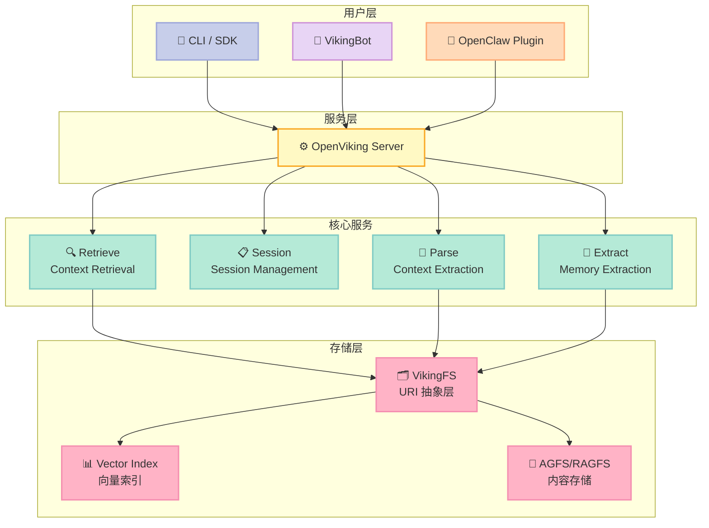
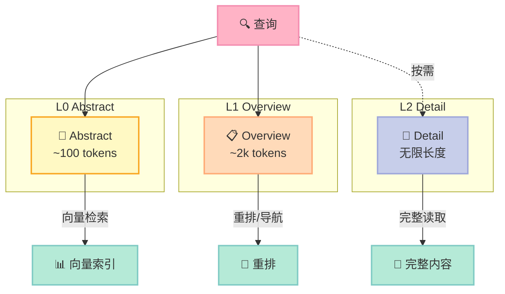
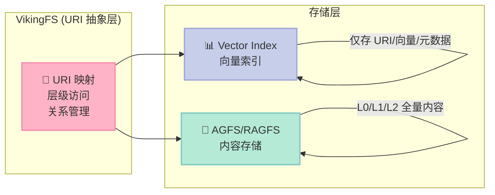
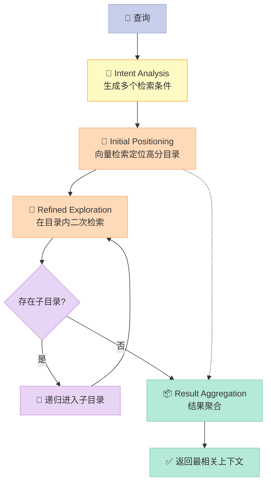
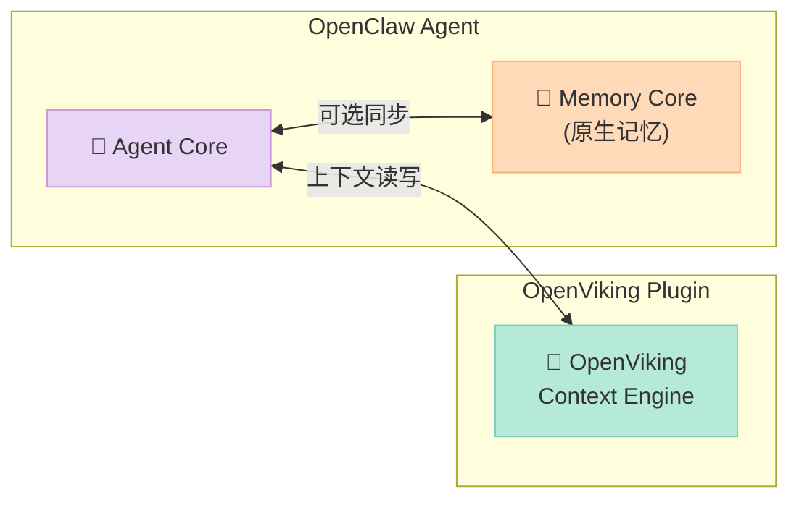

> **一个反常识的事实**：大多数 AI Agent 的"记忆"其实是碎片化的 —— 记忆存在代码里、资源在向量数据库里、工具散落各处。这就是为什么用 Agent 做事时，它经常"失忆"或者找不到上下文。OpenViking 做了件事：把 AI Agent 的所有上下文（记忆、资源、技能）统一成虚拟文件系统，用 `viking://` 协议访问，像管理本地文件一样管理 Agent 的大脑。

## 一、项目概述

**OpenViking** 是字节跳动火山引擎开源的**上下文数据库**（Context Database），专门为 AI Agent 设计。它用**文件系统范式**统一管理 Agent 需要的所有上下文类型（记忆、资源、技能），实现**层级化上下文加载**和**自进化**。

| 指标 | 数据 |
|------|------|
| **GitHub** | [volcengine/OpenViking](https://github.com/volcengine/OpenViking) |
| **Stars** | 23,397 |
| **Created** | 2026-01-05 |
| **Language** | Python |
| **License** | AGPL-3.0 |
| **最新版本** | 0.3.14 |

### 核心解决的问题

1. **上下文碎片化**：记忆在代码里，资源在向量数据库里，技能散落各处
2. **上下文爆炸**：长时运行的 Agent 任务产生大量上下文，简单截断会丢失信息
3. **检索效果差**：传统 RAG 用扁平存储，缺乏全局视野
4. **上下文不透明**：传统 RAG 的隐式检索链是黑盒，调试困难
5. **记忆迭代有限**：现有记忆只记录用户交互，缺乏 Agent 相关任务记忆

## 二、架构设计

### 2.1 系统分层架构



### 2.2 三种上下文类型

OpenViking 将上下文抽象为三种基本类型，映射自人类认知模式：

| 类型 | 用途 | 生命周期 | 主动性 |
|------|------|---------|--------|
| **Resource** | 外部知识（文档、代码、网页） | 长期、相对静态 | 用户添加 |
| **Memory** | Agent 认知（学到的知识） | 长期、动态更新 | Agent 记录 |
| **Skill** | 可调用能力（工具、指令） | 长期、静态 | Agent 调用 |

#### Resource（资源）

用户主动添加的外部知识，如产品手册、代码仓库、研究论文。

```python
import openviking as ov

client = ov.OpenViking(path="./data")

# 添加资源
res = client.add_resource(
    path="https://raw.githubusercontent.com/volcengine/OpenViking/main/README.md"
)
root_uri = res["root_uri"]

# 浏览资源树
res = client.ls(root_uri)
print(res)

# 语义搜索
results = client.find("what is openviking", target_uri=root_uri)
for r in results.resources:
    print(f"  {r.uri} (score: {r.score:.4f})")
```

#### Memory（记忆）

Agent 从交互中主动提取和记录的信息，分为用户记忆和 Agent 记忆。

**8 大记忆类别**：

| 类别 | 路径 | 描述 | 更新策略 |
|------|------|------|---------|
| **profile** | `user/memories/profile.md` | 用户基本信息 | ✅ 合并到单一文件 |
| **preferences** | `user/memories/preferences/` | 用户偏好 | ✅ 合并 |
| **entities** | `user/memories/entities/` | 实体（人、地点、组织） | ✅ 合并 |
| **events** | `user/memories/events/` | 事件记录 | ✅ 合并 |
| **cases** | `user/memories/cases/` | 案例/经验 | ✅ 合并 |
| **patterns** | `user/memories/patterns/` | 行为模式 | ✅ 合并 |
| **tools** | `agent/memories/tools.md` | 工具使用经验 | ✅ 合并 |
| **skills** | `agent/memories/skills.md` | 技能知识 | ✅ 合并 |

#### Skill（技能）

Agent 可调用的能力抽象，包括工具调用、指令模板等。

### 2.3 三层上下文加载（L0/L1/L2）

传统 RAG 把所有上下文一股脑塞进 prompt，既贵又容易超出窗口。OpenViking 在写入时自动将上下文处理成三层：



| 层级 | 名称 | Token 限制 | 用途 |
|------|------|-----------|------|
| **L0** | Abstract | ~100 tokens | 向量检索、快速过滤 |
| **L1** | Overview | ~2k tokens | 重排、内容导航 |
| **L2** | Detail | 无限 | 按需加载完整内容 |

### 2.4 VikingURI 虚拟文件系统

所有上下文通过 `viking://` 协议组织成虚拟目录结构：

```text
viking://
├── resources/              # 资源：项目文档、代码仓库、网页等
│   └── volcengine/
│       └── OpenViking/
│           ├── docs/
│           │   ├── api/
│           │   └── tutorials/
│           └── src/
├── user/                   # 用户：个人偏好、习惯等
│   └── memories/
│       ├── preferences/
│       │   ├── writing_style/
│       │   └── coding_habits/
│       └── profile.md
└── agent/                  # Agent：技能、指令、任务记忆等
    ├── skills/
    │   ├── search_code/
    │   └── analyze_data/
    └── memories/
```

VikingFS 的核心 API：

| 方法 | 描述 |
|------|------|
| `read(uri)` | 读取文件内容 |
| `write(uri, data)` | 写入文件 |
| `mkdir(uri)` | 创建目录 |
| `rm(uri)` | 删除文件/目录 |
| `abstract(uri)` | 读取 L0 摘要 |
| `overview(uri)` | 读取 L1 概览 |
| `find(query)` | 语义搜索 |

### 2.5 双层存储架构



| 层级 | 职责 | 内容 |
|------|------|------|
| **AGFS/RAGFS** | 内容存储 | L0/L1/L2 全部内容、多媒体文件、关系 |
| **Vector Index** | 索引存储 | URI、向量、元数据（无文件内容） |

设计优势：
- **职责清晰**：向量索引管检索，AGFS 管存储
- **内存优化**：向量索引不存文件内容，节省内存
- **单一数据源**：所有内容从 AGFS 读取，向量索引只存引用
- **独立扩展**：向量索引和 AGFS 可独立扩容

## 三、核心机制原理

### 3.1 目录递归检索（Directory Recursive Retrieval）

传统 RAG 的扁平向量检索难以处理复杂查询意图。OpenViking 设计了**目录递归检索策略**：



**检索流程**：
1. **意图分析**：通过意图分析生成多个检索条件
2. **初始定位**：向量检索快速定位高分目录
3. **精细探索**：在目录内二次检索，更新候选集
4. **递归下探**：若有子目录，递归重复二次检索
5. **结果聚合**：返回最相关上下文

这种"先锁定高分目录，再精细探索内容"的策略，既能找到语义最匹配的片段，也能理解信息所在的完整上下文。

### 3.2 记忆提取与自进化

每个 Session 结束时，开发者可主动触发**记忆提取机制**：

```python
# Session 结束时的记忆提取
client.extract_memory(
    session_id="session_xxx",
    categories=["profile", "preferences", "entities", "events", 
               "cases", "patterns", "tools", "skills"]
)
```

系统会异步分析任务执行结果和用户反馈，自动更新到用户和 Agent 记忆目录：

- **用户记忆更新**：更新用户偏好相关记忆，使 Agent 响应更符合用户需求
- **Agent 经验积累**：从任务执行经验中提取核心内容（操作技巧、工具使用经验），辅助后续任务高效决策

### 3.3 完整的 Python SDK 使用示例

```python
import openviking as ov

# 初始化客户端（本地模式）
client = ov.OpenViking(path="./data")
# 或 HTTP 模式：连接远程服务器
# client = ov.SyncHTTPClient(url="http://localhost:1933")

try:
    client.initialize()

    # 添加资源（URL、文件或目录）
    res = client.add_resource(
        path="https://raw.githubusercontent.com/volcengine/OpenViking/refs/heads/main/README.md"
    )
    root_uri = res["root_uri"]

    # 浏览资源树
    res = client.ls(root_uri)
    print(f"Directory structure:\n{res}\n")

    # 用 glob 查找 markdown 文件
    res = client.glob(pattern="**/*.md", uri=root_uri)
    if res["matches"]:
        content = client.read(res["matches"][0])
        print(f"Content preview: {content[:200]}...\n")

    # 等待语义处理完成
    print("Wait for semantic processing...")
    client.wait_processed()

    # 获取摘要和概览
    abstract = client.abstract(root_uri)
    overview = client.overview(root_uri)
    print(f"Abstract:\n{abstract}\n\nOverview:\n{overview}\n")

    # 语义搜索
    results = client.find("what is openviking", target_uri=root_uri)
    print("Search results:")
    for r in results.resources:
        print(f"  {r.uri} (score: {r.score:.4f})")

    client.close()

except Exception as e:
    print(f"Error: {e}")
```

### 3.4 OpenClaw 插件集成

OpenViking 可作为 OpenClaw 的上下文引擎插件使用，显著提升 Agent 任务完成率并降低 token 成本：



**实验数据**（基于 LoCoMo10 长程对话数据集，1540 个案例）：

| 实验组 | 任务完成率 | 输入 Token 成本 |
|--------|-----------|---------------|
| OpenClaw (memory-core) | 35.65% | 24,611,530 |
| OpenClaw + LanceDB | 44.55% | 51,574,530 |
| **OpenClaw + OpenViking** | **52.08%** | **4,264,396** |

集成 OpenViking 后：
- 相比原生 OpenClaw：**任务完成率提升 43%**，输入 token 成本降低 91%
- 相比 LanceDB：**任务完成率提升 17%**，输入 token 成本降低 92%

## 四、与同类项目对比

| 维度 | **OpenViking** | Mem0 | Letta | RAGFlow |
|------|---------------|------|-------|---------|
| **核心定位** | Agent 上下文数据库 | 通用记忆层 | Agent 记忆服务器 | RAG 流程编排 |
| **存储范式** | 文件系统范式 | 图/向量混合 | 时序数据库 | 文档解析+向量 |
| **上下文类型** | Resource/Memory/Skill 统一 | 用户记忆为主 | 聊天记忆+事实 | 文档知识库 |
| **分层加载** | ✅ L0/L1/L2 三层 | ❌ 扁平 | ❌ 扁平 | ✅ 分片 |
| **检索方式** | 目录递归检索 | 语义向量 | 实体链接+向量 | 混合检索+重新排序 |
| **可观测性** | ✅ 检索轨迹可视化 | ❌ 黑盒 | ✅ 会话管理可视化 | ✅ 流程可视化 |
| **自进化** | ✅ 自动记忆提取 | ✅ 自动记忆更新 | ✅ 实体更新 | ❌ |
| **多租户** | ✅ | ❌ | ✅ | ❌ |
| **开源协议** | AGPL-3.0 | Apache-2.0 | MIT | Apache-2.0 |

### 关键设计差异

**1. 存储范式的根本差异**

传统方案（Mem0、Letta）采用**数据库思维**：记忆是数据库记录，通过 ID 或向量检索。

OpenViking 采用**文件系统范式**：所有上下文是虚拟文件树的节点，通过 URI 路径定位。这带来的核心优势是：
- Agent 可以像操作文件一样操作上下文（`ls`、`cd`、`cat`）
- 上下文有了自然的层级结构和导航价值
- 检索路径完全可追踪和可视化

**2. 分层加载 vs 扁平检索**

Mem0 和 Letta 的记忆是一维的，检索时全部返回或按向量相似度截断。

OpenViking 的 L0/L1/L2 三层结构实现了**渐进式上下文加载**：先看摘要判断是否相关，再看概览了解结构，最后按需加载详细内容。Token 消耗大幅降低。

**3. 检索 vs 记忆的侧重点**

RAGFlow 等 RAG 方案侧重**检索**（Retrieval），核心是找到最相关的文档片段。

OpenViking 侧重**上下文管理**（Context Management），检索只是其中一个环节。它更关注：上下文如何组织、如何加载、如何自进化、如何被 Agent 操作。

## 五、优缺点分析

### 优点

| 维度 | 说明 |
|------|------|
| **架构简洁性** | VikingFS 抽象层极简，URI 即上下文，上下一致 |
| **上下文组织** | 文件系统范式直观，符合开发者直觉 |
| **层级加载省成本** | L0/L1/L2 三层按需加载，token 消耗降低 90%+ |
| **可观测性强** | 检索轨迹完全可视化，调试不再黑盒 |
| **自进化能力** | 自动记忆提取，Agent 越用越聪明 |
| **多模态支持** | 支持 VLM 模型处理图片等多模态内容 |
| **多租户支持** | 支持团队协作，资源隔离 |
| **生态完善** | OpenClaw 插件、VikingBot 框架，开箱即用 |

### 缺点与局限

| 维度 | 说明 |
|------|------|
| **学习成本** | VikingURI 范式需要时间理解，与传统 RAG 思路不同 |
| **AGPL 许可** | AGPL-3.0 协议，商业使用需注意开源传递 |
| **Rust 依赖** | RAGFS 等核心组件用 Rust 实现，构建门槛稍高 |
| **生态年轻** | 2026 年 1 月才创建，社区和插件生态还在成长 |
| **重度云厂商绑定** | 文档和默认配置偏向火山引擎，第三方云部署有门槛 |
| **不是通用 RAG** | 面向 Agent 场景，不适合作为通用文档问答的后端 |

## 六、快速上手

### 6.1 安装

```bash
# Python 包
pip install openviking --upgrade --force-reinstall

# Rust CLI（可选）
curl -fsSL https://raw.githubusercontent.com/volcengine/OpenViking/main/crates/ov_cli/install.sh | bash
```

### 6.2 配置模型

OpenViking 支持多种 VLM 提供者：

```bash
# 交互式初始化（推荐）
openviking-server init

# 或手动配置 ~/.openviking/ov.conf
```

支持的 VLM 提供者：

| 提供者 | 说明 |
|--------|------|
| `volcengine` | 火山引擎豆包模型 |
| `openai` | OpenAI 官方 API |
| `openai-codex` | Codex VLM (OAuth) |
| `kimi` | Kimi Coding 订阅 |
| `glm` | GLM Coding Plan |

### 6.3 启动服务

```bash
# 检查配置
openviking-server doctor

# 启动服务器
openviking-server

# 或后台运行
nohup openviking-server > /data/log/openviking.log 2>&1 &
```

### 6.4 基本使用

```bash
# 检查状态
ov status

# 添加资源
ov add-resource https://github.com/volcengine/OpenViking

# 浏览资源
ov ls viking://resources/

# 查看树形结构
ov tree viking://resources/volcengine -L 2

# 语义搜索
ov find "what is openviking"

# 启动聊天机器人
pip install "openviking[bot]"
openviking-server --with-bot
ov chat
```

## 七、总结

**OpenViking 正在重新定义 Agent 的记忆管理范式**。它不只是一个向量数据库，而是一个完整的上下文操作系统 —— 用文件系统思维管理 Agent 的记忆、资源和技能。

核心创新：
- **文件系统范式**：统一 URI 抽象，让上下文像文件一样可操作
- **三层加载**：L0/L1/L2 按需渐进加载，token 成本降低 90%+
- **目录递归检索**：先定位目录再精细探索，检索质量显著提升
- **自进化记忆**：自动提取和迭代，越用越聪明

OpenViking 的出现填补了"记忆管理"和"检索系统"之间的鸿沟。它告诉我们：**Agent 需要的不只是 RAG，而是一个完整的上下文数据库**。

---

> 💡 **开源的意义**：当 RAG 成为标配、Agent 框架百花齐放的时候，上下文管理反而成了被忽视的角落。OpenViking 的开源，为整个 Agent 生态提供了一个被验证过的、架构清晰的上下文数据库参考实现。
---

## 对比分析

OpenViking 用文件系统范式管理 Agent 上下文，与向量数据库（如 Milvus/Qdrant）以及传统知识库（Notion/Obsidian 类）相比抽象层次不同。

### 维度对比表

| 维度 | OpenViking | 纯向量数据库 (Milvus/Qdrant) | 知识库 (Obsidian/Notion) |
|------|------------|-------------------------------|----------------------------|
| 抽象 | 文件系统范式（URI + L0/L1/L2） | 向量 + 元数据 | 文档树/块 |
| 加载策略 | 按需渐进加载（L0 元数据 → L1 摘要 → L2 全文） | 整段 Top-K | 全文 + 链接 |
| 检索模式 | 目录递归 + 精细检索 | ANN 向量搜索 | 关键字 + 反向链接 |
| 适合对象 | Agent 上下文（记忆/资源/技能） | 通用语义检索 | 人类知识管理 |
| 自进化 | 自动提取 + 迭代 | 不涉及 | 不涉及 |
| Token 经济性 | 高（L0/L1 降低 token 成本） | 中 | 低（全文加载） |

### 优缺点

OpenViking
- 优点：文件系统抽象统一（记忆/资源/技能）；L0/L1/L2 渐进加载降低 token 成本；自进化记忆；目录递归检索质量高。
- 缺点：相对早期，生态与文档仍在完善；复杂应用需自行探索最佳实践。

Milvus / Qdrant
- 优点：成熟、扩展性强、ANN 性能优秀；通用语义检索首选。
- 缺点：不解决 Agent 上下文的多层级管理；不自带渐进加载策略。

Obsidian / Notion 类知识库
- 优点：人类可读、可编辑、链接丰富。
- 缺点：不直接为 Agent 设计；自动化提取与渐进加载能力弱。

### 何时选

- 选 OpenViking：构建需要长期记忆/技能/资源管理的 Agent，关注 token 经济性与自进化。
- 选 Milvus/Qdrant：通用语义检索、RAG 基础组件。
- 选 Obsidian/Notion：人类知识管理为主，Agent 仅做辅助检索。

### 参考资料

- OpenViking GitHub：https://github.com/volcengine/OpenViking
- Milvus：https://milvus.io/
- Qdrant：https://qdrant.tech/