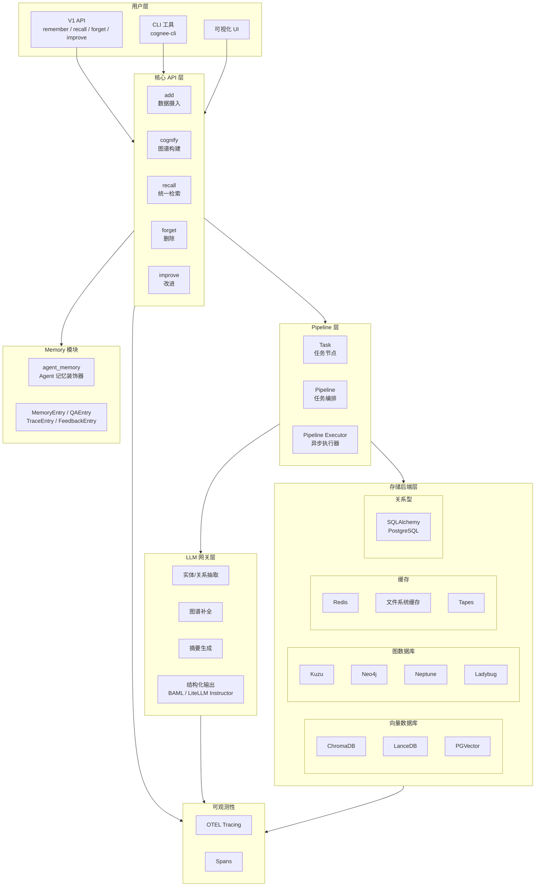
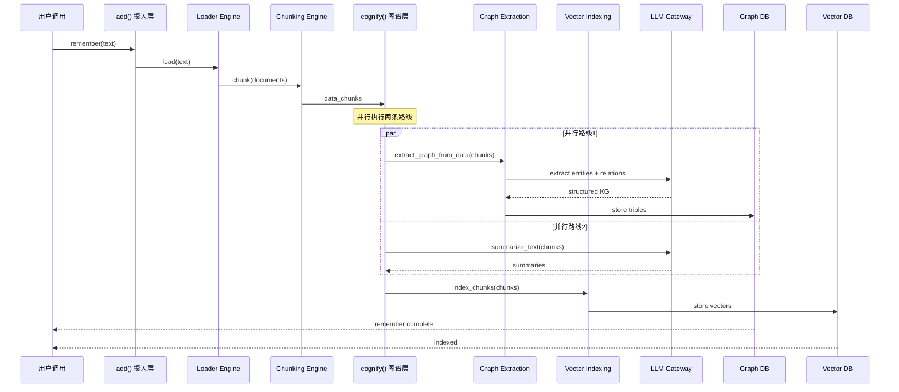
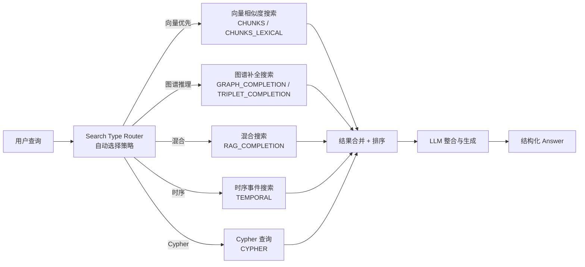
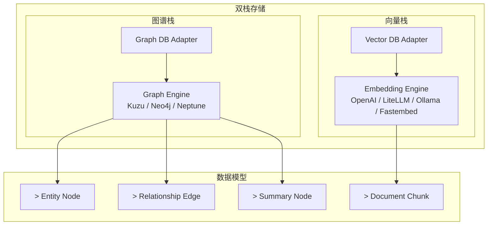

# 【Cognee】Agent 记忆控制平面架构深度解析

## 引子

大模型 Agent 为什么总是"记不住"？这是每一个尝试将 LLM 落地到实际应用场景的开发者都会遇到的灵魂拷问。

传统的做法是在每次推理时把对话历史全部塞进 context——但当对话变长、文档变多、业务数据变得复杂时，这种做法的局限性就暴露出来了：**token 成本飙升、检索效率低下、上下文被稀释**。

解决这个问题的主流思路有两条路：
1. **向量检索 RAG**：把文档切成块（chunk），用 embedding 模型向量化，做相似度搜索
2. **知识图谱**：用 LLM 从文本中抽取实体和关系，构建有结构知识图谱

大多数系统选择其中一条。但 Cognee 的答案是：**两条都要**。

Cognee 是一个开源的 **Memory Control Plane（记忆控制平面）**，它将向量检索与知识图谱融合，为 AI Agent 提供统一的记忆层。它喊出了一句口号：

> "The Brain behind your Agents" — 用 6 行代码让 Agent 拥有记忆。

今天我们来深度解析它的核心架构与设计原理。

---

## 1. 项目概述

**Cognee**（[topoteretes/cognee](https://github.com/topoteretes/cognee)）是一个开源的 Agent 记忆控制平面，Stars 17k+，2026 年 5 月仍有活跃提交（最新 commit: 2026-05-06）。

### 核心定位

Cognee 要解决的核心问题是：**如何让 Agent 高效地存储、检索、组合多种形式的记忆（向量块、图谱节点、时序事件）**，而不需要开发者自己拼接 RAG 管道 + 图数据库 + 缓存层。

### 核心能力

| 能力 | 说明 |
|------|------|
| `remember` | 将数据永久存入知识图谱（add + cognify + improve 全流程） |
| `recall` | 基于查询自动选择最佳检索策略（向量/图谱/混合） |
| `forget` | 删除数据集，模拟"遗忘" |
| `improve` | 用反馈信号持续改进记忆质量 |
| 多后端支持 | 支持 ChromaDB/LanceDB/PGVector（向量）、Kuzu/Neo4j/Neptune（图谱） |

---

## 2. 核心架构

### 2.1 分层架构总览



### 2.2 数据流：remember 全流程

当你调用 `await cognee.remember("Cognee turns documents into AI memory.")` 时，Cognee 内部经历了以下数据流：



### 2.3 recall 检索流程



---

## 3. 核心机制深度解析

### 3.1 Cognify：文档到知识图谱的转化

`cognify` 是 Cognee 最核心的处理函数，它将摄入的原始文档转换为知识图谱：

```python
# cognee/api/v1/cognify/cognify.py
async def cognify(
    datasets: Union[str, list[str]] = None,
    graph_model: BaseModel = KnowledgeGraph,  # 可自定义图谱数据模型
    chunker = TextChunker,
    chunk_size: int = None,
    temporal_cognify: bool = False,
    **kwargs,
):
    # 1. 从数据集加载文档
    # 2. 分块 (chunking)
    # 3. 并行执行：
    #    - extract_graph_and_summarize() → 实体/关系抽取 + 摘要
    #    - extract_events_and_timestamps() → 时序事件提取（可选）
    # 4. 存入 Graph DB + Vector DB
```

关键设计点：**图谱抽取与摘要生成并行执行**，通过 `asyncio.gather` 实现：

```python
# cognee/tasks/graph/extract_graph_and_summarize.py
result_chunks = await asyncio.gather(
    extract_graph_from_data(data_chunks, graph_model, config, ...),  # 图谱路线
    summarize_text(data_chunks, summarization_model),                  # 摘要路线
)
```

### 3.2 recall：自动路由的多策略检索

Cognee 的 `recall` 支持 16 种搜索类型，系统会自动根据查询决定使用哪种策略：

```python
# cognee/modules/search/types/SearchType.py
class SearchType(str, Enum):
    SUMMARIES = "SUMMARIES"                    # 摘要检索
    CHUNKS = "CHUNKS"                          # 纯向量块检索
    RAG_COMPLETION = "RAG_COMPLETION"          # 经典 RAG
    TRIPLET_COMPLETION = "TRIPLET_COMPLETION" # 三元组检索
    GRAPH_COMPLETION = "GRAPH_COMPLETION"      # 图谱补全
    GRAPH_COMPLETION_DECOMPOSITION = "..."     # 分解式图谱补全
    GRAPH_SUMMARY_COMPLETION = "..."           # 摘要+图谱
    CYPHER = "CYPHER"                          # 原生 Cypher 查询
    NATURAL_LANGUAGE = "NATURAL_LANGUAGE"      # 自然语言→图谱
    GRAPH_COMPLETION_COT = "GRAPH_COMPLETION_COT"  # CoT 增强
    TEMPORAL = "TEMPORAL"                      # 时序事件检索
    CODING_RULES = "CODING_RULES"              # 代码规则检索
    CHUNKS_LEXICAL = "CHUNKS_LEXICAL"           # 词法检索
    FEELING_LUCKY = "FEELING_LUCKY"            # 自动选择
```

使用示例：

```python
import cognee
import asyncio

async def main():
    # 存入知识图谱
    await cognee.remember("Cognee 是 Agent 的记忆控制平面")

    # 默认自动路由
    results = await cognee.recall("Cognee 是什么？")
    for result in results:
        print(result.summary, result.score)

    # 指定搜索类型
    results = await cognee.recall(
        "Alice 和 Bob 是什么关系？",
        query_type="GRAPH_COMPLETION"
    )

asyncio.run(main())
```

### 3.3 双栈存储：向量 + 图谱

Cognee 最大的架构特色是**同时维护向量数据库和图数据库**，两者互为补充：



**存储后端支持：**

| 类型 | 支持选项 |
|------|----------|
| 向量数据库 | ChromaDB, LanceDB, PGVector |
| 图数据库 | Kuzu, Neo4j, Neptune, Ladybug |
| 关系型 | PostgreSQL (SQLAlchemy) |
| 缓存 | Redis, 文件系统, Tapes |

### 3.4 Pipeline 架构：Task 节点编排

Cognee 的所有操作（ingestion、cognify、search）都通过 **Pipeline + Task** 机制编排：

```python
# Pipeline 由多个 Task 节点组成，每个 Task 可以：
# 1. 是一个 Python async 函数
# 2. 依赖其他 Task 的输出
# 3. 被条件跳过或并行执行

# 内置 Task 类型示例：
# - extract_graph_from_data: 从 chunk 抽取图谱
# - summarize_text: 生成摘要
# - add_data_points: 存入存储层
# - extract_events_and_timestamps: 时序事件提取
```

Pipeline 执行器支持多种执行模式（`get_pipeline_executor`），可以通过配置切换串行/并行/分布式执行。

### 3.5 Agent Memory：装饰器注入记忆能力

Cognee 提供了一个 `@agent_memory` 装饰器，可以为任意 Python 函数注入记忆能力：

```python
# cognee/modules/agent_memory/decorator.py
@agent_memory
async def support_agent(query: str, context: dict):
    # 自动 recall 相关记忆
    # 自动 remember 新知识
    return response
```

---

## 4. 与同类项目对比

### 4.1 技术路线对比

| 维度 | Cognee | Mem0 | Letta | RAGFlow |
|------|--------|------|-------|---------|
| 存储方式 | 向量 + 图谱双栈 | 向量为主 | 向量 + 关系 | 混合 chunking |
| 图谱构建 | LLM 抽取 | 扁平向量 | 结构化表 | 深度文档解析 |
| 检索策略 | 16 种自动路由 | 简单向量 | 向量 + 过滤 | 混合 + ReRank |
| 多模态 | 支持 | 部分支持 | 部分支持 | 强（文档解析） |
| LLM 依赖 | 强（抽取+补全） | 中 | 强 | 弱（结构提取） |
| 部署复杂度 | 中 | 低 | 高 | 中 |

### 4.2 架构设计差异

**Cognee vs Mem0（记忆层）：**

Mem0 的设计哲学是"**简单即美**"，提供扁平的向量记忆存储，适合个人助手类场景。

Cognee 的设计哲学是"**结构即智能**"，通过 LLM 抽取实体关系构建知识图谱，让 Agent 不仅能检索，还能进行**图上推理**（路径搜索、关系推断）。

关键差异在于 **GRAPH_COMPLETION** 搜索类型——它允许 LLM 在图谱上进行多跳推理：

```python
# Cognee 的图谱补全搜索流程
# 1. 在图谱中找到与查询相关的节点
# 2. 扩展邻居节点（可配置深度）
# 3. 将子图作为 context 传给 LLM
# 4. LLM 基于图结构进行推理生成
```

**Cognee vs Letta（Agent Memory）：**

Letta 的核心是一个**有状态的 Agent 服务**，记忆是 Agent 的副产品。

Cognee 的核心是一个**记忆基础设施**，可以被任何 Agent 框架使用（已集成 OpenClaw、Claude Code）。

---

## 5. 优缺点分析

### 优点

| 维度 | 说明 |
|------|------|
| **架构简洁性** | 统一的 `remember/recall/forget/improve` API，屏蔽了复杂的存储层细节 |
| **扩展性** | 模块化存储后端（插拔式向量库/图库），新增后端仅需实现接口 |
| **多策略检索** | 16 种搜索类型 + 自动路由，无需开发者选择检索策略 |
| **图谱+向量融合** | 同时利用语义相似性和关系结构，检索质量更高 |
| **Agent 无关** | 不绑定特定 Agent 框架，可集成到任何系统中 |

### 缺点

| 维度 | 说明 |
|------|------|
| **LLM 依赖强** | 图谱构建和补全都需要调用 LLM，成本和延迟较高 |
| **运维复杂度** | 需要同时运维向量库 + 图数据库 + 关系型数据库 |
| **学习曲线** | 图谱数据模型、搜索类型的选择需要一定理解 |
| **性能** | 多跳图推理在大型图上可能较慢 |
| **成熟度** | 项目相对年轻（2023年创建），生态还在完善 |

---

## 6. 快速上手

### 安装

```bash
uv pip install cognee
# 或
pip install cognee
```

### 配置 LLM

```python
import os
os.environ["LLM_API_KEY"] = "YOUR_OPENAI_API_KEY"
```

### 基础使用

```python
import cognee
import asyncio

async def main():
    # 存入记忆
    await cognee.remember(
        "Cognee 是一个开源的记忆控制平面，为 AI Agent 提供统一记忆层"
    )
    await cognee.remember(
        "它同时支持向量检索和知识图谱检索两种方式"
    )
    await cognee.remember(
        "Cognee 使用 LLM 从文本中抽取实体和关系构建知识图谱"
    )

    # 检索记忆
    results = await cognee.recall("Cognee 支持哪些检索方式？")
    for r in results:
        print(f"[{r.score:.3f}] {r.summary}")

    # 查看知识图谱
    await cognee.visualize()

    # 遗忘（删除数据）
    await cognee.forget(dataset="main_dataset")

asyncio.run(main())
```

### 使用 CLI

```bash
cognee-cli remember "Cognee 是 Agent 的记忆控制平面"
cognee-cli recall "Cognee 是什么？"
cognee-cli visualize  # 打开可视化界面
cognee-cli forget --all
```

### 自定义图谱数据模型

```python
from pydantic import BaseModel
from typing import List

class MySchema(BaseModel):
    entities: List[str]
    relationships: List[str]

await cognee.cognify(
    data="文档内容...",
    graph_model=MySchema
)
```

---

## 7. 总结与趋势

Cognee 代表了 Agent Memory 领域的一个重要方向：**从扁平的向量存储走向结构化的知识图谱**。它的核心价值在于：

1. **统一 API**：用 `remember/recall/forget/improve` 四个动词抽象了复杂的记忆操作
2. **双栈检索**：向量搜索 + 图谱推理，兼顾语义相似性和结构化关系
3. **可插拔后端**：不绑定特定向量库或图库，企业可按需选择
4. **Pipeline 编排**：灵活的 Task 机制支持自定义处理流程

未来，随着 Agent 应用场景的深化，像 Cognee 这样**兼顾检索速度与推理深度**的记忆基础设施，将变得越来越重要。知识图谱与向量检索的融合，也会成为 Agent Memory 领域的主流架构模式。

---

**项目链接**：https://github.com/topoteretes/cognee
**星标数**：17,000+
**最新活跃**：2026-05-06
