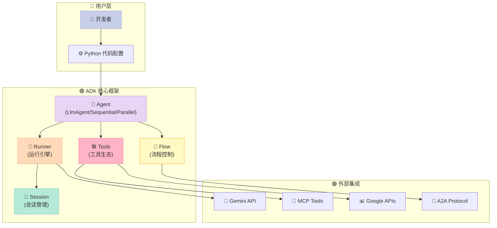
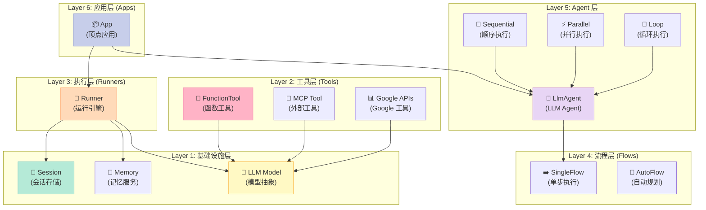
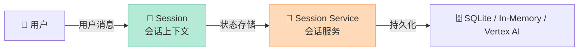
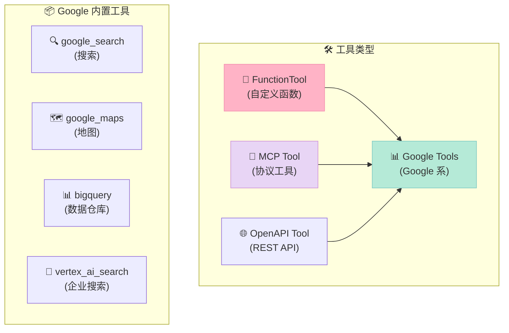
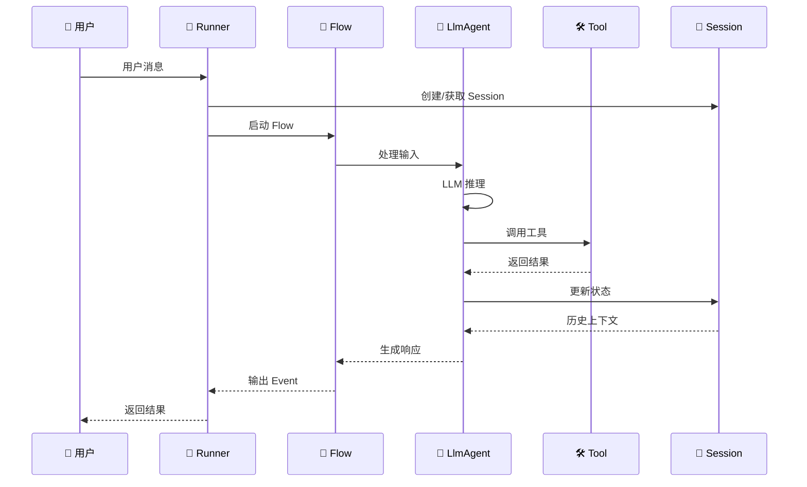
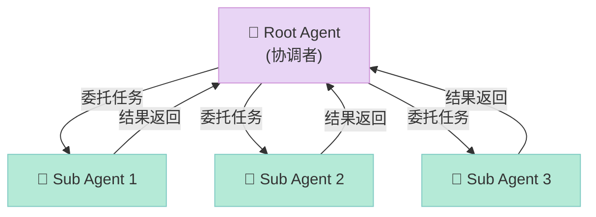
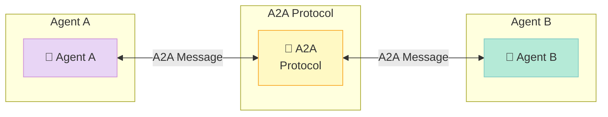
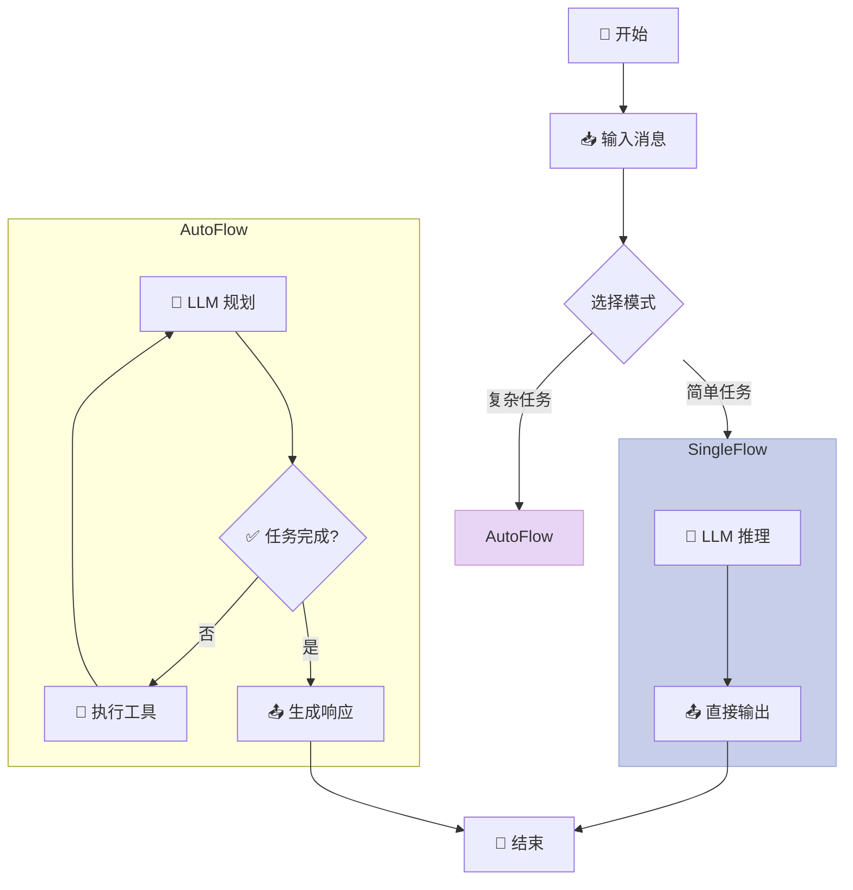
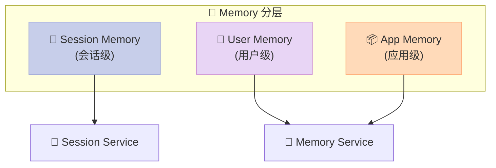

> Google 出手了——一款「代码优先」的 Agent 开发框架，能否撼动 LangChain 的霸主地位？

## 一、引言：为什么 Google 要做 ADK？

如果你用过 LangChain，一定会承认它功能强大，但同时也会吐槽：**概念太多、学习曲线陡峭、调试困难**。每次跑通一个 demo 都感觉像在解谜。

2025 年中，Google 推出了 **Agent Development Kit (ADK)**——一个「代码优先」的 Agent 开发框架。它的核心理念很简单：**用 Python 代码定义 Agent，而不是 YAML 配置**。

今天我们就来深度剖析 Google ADK 的核心架构与设计原理。

## 二、项目概览



**项目信息：**
- **GitHub**: https://github.com/google/adk-python
- **Stars**: 19,514 (截至 2026-05-08)
- **语言**: Python
- **License**: Apache 2.0
- **最新版本**: v1.32.0 (2026-05 活跃更新)

## 三、核心架构解析

### 3.1 分层架构

Google ADK 采用**清晰的六层架构**：



### 3.2 核心组件详解

#### 1. Agent (代理层)

ADK 支持**四种 Agent 类型**：

| Agent 类型 | 说明 | 使用场景 |
|-----------|------|---------|
| `LlmAgent` | 基于 LLM 的基础代理 | 单任务、对话 |
| `SequentialAgent` | 顺序执行多个子代理 | 流水线任务 |
| `ParallelAgent` | 并行执行多个子代理 | 独立任务批量处理 |
| `LoopAgent` | 循环执行直到满足条件 | 迭代优化、探索 |

**代码示例 - 定义单个 Agent：**

```python
from google.adk.agents import Agent
from google.adk.tools import google_search

# 创建单个代理
root_agent = Agent(
    name="search_assistant",
    model="gemini-2.5-flash",  # 支持多种 Gemini 模型
    instruction="你是一个有用的助手。用 Google Search 回答用户问题。",
    description="一个可以搜索网络的助手",
    tools=[google_search]  # 注入工具
)
```

**代码示例 - 定义多 Agent 系统：**

```python
from google.adk.agents import LlmAgent

# 定义子代理
greeter = LlmAgent(
    name="greeter",
    model="gemini-2.5-flash",
    instruction="向用户打招呼并介绍自己"
)

task_executor = LlmAgent(
    name="task_executor", 
    model="gemini-2.5-flash",
    instruction="执行用户请求的具体任务"
)

# 创建协调者代理，通过 sub_agents 组合子代理
coordinator = LlmAgent(
    name="coordinator",
    model="gemini-2.5-flash",
    description="协调问候和任务执行",
    sub_agents=[greeter, task_executor]  # 多代理层级
)
```

#### 2. Runner (运行引擎)

Runner 是 ADK 的**运行时核心**，负责：
- 管理 Agent 的生命周期
- 处理事件循环
- 协调会话状态

```python
from google.adk.runners import Runner
from google.adk.sessions import InMemorySessionService

# 创建会话服务
session_service = InMemorySessionService()

# 创建 Runner
runner = Runner(
    agent=root_agent,
    app_name="my_app",
    session_service=session_service
)

# 运行代理
response = await runner.run(user_message="你好，帮我搜索一下今天的天气")
```

#### 3. Session (会话管理)

ADK 提供**多层会话管理**：



**会话服务类型：**

```python
# 1. 内存会话（开发测试用）
from google.adk.sessions import InMemorySessionService
session_service = InMemorySessionService()

# 2. SQLite 会话（本地持久化）
from google.adk.sessions import SQLiteSessionService
session_service = SQLiteSessionService(db_path="./sessions.db")

# 3. Vertex AI 会话（生产环境）
from google.adk.sessions import VertexAiSessionService
session_service = VertexAiSessionService(project_id="my-project")
```

#### 4. Tools (工具生态)

ADK 的工具系统**极其丰富**：



**自定义工具示例：**

```python
from google.adk.tools import FunctionTool

def get_weather(city: str) -> dict:
    """获取城市天气"""
    # 实际调用天气 API
    return {"city": city, "temperature": "25°C", "weather": "晴朗"}

weather_tool = FunctionTool(
    func=get_weather,
    name="get_weather",
    description="获取指定城市的天气信息"
)

# 在 Agent 中使用
agent = Agent(
    name="weather_assistant",
    model="gemini-2.5-flash",
    tools=[weather_tool]
)
```

### 3.3 数据流与事件机制

ADK 的核心是**事件驱动架构**：



**核心事件类型：**

```python
# 事件定义 (from google.adk.events.event)
class Event:
    type: str  # "text", "tool_call", "tool_response", etc.
    content: Content  # 消息内容
    actions: EventActions  # 执行的动作
    function_calls: List[FunctionCall]  # 函数调用
    function_responses: List[FunctionResponse]  # 函数响应
```

## 四、多 Agent 协作模式

### 4.1 父子 Agent 架构



**代码示例：**

```python
from google.adk.agents import LlmAgent

# 创建专家代理
researcher = LlmAgent(
    name="researcher",
    model="gemini-2.5-flash",
    instruction="你是一个研究助手，负责收集信息"
)

writer = LlmAgent(
    name="writer",
    model="gemini-2.5-flash", 
    instruction="你是一个写作助手，负责整理和撰写"
)

# 创建主编代理
editor = LlmAgent(
    name="editor",
    model="gemini-2.5-flash",
    instruction="你是一个编辑，协调研究和写作",
    sub_agents=[researcher, writer]  # 层级关系
)
```

### 4.2 A2A 协议集成

ADK 支持 **Agent-to-Agent (A2A) 协议**，实现**跨 Agent 系统的通信**：



```python
# A2A 代理调用
from google.adk.tools import transfer_to_agent_tool

# 将任务转交给另一个 Agent
transfer_tool = transfer_to_agent_tool(
    target_agent_name="other_agent",
    target_agent_url="http://other-agent:8000/a2a"
)

agent = Agent(
    name="coordinator",
    tools=[transfer_tool]
)
```

## 五、Flow 机制：Agent 的大脑

Flow 是 ADK 的**核心执行逻辑**，决定 Agent 如何处理输入、调用工具、生成输出。

### 5.1 SingleFlow vs AutoFlow

| Flow 类型 | 说明 | 适用场景 |
|----------|------|---------|
| `SingleFlow` | 单步执行，直接处理 | 简单任务、响应型任务 |
| `AutoFlow` | 自动规划，多步执行 | 复杂任务、需要规划 |



### 5.2 工具调用循环

```python
# ADK 的工具调用循环 (伪代码)
async def run_agent_loop(agent, request):
    while True:
        # 1. LLM 推理
        response = await llm.generate(request)
        
        # 2. 检查是否有函数调用
        if response.function_calls:
            # 3. 执行工具
            for call in response.function_calls:
                result = await execute_tool(call)
                # 4. 将结果反馈给 LLM
                request.add_function_response(call.id, result)
        else:
            # 没有更多工具调用，返回结果
            return response
```

## 六、Memory 与状态管理

### 6.1 多层记忆架构



### 6.2 状态访问示例

```python
from google.adk.sessions.state import State

# 读取状态
async def read_state(context: InvocationContext):
    state = context.state
    user_preference = state.get("user_preference")
    
# 更新状态
async def update_state(context: InvocationContext):
    context.state["last_task"] = "数据分析"
    await context.session.update_state({"last_task": "数据分析"})
```

## 七、与同类框架对比

| 维度 | Google ADK | LangChain | CrewAI | AutoGen |
|------|-----------|-----------|--------|---------|
| **设计理念** | 代码优先 | 配置优先 | Agent 团队 | 对话驱动 |
| **多 Agent** | sub_agents 层级 | LangGraph DAG | Crew 编队 | 对话协作 |
| **工具生态** | Google 全家桶 | 第三方集成 | 基础工具 | Microsoft 集成 |
| **记忆系统** | Session 分层 | Memory 组件 | 基础记忆 | 会话记忆 |
| **学习曲线** | 中等 | 陡峭 | 平缓 | 中等 |
| **生产成熟度** | ⭐⭐⭐⭐ | ⭐⭐⭐⭐⭐ | ⭐⭐⭐ | ⭐⭐⭐⭐ |

**核心差异分析：**

1. **Google ADK vs LangChain**：
   - ADK 用 Python 代码定义 Agent，LangChain 用链式调用
   - ADK 的 Agent 层级更直观，LangChain 的图结构更灵活
   - ADK 与 Google 生态深度绑定，LangChain 模型无关

2. **Google ADK vs CrewAI**：
   - ADK 的 Agent 是通用设计，CrewAI 专为「团队协作」优化
   - ADK 支持更复杂的执行模式（Sequential/Parallel/Loop），CrewAI 相对简单

3. **Google ADK vs AutoGen**：
   - ADK 是单进程框架，AutoGen 支持多进程对话
   - ADK 有内置的评估工具，AutoGen 侧重研究场景

## 八、优缺点分析

### 优点 ✅

| 维度 | 说明 |
|------|------|
| **架构清晰** | 六层架构，模块职责分明，易于理解 |
| **代码即配置** | 用 Python 定义一切，无需 YAML/JSON 配置 |
| **多 Agent 支持** | 内置 Sequential/Parallel/Loop 模式 |
| **工具生态** | Google 全家桶开箱即用 |
| **A2A 协议** | 首个官方支持 A2A 的框架 |
| **评估工具** | 内置 `adk eval` 命令 |
| **多语言支持** | Python/Go/Java/.NET |

### 缺点 ❌

| 维度 | 说明 |
|------|------|
| **Google 强依赖** | 最佳体验需要 Gemini/Vertex AI |
| **社区生态** | 刚起步，示例和文档不如 LangChain 丰富 |
| **自定义局限** | 一些高级功能需要深入源码 |
| **生产案例** | 缺乏大规模生产环境验证 |

## 九、快速入门

### 安装

```bash
pip install google-adk
```

### 完整示例

```python
"""
Google ADK 快速示例：创建天气助手
"""
import asyncio
from google.adk.agents import Agent
from google.adk.tools import FunctionTool
from google.adk.runners import Runner
from google.adk.sessions import InMemorySessionService

# 1. 定义工具
def get_weather(city: str) -> dict:
    """获取城市天气信息"""
    # 实际项目中调用天气 API
    weather_data = {
        "北京": {"temp": "22°C", "weather": "晴"},
        "上海": {"temp": "25°C", "weather": "多云"},
        "深圳": {"temp": "28°C", "weather": "雷阵雨"}
    }
    return weather_data.get(city, {"temp": "未知", "weather": "未知"})

weather_tool = FunctionTool(
    func=get_weather,
    name="get_weather",
    description="获取指定城市的天气"
)

# 2. 创建 Agent
weather_agent = Agent(
    name="weather_assistant",
    model="gemini-2.5-flash",
    instruction="你是一个天气助手。用户询问时，使用 get_weather 工具查询。",
    tools=[weather_tool]
)

# 3. 创建 Runner
session_service = InMemorySessionService()
runner = Runner(
    agent=weather_agent,
    app_name="weather_app",
    session_service=session_service
)

# 4. 运行
async def main():
    response = await runner.run(
        user_id="user_001",
        session_id="session_001", 
        message="北京今天天气怎么样？"
    )
    print(f"响应: {response}")

# 5. 执行
asyncio.run(main())
```

### 运行结果

```text
响应: 北京今天天气怎么样？
根据查询，北京今天的天气是：

🌡️ 温度：22°C
🌤️ 天气：晴

今天天气不错，适合外出！
```

## 十、适用场景

**✅ 强烈推荐使用 Google ADK：**

1. **Google 生态集成** - 已使用 Gemini/Vertex AI/Google Cloud
2. **企业级 Agent 应用** - 需要正式评估和部署流程
3. **多 Agent 协作系统** - 需要层次化的 Agent 管理
4. **代码优先团队** - 偏好用代码而非配置定义逻辑

**⚠️ 考虑其他方案：**

1. **LangChain 更适合** - 需要高度定制、丰富的第三方集成
2. **CrewAI 更适合** - 快速原型、简单的 Agent 团队场景
3. **AutoGen 更适合** - 研究场景、多进程对话系统

## 十一、总结

Google ADK 是一款**设计精良**的 Agent 开发框架：

- **代码优先**理念让调试和测试变得简单
- **清晰的六层架构**使复杂系统易于理解
- **内置的多 Agent 模式**降低了构建协作系统的门槛
- **A2A 协议支持**展现了 Google 在 Agent 互联互通上的野心

但它仍然是**年轻的框架**，生态和社区还在成长。对于已经深度使用 Google 生态的团队，ADK 无疑是最佳选择；对于其他团队，建议先评估学习成本与实际收益。

> **一句话评价**：Google ADK 是「来自大厂的优雅答案」，但不是唯一答案。

---

**相关资源：**
- GitHub: https://github.com/google/adk-python
- 文档: https://google.github.io/adk-docs/
- 示例: https://github.com/google/adk-samples
---

## 对比分析

Google ADK 是大厂出品的 Agent 框架，与 LangGraph（状态图）、CrewAI（角色驱动）在设计哲学与生态策略上有明显区别。

### 维度对比表

| 维度 | Google ADK | LangGraph | CrewAI |
|------|------------|-----------|--------|
| 核心理念 | 代码优先 + 六层架构 + A2A | 状态图（StateGraph） | 角色驱动流水线 |
| 多 Agent 模式 | 内置 Sequential / Parallel / Loop | 通过图编排 | Crew + Task |
| 协议支持 | A2A + MCP | MCP（社区） | MCP（社区） |
| 调试/可观测 | 内置 trace、eval | LangSmith | 较弱 |
| 生态阶段 | 较新（Google 持续投入） | 成熟（LangChain 子项目） | 成熟 |
| 适合场景 | Google 生态团队、生产级 | 复杂状态、长流程 | 角色化内容流水线 |

### 优缺点

Google ADK
- 优点：代码优先理念调试简单；六层架构清晰；内置多 Agent 模式；A2A 原生；Google 持续投入。
- 缺点：生态与社区仍在成长；学习成本取决于 Google 生态熟悉度；非 Google 团队收益较小。

LangGraph
- 优点：状态图表达力极强；持久化、checkpoint、human-in-loop 成熟；LangChain 生态加持。
- 缺点：需理解图论概念；抽象层相对深。

CrewAI
- 优点：角色驱动直观、上手最快；Pythonic。
- 缺点：复杂状态管理与精细流程不如 LangGraph；A2A 等新协议支持依赖社区。

### 何时选

- 选 Google ADK：Google Cloud / Gemini 生态团队、生产级多 Agent、关注 A2A 互联。
- 选 LangGraph：复杂状态、长流程、强 human-in-loop、跨 Python/TS 团队。
- 选 CrewAI：角色化内容流水线、原型优先。

### 参考资料

- Google ADK 文档：https://google.github.io/adk-docs/
- LangGraph：https://langchain-ai.github.io/langgraph/
- CrewAI：https://docs.crewai.com/