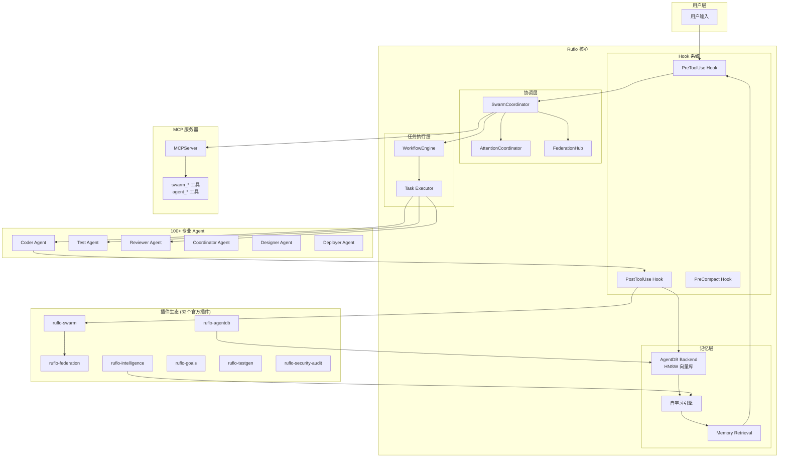
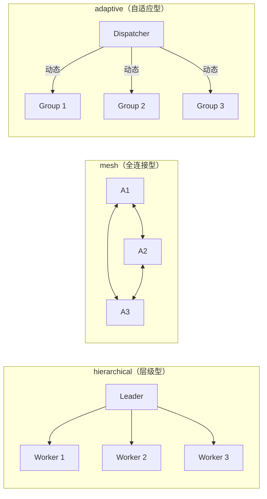
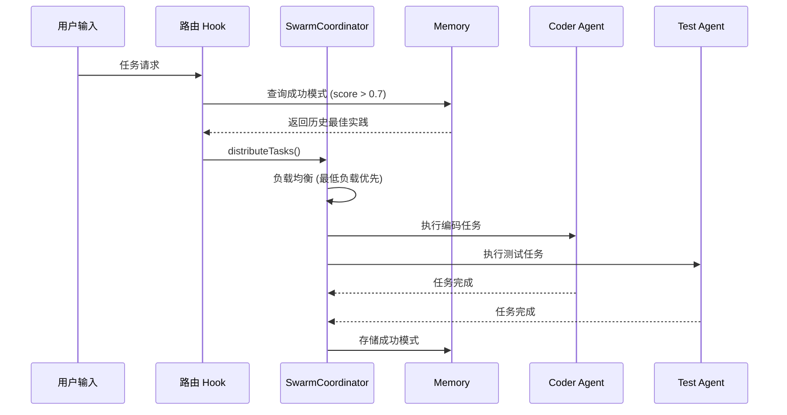
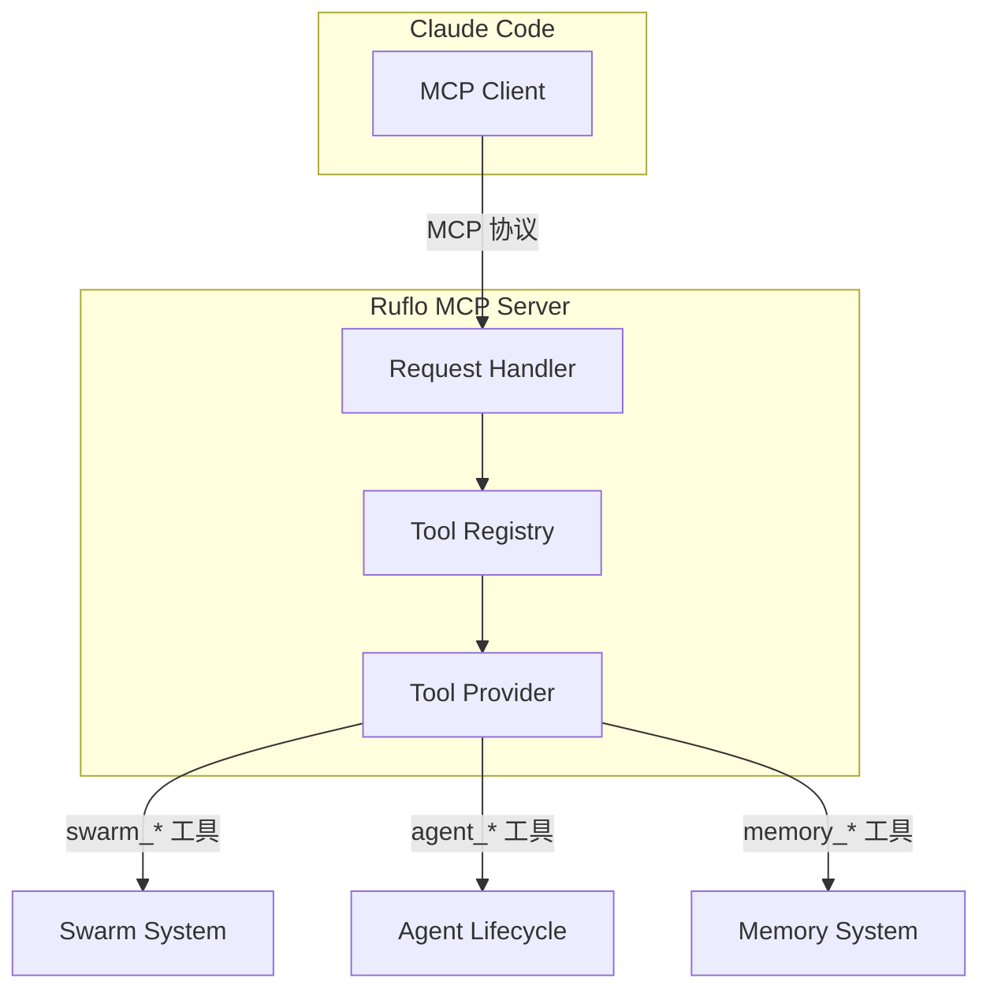

# 【Ruflo】多智能体编排平台核心架构与设计原理深度解析

## 引子

当我们谈论 AI Agent 的生产级落地，最大的挑战往往不是让单个 Agent 足够聪明，而是：**如何让成百上千个专业 Agent 高效协作、自主演进、跨边界安全通信？** 这就是今天要深度分析的项目——**Ruflo**（原 Claude Flow）所解决的问题。

Ruflo 是一个面向 Claude Code 的多智能体编排平台，支持跨机器、跨团队、跨信任边界的 100+ 专业化 AI Agent 协同工作。它凭什么能在短时间内斩获 46,867 颗 GitHub Stars？让我们一探究竟。

<!-- more -->

## 一、项目概览

| 属性 | 值 |
|------|-----|
| **项目名** | Ruflo（原 Claude Flow） |
| **GitHub** | https://github.com/ruvnet/ruflo |
| **Stars** | 46,867（截至 2026-05-09） |
| **语言** | TypeScript |
| **许可证** | MIT |
| **最近更新** | 2026-05-08 |
| **主题** | ai, ai-agents, multi-agent, agentic-ai, claude-code, mcp-server |

Ruflo 最初名为 Claude Flow，由开发者 [rUv](https://ruv.io) 创建。它的核心理念是：**让用户只需正常写代码，Ruflo 在后台自动处理 Agent 协调、任务路由、记忆学习和联邦通信**。

## 二、整体架构

### 2.1 分层架构全景图



### 2.2 核心目录结构

```text
ruflo/
├── v3/                          # V3 核心实现 (TypeScript)
│   ├── src/
│   │   ├── index.ts             # 主入口，导出所有公开 API
│   │   ├── agent-lifecycle/     # Agent 生命周期管理
│   │   ├── coordination/        # 蜂群协调层
│   │   │   └── application/SwarmCoordinator.ts
│   │   ├── memory/              # 记忆系统
│   │   │   ├── domain/Memory.ts
│   │   │   └── infrastructure/AgentDBBackend.ts
│   │   ├── task-execution/      # 任务执行引擎
│   │   │   ├── domain/Task.ts
│   │   │   └── application/WorkflowEngine.ts
│   │   ├── infrastructure/
│   │   │   ├── plugins/         # 插件系统
│   │   │   └── mcp/            # MCP 服务器
│   │   └── shared/types/        # 共享类型定义
│   └── @claude-flow/            # 子包
│       ├── swarm/               # 蜂群系统
│       │   ├── attention-coordinator.ts
│       │   └── federation-hub.ts
│       └── ...
├── plugins/                     # 32 个官方插件
└── bin/                         # CLI 入口
```

### 2.3 核心依赖

Ruflo 的依赖设计非常精巧，核心依赖精简，重量级能力通过可选依赖注入：

```json
{
  "name": "claude-flow",
  "version": "3.7.0-alpha.17",
  "dependencies": {
    "@claude-flow/cli-core": "^3.7.0-alpha.5",
    "@claude-flow/mcp": "^3.0.0-alpha.8",
    "@claude-flow/neural": "^3.0.0-alpha.8",
    "@noble/ed25519": "^2.1.0",        // 加密签名
    "zod": "^3.22.4"
  },
  "optionalDependencies": {
    "@ruvector/attention": "^0.1.3",   // 注意力机制
    "@ruvector/core": "^0.1.30",        // 向量搜索核心
    "agentdb": "^3.0.0-alpha.9"          // Agent 向量数据库
  }
}
```

## 三、蜂群多智能体系统（Swarm Architecture）

### 3.1 SwarmCoordinator 核心设计

蜂群协调器是 Ruflo 的核心大脑，负责管理所有 Agent 的生命周期和任务分发。

```typescript
// v3/src/coordination/application/SwarmCoordinator.ts
export class SwarmCoordinator {
  private topology: SwarmTopology;          // 拓扑类型
  private agents: Map<string, Agent>;       // Agent 注册表
  private agentMetrics: Map<string, AgentMetrics>;  // 指标收集
  private connections: MeshConnection[];    // 连接图
  private eventBus: EventEmitter;           // 事件总线
}
```

### 3.2 四种拓扑模式

Ruflo 支持灵活的蜂群拓扑结构，适应不同场景：

| 拓扑类型 | 描述 | 适用场景 |
|---------|------|---------|
| `hierarchical` | 层级结构，Leader + Workers | 紧密协调的编码任务 |
| `mesh` | 全连接网络 | 分布式协作 |
| `simple` | 简单线性 | 基础测试 |
| `adaptive` | 自适应动态调整 | 复杂任务 |



### 3.3 注意力协调机制（Attention Coordinator）

Ruflo 的 AttentionCoordinator 提供了 6 种注意力机制，针对不同场景进行优化：

```typescript
// v3/@claude-flow/swarm/src/attention-coordinator.ts
export type AttentionType =
  | 'multi-head'   // 标准多头注意力
  | 'flash'        // Flash Attention：2.49x-7.47x 加速, 75% 内存降低
  | 'linear'       // 线性注意力：适合长序列
  | 'hyperbolic'   // 双曲注意力：适合层级数据
  | 'moe'          // 专家混合（Mixture of Experts）
  | 'graph-rope';  // 图感知位置编码
```

这个设计非常精妙：**不是所有场景都需要标准的多头注意力**。Flash Attention 在保持精度的同时带来 7 倍速提升，而 Hyperbolic 注意力则更适合组织架构这类层级数据。

### 3.4 Agent 类型与角色

```typescript
// Agent 类型定义
type AgentType = 'coder' | 'tester' | 'reviewer' | 'coordinator' | 'designer' | 'deployer';
type AgentRole = 'leader' | 'worker' | 'peer';
type AgentStatus = 'active' | 'idle' | 'busy' | 'terminated' | 'error';
```

### 3.5 任务分发与负载均衡



## 四、自学习记忆系统

### 4.1 记忆域模型

```typescript
// v3/src/memory/domain/Memory.ts
export interface Memory {
  id: string;
  agentId: string;
  content: string;
  type: MemoryType;           // 'task' | 'context' | 'event' | 'task-start' | 'task-complete'
  timestamp: number;
  embedding?: number[];      // 向量嵌入
  metadata?: Record<string, unknown>;
}
```

### 4.2 HNSW 向量搜索后端

Ruflo 使用 HNSW（Hierarchical Navigable Small World）算法实现高效的向量相似度搜索：

```typescript
// v3/src/memory/infrastructure/AgentDBBackend.ts
export class AgentDBBackend implements MemoryBackend {
  private dbPath: string;
  private dimensions: number;        // 嵌入维度 (默认 384)
  private hnswM: number;             // HNSW M 参数 (默认 16)
  private efConstruction: number;    // HNSW 构建参数 (默认 200)
  private memories: Map<string, Memory>;

  // HNSW 加速的相似度搜索
  private cosineSimilarity(a: number[], b: number[]): number {
    // ...向量相似度计算
  }

  async vectorSearch(embedding: number[], k: number = 10): Promise<MemorySearchResult[]> {
    // 使用 HNSW 索引加速搜索
    // 性能提升：150x - 12,500x（取决于数据规模）
  }
}
```

**为什么选择 HNSW？** HNSW 是当前最流行的向量索引算法，在精度和速度之间取得了极佳的平衡。相比 FLAT 暴力搜索，HNSW 可以将搜索速度提升 150 倍到 12,500 倍，同时保持 95%+ 的召回率。

### 4.3 自学习流程

```text
1. 任务执行完成
2. 提取成功模式（Pattern Extraction）
3. 生成向量嵌入（Embedding）
4. 存储到 AgentDB（命名空间: patterns）
5. 下次任务时检索相似模式（score > 0.7）
6. 应用成功的模式到新任务
```

这形成了一个完美的**正反馈循环**：Agent 越成功，它学到的模式就越多，未来任务执行就越高效。

## 五、联邦通信系统（Federation）

### 5.1 FederationHub 架构

Ruflo 支持跨机器、跨组织的 Agent 协作，这在企业级场景中极为重要：

```typescript
// v3/@claude-flow/swarm/src/federation-hub.ts
export class FederationHub extends EventEmitter {
  private swarms: Map<SwarmId, SwarmRegistration>;
  private ephemeralAgents: Map<EphemeralAgentId, EphemeralAgent>;

  // 核心功能
  spawnEphemeral(options: SpawnEphemeralOptions): Promise<SpawnResult>;
  sendMessage(message: FederationMessage): Promise<void>;
  reachConsensus(proposal: ConsensusProposal): Promise<boolean>;
}
```

### 5.2 联邦消息类型

```typescript
interface FederationMessage {
  id: string;
  type: 'broadcast' | 'direct' | 'consensus' | 'heartbeat';
  sourceSwarmId: SwarmId;
  targetSwarmId?: SwarmId;
  payload: unknown;
  timestamp: Date;
}
```

### 5.3 零信任安全模型

联邦通信面临的最大挑战是安全。Ruflo 的解决方案：

1. **消息级加密签名**：使用 `@noble/ed25519` 进行签名验证
2. **熔断器机制**：每次调用预算控制（per-call budget circuit breaker）
3. **共识路由**：基于 Raft/Byzantine/Gossip 等共识策略的任务路由
4. **临时 Agent**：跨 Swarm 协作使用临时 Agent，执行完毕后自动销毁

## 六、MCP 服务器集成

### 6.1 MCPServer 实现

Ruflo 实现了完整的 MCP（Model Context Protocol）服务器，为 Claude Code 提供标准化的工具调用接口：



### 6.2 核心 MCP 工具

| 工具名 | 功能 | 命名空间 |
|-------|------|---------|
| `swarm_init` | 初始化蜂群 | swarm |
| `swarm_status` | 获取蜂群状态 | swarm |
| `swarm_shutdown` | 关闭蜂群 | swarm |
| `swarm_health` | 健康检查 | swarm |
| `agent_spawn` | 在蜂群中生成新 Agent | agent |
| `agent_list` | 列出所有 Agent | agent |
| `agent_terminate` | 终止 Agent | agent |
| `agent_metrics` | 获取 Agent 指标 | agent |
| `memory_store` | 存储记忆条目 | memory |
| `memory_search` | 按条件搜索记忆 | memory |
| `memory_vector_search` | 向量相似度搜索 | memory |

## 七、Hook 系统与任务路由

### 7.1 四大 Hook 节点

Ruflo 的 Hook 系统是其"神经中枢"，通过预置的钩子点实现任务的智能路由：

```json
// plugins/ruflo-core/hooks/hooks.json
{
  "hooks": {
    "PreToolUse": [
      {
        "matcher": "Bash",
        "hooks": [{ "type": "command", "command": "cat | npx claude-flow@alpha hooks modify-bash" }]
      },
      {
        "matcher": "Write|Edit|MultiEdit",
        "hooks": [{ "type": "command", "command": "cat | npx claude-flow@alpha hooks modify-file" }]
      }
    ],
    "PostToolUse": [...],
    "PreCompact": [...],
    "Stop": [...]
  }
}
```

| Hook 点 | 触发时机 | 核心用途 |
|--------|---------|---------|
| `PreToolUse` | 工具执行前 | 任务路由、参数修改、权限检查 |
| `PostToolUse` | 工具执行后 | 结果存储、指标记录、成功模式提取 |
| `PreCompact` | 上下文压缩前 | 准备摘要、生成压缩指导 |
| `Stop` | 会话结束时 | 状态导出、指标持久化 |

### 7.2 路由决策流程

```text
PreToolUse (Bash 命令)
    ↓
Hook 拦截分析命令模式
    ↓
查询 Memory (命名空间: patterns)
    ↓
如果存在成功模式 (score > 0.7)
    ↓
应用历史最佳实践
    ↓
继续执行
```

这个设计实现了**零学习成本**的用户体验：用户正常写代码，Ruflo 在后台自动学习和优化。

## 八、插件系统

### 8.1 插件架构

Ruflo 采用**微内核 + 插件**架构，核心保持最小化，功能通过插件扩展：

```typescript
// v3/src/infrastructure/plugins/PluginManager.ts
export interface Plugin {
  id: string;
  name: string;
  version: string;
  dependencies?: string[];
  configSchema?: Record<string, unknown>;
  initialize(config?: Record<string, unknown>): Promise<void>;
  shutdown(): Promise<void>;
  getExtensionPoints(): ExtensionPoint[];
}
```

### 8.2 32 个官方插件一览

| 类别 | 插件 | 功能 |
|------|------|------|
| **核心** | ruflo-core | 核心服务器、健康检查、插件发现 |
| **协调** | ruflo-swarm | 多 Agent 团队协调 |
| **协调** | ruflo-autopilot | 自主循环运行 |
| **协调** | ruflo-loop-workers | 定时后台任务 |
| **协调** | ruflo-workflows | 多步骤任务模板 |
| **联邦** | ruflo-federation | 跨机器安全通信 |
| **记忆** | ruflo-agentdb | HNSW 向量数据库 |
| **记忆** | ruflo-rag-memory | 智能检索、RAG |
| **记忆** | ruflo-rvf | 跨会话记忆保存 |
| **记忆** | ruflo-knowledge-graph | 实体关系图谱 |
| **智能** | ruflo-intelligence | 从成功中学习 |
| **智能** | ruflo-daa | 动态 Agent 行为模式 |
| **智能** | ruflo-ruvllm | 本地 LLM 智能路由 |
| **智能** | ruflo-goals | 目标分解与追踪 |
| **代码** | ruflo-testgen | 自动生成测试 |
| **代码** | ruflo-browser | Playwright 浏览器自动化 |
| **代码** | ruflo-jujutsu | Git diff 分析、风险评分 |
| **代码** | ruflo-docs | 自动文档生成 |
| **安全** | ruflo-security-audit | 漏洞和 CVE 扫描 |
| **安全** | ruflo-aidefence | 提示注入拦截、PII 检测 |
| **DevOps** | ruflo-migrations | 数据库 Schema 变更管理 |
| **DevOps** | ruflo-observability | 结构化日志、追踪、指标 |
| **DevOps** | ruflo-cost-tracker | Token 用量追踪、预算告警 |
| **扩展** | ruflo-wasm | WebAssembly 沙箱 Agent |
| **扩展** | ruflo-plugin-creator | 插件脚手架 |

### 8.3 插件生命周期

```text
Load → Validate Config → Check Dependencies → Initialize → Register Extension Points
                                                              ↓
                                              Shutdown ← Unregister ← Remove Extension Points
```

## 九、工作流引擎

### 9.1 工作流定义

```typescript
// v3/src/task-execution/domain/Task.ts
interface WorkflowDefinition {
  id: string;
  name: string;
  tasks: Task[];
  debug?: boolean;
  rollbackOnFailure?: boolean;  // 失败时回滚
}

interface Task {
  id: string;
  type: TaskType;
  description: string;
  priority: TaskPriority;
  dependencies?: string[];      // 任务依赖
  onExecute?: () => void | Promise<void>;
  onRollback?: () => void | Promise<void>;  // 回滚回调
}
```

### 9.2 执行引擎特性

- **依赖解析**：拓扑排序，循环检测
- **并行执行**：支持任务并行分发
- **回滚支持**：失败时执行 `onRollback`
- **分布式执行**：跨多个 SwarmCoordinator
- **状态持久化**：可恢复的工作流状态

## 十、与同类项目对比

### 10.1 设计哲学差异

| 维度 | **Ruflo** | **CrewAI** | **AutoGen** |
|------|----------|-----------|-------------|
| **架构模式** | 微内核 + 插件 | 单体框架 | 对话驱动 |
| **多 Agent 拓扑** | 4 种（hierarchical/mesh/simple/adaptive） | hierarchical only | 点对点对话 |
| **记忆系统** | HNSW 向量库 + 自学习 | 基础记忆 | 会话记忆 |
| **联邦通信** | 原生支持零信任跨边界 | 不支持 | 不支持 |
| **注意力机制** | 6 种可插拔 | 无 | 无 |
| **Hook 系统** | 4 大节点 + matcher | 有限 | 回调 |
| **插件生态** | 32 个官方插件 | 社区插件 | 社区扩展 |

### 10.2 核心差异分析

**1. 架构哲学：插件化 vs 单体化**

Ruflo 的微内核设计意味着：**你可以只安装需要的插件**，而不是被整个框架绑架。CrewAI 和 AutoGen 则更偏向单体式设计，虽然更"一体化"，但灵活性受限。

**2. 记忆系统：HNSW 向量搜索 vs 简单存储**

Ruflo 的 AgentDB 使用 HNSW 算法实现高效的向量相似度搜索，这在处理大规模记忆时至关重要。相比之下，CrewAI 的记忆系统更简单，适合小规模场景。

**3. 联邦通信：跨边界协作的缺失**

这是 Ruflo 最独特的优势。当企业需要跨团队、跨机器、甚至跨组织协作时，Ruflo 的 FederationHub 提供了原生支持。CrewAI 和 AutoGen 完全不具备这个能力。

**4. 注意力机制：可插拔的注意力策略**

Ruflo 的 AttentionCoordinator 支持 6 种注意力策略，包括 Flash Attention（7 倍速提升）和 Hyperbolic Attention（适合层级数据）。这是 Ruflo 独有的创新。

## 十一、优缺点总结

### 优点

| 维度 | 说明 |
|------|------|
| **架构简洁性** | 微内核 + 插件设计，核心保持最小化，32 个插件按需加载 |
| **扩展性** | 插件系统支持自定义扩展点，新功能无需修改核心 |
| **易用性** | 一行命令 `npx ruflo init` 即可完成所有配置 |
| **自学习能力** | 从成功中自动学习，score > 0.7 的模式会被复用 |
| **联邦安全** | 零信任模型 + 加密签名 + 熔断器，跨边界协作安全 |
| **MCP 集成** | 完整的 MCP 协议实现，与 Claude Code 无缝集成 |

### 缺点

| 维度 | 说明 |
|------|------|
| **复杂度** | 100+ Agent + 32 插件 + 4 种拓扑，学习曲线陡峭 |
| **维护性** | 活跃开发中（最新更新 2026-05-08），API 可能有 Breaking Changes |
| **资源消耗** | 100+ Agent 并行运行，内存和 Token 消耗不可忽视 |
| **文档完整性** | 大量 Alpha 版本依赖，部分功能文档不够详细 |

## 十二、快速上手

### 12.1 安装

```bash
# CLI 完整安装（一行命令）
curl -fsSL https://cdn.jsdelivr.net/gh/ruvnet/ruflo@main/scripts/install.sh | bash

# 或通过 npm 全局安装
npm install -g ruflo@latest

# 快速初始化
npx ruflo@latest init wizard
```

### 12.2 MCP 服务器配置

```bash
# 在 Claude Code 中添加 Ruflo MCP 服务器
claude mcp add ruflo -- npx ruflo@latest mcp start
```

### 12.3 插件安装示例

```bash
# 通过 Claude Code 插件管理器安装
/plugin marketplace add ruvnet/ruflo
/plugin install ruflo-core@ruflo
/plugin install ruflo-swarm@ruflo
/plugin install ruflo-federation@ruflo
```

### 12.4 代码示例：使用 Swarm SDK

```typescript
// 创建蜂群并添加 Agent
import { SwarmCoordinator, AgentConfig } from '@claude-flow/swarm';

const coordinator = new SwarmCoordinator({
  topology: 'hierarchical',
  maxAgents: 10,
});

// 创建一个 Coder Agent
const coderConfig: AgentConfig = {
  name: 'my-coder',
  type: 'coder',
  role: 'worker',
  capabilities: ['write-code', 'refactor', 'review'],
};

const coder = await coordinator.spawnAgent(coderConfig);
console.log(`Coder Agent spawned: ${coder.id}`);

// 分发任务
const result = await coordinator.executeTask(coder.id, {
  description: 'Implement user authentication',
  priority: 'high',
});

// 获取结果
console.log(`Task result: ${result.status}`);
```

## 十三、总结与趋势

### 13.1 核心价值

Ruflo 成功地将**多智能体协作**从理论带入生产环境。它的核心创新在于：

1. **蜂群思维**：不是让一个 Agent 干所有事，而是让专业 Agent 干专业事
2. **自学习机制**：从成功中自动提取模式，持续优化
3. **零信任联邦**：跨边界协作变得安全可控
4. **可插拔注意力**：根据场景选择最优注意力策略

### 13.2 适用场景

- ✅ **大型代码库**：需要多个专业 Agent（编码、测试、Review、部署）协作
- ✅ **企业级 AI**：跨团队、跨机器的安全协作
- ✅ **复杂工作流**：需要任务分解、执行、回滚的自动化流程
- ✅ **追求极致的开发效率**：愿意投入时间学习陡峭的曲线

### 13.3 不适用场景

- ❌ **简单任务**：单个 Agent 足以完成的任务
- ❌ **资源受限环境**：内存和 Token 预算有限
- ❌ **追求稳定**：无法接受 Alpha 版本的 Breaking Changes

### 13.4 未来趋势

随着 AI Agent 从"单 Agent"向"多 Agent 协作"演进，Ruflo 代表的**编排平台**将成为不可或缺的基础设施。其插件化架构、自学习能力和联邦通信设计，都指向一个方向：**未来的 AI 系统，将是自主协作、自我进化的智能体网络**。

---

**相关链接：**
- GitHub：https://github.com/ruvnet/ruflo
- 官网：https://flo.ruv.io/
- 目标规划：https://goal.ruv.io/
---

## 对比分析

Ruflo（来自 ruvnet）是多 Agent 编排平台，主打"自学习 + 联邦通信 + 插件化"，与 Microsoft AutoGen、OpenAI Agents SDK 在编排架构与目标用户上差异较大。

### 维度对比表

| 维度 | Ruflo | Microsoft AutoGen | OpenAI Agents SDK |
|------|-------|-------------------|--------------------|
| 编排模型 | 工作流引擎 + 自学习 + 联邦 | 群聊 + 用户代理 | Handoff + Guardrails |
| 自学习 | 内置（Self-Learning / SPADE） | 较弱 | 不涉及 |
| 联邦/分布式 | 设计目标 | 不强调 | 不涉及 |
| 目标用户 | 企业级 + 复杂工作流 | 企业级 / 研究 | 生产项目 |
| 协议支持 | MCP + 自有 | MCP + A2A | MCP + 自有 |
| 稳定性 | Alpha，Breaking Changes 多 | 较稳定 | 稳定 |

### 优缺点

Ruflo
- 优点：插件化架构；自学习能力；联邦通信设计；适合复杂工作流与跨机器协作。
- 缺点：Alpha 阶段，Breaking Changes 较多；学习曲线陡；不适合轻量场景。

AutoGen
- 优点：微软支持、群聊模式成熟；企业级特性多。
- 缺点：自学习能力弱；联邦/分布式非核心。

OpenAI Agents SDK
- 优点：Handoff 模式直观；MCP 原生；安全护栏内建；上手快。
- 缺点：聚焦 OpenAI 模型；自学习/联邦不在范围。

### 何时选

- 选 Ruflo：跨机器/跨团队的复杂工作流编排、愿意承受 Alpha 不稳定性。
- 选 AutoGen：企业级多 Agent 对话、研究/灵活协作。
- 选 OpenAI Agents SDK：需要 Handoff + Guardrails 的生产项目，OpenAI 生态。

### 参考资料

- Ruflo GitHub：https://github.com/ruvnet/ruflo
- AutoGen 文档：https://microsoft.github.io/autogen/
- OpenAI Agents SDK：https://github.com/openai/openai-agents-python