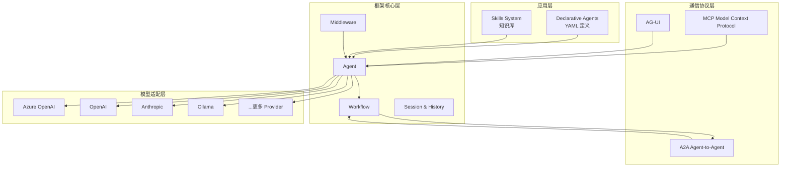
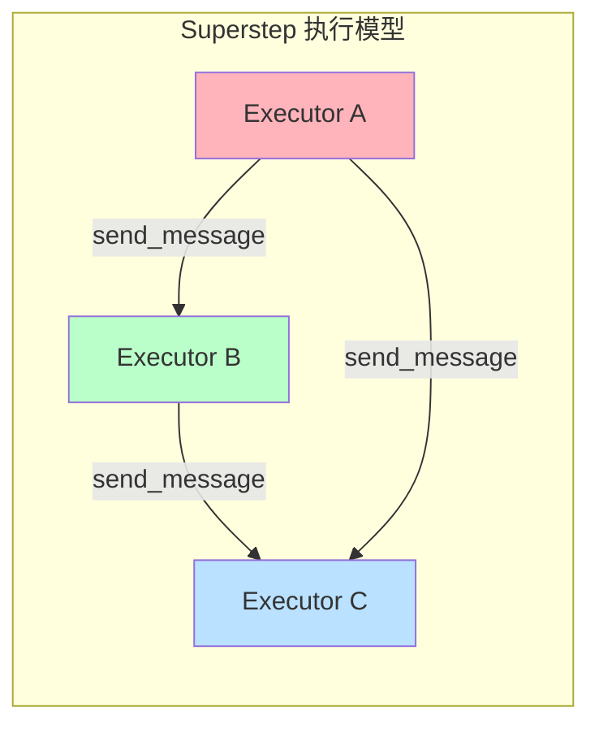
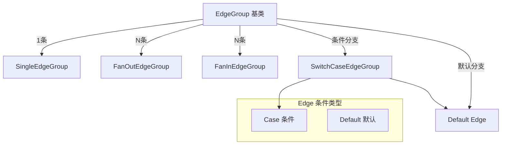
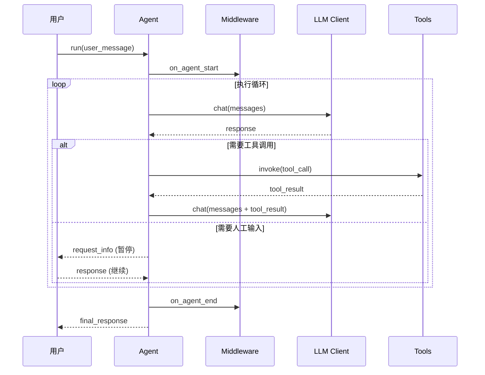

# Microsoft Agent Framework 核心架构与设计原理深度解析

## 引子

在企业级 AI Agent 开发领域，Microsoft 再次出手。2025年中，Microsoft 正式发布了 **Microsoft Agent Framework**（简称 MAF），一个开源、生产级的 AI Agent 与多 Agent 工作流框架，同时支持 **Python** 和 **.NET/C#** 两种语言生态。

这不仅仅是又一个 Agent 框架——MAF 的设计目标非常明确：**让团队从原型快速走向生产环境**。它提供了图式工作流、Checkpoint/恢复、中间件管道、观测性（OpenTelemetry）等企业级特性，同时保持了架构的开放性，不绑定特定 LLM 提供商。

本文将深度解析 MAF 的核心架构设计。

<!-- more -->

## 1. 项目概览

| 指标 | 数据 |
|------|------|
| GitHub | [microsoft/agent-framework](https://github.com/microsoft/agent-framework) |
| 语言 | Python + .NET/C# |
| Stars | 10,294 |
| 最新推送 | 2026-05-08 |
| 定位 | 企业级生产 Agent 与多 Agent 工作流框架 |

**核心特性：**
- Python / C# 双语言支持，API 一致
- 多 LLM Provider 支持（Azure OpenAI、OpenAI、Anthropic、Ollama 等）
- **图式工作流**（Pregel-like 模型）：顺序、并发、Handoff、Group Collaboration
- **Checkpointing**：工作流暂停/恢复，支持进程重启
- **中间件管道**：请求/响应拦截，异常处理，自定义管道
- **Human-in-the-loop**：支持在执行过程中暂停等待人工输入
- **Time-travel**：回溯到历史状态继续执行
- **Declarative Agents**：YAML 声明式定义 Agent
- **Skills 系统**：领域知识库，文件/代码/库多来源
- **OpenTelemetry 集成**：分布式追踪、监控、调试
- **A2A 协议支持**：Agent-to-Agent 通信协议

## 2. 核心架构

MAF 的架构分为四层：



### 2.1 Agent 层

Agent 是 MAF 的核心执行单元。一个 Agent 包含：

- **Instructions**：系统指令（角色、行为规范）
- **Tools**：可调用的工具集（Function Tool、MCP Tool）
- **Client**：LLM 通信客户端（可插拔）
- **Middleware**：中间件管道

```python
from agent_framework import Agent
from agent_framework import FoundryChatClient
from azure.identity import AzureCliCredential

# 创建 Agent
agent = Agent(
    client=FoundryChatClient(
        credential=AzureCliCredential(),
    ),
    name="HaikuAgent",
    instructions="你是一个活泼的助手，文笔优美。",
)

# 运行 Agent
result = await agent.run("写一首关于 AI Agent 的俳句")
print(result)
```

### 2.2 Workflow 层——图式执行引擎

MAF 的 Workflow 是一个**有向图执行引擎**，采用类 Pregel 模型。核心概念：



**关键类：**

- **Executor**：图中节点，负责执行具体逻辑
- **EdgeGroup**：连接节点的边，支持条件分支
- **Workflow**：执行引擎，运行 superstep 直到图 idle

```python
from agent_framework import Executor, WorkflowBuilder, WorkflowContext, handler

# 定义 Executor
class UpperCaseExecutor(Executor):
    @handler
    async def process(self, text: str, ctx: WorkflowContext[str]) -> None:
        await ctx.send_message(text.upper())

class ReverseExecutor(Executor):
    @handler
    async def process(self, text: str, ctx: WorkflowContext[str]) -> None:
        await ctx.yield_output(text[::-1])  # 输出到工作流

# 构建工作流
upper = UpperCaseExecutor(id="upper")
reverse = ReverseExecutor(id="reverse")

workflow = (
    WorkflowBuilder(start_executor=upper)
    .add_edge(upper, reverse)  # 顺序边
    .build()
)

# 执行
events = await workflow.run("hello")
print(events.get_outputs())  # ['OLLEH']
```

### 2.3 支持的 Edge 类型

MAF 提供了丰富的边类型：



| Edge 类型 | 用途 |
|-----------|------|
| `SingleEdgeGroup` | 一对一顺序执行 |
| `FanOutEdgeGroup` | 一对多并发分发 |
| `FanInEdgeGroup` | 多对一结果聚合 |
| `SwitchCaseEdgeGroup` | 条件分支路由 |
| `InternalEdgeGroup` | 内部边（子工作流） |

### 2.4 中间件管道

MAF 实现了**洋葱模型中间件**，支持在 Agent 执行链路中插入拦截逻辑：

```python
from agent_framework import Agent, Middleware

class LoggingMiddleware(Middleware):
    async def on_agent_start(self, context, next_handler):
        print(f"Agent 开始执行: {context.agent_name}")
        return await next_handler(context)
    
    async def on_agent_end(self, context, response, next_handler):
        print(f"Agent 执行完成，响应: {response}")
        return await next_handler(context)

agent = Agent(
    name="MyAgent",
    instructions="你是一个有帮助的助手。",
    middleware=[LoggingMiddleware()],
)
```

中间件类型：
- `on_agent_start` / `on_agent_end`
- `on_tool_call` / `on_tool_result`
- `on_llm_request` / `on_llm_response`
- `on_error`

## 3. 核心机制深度解析

### 3.1 Agent 执行循环



### 3.2 Checkpointing 机制

MAF 的 Workflow 支持**状态快照与恢复**，这是企业级生产环境的关键特性：

```python
from agent_framework import WorkflowBuilder
from agent_framework._workflows import CheckpointStorage

# 配置 Checkpoint 存储
storage = CheckpointStorage()  # 可对接 Redis / 文件等

workflow = WorkflowBuilder(
    start_executor=agent,
    checkpoint_storage=storage,  # 启用 checkpointing
).build()

# 执行中自动保存每个 superstep 的状态
result = await workflow.run(user_input)

# 暂停后恢复
result = await workflow.run(
    checkpoint_id="checkpoint_123",
    checkpoint_storage=storage,
)
```

**Checkpoint 包含：**
- 所有 Executor 的内部状态
- 传输中的消息
- 共享状态（WorkflowContext）

### 3.3 Human-in-the-loop

当 Agent 需要人工输入时，执行会暂停并返回 `request_info` 事件：

```python
class ApprovalExecutor(Executor):
    @handler
    async def process(self, request: str, ctx: WorkflowContext) -> None:
        # 请求人工审批
        await ctx.request_info(
            message="是否批准此操作？",
            response_type="boolean",
        )
    
    async def response_handler(self, response: bool) -> None:
        # 处理人工响应
        if response:
            await ctx.yield_output("操作已批准")
        else:
            await ctx.yield_output("操作已拒绝")
```

工作流执行到 `request_info` 时进入 `IDLE_WITH_PENDING_REQUESTS` 状态，等待外部调用者通过 `run(responses=...)` 继续：

```python
# 继续执行（传入人工响应）
result = await workflow.run(
    responses={"ApprovalExecutor": True}  # 批准
)
```

### 3.4 Session 与 History

MAF 提供了完善的会话管理：

```python
from agent_framework import AgentSession, InMemoryHistoryProvider

session = AgentSession(
    history_provider=InMemoryHistoryProvider(),
    conversation_id="conv_123",
)

agent = Agent(
    name="ChatAgent",
    instructions="你是客服助手。",
    session=session,
)

# 自动管理对话历史，支持上下文压缩
result = await agent.run("我想退款")
result = await agent.run("退到哪张卡？")  # 自动携带上文
```

**历史压缩策略**（Compaction）：
- Token 数量超限时自动压缩/摘要
- 可自定义压缩策略

## 4. 与同类框架对比

| 维度 | Microsoft Agent Framework | LangGraph | AutoGen |
|------|--------------------------|------------|---------|
| **语言** | Python + .NET | Python | Python |
| **工作流模型** | 图式（Pregel-like） | 状态图 | 对话协作 |
| **Checkpoint** | ✅ 原生支持 | ✅ 手动配置 | ❌ 不支持 |
| **多语言 SDK** | ✅ Python + C# | ❌ 仅 Python | ❌ 仅 Python |
| **中间件** | ✅ 洋葱模型 | ❌ | ❌ |
| **HIL** | ✅ 原生支持 | ⚠️ 需自行实现 | ✅ 有限支持 |
| **时间回溯** | ✅ 支持 | ❌ | ❌ |
| **A2A** | ✅ 内置 | ❌ | ❌ |
| **企业特性** | OpenTelemetry、Declarative Agent | 基础 | 基础 |

### 5.1 架构简洁性 vs 扩展性

**左侧（简洁/扩展）：**
- WorkflowBuilder 的 Fluent API 使用直观，10 行代码即可搭建多 Agent 工作流
- Provider 模式（`BaseChatClient`）让新增 LLM 提供商成本低
- 模块化设计：中间件、Session、Skills 均独立可插拔

**右侧（性能/复杂度）：**
- 大量使用 Pydantic v2 模型验证，性能开销比裸字典调用略高
- .NET 与 Python 双实现增加了维护复杂度
- 完整的中间件管道带来一定的调用链路深度

### 5.2 优缺点总结

**优点：**
1. **生产级特性完备**：Checkpoint、HIL、时间回溯——从原型到生产无需换框架
2. **企业友好**：OpenTelemetry 集成、Declarative Agent（YAML）、多语言支持
3. **架构开放**：不绑定特定 LLM，提供统一的抽象层
4. **协议先行**：内置 A2A 和 MCP 支持，拥抱 Agent 通信协议标准
5. **微软生态集成**：原生支持 Azure Foundry、Azure AI Search 等微软服务

**缺点：**
1. **学习曲线**：图式工作流对习惯了线性 Chain 的开发者有一定门槛
2. **Python 3.10+ 要求**：对遗留项目升级成本较高
3. **新兴项目**：2025 年中才发布，生态（插件/社区）还在早期
4. **重量级**：对于简单 Agent 场景，MAF 的很多特性是过度设计

## 6. 快速上手

### 6.1 安装

```bash
# Python
pip install agent-framework

# .NET
dotnet add package Microsoft.Agents.AI
```

### 6.2 构建多 Agent 工作流

```python
import asyncio
from agent_framework import Agent, Executor, WorkflowBuilder, WorkflowContext, handler

# Agent Executor
class ResearchAgent(Executor):
    @handler
    async def process(self, topic: str, ctx: WorkflowContext) -> None:
        # 搜索研究
        result = f"关于 {topic} 的研究摘要..."
        await ctx.send_message(result)

class WriterAgent(Executor):
    @handler
    async def process(self, summary: str, ctx: WorkflowContext) -> None:
        # 写作输出
        article = f"文章：{summary}"
        await ctx.yield_output(article)

async def main():
    research = ResearchAgent(id="research")
    writer = WriterAgent(id="writer")

    workflow = (
        WorkflowBuilder(start_executor=research, name="ArticleWorkflow")
        .add_edge(research, writer)
        .build()
    )

    events = await workflow.run("AI Agent 的未来")
    print(events.get_outputs())  # ['文章：关于 AI Agent 的未来...']

asyncio.run(main())
```

### 6.3 使用 MCP 工具

```python
from agent_framework import Agent
from agent_framework._mcp import MCPTool

# MCP 服务器工具
mcp_tool = MCPTool(
    server="github",
    command="docker",
    args=["run", "-p", "5000:5000", "ghcr.io/klavis-ai/github-mcp-server"],
)

agent = Agent(
    name="GitHubAgent",
    instructions="你是一个 GitHub 助手。",
    tools=[mcp_tool],
)
```

## 7. 趋势与展望

MAF 的发布代表了微软对 Agent 框架领域的战略布局：

1. **协议标准化**：MAF 同时支持 A2A 和 MCP，说明微软押注协议标准化
2. **双语言战略**：Python + .NET 覆盖企业开发者的主要语言栈
3. **生产优先**：相比 LangChain 的「功能堆砌」，MAF 从一开始就走生产路线
4. **微软生态**：与 Azure AI Foundry、Semantic Kernel 形成完整工具链

## 总结

Microsoft Agent Framework 是一个**设计精良的企业级 Agent 框架**，其图式工作流模型借鉴了 Pregel/MapReduce 的分布式计算思想，将多 Agent 协作抽象为有向图的并发执行。Checkpointing、Human-in-the-loop、时间回溯等生产级特性填补了开源社区的空白。

对于需要构建**复杂多 Agent 系统**且对**稳定性、可观测性有要求**的团队，MAF 值得关注。

---

**项目链接**：[microsoft/agent-framework](https://github.com/microsoft/agent-framework)

**相关框架对比**：[LangGraph 状态图工作流深度解析](./2026-04-17-langgraph-stateful-workflow.md) | [AutoGen 多 Agent 对话框架](./2026-04-17-autogen-multi-agent-conversation.md)
