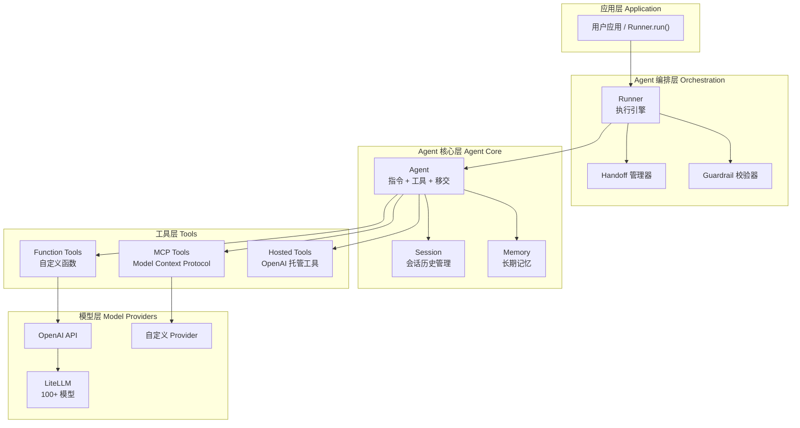
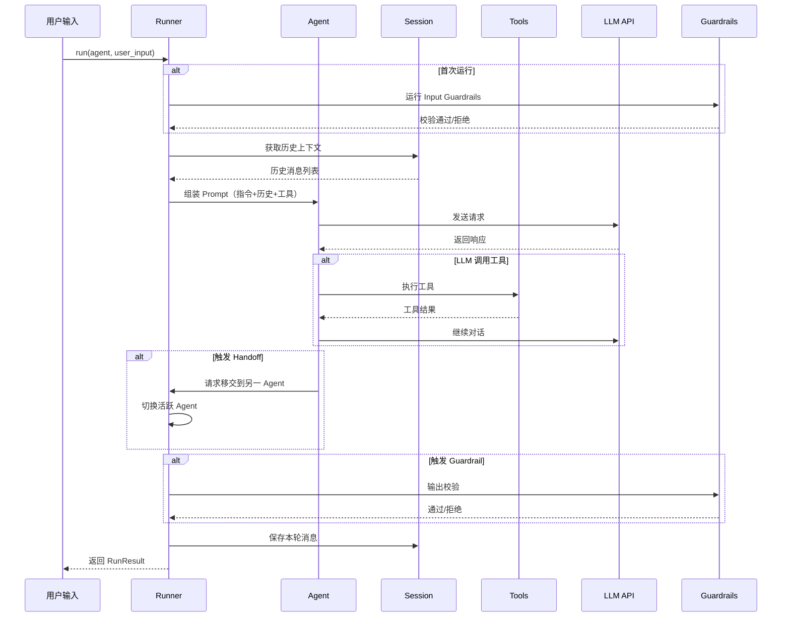
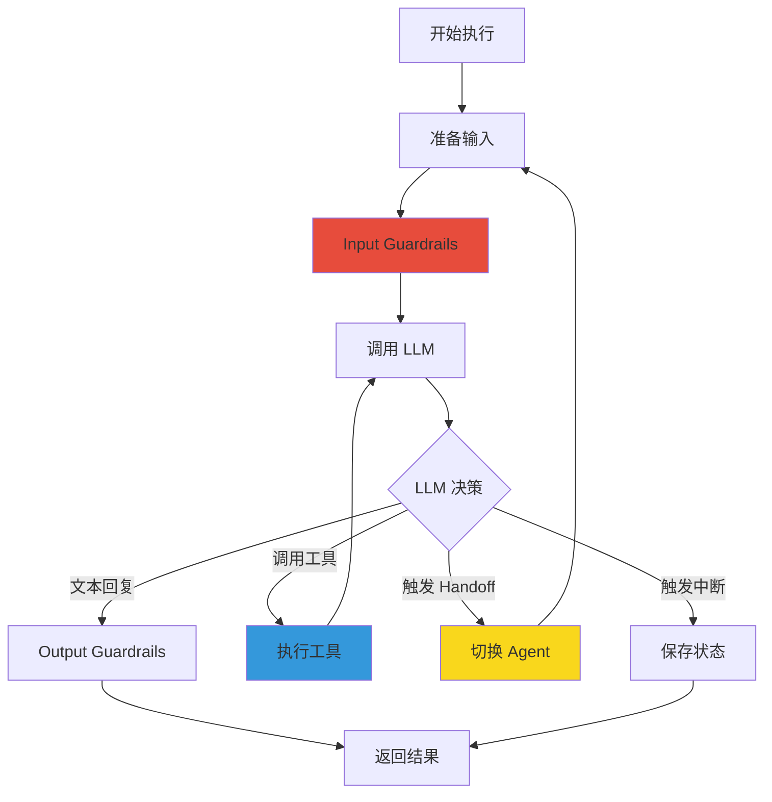

# OpenAI Agents SDK 核心架构与多 Agent 协作设计原理深度解析

> 本文深入剖析 OpenAI 官方发布的 Agents SDK（openai-agents-python），这是 OpenAI 推出的首个轻量级多 Agent 开发框架。该项目在 GitHub 上已获得 26,000+ Stars，近 30 天保持活跃更新，为 Python 开发者提供了构建生产级多 Agent 应用的完整工具链。

## 一、项目定位与核心价值

### 1.1 解决的问题

在大型语言模型（LLM）应用开发中，开发者面临的核心挑战包括：

- **多 Agent 编排**：如何让多个专业 Agent 高效协作，而非串行调用？
- **Agent 间的控制权转移**：当一个 Agent 需要将任务委托给另一个专业 Agent 时，如何优雅地传递上下文？
- **安全护栏**：如何对用户输入和 Agent 输出进行内容安全检查？
- **长时间运行任务的内存管理**：跨多轮对话的会话状态如何持久化？
- **代码执行与工具调用**：如何让 Agent 安全地执行代码、操作文件系统？

OpenAI Agents SDK 正是为解决这些问题而生。它是一套**轻量但功能完整**的多 Agent 开发框架，提供了从单 Agent 构建到复杂多 Agent 编排的完整能力。

### 1.2 项目概况

| 指标 | 数值 |
|------|------|
| GitHub Stars | 26,000+ |
| 主要语言 | Python 3.10+ |
| 架构风格 | 轻量级、模块化、协议驱动 |
| 多模型支持 | OpenAI + 100+ LLM 提供者 |
| 独特设计 | Handoffs 机制、Sandbox Agents、Guardrails |

## 二、整体架构设计

### 2.1 分层架构概览



### 2.2 核心组件职责

| 组件 | 职责 | 特点 |
|------|------|------|
| **Agent** | LLM 的配置容器（指令、工具、护栏、移交目标） | 单一职责，可组合 |
| **Runner** | 执行引擎，管理 Agent 的完整生命周期 | 支持同步/异步、流式输出 |
| **Handoff** | Agent 间的控制权转移机制 | 双向上下文传递 |
| **Session** | 跨多轮对话的会话历史管理 | 可插拔存储后端 |
| **Guardrail** | 输入/输出内容安全校验 | 并行/阻塞两种模式 |
| **Tool** | Agent 的行动能力扩展 | 函数/MCP/托管/代码执行 |

### 2.3 数据流向



## 三、核心机制深度解析

### 3.1 Agent：LLM 的配置载体

Agent 是整个 SDK 的核心构建单元。它的定义非常简洁，却涵盖了 LLM 应用的所有关键配置：

```python
from agents import Agent, Runner, function_tool

# 定义一个天气查询工具
@function_tool
def get_weather(city: str) -> str:
    """获取指定城市的天气信息"""
    return f"{city}今天天气晴朗，气温 22°C"

# 创建一个 Agent
weather_agent = Agent(
    name="天气助手",
    instructions="你是一个友好的天气助手，用简洁的语言回答用户关于天气的问题。",
    tools=[get_weather],
    model="gpt-4o",
    output_type=str,  # 或者使用 Pydantic 模型
)

# 运行 Agent
async def main():
    result = await Runner.run(weather_agent, "北京今天天气怎么样？")
    print(result.final_output)
```

**Agent 的核心属性**：

```python
@dataclass
class Agent:
    name: str                                    # Agent 名称
    instructions: str | Callable                 # 系统提示词（支持动态生成）
    tools: list[Tool]                            # 可用工具列表
    handoffs: list[Handoff | Agent]              # 可移交的 Agent
    input_guardrails: list[InputGuardrail]       # 输入护栏
    output_guardrails: list[OutputGuardrail]     # 输出护栏
    model: str | Model                            # 使用的模型
    model_settings: ModelSettings                  # 模型参数（temperature 等）
    mcp_servers: list[MCPServer]                  # MCP 服务器配置
    output_type: type | OutputType                # 结构化输出类型
```

### 3.2 Handoff：Agent 间的优雅转移

Handoff 是 OpenAI Agents SDK 最具特色的设计之一。它解决了一个关键问题：**当一个 Agent 需要将任务委托给另一个专业 Agent 时，如何传递完整的上下文？**

#### 3.2.1 Handoff 工作原理

在底层，Handoff 被实现为一个**工具**，LLM 可以像调用普通工具一样调用它。当触发 Handoff 时，控制权会完全转移到目标 Agent，目标 Agent 接收前一个 Agent 的完整对话历史。

```python
from agents import Agent, handoff, Runner, RunContextWrapper

# 创建专业 Agent
billing_agent = Agent(
    name="账单 Agent",
    instructions="你专门处理用户的账单查询和支付问题。",
    handoff_description="处理账单和支付相关问题"
)

refund_agent = Agent(
    name="退款 Agent", 
    instructions="你专门处理用户的退款请求。",
    handoff_description="处理退款请求"
)

# 分诊 Agent，具备移交能力
triage_agent = Agent(
    name="分诊 Agent",
    instructions="""你是一个客服分诊员。分析用户问题类型：
    - 如果是账单相关，转给账单 Agent
    - 如果是退款相关，转给退款 Agent
    - 其他问题自行回答""",
    handoffs=[billing_agent, handoff(refund_agent)]
)

# 运行
async def main():
    result = await Runner.run(triage_agent, "我想申请订单退款")
    print(result.final_output)
```

#### 3.2.2 带输入过滤的 Handoff

Handoff 还支持**输入过滤**，允许在移交时对传递给下一个 Agent 的内容进行定制：

```python
from agents import Agent, handoff, RunContextWrapper, HandoffInputData
from pydantic import BaseModel

class EscalationData(BaseModel):
    reason: str
    order_id: str

def filter_sensitive_data(data: HandoffInputData) -> HandoffInputData:
    """移除敏感信息后再移交"""
    return data.clone(input_items=())

escalation_agent = Agent(
    name="升级处理 Agent",
    instructions="处理需要人工介入的工单",
    handoffs=[
        handoff(
            agent=escalation_agent,
            input_filter=filter_sensitive_data,
            input_type=EscalationData,
        )
    ]
)
```

### 3.3 Session：会话历史管理

Session 解决了跨多轮对话的上下文保持问题。它是一个**可插拔的存储接口**，默认实现是基于 SQLite 的本地存储，也支持 Redis、MongoDB、PostgreSQL 等后端。

```python
from agents import Agent, Runner, Session

# 使用默认的 SQLite Session
agent = Agent(name="助手", instructions="你是客服助手")

async def main():
    session = Session()
    
    # 第一次对话
    result1 = await Runner.run(
        agent,
        "我叫张三，订单号是 12345",
        session=session
    )
    
    # 第二次对话，自动携带历史上下文
    result2 = await Runner.run(
        agent,
        "我的订单发货了吗？",  # Agent 知道用户是张三，订单是 12345
        session=session
    )
```

**Session 协议定义**（支持自定义实现）：

```python
class Session(Protocol):
    session_id: str
    
    async def get_items(self, limit: int | None = None) -> list[TResponseInputItem]:
        """获取会话历史"""
        ...
    
    async def add_items(self, items: list[TResponseInputItem]) -> None:
        """添加新的消息到历史"""
        ...
    
    async def pop_item(self) -> TResponseInputItem | None:
        """移除最后一条消息"""
        ...
    
    async def clear_session(self) -> None:
        """清空会话"""
        ...
```

### 3.4 Guardrails：内容安全护栏

Guardrails 提供了在 Agent 执行流程的关键节点进行内容校验的能力。这对于构建面向用户的生产应用至关重要。

#### 3.4.1 Input Guardrail（输入护栏）

输入护栏在 Agent 处理用户输入之前执行，常用于：

- **话题检测**：拒绝偏离业务范围的请求
- **恶意输入检测**：过滤危险内容
- **成本控制**：拦截可能导致不必要大模型调用的请求

```python
from agents import Agent, Runner, input_guardrail, InputGuardrailResult
from agents.run_context import RunContextWrapper

# 定义输入护栏函数
@input_guardrail()
async def topic_check(
    ctx: RunContextWrapper,
    agent: Agent,
    user_input: str
) -> InputGuardrailResult:
    """检查用户输入是否在允许的话题范围内"""
    allowed_topics = ["天气", "订单", "产品信息", "技术支持"]
    
    is_allowed = any(topic in user_input for topic in allowed_topics)
    
    return InputGuardrailResult(
        guardrail=topic_check,
        output=GuardrailFunctionOutput(
            output_info={"checked_topic": user_input},
            tripwire_triggered=not is_allowed
        )
    )

# 使用护栏
agent = Agent(
    name="客服助手",
    instructions="你是一个友好的客服助手",
    input_guardrails=[topic_check]
)

async def main():
    # 正常请求 - 通过
    result = await Runner.run(agent, "我想查询订单状态")
    
    # 恶意请求 - 被拦截，抛出 InputGuardrailTripwireTriggered
    result = await Runner.run(agent, "帮我写一个恶意软件")
```

#### 3.4.2 Output Guardrail（输出护栏）

输出护栏在 Agent 生成最终回答后、执行前执行：

```python
from agents import output_guardrail, OutputGuardrailResult, GuardrailFunctionOutput

@output_guardrail()
async def safe_output(
    ctx: RunContextWrapper,
    agent: Agent,
    agent_output: str
) -> OutputGuardrailResult:
    """检查输出是否包含敏感词"""
    sensitive_words = ["密码", "信用卡号", "SSN"]
    triggered = any(word in agent_output for word in sensitive_words)
    
    return OutputGuardrailResult(
        guardrail=safe_output,
        agent=agent,
        agent_output=agent_output,
        output=GuardrailFunctionOutput(
            output_info={},
            tripwire_triggered=triggered
        )
    )
```

#### 3.4.3 Guardrail 的执行模式

| 模式 | 配置 | 特点 | 适用场景 |
|------|------|------|----------|
| **并行（默认）** | `run_in_parallel=True` | 最低延迟，护栏与 Agent 同时运行 | 对延迟敏感、允许一定浪费的场景 |
| **阻塞** | `run_in_parallel=False` | Agent 完全不运行，零浪费 | 成本控制、安全性要求极高的场景 |

### 3.5 多 Agent 编排模式

OpenAI Agents SDK 提供了两种主要的多 Agent 编排范式：

#### 3.5.1 模式一：Agent as Tool（工具化 Agent）

主 Agent 持有子 Agent 作为工具，在需要时调用它们：

```python
from agents import Agent, Runner, ItemHelpers, MessageOutputItem

# 专业 Agent
spanish_agent = Agent(
    name="西班牙语翻译",
    instructions="将用户的消息翻译成西班牙语",
    handoff_description="英译西班牙语"
)

french_agent = Agent(
    name="法语翻译",
    instructions="将用户的消息翻译成法语",
    handoff_description="英译法语"
)

# 主调度 Agent
orchestrator = Agent(
    name="翻译调度员",
    instructions="""你是一个翻译调度员。用户给出消息后，
    你选择合适的翻译工具完成翻译任务。""",
    tools=[
        spanish_agent.as_tool(
            tool_name="translate_to_spanish",
            tool_description="将英文翻译成西班牙语"
        ),
        french_agent.as_tool(
            tool_name="translate_to_french", 
            tool_description="将英文翻译成法语"
        ),
    ]
)

async def main():
    result = await Runner.run(
        orchestrator,
        "把 'Hello, world!' 翻译成法语"
    )
    # orchestrator 决定调用 french_agent.as_tool
    # 最终输出由 orchestrator 整合
```

**特点**：

- 主 Agent 保持对对话的完全控制
- 子 Agent 的输出作为工具结果返回给主 Agent
- 适合"一个主 Agent 协调多个专业子 Agent"的场景

#### 3.5.2 模式二：Handoff（控制权转移）

主 Agent 将控制权完全移交给子 Agent：

```python
# 分诊 Agent
triage = Agent(
    name="分诊",
    instructions="分析问题类型并选择合适的专员",
    handoffs=[billing_agent, refund_agent, tech_support_agent]
)

async def main():
    result = await Runner.run(triage, "我要退款")
    # 控制权移交给 refund_agent
    # refund_agent 直接响应用户
```

**特点**：

- 子 Agent 完全接管对话
- 目标 Agent 直接响应用户，无需经过主 Agent 整合
- 适合"不同阶段由不同 Agent 全权负责"的场景

### 3.6 Sandbox Agents：长时任务执行环境

Sandbox Agents 是 OpenAI Agents SDK 为**长时间运行任务**设计的安全执行环境。Agent 运行在一个隔离的容器中，可以执行代码、操作文件系统，而不会影响主机系统。

```python
from agents import sandbox

# 创建带沙箱的 Agent
sandbox_agent = Agent(
    name="代码执行助手",
    instructions="你可以在沙箱中执行代码来完成用户的任务",
)

async def main():
    result = await Runner.run(
        sandbox_agent,
        "帮我写一个 Python 脚本，计算斐波那契数列的前 20 项",
        sandbox= {
            "type": "docker",           # 容器类型
            "mounts": [                 # 挂载存储
                {"type": "s3", "bucket": "my-bucket"}
            ],
            "capabilities": ["shell"], # 允许的能力
        }
    )
```

**沙箱的核心能力**：

| 能力 | 说明 |
|------|------|
| **代码执行** | 在隔离环境中执行 Python、Shell 等代码 |
| **文件系统访问** | 可配置的读写权限控制 |
| **网络访问** | 受限的外部网络访问 |
| **技能系统** | 预定义的技能模板（如代码审查） |

## 四、源码架构分析

### 4.1 目录结构

```
src/agents/
├── __init__.py              # 公共 API 导出
├── agent.py                 # Agent 类定义
├── run.py                   # Runner 入口
├── run_config.py            # 运行配置
├── run_context.py           # 执行上下文
├── tool.py                  # 工具基类
├── guardrail.py             # 护栏实现
├── result.py                # 执行结果
│
├── handoffs/                # Handoff 机制
│   ├── __init__.py
│   └── history.py
│
├── memory/                  # 会话存储
│   ├── session.py           # Session 协议
│   ├── sqlite_session.py    # SQLite 实现
│   └── ...
│
├── models/                  # 模型抽象层
│   ├── interface.py         # Provider 接口
│   ├── openai_provider.py   # OpenAI 实现
│   └── litellm_model.py    # LiteLLM 支持
│
├── mcp/                     # MCP 协议支持
│
├── run_internal/            # 内部执行引擎 ⚠️
│   ├── run_loop.py          # 核心循环
│   ├── turn_resolution.py   # 回合决策
│   ├── tool_execution.py    # 工具执行
│   ├── session_persistence.py
│   └── ...
│
├── sandbox/                 # 沙箱执行环境
│
├── tracing/                 # 可观测性
└── voice/                   # 语音支持
```

### 4.2 执行引擎核心流程

`run_internal/run_loop.py` 是整个 SDK 最核心的模块。它定义了 Agent 的执行循环：



**关键代码路径**（`run_single_turn` 函数）：

```python
async def run_single_turn(
    agent: Agent,
    context: RunContextWrapper,
    session: Session,
    config: RunConfig,
) -> SingleStepResult:
    """执行 Agent 的单轮对话"""
    
    # 1. 准备模型输入（合并会话历史 + 指令 + 工具）
    input_items = prepare_model_input_items(agent, session, context, config)
    
    # 2. 调用 LLM
    response = await get_response_with_retry(
        agent.model,
        input_items,
        model_settings=get_model_settings(agent, config),
    )
    
    # 3. 处理 LLM 响应
    processed = process_model_response(response)
    
    # 4. 根据响应类型决定下一步
    if processed.is_final_output:
        # 执行输出护栏并返回
        return NextStepFinalOutput(...)
    
    if processed.is_handoff:
        # 切换到目标 Agent
        return NextStepHandoff(...)
    
    if processed.has_tool_calls:
        # 执行工具调用
        tool_results = await execute_function_tool_calls(
            processed.tool_calls, agent.tools, context
        )
        # 工具结果合并到输入，继续下一轮
        return NextStepRunAgain(tool_results)
    
    return NextStepRunAgain([])
```

### 4.3 工具执行机制

工具调用是 Agent 能力的关键。OpenAI Agents SDK 支持多种工具类型：

```python
# Function Tool（自定义函数）
@function_tool
def get_weather(city: str) -> str:
    return f"Weather in {city}"

# MCP Tool（Model Context Protocol）
from agents.mcp import MCPServer
mcp_server = MCPServer(command="npx", args=["-y", "@modelcontextprotocol/server-filesystem"])
agent = Agent(name="文件助手", mcp_servers=[mcp_server])

# Shell Tool（Shell 命令）
from agents import Computer
computer = Computer()
agent = Agent(name="终端助手", tools=[computer])

# 托管工具（OpenAI 提供）
from agents import WebSearchTool, FileSearchTool
agent = Agent(name="研究助手", tools=[WebSearchTool(), FileSearchTool()])
```

## 五、与其他框架的对比

### 5.1 对比概览

| 维度 | **OpenAI Agents SDK** | **LangChain** | **AutoGen** | **CrewAI** |
|------|----------------------|---------------|-------------|------------|
| **定位** | 轻量级多 Agent 编排 | 全功能 LLM 应用框架 | 多 Agent 对话协作 | 多 Agent 团队协作 |
| **学习曲线** | 低 | 高 | 中 | 低 |
| **多 Agent 模式** | Handoff + Agent as Tool | Agent + Chain | AgentGroupChat | Crew + Task |
| **记忆管理** | Session（可插拔） | Memory | — | — |
| **安全护栏** | 内置 Guardrails | 外部回调 | — | — |
| **代码执行** | Sandbox | Python 解释器 | — | — |
| **MCP 支持** | ✅ 完整 | ⚠️ 社区 | ❌ | ❌ |
| **模型支持** | OpenAI + 100+ | 任意 | 任意 | 任意 |
| **生产成熟度** | ⭐⭐⭐ | ⭐⭐⭐⭐⭐ | ⭐⭐⭐ | ⭐⭐⭐ |

### 5.2 设计差异分析

#### 5.2.1 Handoff vs LangChain 的 Chain

**LangChain** 使用 Chain 模式连接各个处理步骤，链式调用是固定的、确定性的：

```python
# LangChain 风格（确定性）
chain = prompt | llm | parser
result = chain.invoke({"query": "..."})
```

**OpenAI Agents SDK** 使用 Handoff 机制，LLM 可以在运行时**动态决定**移交哪个 Agent：

```python
# OpenAI Agents SDK 风格（LLM 驱动）
triage_agent = Agent(
    name="分诊",
    handoffs=[billing_agent, refund_agent]
)
# LLM 根据对话内容决定调用哪个 handoff
```

**设计哲学差异**：

| 方面 | LangChain Chain | OpenAI Handoff |
|------|-----------------|----------------|
| **决策者** | 开发者（代码层面） | LLM（运行时） |
| **流程灵活性** | 固定 | 动态 |
| **适用场景** | 确定性流水线 | 开放式对话路由 |
| **调试难度** | 低（可追踪） | 中（LLM 决策黑盒） |

#### 5.2.2 Guardrails 内置 vs 外部验证

**OpenAI Agents SDK** 将 Guardrails 作为框架的一等公民：

```python
# 内置护栏，框架级别支持
agent = Agent(
    input_guardrails=[topic_check],
    output_guardrails=[safe_output]
)
```

**LangChain** 需要自行实现或使用 LangSmith 等外部服务：

```python
# LangChain 的回调机制
from langchain.callbacks import StdOutCallbackHandler
chain = prompt | llm | parser.with_config(callbacks=[StdOutCallbackHandler()])
```

#### 5.2.3 Session vs LangChain Memory

两者都解决上下文管理问题，但抽象层次不同：

| 方面 | OpenAI Session | LangChain Memory |
|------|---------------|------------------|
| **存储后端** | 可插拔（SQLite/Redis/MongoDB） | 多样化 |
| **接口风格** | Protocol（鸭式类型） | 类继承 |
| **与框架集成** | 深度集成到 Runner | 通过 Runnable 接口 |
| **复杂查询** | 基础（get_items/add_items） | 丰富（向量检索等） |

### 5.3 架构简洁性对比

```mermaid
radar
    title 框架设计侧重点对比
    dimension "简洁性", 0.9, 0.4, 0.5, 0.6
    dimension "扩展性", 0.7, 0.9, 0.8, 0.7
    dimension "易用性", 0.9, 0.4, 0.7, 0.8
    dimension "功能完整", 0.6, 1.0, 0.7, 0.8
    dimension "多 Agent 支持", 0.9, 0.7, 0.8, 0.9
    "OpenAI Agents", 0.9, 0.7, 0.9, 0.6, 0.9
    "LangChain", 0.4, 0.9, 0.4, 1.0, 0.7
    "AutoGen", 0.5, 0.8, 0.7, 0.7, 0.8
    "CrewAI", 0.6, 0.7, 0.8, 0.8, 0.9
```

## 六、优势与不足

### 6.1 核心优势

| 维度 | 说明 |
|------|------|
| **架构极简** | 核心概念少（Agent/Runner/Handoff/Session），上手快 |
| **Handoff 设计优秀** | Agent 间的控制权转移机制清晰、优雅 |
| **安全护栏完善** | Input/Output Guardrail 内置，支持并行/阻塞两种模式 |
| **多模型兼容** | 不仅支持 OpenAI，还通过 LiteLLM 支持 100+ LLM |
| **沙箱执行** | Sandbox Agents 提供安全的代码执行环境 |
| **MCP 完整支持** | 首个官方支持 Model Context Protocol 的框架 |
| **可观测性** | 内置 Tracing，与 OpenAI 平台深度集成 |

### 6.2 现存不足

| 维度 | 说明 |
|------|------|
| **生态积累** | 相比 LangChain，社区资源和第三方集成较少 |
| **复杂 RAG 支持** | 没有内置的向量检索和知识库管理（需结合 LlamaIndex） |
| **持久化能力** | Session 的复杂查询能力有限 |
| **部署复杂度** | 生产部署需要考虑沙箱安全、网络隔离 |
| **文档完整性** | 部分高级特性（如 MCP）文档尚在完善 |

### 6.3 性能与复杂度权衡

| 左侧（架构/扩展性/易用性） | 右侧（性能/复杂度/维护性） |
|--------------------------|--------------------------|
| Agent 抽象简洁，学习成本低 | 多 Agent 协作时，Handoff 的 LLM 决策可能不稳定 |
| Session 可插拔存储，扩展方便 | 高并发场景下，Session 存储可能成为瓶颈 |
| Guardrails 并行模式延迟低 | 阻塞模式虽然安全，但增加额外延迟 |
| Sandbox 提供安全执行环境 | 容器化部署增加系统复杂度 |

## 七、快速上手示例

### 7.1 环境安装

```bash
# 使用 pip
pip install openai-agents

# 使用 uv（更快）
uv add openai-agents

# 可选依赖
pip install 'openai-agents[voice]'    # 语音支持
pip install 'openai-agents[redis]'     # Redis Session 支持
```

### 7.2 基础单 Agent

```python
from agents import Agent, Runner, function_tool
import asyncio

@function_tool
def get_weather(city: str) -> str:
    """获取城市天气"""
    return f"{city} 今天晴天，22°C"

agent = Agent(
    name="天气助手",
    instructions="用简洁友好的语言回答天气问题",
    tools=[get_weather]
)

async def main():
    result = await Runner.run(agent, "北京天气如何？")
    print(result.final_output)

asyncio.run(main())
```

### 7.3 多 Agent 协作（Handoff）

```python
from agents import Agent, Runner, handoff
import asyncio

sales_agent = Agent(
    name="销售",
    instructions="你负责解答产品咨询和购买引导",
    handoff_description="产品销售咨询"
)

support_agent = Agent(
    name="技术支持",
    instructions="你负责解答技术问题和故障排查",
    handoff_description="技术支持"
)

router = Agent(
    name="接待员",
    instructions="""判断用户需求类型：
    - 购买咨询 → 转给销售
    - 技术问题 → 转给技术支持""",
    handoffs=[sales_agent, handoff(support_agent)]
)

async def main():
    result = await Runner.run(router, "你们的 API 支持哪些认证方式？")
    print(result.final_output)

asyncio.run(main())
```

### 7.4 带 Guardrail 的安全检查

```python
from agents import Agent, Runner, input_guardrail, GuardrailFunctionOutput
from agents.run_context import RunContextWrapper
from pydantic import BaseModel
import asyncio

class GuardrailOutput(BaseModel):
    is_safe: bool
    reason: str | None = None

@input_guardrail()
async def content_safety(
    ctx: RunContextWrapper,
    agent: Agent,
    user_input: str
) -> InputGuardrailResult:
    """检查输入内容安全性"""
    # 实际应用中可接入内容审核 API
    blocked_keywords = ["hack", "exploit", "malware"]
    triggered = any(kw in user_input.lower() for kw in blocked_keywords)
    
    return InputGuardrailResult(
        guardrail=content_safety,
        output=GuardrailFunctionOutput(
            output_info={"reason": "包含不安全关键词" if triggered else None},
            tripwire_triggered=triggered
        )
    )

agent = Agent(
    name="安全助手",
    instructions="你是一个有帮助的 AI 助手",
    input_guardrails=[content_safety]
)

async def main():
    # 正常请求
    result = await Runner.run(agent, "你好，请帮我解释什么是机器学习")
    print(result.final_output)

asyncio.run(main())
```

## 八、总结与趋势

### 8.1 核心设计理念

OpenAI Agents SDK 的设计理念可以总结为：

1. **轻量优先**：最小化的核心抽象，用最少的概念覆盖最多的场景
2. **LLM 驱动**：让 LLM 在运行时做决策，而不是硬编码流程
3. **安全第一**：内置 Guardrails 和 Sandbox，确保生产安全
4. **开放生态**：不绑定 OpenAI，通过 LiteLLM 支持任意 LLM

### 8.2 适用场景

✅ **强烈推荐使用**：

- 需要多 Agent 协作的企业应用
- 需要严格内容安全审核的消费级产品
- 需要安全代码执行环境的开发者工具
- 使用 OpenAI API 且追求简洁性的团队

⚠️ **需要评估**：

- 需要复杂 RAG 和知识库管理的场景（建议结合 LlamaIndex）
- 已有 LangChain 生态投入的团队（迁移成本）
- 需要极强定制性的研究场景

### 8.3 未来趋势

从 SDK 的设计可以看出几个重要趋势：

1. **Agent 标准化**：Handoff 机制有望成为 Agent 间通信的事实标准
2. **MCP 统一工具生态**：Model Context Protocol 正在成为 Agent 工具的 USB 标准
3. **安全内生化**：内容护栏将从"外部插件"变为"框架内置"
4. **沙箱即基础设施**：安全执行环境将成为 Agent 应用的标准配置

---

**项目链接**：[openai/openai-agents-python](https://github.com/openai/openai-agents-python)

**推荐指数**：⭐⭐⭐⭐（适合需要多 Agent 协作和安全保障的生产项目）
