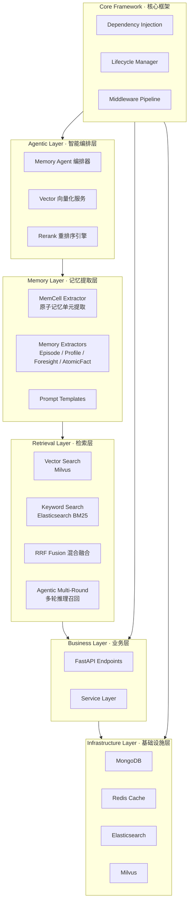
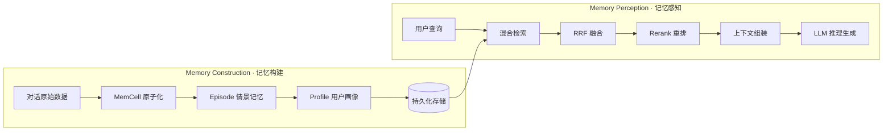
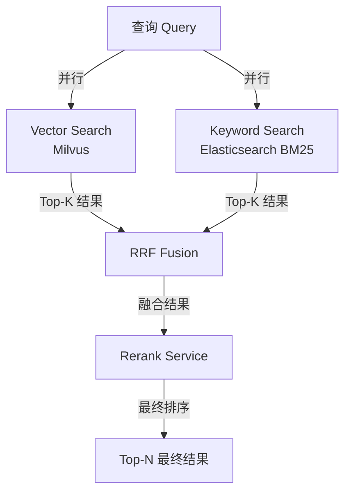

# 【EverOS · EverCore】开源 Agent 记忆基础设施架构与设计原理深度解析

## 引子：为什么 Agent 需要"记忆"？

当我们与 AI 对话时，模型本身是**无状态的**（Stateless）——每一次对话都是独立的，模型不会记住你昨天说了什么、你喜欢什么、你和它讨论过哪些项目。然而，对于真正有用的个人 AI 助手而言，**跨越会话的记忆能力**是核心需求。

举一个直观的例子：你让 AI 推荐晚餐，它回答"根据您所在地推荐中餐"。但如果 AI 知道"你上周刚拔了智齿，正在恢复期"，它就会自动过滤掉辛辣食物，给出更合适的建议。这种**基于历史上下文的主动感知**，正是 EverCore 要解决的核心问题。

> **EverCore** 是 EverOS 项目中的**长期记忆操作系统**，为 AI Agent 提供从对话中提取、结构化存储和精准检索记忆的能力，让 Agent 能够真正"认识"用户。

**项目信息：**
- GitHub：[EverMind-AI/EverOS](https://github.com/EverMind-AI/EverOS)，⭐ 4,600+，2025年10月创建，持续活跃
- 核心技术：**MemCell 原子记忆单元 + 多层记忆类型 + 混合检索（BM25 + Vector + RRF）**
- 支持场景：单人对话、多人团队协作
- 基准测试：在 **LoCoMo** 基准上达到 **92.3%** 推理准确率

---

## 一、问题定位：现有 Agent 记忆方案有什么缺陷？

当前主流的 Agent 记忆方案大致分为三类，它们各有明显不足：

| 方案类型 | 代表项目 | 核心问题 |
|----------|----------|----------|
| **向量数据库** | Chroma / Pinecone | 只能做相似性检索，无法理解语义层级；检索结果碎片化，缺乏叙事连贯性 |
| **简单 KV 存储** | Mem0 / Letta | 仅做消息压缩或摘要，丢失细节；没有多层记忆抽象 |
| **RAG Pipeline** | LangChain / LlamaIndex | 通用文档检索，不针对 Agent 场景优化；记忆更新不及时 |

EverCore 提出的核心洞察是：**Agent 记忆不只是"存储-检索"，而是一个"认知循环"**——记忆需要被结构化地组织（MemCell → Episode → Profile），并在检索时支持多路径融合（Hybrid Retrieval + Rerank）。

---

## 二、EverCore 架构总览

EverCore 采用**六层分层架构**，将 Agent 记忆的完整生命周期拆解为清晰的职责分层：



### 两条核心认知轨道

EverCore 的设计围绕**两条认知轨道**运转：



1. **记忆构建（Memory Construction）**：对话 → MemCell → Episode/Profile → 存储索引
2. **记忆感知（Memory Perception）**：查询 → 混合检索 → 重排 → LLM 推理生成

---

## 三、核心机制深度解析

### 3.1 MemCell：原子记忆单元

MemCell 是 EverCore 最基础的结构化记忆单元，它不是简单的文本片段，而是从对话中提取的**语义完整的记忆原子**。

```python
# MemCell 数据结构（来源：api_specs/memory_types.py）
@dataclass
class MemCell:
    content: str                    # 记忆内容文本
    memory_type: List[str]          # 记忆类型标签
    created_at: datetime           # 创建时间
    summary: str                    # 摘要（LLM生成）
    source: str                     # 数据来源
    user_id: str                    # 关联用户ID
    group_id: str                   # 所属对话组ID
    evidence: List[str]             # 支撑证据（原始对话片段）
    importance_score: float         # 重要性评分
```

**MemCell 的提取过程**由 `ConvMemCellExtractor` 完成，其核心逻辑是：

1. **边界检测（Boundary Detection）**：将连续对话切分为语义完整的片段
2. **LLM 摘要生成**：对每个片段生成摘要和重要性评分
3. **证据保留**：保留原始对话作为 evidence，避免幻觉

```python
# 简化版 MemCell 提取流程伪代码
class ConvMemCellExtractor:
    def __init__(self):
        self.llm_provider = LLMProvider()
        self.prompt = get_prompt_by("CONV_BATCH_BOUNDARY_DETECTION_PROMPT")

    async def extract_memcell(self, request: MemCellExtractRequest):
        # Step 1: 如果强制刷新或达到硬限制，直接切分
        if request.flush or self._exceeds_hard_limit(request):
            return self._force_split(request)

        # Step 2: 调用 LLM 进行语义边界检测
        boundary_prompt = self._build_boundary_prompt(request)
        llm_result = await self.llm_provider.chat(boundary_prompt)
        boundaries = self._parse_boundaries(llm_result)

        # Step 3: 为每个语义块创建 MemCell
        memcells = []
        for segment in self._split_by_boundaries(request, boundaries):
            memcell = MemCell(
                content=segment.text,
                summary=await self._llm_summarize(segment.text),
                evidence=self._extract_evidence(segment),
                importance_score=self._score_importance(segment)
            )
            memcells.append(memcell)

        return memcells, StatusResult(should_wait=False)
```

关键设计：MemCell 包含 `evidence` 字段，记录原始对话片段，这在检索后供 LLM 推理时非常关键——**可溯源的推理能有效减少幻觉**。

### 3.2 多层记忆类型体系

EverCore 不只有一种"记忆"，而是通过不同提取器构建**多层次记忆结构**：

| 记忆类型 | 提取器 | 作用 | 示例 |
|----------|--------|------|------|
| **MemCell** | `ConvMemCellExtractor` | 原子级记忆 | "用户喜欢巴塞罗那" |
| **Episode** | `EpisodeMemoryExtractor` | 情景/主题记忆 | "讨论足球爱好的完整对话" |
| **Profile** | `ProfileExtractor` | 用户画像 | "用户是足球迷，喜欢梅西" |
| **Foresight** | `ForesightExtractor` | 前瞻性记忆 | "用户明天下午要开会" |
| **AtomicFact** | `AtomicFactExtractor` | 原子事实 | "梅西是阿根廷人" |
| **AgentCase** | `AgentCaseExtractor` | Agent 经验案例 | "此类问题应先检索记忆再回答" |
| **AgentSkill** | `AgentSkillExtractor` | Agent 技能 | "可用工具：网页搜索、计算器" |

多层记忆的设计理念是：**信息在不同抽象级别被组织，检索时可以按需获取不同粒度的记忆**。

### 3.3 混合检索与 RRF 融合

EverCore 的检索层支持多种检索策略，并可通过 **RRF（Reciprocal Rank Fusion）** 算法融合：



**RRF 融合公式**：
```python
def rrf_fusion(results_list: List[List[RetrievedDoc]], k=60):
    """
    Reciprocal Rank Fusion: 将多路检索结果按排名融合
    k 是一个常数（通常为60），用于平滑排名差异
    """
    scores = {}
    for results in results_list:
        for rank, doc in enumerate(results):
            doc_id = doc.id
            scores[doc_id] = scores.get(doc_id, 0) + 1 / (k + rank + 1)
    return sorted(scores.items(), key=lambda x: -x[1])
```

**检索策略**：

| 策略 | 描述 | 适用场景 |
|------|------|----------|
| `keyword` | 纯 BM25 关键词检索 | 延迟敏感、简单查询 |
| `vector` | 纯向量语义检索 | 语义模糊、需要理解意图 |
| `hybrid` | BM25 + Vector + RRF | 默认推荐，平衡精确与语义 |
| `agentic` | LLM 引导的多轮推理检索 | 复杂查询，自动生成多个子查询 |

### 3.4 Agentic 多轮推理召回

对于复杂查询，EverCore 支持 **Agentic 检索模式**——LLM 会分析查询并生成 2-3 个互补子查询：

```text
用户问："我上周和老板讨论的项目进展如何？"

LLM 分析后生成子查询：
  1. "项目进展讨论"
  2. "上周和老板的会议"
  3. "项目状态更新"

三路并行检索 → RRF 融合 → 最终结果
```

---

## 四、技术栈与存储设计

### 4.1 存储选型

| 数据类型 | 存储选型 | 选型理由 |
|----------|----------|----------|
| MemCell / Episode / Profile | **MongoDB** | 文档型存储，灵活 schema，适合嵌套记忆结构 |
| 向量 embedding | **Milvus** | 高性能向量检索，支持混合检索 |
| 关键词索引 | **Elasticsearch** | BM25 成熟方案，支持复杂查询 |
| 结果缓存 | **Redis** | 低延迟缓存，加速高频访问 |
| LLM 调用 | **OpenAI / DeepInfra / vLLM** | 多 provider 支持，可配置 |

### 4.2 依赖注入与生命周期管理

EverCore 的 Core Framework 提供了**依赖注入容器**，所有服务通过 DI 统一管理：

```python
# 伪代码示例：DI 容器使用方式
from core.di import get_bean_by_type

class MemoryManager:
    def __init__(self):
        self.llm_provider = get_bean_by_type(LLMProvider)
        self.vector_store = get_bean_by_type(VectorStore)
        self.cache = get_bean_by_type(Redis)

    async def search(self, query: str, user_id: str):
        # 使用注入的组件
        embedding = await self.llm_provider.embed(query)
        cached = await self.cache.get(query)
        if cached:
            return cached
        results = await self.vector_store.search(embedding)
        await self.cache.set(query, results, ttl=300)
        return results
```

这种设计使得**单元测试和组件替换**非常方便——只需 mock DI 容器中的 bean。

---

## 五、与同类项目对比

| 维度 | **EverCore** | **Mem0** | **Letta** |
|------|-------------|----------|-----------|
| **记忆抽象** | 多层（MemCell→Episode→Profile→Foresight） | 单一 memory store | 记忆 + SQLite 持久化 |
| **检索方式** | BM25 + Vector + RRF + Agentic | 纯向量检索 | 相似性搜索 |
| **边界检测** | LLM 语义边界检测 + 硬限制 | 无 | 无 |
| **Agent 场景** | 原生支持 AgentCase / AgentSkill | 通用的 memory API | Server + DB 分离架构 |
| **基准测试** | LoCoMo 92.3% | 无公开基准 | 无 |
| **多语言** | 中英文独立 prompt | 英文为主 | 英文 |

**核心设计差异**：

- **Mem0** 将记忆视为"通用 KV store"，通过简单的 `add / search` API 操作记忆，缺乏多层次抽象
- **Letta** 采用 Server + Database 分离架构，更像一个"记忆数据库服务"
- **EverCore** 的设计哲学是**记忆即认知系统**——通过 MemCell 边界检测 + 多层提取 + RRF 融合，让记忆能够"被理解"而非仅"被存储"

---

## 六、优缺点分析

| 优点 | 说明 |
|------|------|
| **架构清晰** | 六层分层，职责明确，易于理解和扩展 |
| **记忆抽象完整** | 从原子（MemCell）到宏观（Profile）的多层抽象体系 |
| **可溯源推理** | MemCell 保留 evidence，检索结果有据可查，减少幻觉 |
| **检索策略灵活** | 支持 4 种检索模式，可根据场景选择 |
| **Benchmark 驱动** | 有 LoCoMo 等基准测试验证效果 |
| **中文友好** | 支持中英文独立 prompt 和对话数据 |

| 缺点 / 挑战 | 说明 |
|-------------|------|
| **依赖较多** | 需要 MongoDB + Milvus + Elasticsearch + Redis，部署复杂度高 |
| **LLM 调用成本** | MemCell 提取依赖 LLM，边界检测和摘要生成有延迟和成本 |
| **冷启动问题** | 新用户初期记忆少时，Profile 难以建立 |
| **水平扩展** | 当前架构以单服务为主，分布式扩展需额外设计 |
| **学习曲线** | 多层记忆类型和检索策略对新手有一定门槛 |

---

## 七、快速上手

### 7.1 环境准备

```bash
# 克隆项目
git clone https://github.com/EverMind-AI/EverOS.git
cd EverOS/methods/EverCore

# 使用 Docker 启动依赖服务
docker compose up -d

# 安装依赖
uv sync
```

### 7.2 启动服务

```bash
# 启动 API 服务器（默认端口 1995）
uv run python src/run.py --port 1995
```

### 7.3 简单示例：存储和检索记忆

```python
"""simple_demo.py - EverCore 最简使用示例"""
import asyncio
from demo.utils import SimpleMemoryManager

async def main():
    memory = SimpleMemoryManager()

    # 步骤1: 存储对话
    await memory.store("I love playing soccer, often go to the field on weekends")
    await asyncio.sleep(2)
    await memory.store("I love Barcelona the most, Messi is my idol")
    await asyncio.sleep(2)
    await memory.store("I also enjoy watching basketball, NBA is my favorite")

    # 步骤2: 等待索引构建
    await memory.wait_for_index(seconds=10)

    # 步骤3: 查询记忆
    print("\n💬 Query: What sports does the user like?")
    await memory.search("What sports does the user like?")

    print("\n💬 Query: What is the user's favorite team?")
    await memory.search("What is the user's favorite team?")

asyncio.run(main())
```

运行：
```bash
uv run python src/bootstrap.py demo/simple_demo.py
```

### 7.4 API 调用示例

```python
import requests

BASE_URL = "http://localhost:1995"

# 存储对话记忆
def store_memory():
    resp = requests.post(
        f"{BASE_URL}/api/v0/memories",
        json={
            "user_id": "user_001",
            "messages": [
                {"role": "user", "content": "我最近在学习 Python 编程"},
                {"role": "assistant", "content": "Python 很适合入门，推荐从官方教程开始"}
            ]
        }
    )
    return resp.json()

# 检索记忆
def search_memory(query: str, user_id: str):
    resp = requests.post(
        f"{BASE_URL}/api/v1/memories/search",
        json={
            "query": query,
            "user_id": user_id,
            "retrieve_method": "hybrid",
            "top_k": 5
        }
    )
    return resp.json()
```

---

## 八、总结与趋势

EverCore 是当前开源社区中**对 Agent 记忆基础设施思考最深入的项目之一**。它的核心贡献在于：

1. **MemCell 抽象**：将对话记忆原子化，保留证据，让记忆"可理解、可溯源"
2. **多层记忆体系**：不只有向量检索，而是构建 Episode / Profile / Foresight 的层级结构
3. **认知循环设计**：记忆构建 ↔ 记忆感知形成闭环，让 Agent 能够真正基于历史理解当前任务

**未来趋势观察**：

- **记忆压缩与遗忘机制**：随着对话历史增长，如何高效压缩和选择性遗忘将成为关键
- **跨 Agent 记忆共享**：多 Agent 协作场景下的共享记忆层目前支持（Team 模式），但还有很大优化空间
- **基准测试生态**：LoCoMo 等记忆基准的建立，将推动整个 Agent Memory 领域的效果评估标准化

如果你正在构建需要**长期记忆**的 AI Agent，EverCore 是一个非常值得研究的学习案例——它展示了如何将"记忆"从简单的 KV 存储，升级为一个**结构化的认知系统**。

---

**参考链接：**
- GitHub：[EverMind-AI/EverOS](https://github.com/EverMind-AI/EverOS)
- 官网：[evermind.ai](https://evermind.ai)
- 文档：[docs.evermind.ai](https://docs.evermind.ai)
---

## 对比分析

EverOS / EverCore 用 MemCell 抽象构建 Agent 认知记忆，与 mem0（提取式摘要）、Letta（分层状态机）在记忆设计上各有特色。

### 维度对比表

| 维度 | EverCore (EverOS) | mem0 | Letta (MemGPT) |
|------|-------------------|------|-----------------|
| 记忆抽象 | MemCell（原子化对话记忆 + 证据） | 三层（情景/语义/程序性） | 核心/外部/召回（Core/Archival/Recall） |
| 证据保真度 | 高（MemCell 保留原始证据） | 中（自动摘要会损失细节） | 中 |
| 记忆层级 | Episode / Profile / Foresight | 情景 / 语义 / 程序性 | Core / Archival / Recall |
| 跨 Agent 共享 | Team 模式 | 通过共享后端 | 通过共享 DB |
| 基准评估 | LoCoMo 等 | 内部基准 | LoCoMo / LongMemEval |
| 适合场景 | 需要"可理解、可溯源"记忆的 Agent | 通用 Agent 长期记忆 | 超长会话、状态机式记忆 |

### 优缺点

EverCore
- 优点：MemCell 抽象让记忆"可理解、可溯源"；Episode/Profile/Foresight 多层结构；认知循环（构建 ↔ 感知）闭环。
- 缺点：相对早期，生态规模小于 mem0；学习曲线取决于对认知架构的理解。

mem0
- 优点：生态成熟、云/OSS 双轨、接入简单。
- 缺点：自动摘要会损失证据细节；分层抽象不如 EverCore 显式。

Letta
- 优点：Core/Archival/Recall 分层优雅；学术社区活跃；适合超长会话。
- 缺点：架构相对复杂，状态机学习成本高；非"零摘要"。

### 何时选

- 选 EverCore：需要"可理解、可溯源"的记忆，关注认知循环闭环，研究型 Agent。
- 选 mem0：通用 Agent 长期记忆、快速集成。
- 选 Letta：超长会话、状态机式记忆管理。

### 参考资料

- EverOS GitHub：https://github.com/EverMind-AI/EverOS
- mem0 GitHub：https://github.com/mem0ai/mem0
- Letta GitHub：https://github.com/letta-ai/letta
- LoCoMo 基准：https://github.com/snap-stanford/locomo