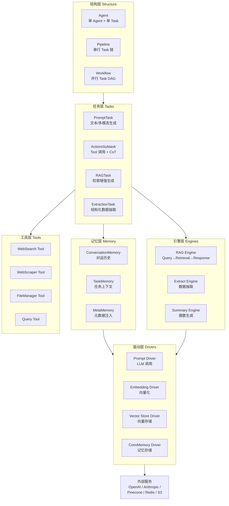
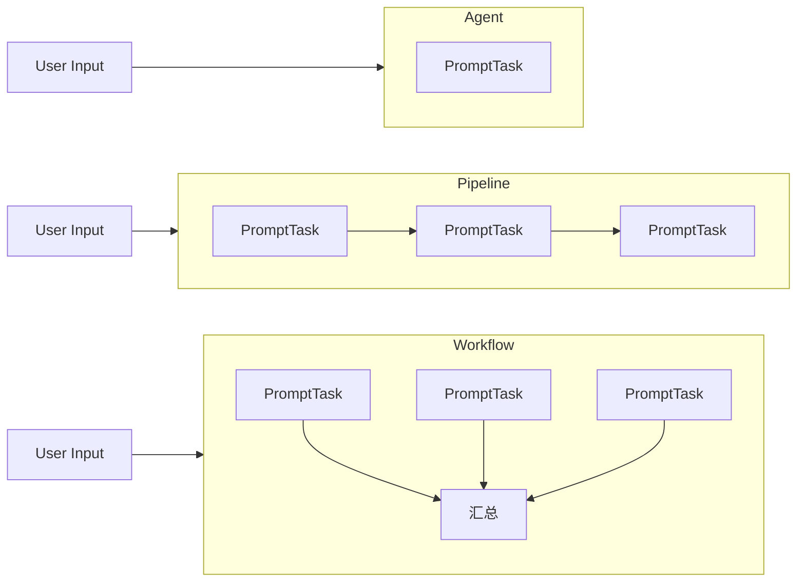
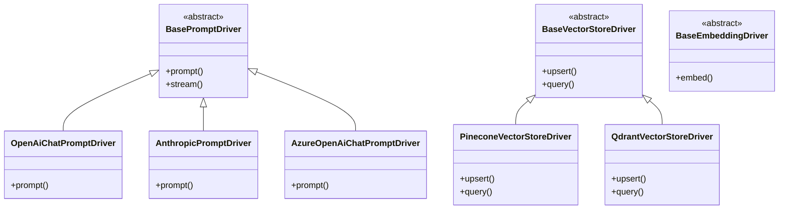
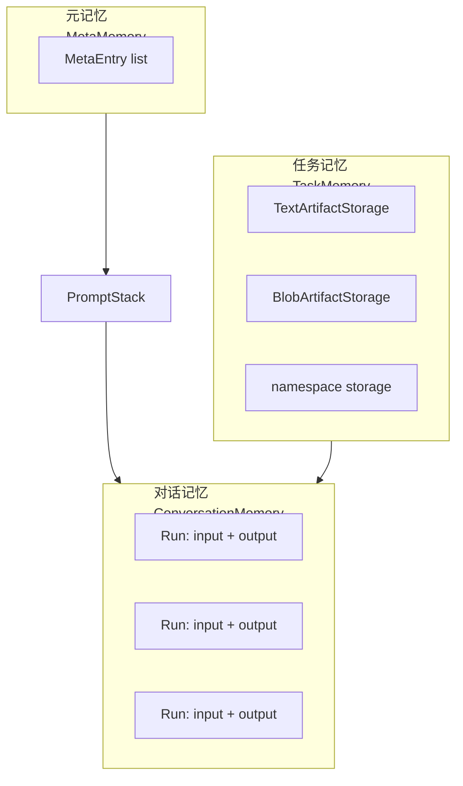
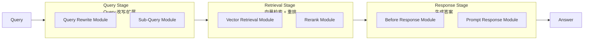
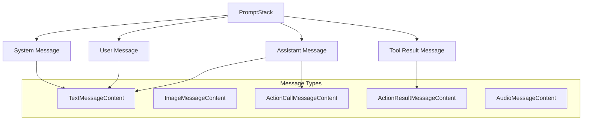

# 【Griptape】模块化 AI Agent 框架架构与设计原理深度解析

## 引子

在 AI Agent 框架百花齐放的今天，LangChain、AutoGen、CrewAI 等框架各有特色，但往往在**生产级复杂度**和**易用性**之间难以平衡。今天要介绍的 **Griptape**，是一个独特的存在——它以"模块化 Driver 架构"为核心，提供了一套从 LLM 调用、Memory 管理到 RAG、Tool 调用的完整抽象，且代码结构清晰、生产可用。

Griptape 的设计哲学是：**把「能力」和「实现」分离**——你换一个 LLM Provider，只需要换一个 Driver，不需要改变业务逻辑。这种架构思路，在企业级 AI 应用中非常有价值。

GitHub: https://github.com/griptape-ai/griptape ⭐ 2.5k

## 一、项目定位与核心价值

### 1.1 解决的问题

Griptape 旨在解决以下痛点：

| 痛点 | Griptape 的解法 |
|------|----------------|
| LLM Provider 锁定 | Driver 抽象层，一行切换 OpenAI/Anthropic/Azure |
| Memory 实现耦合 | ConversationMemory Driver 抽象，可换 Redis/DynamoDB/本地 |
| RAG 流程僵硬 | 模块化 RAG Engine，Query/Retrieval/Response 三阶段可插拔 |
| Tool 开发门槛高 | 统一的 BaseTool + ActivityMixin，Python 函数即工具 |
| 生产级可观测性差 | EventBus + EventListener 体系，驱动全链路监控 |

### 1.2 核心定位

Griptape 是一个**模块化的生成式 AI 应用框架**，不是 LangChain 的替代品，而是面向生产环境的一种不同路线。它的核心差异在于：

- **结构化抽象**：Agent / Pipeline / Workflow 三层结构，对应单 agent、串行多任务、并行多任务
- **Driver 注入**：所有外部依赖（LLM、VectorDB、Memory）均通过 Driver 接口注入
- **Artifact流转**：统一的数据结构贯穿整个框架

## 二、架构设计

### 2.1 整体架构图



### 2.2 Structure 三层结构

Griptape 的核心抽象是 **Structure**，它有三种具体形式：



| 结构 | Task 数量 | 执行方式 | 适用场景 |
|------|----------|---------|---------|
| **Agent** | 1个 | 单 Task 循环直到完成 | 简单对话、单工具调用 |
| **Pipeline** | N个串行 | DAG 拓扑排序执行 | 流程固定的多步骤任务 |
| **Workflow** | N个并行/有依赖 | 并发 + 依赖协调 | 研究报告生成、数据分析 |

**代码示例**：

```python
from griptape.structures import Agent, Pipeline, Workflow
from griptape.tasks import PromptTask
from griptape.rules import Rule

# Agent 模式：单 Agent 自动工具调用
agent = Agent(
    tasks=[PromptTask(
        prompt="查一下今天的天气",
        rules=[Rule("用中文回答")]
    )]
)
agent.run()

# Pipeline 模式：串行执行
pipeline = Pipeline(
    tasks=[
        PromptTask(id="task1", prompt="搜索 AI 新闻"),
        PromptTask(id="task2", prompt="总结 {{ parent_output }}"),
    ]
)
pipeline.run()

# Workflow 模式：并行 + 汇总
workflow = Workflow(tasks=[
    [PromptTask(id="research1", prompt="研究 LangChain"),
     PromptTask(id="research2", prompt="研究 CrewAI")],
    PromptTask(id="summary", prompt="对比 {{ parents_output_text }}")
])
workflow.run()
```

### 2.3 Driver 架构

Driver 是 Griptape 最核心的抽象。所有外部依赖都是 Driver：



**核心优势**：换 LLM Provider，只需换 Driver，不需要改业务代码。

```python
from griptape.drivers.prompt.openai import OpenAiChatPromptDriver
from griptape.drivers.prompt.anthropic import AnthropicPromptDriver

# 切换 Provider
prompt_driver = OpenAiChatPromptDriver(model="gpt-4o")  # OpenAI
# prompt_driver = AnthropicPromptDriver(model="claude-3-5-sonnet")  # 换 Anthropic
```

支持的 Driver 生态：

| 类别 | 支持的 Driver |
|------|-------------|
| **Prompt/LLM** | OpenAI, Anthropic, Azure OpenAI, Google, Cohere, HuggingFace, Groq, Ollama, Amazon Bedrock 等 |
| **Embedding** | OpenAI, Cohere, VoyageAI, HuggingFace, Google, Ollama, Amazon Bedrock 等 |
| **Vector Store** | Pinecone, Qdrant, Weaviate, Redis, MongoDB Atlas, OpenSearch, Pgvector, AstraDB, Local |
| **Memory** | Redis, Amazon DynamoDB, Local, Griptape Cloud |
| **File Manager** | Local, Amazon S3, Griptape Cloud |
| **Rerank** | Cohere, VoyageAI, Local |

## 三、核心机制深度分析

### 3.1 Memory 三层架构

Griptape 的 Memory 系统设计精妙，分为三层：



#### 3.1.1 ConversationMemory

负责对话历史的存储和检索。核心是 `Run` 对象：

```python
@define(kw_only=True)
class Run:
    id: str = field(default=Factory(lambda: uuid.uuid4().hex))
    meta: dict | None = field(default=None)
    input: BaseArtifact  # 用户输入
    output: BaseArtifact  # AI 输出
```

ConversationMemory 有 Driver 抽象，可以换存储后端：

```python
from griptape.drivers.memory.conversation.redis import RedisConversationMemoryDriver

agent = Agent(
    conversation_memory=ConversationMemory(
        conversation_memory_driver=RedisConversationMemoryDriver(
            host="localhost", port=6379
        ),
        max_runs=50  # 最多保留 50 轮对话
    )
)
```

#### 3.1.2 TaskMemory

每个 Task 有自己的 Memory，用来存储**大型或敏感数据**，避免污染 Prompt：

```python
from griptape.memory.task.storage import TextArtifactStorage

task = PromptTask(
    prompt="分析这份文档 {{ memory:documents }}",
    tools=[QueryTool()]  # QueryTool 会自动把结果写入 TaskMemory
)
```

#### 3.1.3 MetaMemory

用于注入元数据到 Prompt，增强上下文：

```python
agent = Agent(
    meta_memory=MetaMemory(
        entries=[ActionSubtaskMetaEntry(
            action_name="web_search",
            action_input={"query": "AI news"},
            result="Found 10 articles..."
        )]
    )
)
```

### 3.2 RAG Engine 模块化设计

Griptape 的 RAG Engine 是我认为设计最优雅的部分——**三阶段流水线**完全可插拔：



**代码示例**：

```python
from griptape.engines.rag import RagEngine
from griptape.engines.rag.stages import QueryRagStage, RetrievalRagStage, ResponseRagStage
from griptape.engines.rag.modules import (
    TranslateQueryRagModule,
    VectorStoreRetrievalRagModule,
    TextChunksRerankRagModule,
    PromptResponseRagModule,
)
from griptape.drivers.vector.pinecone import PineconeVectorStoreDriver
from griptape.drivers.embedding.openai import OpenAiEmbeddingDriver

# 构建 RAG Engine
rag_engine = RagEngine(
    query_stage=QueryRagStage(
        query_modules=[
            TranslateQueryRagModule()  # 查询改写
        ]
    ),
    retrieval_stage=RetrievalRagStage(
        retrieval_modules=[
            VectorStoreRetrievalRagModule(
                vector_store_driver=PineconeVectorStoreDriver(
                    api_key="xxx",
                    environment="us-east-1",
                    index_name="docs"
                ),
                embedding_driver=OpenAiEmbeddingDriver(model="text-embedding-3-small")
            )
        ],
        rerank_module=TextChunksRerankRagModule(),  # 重排
        max_chunks=10
    ),
    response_stage=ResponseRagStage(
        before_response_module=...,  # 前置处理
        response_module=PromptResponseRagModule()
    )
)

# 执行 RAG 查询
context = rag_engine.process_query("什么是 RAG?")
print(context.response)
```

### 3.3 ActionsSubtask 与 Tool 调用机制

Griptape 的 Tool 调用通过 **ActionsSubtask** 实现，它的核心是**链式思考（CoT）** 模式：

```python
@define
class ActionsSubtask(BaseSubtask[ListArtifact | ErrorArtifact]):
    THOUGHT_PATTERN = r"(?s)^Thought:\s*(.*?)$"
    ACTIONS_PATTERN = r"(?s)Actions:[^\[]*(\[.*\])"
    RESPONSE_STOP_SEQUENCE = "<|Response|>"
    
    thought: str | None = field(default=None)
    actions: list[ToolAction] = field(factory=list)
```

LLM 输出格式要求：

```
Thought: 我需要搜索最新的 AI 新闻
Actions: [
  {
    "name": "web_search",
    "path": "search",
    "input": {"query": "AI news 2026"}
  }
]
<|Response|>
```

BaseTool 的实现极其简洁——Python 函数即工具：

```python
from griptape.tools import BaseTool
from griptape.artifacts import TextArtifact

class CalculatorTool(BaseTool):
    name = "calculator"
    description = "执行数学计算"
    
    @BaseTool.activity(os.path.cpu_count)
    def calculate(self, params: dict) -> TextArtifact:
        expression = params["expression"]
        result = eval(expression)  # 真实计算
        return TextArtifact(value=str(result))
```

### 3.4 PromptStack 消息构建

PromptStack 是 Griptape 的另一个亮点——**统一的消息抽象**：



## 四、Rules 与 Ruleset 行为控制

Griptape 提供了独特的 **Ruleset** 机制来控制 LLM 行为，无需复杂 Prompt 工程：

```python
from griptape.rules import Rule, Ruleset

# 单条规则
agent = Agent(
    rules=[Rule("用简洁的语言回答")]
)

# 规则集
agent = Agent(
    rulesets=[
        Ruleset(
            name="格式要求",
            rules=[
                Rule("用中文回答"),
                Rule("每点不超过 20 字"),
                Rule("最后附上来源")
            ]
        )
    ]
)
```

Ruleset 还支持从外部加载（Ruleset Driver）：

```python
from griptape.drivers.ruleset.griptape_cloud import GriptapeCloudRulesetDriver

ruleset = Ruleset(
    name="安全规则",
    ruleset_driver=GriptapeCloudRulesetDriver(api_key="xxx")
)
```

## 五、对比分析

### 5.1 Griptape vs LangChain

| 维度 | Griptape | LangChain |
|------|----------|-----------|
| **架构哲学** | Driver 注入，能力/实现分离 | Chain/LCEL 表达式组合 |
| **Memory** | 三层分离 + Driver 抽象 | 简单 ChatMessageHistory |
| **RAG** | 三阶段模块化 Engine | LangChain RetrievalQA Chain |
| **Tool 调用** | ActionsSubtask + CoT | Tool binding / LangChain Tools |
| **学习曲线** | 中等（概念清晰但数量多） | 陡峭（太多抽象层次） |
| **生产成熟度** | 高（EventBus + 结构化） | 中（快速迭代，API 变化大） |

### 5.2 Griptape vs CrewAI

| 维度 | Griptape | CrewAI |
|------|----------|--------|
| **多 Agent 模式** | Workflow 并行 + Pipeline 串行 | Agent Team + Process |
| **交互方式** | Handoffs（交接）| Process-driven |
| **Memory** | 三层 Driver 抽象 | 简单共享 Memory |
| **适用场景** | 企业级复杂流程 | 相对固定的多 Agent 协作 |

### 5.3 设计差异总结

```
Griptape: 能力抽象（Driver） + 结构化任务（Structure）
LangChain: 表达式组合（LCEL）+ 链式调用（Chain）
CrewAI: 角色定义（Role）+ 流程驱动（Process）
AutoGen: 对话驱动（Conversation）+ 群体交互（GroupChat）
```

Griptape 的核心差异在于：**Driver 抽象让所有外部依赖可替换**，这是其他框架没有做到的设计。

## 六、优缺点分析

### 优点

| 维度 | 说明 |
|------|------|
| **架构简洁性** | Structure → Task → Driver 三层，职责清晰 |
| **扩展性** | 新 Driver只需实现接口，不需要改核心代码 |
| **易用性** | Rules/Ruleset 降低 Prompt 工程复杂度 |
| **可观测性** | EventBus + EventListener 驱动全链路监控 |
| **生产就绪** | 完整的企业级组件（SQL、Rerank、Observability） |

### 缺点

| 维度 | 说明 |
|------|------|
| **复杂度** | 对于简单用例，概念数量较多（Driver 种类繁多） |
| **社区生态** | 相比 LangChain，第三方集成较少 |
| **学习曲线** | 需要理解 Driver 抽象才能有效使用 |
| **文档** | 部分高级特性文档不够详细 |
| **知名度** | 社区相对小众，问题排查资源有限 |

## 七、快速上手

### 7.1 安装

```bash
pip install griptape
```

### 7.2 完整示例：多工具 Research Agent

```python
from griptape.structures import Agent
from griptape.tasks import PromptTask
from griptape.tools import WebSearchTool, WebScraperTool, CalculatorTool
from griptape.rules import Rule
from griptape.drivers.prompt.openai import OpenAiChatPromptDriver

# 创建 Agent
agent = Agent(
    prompt_driver=OpenAiChatPromptDriver(model="gpt-4o"),
    tasks=[
        PromptTask(
            prompt="""
            研究 {{ args[0] }} 并提供详细报告：
            1. 基本介绍
            2. 主要特点
            3. 最新动态（搜索最新资讯）
            4. 总结与展望
            
            使用 WebSearchTool 搜索最新资讯，
            使用 CalculatorTool 进行数据计算。
            """,
            tools=[
                WebSearchTool(),
                WebScraperTool(),
                CalculatorTool(),
            ],
            rules=[
                Rule("报告要详细，至少 1000 字"),
                Rule("信息来源要可靠"),
            ]
        )
    ]
)

# 执行
result = agent.run("AI Agent 框架发展现状")
print(result.output.value)
```

### 7.3 RAG 完整示例

```python
from griptape.engines.rag import RagEngine
from griptape.engines.rag.stages import RetrievalRagStage, ResponseRagStage
from griptape.engines.rag.modules import VectorStoreRetrievalRagModule, PromptResponseRagModule
from griptape.drivers.vector.pinecone import PineconeVectorStoreDriver
from griptape.drivers.embedding.openai import OpenAiEmbeddingDriver
from griptape.drivers.prompt.openai import OpenAiChatPromptDriver

# 构建 RAG Engine
rag_engine = RagEngine(
    retrieval_stage=RetrievalRagStage(
        retrieval_modules=[
            VectorStoreRetrievalRagModule(
                vector_store_driver=PineconeVectorStoreDriver(
                    api_key="your-api-key",
                    environment="us-east-1",
                    index_name="knowledge-base"
                ),
                embedding_driver=OpenAiEmbeddingDriver(model="text-embedding-3-small")
            )
        ],
        max_chunks=5
    ),
    response_stage=ResponseRagStage(
        response_module=PromptResponseRagModule(
            prompt_driver=OpenAiChatPromptDriver(model="gpt-4o")
        )
    )
)

# 查询
result = rag_engine.process_query("如何部署 Griptape?")
print(result.output.value)
```

## 八、趋势与展望

Griptape 的发展方向值得关注：

1. **Griptape Cloud**：一站式托管服务，对标 LangServe
2. **更多 Agent 模式**：吸收 AutoGen 的群聊模式
3. **Agentic RAG**：将 RAG Engine 与 Agent 深度融合
4. **企业级特性**：SSO、审计日志、权限控制

## 总结

Griptape 是一个**被低估的生产级 AI Agent 框架**。它的 Driver 抽象虽然增加了初期学习成本，但换来了**无与伦比的可替换性和可测试性**。如果你在为企业构建 AI 应用，需要在多个 LLM Provider 或 VectorDB 之间切换，Griptape 是目前最优雅的解法。

**推荐场景**：企业级 AI 应用、多 Provider 切换需求、复杂 RAG 流程、需要高可观测性的生产系统。

**不推荐场景**：快速原型验证（LangChain/CrewAI 更快上手）、简单单 Agent 对话（过于重的抽象）。

---

**相关链接**：
- GitHub: https://github.com/griptape-ai/griptape
- 文档: https://docs.griptape.ai/
- 学习平台: https://learn.griptape.ai/
