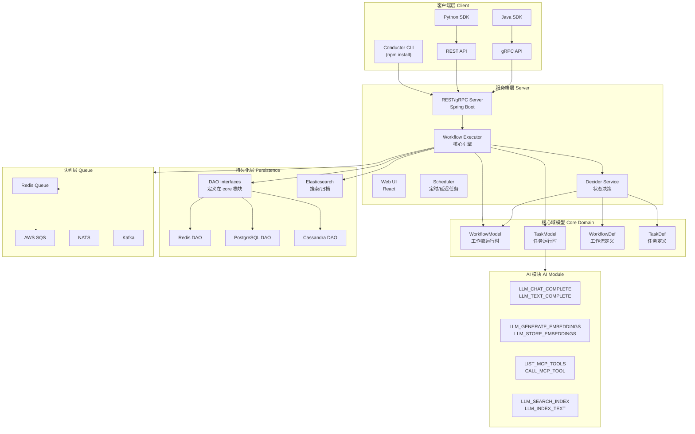
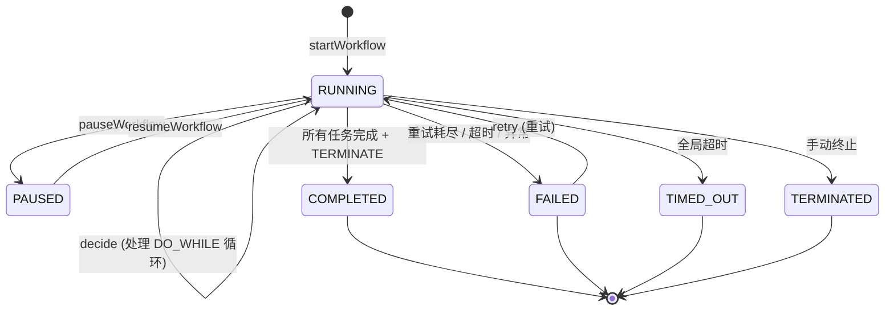
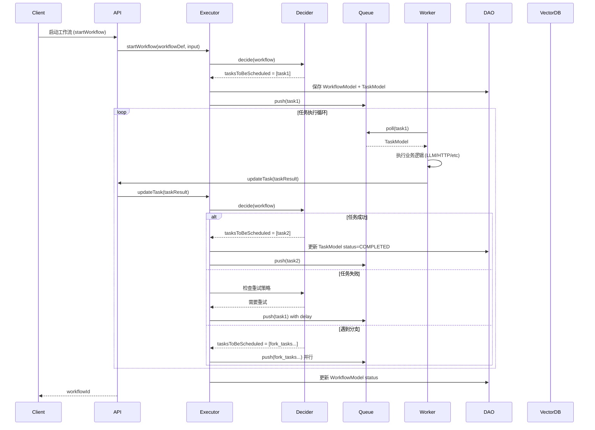
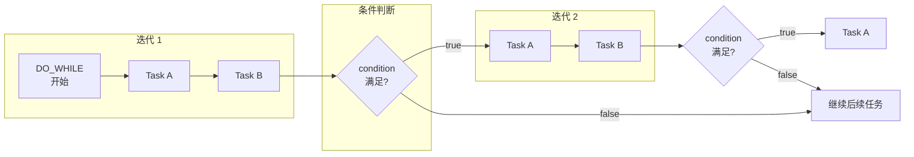
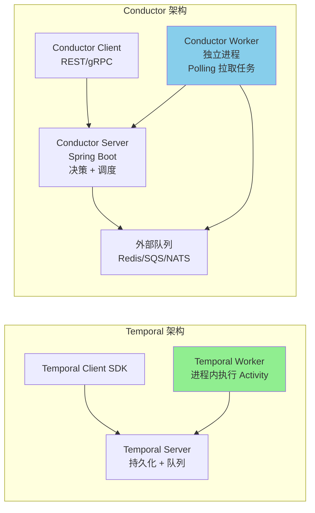
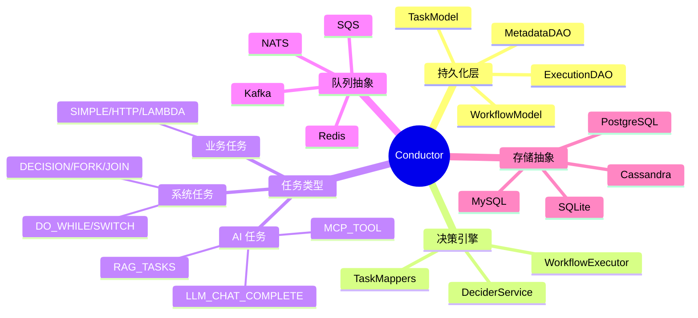

# 【Conductor】Netflix 出品的企业级 Agentic Workflow 引擎深度解析

## 引子

在分布式系统领域，工作流编排引擎并非新鲜事物——从早期的jbpm、Activiti，到Netflix内部自研的Conductor，再到近年来各Agent框架层出不穷的"工作流"概念，编排逻辑始终是系统可靠性的核心。但当大语言模型（LLM）浪潮来袭，**如何让 AI Agent 在生产环境中可靠运行、可观测、可干预、可扩展**，成了所有框架必须回答的问题。

今天要深度剖析的 **Conductor**，正是Netflix给出的答案。它最初于2015年在Netflix内部诞生，用于解决微服务编排的"回调地狱"问题；而在2022年开源后，Conductor迅速演进为一套完整的企业级Agentic Workflow引擎——**支持LLM任务、MCP工具调用、多租户、分布式持久化、可观测性**，被Netflix、Tesla、LinkedIn、J.P. Morgan等头部企业用于生产环境。

GitHub: https://github.com/conductor-oss/conductor ⭐ 31.8k

## 一、项目定位与核心价值

### 1.1 解决的问题

传统工作流引擎（如Activiti、Camunda）面向业务流程自动化（ BPA ），关注点是表单、审批流、状态机；而Conductor的核心设计目标是：**分布式系统中跨服务调用的编排与可靠性保障**。在这个基础上，它天然适合 AI Agent 的工作流场景：

| 痛点 | Conductor 的解法 |
|------|----------------|
| 多服务调用状态丢失 | **持久化工作流状态**，随时中断/恢复 |
| 分布式调用无幂等性 | **任务级别幂等 + 重试策略**，保障至少一次执行 |
| 失败定位困难 | **完整执行历史 + 事件流**，任意节点可回放 |
| AI Agent 不可靠 | **Human-in-the-loop + SIGTERM terminate**，人工干预节点 |
| LLM 调用成本高 | **响应缓存 + 限流**，避免重复消耗 |

### 1.2 核心定位

Conductor 的定位是：**分布式持久化的工作流与任务编排引擎**，强调三个关键特性：

1. **Durable（持久化）**：工作流状态不依赖进程生命周期，异常重启不丢状态
2. **Observable（可观测）**：每一步任务执行都有记录，完整审计追踪
3. **Scalable（可扩展）**：无状态执行器 + 多队列后端，支持水平扩展

### 1.3 技术栈概览

Conductor 由 Java 21 + Spring Boot 驱动，核心存储支持：
- **数据库**：PostgreSQL、MySQL、Cassandra、SQLite（嵌入式）
- **队列**：Redis Stream、RabbitMQ、NATS、AWS SQS、Azure Service Bus
- **向量库**：PostgreSQL（pgvector）、Pinecone、MongoDB Atlas（用于 AI RAG 场景）

## 二、架构设计

### 2.1 整体架构图



### 2.2 核心分层

```mermaid
graph LR
    subgraph DefinitionLayer["定义层 Definition"]
        WorkflowDef["WorkflowDef<br/>工作流定义<br/>YAML/JSON"]
        TaskDef["TaskDef<br/>任务定义<br/>重试/超时/限流"]
        WorkflowTask["WorkflowTask<br/>任务节点<br/>引用关系"]
    end

    subgraph RuntimeLayer["运行时层 Runtime"]
        WorkflowModel["WorkflowModel<br/>工作流实例"]
        TaskModel["TaskModel<br/>任务实例"]
        DeciderOutcome["DeciderOutcome<br/>决策结果"]
    end

    subgraph ExecutionLayer["执行层 Execution"]
        WorkflowExecutor["WorkflowExecutor<br/>执行器接口"]
        DeciderService["DeciderService<br/>状态决策服务"]
        TaskMappers["TaskMappers<br/>任务类型→执行逻辑"]
    end

    subgraph PersistenceLayer["持久化层"]
        MetadataDAO["MetadataDAO<br/>定义存储"]
        ExecutionDAO["ExecutionDAO<br/>运行时存储"]
        QueueDAO["QueueDAO<br/>队列管理"]
    end

    DefinitionLayer --> RuntimeLayer
    RuntimeLayer --> ExecutionLayer
    ExecutionLayer --> PersistenceLayer
```



## 三、核心机制深度解析

### 3.1 工作流定义模型

Conductor 的工作流通过 `WorkflowDef` 定义，采用 JSON/YAML 格式。以下是一个完整的示例：

```json
{
  "name": "ai_data_pipeline",
  "version": 1,
  "schemaVersion": 2,
  "ownerEmail": "team@example.com",
  "tasks": [
    {
      "name": "fetch_data",
      "taskReferenceName": "fetch_ref",
      "type": "HTTP",
      "inputParameters": {
        "http_request": {
          "uri": "https://api.example.com/data",
          "method": "GET",
          "headers": {
            "Authorization": "Bearer ${workflow.secrets.api_key}"
          }
        }
      },
      "retryCount": 3,
      "timeoutSeconds": 30
    },
    {
      "name": "process_data",
      "taskReferenceName": "process_ref",
      "type": "LLM_CHAT_COMPLETE",
      "inputParameters": {
        "llmProvider": "openai",
        "model": "gpt-4o-mini",
        "messages": [
          {"role": "system", "message": "你是一个数据处理助手"},
          {"role": "user", "message": "处理以下数据：${fetch_ref.output.response.body}"}
        ],
        "temperature": 0.3
      }
    },
    {
      "name": "store_result",
      "taskReferenceName": "store_ref",
      "type": "SUB_WORKFLOW",
      "inputParameters": {
        "subWorkflowName": "store_data_workflow",
        "input": {
          "processed_data": "${process_ref.output.content}"
        }
      }
    }
  ],
  "outputParameters": {
    "final_result": "${store_ref.output.result}"
  }
}
```

关键字段说明：

| 字段 | 含义 |
|------|------|
| `name` | 工作流名称，唯一标识 |
| `version` | 版本号，支持多版本并存 |
| `schemaVersion` | 当前固定为 2，表示第二代 schema |
| `tasks` | 任务列表，支持顺序、分支、并行 |
| `failureWorkflow` | 失败时触发的补偿工作流 |
| `restartable` | 是否支持从失败节点重启 |
| `timeoutSeconds` | 全局超时时间 |

### 3.2 任务类型体系（TaskType）

Conductor 内置了丰富的任务类型，覆盖企业级工作流的方方面面：

```java
public enum TaskType {
    // 基础任务
    SIMPLE,              // 通用任务，由 Worker 实现
    DYNAMIC,             // 动态任务，任务类型在运行时决定
    HTTP,                // HTTP 调用任务
    LAMBDA,              // 服务端轻量计算（不启动 Worker）
    INLINE,              // 内联脚本（GraalJS）

    // 流程控制
    DECISION,            // 条件分支（if-else）
    SWITCH,              // 多路分支（switch-case）
    FORK_JOIN,           // 并行分支
    FORK_JOIN_DYNAMIC,   // 动态并行（分支数运行时决定）
    JOIN,                // 并行分支汇合（等待所有分支完成）
    DO_WHILE,            // 循环（do-while 语义）

    // 子流程
    SUB_WORKFLOW,        // 子工作流调用
    START_WORKFLOW,       // 启动另一个工作流

    // 等待与事件
    WAIT,                // 等待（指定时间或外部信号）
    EVENT,               // 事件触发
    HUMAN,               // 人工审批任务

    // LLM / AI 任务
    LLM_CHAT_COMPLETE,   // 多轮对话
    LLM_TEXT_COMPLETE,   // 文本补全
    LLM_GENERATE_EMBEDDINGS,  // 生成向量
    LLM_STORE_EMBEDDINGS,     // 存储向量
    LLM_SEARCH_INDEX,         // 语义搜索
    LLM_GET_EMBEDDINGS,       // 获取向量
    LIST_MCP_TOOLS,           // 列出 MCP 工具
    CALL_MCP_TOOL,            // 调用 MCP 工具

    // 其他
    KAFKA_PUBLISH,       // Kafka 消息发布
    JSON_JQ_TRANSFORM,   // JSON 转换
    SET_VARIABLE,        // 设置变量
    TERMINATE,           // 终止工作流
    NOOP                 // 空操作
}
```

### 3.3 DeciderService：核心状态决策引擎

`DeciderService` 是 Conductor 的大脑，负责在每个工作流状态变化时，决定**接下来应该执行哪些任务**。

核心 `decide()` 方法的逻辑：

```java
public DeciderOutcome decide(WorkflowModel workflow) throws TerminateWorkflowException {
    // 1. 获取所有未执行、未跳过、未标记重试的任务
    List<TaskModel> unprocessedTasks = workflow.getTasks().stream()
        .filter(t -> !t.getStatus().equals(SKIPPED) && !t.isExecuted())
        .collect(Collectors.toList());

    // 2. 如果是新工作流（无任务），启动第一个任务
    List<TaskModel> tasksToBeScheduled = new LinkedList<>();
    if (unprocessedTasks.isEmpty()) {
        tasksToBeScheduled = startWorkflow(workflow);
    }

    // 3. 交给重载方法做深度决策
    return decide(workflow, tasksToBeScheduled);
}

private DeciderOutcome decide(WorkflowModel workflow, List<TaskModel> preScheduledTasks) {
    // 检查工作流是否已处于终态
    if (workflow.getStatus().isTerminal()) {
        return outcome; // 直接返回，不做任何决策
    }

    // 检查超时
    checkWorkflowTimeout(workflow);

    // 如果工作流被暂停，不做决策
    if (workflow.getStatus().equals(WorkflowModel.Status.PAUSED)) {
        return outcome;
    }

    // 遍历所有 pending 任务
    for (TaskModel pendingTask : pendingTasks) {
        // 系统任务（如 DECISION/FORK/JOIN）直接加入待调度
        if (systemTaskRegistry.isSystemTask(pendingTask.getTaskType())
                && !pendingTask.getStatus().isTerminal()) {
            tasksToBeScheduled.putIfAbsent(...);
        }

        // 用户任务：检查超时、限流等
        Optional<TaskDef> taskDef = pendingTask.getTaskDefinition();
        if (taskDef.isPresent()) {
            // 检查总超时
            // 检查任务级别超时
            // 检查限流
            // 如果条件满足，加入待调度
        }
    }

    return outcome;
}
```

**决策结果 `DeciderOutcome`** 包含：
- `tasksToBeScheduled`：本次需要调度执行的任务列表
- `terminateTask`：如果遇到 TERMINATE 任务，标记工作流终止

### 3.4 工作流状态机



### 3.5 任务执行模型

Worker 模式是 Conductor 的核心执行范式——**Conductor 服务器不执行具体业务逻辑，而是将任务"分配"给 Worker，Worker 主动拉取并执行**：

```java
// Worker 实现示例
public class DataProcessWorker implements Worker {

    @Override
    public String getTaskDefName() {
        return "process_data";  // 对应 WorkflowDef 中的 taskName
    }

    @Override
    public TaskResult execute(TaskModel task) {
        // 1. 从 task.getInputData() 获取输入
        Map<String, Object> input = task.getInputData();
        String data = (String) input.get("raw_data");

        // 2. 执行业务逻辑
        String result = process(data);

        // 3. 返回结果
        TaskResult result = new TaskResult(task);
        result.setStatus(TaskResult.Status.COMPLETED);
        result.getOutputData().put("processed", result);
        return result;
    }
}

// 注册 Worker
public class ConductorConfig {
    @Bean
    public WorkerFilter dataProcessWorkerFilter(DataProcessWorker worker) {
        return WorkerFactory.create(worker);
    }
}
```

任务的生命周期：

```mermaid
graph LR
    SCHEDULED["SCHEDULED<br/>任务创建"] --> POLLED["POLLED<br/>被 Worker 拉取"]
    POLLED --> IN_PROGRESS["IN_PROGRESS<br/>执行中"]
    IN_PROGRESS --> COMPLETED["COMPLETED<br/>成功"]
    IN_PROGRESS --> FAILED["FAILED<br/>失败"]
    FAILED --> SCHEDULED["重试"]
    IN_PROGRESS --> TIMED_OUT["TIMED_OUT<br/>超时"]
    COMPLETED --> [*]
    FAILED --> [*]
    TIMED_OUT --> [*]
```

### 3.6 AI 模块：内置 LLM 与 MCP 支持

Conductor 的 `ai` 模块直接内置了 LLM 任务类型，无需外部 Agent 框架即可构建 AI 工作流：

```json
{
  "name": "mcp_ai_agent_workflow",
  "tasks": [
    {
      "name": "discover_tools",
      "taskReferenceName": "discover_tools",
      "type": "LIST_MCP_TOOLS",
      "inputParameters": {
        "mcpServer": "http://localhost:3001/mcp"
      }
    },
    {
      "name": "plan",
      "taskReferenceName": "plan",
      "type": "LLM_CHAT_COMPLETE",
      "inputParameters": {
        "llmProvider": "anthropic",
        "model": "claude-3-5-sonnet-20241022",
        "messages": [
          {"role": "system", "message": "你是一个 AI Agent，可用工具：${discover_tools.output.tools}"}
        ]
      }
    },
    {
      "name": "execute",
      "taskReferenceName": "execute",
      "type": "CALL_MCP_TOOL",
      "inputParameters": {
        "mcpServer": "http://localhost:3001/mcp",
        "method": "${plan.output.result.method}",
        "arguments": "${plan.output.result.arguments}"
      }
    }
  ]
}
```

支持的 AI 任务类型：

| 任务类型 | 功能 |
|---------|------|
| `LLM_CHAT_COMPLETE` | 多轮对话，支持 function calling |
| `LLM_TEXT_COMPLETE` | 单次文本生成 |
| `LLM_GENERATE_EMBEDDINGS` | 生成向量嵌入 |
| `LLM_STORE_EMBEDDINGS` | 存储向量到向量库 |
| `LLM_SEARCH_INDEX` | 语义搜索 |
| `LLM_LIST_MCP_TOOLS` | 列出 MCP 服务器工具 |
| `CALL_MCP_TOOL` | 调用 MCP 工具 |
| `GENERATE_IMAGE` | 图像生成 |
| `GENERATE_AUDIO` | 语音合成 |

支持的 LLM Provider：OpenAI、Anthropic、Google Gemini、Azure OpenAI、AWS Bedrock、Mistral AI、Cohere、Grok、Perplexity AI、HuggingFace、Ollama（本地）。

## 四、Mermaid 数据流图

### 4.1 完整工作流执行数据流



### 4.2 DO_WHILE 循环数据流



## 五、与同类项目对比

### 5.1 横向对比

| 维度 | Conductor | Temporal | Prefect | Airflow |
|------|-----------|----------|---------|---------|
| 起源 | Netflix 内部 | Stripe/Cadence fork | 气象数据分析 | Airbnb 数据管道 |
| 语言 | Java 21 | Go | Python | Python |
| 工作流定义 | JSON/YAML | 代码优先 (Go/Java) | Python 代码 | DAG YAML/Python |
| 持久化 | 多数据库 | PostgreSQL/MySQL | PostgreSQL | MetaDB (PostgreSQL) |
| 队列 | 多队列支持 | SQS/SQS | 本地/远程 | MetaDB |
| LLM 任务 | 内置（30+任务类型） | 无 | 无 | 无 |
| MCP 支持 | 内置 | 无 | 无 | 无 |
| 多租户 | 支持 | 支持 | 有限 | 有限 |
| 状态恢复 | 任意节点重试 | 任意节点重试 | 从失败节点重跑 | 从失败节点重跑 |
| UI | 内置 Web UI | 内置 Web UI | Prefect UI | Airflow UI |

### 5.2 Temporal vs Conductor：核心设计差异

Temporala 和 Conductor 都是分布式持久化工作流引擎，但设计哲学有显著差异：

**Temporal 的设计哲学：**
- **代码即工作流**：工作流逻辑完全用代码（Go/Java/TS）表达，类型安全、可调试
- **Activity 重用**：同一 Activity 可被多个工作流复用
- **强类型 Signal/Query**：进程间通信有强类型保障

**Conductor 的设计哲学：**
- **声明式工作流**：工作流以 JSON/YAML 声明式定义，与运行时代码解耦
- **任务类型驱动**：通过 `TaskType` 枚举定义行为，可扩展性强
- **多租户友好**：内置 `workflowStatusListenerSink` 支持事件驱动审计
- **AI 原生**：内置 LLM/MCP 任务类型，无需胶水代码

**架构差异图：**



关键区别：
- **Temporal**：Activity 在 Worker 进程内执行，与工作流引擎在同一个进程，延迟更低但耦合更紧
- **Conductor**：Worker 完全独立，通过队列与服务器解耦，支持任意语言实现（Python/Java/Go均可）

## 六、优缺点分析

### 6.1 优点

| 维度 | 说明 |
|------|------|
| **架构简洁性** | 核心只有 `WorkflowExecutor` + `DeciderService` 两个入口，逻辑清晰 |
| **持久化完善** | 工作流状态全量持久化，任意节点可恢复、重试、重放 |
| **可观测性强** | 每个任务的状态变化、耗时、重试次数全部记录 |
| **多租户支持** | 内置 domain 隔离，支持多团队共享同一集群 |
| **AI 原生** | 内置 LLM 任务类型、RAG 任务、MCP 集成，开箱即用 |
| **高度可插拔** | DAO/Queue 全部抽象为接口，MySQL/Redis/Kafka 随意切换 |
| **生产验证** | Netflix 自用 10 年，生产案例包括 Tesla、LinkedIn、J.P. Morgan |

### 6.2 缺点与局限

| 维度 | 说明 |
|------|------|
| **概念复杂度** | System Task（DECISION/FORK/JOIN）与 User Task 混在一起，学习成本不低 |
| **Worker 模式开销** | 轮询队列的架构适合长时间任务，但短任务（如毫秒级 HTTP 调用）有额外延迟 |
| **JSON DSL 限制** | 复杂的条件分支在 JSON 中表达不够直观，Temporal 的代码优先方案更灵活 |
| **生态丰富度** | 相比 Temporal（背后有 Temporal.io 商业公司）和 Airflow（PyData 生态），Conductor 的社区和插件生态较小 |
| **无原生多 Agent 协作** | 没有内置的 agent-to-agent 通信协议，需要通过 SUB_WORKFLOW 或 EVENT 手工编排 |

## 七、快速上手

### 7.1 安装 Conductor Server（60秒）

```bash
# 安装 Conductor CLI
npm install -g @conductor-oss/conductor-cli

# 启动本地服务器（需要 Node.js v16+ 和 Java 21+）
conductor server start

# 打开 UI
# http://localhost:8080
```

或使用 Docker：

```bash
docker run -p 8080:8080 conductoross/conductor:latest
```

### 7.2 定义并运行工作流

**Step 1: 创建工作流定义文件 `my_workflow.json`：**

```json
{
  "name": "my_first_workflow",
  "version": 1,
  "tasks": [
    {
      "name": "call_api",
      "taskReferenceName": "api_ref",
      "type": "HTTP",
      "inputParameters": {
        "http_request": {
          "uri": "https://jsonplaceholder.typicode.com/posts/1",
          "method": "GET"
        }
      }
    },
    {
      "name": "log_result",
      "taskReferenceName": "log_ref",
      "type": "INLINE",
      "inputParameters": {
        "data": "${api_ref.output.response.body}",
        "evaluatorType": "graaljs",
        "expression": "(function() { var d = $.data; return { postId: d.id, title: d.title }; })()"
      }
    }
  ],
  "outputParameters": {
    "result": "${log_ref.output.result}"
  },
  "schemaVersion": 2,
  "ownerEmail": "dev@example.com"
}
```

**Step 2: 注册并运行：**

```bash
# 创建工作流
conductor workflow create my_workflow.json

# 启动执行（同步等待结果）
conductor workflow start -w my_first_workflow --sync

# 异步执行
conductor workflow start -w my_first_workflow
```

### 7.3 Python Worker 示例

```python
from conductor import ConductorWorker, TaskResult

worker = ConductorWorker(
    url="http://localhost:8080",
    auth_key="",
    debug=True
)

@worker.register("process_data")
def process_data(task):
    """处理数据任务"""
    input_data = task["inputData"]
    raw = input_data.get("raw_text")

    # 业务逻辑
    processed = raw.upper()

    return TaskResult(
        task_id=task["taskId"],
        status="COMPLETED",
        output_data={"processed": processed}
    )

# 启动 Worker
worker.start()
```

## 八、总结与趋势

### 8.1 核心架构总结



### 8.2 适用场景

- ✅ **AI Agent 工作流**：内置 LLM/MCP 任务，适合构建 RAG Agent、多步骤推理 Agent
- ✅ **微服务编排**：HTTP/Event 任务类型，适合服务间复杂调用编排
- ✅ **多租户平台**：内置 domain 隔离，适合 SaaS 化 AI 平台
- ✅ **需要人工干预的工作流**：`HUMAN` 任务类型，适合审批/复核场景
- ⚠️ **毫秒级低延迟任务**：Worker 轮询模式有额外开销，不适合超低延迟场景
- ⚠️ **纯代码逻辑工作流**：如果工作流逻辑极复杂（数百个条件分支），JSON DSL 不如代码直观

### 8.3 趋势观察

1. **AI Agent 集成深化**：Conductor 的 AI 模块正在快速演进，MCP 集成和多 Provider 支持是当前重点
2. **多语言 Worker 生态**：Python SDK 和 JavaScript SDK 的完善使得 Conductor 能服务更广泛的 AI 应用场景
3. **向量数据库深度集成**：RAG 任务与 pgvector/Pinecone/MongoDB Atlas 的集成正在从"能用"走向"好用"

Conductor 代表了一类不同于 LangChain/AutoGen 的 AI Agent 基础设施思路——**它不追求"让 AI 帮你写代码"，而是追求"让 AI 工作流在生产环境中可靠运行"**。这种务实的设计哲学，是它能在 Netflix、Tesla 等公司经受住十年生产验证的根本原因。
