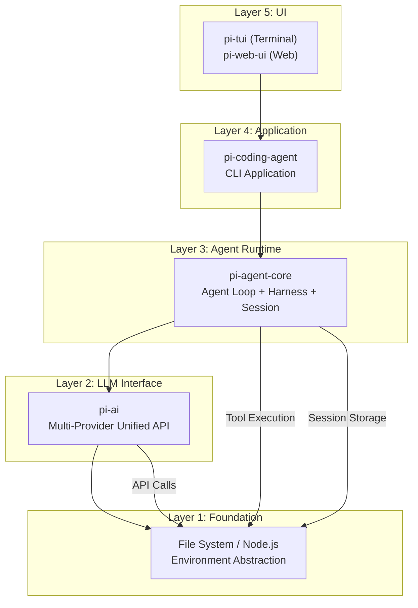
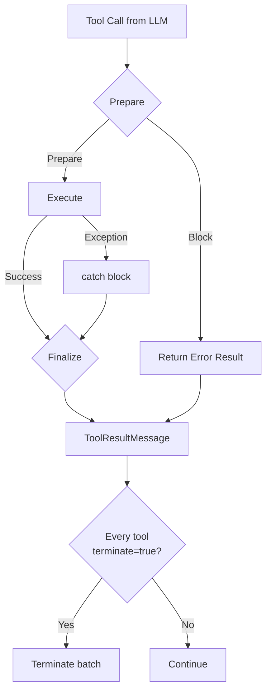
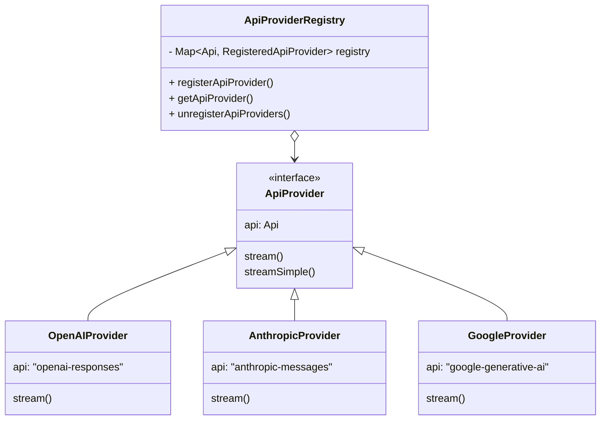

# 【earendil-works/pi】模块化 Agent Harness 架构深度解析：Skill、Compaction 与多 Provider 统一抽象

## 引子

在 Agent 框架遍地开花的今天，`earendil-works/pi` 是一个独特的存在。它不只是一个 Coding Agent 终端工具，而是一套**分层清晰、职责分明**的 Agent 运行时架构。截至 2026 年 5 月，`pi` 在 GitHub 拥有约 **49,000+ ⭐**，由独立开发者 `badlogic` 维护，采用全 TypeScript/Monorepo 架构，包含了 5 个正交分层的包。

今天我们就来深度拆解它的核心设计。

## 项目概览

| 指标 | 值 |
|------|-----|
| GitHub | [earendil-works/pi](https://github.com/earendil-works/pi) |
| 语言 | TypeScript (Monorepo) |
| Stars | ~49,000 ⭐ |
| 包数量 | 5 个（`pi-ai`, `pi-agent-core`, `pi-coding-agent`, `pi-tui`, `pi-web-ui`） |
| 最近更新 | 2026-05-14（极度活跃） |
| License | MIT |

**核心定位**：一套可扩展的 Agent 运行时框架，核心亮点是** Skill 机制**（可组合的 prompt 模板）、**Context Compaction**（长会话压缩）和**多 Provider 统一 LLM API**。

## 整体架构

`pi` 的架构遵循严格的**分层模型**，各层职责清晰、依赖单向：



### 包职责一览

| 包名 | 职责 |
|------|------|
| `@earendil-works/pi-ai` | 统一多 Provider LLM API（OpenAI/Anthropic/Google/Mistral/Bedrock 等） |
| `@earendil-works/pi-agent-core` | Agent 运行时核心：Agent Loop、Tool Calling、Session 管理、Compaction |
| `@earendil-works/pi-coding-agent` | 交互式 Coding Agent CLI，整合所有层 |
| `@earendil-works/pi-tui` | 终端 UI 库（差分渲染） |
| `@earendil-works/pi-web-ui` | Web 组件库（ChatPanel、Artifacts 等） |

## 核心一：Agent Loop 机制

`pi-agent-core` 的核心是一个**事件驱动的 Agent Loop**，定义在 `packages/agent/src/agent-loop.ts` 中。

### 循环结构

`Agent Loop` 采用**双层嵌套循环**：

```mermaid
sequenceDiagram
    participant User as User Message
    participant Loop as Outer Loop
    participant Inner as Inner Loop
    participant LLM as LLM Provider
    participant Tool as Tool Executor
    participant Emit as Event Emitter

    User->>Loop: new prompts + context
    Loop->>Emit: agent_start
    Loop->>Inner: while(hasToolCalls OR pendingMessages)
    
    Inner->>Emit: turn_start
    Inner->>LLM: streamAssistantResponse()
    LLM-->>Inner: AssistantMessage
    Emit->>Emit: message_start/update/end
    
    alt hasToolCalls
        Inner->>Tool: executeToolCalls()
        Tool-->>Inner: ToolResultMessage[]
        Inner->>Emit: tool_execution_start/end
    end
    
    Inner->>Emit: turn_end
    
    alt shouldStopAfterTurn()
        Loop->>Emit: agent_end
        Loop-->>User: Done
    else followUpMessages exist
        Loop->>Inner: continue outer loop
    else no more messages
        Loop->>Emit: agent_end
        Loop-->>User: Done
    end
```

### 核心类型定义

```typescript
// packages/agent/src/types.ts

// 工具执行模式
export type ToolExecutionMode = "sequential" | "parallel";

// 队列模式（处理用户排队消息）
export type QueueMode = "all" | "one-at-a-time";

// 工具调用前后钩子
export interface BeforeToolCallResult {
  block?: boolean;       // 阻止工具执行
  reason?: string;      // 阻止原因
}

export interface AfterToolCallResult {
  content?: (TextContent | ImageContent)[];
  details?: unknown;
  isError?: boolean;
  terminate?: boolean;  // 提示 Agent 停止
}

// Agent 上下文
export interface AgentContext {
  messages: AgentMessage[];
  tools?: AgentTool<any>[];
  systemPrompt?: string;
  // ...
}
```

### 消息流向转换

关键设计：`AgentMessage[]` 在 **Agent Loop 内部全程使用**，只在 **调用 LLM 时**才转换为 Provider 兼容的 `Message[]`：

```mermaid
flow LR
    A[AgentMessage<br/>内部格式] -->|convertToLlm| B[Message<br/>LLM Provider 格式]
    B --> C[LLM API]
    C --> D[AssistantMessageEvent]
    D --> E[AssistantMessage<br/>转换回内部格式]
    E --> A
```

```typescript
// Agent Loop 中调用 LLM 的关键转换
async function streamAssistantResponse(
  context: AgentContext,
  config: AgentLoopConfig,
  // ...
): Promise<AssistantMessage> {
  let messages = context.messages;
  
  // 应用上下文变换（AgentMessage[] → AgentMessage[]）
  if (config.transformContext) {
    messages = await config.transformContext(messages, signal);
  }
  
  // 转换为 LLM 兼容格式（AgentMessage[] → Message[]）
  const llmMessages = await config.convertToLlm(messages);
  
  const llmContext: Context = {
    systemPrompt: context.systemPrompt,
    messages: llmMessages,
    tools: context.tools,
  };
  
  // 调用统一 AI 层
  const response = await streamFunction(config.model, llmContext, options);
  // ...
}
```

## 核心二：Tool Calling 生命周期

`pi` 的工具调用设计非常精细，分为 **Prepare → Execute → Finalize** 三阶段：

### 三阶段执行模型



### 核心代码

```typescript
// 1. Prepare 阶段：验证参数，可选择阻止执行
async function prepareToolCall(
  currentContext: AgentContext,
  assistantMessage: AssistantMessage,
  toolCall: AgentToolCall,
  config: AgentLoopConfig,
  signal: AbortSignal | undefined,
): Promise<PreparedToolCall | ImmediateToolCallOutcome> {
  const tool = currentContext.tools?.find((t) => t.name === toolCall.name);
  
  // 验证参数
  const validatedArgs = validateToolArguments(tool, preparedToolCall);
  
  // beforeToolCall 钩子
  if (config.beforeToolCall) {
    const beforeResult = await config.beforeToolCall({ assistantMessage, toolCall, args: validatedArgs, context: currentContext }, signal);
    if (beforeResult?.block) {
      return {
        kind: "immediate",
        result: createErrorToolResult(beforeResult.reason || "Tool execution was blocked"),
        isError: true,
      };
    }
  }
  
  return { kind: "prepared", toolCall, tool, args: validatedArgs };
}

// 2. Execute 阶段：实际运行工具
async function executePreparedToolCall(
  prepared: PreparedToolCall,
  signal: AbortSignal | undefined,
  emit: AgentEventSink,
): Promise<ExecutedToolCallOutcome> {
  try {
    const result = await prepared.tool.execute(
      prepared.toolCall.id,
      prepared.args,
      signal,
      // 部分结果回调（用于流式更新）
      (partialResult) => {
        emit({ type: "tool_execution_update", ... });
      },
    );
    return { result, isError: false };
  } catch (error) {
    return {
      result: createErrorToolResult(error instanceof Error ? error.message : String(error)),
      isError: true,
    };
  }
}

// 3. Finalize 阶段：afterToolCall 钩子，可修改结果
async function finalizeExecutedToolCall(
  currentContext: AgentContext,
  assistantMessage: AssistantMessage,
  prepared: PreparedToolCall,
  executed: ExecutedToolCallOutcome,
  config: AgentLoopConfig,
  signal: AbortSignal | undefined,
): Promise<FinalizedToolCallOutcome> {
  let result = executed.result;
  let isError = executed.isError;

  if (config.afterToolCall) {
    const afterResult = await config.afterToolCall(
      { assistantMessage, toolCall: prepared.toolCall, args: prepared.args, result, isError, context: currentContext },
      signal,
    );
    if (afterResult) {
      result = {
        content: afterResult.content ?? result.content,
        details: afterResult.details ?? result.details,
        terminate: afterResult.terminate ?? result.terminate,
      };
      isError = afterResult.isError ?? isError;
    }
  }

  return { toolCall: prepared.toolCall, result, isError };
}
```

### 顺序 vs 并行执行

```typescript
// 支持两种工具执行模式
if (config.toolExecution === "sequential" || hasSequentialToolCall) {
  return executeToolCallsSequential(currentContext, assistantMessage, toolCalls, config, signal, emit);
}
return executeToolCallsParallel(currentContext, assistantMessage, toolCalls, config, signal, emit);
```

- **Sequential（顺序）**：上一个工具完成才执行下一个，适合有依赖的调用
- **Parallel（并行）**：所有工具同时执行，结果按 LLM 输出顺序排序返回

## 核心三：Skill 机制

`pi` 最具创新性的设计之一是 **Skill**——一种**自包含的 prompt 模板单元**，以 `SKILL.md` 文件形式存在。

### SKILL.md 结构

```markdown
<!-- SKILL.md -->

# Skill Name

## 触发条件
描述何时应该调用此 Skill

## 执行指南
详细的执行步骤...

## 示例
```
some example code
```
```

### Skill 加载与调用

```typescript
// packages/agent/src/harness/skills.ts

export async function loadSkills(
  env: ExecutionEnv,
  dirs: string | string[],
): Promise<{ skills: Skill[]; diagnostics: SkillDiagnostic[] }> {
  // 递归遍历目录
  // 加载 SKILL.md 文件
  // 解析 YAML frontmatter
  // 尊重 .gitignore 规则
  // ...
}

// Skill 调用格式化为特殊标签
export function formatSkillInvocation(skill: Skill, additionalInstructions?: string): string {
  return `<skill name="${skill.name}" location="${skill.filePath}">
References are relative to ${dirnameEnvPath(skill.filePath)}.

${skill.content}
</skill>`;
}
```

### Skill 触发机制

Skill 不需要代码注册。Agent 在推理过程中**自然地发现**并调用 Skill，Skill 内容被格式化为特殊的 XML 标签嵌入到 prompt 中：

```xml
<skill name="add-block" location="/path/to/SKILL.md">
References are relative to /path/to/skills.

<!-- Skill 内容全文 -->
Here are the guidelines for adding a block...
</skill>
```

这意味着：
- **无需修改代码**即可扩展 Agent 行为
- Skill 可以版本控制（存在仓库中）
- Skill 之间可以组合（一个 Skill 调用另一个 Skill）

## 核心四：Context Compaction（上下文压缩）

长会话的上下文会不断增长，`pi` 实现了**自动上下文压缩**机制。

### 压缩触发条件

当会话长度超过阈值（可通过配置），自动触发压缩：

1. 提取对话中的**文件操作**（read/edit/write）
2. 使用 **Branch Summary** 机制总结分支对话
3. 生成**压缩摘要消息**注入 context
4. 删除中间的消息历史

### 核心代码

```typescript
// packages/agent/src/harness/compaction/compaction.ts

export async function compact(
  entries: SessionTreeEntry[],    // 完整 session tree
  messages: AgentMessage[],        // 当前活跃消息
  compactionIndex: number,         // 触发压缩的位置
  model: Model<any>,
): Promise<CompactionEntry> {
  
  // 1. 提取文件操作
  const fileOps = extractFileOperations(messages, entries, prevCompactionIndex);
  
  // 2. 序列化对话供 LLM 总结
  const serialized = serializeConversation(entriesBeforeCompaction, compactionIndex);
  
  // 3. 调用 LLM 生成摘要
  const summary = await completeSimple(model, {
    system: SUMMARIZATION_SYSTEM_PROMPT,
    message: `Summarize this conversation concisely:\n${serialized}`,
  });
  
  // 4. 创建压缩摘要
  const compactionEntry: CompactionEntry = {
    type: "compaction",
    id: generateEntryId(byId),
    timestamp: Date.now(),
    summary,
    tokensBefore: calculateTokens(entriesBeforeCompaction),
    firstKeptEntryId: entriesAfterCompaction[0]?.id,
    details: { readFiles: [...fileOps.read], modifiedFiles: [...fileOps.edited] },
  };
  
  return compactionEntry;
}
```

### Branch Summary（分支摘要）

`pi` 的 Session 支持**树形分支**，分支合并不只是简单丢弃，而是生成"分支摘要"：

```typescript
// 生成分支摘要
const branchSummary = await generateBranchSummary(branchEntries, model);
// 摘要消息被注入到主分支
messages.push(createBranchSummaryMessage(branchSummary, fromId, timestamp));
```

## 核心五：多 Provider 统一 AI 层

`@earendil-works/pi-ai` 提供了**统一的多 Provider LLM API**，解决了"换 Provider 需要改代码"的问题。

### Provider 架构



### Provider 注册

```typescript
// packages/ai/src/providers/register-builtins.ts
import { registerApiProvider } from "../api-registry.js";

registerApiProvider({
  api: "anthropic-messages",
  stream: streamAnthropic,
  streamSimple: streamSimpleAnthropic,
});

registerApiProvider({
  api: "openai-responses",
  stream: streamOpenAIResponses,
  streamSimple: streamSimpleOpenAIResponses,
});

// ... 更多 Provider
```

### 统一调用接口

```typescript
import { getModel, streamSimple } from "@earendil-works/pi-ai";

// 获取任意 Provider 的模型
const model = getModel("anthropic", "claude-sonnet-4-20250514");
// 或
const model = getModel("openai", "gpt-4o");

// 统一调用方式
const stream = await streamSimple(model, context, options);

for await (const event of stream) {
  switch (event.type) {
    case "text_delta":
      process.stdout.write(event.delta);
      break;
    case "done":
      return event.message;
  }
}
```

### 支持的 Provider

| Provider | API 类型 | 模型示例 |
|----------|----------|----------|
| Anthropic | `anthropic-messages` | claude-sonnet-4, claude-opus-4 |
| OpenAI | `openai-responses` | gpt-4o, gpt-4o-mini |
| Google | `google-generative-ai` | gemini-2.5-pro, gemini-2.5-flash |
| Azure OpenAI | `azure-openai-responses` | azure-gpt-4o |
| Mistral | `mistral` | mistral-large, mistral-small |
| Amazon Bedrock | `amazon-bedrock` | claude-on-bedrock |
| GitHub Copilot | `github-copilot` | copilot 模型 |

## 核心六：Session 树形管理

`pi` 的 Session 不是简单的消息列表，而是一个**树形结构**，支持分支和合并。

### Session Tree Entry 类型

```typescript
type SessionTreeEntry =
  | { type: "message"; id: string; message: AgentMessage }
  | { type: "custom_message"; id: string; customType: string; ... }
  | { type: "label"; id: string; label?: string; targetId: string }
  | { type: "thinking_level_change"; id: string; thinkingLevel: ThinkingLevel }
  | { type: "model_change"; id: string; provider: string; modelId: string }
  | { type: "compaction"; id: string; summary: string; ... }
  | { type: "branch_summary"; id: string; summary: string; fromId: string; ... };
```

### JSONL 持久化

Session 以 **JSONL** 格式存储，每行一个 JSON 对象：

```jsonl
{"type":"session","version":3,"id":"abc123","timestamp":"2026-05-15T08:00:00Z","cwd":"/project"}
{"type":"message","id":"msg1","role":"user","content":[{"type":"text","text":"Hello"}],"timestamp":1715760000000}
{"type":"message","id":"msg2","role":"assistant","content":[{"type":"text","text":"Hi!"}],"timestamp":1715760001000}
{"type":"label","id":"lbl1","label":"my-branch","targetId":"msg2"}
```

```typescript
// packages/agent/src/harness/session/jsonl-storage.ts

export async function loadJsonlSessionMetadata(
  fs: JsonlSessionStorageFileSystem,
  filePath: string,
): Promise<JsonlSessionMetadata> {
  const content = getOrThrow(await fs.readTextFile(filePath));
  for (const line of content.split("\n")) {
    if (!line.trim()) break;
    const header = JSON.parse(line) as SessionHeader;
    if (header.type === "session") {
      return headerToSessionMetadata(header, filePath);
    }
  }
}
```

## 与同类框架对比

### vs LangChain

| 维度 | LangChain | pi |
|------|-----------|-----|
| 语言 | Python + JS | TypeScript |
| 抽象层级 | 较高（Chain/LLM/Agent） | 中等（Loop/Harness/Session） |
| 多 Provider | 通过 LangChain 集成 | 统一 `pi-ai` API Registry |
| Skill 机制 | Prompt Template | SKILL.md 文件（更自然） |
| Context 管理 | 自行管理 | Session Tree + Compaction |
| 状态持久化 | 多种方式 | JSONL Session 文件 |

### vs smolagents（HuggingFace）

| 维度 | smolagents | pi |
|------|-----------|-----|
| 核心 | 单 Agent + Tool | 模块化 Harness + 多包 |
| 多 Provider | 主要 OpenAI/Anthropic | 7+ Provider |
| Skill | 通过装饰器注册 | SKILL.md 文件 |
| Context | 滚动窗口 | Compaction + Branch Summary |

### vs CrewAI

| 维度 | CrewAI | pi |
|------|--------|-----|
| 核心 | Multi-Agent Team | 单 Agent Harness |
| 协作 | Agent 间通过 Task 协作 | Session 内分支合并 |
| 工具注册 | 代码装饰器 | 运行时发现 + SKILL.md |

## 优缺点分析

### ✅ 优点

**架构简洁性**：
- Monorepo 分层清晰，每层职责单一
- Agent Loop 只有 200 行核心逻辑，可读性极高
- Session Tree 设计优雅地解决了分支问题

**扩展性**：
- `registerApiProvider` 机制让添加新 Provider 只需 100 行代码
- Skill 机制让非程序员也能扩展 Agent 行为
- Extension 机制允许 Hook 介入 Tool 执行各阶段

**易用性**：
- `createAgentSession()` 一行启动完整 Agent
- CLI 开箱即用，无需配置
- 多 Provider 切换只需改模型名

### ⚠️ 缺点

**性能**：
- TypeScript 运行时开销，Python 框架无法直接比较
- JSONL Session 在超长会话下可能需要定期压缩

**复杂度**：
- 5 个包的依赖关系需要一定学习成本
- 完整源码有 675 个 TS 文件，大型项目

**维护性**：
- 独立开发者维护，商业支持依赖社区
- 路线图不透明（无 public roadmap）

**功能**：
- 缺乏内置 Multi-Agent 协作（需要自己基于 Session 扩展）
- 没有官方 RAG 集成（需自行对接向量库）

## 快速上手

### 安装

```bash
# npm
npm install -g @earendil-works/pi-coding-agent

# 或从源码构建
git clone https://github.com/earendil-works/pi
cd pi
npm install
npm run build
```

### 最简使用

```typescript
// 01-minimal.ts
import { createAgentSession } from "@earendil-works/pi-coding-agent";

const { session } = await createAgentSession();

session.subscribe((event) => {
  if (event.type === "message_update" && 
      event.assistantMessageEvent.type === "text_delta") {
    process.stdout.write(event.assistantMessageEvent.delta);
  }
});

await session.prompt("What files are in the current directory?");
```

### 全控制模式

```typescript
// 12-full-control.ts
import { getModel } from "@earendil-works/pi-ai";
import { createAgentSession, SettingsManager } from "@earendil-works/pi-coding-agent";

const model = getModel("anthropic", "claude-sonnet-4-20250514");

const { session } = await createAgentSession({
  cwd: process.cwd(),
  agentDir: "/tmp/my-agent",
  model,
  thinkingLevel: "off",
  tools: ["read", "bash"],
});

await session.prompt("List files in the current directory.");
```

### 创建自定义 Skill

```markdown
<!-- SKILL.md -->
---
name: my-custom-skill
description: 执行自定义分析任务
---

# My Custom Skill

当需要执行自定义分析时调用此 Skill。

## 执行步骤
1. 收集必要信息
2. 调用分析工具
3. 返回结构化结果
```

将 `SKILL.md` 放入 `.pi/skills/` 目录，Agent 会自动发现并使用。

## 总结

`earendil-works/pi` 是一个**架构设计极为优雅**的 Agent 框架。它的核心价值在于：

1. **分层解耦**：5 个包各司其职，替换任意层不影响其他层
2. **Skill 机制**：开创性的 prompt 模板单元化设计
3. **Compaction**：长会话管理的成熟方案
4. **多 Provider 统一**：一次编写，随处运行

对于需要**深度定制 Agent 行为**的团队，`pi` 提供的 Harness 层（`pi-agent-core`）是一个极佳的基础。相比直接使用 LangChain，从零构建的复杂度更低，扩展点更清晰。

**推荐指数**：⭐⭐⭐⭐（扣一星因为缺乏 Multi-Agent 原生支持）

---

*本文分析基于 `earendil-works/pi` 2026-05-14 最新源码。*
