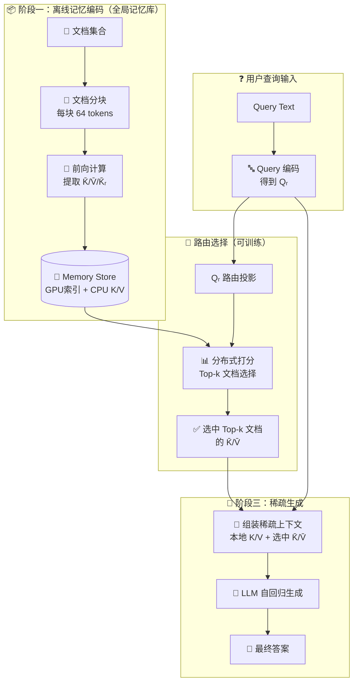
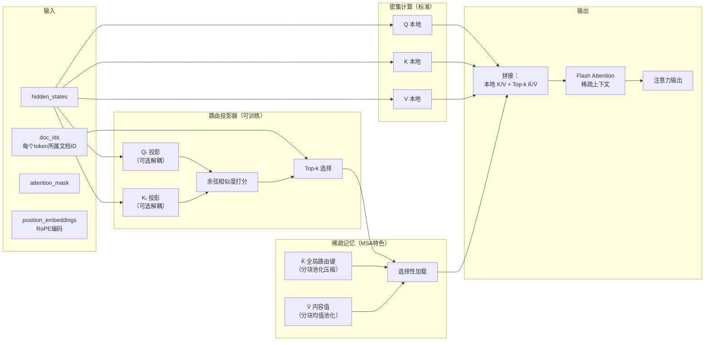
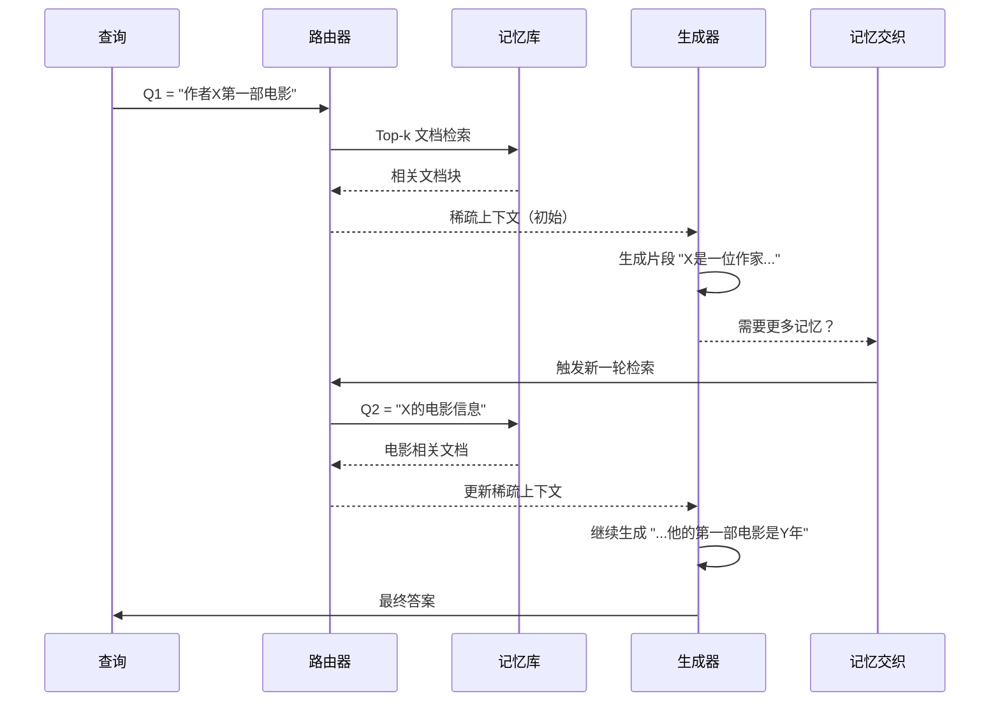

# 【MSA】突破100M Token 上下文：记忆稀疏注意力架构深度解析

## 引子

大语言模型（LLM）的上下文长度一直是衡量其能力的重要指标。从 GPT-4 的 128K 到 Claude 的 1M，再到各家厂商宣传的"超长上下文"，数字在不断攀升。但在这场数字游戏的背后，一个根本性的瓶颈始终没有被真正解决——**全注意力（Full Attention）的 O(L²) 复杂度**。

当上下文从 16K 扩展到 1 亿（100M）Token 时，标准 Transformer 的注意力计算量会膨胀到一个完全无法承受的程度。128K 还能勉强接受，但 100M 呢？差距是 781 倍——这不是工程优化能够弥补的，这是算法层面的指数级爆炸。

那么，如何在保持模型能力的同时，将有效上下文从 16K 扩展到 100M 而不至于崩溃？今天要深入分析的这个开源项目 **MSA（Memory Sparse Attention）**，就给出了一个令人眼前一亮的答案——端到端可训练的稀疏隐式记忆框架，在 16K→100M 的范围内，性能下降不超过 **9%**。

> 项目地址：[EverMind-AI/MSA](https://github.com/EverMind-AI/MSA)，⭐ 3.4K，2025 年 10 月创建，2026 年 5 月仍有活跃更新

---

## 1. 背景：为什么全注意力是长上下文的"天花板"

在深入 MSA 之前，我们需要先理解为什么长上下文如此困难。

Transformer 的核心是**自注意力机制**：对于序列中的每个 token，它需要与序列中所有其他 token 计算注意力分数。当序列长度为 L 时，单层注意力的计算复杂度是 **O(L²)**，而 decoder 自回归生成时需要逐个生成 token，总复杂度是 **O(L³)**（ Prefill 阶段的 O(L²) 乘以 Decode 阶段的 O(L)）。

这意味着：
- 16K tokens：可接受
- 128K tokens：需要 Flash Attention 等工程优化
- 1M tokens：接近极限
- 100M tokens：全注意力计算量是 16K 的 **390,625 倍**——完全不可能

### 现有解决方案及其局限

学术界和工业界尝试了多种方法来突破这个限制：

| 方案 | 代表技术 | 核心思想 | 局限 |
|------|---------|---------|------|
| **混合线性注意力** | Mamba, RWKV | 用线性化近似替代 softmax 注意力 | 精度衰减快，外推能力弱 |
| **固定状态记忆** | RNN, LSTM, xLSTM | 压缩历史到固定大小的隐状态 | 难以存储精确的细粒度信息 |
| **外部存储检索** | RAG, Agent Memory | 将长文档切块，用向量数据库检索 | 检索与生成解耦，误差累积 |
| **稀疏注意力** | Longformer, BigBird | 只对局部/全局位置计算注意力 | 需要预训练，扩展性有限 |
| **滑动窗口 + 全局** | Mistral, DeepSeek | 分段处理 + 稀疏全局交互 | 跨文档推理能力弱 |

这些方案有一个共同的根本问题：**检索（记忆）与生成（推理）是解耦的两个模块**。这导致：
1. 检索结果的质量直接影响生成效果
2. 无法端到端优化整个记忆-推理 pipeline
3. 多跳推理需要在多次检索-生成之间反复迭代

MSA 的核心创新，就是把**记忆当作模型的一等公民**，让它成为可训练的稀疏注意力层——从算法层面而非工程层面解决这个问题。

---

## 2. MSA 核心定位与价值

MSA（Memory Sparse Attention）给自己的定位是：

> **一个可扩展、端到端可训练的隐式记忆框架，支持 100M Token 上下文**

### 核心价值主张

1. **端到端可训练**：记忆模块不是外挂的检索系统，而是模型本身的一部分，可以和模型主干的参数一起训练更新
2. **近线性复杂度**：将 O(L²) 的全注意力转化为稀疏的 O(L) 级别
3. **超长上下文**：从 16K 到 100M Token，性能下降 < 9%
4. **多跳推理原生支持**：通过"记忆交织"机制，原生支持跨文档、多轮、多跳的复杂推理

### 关键性能数据

在 MS MARCO、NQ、TriviaQA、PopQA、MuSiQue 等多个长上下文问答和 NIAH（大海捞针）基准测试中，MSA 相比：
- 同骨干（Qwen3-4B）标准 RAG：**+16.0%**
- 同骨干 RAG + 重排序：**+11.5%**
- HippoRAG2：**+14.8%**

---

## 3. 核心架构：三层设计

MSA 的架构可以分为三个层次来理解：

### 3.1 整体架构图



### 3.2 记忆稀疏注意力层（核心创新）

MSA 的核心是 `MemorySparseAttention` 层，替代标准 Transformer 中的全注意力层：



### 3.3 关键技术设计

#### 3.3.1 文档级 RoPE（Parallel RoPE）

标准 RoPE 对整个序列连续编码位置。但 MSA 将文档视为独立单元，每个文档内部的位置从 0 开始重新编码：

```python
# 文档级 RoPE 的核心思想
# 每个文档独立 position embedding，避免跨文档位置干扰

# 全局 RoPE：查询的起始位置偏移 Top-k 块数，保持因果顺序
query_start_offset = top_k_doc_blocks  # 背景 → 查询 → 生成

# 文档内 RoPE：每个文档独立从0开始
def apply_document_rope(query_states, doc_ids, rope_dim):
    # 将 doc_ids 映射到组ID，每个文档组内 position 从0开始
    group_ids = map_tensor_to_group_ids(doc_ids)  # [L]
    # 对每个文档组独立应用 RoPE
    ...
```

这样做的好处是**短训练、长推理**：模型在 64K tokens 上训练，但可以推理时处理 100M tokens，因为文档级 RoPE 不受绝对位置限制。

#### 3.3.2 KV 缓存压缩：分块均值池化

对于每个文档的 token，MSA 使用**固定大小的卷积核进行均值池化**：

```python
# src/msa/memory_sparse_attention.py（核心逻辑）
pooling_kernel_size = config.msa_config.pooling_kernel_size  # 默认 64

# 每 64 个连续 token 压缩为一个"记忆块"
# K̄ = mean_pool(K[doc_chunk]), V̄ = mean_pool(V[doc_chunk])
# K̄ᵣ 用于路由打分（经 head 维度和 token 维度的双重池化）
```

| 压缩参数 | 值 | 说明 |
|---------|-----|------|
| `pooling_kernel_size` | 64 | 每 64 个 token 压缩为 1 个记忆块 |
| `doc_top_k` | 16 | Top-16 文档被选中参与注意力 |
| 压缩比 | 64:1 | 100M tokens → ~1.56M 记忆块 |

#### 3.3.3 记忆并行推理引擎

MSA 的推理分为两个 Stage：

**Stage 1（Prefill Stage1）**：将用户查询的 K/V 缓存到 GPU，并行编码各文档的 Top-k 选择结果。

```python
# src/prefill.py — Stage1 Worker
# 每个 GPU 并行处理一批文档，输出该 GPU 上的 Top-k 文档及其 K/V
class PrefillStage1Worker:
    def process_documents(self, doc_ids, hidden_states):
        # 1. 计算路由分数
        router_query = self.router_q_proj(hidden_states)
        router_key = self.router_k_proj(document_hidden)
        
        # 2. 余弦相似度打分
        scores = F.cosine_similarity(router_query, router_key, dim=-1)
        
        # 3. 取 Top-k
        topk_values, topk_indices = torch.topk(scores, k=self.top_k_docs)
        
        # 4. 返回选中的文档 K/V
        return selected_kv_pairs
```

**Stage 2（Prefill Stage2）**：汇总各 GPU 的 Top-k 结果，组装稀疏上下文，进行最终的 Prefill。

```python
# src/msa_service.py — MSAEngine
# 记忆并行：将 K̄ᵣ 索引分片到多个 GPU
# 查询广播 → 本地打分 → 全局归约
class MSAEngine:
    def forward_with_memory_parallel(self, query_states, memory_chunks):
        # K̄ᵣ 分片：每个 GPU 只有部分路由键
        # 查询广播到所有 GPU
        query_broadcast = broadcast_to_all_gpus(query_states)
        
        # 并行打分
        local_scores = [gpu.compute_scores(query_broadcast) for gpu in gpus]
        
        # 全局归约得到 Top-k
        global_topk = reduce_topk(local_scores)
        
        # 按需加载 K̄/V̄（从 CPU 异步拉回）
        return self.assemble_sparse_context(global_topk, query_states)
```

---

## 4. 记忆交织机制：多跳推理的秘密

MSA 的另一个核心创新是**记忆交织（Memory Interleave）**，用于支持跨多个文档的多跳推理。

### 4.1 为什么需要记忆交织？

在多跳问答中（比如"作者 X 的第一部电影是哪年上映的？"），答案需要跨越多个文档：
1. 文档 A 提到 X 是作者
2. 文档 B 提到 X 写了某本书
3. 文档 C 提到该书改编成了电影

普通的 RAG 方案需要多次检索→生成迭代，误差会不断累积。MSA 的记忆交织机制让模型能够在生成过程中**自适应地触发新的记忆检索**：



### 4.2 三阶段推理流水线

MSA 的完整推理流水线如下：

```mermaid
flowchart TD
    A["📥 阶段一\n全局记忆编码"] -->|"离线，一次性"| B["💾 记忆存储\nK̄/V̄/K̄ᵣ 分块"]
    B -->|"查询进入"| C["🔍 阶段二A\n在线路由选择"]
    C -->|"Top-k 文档"| D["📥 按需加载\n选中 K̄/V̄"]
    D --> E["🔗 组装稀疏上下文"]
    E --> F["⚡ 阶段二B\nPrefill + Sparse Attn"]
    F --> G["🎯 阶段三\n自回归解码"]
    G -->|{"需要更多上下文?"}| C
    G --> H["📝 最终输出"]
```

---

## 5. 核心源码解读

### 5.1 MemorySparseAttention 层

```python
# src/msa/memory_sparse_attention.py（核心实现）

class MemorySparseAttention(Qwen3Attention):
    def __init__(self, config: Qwen3Config, layer_idx: int):
        super().__init__(config=config, layer_idx=layer_idx)
        self.layer_idx = layer_idx
        self.top_k_docs = config.msa_config.top_k_docs  # Top-k 文档数
        self.pooling_kernel_size = config.msa_config.pooling_kernel_size  # 池化核大小
        
        # 路由层配置：可以是 "all" 或逗号分隔的层索引
        self.router_layer_idx = config.msa_config.router_layer_idx
        if self.router_layer_idx == "all":
            self.router_layer_idx = list(range(config.num_hidden_layers))
        else:
            self.router_layer_idx = [int(i) for i in self.router_layer_idx.split(",")]
        self.is_router_layer = self.layer_idx in self.router_layer_idx
        
        # 可选解耦路由投影器（将路由与普通注意力分离）
        if self.is_router_layer and self.decouple_router:
            self.router_k_proj = nn.Sequential(
                nn.Linear(config.hidden_size, config.num_key_value_heads * self.head_dim, bias=False),
            )
            self.router_q_proj = nn.Sequential(
                nn.Linear(config.hidden_size, config.num_attention_heads * self.head_dim, bias=False),
            )
```

### 5.2 稀疏注意力前向传播

```python
    def forward_with_kvcache_for_batch_parrallel(
        self,
        hidden_states: torch.Tensor,
        doc_ids: torch.LongTensor,
        attention_mask: Optional[torch.Tensor] = None,
        position_embeddings: Optional[Tuple[torch.Tensor, torch.Tensor]] = None,
        past_key_value: Optional[Tuple[torch.Tensor, torch.Tensor]] = None,
        **kwargs,
    ) -> Tuple[torch.Tensor, Optional[torch.Tensor]]:
        
        bsz, q_len, _ = hidden_states.shape
        device, dtype = hidden_states.device, hidden_states.dtype
        
        # Step 1: 标准 Q/K/V 投影
        query_states = self.q_norm(self.q_proj(hidden_states).view(
            bsz, q_len, -1, self.head_dim
        )).transpose(1, 2)
        key_states = self.k_norm(self.k_proj(hidden_states).view(
            bsz, q_len, -1, self.head_dim
        )).transpose(1, 2)
        value_states = self.v_proj(hidden_states).view(
            bsz, q_len, -1, self.head_dim
        ).transpose(1, 2)
        
        # 应用 RoPE（文档级）
        cos, sin = position_embeddings
        query_states, key_states = apply_rotary_pos_emb(
            query_states, key_states, cos, sin
        )
        
        # Step 2: 确定当前阶段
        stage = past_key_value.cache_kwargs[self.layer_idx]["stage"]
        
        if stage == "prefill_stage1":
            # 路由层：计算 Top-k 文档
            if self.is_router_layer:
                # 对文档进行分组，计算组内 token 数
                _, counts = torch.unique_consecutive(global_doc_ids, return_counts=True)
                
                # 路由投影：Q 和 Kᵣ 分别处理
                router_q = self.router_q_proj(hidden_states)
                router_k = self.router_k_proj(document_hidden_states)
                
                # 对注意力头和 token 取双重池化 → 相似度打分
                router_q_pooled = router_q.mean(dim=1)  # [B, H, D]
                router_k_pooled = router_k.mean(dim=1)  # [B, H, D]
                scores = F.cosine_similarity(router_q_pooled, router_k_pooled, dim=-1)
                
                # Top-k 文档选择
                topk_values, topk_indices = torch.topk(scores, k=self.top_k_docs)
                
                # 收集选中文档的 K̄/V̄
                selected_k = gather_topk_kv(key_states, topk_indices)
                selected_v = gather_topk_kv(value_states, topk_indices)
                
                # 与本地 K/V 拼接
                key_states = torch.cat([key_states, selected_k], dim=2)
                value_states = torch.cat([value_states, selected_v], dim=2)
            
            # Flash Attention（稀疏上下文）
            attn_output = flash_attn_varlen_func(
                query_states, key_states, value_states,
                max_seqlen_q, max_seqlen_k
            )
```

### 5.3 文档 ID 映射工具

```python
    @staticmethod
    def map_tensor_to_group_ids(a: torch.Tensor) -> torch.Tensor:
        """将 doc_ids 映射为连续的组 ID，用于 RoPE 文档级编码"""
        if a.ndim != 1:
            raise ValueError("输入 Tensor a 必须是一维的")
        
        # 找到 doc_id 发生变化的位置
        diff_mask = torch.diff(a) != 0  # [L-1]
        id_increments = diff_mask.int()  # [L-1]
        
        # 累加得到组ID（每个文档一个独立ID）
        group_indices_offset = torch.cumsum(id_increments, dim=0)  # [L-1]
        
        # 在最前面补 0，形成完整的组ID序列
        b = torch.cat((
            torch.tensor([0], device=a.device, dtype=a.dtype),
            group_indices_offset
        )) + 1
        
        return b
```

### 5.4 MSAEngine 服务启动

```python
# src/msa_service.py — 完整的多 GPU 推理服务

class MSAEngine:
    def __init__(self, model_path: str, devices: List[int]):
        self.model = MSAForCausalLM.from_pretrained(
            model_path,
            device_map="auto",
            torch_dtype=torch.bfloat16,
        )
        self.devices = devices  # GPU 列表
        self.world = len(devices)
        
        # 初始化各阶段 Worker
        self.prefill_stage1_workers = [
            PrefillStage1Worker(gpu_id=dev) for dev in devices
        ]
        self.memory_workers = [
            MemoryWorker(gpu_id=dev) for dev in devices
        ]
    
    def generate(self, query: str, memory_files: List[str]) -> str:
        # Step 1: 对记忆库进行离线编码（仅首次）
        memory_embeddings = self.encode_memory(memory_files)
        
        # Step 2: 查询编码 + 路由选择
        query_input = compose_input(query, template=self.template)
        query_ids = tokenize(query_input)
        
        # Step 3: 多 GPU 并行 Prefill
        stage1_results = self.prefill_stage1_parallel(query_ids, memory_embeddings)
        
        # Step 4: 汇总 + Stage2 Prefill
        sparse_context = self.prefill_stage2(stage1_results)
        
        # Step 5: 自回归生成
        output_ids = self.model.generate(
            sparse_context,
            max_new_tokens=256,
            temperature=0.0,
        )
        
        return decode(output_ids)
```

---

## 6. 优缺点分析

### 优点

| 维度 | 分析 |
|------|------|
| **架构简洁性** | ✅ 记忆模块直接融入注意力层，无需外挂检索系统，架构统一 |
| **扩展性** | ✅ 近线性 O(L) 复杂度，从 16K 到 100M 均可支持，跨文档推理无压力 |
| **端到端可训练** | ✅ 记忆选择器可与 LLM 主干联合训练，记忆质量可持续优化 |
| **多跳推理** | ✅ 记忆交织机制原生支持跨文档多跳，无需多次检索-生成迭代 |
| **精度保持** | ✅ 16K→100M 性能下降 < 9%，显著优于同类方案 |

### 缺点与挑战

| 维度 | 分析 |
|------|------|
| **工程复杂度** | ⚠️ 多 GPU 分布式推理引擎（Memory Parallel）需要精细的工程实现 |
| **路由层设计** | ⚠️ 需要仔细设计哪些层作为路由层（`router_layer_idx`），不当配置影响效果 |
| **文档切分依赖** | ⚠️ 对文档边界的感知依赖预分块策略，分块大小（64 tokens）对质量有影响 |
| **通用性** | ⚠️ 目前基于 Qwen3-4B 定制，换模型需要完整转换和重训练 |
| **外部知识更新** | ⚠️ 新增文档需重新编码记忆库，不适合高频动态更新的场景 |

---

## 7. 横向对比：MSA vs 竞品

### 7.1 方案对比总览

| 维度 | **MSA** | **标准 RAG** | **HippoRAG2** | **Longformer** |
|------|---------|-------------|---------------|----------------|
| 记忆形式 | 隐式（可训练） | 显式（向量检索） | 显式（子图索引） | 显式（稀疏掩码） |
| 检索-生成耦合 | 端到端联合 | 解耦（两阶段） | 解耦（两阶段） | 端到端（预训练） |
| 上下文长度 | **100M** | 受限于检索质量 | 受限于索引规模 | 16K（滑动窗口） |
| 16K→100M 衰减 | **< 9%** | N/A | N/A | 无法扩展 |
| 多跳推理 | 原生交织 | 多次迭代 | 多次迭代 | 受限 |
| 训练成本 | 中等（增量训练） | 无需训练 | 无需训练 | 全量预训练 |

### 7.2 核心设计差异

#### MSA vs 标准 RAG

**RAG** 的检索与生成是两个完全独立的系统：
```
Query → Vector Search → Top-k Chunks → Prompt组装 → LLM生成
              ↑                              ↑
         独立优化                      独立优化
```

**MSA** 将检索内化为注意力层的稀疏选择：
```
Query → 路由投影 → Top-k文档选择 → 稀疏注意力 → 直接生成
              ↑                            ↑
         与 LLM 联合训练              端到端可微
```

这个设计差异带来两个关键优势：
1. **误差不累积**：RAG 的检索错误会级联影响生成；MSA 的记忆选择器是可学习的，错误选择可以通过训练被修正
2. **信息利用更充分**：RAG 每次只取 Top-k chunks；MSA 在生成过程中可以动态触发新的记忆检索

#### MSA vs HippoRAG2

HippoRAG2 是一个结构化的外部记忆系统，使用知识图谱对文档进行索引。MSA 与它的核心区别在于**记忆的表示形式**：

- **HippoRAG2**：记忆是外部知识图谱，需要通过图遍历来检索
- **MSA**：记忆是模型内部的隐式状态，不需要显式检索管道

MSA 的方案更简洁，但 HippoRAG2 在结构化知识（如实体关系）上的推理能力更强。

---

## 8. 使用指南

### 8.1 环境安装

```bash
# 1. 创建 conda 环境
conda create -n msa python=3.12 -y
conda activate msa

# 2. 安装依赖
pip install -r requirements.txt
# transformers==4.51.3, liger_kernel==0.5.10, accelerate==1.0.1

# 3. 安装 Flash Attention（关键依赖）
pip install flash-attn==2.7.4.post1 --no-build-isolation

# 4. 下载预训练模型
mkdir ckpt
export HF_ENDPOINT=https://hf-mirror.com
huggingface-cli download --resume-download \
    EverMind-AI/MSA-4B --local-dir ckpt/MSA-4B
```

### 8.2 快速推理

```python
from src.msa_service import MSAEngine
from src.config.memory_config import GenerateConfig, ModelConfig, MemoryConfig

# 初始化配置
model_cfg = ModelConfig(
    model_path="ckpt/MSA-4B",
    doc_top_k=16,
    pooling_kernel_size=64,
)
gen_cfg = GenerateConfig(
    devices=[0, 1],  # 双 GPU
    template="QWEN3_INSTRUCT_TEMPLATE",
    max_generate_tokens=256,
)

# 启动引擎
engine = MSAEngine(model_cfg, gen_cfg)

# 加载记忆库（离线编码）
memory_files = ["data/msmarco_corpus.jsonl"]
engine.load_memory(memory_files)

# 查询
query = "作者乔布斯的第一份工作是什么？"
answer = engine.generate(query)
print(answer)
```

### 8.3 自定义记忆库构建

```python
# 对自定义文档构建记忆
from src.utils.tools import encode_documents_to_memory

# 文档编码（生成 K̄/V̄/K̄ᵣ）
documents = [
    {"id": "doc1", "text": "乔布斯是苹果公司的联合创始人..."},
    {"id": "doc2", "text": "1974年，乔布斯在Atari找到了他的第一份工作..."},
]

memory_chunks = encode_documents_to_memory(
    documents,
    pooling_kernel_size=64,
    save_path="my_memory.msa"
)

# 后续推理时加载
engine.load_memory(["my_memory.msa"])
```

---

## 9. 总结与趋势

### 9.1 MSA 的核心贡献

MSA 最重要的贡献，不是实现了 100M 上下文的数字突破，而是**重新定义了"记忆"在 LLM 中的地位**：

| 传统观点 | MSA 的观点 |
|---------|-----------|
| 记忆是外部存储 | 记忆是可训练的隐状态 |
| 检索与生成解耦 | 检索是注意力的稀疏形式 |
| 上下文长度是瓶颈 | 上下文长度可通过稀疏化扩展 |

### 9.2 局限性与未来方向

1. **模型通用性**：当前基于 Qwen3-4B，未来需要扩展到更多模型架构
2. **动态记忆更新**：新增文档需重新编码，需要研究增量记忆更新机制
3. **多模态支持**：目前仅支持文本，期待扩展到多模态记忆
4. **硬件协同优化**：Memory Parallel 的调度策略还有很大的优化空间

### 9.3 个人评价

MSA 让我想起了当年 ResNet 带给视觉领域的感觉——不是在小修小补，而是从**优化目标**的层面重新定义了问题。全注意力范式统治了 Transformer 时代这么多年，稀疏化虽然早就有人研究，但 MSA 真正做到了**端到端可训练 + 工程可落地**的结合。

当然，它也不是银弹。记忆的边界、如何处理跨语言场景、如何与 Agent 系统结合，都有待进一步探索。但至少，它让我们看到了一条通向真正长上下文的可行路径——不是靠暴力算力，而是靠**让模型自己学会记住什么**。

---

## 参考链接

- **GitHub**: [EverMind-AI/MSA](https://github.com/EverMind-AI/MSA)
- **HuggingFace**: [EverMind-AI/MSA-4B](https://huggingface.co/EverMind-AI/MSA-4B)
- **论文**: [arXiv:2603.23516](https://arxiv.org/abs/2603.23516)
- **基准测试数据**: [EverMind-AI/MSA-RAG-BENCHMARKS](https://huggingface.co/datasets/EverMind-AI/MSA-RAG-BENCHMARKS)

---

*本文由 AI 自动生成，调研时间：2026-05-16*
