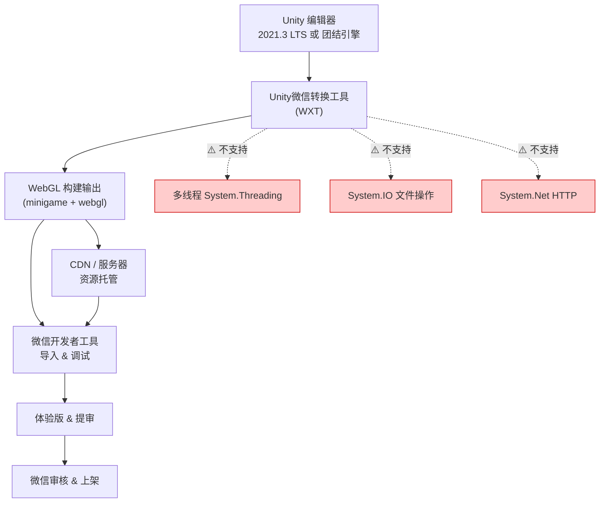
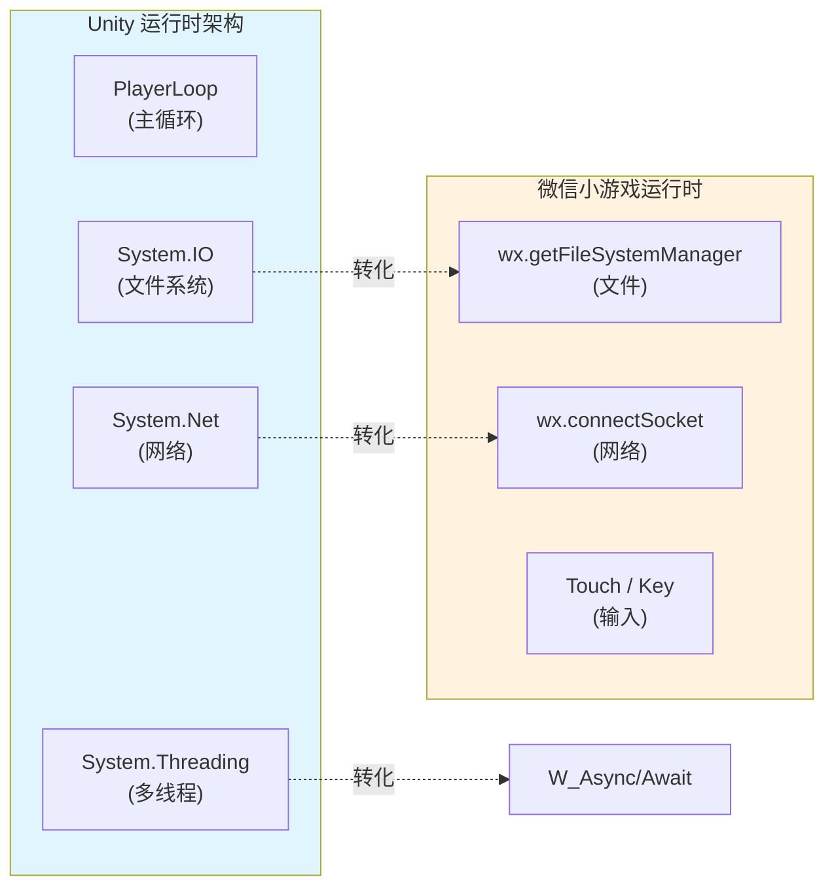
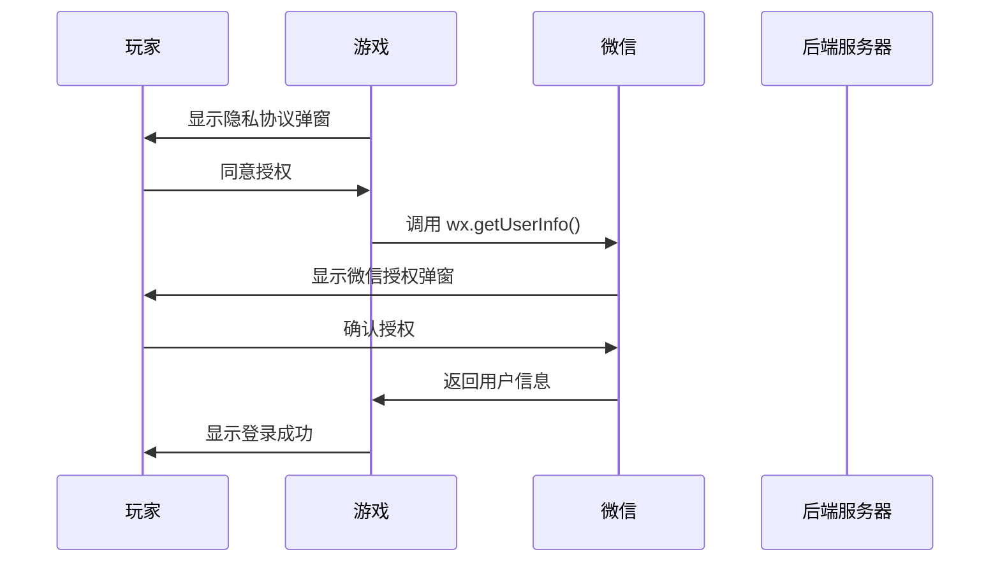
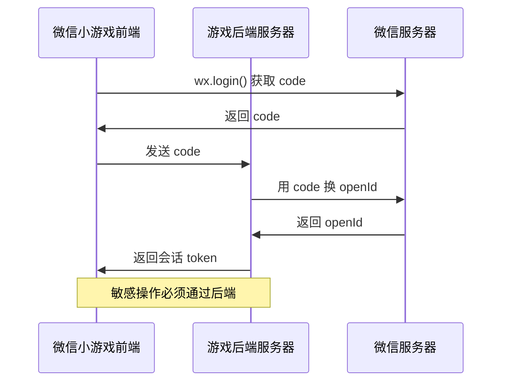
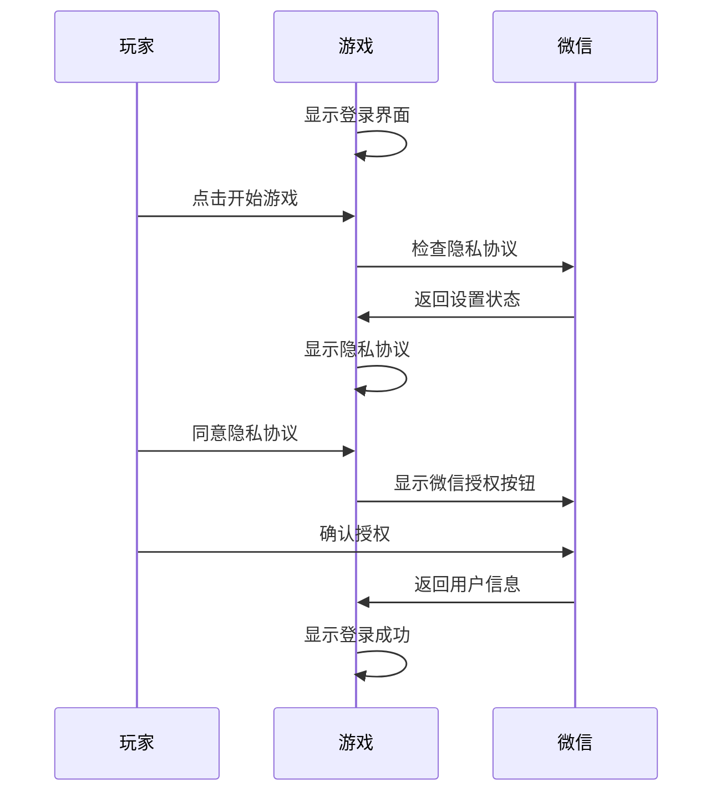

# Unity开发微信小游戏完整指南：从0到1的实战教程

## 引子

微信小游戏凭借其轻量化、易传播的特性，已成为移动游戏市场的重要赛道。根据腾讯2024年财报，微信小游戏的月活跃用户已超过5亿，商业化规模持续扩大。对于Unity开发者而言，这无疑是一个充满机遇的增量市场。

但当Unity开发者真正踏入这个领域时，会发现它并不是一个「一键导出」的简单流程——而是一场关于技术栈取舍、平台限制与架构设计能力的深度考验。

本文将从**架构视角**出发，结合**完整可运行的代码示例**，手把手带你完成一个微信小游戏的开发全流程。无论你是Unity新手，还是想拓展微信小游戏赛道的开发者，跟着本文做，就能完成你的第一个微信小游戏项目。

---

## 项目简介

### 什么是微信小游戏？

微信小游戏是微信客户端内嵌的轻量级游戏平台，基于HTML5技术栈（实际运行在改动的Chromium内核上），但提供了丰富的微信特有API，包括：

- **用户登录**：通过微信授权获取用户基本信息
- **好友关系**：获取好友列表、排行榜等社交功能
- **支付**：微信支付能力（需单独申请）
- **分享**：主动触达好友的能力
- **文件存储**：本地持久化存储
- **开放数据域**：隔离好友数据，防止作弊

微信小游戏的包体限制为**4MB**（不含分包），可以通过代码分包扩展到**8MB**。

### Unity转微信小游戏的本质

Unity转微信小游戏，本质上是将Unity的WebGL构建目标，转换为微信小游戏能够识别的格式。



**为什么需要转换？**

Unity编辑器默认输出的WebGL包是为浏览器设计的，而微信小游戏虽然底层也是Web技术栈，但有自己独特的运行环境、文件系统、输入系统和API体系。WXT（Unity微信转换工具）就是连接Unity与微信小游戏的桥梁。

---

## 架构分析

### Unity与微信小游戏的技术架构对比



### 微信小游戏的技术边界

| 能力 | Unity原生 | 微信小游戏 | 替代方案 |
|------|----------|-----------|----------|
| **多线程** | System.Threading ✓ | ✗ | 协程 async/await |
| **文件系统** | System.IO ✓ | ✗ | wx.getFileSystemManager |
| **HTTP请求** | HttpWebRequest ✓ | ✗ | UnityWebRequest / wx.request |
| **WebSocket** | System.Net.Sockets ✓ | ✗ | UnityWebRequest + wss:// |
| **本地存储** | PlayerPrefs | wx.setStorageSync | 数据加密存储 |

---

## 核心机制详解

### 协程替代多线程

Unity的协程是替代多线程的首选方案。在微信小游戏中，所有的异步操作都基于JavaScript的Promise机制，而Unity的协程正好可以很好地封装这些操作。

```csharp
public IEnumerator RequestUserInfo(string openId)
{
    string url = "https://api.example.com/user/" + openId;
    
    using (UnityWebRequest request = new UnityWebRequest(url, "GET"))
    {
        request.downloadHandler = new DownloadHandlerBuffer();
        
        yield return request.SendWebRequest();
        
        if (request.result == UnityWebRequest.Result.Success)
        {
            string jsonResponse = request.downloadHandler.text;
            UserData userData = JsonUtility.FromJson<UserData>(jsonResponse);
            Debug.Log("获取用户信息成功: " + userData.nickname);
        }
        else
        {
            Debug.LogError("网络请求失败: " + request.error);
        }
    }
}
```

### 微信文件系统完整教程

#### 1. 文件系统基础概念

微信小游戏的文件系统分为以下几个区域：

- **用户数据目录** (`wx.env.USER_DATA_PATH`)：持久化存储用户数据
- **缓存目录**：可被微信清理，建议用于临时缓存
- **包内资源** (`wx.env.MINI_PROGRAM_PATH`)：只读

#### 2. 文件操作完整代码

```csharp
using WeChatWASM;
using System;

public class FileSystemExample : MonoBehaviour
{
    // 写入文本文件
    public void WriteTextFile(string fileName, string content)
    {
        var fileManager = wx.getFileSystemManager();
        string filePath = wx.env.USER_DATA_PATH + "/" + fileName;
        
        fileManager.writeFile({
            filePath: filePath,
            data: content,
            encoding: 'utf8',
            success: () => { Debug.Log("文件写入成功: " + filePath); },
            fail: (err) => { Debug.LogError("文件写入失败: " + err.errMsg); }
        });
    }
    
    // 读取文本文件
    public void ReadTextFile(string fileName)
    {
        var fileManager = wx.getFileSystemManager();
        string filePath = wx.env.USER_DATA_PATH + "/" + fileName;
        
        fileManager.readFile({
            filePath: filePath,
            encoding: 'utf8',
            success: (res) => {
                Debug.Log("文件读取成功: " + res.data);
            },
            fail: (err) => {
                Debug.LogError("文件读取失败: " + err.errMsg);
                if (err.errMsg.Contains("not found"))
                {
                    Debug.Log("文件不存在，创建新存档");
                    CreateNewSaveFile(fileName);
                }
            }
        });
    }
    
    // 创建目录
    public void CreateDirectory(string dirPath)
    {
        var fileManager = wx.getFileSystemManager();
        string fullPath = wx.env.USER_DATA_PATH + "/" + dirPath;
        
        fileManager.mkdir({
            dirPath: fullPath,
            success: () => { Debug.Log("目录创建成功: " + fullPath); },
            fail: (err) => {
                if (!err.errMsg.Contains("file already exists"))
                    Debug.LogError("目录创建失败: " + err.errMsg);
            }
        });
    }
    
    // 检查文件是否存在
    public void CheckFileExists(string fileName, Action<bool> callback)
    {
        var fileManager = wx.getFileSystemManager();
        string filePath = wx.env.USER_DATA_PATH + "/" + fileName;
        
        fileManager.access({
            path: filePath,
            success: () => { callback(true); },
            fail: () => { callback(false); }
        });
    }
    
    // 删除文件
    public void DeleteFile(string fileName)
    {
        var fileManager = wx.getFileSystemManager();
        string filePath = wx.env.USER_DATA_PATH + "/" + fileName;
        
        fileManager.unlink({
            filePath: filePath,
            success: () => { Debug.Log("文件删除成功"); },
            fail: (err) => { Debug.LogError("文件删除失败: " + err.errMsg); }
        });
    }
    
    private void CreateNewSaveFile(string fileName)
    {
        string defaultContent = "{\"version\":1,\"data\":{}}";
        WriteTextFile(fileName, defaultContent);
    }
}
```

#### 3. 存档系统的完整实现

```csharp
using System;
using System.Security.Cryptography;
using System.Text;
using UnityEngine;
using WeChatWASM;

public class SaveSystem : MonoBehaviour
{
    private const string SAVE_FILE_NAME = "gamesave.json";
    private const string ENCRYPT_KEY = "YourSecretKey12345678901234567890";
    private const int CURRENT_SAVE_VERSION = 2;
    
    public static SaveSystem Instance { get; private set; }
    
    void Awake()
    {
        if (Instance == null) { Instance = this; DontDestroyOnLoad(gameObject); }
        else { Destroy(gameObject); }
    }
    
    public void SaveGame(GameSaveData data)
    {
        data.version = CURRENT_SAVE_VERSION;
        data.timestamp = DateTime.UtcNow.Ticks;
        string jsonString = JsonUtility.ToJson(data);
        string encrypted = Encrypt(jsonString);
        WriteSaveFile(encrypted);
    }
    
    public void LoadGame(Action<GameSaveData> onSuccess, Action<string> onError)
    {
        ReadSaveFile(
            (encrypted) => {
                try
                {
                    string jsonString = Decrypt(encrypted);
                    GameSaveData data = JsonUtility.FromJson<GameSaveData>(jsonString);
                    MigrateSaveData(data);
                    onSuccess?.Invoke(data);
                }
                catch (Exception e)
                {
                    Debug.LogError("存档解析失败: " + e.Message);
                    onError?.Invoke("存档格式损坏");
                }
            },
            (error) => {
                if (error == "FILE_NOT_FOUND")
                {
                    onSuccess?.Invoke(CreateNewSaveData());
                }
                else { onError?.Invoke(error); }
            }
        );
    }
    
    private void WriteSaveFile(string content)
    {
        var fileManager = wx.getFileSystemManager();
        string filePath = wx.env.USER_DATA_PATH + "/" + SAVE_FILE_NAME;
        
        fileManager.writeFile({
            filePath: filePath,
            data: content,
            encoding: 'utf8',
            success: () => { Debug.Log("存档保存成功"); },
            fail: (err) => { Debug.LogError("存档保存失败: " + err.errMsg); }
        });
    }
    
    private void ReadSaveFile(Action<string> onSuccess, Action<string> onError)
    {
        var fileManager = wx.getFileSystemManager();
        string filePath = wx.env.USER_DATA_PATH + "/" + SAVE_FILE_NAME;
        
        fileManager.readFile({
            filePath: filePath,
            encoding: 'utf8',
            success: (res) => { onSuccess?.Invoke(res.data); },
            fail: (err) => {
                if (err.errMsg.Contains("not found")) onError?.Invoke("FILE_NOT_FOUND");
                else onError?.Invoke(err.errMsg);
            }
        });
    }
    
    private string Encrypt(string plainText)
    {
        try
        {
            byte[] keyBytes = Encoding.UTF8.GetBytes(ENCRYPT_KEY.Substring(0, 32));
            byte[] ivBytes = Encoding.UTF8.GetBytes(ENCRYPT_KEY.Substring(0, 16));
            
            using (Aes aes = Aes.Create())
            {
                aes.Key = keyBytes;
                aes.IV = ivBytes;
                aes.Mode = CipherMode.CBC;
                aes.Padding = PaddingMode.PKCS7;
                
                using (ICryptoTransform encryptor = aes.CreateEncryptor())
                {
                    byte[] plainBytes = Encoding.UTF8.GetBytes(plainText);
                    byte[] encryptedBytes = encryptor.TransformFinalBlock(plainBytes, 0, plainBytes.Length);
                    return Convert.ToBase64String(encryptedBytes);
                }
            }
        }
        catch (Exception e) { Debug.LogError("加密失败: " + e.Message); return plainText; }
    }
    
    private string Decrypt(string encryptedText)
    {
        byte[] keyBytes = Encoding.UTF8.GetBytes(ENCRYPT_KEY.Substring(0, 32));
        byte[] ivBytes = Encoding.UTF8.GetBytes(ENCRYPT_KEY.Substring(0, 16));
        
        using (Aes aes = Aes.Create())
        {
            aes.Key = keyBytes;
            aes.IV = ivBytes;
            aes.Mode = CipherMode.CBC;
            aes.Padding = PaddingMode.PKCS7;
            
            using (ICryptoTransform decryptor = aes.CreateDecryptor())
            {
                byte[] encryptedBytes = Convert.FromBase64String(encryptedText);
                byte[] decryptedBytes = decryptor.TransformFinalBlock(encryptedBytes, 0, encryptedBytes.Length);
                return Encoding.UTF8.GetString(decryptedBytes);
            }
        }
    }
    
    private void MigrateSaveData(GameSaveData data)
    {
        if (data.version < 1) { data.version = 1; }
        if (data.version < 2) { data.settings = new GameSettings(); data.version = 2; }
    }
    
    private GameSaveData CreateNewSaveData()
    {
        return new GameSaveData { 
            version = CURRENT_SAVE_VERSION, 
            currentLevel = 1, 
            totalPlayTime = 0, 
            highScore = 0
        };
    }
}

[System.Serializable]
public class GameSaveData
{
    public int version;
    public long timestamp;
    public int currentLevel;
    public int totalPlayTime;
    public int highScore;
    public bool tutorialCompleted;
    public GameSettings settings;
}

[System.Serializable]
public class GameSettings
{
    public float musicVolume = 0.8f;
    public float sfxVolume = 1.0f;
    public bool vibrationEnabled = true;
}
```

### 用户登录与信息获取

#### 1. 隐私协议与授权流程

**重要提醒**：根据微信平台规则，获取用户头像和昵称必须先展示隐私协议并获得用户同意。



#### 2. 完整的登录系统实现

```csharp
using System;
using UnityEngine;
using WeChatWASM;

public class WeChatLoginManager : MonoBehaviour
{
    public event Action<UserInfo> OnLoginSuccess;
    public event Action<string> OnLoginFailed;
    
    private bool isLoggingIn = false;
    
    public void StartLogin()
    {
        if (isLoggingIn) { Debug.LogWarning("登录中，请勿重复点击"); return; }
        isLoggingIn = true;
        CheckPrivacySetting();
    }
    
    private void CheckPrivacySetting()
    {
        wx.getSetting({
            success: (res) => {
                if (res.authSetting["scope.userInfo"]) { GetUserInfoDirect(); }
                else { ShowWeChatAuthButton(); }
            },
            fail: (err) => { Debug.LogError("获取设置失败: " + err.errMsg); GetUserInfoDirect(); }
        });
    }
    
    private void ShowWeChatAuthButton()
    {
        var button = wx.createUserInfoButton({
            type: 'text',
            text: '获取头像昵称',
            style: { 
                left = Screen.width / 2 - 100, 
                top = Screen.height / 2 - 30, 
                width = 200, 
                height = 60, 
                backgroundColor = '#4CAF50', 
                color = '#ffffff', 
                fontSize = 16 
            }
        });
        
        button.OnTap((res) => {
            Debug.Log("用户点击授权按钮");
            button.destroy();
            if (res.errMsg == "getUserInfo:ok") { HandleUserInfoSuccess(res.userInfo); }
            else { OnLoginFailed?.Invoke("授权失败"); isLoggingIn = false; }
        });
    }
    
    private void GetUserInfoDirect()
    {
        wx.getUserInfo({
            withCredentials: true,
            lang: 'zh_CN',
            success: (res) => { HandleUserInfoSuccess(res.userInfo); },
            fail: (err) => { Debug.LogError("获取用户信息失败: " + err.errMsg); ShowWeChatAuthButton(); }
        });
    }
    
    private void HandleUserInfoSuccess(dynamic userInfo)
    {
        UserInfo info = new UserInfo { 
            nickname = userInfo.nickName, 
            avatarUrl = userInfo.avatarUrl, 
            gender = userInfo.gender 
        };
        OnLoginSuccess?.Invoke(info);
        isLoggingIn = false;
    }
}

[System.Serializable]
public class UserInfo
{
    public string openId;
    public string nickname;
    public string avatarUrl;
    public int gender;
}
```

#### 3. OpenID获取与安全建议

OpenID是微信用户在某个小程序/游戏中的唯一标识，**同一个用户在不同的游戏中的OpenID是不同的**。

**安全建议**：通过后端服务器用code换取openId，不要前端直接传openId。



### 屏幕触摸处理

微信小游戏支持触摸输入，Unity已经做了适配：

```csharp
using UnityEngine;
using WeChatWASM;

public class TouchInputManager : MonoBehaviour
{
    void OnEnable()
    {
        wx.onTouchStart((res) => {
            Debug.Log("触摸开始: " + res.touches.Length + " 个触点");
            OnTouchStart(res);
        });
        
        wx.onTouchMove((res) => {
            Debug.Log("触摸移动");
            OnTouchMove(res);
        });
        
        wx.onTouchEnd((res) => {
            Debug.Log("触摸结束");
            OnTouchEnd(res);
        });
    }
    
    void OnDisable()
    {
        wx.offTouchStart();
        wx.offTouchMove();
        wx.offTouchEnd();
    }
    
    void OnTouchStart(dynamic touchEvent)
    {
        Vector2 touchPos = new Vector2(touchEvent.touches[0].clientX, touchEvent.touches[0].clientY);
        Debug.Log("触摸开始位置: " + touchPos);
    }
    
    void OnTouchMove(dynamic touchEvent)
    {
        Vector2 touchPos = new Vector2(touchEvent.touches[0].clientX, touchEvent.touches[0].clientY);
        Debug.Log("触摸移动位置: " + touchPos);
    }
    
    void OnTouchEnd(dynamic touchEvent)
    {
        Debug.Log("触摸结束");
    }
}
```

---

## 对比分析

### Unity vs 白鹭引擎 vs Cocos Creator

在微信小游戏开发领域，Unity、白鹭引擎和Cocos Creator是三个主流选择：

| 维度 | Unity + WXT | 白鹭引擎 | Cocos Creator |
|------|------------|---------|--------------|
| **架构理念** | 游戏引擎→Web转换 | HTML5游戏引擎 | 组件化游戏引擎 |
| **语言** | C# / JS / Lua | TypeScript / JavaScript | TypeScript / JavaScript |
| **渲染** | WebGL | WebGL / Canvas | WebGL / Canvas |
| **包体大小** | 较大（需优化） | 最小 | 较小 |
| **学习曲线** | 陡峭（但有Unity基础） | 平缓 | 平缓 |
| **生态** | 庞大（Asset Store） | 一般 | 丰富 |

### 核心理念差异

**Unity** 是「一次开发，多平台发布」理念的代表。它的优势在于强大的编辑器、丰富的生态系统和成熟的渲染管线。但正因为它是为原生应用设计的，所以在Web平台上的转换会引入额外的复杂度。

**白鹭引擎** 是专为HTML5游戏设计的，从一开始就是为了Web平台。因此它的包体最小、发布流程最简单，但也意味着它缺乏Unity那样的丰富功能和生态系统。

**Cocos Creator** 走的是中间路线，它虽然是国产引擎，但已经发展多年，生态相对完善。相比白鹭引擎，Cocos Creator的功能更丰富；相比Unity，它对微信小游戏的适配更原生。

### 优缺点分析

#### Unity + WXT 的优点

1. **强大的编辑器**：Unity的编辑器是目前最成熟的游戏开发IDE
2. **丰富的生态系统**：Asset Store有大量现成的插件、模型、音效等资源
3. **成熟的渲染管线**：支持URP、HDRP等高级特性
4. **跨平台能力**：除了微信小游戏，还可以一键发布到iOS、Android、Web、主机等平台
5. **强大的社区支持**：大量的教程、文档、论坛

#### Unity + WXT 的缺点

1. **包体较大**：Unity引擎本身较大，即使做了优化，包体也很难控制在2MB以内
2. **性能开销**：相对于原生HTML5游戏有额外的性能开销
3. **学习曲线**：WXT需要额外学习
4. **调试复杂**：需要在Unity编辑器和微信开发者工具之间切换调试

---

## 从0开始：完整开发环境搭建

### 第一步：选择Unity版本

#### 方案一：团结引擎（推荐国内开发者）

- 下载地址：https://tuanjie.cn/
- 开箱即用，自带微信小游戏转换插件
- **缺点**：打包后小游戏右下角有"团结引擎"水印

#### 方案二：Unity 2021 LTS（推荐有经验开发者）

- 下载地址：https://unity.com/download
- 需要手动安装微信转换工具
- 没有水印
- **推荐版本**：Unity 2021.3 LTS

**为什么不推荐Unity 2022+？**
Unity 2022版本的URP项目导出微信小游戏时，可能会遇到Shader兼容性问题。

### 第二步：下载微信转换工具

Unity微信转换工具（WXT）的下载地址：
```
https://game.weixin.qq.com/cgi-bin/gamewxagwasmsplitwap/getunityplugininfo?download=1
```

### 第三步：下载微信开发者工具

1. 访问微信公众平台：https://mp.weixin.qq.com/
2. 注册微信小游戏账号
3. 下载微信开发者工具：https://developers.weixin.qq.com/minigame/frame/devtools/download.html
4. 安装并登录

### 第四步：注册微信公众平台账号

1. 访问 https://mp.weixin.qq.com/
2. 选择"小游戏"类型注册
3. 完成开发者认证
4. 获取AppID（格式类似：wx1234567890abcdef）
5. 在"开发管理"->"开发设置"中配置服务器域名白名单

---

## 项目创建与配置

### 创建新项目

1. 打开Unity Hub，点击"新建项目"
2. 选择"3D"模板
3. 设置项目名称和存储位置
4. 点击"创建"

### 导入微信转换工具

1. 下载WXT插件并安装
2. 在Unity菜单栏选择"文件"->"构建设置"
3. 选择"微信小游戏"平台
4. 如果没有安装WXT，会提示安装

### 项目基础设置

#### 颜色空间设置

**必须选择Gamma颜色空间！** Linear颜色空间在微信端存在兼容性问题。

1. 点击"编辑"->"项目设置"->"颜色空间"
2. 选择"Gamma"

#### 纹理压缩格式

微信小游戏推荐使用ASTC压缩格式：

1. 点击"编辑"->"项目设置"->"Player"
2. 在"其他设置"中找到"纹理压缩格式"
3. 勾选"ASTC"

---

## 核心功能开发

### 用户登录模块

微信小游戏的用户登录必须遵循以下流程：



### 文件存储模块

```csharp
public class WeChatFileManager : MonoBehaviour
{
    // 写入文件
    public void WriteFile(string fileName, string content)
    {
        var fileManager = wx.getFileSystemManager();
        string filePath = wx.env.USER_DATA_PATH + "/" + fileName;
        
        fileManager.writeFile({
            filePath: filePath,
            data: content,
            encoding: 'utf8',
            success: () => { Debug.Log("文件写入成功"); },
            fail: (err) => { Debug.LogError("写入失败: " + err.errMsg); }
        });
    }
    
    // 读取文件
    public void ReadFile(string fileName)
    {
        var fileManager = wx.getFileSystemManager();
        string filePath = wx.env.USER_DATA_PATH + "/" + fileName;
        
        fileManager.readFile({
            filePath: filePath,
            encoding: 'utf8',
            success: (res) => { Debug.Log("内容: " + res.data); },
            fail: (err) => { Debug.LogError("读取失败: " + err.errMsg); }
        });
    }
}
```

### 网络请求模块

```csharp
public class WeChatNetworkManager : MonoBehaviour
{
    public IEnumerator GET(string url, Action<string> onSuccess, Action<string> onError)
    {
        using (UnityWebRequest request = UnityWebRequest.Get(url))
        {
            yield return request.SendWebRequest();
            
            if (request.result == UnityWebRequest.Result.Success)
            {
                onSuccess?.Invoke(request.downloadHandler.text);
            }
            else
            {
                onError?.Invoke(request.error);
            }
        }
    }
    
    public IEnumerator POST(string url, string jsonData, Action<string> onSuccess, Action<string> onError)
    {
        using (UnityWebRequest request = new UnityWebRequest(url, "POST"))
        {
            request.SetRequestHeader("Content-Type", "application/json");
            request.uploadHandler = new UploadHandlerRaw(System.Text.Encoding.UTF8.GetBytes(jsonData));
            request.downloadHandler = new DownloadHandlerBuffer();
            
            yield return request.SendWebRequest();
            
            if (request.result == UnityWebRequest.Result.Success)
            {
                onSuccess?.Invoke(request.downloadHandler.text);
            }
            else
            {
                onError?.Invoke(request.error);
            }
        }
    }
}
```

---

## 打包与发布

### 构建设置

1. 点击"文件"->"构建设置"
2. 选择"微信小游戏"平台
3. 点击"切换平台"
4. 配置游戏AppID
5. 选择输出目录

### 打包选项说明

| 选项 | 说明 | 推荐设置 |
|------|------|----------|
| **游戏AppID** | 微信公众平台的AppID | 必填 |
| **首包资源加载方式** | 初始资源加载方式 | "小游戏包内" |
| **游戏资源CDN地址** | 资源托管地址 | 本地测试用本机IP:8001 |
| **压缩首包资源** | 压缩初始包 | 建议勾选 |
| **代码分包** | 启用代码分包 | 需要时启用 |

### 微信开发者工具导入

1. 打开微信开发者工具
2. 点击"导入项目"
3. 选择minigame文件夹
4. 填写AppID
5. 点击"确定"

---

## 服务器部署

### 云服务器购买建议

- 推荐云服务商：华为云、阿里云、腾讯云
- 推荐配置：2核4G，带宽2Mbps
- 约100元/年起步

### 域名备案

**重要提醒**：域名备案需要约20天，请提前操作！

1. 购买域名（.top域名约几块钱/年）
2. 在云服务商处提交备案申请
3. 等待管局审核（约20天）

### Nginx配置示例

```nginx
server {
    listen 443 ssl;
    server_name your-domain.com;
    
    ssl_certificate /path/to/cert.crt;
    ssl_certificate_key /path/to/cert.key;
    
    location / {
        root /path/to/webgl-folder;
        index index.html;
        
        types {
            application/wasm wasm;
        }
    }
}
```

---

## 上架流程

### 1. 体验版测试

1. 在微信开发者工具中点击"上传"
2. 填写版本号和备注
3. 打开微信公众平台，在"版本管理"中找到体验版

### 2. 游戏备案

微信小游戏需要单独备案，入口：
**微信公众平台 -> 账号设置 -> 小程序备案**

备案所需材料：
- 企业：营业执照、法人身份证、网站备案
- 个人：身份证、个人网站备案（如有）

备案时间：约20天

### 3. 提交审核

1. 在微信公众平台填写游戏信息
2. 提交审核
3. 等待审核（通常1-3个工作日）

### 4. 发布上线

审核通过后，点击"发布"即可上线。

---

## 常见问题与解决方案

### Q1: 打包后游戏黑屏

**可能原因**：
- WebGL资源路径配置错误
- 缺少.webgl文件
- 服务器MIME类型未配置

**解决方案**：
- 检查webgl文件夹是否完整上传
- 确保服务器配置了.br文件的MIME类型
- 在微信开发者工具中勾选"不校验合法域名"测试

### Q2: 加载速度慢

**可能原因**：
- 首包资源过大
- 服务器带宽不足
- 未使用CDN加速

**解决方案**：
- 优化资源，启用压缩
- 使用代码分包
- 配置CDN加速

### Q3: 隐私协议弹窗不显示

**可能原因**：
- 微信开放域配置未完成
- 隐私协议内容未填写

**解决方案**：
- 在微信公众平台补充隐私协议
- 在"服务内容声明"中填写用户隐私保护指引

### Q4: 用户信息获取失败

**可能原因**：
- 隐私协议未同意
- 用户拒绝授权

**解决方案**：
- 确保隐私协议流程完整
- 检查错误信息，区分不同错误

---

## 趋势与思考

Unity在微信小游戏赛道的未来：

1. **平台能力扩展**：微信小游戏平台正在逐步开放更多能力，如AR、VR支持
2. **轻量化游戏需求增长**：随着5G普及，微信小游戏将承载更多中重度游戏
3. **与AI结合**：Unity的AI工具链与微信小游戏结合，将带来新的玩法创新

**挑战**：
1. 包体限制：4MB限制倒逼开发者优化，对Unity是个考验
2. 桥接层成本：WXT转换工具的维护需要持续投入
3. 性能优化：Unity的运行时相对于原生HTML5游戏仍有额外开销

**机遇**：
1. Unity的开发者社区和Asset Store生态是最大优势
2. 跨平台能力让开发者可以同时发布到多个平台
3. 团结引擎的推出为国内开发者提供了更好的支持

---

*教程来源：[Unity官方开发者社区](https://developer.unity.cn/projects/6969ec5aedbc2a3cd176d099) | [博客园-钢与铁](https://www.cnblogs.com/gangtie/p/18906365)*