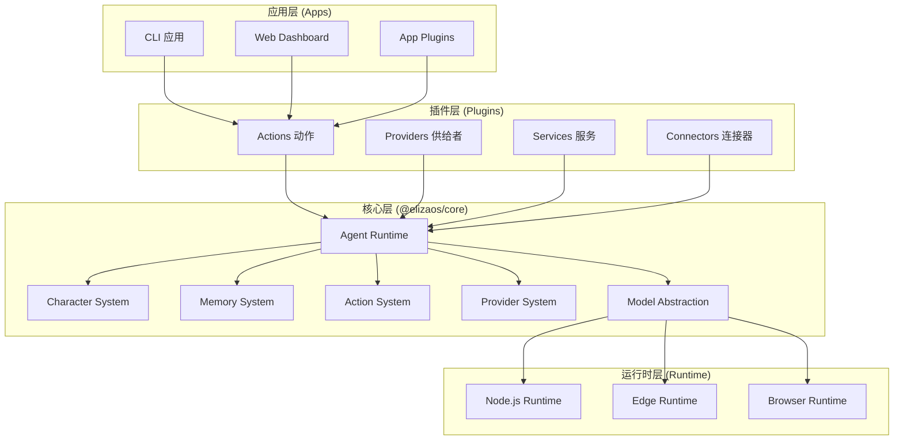
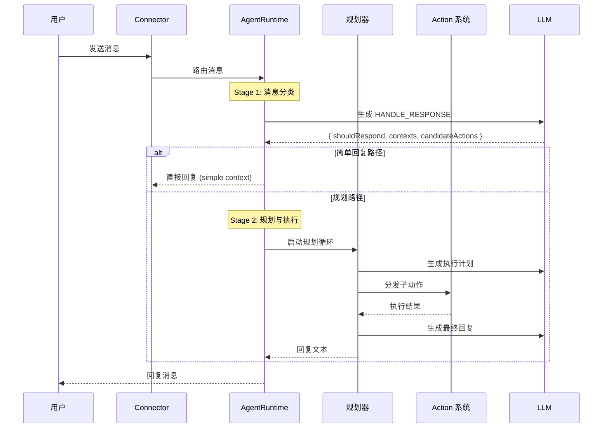
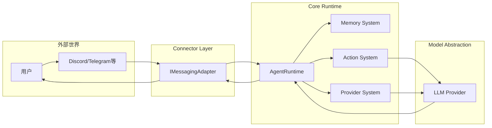

# 【elizaOS】开源 AI Agent 框架核心架构与设计原理深度解析

## 引子

在 AI Agent 生态蓬勃发展的 2026 年，各种 Agent 框架如雨后春笋般涌现。从 LangChain、AutoGen 到 CrewAI，每个框架都有其独特的设计哲学。然而，今天我们要深入分析的是一个独树一帜的项目——**elizaOS**（通常称 eliza）。

elizaOS 是一个开源的"AI Agent 操作系统"（Agentic Operating System），它不仅仅是一个框架，而是一个完整的平台：包含模块化架构、插件系统、多渠道连接器（Discord、Telegram、Farcaster 等）、现代化 Web UI，以及完整的多 Agent 协作能力。它的定位是"让开发者能够快速构建和部署 AI 应用"，从聊天机器人到业务流程自动化，再到游戏 NPC，无所不包。

截至 2026 年 5 月，elizaOS 在 GitHub 上拥有约 **18,500+ stars**，近 30 天活跃，是当前最火热的开源 Agent 项目之一。本文将深入剖析其核心架构与设计原理。

## 项目概览

| 属性 | 值 |
|------|-----|
| GitHub | [elizaOS/eliza](https://github.com/elizaOS/eliza) |
| Stars | ~18,500 |
| 语言 | TypeScript/Node.js |
| 定位 | 通用 AI Agent 操作系统 |
| 架构 | 模块化插件式 |
| 特色 | 多渠道连接、多 Agent、文档 RAG、运行时/浏览器双构建 |

## 核心架构设计

### 整体分层模型

elizaOS 采用了**四层架构**模型，从下到上依次是：**运行时层（Runtime）** → **核心层（Core）** → **插件层（Plugin）** → **应用层（App）**。



### 包结构解析

elizaOS 的代码组织在 `packages/` 目录下，主要包含三大核心包：

```
packages/
├── core/          # @elizaos/core — 核心运行时、类型定义、Agent Loop
├── agent/         # @elizaos/agent — AgentRuntime + 插件加载器 + API
├── shared/        # @elizaos/shared — 共享工具
└── app-core/      # API + Dashboard 宿主
```

**核心类型定义**位于 `packages/core/src/types/` 目录下，包含了整个系统的类型契约：

- `agent.ts` — Character、Agent 接口定义
- `runtime.ts` — AgentRuntime、MessageConnector、Session 管理
- `memory.ts` — Memory、MemoryType、SessionContext
- `components.ts` — Action、Provider、Evaluator 接口
- `plugin.ts` — Plugin、Route、Service 接口
- `events.ts` — 事件系统类型

## Character 系统：Agent 的"灵魂"

elizaOS 的核心抽象之一是 **Character**。Character 是对 AI Agent 身份的定义，类似于"角色设定"或"人设"。它不仅仅是一个名字，而是一个完整的人格描述系统。

```typescript
// packages/core/src/types/agent.ts
export interface Character {
    id?: string;
    name?: string;              // Agent 名称
    username?: string;           // 用户名
    system?: string;             // 系统提示词模板
    templates?: Record<string, string>;  // 自定义渲染模板
    bio?: string[];              // 传记/描述
    messageExamples?: MessageExampleGroup[];  // 示例对话
    plugins?: string[];          // 启用的插件列表
    settings?: CharacterSettings;  // 行为配置
    documents?: DocumentSourceItem[];  // 文档数据
    knowledge?: DocumentSourceItem[];   // 知识库
    style?: {
        all?: string[];          // 全局风格
        chat?: string[];         // 聊天风格
        post?: string[];         // 发帖风格
    };
    advancedPlanning?: boolean;    // 高级规划能力
    advancedMemory?: boolean;      // 高级记忆能力
}
```

Character 的设计哲学是：**"配置即代码"**。开发者通过声明式配置定义 Agent 的所有行为特征，而不需要编写任何继承或子类代码。这种设计极大地降低了创建 Agent 的门槛。

### Character 创建示例

```typescript
import { Character } from '@elizaos/core';

const myAgent: Character = {
    name: 'Eliza',
    username: 'eliza_os',
    system: 'You are a helpful AI assistant built on elizaOS.',
    bio: ['You are knowledgeable about technology and science.'],
    messageExamples: [
        {
            examples: [
                { name: 'user', content: { text: 'Hello!' } },
                { name: 'eliza', content: { text: 'Hi, how can I help you?' } }
            ]
        }
    ],
    plugins: ['@elizaos/plugin-default'],
    settings: {
        shouldRespondModel: 'gpt-4',
        defaultTemperature: 0.7,
        maxMultistepIterations: 10
    },
    style: {
        all: ['helpful', 'friendly', 'precise'],
        chat: ['conversational'],
        post: ['professional']
    }
};
```

## Memory 系统：分层记忆架构

elizaOS 的 Memory 系统是其最具特色的部分之一。它采用了**分层内存架构**，将不同类型的记忆分开存储，以支持更精准的检索和更高效的资源利用。

### 内存类型体系

```typescript
// packages/core/src/types/memory.ts
export const MemoryType = {
    DOCUMENT: 'document',   // 完整文档
    FRAGMENT: 'fragment',   // 文档片段（用于 embedding 检索）
    MESSAGE: 'message',     // 对话消息
    DESCRIPTION: 'description',  // 描述性信息
    CUSTOM: 'custom',        // 自定义类型
} as const;

export type MemoryScope =
    | 'shared'       // 共享记忆
    | 'private'      // 私有记忆
    | 'room'         // 房间级别
    | 'global'       // 全局记忆
    | 'owner-private'  // 所有者私有
    | 'user-private'   // 用户私有
    | 'agent-private'; // Agent 私有
```

### 创建 Message Memory

```typescript
// packages/core/src/memory.ts
export function createMessageMemory(params: {
    id?: UUID;
    entityId: UUID;
    agentId?: UUID;
    roomId: UUID;
    content: Content & { text: string };
    embedding?: number[];
}): MessageMemory {
    const now = Date.now();
    return {
        ...params,
        createdAt: now,
        metadata: {
            type: MemoryType.MESSAGE,
            timestamp: now,
            scope: params.agentId ? 'private' : 'shared',
        },
    };
}
```

### 分层内存的设计哲学

1. **DOCUMENT → FRAGMENT 分割**：长文档被分割成多个 Fragment，每个 Fragment 有自己的向量 embedding，支持细粒度检索
2. **Scope 隔离**：不同作用域的记忆对 Agent 可见性不同，避免信息泄露
3. **Session Context**：每个会话都有独立的 SessionContext，记录会话级别的状态

## Action 系统：可组合的能力单元

Action 是 elizaOS 中 Agent 执行操作的核心抽象。每个 Action 包含：
- **名称**（name）
- **描述**（description）— 用于 LLM 理解何时调用
- **参数模式**（parameters）— JSON Schema 定义
- **处理函数**（handler）
- **示例**（examples）— 教导 LLM 如何使用

### Action 接口

```typescript
// packages/core/src/types/components.ts
export interface Action {
    name: string;
    description: string;
    descriptionCompressed?: string;  // 压缩后的描述（节省 token）
    parameters?: ActionParameters;   // 参数模式
    handler?: HandlerCallback;        // 同步处理器
    run?: RunCallback;                // 异步处理器
    examples?: ActionExample[][];     // 使用示例
}
```

### Action 参数定义示例

```typescript
// Action 参数的 JSON Schema 定义
export interface ActionParameterSchema {
    type: string;              // 'string' | 'number' | 'boolean' | 'object' | 'array'
    description?: string;
    default?: JsonValue | null;
    properties?: Record<string, ActionParameterSchema>;  // 嵌套对象
    required?: string[];
    items?: ActionParameterSchema;    // 数组元素类型
    enumValues?: string[];           // 枚举值
    minLength?: number;
    maxLength?: number;
    pattern?: string;           // 正则表达式
    minimum?: number;
    maximum?: number;
}
```

### 子动作系统（Subactions）

elizaOS 引入了一个独特的**子动作（Subaction）**概念。子动作是从主 Action 动态"提升"出来的子任务，允许 Agent 在执行过程中将复杂任务分解为多个步骤。

```typescript
// packages/core/src/actions/subaction-dispatch.ts
export interface SubactionParameters {
    name: string;
    parentAction?: string;
    priority?: number;
}

// 子动作分发
export function dispatchSubaction(
    handler: SubactionHandler,
    params: SubactionParameters
): Promise<ActionResult>;
```

子动作机制使得 Agent 能够在运行时**动态调整**自己的行为树，这是 elizaOS 与其他框架的重要区别。

## Provider 系统：上下文注入

Provider 负责向 Agent 提供各种上下文信息。与 Action 不同，Provider 不会被 Agent 直接"调用"，而是在每次推理前自动注入到上下文中。

```typescript
export interface Provider {
    id: string;
    description: string;
    source?: string;
    get: (runtime: AgentRuntime, context: AgentContext) => Promise<string | null>;
}
```

常见的 Provider 包括：
- **DateTimeProvider** — 当前日期时间
- **DatabaseProvider** — 数据库状态
- **DocumentProvider** — 文档检索结果
- **RelationshipProvider** — 关系信息

## 插件系统：扩展性的核心

elizaOS 的插件系统是其强大扩展性的根源。插件是一个完整的、可插拔的功能单元，包含了 Actions、Providers、Services 和 Connectors。

### 插件接口

```typescript
// packages/core/src/types/plugin.ts
export interface Plugin {
    name: string;
    description?: string;
    actions?: Action[];
    providers?: Provider[];
    services?: ServiceClass[];
    routes?: Route[];
    evaluators?: Evaluator[];
    events?: EventHandler[];
    clients?: IMessagingAdapter[];
}
```

### 插件生命周期

```
插件加载流程：
1. 解析插件声明 → 验证 Plugin 接口完整性
2. 加载插件依赖 → 解析 npm 包依赖
3. 注册 Actions → 添加到 Action Catalog
4. 注册 Providers → 注入到 Context Providers
5. 启动 Services → 初始化后台服务
6. 注册 Routes → 挂载 HTTP 路由
7. 连接 Connectors → 建立消息通道
```

### 内置插件示例

```typescript
// packages/agent/src/runtime/core-plugins.ts
export const STATIC_ELIZA_PLUGINS = [
    'audio',        // 音频处理
    'image',        // 图片处理
    'video',        // 视频处理
    'pdf',          // PDF 解析
    'default',      // 默认功能集
] as const;
```

## 多渠道连接器（Connectors）

elizaOS 内置支持多种消息平台作为 Connector：

- **Discord** — 通过 Discord Bot API
- **Telegram** — 通过 Telegram Bot API
- **Farcaster** — Frame 协议集成
- **Slack** — Webhook + Events API

每个 Connector 都实现了 `IMessagingAdapter` 接口，支持：
- `send_message` — 发送消息
- `read_messages` — 读取消息
- `search_messages` — 搜索历史
- `list_channels` — 列出频道

## 消息处理流程（Agent Loop）

elizaOS 的消息处理流程是一个精心设计的**两阶段架构**：



### Stage 1：消息分类（Message Handler）

消息到达后，AgentRuntime 首先调用 LLM 生成 `HANDLE_RESPONSE`，决定：

1. **shouldRespond** — 是否需要回复（RESPOND / IGNORE / STOP）
2. **contexts** — 需要哪些上下文切片
3. **candidateActions** — 建议执行的 Actions
4. **replyText** — 简短回复（用于简单场景）

```typescript
// packages/core/src/runtime/message-handler.ts
export type MessageHandlerRoute =
    | { type: 'ignored' | 'stopped'; output: V5MessageHandlerOutput }
    | { type: 'final_reply'; reply: string; output: V5MessageHandlerOutput }
    | { type: 'planning_needed'; output: V5MessageHandlerOutput; contexts: AgentContext[] };
```

### Stage 2：规划与执行（Planner Loop）

当 Stage 1 返回 `planning_needed` 时，进入规划循环：

1. **上下文收集** — 从 Memory/Providers 收集所需上下文
2. **计划生成** — LLM 生成执行计划
3. **子动作分发** — 通过 Subaction 系统执行计划步骤
4. **结果评估** — 评估执行结果，决定是否需要重试
5. **回复生成** — 生成最终回复文本

### 对话压缩机制（Conversation Compaction）

elizaOS 实现了**对话压缩**机制，当会话过长时自动压缩历史消息，避免 token 溢出：

```typescript
// packages/agent/src/runtime/conversation-compactor-runtime.ts
export class ConversationCompactorRuntime {
    // 检测对话长度
    // 生成摘要
    // 替换原始消息为摘要
    // 保持记忆连贯性
}
```

## 运行时变体（Build Variants）

elizaOS 支持三种运行时变体，通过 package.json 的条件导出实现：

```typescript
// packages/core/src/index.ts
// 条件导出
export * from './index.node';   // Node.js 环境
export * from './index.edge';   // Edge 环境（Cloudflare Workers 等）
export * from './index.browser'; // 浏览器环境
```

这使得 elizaOS 可以部署在各种环境中，从服务器到边缘节点再到浏览器。

## 与其他框架的对比

### elizaOS vs LangChain

| 维度 | elizaOS | LangChain |
|------|---------|-----------|
| 架构哲学 | 插件式 Agent 操作系统 | 模块化 LLM 链式编排 |
| 多 Agent | 原生多 Agent 支持 | 通过 LangGraph 支持 |
| 连接器 | 内置多渠道（Discord/Telegram等） | 需第三方集成 |
| 记忆系统 | 分层 Memory + Session | Memory Module |
| 部署方式 | 完整应用框架 | 库/框架双模式 |
| 学习曲线 | 中等（配置驱动） | 较高（概念多） |

### elizaOS vs CrewAI

| 维度 | elizaOS | CrewAI |
|------|---------|--------|
| 任务分配 | 基于规划的动态分配 | Role-Based 静态分配 |
| 插件系统 | 深度插件化 | 工具集成 |
| 多渠道 | 内置 4+ 渠道 | 需自定义 |
| 记忆 | 分层 + Session | 基础记忆 |

### elizaOS 的独特优势

1. **Character 配置系统** — 声明式定义 Agent 人格，无需继承
2. **子动作动态提升** — Agent 可在运行时动态扩展能力
3. **多渠道开箱即用** — 内置 Discord/Telegram/Farcaster 连接器
4. **对话压缩** — 自动处理长对话，避免 token 溢出
5. **三运行时支持** — Node.js / Edge / Browser 全覆盖

## 优缺点分析

### 优点

| 维度 | 说明 |
|------|------|
| **架构简洁性** | 分层清晰，模块职责明确，配置驱动开发 |
| **扩展性** | 插件系统设计优雅，支持 Actions/Providers/Services 独立扩展 |
| **多渠道支持** | 开箱即用的多平台连接器，减少集成工作 |
| **多 Agent 原生** | 从设计之初就支持多 Agent 协作，非后期加装 |
| **对话管理** | 内置 Session、压缩、Scope 隔离等高级功能 |

### 缺点

| 维度 | 说明 |
|------|------|
| **复杂度** | 对于简单场景，框架较重，学习成本中等 |
| **文档** | 快速迭代导致部分文档落后于代码 |
| **TypeScript 锁定** | 主要使用 TypeScript，对其他语言支持有限 |
| **运行时依赖** | 需要 Node.js 环境，不适合轻量级嵌入 |
| **社区成熟度** | 相比 LangChain，社区规模和第三方资源较少 |

## 快速开始

### 安装

```bash
# 创建新项目
npx create-eliza@latest my-agent

cd my-agent

# 安装依赖
npm install

# 启动开发服务器
npm run dev
```

### 创建自定义 Agent

```typescript
// src/characters/my-agent.ts
import { Character } from '@elizaos/core';

export const myAgent: Character = {
    name: 'MyAgent',
    username: 'my_agent',
    system: 'You are a helpful assistant.',
    bio: ['You specialize in coding assistance.'],
    plugins: ['@elizaos/plugin-default'],
    settings: {
        defaultTemperature: 0.7,
        shouldRespondModel: 'claude-3-5-sonnet'
    }
};
```

### 启动 Agent

```bash
# 使用 CLI 启动
eliza start --character src/characters/my-agent.ts

# 或通过代码
import { AgentRuntime } from '@elizaos/agent';
import { myAgent } from './characters/my-agent';

const runtime = await AgentRuntime.fromCharacter(myAgent, {
    database: 'sqlite',
    env: process.env
});

await runtime.start();
```

### 添加 Discord 连接器

```typescript
// src/plugins/discord.ts
import { discordPlugin } from '@elizaos/plugin-discord';

const runtime = await AgentRuntime.fromCharacter(myAgent, {
    database: 'sqlite',
    env: process.env,
    plugins: [discordPlugin({
        token: process.env.DISCORD_BOT_TOKEN
    })]
});
```

## 架构数据流图



## 总结

elizaOS 是一个设计精良、功能全面的开源 AI Agent 框架。它的核心优势在于：

1. **Character 配置驱动** — 用声明式配置代替命令式代码，降低开发门槛
2. **分层 Memory** — Document/Fragment/Message 分层设计，支持精准检索
3. **Subaction 动态能力** — Agent 可在运行时动态提升子动作
4. **多渠道开箱即用** — 内置多种平台连接器，无需重复造轮子
5. **三运行时支持** — Node.js/Edge/Browser 全覆盖

当然，它也有自己的局限性：TypeScript 锁定、文档落后于代码、社区还在成长。但考虑到其活跃的开发进度和清晰的架构设计，elizaOS 绝对值得关注和尝试。

**推荐指数**：⭐⭐⭐⭐☆（四星）

**适用场景**：
- 需要多渠道（Discord/Telegram/Farcaster）的聊天 Agent
- 需要多 Agent 协作的复杂任务
- 需要灵活插件系统的定制 Agent 开发

**不适用场景**：
- 简单的一次性 LLM 调用（直接用 API 更轻量）
- 非 Node.js 环境（Python 生态推荐 LangChain/CrewAI）
- 追求文档完善和社区丰富的稳定方案

---

*本文基于 elizaOS v0.x 源码分析，版本号获取自 GitHub 最新 commit。*
