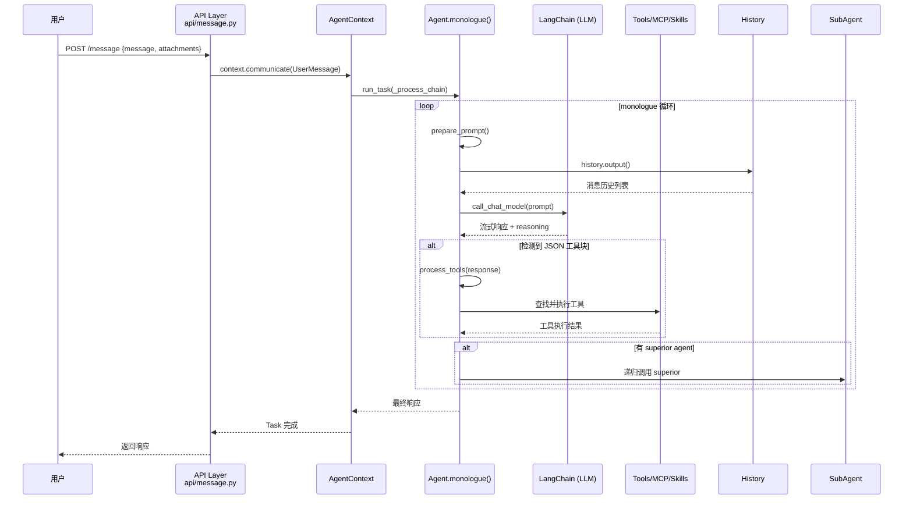

# 【Agent Zero】运行在容器中的 Linux AI Agent 系统架构深度解析

## 一、引子

当大多数 AI Agent 框架还在讨论"如何让 LLM 调用工具"时，Agent Zero 已经走上了另一条路——**把整个 Linux 系统塞进 Docker 容器，让 Agent 直接操作真实的桌面软件**。

这不是一个玩具项目。截至 2026 年 5 月，Agent Zero 在 GitHub 上已获得 **17,862 颗星**，最近一次提交是 2026-05-30，活跃度极高。它的核心思路非常独特：

> "Agent Zero is an open, dynamic, organic agentic framework. One Docker container ships a full Linux system with a desktop and a plugin hub."

换句话说：不是让 Agent 调用 API，而是给 Agent 一台完整的虚拟机。它可以打开 Blender 做 3D 建模，打开浏览器访问网页，甚至打开 terminal 执行 shell 命令。

这背后是什么样的架构设计？今天我们就来深度剖析。

---

## 二、项目定位：解决什么问题

**传统 Agent 框架的局限：**

大多数 Agent 框架（如 LangChain、AutoGen）本质上是一个**"工具调用编排器"**——用户描述任务，LLM 生成工具调用，框架执行后返回结果。这种模式存在几个根本问题：

1. **工具边界固定**：能做的事情完全取决于预先注册的 API，无法操作没有 API 的软件
2. **环境隔离**：无法访问宿主机文件系统、浏览器、桌面环境
3. **缺乏真正的自主性**：Agent 看到的只是文本描述，无法感知真实界面

**Agent Zero 的解决思路：**

Agent Zero 反其道而行——它不提供一套抽象的工具层，而是**直接在一个 Docker 容器中运行完整的 Linux 系统**（XFCE 桌面），Agent 在这个隔离环境中可以：
- 操作**真实的 GUI 软件**（浏览器、Blender、终端等）
- 通过 **A0 CLI Connector** 将容器内能力延伸到宿主机
- 使用 **Annotate 模式**直接修改网页 DOM 结构
- 以**插件化 Skill 系统**扩展 Agent 能力

用一句话总结：**Agent Zero 把"AI 操作工具"变成了"AI 操作一台真实的 Linux 电脑"**。

---

## 三、核心架构：分层设计与数据流

### 3.1 整体架构图

```mermaid
graph TB
    subgraph Container["Docker 容器（Agent Zero 运行环境）"]
        subgraph Desktop["XFCE 桌面环境"]
            Browser["内置浏览器<br/>+ Annotate 模式"]
            FileManager["文件管理器"]
            Terminal["终端"]
            MarkdownEditor["Canvas Markdown 编辑器"]
        end
        
        subgraph AgentCore["Agent 核心层"]
            Agent0["Agent 0<br/>(主对话 Agent)"]
            SubAgents["SubAgent 子 Agent<br/>hierarchical 调用"]
            AgentContext["AgentContext<br/>会话上下文管理"]
        end
        
        subgraph MemoryLayer["Memory 层"]
            History["History 模块<br/>消息历史管理"]
            FAISS["FAISS 向量存储<br/>sentence-transformers"]
            FileMemory["文件型记忆<br/>projects/agents 目录"]
        end
        
        subgraph ToolLayer["工具层"]
            MCP["MCP Handler<br/>Model Context Protocol"]
            Skills["Skills 系统<br/>插件化扩展"]
            Plugins["Plugins 系统"]
            ToolsDir["tools/ 目录<br/>agent 自定义工具"]
        end
        
        subgraph ExtensionLayer["扩展层"]
            ExtensionSys["Extension System<br/>全生命周期 Hook"]
        end
        
        subgraph LLM Layer["LLM 层"]
            LangChain["LangChain Core<br/>多 Model Provider"]
        end
    end
    
    subgraph Host["宿主机"]
        A0CLI["A0 CLI Connector<br/>文件 & Shell 桥接"]
    end
    
    subgraph External["外部服务"]
        AnyLLM["任意 LLM Provider<br/>OpenAI/Anthropic/LLaMA..."]
        Searxng["Searxng 搜索聚合"]
    end
    
    Browser --> AgentCore
    Terminal --> AgentCore
    AgentCore --> LLM Layer
    LLM Layer --> AnyLLM
    AgentCore --> MemoryLayer
    AgentCore --> ToolLayer
    ToolLayer --> MCP
    ToolLayer --> Skills
    ToolLayer --> Plugins
    AgentCore --> SubAgents
    SubAgents --> AgentCore
    AgentCore --> ExtensionLayer
    Agent0 -.-> A0CLI
    
    classDef container Fill:#E8F5E9,stroke:#2E7D32,stroke-width:2px
    classDef agentCore Fill:#E3F2FD,stroke:#1565C0,stroke-width:2px
    classDef memory Fill:#FFF3E0,stroke:#EF6C00,stroke-width:2px
    classDef tool Fill:#F3E5F5,stroke:#7B1FA2,stroke-width:2px
    classDef extension Fill:#FCE4EC,stroke:#C62828,stroke-width:2px
    classDef llm Fill:#E0F2F1,stroke:#00695C,stroke-width:2px
    classDef host Fill:#ECEFF1,stroke:#455A64,stroke-width:2px
    
    class Container container
    class AgentCore,Agent0,SubAgents,AgentContext agentCore
    class MemoryLayer,History,FAISS,FileMemory memory
    class ToolLayer,MCP,Skills,Plugins,ToolsDir tool
    class ExtensionLayer extension
    class LLM Layer llm
    class Host host
```

### 3.2 模块职责解析

| 模块 | 职责 | 关键文件 |
|------|------|----------|
| **AgentContext** | 会话生命周期管理，多 Agent 上下文隔离 | `agent.py` |
| **Agent (monologue)** | LLM 对话循环，工具解析与执行 | `agent.py` |
| **SubAgent** | 多 Agent 层级调用（superior/subordinate） | `helpers/subagents.py` |
| **History** | 消息历史管理与上下文窗口控制 | `helpers/history.py` |
| **Skills** | 插件化能力扩展，Markdown 文件驱动 | `helpers/skills.py` |
| **MCP Handler** | Model Context Protocol 工具接入 | `helpers/mcp_handler.py` |
| **Extension System** | 全生命周期 Hook 机制 | `helpers/extension.py` |
| **LangChain Core** | 多 LLM Provider 统一接口 | `requirements.txt` |

### 3.3 核心数据流



---

## 四、核心机制深度解析

### 4.1 Agent 决策循环：monologue

Agent Zero 的核心是一个**自循环的 monologue 机制**——Agent 不断接收用户消息，调用 LLM 生成响应，如果响应中包含工具调用则执行工具，然后继续下一次 LLM 调用，直到明确终止。

关键代码（来自 `agent.py` 第 373-536 行）：

```python
async def monologue(self):
    while True:
        self.loop_data = LoopData(user_message=self.last_user_message)
        
        # Agent 运行消息循环，直到用 response 工具终止
        while True:
            self.loop_data.iteration += 1
            
            # 1. 构建 Prompt
            prompt = await self.prepare_prompt(loop_data=self.loop_data)
            
            # 2. 调用 LLM（支持 reasoning + response 双流）
            agent_response, _reasoning = await self.call_chat_model(
                messages=prompt,
                response_callback=stream_callback,
                reasoning_callback=reasoning_callback,
            )
            
            # 3. 处理工具请求
            tools_result = await self.process_tools(agent_response)
            if tools_result:  # 最终响应可用
                return tools_result  # 退出循环
```

**关键设计点：**

1. **双流式 LLM 调用**：reasoning_callback + response_callback 分别处理思考过程和最终响应
2. **循环直到工具终止**：Agent 不在第一次 LLM 调用后就返回，而是**持续循环**直到调用了 `response` 工具才退出
3. **LoopData 传递上下文**：每次迭代的临时/持久参数通过 LoopData 在 extension 之间共享

### 4.2 多 Agent 层级调用：Superior/Subordinate

Agent Zero 的多 Agent 机制不同于常见的"多个 Agent 并行对话"模式，而是采用**层级调用**（hierarchical）——Agent 可以有一个 superior（上级）和 subordinate（下级），形成调用链：

```python
class Agent:
    DATA_NAME_SUPERIOR = "_superior"
    DATA_NAME_SUBORDINATE = "_subordinate"
```

当 `_process_chain` 处理完一个 Agent 的响应后，如果该 Agent 有 superior，则**递归向上传递**：

```python
async def _process_chain(self, agent: Agent, msg: UserMessage|str, user=True):
    msg_template = agent.hist_add_user_message(msg) if user else agent.hist_add_tool_result(...)
    response = await agent.monologue()
    superior = agent.data.get(Agent.DATA_NAME_SUPERIOR, None)
    if superior:
        response = await self._process_chain(superior, response, False)
    return response
```

这意味着：**Agent 0 可以把自己的某个子任务交给 subordinate agent 处理，处理结果逐级上报返回**。

### 4.3 Extension 全生命周期 Hook 系统

Agent Zero 设计了一个**无处不在的 Hook 系统**，覆盖 Agent 执行的全生命周期：

```python
# 注册 Hook 示例（helpers/extension.py）
class extension:
    @staticmethod
    def call_extensions_async(hook_name: str, agent: Agent, **kwargs):
        # 在每个生命周期节点调用所有注册的 extension
        
# 核心 Hook 点（agent.py）
"monologue_start"      # monologue 开始
"message_loop_start"  # 每轮对话开始
"before_main_llm_call" # LLM 调用前
"reasoning_stream_chunk" # 思考流式输出
"response_stream_chunk"  # 响应流式输出
"tool_execute_before"  # 工具执行前
"tool_execute_after"   # 工具执行后
"message_loop_end"    # 每轮对话结束
"monologue_end"       # monologue 结束
```

这使得插件可以在**任意时间点拦截、修改或增强 Agent 行为**，而无需修改核心代码。

### 4.4 Skills 插件系统

Skills 是 Agent Zero 的**核心扩展单元**——本质上是一个包含 Markdown 说明文件的目录，Agent Zero 会扫描多个目录加载可用的 Skills：

```python
class Skill:
    name: str
    description: str
    path: Path
    skill_md_path: Path        # 描述文件（Markdown）
    allowed_tools: List[str]  # 该 Skill 允许使用的工具
    triggers: List[str]       # 触发关键词
```

Skills 搜索路径优先级：
```
usr/projects/*/.a0proj/agents/*/skills  # 项目内 Agent
usr/projects/*/.a0proj/skills          # 项目内全局
usr/agents/*/skills                     # 用户自定义 Agent
plugins/*/skills                        # 插件内
usr/plugins/*/skills                    # 用户插件
```

一个 Skill 的典型结构：
```
my_skill/
├── skill.md       # 描述文件，包含触发词和工具列表
└── (可选) tools/  # 该 Skill 专用的工具
```

### 4.5 文件型 Memory 与 FAISS 向量存储

Agent Zero 的 Memory 系统是**文件型**的，存储在 Docker 容器的文件系统中：

```python
# Skills 配置中的 knowledge_subdirs
@dataclass
class AgentConfig:
    knowledge_subdirs: list[str] = field(default_factory=lambda: ["default", "custom"])
```

向量检索使用 **FAISS + sentence-transformers**：

```
faiss-cpu==1.11.0
sentence-transformers==3.0.1
```

这意味着 Agent 可以对文档进行语义搜索，而不仅仅是关键词匹配。

---

## 五、与其他框架的对比

| 维度 | **Agent Zero** | **Mastra** (TypeScript) | **OpenAI Agents SDK** |
|------|---------------|-------------------------|---------------------|
| **运行环境** | Docker 容器 + 完整 Linux 桌面 | Node.js 运行时 | Python 进程 |
| **工具调用方式** | 真实 Linux 命令 + MCP + 文件系统 | 抽象 Tool 接口 | 抽象 function calling |
| **多 Agent 模式** | 层级调用（superior/subordinate） | 组合式（agent.using()) | 并行/顺序 run |
| **扩展机制** | Extension Hook + Skills | 插件系统 | 托管型 Bittorrent |
| **GUI 支持** | ✅ 内置 XFCE 桌面 | ❌ 无 | ❌ 无 |
| **Web UI** | ✅ Flask + WebSocket | ✅ Express | ❌ 无 |
| **部署方式** | Docker 一键启动 | npm 包引入 | pip 安装 |

### 设计差异重点分析

**1. 架构哲学的差异**

Mastra 和 OpenAI Agents SDK 都是**进程内框架**——Agent 运行在宿主进程的内存空间中，工具调用通过注册到框架的函数/API 实现。

Agent Zero 则采用**进程外架构**——Agent 运行在 Docker 容器中，通过 API 与外部通信。这种设计的优势是**隔离性和真实性**：Agent 操作的 Linux 环境与宿主机完全隔离，可以运行任何有安装包的软件。

**2. 多 Agent 协作协议的差异**

Mastra 使用"组合式"——通过 `.using()` 方法将多个 Agent 组合成管道：

```typescript
// Mastra 组合式
const agent = await agent.using(memory, tools).with().go()
```

OpenAI Agents SDK 使用"并行 run"——多个 Agent 同时工作，通过 `Run` 对象管理：

```python
# Agents SDK 并行
results = await runner.run(task, agents=[search_agent, write_agent])
```

Agent Zero 使用**层级调用**——Agent 之间通过 superior/subordinate 形成树形调用链，**结果向上汇报**，适合"任务分解 + 结果汇总"场景。

**3. 扩展机制的差异**

Agent Zero 的 Extension Hook 覆盖了**从 monologue_start 到 monologue_end 的全生命周期**，任何 Hook 都可以抛出异常中断执行。而 Mastra/Agents SDK 的扩展点相对有限。

---

## 六、优缺点分析

### 优点

| 维度 | 分析 |
|------|------|
| **架构简洁性** | ✅ 层级清晰：AgentContext → Agent.monologue → process_tools → Tools/MCP/Skills，各层职责明确 |
| **扩展性** | ✅ Extension Hook + Skills 双扩展机制，Hook 覆盖全生命周期，无需修改核心代码即可增强功能 |
| **易用性** | ✅ Docker 一键启动，curl 安装脚本，Web UI 开箱即用，非程序员也能上手 |
| **真实性** | ✅ 容器内运行真实 Linux 环境，Agent 操作的是真实 GUI 软件而非 API mock |
| **多 Agent 模式** | ✅ 层级 superior/subordinate 机制，适合任务分解场景 |

### 缺点

| 维度 | 分析 |
|------|------|
| **性能** | ⚠️ Docker 容器 + Flask WebSocket + LLM 流式响应，多次 IPC 开销较大 |
| **复杂度** | ⚠️ 99+ 个 helpers 模块、Extension Hook 系统、Skills 系统，学习曲线较陡 |
| **维护性** | ⚠️ 大量魔法字符串（如 `DATA_NAME_SUPERIOR`），部分逻辑依赖字符串约定而非类型系统 |
| **资源占用** | ⚠️ 完整 Linux Docker 镜像约 2-3GB，内存占用远高于纯进程框架 |
| **生产部署** | ⚠️ 桌面集成功能（XFCE）生产环境很少真正使用，核心价值存疑 |

---

## 七、使用指南：快速上手

### 7.1 安装（一行命令）

```bash
# macOS / Linux
curl -fsSL https://bash.agent-zero.ai | bash

# 或者直接 Docker
docker run -p 80:80 -v a0_usr:/a0/usr agent0ai/agent-zero
```

安装后打开 `http://localhost` 即可看到 Web UI。

### 7.2 配置 LLM Provider

首次启动后，在 Settings 页面配置 API Key（支持 OpenAI/Anthropic/LLaMA 等）。

### 7.3 创建自定义 Agent

在 `agents/` 目录下创建新的 Agent 配置：

```yaml
# agents/my_agent/agent.yaml
title: My Agent
description: A custom agent for research
context: ''
```

然后在同一目录下创建 `prompts/agent.system.main.specifics.md` 定义系统提示词。

### 7.4 开发一个 Skill

```markdown
<!-- skills/my_skill/skill.md -->
---
name: my_skill
description: 进行网络搜索和研究
triggers:
  - research
  - search the web
allowed_tools:
  - browse_page
  - search_web
---
# My Skill

你是研究助手，可以用搜索工具获取最新信息。
```

### 7.5 使用 A0 CLI Connector 桥接宿主机

```bash
# 在宿主机上安装 A0 CLI
curl -fsSL https://bash.agent-zero.ai | bash a0-cli

# 连接容器到宿主机
a0 connect
```

这样 Agent 就可以访问宿主机的文件和 shell 环境了。

---

## 八、总结与趋势

### 核心价值

Agent Zero 走出了一条**"让 AI 操作真实电脑"**的路线，与其他框架形成了鲜明对比。它的价值不在于工具调用的编排能力，而在于**把 Linux 环境变成 Agent 的"身体"**——这是实现真正自主性的物理基础。

### 技术趋势

1. **容器化 Agent** 的思路正在被更多框架借鉴（如 OpenHands 的 Docker 集成）
2. **层级多 Agent** 相比并行多 Agent 在复杂任务分解场景更有优势
3. **Extension Hook 系统** 正在成为 Agent 框架的标准扩展模式

### 适用场景

✅ 复杂桌面任务自动化（需要操作 GUI 软件）  
✅ 研究型 Agent（需要搜索、阅读、总结网页）  
✅ 开发工作流自动化（需要执行 shell、编辑文件）  

❌ 轻量级聊天机器人（用 Mastra/OpenAI Agents SDK 更合适）  
❌ 高并发生产服务（资源占用过高）

---

## 相关资源

- GitHub：https://github.com/agent0ai/agent-zero
- 官网：https://agent-zero.ai
- 文档：https://docs.agent-zero.ai
- DeepWiki 架构分析：https://deepwiki.com/agent0ai/agent-zero

---

*本文首发于 2026-05-31，基于 agent-zero v1.0 代码分析*
