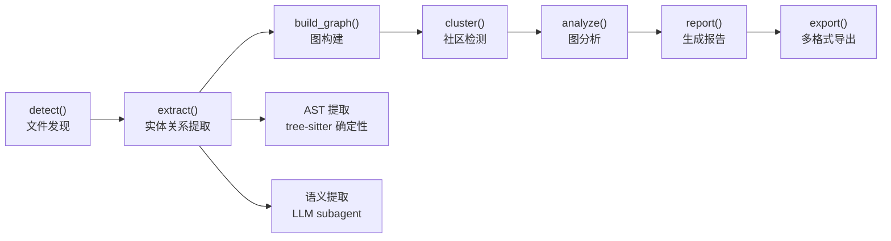
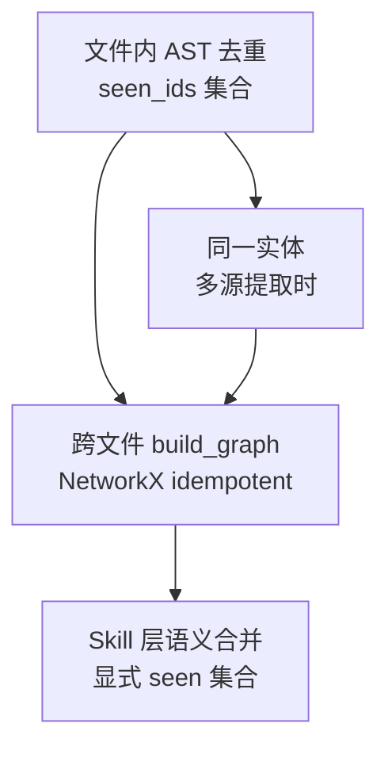

# 【Graphify】Y Combinator S26 明星项目——将任意代码库转化为可查询知识图谱的 AI 技能深度解析

## 引子

当我们面对一个陌生的代码仓库时，往往面临一个两难困境：需要了解整体架构才能高效提问，但了解整体架构又需要先读大量代码。传统的做法是先 grep 浏览文件，再顺着 import/call 关系逐步深入——这个过程是线性且低效的。

Graphify 解决的就是这个问题：**把任意文件夹（代码、文档、论文、图片、视频）转化为一幅可导航、可查询、可视化的知识图谱**。你不再是线性地读代码，而是以图的方式探索任意节点之间的关联。

这个项目在 2026 年 4 月 3 日上线 GitHub，两个月内斩获 **57,346 ⭐**，迅速登上 Y Combinator S26 队列，并在 GitHub Trending 多个分类中霸榜。

## 项目概览

| 属性 | 值 |
|------|-----|
| **项目名** | Graphify |
| **GitHub** | [safishamsi/graphify](https://github.com/safishamsi/graphify) |
| **Stars** | 57,346 |
| **License** | MIT |
| **语言** | Python |
| **Y Combinator** | S26 |
| **PyPI 包** | graphifyy（双 y） |
| **支持平台** | Claude Code, Codex, OpenCode, Cursor, Gemini CLI, GitHub Copilot CLI, VS Code Copilot Chat, Aider, Amp, OpenClaw, Factory Droid, Trae, Hermes, Kimi Code, Kiro, Pi, Google Antigravity |

## 核心定位

Graphify 的本质是一个 **Agent Skill**（智能体技能），同时也是一套 **Python 库**。它将结构化信息提取（AST）与语义理解（LLM）相结合，把任意文件集合转化为关系图谱，支持 GraphRAG 风格的检索。

一句话总结：**把代码/文档/论文/图片/视频变成知识图谱，让 AI 编码助手可以图检索而非线性 grep。**

## 架构设计

### 整体 Pipeline



Graphify 的 pipeline 由七个阶段组成，每个阶段是独立模块，模块间通过纯 Python dict 和 NetworkX 图通信，无共享状态，输出到 `graphify-out/` 目录。

### 核心模块职责

| 模块 | 函数 | 输入 → 输出 |
|------|------|-------------|
| `detect.py` | `detect(root)` | 目录 → 文件列表（按类型分类） |
| `extract.py` | `extract(path)` | 文件路径 → `{nodes, edges}` dict |
| `build.py` | `build_graph(extractions)` | extraction 列表 → `nx.Graph` |
| `cluster.py` | `cluster(G)` | 图 → 带社区标签的图 |
| `analyze.py` | `analyze(G)` | 图 → 分析结果（核心节点、跨社区连接、建议问题） |
| `report.py` | `render_report(G, analysis)` | 图+分析 → GRAPH_REPORT.md |
| `export.py` | `export(G, out_dir)` | 图 → JSON/HTML/SVG/Obsidian/Neo4j |

### 双提取机制：结构化 + 语义化

这是 Graphify 最关键的设计决策。

#### Part A：AST 提取（确定性，零成本）

```python
# graphify/extract.py 核心逻辑（简化）
def extract(paths: list[Path], cache_root: Path) -> dict:
    """
    1. 按文件类型分发到不同 extractor
    2. tree-sitter 解析 AST
    3. 收集 nodes（函数/类/变量）和 edges（imports/calls/uses）
    4. 对每个 node 生成唯一 ID（NFKC 规范化）
    """
    nodes, edges = [], []
    for path in paths:
        if path.suffix in CODE_EXTENSIONS:
            result = tree_sitter_extract(path)  # 确定性，无 LLM 调用
            nodes.extend(result["nodes"])
            edges.extend(result["edges"])
        elif path.suffix in DOC_EXTENSIONS:
            # 文档走 Part B（语义提取）
            ...
    return {"nodes": nodes, "edges": edges}
```

tree-sitter 提取覆盖 30+ 种编程语言：Python, TypeScript, JavaScript, Go, Rust, Java, C/C++, Ruby, Swift, Kotlin, C#, Scala, PHP 等。

每条边有一个置信度标签：

| 标签 | 含义 |
|------|------|
| `EXTRACTED` | 源码中明确声明（如 import 语句） |
| `INFERRED` | 合理推断（如 call-graph 第二遍推导） |
| `AMBIGUOUS` | 不确定；标记到 GRAPH_REPORT.md 待人工审核 |

#### Part B：语义提取（LLM，成本较高）

对于文档、论文、图片、视频，AST 无法理解内容，Graphify 通过 Claude Code subagent 分发语义提取任务。每个 subagent 读取文件内容，生成结构化的 `{nodes, edges, hyperedges}`。

```python
# graphify/llm.py LLM 后端配置
BACKENDS: dict[str, dict] = {
    "claude": {
        "base_url": "https://api.anthropic.com",
        "default_model": "claude-sonnet-4-6",
        "pricing": {"input": 3.0, "output": 15.0},  # USD / 1M tokens
    },
    "kimi": {
        "base_url": "https://api.moonshot.ai/v1",
        "default_model": "kimi-k2.6",
        "pricing": {"input": 0.74, "output": 4.66},
    },
    "gemini": {
        "base_url": "https://generativelanguage.googleapis.com/v1beta/openai/",
        "default_model": "gemini-3-flash-preview",
    },
    "ollama": {
        "base_url": os.environ.get("OLLAMA_BASE_URL", "http://localhost:11434/v1"),
        "default_model": os.environ.get("OLLAMA_MODEL", "qwen2.5-coder:7b"),
    },
}
```

### 社区检测：Leiden vs Louvain

```python
# graphify/cluster.py
def _partition(G: nx.Graph, resolution: float = 1.0) -> dict[str, int]:
    """
    优先使用 graspologic 的 Leiden 算法（质量最高）
    回退到 networkx 内置的 Louvain
    """
    try:
        from graspologic.partition import leiden
        result = leiden(stable, random_seed=42, trials=1, resolution=resolution)
        return result
    except ImportError:
        # networkx 2.7+ 内置 louvain_communities
        communities = nx.community.louvain_communities(stable, seed=42, resolution=resolution)
        return {node: cid for cid, nodes in enumerate(communities) for node in nodes}
```

Leiden 算法比 Louvain 更精细，能检测嵌套社区，且保证社区划分是**节点连接足够强**的分区。

### 三种输出格式

```mermaid
graphify-out/
├── graph.html      # 交互式图谱（点击节点、过滤、搜索）
├── graph.json      # 完整图数据（GraphRAG 可用）
├── GRAPH_REPORT.md # 关键概念、跨社区连接、建议问题
├── graph.svg      # SVG 向量图（嵌入 Notion/GitHub）
└── cypher.txt      # Neo4j Cypher 导入脚本
```

## 核心机制解析

### 节点去重：三层过滤



1. **文件内 AST**：每个 extractor 维护 `seen_ids`，同一文件内重复定义合并
2. **跨文件 build**：NetworkX 的 `G.add_node()` 是幂等的，后来的覆盖前面的（语义节点优先级高于 AST 节点）
3. **Skill 层语义合并**：缓存命中与新提取结果在合并前用 `seen` 集合去重

### ID 规范化：NFKC 标准化

```python
# graphify/extract.py
def _make_id(*parts: str) -> str:
    """
    1. NFKC 规范化（Unicode 等价性）
    2. 非字母数字字符替换为下划线
    3. 多下划线合并
    4. 大小写折叠（casefold）
    """
    normalized = unicodedata.normalize("NFKC", "".join(parts))
    cleaned = re.sub(r"[^\w]+", "_", normalized, flags=re.UNICODE)
    cleaned = re.sub(r"_+"", "_", cleaned)
    return cleaned.strip("_").casefold()
```

这确保了跨语言的 ID 一致性——同一个 Python 函数和它在 TypeScript 里的对应 wrapper，不会因为命名差异产生重复节点。

### 语义缓存：增量更新

```python
# graphify/cache.py
def check_semantic_cache(all_files: list[str]) -> tuple:
    """
    返回: (cached_nodes, cached_edges, cached_hyperedges, uncached_files)
    """
    # 检查每个文件是否有对应的缓存条目
    # 缓存 key = 文件内容 hash（而非文件路径）
    # 即：文件内容不变就不重新提取
```

缓存机制确保增量更新时只重新提取变更的文件，降低 token 成本。

### MCP 服务模式

Graphify 支持以 MCP（Model Context Protocol）stdio 服务器模式运行，让 Agent 可以通过标准 MCP 协议查询图谱：

```python
# graphify/serve.py
def start_server(graph_path: Path):
    """
    启动 MCP stdio 服务器
    Agent 通过 MCP 协议查询图谱节点、边、路径
    """
```

## 安装与使用

### 安装（一行命令）

```bash
# 推荐：uv（自动配置 PATH）
uv tool install graphifyy

# 备选：pipx
pipx install graphifyy

# 注册为 Claude Code Skill
graphify install
```

### 基本使用

```bash
# 完整 pipeline（当前目录）
/graphify .

# 指定路径
/graphify ./my-project

# GitHub URL 直接分析
/graphify https://github.com/safishamsi/graphify

# 深度模式（更多 INFERRED 边）
/graphify ./project --mode deep

# 增量更新
/graphify ./project --update

# 启动 MCP 服务
/graphify ./project --mcp

# 查询图谱
/graphify query "Authentication module calls哪些服务？"
/graphify path "AuthModule" "Database"
/graphify explain "SwinTransformer"
```

### 输出示例

```bash
$ /graphify .
Corpus: 1,247 files · ~320k words
  code:     892 files (.py .ts .go .rs ...)
  docs:     312 files (.md .txt ...)
  papers:   43 files (.pdf ...)
  
Transcribed 5 video file(s) -> treating as docs

AST: 48,291 nodes, 67,402 edges
Semantic (12 agents, ~3m): 8,441 nodes, 12,003 edges

graphify-out/
├── graph.html       (interactive, open in browser)
├── graph.json       (GraphRAG ready)
├── GRAPH_REPORT.md  (highlights)
└── cypher.txt       (Neo4j import)
```

## 与同类项目对比

| 维度 | Graphify | OpenViking | cognnee |
|------|-----------|-----------|---------|
| **定位** | AI 编码助手 Skill + Python 库 | 企业级上下文数据库 | Memory 控制平面 |
| **核心能力** | 任意文件→知识图谱 | 上下文压缩存储 | 多租户记忆层 |
| **提取方式** | AST（tree-sitter）+ LLM subagent | RAG + chunk 压缩 | 语义图谱构建 |
| **多语言支持** | 30+ 编程语言 | 主要代码文件 | 代码/文档 |
| **平台覆盖** | 20+ AI 编码平台 | API 调用 | 主要 AI 应用 |
| **输出格式** | HTML/JSON/SVG/Obsidian/Neo4j | 数据库直接查询 | API + 可视化 |
| **License** | MIT | 闭源 | MIT |
| **部署模式** | 本地 CLI / MCP server | 云端托管 | 私有部署 |
| **Y Combinator** | S26 | 否 | 否 |

**核心设计差异：**

1. **Graphify vs OpenViking**：OpenViking 侧重上下文压缩存储（解决 context 溢出），Graphify 侧重全代码库的**图谱化**——把代码结构变成可遍历的图，而非压缩成向量片段
2. **Graphify vs cognnee**：cognnee 专注"Memory 控制平面"，解决 Agent 的记忆管理问题；Graphify 更像是"代码理解工具"，将任意代码库变成可查询的图，语义提取是手段而非目的
3. **平台策略**：Graphify 选择做**所有 AI 编码平台的 Skill**，而非绑定单一平台——这是典型的"工具层"策略，而非"应用层"策略

## 优缺点分析

### 优势

**左侧：架构简洁性 / 扩展性 / 易用性**

- **模块职责清晰**：7 个阶段各司其职，通过 dict 和 NetworkX 图通信，无隐藏依赖
- **语言扩展简单**：新增语言只需在 `extract.py` 添加 `extract_<lang>()` 函数，更新 `CODE_EXTENSIONS`，符合开放-封闭原则
- **Skill 模式降低门槛**：用户无需理解图谱概念，`/graphify .` 即可使用，对 AI 编码助手用户极为友好
- **多格式导出**：HTML/JSON/SVG/Obsidian/Neo4j，覆盖从个人浏览到企业图数据库的全场景

**右侧：性能 / 复杂度 / 维护性**

- **语义提取成本可控**：缓存机制（内容 hash）避免重复 token 消耗；支持 Gemini/Kimi 等低成本后端
- **增量更新友好**：`--update` 只重新提取变更文件，大型仓库无需全量重跑
- **Tree-sitter 确定性**：AST 提取是确定性的，零 LLM 成本，覆盖所有代码文件

### 挑战

- **图谱质量依赖 LLM 语义提取**：对于复杂领域（Django/React 生态），LLM subagent 可能遗漏关键依赖关系
- **超大型仓库成本**：百万行代码的图谱构建，语义提取 token 成本可能高达数百美元（虽然有缓存）
- **图可视化在大图上受限**：graph.html 在节点数超过 10k 时交互可能卡顿
- **社区检测参数调优**：Leiden/Louvain 的 resolution 参数需要根据图结构手动调整

## 深度技术细节

### Tree-sitter 提取的信心度机制

Graphify 的 AST 提取不仅做节点和边的收集，还做**call-graph 第二遍推导**：

```python
# 第一次遍历：收集所有函数/类定义（EXTRACTED edges）
# 第二次遍历：根据调用关系推断（INFERRED edges）
# 例如：一个函数调用了 `auth_flow()`，但没有直接 import，
# 那么调用关系标记为 INFERRED，置信度低于显式 import
```

这解决了静态分析中常见的问题：跨文件的隐式依赖（如通过中间层代理调用）。

### 超大社区拆分

```python
# graphify/cluster.py
_MAX_COMMUNITY_SIZE = 300  # 硬编码上限

def cluster(G: nx.Graph, resolution: float = 1.0) -> nx.Graph:
    # 如果某个社区超过 300 个节点，
    # 递归地用更高 resolution 再次聚类
    # 直到所有社区都在阈值内
```

这确保了 GRAPH_REPORT.md 的可读性——一个 3000 节点的单一社区会被拆成多个子社区，每个子社区有其独立的"核心节点"和"跨社区连接"。

### 安全验证层

```python
# graphify/security.py
def validate_url(url: str) -> str:
    # 只允许 http/https
    # 阻止 file://  redirection 攻击
    # 限制响应大小（防止 SSRF）

def sanitize_label(label: str) -> str:
    # 去除控制字符
    # 最多 256 字符
    # HTML 转义（防止 XSS）
```

Graphify 的所有外部输入都经过安全验证层，防止图谱生成过程中的 SSRF 和 XSS 攻击。

## 适用场景

1. **代码库导航**：在陌生项目中快速找到两个模块之间的最短路径
2. **跨文档关联**：发现文档中未被显式引用但语义相关的主题
3. **技术尽调**：在代码审查中快速了解项目的整体架构和模块边界
4. **GraphRAG**：将图谱 JSON 用于 RAG 系统的结构化检索
5. **知识库构建**：将论文/文档转化为图谱，支持按主题而非关键词检索

## 趋势与展望

Graphify 的出现代表了 AI 编码助手的下一步方向：**从"读代码"到"理解代码"**。当 Agent 可以图检索而非向量检索时，它对代码库结构的理解会更深入，跨模块的推断能力也会更强。

随着 MCP 协议的普及，像 Graphify 这样通过 MCP 提供结构化知识的服务，会成为 AI 编码助手生态中的重要基础设施层。

---

**项目链接**：https://github.com/safishamsi/graphify  
**PyPI**：https://pypi.org/project/graphifyy  
**官网**：https://graphifylabs.ai

## 对比分析

Graphify 的核心是"把代码库/文档/媒体都建为可查询的知识图谱"。在"代码知识图谱"这条赛道上，能拿出来横向对比的真正项目是微软 GraphRAG、aider 的 repo map，以及 Sourcegraph。下面从知识表达、检索范式、构建成本三个维度展开。

### 维度一：知识表达

| 项目 | 节点类型 | 边类型 | 关系挖掘方式 |
|------|----------|--------|----------------|
| **Graphify** | 代码符号、文档段落、图片对象、视频关键帧 | 引用、调用、包含、语义相似 | LLM 抽取 + embedding + 静态分析 |
| **GraphRAG (Microsoft)** | 实体（人/概念/事件） | 关系类型 | LLM 抽取 + 社区发现（Leiden） |
| **Sourcegraph (code graph)** | 代码符号、定义、引用 | 类型/调用/导入 关系 | 静态分析（LSIF/SCIP） |
| **aider repo map** | 文件 + 类/函数符号 | import / 调用 | 静态扫描 + tag 压缩 |

### 维度二：检索范式

- **Graphify**：支持"图遍历"和"向量检索"双模式，通过 MCP 暴露给 LLM，Agent 可以混合调用
- **GraphRAG**：基于"实体 + 社区摘要"的全局/局部双层检索，强项是"全文总结性问题"
- **Sourcegraph**：强项是"精确符号搜索 + 跨仓引用"，对 IDE 集成最友好
- **aider repo map**：把整个仓库压成"标签树"塞进 prompt，简单粗暴但有效

### 维度三：构建成本 & 适用规模

- Graphify：多模态内容都能进图，适合"代码 + 文档 + 截图/视频"混合分析；缺点是 LLM 抽取成本高
- GraphRAG：纯 LLM 抽取 + 社区发现，对大文本（百万 token 级别）效果惊艳，但首次构建很贵
- Sourcegraph：需要部署 code-intel 索引服务，运维成本高；适合"超大型 monorepo + 团队"
- aider repo map：零成本、即时生成；缺点是表达能力弱，没有跨文件语义

**优缺点小结**

- **Graphify**：多模态 + GraphRAG + MCP 三件套是它的差异化卖点；缺点是 LLM 抽取成本与延迟，仍在快速迭代
- **GraphRAG (Microsoft)**：适合"对长文档做主题/全局提问"；缺点是仅文本、不支持代码符号
- **Sourcegraph**：代码搜索的事实标准；缺点是体量重，不适合小仓库或个人项目
- **aider repo map**：轻量务实；缺点是无持久知识图谱，会话结束即丢弃

**何时选 Graphify**

- 你希望"代码 + 文档 + 媒体"统一成一张可查询图谱
- 你的 Agent 通过 MCP 调用工具，希望把"代码理解"作为结构化服务
- 你在做 monorepo 级别的知识检索

**何时不选 Graphify**

- 只需要"文本主题级问答"——GraphRAG 更轻
- 你的核心是"跨仓代码搜索"——Sourcegraph 是行业标杆
- 你只想给 LLM 一个小上下文摘要——aider repo map 够用

**参考资料**

- Graphify GitHub：<https://github.com/safishamsi/graphify>
- GraphRAG 论文：<https://arxiv.org/abs/2404.16130>
- Sourcegraph：<https://sourcegraph.com/docs/code-intelligence>
- aider repo map：<https://aider.chat/2023/10/22/repo-map.html>
- MCP 协议：<https://modelcontextprotocol.io/>